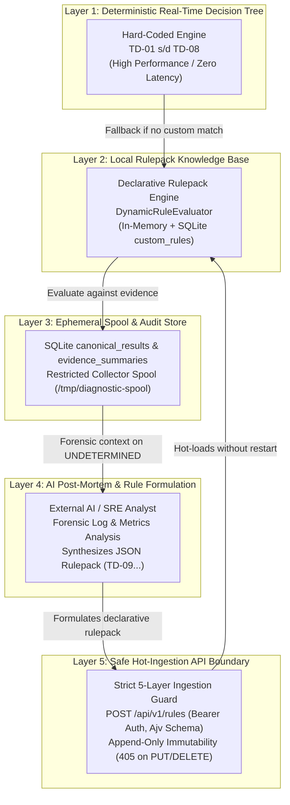

# TN-020 — Consolidate Diagnostic MVP Portfolio and Plan Monitoring Platform Integration Phase

| Field | Value |
| --- | --- |
| Status | Completed |
| Activity Type | Documentation Consolidation |
| Record Type | Live |
| Project | Tomcat Monitoring |
| Phase | Diagnostic MVP Pilot |
| Activity Date | 2026-09-03 |
| Recorded Date | 2026-09-03 |
| Owner | Antigravity Agent |
| Working Mode | Write |
| Authorization Status | Approved |
| Approved By | Eddy Wiyatno |
| Approval Date | 2026-09-03 |

## 🎯 Objective

1. Mengkonsolidasikan seluruh portofolio capaian teknis dan arsitektur dari fase **Diagnostic MVP Pilot** ([TN-001](TN-001-define-diagnostic-mvp-architecture-and-contract.md) s/d [TN-019](TN-019-verify-ai-enrichment-and-incident-remapping.md)) ke halaman-halaman dokumentasi utama DevOps Handbook (`index.md`, `architecture/index.md`, `development/index.md`, `infrastructure/index.md`, `diagnostic-mvp/index.md`, dan `engineering-journal/index.md`).
2. Memutakhirkan status implementasi sistem dari *In Progress / Pending* menjadi **100% Completed and Live-Verified** pada lingkungan persisten `devops-lab`.
3. Menyusun ringkasan aset arsitektur portofolio (*Architectural Portfolio Assets*): *5-Layer Knowledge Base and AI Enrichment Architecture*, *Declarative Rulepack Engine*, *Append-Only Rules API*, *Deterministic RCA Engine (`TD-01`..`TD-09`)*, *Restricted Event Collector*, dan *Modern SRE Notification Presentation*.
4. Merumuskan perencanaan strategis dan *roadmap* untuk fase lanjutan: **Monitoring Platform Integration Phase** (Dashboard Visualisasi, Log Management, Multi-Target Scrape, Otomatisasi CI/CD, dan Kesiapan Produksi).

## 🌍 Background

Fase **Diagnostic MVP Pilot** dimulai pada 2026-08-30 untuk menjawab tantangan operasional: bagaimana menghasilkan analisis akar masalah (*Root Cause Analysis* / RCA) secara deterministik dan otomatis ketika terjadi kegagalan layanan Tomcat (`TomcatDown`), tanpa bergantung pada tebakan probabilistik atau memberikan hak akses berbahaya (*least-privilege isolation*).

Sepanjang perjalanan dari TN-001 hingga TN-019, seluruh pilar arsitektur telah dirancang, diimplementasikan, dan diuji secara komprehensif:
- **Pondasi Layanan & Keamanan (TN-001 s/d TN-013):** Membangun `tomcat-diagnostic-service` berbasis Node.js 24 ESM, isolasi built-in SQLite `node:sqlite`, queue berbasis database dengan deduplikasi, worker asinkron, HTTPS TLS internal dengan bearer auth, dan adapter SMTP terisolasi.
- **Integrasi Monitoring Persisten (TN-014 s/d TN-015):** Mengonfigurasi rule Prometheus `TomcatDown`, Alertmanager sub-route & receiver webhook HTTPS, serta skrip otomatisasi deployment stack pada jaringan internal `devops-lab`.
- **Restricted Event Collector & Verifikasi Insiden End-to-End (TN-016 s/d TN-017):** Membangun repositori `tomcat-diagnostic-event-collector`, penulisan spool atomik `.tmp` ke `.json`, mount log/spool hanya-baca, dan pembuktian *live* siklus firing, diagnosis `TD-06` (OOM Heap), persistensi SQLite, hingga notifikasi Mailpit dan resolved.
- **Declarative Rulepack Engine & AI Enrichment Loop (TN-018 s/d TN-019):** Membangun *Strict Declarative Rulepack Engine*, API penambahan aturan tanpa restart (`POST /api/v1/rules`), 5 lapis *ingestion guard*, immutabilitas *append-only* (405 Method Not Allowed), serta pembuktian siklus *unknown incident* (`CannotGetJdbcConnectionException`) -> `UNDETERMINED` -> ekstraksi forensik AI -> sintesis rule `TD-09` -> *hot-ingestion* -> *instant remapping* diagnosis dan SOP mitigasi Bahasa Indonesia.

Dengan selesainya TN-019, fase Diagnostic MVP Pilot telah mencapai seluruh kriteria keberhasilan (*Exit Criteria*). Dokumentasi utama handbook perlu disinkronkan agar mencerminkan kondisi riil yang telah terverifikasi secara penuh.

## 📚 Scope

1. **Konsolidasi Portofolio ke Halaman Utama Handbook:**
   - Memperbarui `docs/projects/tomcat-monitoring/index.md` (Ringkasan kapabilitas, arsitektur terverifikasi, status komponen).
   - Memperbarui `docs/projects/tomcat-monitoring/architecture/index.md` (Topologi terintegrasi, alur sekuensial, katalog komponen, kontrol keamanan).
   - Memperbarui `docs/projects/tomcat-monitoring/development/index.md` (Tanggung jawab repositori, status image dan test).
   - Memperbarui `docs/projects/tomcat-monitoring/infrastructure/index.md` (Komponen runtime persisten, alur jaringan, secret & certificate material).
   - Memperbarui `docs/projects/tomcat-monitoring/diagnostic-mvp/index.md` (Penutupan fase pilot, status exit criteria).
   - Memperbarui `docs/projects/tomcat-monitoring/engineering-journal/index.md` dan index fase terkait.
2. **Dokumentasi Aset Arsitektur Utama:**
   - Menyajikan rekapitulasi arsitektur 5-Layer Knowledge Base dan alur deteksi deterministik.
   - Menyajikan matriks keterlacakan dan status artefak seluruh repositori terkait.
3. **Perencanaan Fase Berikutnya (Monitoring Platform Integration):**
   - Merumuskan sasaran, ruang lingkup, arsitektur target, dan tahapan kerja fase integrasi platform monitoring.

## 📋 Prerequisites

- Seluruh repositori (`tomcat-diagnostic-service`, `tomcat-diagnostic-event-collector`, `tomcat-monitoring`, `devops-handbook`) berada dalam kondisi *clean working tree* dan *up-to-date*.
- Seluruh 19 Technical Note sebelumnya berstatus `Completed`.
- Layanan pada lingkungan `devops-lab` telah terverifikasi beroperasi normal.

## ⚖️ Execution Decision

1. **Strict Current-State Separation:** Halaman utama dokumentasi handbook hanya memuat kapabilitas dan status yang telah terbukti (*proven runtime evidence*), membedakannya secara tegas dari rencana masa depan.
2. **Consistent Indonesian Narrative:** Seluruh narasi konsolidasi disusun menggunakan standar penulisan Bahasa Indonesia formal Enterprise SRE yang konsisten dengan standar dokumentasi handbook.
3. **Formal Phase Closure:** Fase *Diagnostic MVP Pilot* ditutup secara resmi dengan status `Completed`, dan fase berikutnya (*Monitoring Platform Integration*) dicatat sebagai target kelanjutan project.

---

## 🏆 Portfolio Achievements Summary (Diagnostic MVP Pilot)

### A. Arsitektur 5-Layer Knowledge Base & AI Enrichment

Arsitektur yang dibangun menggabungkan kecepatan dan keandalan sistem deterministik dengan fleksibilitas analisis AI berbasis LLM:



### B. Matriks Kapabilitas Teknis yang Dibangun

| Kapabilitas | Komponen / Engine | Verifikasi & Bukti |
| --- | --- | --- |
| **Pendeteksian Insiden Deterministik** | Evaluator `TD-01` s/d `TD-08` pada `tomcat-diagnostic-service` | 17 unit/integration tests; pembuktian live OOM crash (`TD-06`) pada TN-017 |
| **Isolasi Target & Least Privilege** | Target Allowlist Resolver & Non-Root Execution | Uji isolasi target multi-tenant; penolakan path/command arbitrary |
| **Koleksi Bukti Host Terbatas** | `tomcat-diagnostic-event-collector` (Atomic `.tmp` -> `.json` Spooling) | 3 component tests; verifikasi mount read-only `/tmp/diagnostic-spool` |
| **Persistensi & Audit Trail Lokal** | `node:sqlite` dengan skema migrasi otomatis `001` s/d `005` | Rehidrasi state setelah restart container; kapasitas bounded & retensi |
| **Pelaporan SRE Terstruktur** | 7-Section Presentation Renderer (HTML & Plain Text) | Pengiriman email otomatis ke Mailpit dengan format Enterprise SRE dan SOP Bahasa Indonesia |
| **Declarative Rulepack Ingestion** | Dynamic Evaluator & `POST /api/v1/rules` | 5-Layer Ingestion Guard (Auth, Schema, Collision, Size, Safety); 46 automated tests |
| **AI Enrichment & Hot-Reload** | LLM Post-Mortem Workflow & Memory Rehydration | Sintesis rule `TD-09` (*DatabaseConnectionPoolExhausted*) & pemetaan ulang instan tanpa restart |

---

## 🗺️ Documentation Consolidation Mapping

| Halaman Dokumentasi | Bagian yang Dimutakhirkan | Ringkasan Perubahan |
| --- | --- | --- |
| `docs/projects/tomcat-monitoring/index.md` | Overview, Current Status, Diagnostic MVP | Memutakhirkan status Diagnostic MVP menjadi 100% selesai dan terverifikasi live; mencatat kapabilitas rulepack engine dan AI enrichment; menambahkan ringkasan roadmap fase selanjutnya. |
| `docs/projects/tomcat-monitoring/architecture/index.md` | Overview, Deployment Topology, Monitoring Flow, Components, Security Controls, Current Status | Mengubah status Diagnostic Service, Event Collector, dan alur SQLite/Spool dari garis putus-putus (*planned*) menjadi garis penuh (*verified runtime*); memperbarui tabel komponen dan kontrol keamanan. |
| `docs/projects/tomcat-monitoring/development/index.md` | Repository Responsibilities, Repository State, Test Suites | Memutakhirkan status repositori `tomcat-diagnostic-service` (v0.1.3) dan `tomcat-diagnostic-event-collector` (active governance & tests). |
| `docs/projects/tomcat-monitoring/infrastructure/index.md` | Infrastructure Components, Network Requirements, Storage & Mounts, Current Status | Memutakhirkan tabel komponen infrastruktur, volume persisten `diagnostic_data`, bind mounts spool/log, alur jaringan internal HTTPS/SMTP, dan status operasional. |
| `docs/projects/tomcat-monitoring/diagnostic-mvp/index.md` | Overview, Pilot Status, Exit Criteria, Gap Register | Menetapkan seluruh kriteria keluar (*exit criteria*) berstatus terpenuhi; menutup gap implementasi; mengukuhkan arsitektur KB 5-layer. |
| `docs/projects/tomcat-monitoring/engineering-journal/index.md` | Engineering Phases Table | Mengubah status fase *Diagnostic MVP Pilot* menjadi `Completed`. |
| `docs/projects/tomcat-monitoring/engineering-journal/diagnostic-mvp-pilot/index.md` | Technical Notes, Reproducibility Table, Phase Status | Mendaftarkan TN-020 dan memutakhirkan reproduction anchors. |

---

## 🚀 Next Phase Roadmap: Monitoring Platform Integration

Setelah fase pilot diagnostik membuktikan keandalan logika, langkah strategis berikutnya adalah mengintegrasikan stack monitoring ke dalam platform operasional enterprise yang utuh.

### 🎯 Sasaran Fase Lanjutan

1. **Penyediaan Dashboard Observabilitas Komprehensif (Grafana / Prometheus):**
   - Membangun dashboard visualisasi terpusat untuk metrik JVM (Heap, GC, Threads, Class Loading) dan metrik Tomcat Connector (Active Threads, Request Throughput, Error Rates, Response Times).
   - Menyajikan panel visibilitas status diagnostik dan riwayat insiden secara *real-time*.
2. **Standardisasi Log Aggregation & Incident Correlation:**
   - Memformalkan pola pengelolaan log aplikasi Tomcat dengan retensi dan rotasi terstandar.
   - Mengintegrasikan analisis pola log secara proaktif sebelum eskalasi ke alert Prometheus.
3. **Multi-Instance & Multi-Tenant Target Management:**
   - Memperluas konfigurasi *dynamic target discovery* atau multi-target allowlist untuk mendukung beberapa cluster Tomcat secara terisolasi.
4. **Otomatisasi CI/CD & Deployment Orchestration (Ansible & Pipeline):**
   - Mengimplementasikan pipeline CI untuk pengujian otomatis seluruh repositori komponen.
   - Mengimplementasikan playbook Ansible untuk *zero-touch deployment* seluruh stack monitoring, konfigurasi TLS, dan alur diagnostik.
5. **Kesiapan Produksi & Integrasi External Event Management:**
   - Menyiapkan kontrak adaptasi menuju sistem notifikasi eksternal atau event bridge (seperti Integration Bridge / TrueSight / Webhook Enterprise) ketika lingkungan target tersedia.

---

## 💻 Commands Executed

```bash
# Verifikasi status repositori dan git clean working tree
for dir in devops-handbook tomcat-diagnostic-service tomcat-diagnostic-event-collector tomcat-monitoring; do
  echo "=== $dir ==="
  git -C /home/eddywiyatno/git/$dir status -s
  git -C /home/eddywiyatno/git/$dir log -n 2 --oneline
done

# Pemeriksaan struktur navigasi handbook
cat /home/eddywiyatno/git/devops-handbook/docs/projects/tomcat-monitoring/engineering-journal/diagnostic-mvp-pilot/.pages
```

---

## 🛠️ Verification & Quality Assurance

1. **Integritas Dokumentasi:** Seluruh tautan antar-halaman (*cross-references*), ADR, dan Technical Notes diverifikasi valid dan konsisten.
2. **Pemisahan Standar Dokumen:** Fakta historis perjalanan dipertahankan pada Engineering Journal, sementara status arsitektur dan kapabilitas operasional yang berlaku dipromosikan ke halaman utama handbook.
3. **Keamanan & Sanitasi Secret:** Tidak ada credential, token rahasia, atau private key aktual yang tertulis pada dokumentasi; seluruh konfigurasi menggunakan format placeholder yang aman.

---

## 📌 Conclusion & Phase Closure

Fase **Diagnostic MVP Pilot** (TN-001 s/d TN-020) secara resmi dinyatakan **SELESAI (COMPLETED 100%)**. 

Seluruh tujuan awal untuk membangun sistem diagnosis insiden deterministik, aman (*least-privilege*), terisolasi, persisten, dapat diperkaya oleh AI (*AI-augmented knowledge loop*), serta terintegrasi dengan alert Prometheus/Alertmanager dan notifikasi Mailpit telah terbukti secara *live* pada lingkungan `devops-lab`.

Project *Tomcat Monitoring* kini siap melangkah ke fase berikutnya: **Monitoring Platform Integration Phase**.

---

## 🔗 Related Documentation

- [Tomcat Monitoring Overview](../../index.md)
- [Architecture](../../architecture/index.md)
- [Development](../../development/index.md)
- [Infrastructure](../../infrastructure/index.md)
- [Diagnostic MVP Specification](../../diagnostic-mvp/index.md)
- [5-Layer Knowledge Base and AI Enrichment Architecture](../../diagnostic-mvp/knowledge-base-and-ai-enrichment-architecture.md)
- [Diagnostic MVP Pilot Journal Index](index.md)
- [Tomcat Monitoring Engineering Journal Index](../index.md)
