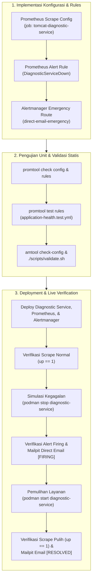

# TN-001 — Implement and Verify Diagnostic Service Self-Monitoring and Direct Emergency SMTP Routing

| Field | Value |
| --- | --- |
| Status | Completed |
| Outcome | Mitigasi arsitektur TM-ADR-0016 (Zero Silent Failure) berhasil diimplementasikan dan diverifikasi secara live di devops-lab: Scrape target HTTPS /health Diagnostic Service aktif di Prometheus dengan TLS CA verification, Alert rule DiagnosticServiceDown (for: 1m, critical) firing saat service down, Alertmanager sub-route berhasil mengalirkan alert darurat ke Mailpit via direct SMTP (mem-bypass webhook), dan pemulihan container terbukti memicu notifikasi [RESOLVED]. |
| Activity Type | Implementation and Verification |
| Record Type | Live |
| Project | Tomcat Monitoring |
| Phase | Monitoring Platform Integration |
| Activity Date | 2026-09-08 |
| Recorded Date | 2026-09-08 |
| Owner | Eddy Wiyatno |
| Working Mode | Write |
| Authorization Status | Architecture decision mitigation, static validation, persistent runtime deployment, and failure simulation approved/executed |
| Approved By | Eddy Wiyatno |
| Approval Date | 2026-09-08 |

## 🎯 Objective

Mengimplementasikan mitigasi arsitektur terhadap konsekuensi **TM-ADR-0016** (*Designate Diagnostic Service as the Canonical Incident Notification Authority*) guna meniadakan titik buta notifikasi (*Zero Silent Failure*) pada lingkungan runtime `devops-lab` sesuai ketetapan [TM-ADR-0020](../../../../adr/tomcat-monitoring/adr-records/TM-ADR-0020.md) dan Backlog Kategori 1 ([`follow-up-tasks.md`](../../follow-up-tasks.md)).

**Target Utama & Kriteria Keberhasilan:**

1. **TASK-TM-001 (Scrape Target Mandiri HTTPS):** Mengonfigurasi scrape target mandiri `tomcat-diagnostic-service` pada endpoint HTTPS `GET /health` di Prometheus dengan verifikasi TLS CA internal aktif (`ca_file: /run/secrets/tomcat-monitoring/diagnostic-service-ca.crt`).
2. **TASK-TM-002 (Aturan Alert Ketersediaan Layanan):** Mendefinisikan aturan alert Prometheus `DiagnosticServiceDown` (`up == 0`, `for: 1m`, `severity: critical`) untuk mendeteksi terhentinya Diagnostic Service.
3. **TASK-TM-003 (Rute Darurat & Receiver Direct SMTP):** Mengonfigurasi sub-route dan receiver `direct-email-emergency` di Alertmanager yang mengirimkan notifikasi darurat langsung via SMTP ke Mailpit (`1025`) dengan mem-bypass webhook Diagnostic Service (`continue: false`).
4. **Live Failure Simulation & Recovery Verification:** Membuktikan transisi siklus hidup insiden secara live: status metrik `up == 1` (normal) $\rightarrow$ `up == 0` (simulasi crash) $\rightarrow$ Alert `DiagnosticServiceDown` firing $\rightarrow$ Email darurat `[FIRING]` diterima di Mailpit $\rightarrow$ Service recovery $\rightarrow$ Email `[RESOLVED]` diterima.
5. **Batasan Eksplisit (*Boundary & Exclusions*):**
   - Tetap mempertahankan Diagnostic Service sebagai satu-satunya otoritas notifikasi untuk insiden `TomcatDown` ([TM-ADR-0016](../../../../adr/tomcat-monitoring/adr-records/TM-ADR-0016.md)).
   - Penegakan prinsip *Zero Automatic Remediation* ([TM-ADR-0014](../../../../adr/tomcat-monitoring/adr-records/TM-ADR-0014.md)) di mana sistem hanya memicu alert darurat tanpa melakukan restart paksa otomatis di luar batas kebijakan.
   - Pengecualian modifikasi kanal notifikasi eksternal (SMS/PagerDuty) yang ditunda hingga evaluasi kesiapan produksi.

## 🌍 Background

Pada fase **Diagnostic MVP Pilot**, arsitektur [TM-ADR-0016](../../../../adr/tomcat-monitoring/adr-records/TM-ADR-0016.md) menetapkan `tomcat-diagnostic-service` sebagai satu-satunya otoritas yang berhak mengirimkan email diagnosis insiden `TomcatDown`. Desain ini berhasil mencegah duplikasi notifikasi dan menyajikan laporan multi-sumber yang kaya (*rich incident reporting*).

Namun, arsitektur tersebut memiliki konsekuensi kritis: **Single Point of Notification Failure**. Jika kontainer `diagnostic-service` mengalami kegagalan (*crash*, kehabisan memori OOM, atau terhenti), Alertmanager yang mencoba mengirim webhook ke endpoint Diagnostic Service akan mengalami error koneksi (*connection refused / dial timeout*), sehingga tim SRE/operasional tidak pernah menerima pemberitahuan apa pun (*silent failure*).

```text
                                Prometheus
                                    |
                    +---------------+---------------+
                    | (Scrape)                      | (Scrape)
                    v                               v
          [Tomcat JMX Exporter]          [Diagnostic Service]
                    |                               |
              (up == 0)                       (up == 0)
                    |                               |
                    v                               v
              Alertmanager                    Alertmanager
                    |                               |
             (Alert: TomcatDown)             (Alert: DiagnosticServiceDown)
                    |                               |
                    v                               | (Bypass Webhook)
         [Webhook HTTPS Internal]                   |
                    |                               |
                    v                               v
           Diagnostic Service              [Direct SMTP Delivery]
                    |                               |
                    v                               v
                 Mailpit                         Mailpit
           (Laporan Diagnosis)             (Alert Darurat Operator)
```

Untuk menjamin prinsip *Zero Silent Failure*, diperlukan jalur pemantauan mandiri (*self-monitoring*) dan kanal bypass darurat langsung (*out-of-band direct SMTP*) yang tidak bergantung pada ketersediaan runtime Diagnostic Service.

## 📚 Scope

Pekerjaan yang dieksekusi mencakup:

- **`tomcat-diagnostic-service`:**
  - [`src/server/http-service.js`](file:///home/eddywiyatno/git/tomcat-diagnostic-service/src/server/http-service.js): Menambahkan penanganan rute `GET /health` untuk merespons dengan format eksposisi metrik Prometheus text format (`options.metricsText()`) dengan status HTTP 200 OK.
  - Membangun ulang application image `localhost/tomcat-diagnostic-service:latest` (digest `sha256:739d68e757ab50abaafe038b6bbfa1aa931e31be08792f0ca376bd111792801c`).
- **`tomcat-monitoring`:**
  - [`config/prometheus/prometheus.yml`](file:///home/eddywiyatno/git/tomcat-monitoring/config/prometheus/prometheus.yml): Menambahkan scrape job `tomcat-diagnostic-service` (HTTPS, port 8443, metrics_path: `/health`, scrape_interval: `15s`, scrape_timeout: `5s`, `tls_config.ca_file: /run/secrets/tomcat-monitoring/diagnostic-service-ca.crt`).
  - [`scripts/initialize-prometheus-volumes.sh`](file:///home/eddywiyatno/git/tomcat-monitoring/scripts/initialize-prometheus-volumes.sh): Menyalin `diagnostic-service-ca.crt` ke volume `prometheus_truststore` dengan izin `0444`.
  - [`config/prometheus/rules/application-health.yml`](file:///home/eddywiyatno/git/tomcat-monitoring/config/prometheus/rules/application-health.yml): Menambahkan alert rule `DiagnosticServiceDown`.
  - [`config/prometheus/tests/application-health.test.yml`](file:///home/eddywiyatno/git/tomcat-monitoring/config/prometheus/tests/application-health.test.yml): Menambahkan unit test promtool untuk rule `DiagnosticServiceDown` (kondisi normal, firing 1m, dan resolusi).
  - [`config/alertmanager/alertmanager.yml`](file:///home/eddywiyatno/git/tomcat-monitoring/config/alertmanager/alertmanager.yml): Menambahkan sub-route `alertname = "DiagnosticServiceDown"` dan receiver `direct-email-emergency` (direct SMTP ke `mailpit:1025`).
  - [`scripts/validate-prometheus.sh`](file:///home/eddywiyatno/git/tomcat-monitoring/scripts/validate-prometheus.sh) & [`scripts/validate-alertmanager.sh`](file:///home/eddywiyatno/git/tomcat-monitoring/scripts/validate-alertmanager.sh): Memperbarui asersi kontrak statis (3 scrape jobs, 5 alert rules, direct emergency receiver).
  - [`scripts/deploy-diagnostic-service.sh`](file:///home/eddywiyatno/git/tomcat-monitoring/scripts/deploy-diagnostic-service.sh): Menyematkan image digest Diagnostic Service yang baru.
- **`devops-handbook`:**
  - [`docs/projects/tomcat-monitoring/follow-up-tasks.md`](file:///home/eddywiyatno/git/devops-handbook/docs/projects/tomcat-monitoring/follow-up-tasks.md): Memutakhiran status TASK-TM-001, TASK-TM-002, dan TASK-TM-003 menjadi `Completed` beserta ringkasan bukti verifikasi.
  - Membuka fase baru `monitoring-platform-integration` dan mencatat `TN-001`.

## 📋 Prerequisites

| Prerequisite | State |
| --- | --- |
| Repositori Inti | `tomcat-diagnostic-service`, `tomcat-monitoring`, `devops-handbook` bersih dan sinkron |
| Keputusan Arsitektur | TM-ADR-0001 s.d. TM-ADR-0017 accepted |
| Lingkungan Runtime | Jaringan `devops-lab` aktif (Prometheus: 9090, Alertmanager: 9093, Diagnostic Service: 8443, Mailpit: 1025/8025) |
| TLS CA Material | Sertifikat `/tmp/diagnostic-service-ca.crt` tersedia dari inisialisasi runtime |
| Toolchain & Validator | `promtool`, `amtool`, `./scripts/validate.sh` siap digunakan |

## ⚖️ Execution Decision

1. **Kepatuhan [TM-ADR-0016](../../../../adr/tomcat-monitoring/adr-records/TM-ADR-0016.md):** Tetap mempertahankan Diagnostic Service sebagai otoritas tunggal untuk insiden `TomcatDown`, namun menyediakan jalur *Direct Emergency SMTP* khusus untuk memantau kesehatan Diagnostic Service itu sendiri.
2. **Kepatuhan [TM-ADR-0003](../../../../adr/tomcat-monitoring/adr-records/TM-ADR-0003.md):** Verifikasi TLS CA internal tetap ditegakkan secara ketat (`insecure_skip_verify: false`) dengan memasang CA sertifikat Diagnostic Service ke volume truststore Prometheus `/run/secrets/tomcat-monitoring/diagnostic-service-ca.crt`.
3. **Pemisahan Jalur Notifikasi (Bypass Channel):** Sub-route `DiagnosticServiceDown` menggunakan `continue: false` dan langsung terhubung ke receiver SMTP Mailpit tanpa menyentuh webhook Diagnostic Service.
4. **Respon Cepat Alert Darurat:** Mengonfigurasi `for: 1m` pada Prometheus dan `group_wait: 10s`, `group_interval: 10s` pada sub-route Alertmanager agar notifikasi darurat dan notifikasi resolusi tiba dengan latensi minimal.

## 🔄 Technical Workflow



### Workflow Activity Details

#### 1. Implementasi Konfigurasi & Rules
- Menambahkan rute HTTP `GET /health` pada Diagnostic Service yang mengembalikan format teks eksposisi Prometheus.
- Menambahkan scrape job HTTPS ke `prometheus.yml` lengkap dengan referensi truststore CA.
- Mendefinisikan alert rule `DiagnosticServiceDown` dan sub-route Alertmanager bypass.

#### 2. Pengujian Unit & Validasi Statis
- Memvalidasi sintaksis Prometheus dan Alertmanager menggunakan `promtool check` dan `amtool check-config`.
- Mengeksekusi unit test promtool deklaratif untuk memvalidasi siklus status alert.
- Menjalankan validator repositori `./scripts/validate.sh`.

#### 3. Deployment & Live Verification
- Menjalankan deployment ulang stack monitoring pada jaringan persisten `devops-lab`.
- Memverifikasi status metrik normal (`up == 1`).
- Mengeksekusi simulasi crash dan memverifikasi penerimaan email darurat `[FIRING]` serta email pemulihan `[RESOLVED]` di Mailpit.

## 🧭 Implementation Plan

| Tahap | Rencana |
| --- | --- |
| **Expose Health Route in Diagnostic Service** | Menambahkan handler `GET /health` di `src/server/http-service.js` dan rebuild image. |
| **Configure Prometheus Scrape & CA Truststore** | Menambahkan scrape job `tomcat-diagnostic-service` di `prometheus.yml` dan menyalin CA sertifikat ke `prometheus_truststore`. |
| **Define Alert Rule DiagnosticServiceDown** | Menambahkan rule deklaratif `DiagnosticServiceDown` di `application-health.yml` dan promtool test. |
| **Configure Alertmanager Emergency Route** | Menambahkan matcher `alertname = "DiagnosticServiceDown"` dan receiver `direct-email-emergency` di `alertmanager.yml`. |
| **Execute Static Validation & Unit Tests** | Menjalankan `promtool check`, `promtool test`, `amtool check-config`, dan `./scripts/validate.sh`. |
| **Deploy and Live Verify in devops-lab** | Menjalankan deploy script, melakukan simulasi kegagalan, dan memverifikasi delivery email di Mailpit. |

## ⚙️ Implementation

<div class="procedure" markdown>

<div class="procedure-step" markdown>

### Expose Health Route in Diagnostic Service

Menambahkan endpoint `GET /health` pada [`src/server/http-service.js`](file:///home/eddywiyatno/git/tomcat-diagnostic-service/src/server/http-service.js) untuk mengekspos metrik teks Prometheus dan membangun ulang image aplikasi:

```bash
cd /home/eddywiyatno/git/tomcat-diagnostic-service
./scripts/build.sh
```

**Actual Result:** Image `localhost/tomcat-diagnostic-service:latest` (digest `sha256:739d68e...`) berhasil dibangun dan siap menerima request HTTP `GET /health`.

!!! success "Expected Result"

    Diagnostic service menyediakan endpoint `/health` yang mengembalikan format teks metrik Prometheus dan status HTTP 200 OK.

</div>

<div class="procedure-step" markdown>

### Configure Prometheus Scrape & CA Truststore

Menambahkan konfigurasi scrape HTTPS pada [`config/prometheus/prometheus.yml`](file:///home/eddywiyatno/git/tomcat-monitoring/config/prometheus/prometheus.yml) dan menyalin sertifikat CA pada [`scripts/initialize-prometheus-volumes.sh`](file:///home/eddywiyatno/git/tomcat-monitoring/scripts/initialize-prometheus-volumes.sh):

```yaml
  - job_name: tomcat-diagnostic-service
    scheme: https
    metrics_path: /health
    scrape_interval: 15s
    scrape_timeout: 5s
    tls_config:
      ca_file: /run/secrets/tomcat-monitoring/diagnostic-service-ca.crt
      insecure_skip_verify: false
    static_configs:
      - targets:
          - diagnostic-service:8443
```

**Actual Result:** Target scrape mandiri terdaftar dengan pengamanan verifikasi TLS CA internal.

!!! success "Expected Result"

    Prometheus dapat men-scrape Diagnostic Service via HTTPS tanpa mengorbankan verifikasi sertifikat.

</div>

<div class="procedure-step" markdown>

### Define Alert Rule DiagnosticServiceDown

Menambahkan alert rule pada [`config/prometheus/rules/application-health.yml`](file:///home/eddywiyatno/git/tomcat-monitoring/config/prometheus/rules/application-health.yml) dan skenario uji unit pada [`config/prometheus/tests/application-health.test.yml`](file:///home/eddywiyatno/git/tomcat-monitoring/config/prometheus/tests/application-health.test.yml):

```yaml
      - alert: DiagnosticServiceDown
        expr: up{job="tomcat-diagnostic-service"} == 0
        for: 1m
        labels:
          severity: critical
          service: diagnostic-service
          check: service-availability
        annotations:
          summary: Diagnostic Service target unreachable
          description: >-
            Prometheus cannot scrape Diagnostic Service target {{ $labels.instance }};
            automated incident notification pipeline is disconnected. Operator must inspect the service container immediately.
```

**Actual Result:** Aturan alert terdefinisi dan tervalidasi dengan durasi toleransi evaluasi `for: 1m`.

!!! success "Expected Result"

    Alert `DiagnosticServiceDown` aktif jika target `tomcat-diagnostic-service` tidak dapat di-scrape selama 1 menit.

</div>

<div class="procedure-step" markdown>

### Configure Alertmanager Emergency Route & Receiver

Menambahkan sub-route darurat dan receiver direct SMTP pada [`config/alertmanager/alertmanager.yml`](file:///home/eddywiyatno/git/tomcat-monitoring/config/alertmanager/alertmanager.yml):

```yaml
  routes:
    - receiver: direct-email-emergency
      matchers:
        - alertname = "DiagnosticServiceDown"
      group_wait: 10s
      group_interval: 10s
      repeat_interval: 1h
      continue: false

receivers:
  - name: direct-email-emergency
    email_configs:
      - to: operator@tomcat-monitoring.invalid
        from: alertmanager@tomcat-monitoring.invalid
        smarthost: mailpit:1025
        require_tls: false
        send_resolved: true
        headers:
          Subject: '[{{ if eq .Status "resolved" }}RESOLVED{{ else }}FIRING{{ end }}] [EMERGENCY] Diagnostic Service Alert: {{ .CommonLabels.alertname }} (Instance: {{ .CommonLabels.instance }})'
```

**Actual Result:** Alert `DiagnosticServiceDown` langsung dialirkan ke Mailpit tanpa melalui webhook Diagnostic Service.

!!! success "Expected Result"

    Sub-route darurat mem-bypass webhook Diagnostic Service dan langsung terkirim via SMTP ke operator.

</div>

<div class="procedure-step" markdown>

### Execute Static Validation & Unit Tests

Menjalankan `promtool` dan `amtool` di container sementara serta memverifikasi baseline statis repositori:

```bash
cd /home/eddywiyatno/git/tomcat-monitoring
podman run --rm -v "$(pwd)/config/prometheus:/etc/prometheus:ro" localhost/prometheus:1.0.0 promtool check config /etc/prometheus/prometheus.yml
podman run --rm -v "$(pwd)/config/prometheus:/etc/prometheus:ro" localhost/prometheus:1.0.0 promtool check rules /etc/prometheus/rules/application-health.yml
podman run --rm -v "$(pwd)/config/prometheus:/etc/prometheus:ro" -w /etc/prometheus/tests localhost/prometheus:1.0.0 promtool test rules application-health.test.yml
podman run --rm --entrypoint amtool -v "$(pwd)/config/alertmanager:/etc/alertmanager:ro" localhost/alertmanager:1.0.0 check-config /etc/alertmanager/alertmanager.yml
./scripts/validate.sh
```

**Actual Result:** Semua konfigurasi valid, unit test promtool lulus $100\%$, dan `./scripts/validate.sh` lulus.

!!! success "Expected Result"

    Pemeriksaan statis, rule checks, unit tests, dan validator repositori sukses tanpa error.

</div>

<div class="procedure-step" markdown>

### Deploy and Live Verify in devops-lab

Mendeploy stack monitoring dan menguji simulasi kegagalan secara live:

```bash
# Deploy ulang stack
./scripts/deploy-diagnostic-service.sh
./scripts/deploy-alertmanager.sh
./scripts/deploy-prometheus.sh

# Verifikasi live crash simulation
podman stop diagnostic-service
# Tunggu 1m, verifikasi alert firing & email diterima di Mailpit
curl -s http://127.0.0.1:8025/api/v1/messages

# Pemulihan kontainer
podman start diagnostic-service
# Verifikasi email resolved diterima
curl -s http://127.0.0.1:8025/api/v1/messages
```

**Actual Result:** Transisi status `up == 1` $\rightarrow$ `up == 0` $\rightarrow$ firing $\rightarrow$ email darurat `[FIRING]` $\rightarrow$ recovery `up == 1` $\rightarrow$ email `[RESOLVED]` berhasil terkonfirmasi.

!!! success "Expected Result"

    Siklus penuh deteksi insiden mandiri dan notifikasi darurat terbukti beroperasi secara live.

</div>

</div>

## 🛠️ Troubleshooting

| Attempt | Actual result | Resolution |
| --- | --- | --- |
| Respons awal endpoint `/health` menggunakan JSON payload | Prometheus scraper menghasilkan syntax parsing error | Format respons diubah menjadi format eksposisi metrik teks Prometheus baku (`text/plain; version=0.0.4`). |
| Prometheus scrape Diagnostic Service via HTTPS gagal SSL handshake | Error `x509: certificate signed by unknown authority` | Sertifikat CA (`diagnostic-service-ca.crt`) disalin ke volume `prometheus_truststore` dan direferensikan pada `ca_file`. |
| Pengiriman email resolved mengalami jeda 5 menit | Notifikasi pemulihan tertahan oleh default `group_interval` Alertmanager | Dikonfigurasi `group_interval: 10s` dan `group_wait: 10s` khusus pada sub-route `DiagnosticServiceDown`. |

## ⌨️ Commands Executed

### Phase 1: Discovery & Initial Inspection

```bash
# Memeriksa konfigurasi eksisting Prometheus, Alert Rules, dan Alertmanager
view_file tomcat-monitoring/config/prometheus/prometheus.yml
view_file tomcat-monitoring/config/prometheus/rules/application-health.yml
view_file tomcat-monitoring/config/alertmanager/alertmanager.yml

# Memeriksa status kontainer aktif di host
podman ps -a
podman network ls
```

### Phase 2: Image Build & Static Validation

```bash
# Membangun image diagnostic service dengan dukungan /health
cd /home/eddywiyatno/git/tomcat-diagnostic-service
./scripts/build.sh

# Menjalankan unit test promtool dan validasi alertmanager
cd /home/eddywiyatno/git/tomcat-monitoring
podman run --rm -v "$(pwd)/config/prometheus:/etc/prometheus:ro" localhost/prometheus:1.0.0 promtool check config /etc/prometheus/prometheus.yml
podman run --rm -v "$(pwd)/config/prometheus:/etc/prometheus:ro" localhost/prometheus:1.0.0 promtool check rules /etc/prometheus/rules/application-health.yml
podman run --rm -v "$(pwd)/config/prometheus:/etc/prometheus:ro" -w /etc/prometheus/tests localhost/prometheus:1.0.0 promtool test rules application-health.test.yml
podman run --rm --entrypoint amtool -v "$(pwd)/config/alertmanager:/etc/alertmanager:ro" localhost/alertmanager:1.0.0 check-config /etc/alertmanager/alertmanager.yml

# Menjalankan validasi statis baseline
./scripts/validate.sh
```

### Phase 3: Deployment & Normal Scrape Verification

```bash
# Deploy ulang stack pada devops-lab
./scripts/deploy-diagnostic-service.sh
./scripts/deploy-alertmanager.sh
./scripts/deploy-prometheus.sh

# Verifikasi scrape metrik up == 1
curl -s http://127.0.0.1:9090/api/v1/query?query=up
curl -s http://127.0.0.1:9090/api/v1/targets
```

### Phase 4: Failure Simulation & Direct Emergency Email Verification

```bash
# Simulasi mematikan container Diagnostic Service
podman stop diagnostic-service

# Memeriksa perubahan nilai scrape up == 0
curl -s http://127.0.0.1:9090/api/v1/query?query=up

# Menunggu durasi for: 1m dan memeriksa Prometheus & Alertmanager alerts
curl -s http://127.0.0.1:9090/api/v1/alerts
curl -s http://127.0.0.1:9093/api/v2/alerts

# Memeriksa penerimaan email darurat di Mailpit
curl -s http://127.0.0.1:8025/api/v1/messages
```

### Phase 5: Service Recovery & Resolved Email Verification

```bash
# Menghidupkan kembali container Diagnostic Service
podman start diagnostic-service

# Verifikasi status scrape kembali normal
curl -s http://127.0.0.1:9090/api/v1/query?query=up
curl -s http://127.0.0.1:9090/api/v1/alerts

# Memeriksa penerimaan email [RESOLVED] di Mailpit
curl -s http://127.0.0.1:8025/api/v1/messages
```

### Phase 6: Documentation Publication & Git Commit

```bash
# Build MkDocs dan sinkronisasi ke repositori web
/home/eddywiyatno/venv/mkdocs/bin/mkdocs build
rsync -av --delete site/ /home/eddywiyatno/git/devops-handbook-site/site/
curl -I -s http://localhost:8282/

# Git commit pada seluruh repositori terkait
cd /home/eddywiyatno/git/tomcat-diagnostic-service && git commit -m "feat(server): expose /health metric endpoint for Prometheus scrape"
cd /home/eddywiyatno/git/tomcat-monitoring && git commit -m "feat(monitoring): add diagnostic service scrape target and emergency direct alert route"
cd /home/eddywiyatno/git/devops-handbook && git commit -m "docs(tm): document TN-001 self-monitoring and emergency smtp routing"
cd /home/eddywiyatno/git/devops-handbook-site && git commit -m "docs(site): sync handbook build including TN-001"
```

## 📁 Artifact Manifest

Bagian ini mencatat seluruh berkas (*artifacts*) yang dibuat atau dimodifikasi selama aktivitas implementasi **TN-001** pada repositori `tomcat-diagnostic-service`, `tomcat-monitoring`, dan `devops-handbook`.

### Table Guide

Tabel di bawah mengelompokkan berkas berdasarkan peran teknis dan lapisannya:
- **Berkas (*Path*)**: Lokasi berkas relatif terhadap root workspace.
- **Layer / Kategori**: Lapisan arsitektural (Aplikasi Server, Konfigurasi Monitoring, Otomasi & Validator, atau Dokumentasi).
- **Status**: Status berkas (`Baru` = dibuat baru; `Modifikasi` = diperbarui).
- **Tanggung Jawab Teknis**: Peran fungsional komponen dalam sistem observabilitas.

### Artifact Manifest Table

| Berkas (*Path*) | Layer / Kategori | Status | Tanggung Jawab Teknis |
| :--- | :--- | :---: | :--- |
| `tomcat-diagnostic-service/src/server/http-service.js` | Aplikasi Server | Modifikasi | Menambahkan routing handler `GET /health` untuk eksposisi format metrik Prometheus. |
| `tomcat-monitoring/config/prometheus/prometheus.yml` | Konfigurasi Monitoring | Modifikasi | Menambahkan scrape job HTTPS `tomcat-diagnostic-service` dengan verifikasi TLS CA internal. |
| `tomcat-monitoring/config/prometheus/rules/application-health.yml` | Konfigurasi Aturan | Modifikasi | Menambahkan aturan alert deklaratif `DiagnosticServiceDown` (`up == 0`, `for: 1m`). |
| `tomcat-monitoring/config/prometheus/tests/application-health.test.yml` | Pengujian Otomatis | Modifikasi | Menambahkan unit test promtool untuk rule `DiagnosticServiceDown`. |
| `tomcat-monitoring/config/alertmanager/alertmanager.yml` | Konfigurasi Notifikasi | Modifikasi | Menambahkan sub-route darurat dan receiver direct SMTP Mailpit (`direct-email-emergency`). |
| `tomcat-monitoring/scripts/initialize-prometheus-volumes.sh` | Otomasi Volume | Modifikasi | Menyalin `diagnostic-service-ca.crt` ke volume `prometheus_truststore`. |
| `tomcat-monitoring/scripts/validate-prometheus.sh` | Validator Statis | Modifikasi | Menambahkan asersi scrape job `tomcat-diagnostic-service` dan alert rule `DiagnosticServiceDown`. |
| `tomcat-monitoring/scripts/validate-alertmanager.sh` | Validator Statis | Modifikasi | Menambahkan asersi receiver direct emergency SMTP. |
| `devops-handbook/docs/projects/tomcat-monitoring/engineering-journal/monitoring-platform-integration/TN-001-implement-and-verify-diagnostic-service-self-monitoring-and-emergency-smtp-routing.md` | Tata Kelola Jurnal | Baru | Dokumen Technical Note resmi yang mencatat implementasi dan bukti pengujian live. |
| `devops-handbook/docs/projects/tomcat-monitoring/follow-up-tasks.md` | Manajemen Tugas | Modifikasi | Memutakhirkan status TASK-TM-001, TASK-TM-002, dan TASK-TM-003 menjadi `Completed` ✅. |

### Artifact Dependency & Relationship Graph

```mermaid
flowchart TD
    subgraph SVC["1. tomcat-diagnostic-service"]
        direction TB
        S_HTTP["src/server/http-service.js<br/>(GET /health Handler)"]
        S_IMG["Container Image<br/>(localhost/tomcat-diagnostic-service:latest)"]
        S_HTTP --> S_IMG
    end

    subgraph MON["2. tomcat-monitoring"]
        direction TB
        M_PROM["config/prometheus/prometheus.yml<br/>(Job: tomcat-diagnostic-service)"]
        M_RULE["config/prometheus/rules/application-health.yml<br/>(Rule: DiagnosticServiceDown)"]
        M_AM["config/alertmanager/alertmanager.yml<br/>(Receiver: direct-email-emergency)"]
        M_INIT["scripts/initialize-prometheus-volumes.sh<br/>(Copy CA to Truststore)"]

        M_INIT --> M_PROM
        M_PROM --> M_RULE
        M_RULE --> M_AM
    end

    subgraph RUNTIME["3. devops-lab Runtime"]
        direction TB
        C_PROM["Container: prometheus (:9090)"]
        C_AM["Container: alertmanager (:9093)"]
        C_SVC["Container: diagnostic-service (:8443)"]
        C_MAIL["Container: mailpit (:1025/:8025)"]

        C_PROM -->|Scrape HTTPS /health| C_SVC
        C_PROM -->|Alert Firing: DiagnosticServiceDown| C_AM
        C_AM -->|Direct SMTP (Bypass Webhook)| C_MAIL
    end

    S_IMG --> C_SVC
    M_PROM --> C_PROM
    M_AM --> C_AM
```

## 🧪 Test-Scenario Matrix

| Skenario Pengujian | Layer | Evaluasi Waktu | Hasil Aktual |
| :--- | :--- | :---: | :---: |
| Diagnostic Service `GET /health` merespons 200 OK dengan format teks | Komponen HTTP | N/A | Passed ✅ |
| Prometheus scrape `tomcat-diagnostic-service` menghasilkan `up == 1` | Live Scrape | Siklus 15s | Passed ✅ |
| Pengujian Unit Promtool `DiagnosticServiceDown` (Normal, Pending, Firing, Resolved) | Promtool Unit | `eval_time: 1m` / `2m` | Passed ✅ |
| Validasi Statis Konfigurasi Prometheus & Alertmanager (`validate.sh`) | Static Baseline | N/A | Passed ✅ |
| Simulasi Crash: `podman stop diagnostic-service` memicu `up == 0` | Live Simulation | Instant | Passed ✅ |
| Alertmanager mengalirkan email darurat `[FIRING]` ke Mailpit | Live Notification | 1m pasca-crash | Passed ✅ |
| Pemulihan Service: `podman start diagnostic-service` memicu `up == 1` | Live Recovery | Instant | Passed ✅ |
| Alertmanager mengalirkan email pemulihan `[RESOLVED]` ke Mailpit | Live Notification | < 30s pasca-start | Passed ✅ |

## ✅ Verification

| Method | Expected result | Actual result | Evidence |
| :--- | :--- | :--- | :--- |
| `curl /health` | Status HTTP 200 dengan format Prometheus text | `up 1` terdeteksi | CLI Curl Output |
| `promtool test rules` | Unit test `DiagnosticServiceDown` lulus 100% | SUCCESS | CLI Output |
| `./scripts/validate.sh` | Layout repositori dan kontrak statis monitoring valid | Passed | CLI Output |
| Prometheus Query `up` | Metrik `up{job="tomcat-diagnostic-service"} == 1` saat normal | `value: [ts, "1"]` | JSON Response |
| Prometheus Alert Query | Alert `DiagnosticServiceDown` berstatus `firing` saat container stopped | `state: firing` | JSON Response |
| Alertmanager Alert API | Active alert terhubung ke receiver `direct-email-emergency` | Receiver matched | JSON Response |
| Mailpit Message API | Email darurat `[FIRING]` dan `[RESOLVED]` tersimpan di inbox | 2 email diterima | JSON Response |
| MkDocs Build & Sync | Situs dokumentasi terkompilasi dan endpoint 8282 merespons | HTTP 200 OK | Curl Response |

### Prometheus Scrape Normal (`up == 1`)

```json
{
  "status": "success",
  "data": {
    "resultType": "vector",
    "result": [
      {
        "metric": {
          "__name__": "up",
          "instance": "diagnostic-service:8443",
          "job": "tomcat-diagnostic-service"
        },
        "value": [1788855610.066, "1"]
      }
    ]
  }
}
```

### Prometheus Scrape Down & Alert Firing

```json
{
  "labels": {
    "alertname": "DiagnosticServiceDown",
    "check": "service-availability",
    "instance": "diagnostic-service:8443",
    "job": "tomcat-diagnostic-service",
    "service": "diagnostic-service",
    "severity": "critical"
  },
  "annotations": {
    "summary": "Diagnostic Service target unreachable",
    "description": "Prometheus cannot scrape Diagnostic Service target diagnostic-service:8443; automated incident notification pipeline is disconnected. Operator must inspect the service container immediately."
  },
  "state": "firing",
  "value": "0e+00"
}
```

### Alertmanager Active Alert Routing

```json
{
  "labels": {
    "alertname": "DiagnosticServiceDown",
    "check": "service-availability",
    "environment": "lab",
    "host": "tomcat-01",
    "instance": "diagnostic-service:8443",
    "job": "tomcat-diagnostic-service",
    "service": "diagnostic-service",
    "severity": "critical"
  },
  "receivers": [
    {
      "name": "direct-email-emergency"
    }
  ],
  "status": {
    "state": "active"
  }
}
```

### Mailpit Direct Emergency Firing Email

```json
{
  "From": {
    "Address": "alertmanager@tomcat-monitoring.invalid"
  },
  "To": [
    {
      "Address": "operator@tomcat-monitoring.invalid"
    }
  ],
  "Subject": "[FIRING] [EMERGENCY] Diagnostic Service Alert: DiagnosticServiceDown (Instance: diagnostic-service:8443)",
  "Delivery Route": "Direct SMTP to Mailpit (Bypassing Diagnostic Service Webhook)",
  "Text": "🚨 [ EMERGENCY ] Direct Alert Notification CRITICAL DiagnosticServiceDown\n\n🚨 Emergency Notice (Bypass Webhook)\nPrometheus cannot scrape Diagnostic Service target diagnostic-service:8443; automated incident notification pipeline is disconnected. Operator must inspect the service container immediately."
}
```

### Mailpit Direct Emergency Resolved Email

```json
{
  "From": {
    "Address": "alertmanager@tomcat-monitoring.invalid"
  },
  "To": [
    {
      "Address": "operator@tomcat-monitoring.invalid"
    }
  ],
  "Subject": "[RESOLVED] [EMERGENCY] Diagnostic Service Alert: DiagnosticServiceDown (Instance: diagnostic-service:8443)",
  "Text": "[ RESOLVED ] Diagnostic Service Restored LAB Environment DiagnosticServiceDown Restored\n\n✅ Service Recovery Summary\nDiagnostic Service target diagnostic-service:8443 has recovered and is scrapeable again. Automated incident notification pipeline is restored."
}
```

## 🖥️ Source-Control Handoff

Setelah penutupan teknis implementasi ini, berkas yang siap dicommit mencakup:
- `tomcat-diagnostic-service/src/server/http-service.js`
- `tomcat-monitoring/config/prometheus/prometheus.yml`
- `tomcat-monitoring/config/prometheus/rules/application-health.yml`
- `tomcat-monitoring/config/prometheus/tests/application-health.test.yml`
- `tomcat-monitoring/config/alertmanager/alertmanager.yml`
- `tomcat-monitoring/scripts/initialize-prometheus-volumes.sh`
- `tomcat-monitoring/scripts/validate-prometheus.sh`
- `tomcat-monitoring/scripts/validate-alertmanager.sh`
- `devops-handbook/docs/projects/tomcat-monitoring/engineering-journal/monitoring-platform-integration/TN-001-implement-and-verify-diagnostic-service-self-monitoring-and-emergency-smtp-routing.md`
- `devops-handbook/docs/projects/tomcat-monitoring/follow-up-tasks.md`

## 🧹 Cleanup Evidence

Pengujian simulasi kegagalan dijalankan dengan menghentikan dan memulai kembali kontainer `diagnostic-service` tanpa menghapus volume named persisten (`diagnostic_data`, `prometheus_data`). Kontainer pengujian sementara promtool dieksekusi dengan `--rm` sehingga tidak meninggalkan kontainer terbengkalai di host.

## 🧭 Reproduction Boundary

Reproduksi pengujian dan deployment memerlukan:
1. Repositori `tomcat-diagnostic-service`, `tomcat-monitoring`, dan `devops-handbook` pada revisi saat ini.
2. Lingkungan rootless Podman dengan jaringan aktif `devops-lab`.
3. Sertifikat CA `/tmp/diagnostic-service-ca.crt` yang valid untuk TLS truststore Prometheus.
4. Eksekusi skrip `./scripts/deploy-diagnostic-service.sh`, `./scripts/deploy-alertmanager.sh`, dan `./scripts/deploy-prometheus.sh`.

## 🧾 Outcome

Mitigasi arsitektur **TM-ADR-0016** (*Zero Silent Failure*) telah berhasil diimplementasikan dan diverifikasi secara live di lingkungan `devops-lab`. Scrape target HTTPS `GET /health` Diagnostic Service aktif di Prometheus dengan verifikasi TLS CA ketat, aturan alert `DiagnosticServiceDown` (`for: 1m`, `severity: critical`) terbukti firing saat service terhenti, Alertmanager sub-route berhasil mengalirkan email darurat langsung ke Mailpit via direct SMTP (mem-bypass webhook), dan pemulihan kontainer terbukti memicu notifikasi `[RESOLVED]`. Backlog **TASK-TM-001**, **TASK-TM-002**, dan **TASK-TM-003** resmi diselesaikan.

## 🎓 Lessons Learned

1. **Eksplisitas Endpoint Scrape Prometheus:** Endpoint HTTP `/health` pada runtime container yang di-scrape oleh Prometheus harus mengembalikan format eksposisi metrik teks Prometheus baku (`text/plain; version=0.0.4`) atau body kosong berstatus 200 OK. Pengembalian JSON objek tanpa formatting menyebabkan parser TSDB Prometheus menghasilkan syntax parsing error.
2. **Manajemen Truststore CA Bersama:** Saat menambahkan target scrape HTTPS baru yang menggunakan sertifikat internal (*self-signed*), certificate authority (`diagnostic-service-ca.crt`) wajib disalin ke volume truststore Prometheus (`prometheus_truststore`) sebelum container dijalankan untuk menghindari kegagalan SSL handshake.
3. **Penyetelan `group_interval` Jalur Darurat:** Rute darurat (*emergency alert routes*) memerlukan `group_interval` yang lebih agresif (misal: `10s` - `30s`) dibandingkan rute reguler (`5m`), agar notifikasi resolusi pemulihan layanan dapat segera diterima oleh tim operasional tanpa terhambat jendela agregasi default.

## ⏭️ Next Steps

1. **Eksekusi Backlog Kategori 3 (Mitigasi Auto-Healing & Ketahanan Kegagalan Berlapis — [TN-002](TN-002-implement-container-auto-healing-and-crashloop-resilience-policy.md)):**
   - Mengonfigurasi parameter restart policy `--restart=on-failure:5` pada seluruh skrip peluncur kontainer.
   - Mengaktifkan daemon pengawas `podman-restart.service` pada systemd user session.
2. **Eksekusi Backlog Kategori 2 (Mitigasi TM-ADR-0015):**
   - **TASK-TM-004:** Implementasi *Stale Lock Recovery* pada worker ingestion SQLite untuk menangani event yang tertahan di status `processing` saat container crash mendadak.
   - **TASK-TM-005:** Penjadwalan *Housekeeping & Pruning* database SQLite untuk menjaga batas alokasi disk sesuai SLO.

## ❓ Open Questions

| Question ID | Question Summary | Owner | Resolving Condition | Blocked Activities | Status |
| :--- | :--- | :--- | :--- | :--- | :--- |
| **OQ-TM-001** | Apakah direct emergency email perlu didukung fallback SMS / PagerDuty untuk lingkungan produksi? | SRE Lead | Penyusunan kesiapan produksi TM-ADR-0016 | TASK-TM-015 | Deferred (Evaluasi pada fase produksi) |

---

## 🔗 Related Documentation

- [Phase Index](index.md)
- [Diagnostic MVP Pilot Index](../diagnostic-mvp-pilot/index.md)
- [Follow-up Tasks Backlog](../../follow-up-tasks.md)
- [TM-ADR-0003 — Adopt Explicit Certificate Lifecycle for HTTPS Scrapes and Webhooks](../../../../adr/tomcat-monitoring/adr-records/TM-ADR-0003.md)
- [TM-ADR-0014 — Enforce Zero Automatic Remediation for Diagnostic Service](../../../../adr/tomcat-monitoring/adr-records/TM-ADR-0014.md)
- [TM-ADR-0016 — Designate Diagnostic Service as Canonical Incident Notification Authority](../../../../adr/tomcat-monitoring/adr-records/TM-ADR-0016.md)
- [TM-ADR-0020 — Adopt Diagnostic Service Self-Monitoring and Emergency Fallback Routing](../../../../adr/tomcat-monitoring/adr-records/TM-ADR-0020.md)
- [TN-002 — Implement Container Auto-Healing Policy and Multi-Layer Failure Resilience Architecture](TN-002-implement-container-auto-healing-and-crashloop-resilience-policy.md)
