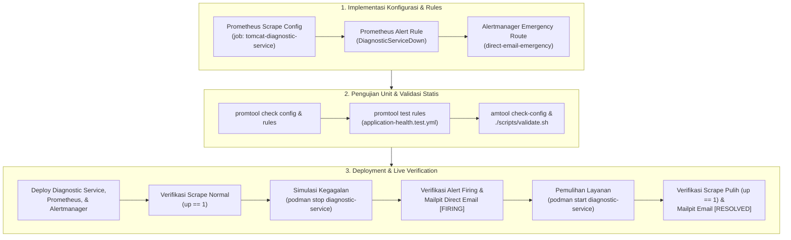

# TN-001 — Implement and Verify Diagnostic Service Self-Monitoring and Direct Emergency SMTP Routing

| Field | Value |
| --- | --- |
| Status | Completed |
| Outcome | Mitigasi arsitektur TM-ADR-0016 (Zero Silent Failure) berhasil diimplementasikan dan diverifikasi secara live di devops-lab: Scrape target HTTPS /health Diagnostic Service aktif di Prometheus dengan TLS CA verification, Alert rule DiagnosticServiceDown (for: 1m, critical) firing saat service down, Alertmanager sub-route berhasil mengalirkan alert darurat ke Mailpit via direct SMTP (mem-bypass webhook), dan pemulihan container terbukti memicu notifikasi [RESOLVED]. |
| Activity Type | Implementation and Verification |
| Record Type | Live |
| Project | Tomcat Monitoring |
| Phase | Monitoring Platform Integration |
| Activity Date | 2026-09-08 |
| Recorded Date | 2026-09-08 |
| Owner | Eddy Wiyatno |
| Working Mode | Write |
| Authorization Status | Architecture decision mitigation, static validation, persistent runtime deployment, and failure simulation approved/executed |
| Approved By | Eddy Wiyatno |
| Approval Date | 2026-09-08 |

## 🎯 Objective

Mengimplementasikan mitigasi arsitektur terhadap konsekuensi **TM-ADR-0016** (*Designate Diagnostic Service as the Canonical Incident Notification Authority*) guna meniadakan titik buta notifikasi (*Zero Silent Failure*) sebagaimana didefinisikan pada Backlog Kategori 1 ([`follow-up-tasks.md`](../../follow-up-tasks.md)):

1. **TASK-TM-001:** Mengonfigurasi scrape target mandiri `tomcat-diagnostic-service` pada endpoint HTTPS `GET /health` di Prometheus dengan verifikasi TLS internal aktif.
2. **TASK-TM-002:** Mendefinisikan aturan alert Prometheus `DiagnosticServiceDown` (`up == 0`, `for: 1m`, `severity: critical`) untuk mendeteksi matinya Diagnostic Service.
3. **TASK-TM-003:** Mengonfigurasi sub-route dan receiver `direct-email-emergency` di Alertmanager yang mengirimkan notifikasi darurat langsung via SMTP ke Mailpit (`1025`) dengan mem-bypass webhook Diagnostic Service.
4. **Live Verification:** Membuktikan transisi status metrik `up == 1` (normal) $\\rightarrow$ `up == 0` (simulasi crash) $\\rightarrow$ Alert `DiagnosticServiceDown` firing $\\rightarrow$ Email darurat `[FIRING]` diterima di Mailpit $\\rightarrow$ Service recovery $\\rightarrow$ Email `[RESOLVED]` diterima.

## 🌍 Background

Pada fase **Diagnostic MVP Pilot**, arsitektur [TM-ADR-0016](../../../../adr/tomcat-monitoring/adr-records/TM-ADR-0016.md) menetapkan `tomcat-diagnostic-service` sebagai satu-satunya otoritas yang berhak mengirimkan email diagnosis insiden `TomcatDown`. Desain ini berhasil mencegah duplikasi notifikasi dan menyajikan laporan multi-sumber yang kaya (*rich incident reporting*).

Namun, arsitektur tersebut memiliki konsekuensi kritis: **Single Point of Notification Failure**. Jika kontainer `diagnostic-service` mengalami kegagalan (*crash*, kehabisan memori OOM, atau terhenti), Alertmanager yang mencoba mengirim webhook ke endpoint Diagnostic Service akan mengalami error koneksi (*connection refused / dial timeout*), sehingga tim SRE/operasional tidak pernah menerima pemberitahuan apa pun (*silent failure*).

```text
                                Prometheus
                                    |
                    +---------------+---------------+
                    | (Scrape)                      | (Scrape)
                    v                               v
          [Tomcat JMX Exporter]          [Diagnostic Service]
                    |                               |
              (up == 0)                       (up == 0)
                    |                               |
                    v                               v
              Alertmanager                    Alertmanager
                    |                               |
             (Alert: TomcatDown)             (Alert: DiagnosticServiceDown)
                    |                               |
                    v                               | (Bypass Webhook)
         [Webhook HTTPS Internal]                   |
                    |                               |
                    v                               v
           Diagnostic Service              [Direct SMTP Delivery]
                    |                               |
                    v                               v
                 Mailpit                         Mailpit
           (Laporan Diagnosis)             (Alert Darurat Operator)
```

Untuk menjamin prinsip *Zero Silent Failure*, diperlukan jalur pemantauan mandiri (*self-monitoring*) dan kanal bypass darurat langsung (*out-of-band direct SMTP*) yang tidak bergantung pada ketersediaan runtime Diagnostic Service.

## 📚 Scope

Pekerjaan yang dieksekusi mencakup:

- **`tomcat-diagnostic-service`:**
  - [`src/server/http-service.js`](file:///home/eddywiyatno/git/tomcat-diagnostic-service/src/server/http-service.js): Menambahkan penanganan rute `GET /health` untuk merespons dengan format eksposisi metrik Prometheus text format (`options.metricsText()`) dengan status HTTP 200 OK.
  - Membangun ulang application image `localhost/tomcat-diagnostic-service:latest` (digest `sha256:739d68e757ab50abaafe038b6bbfa1aa931e31be08792f0ca376bd111792801c`).
- **`tomcat-monitoring`:**
  - [`config/prometheus/prometheus.yml`](file:///home/eddywiyatno/git/tomcat-monitoring/config/prometheus/prometheus.yml): Menambahkan scrape job `tomcat-diagnostic-service` (HTTPS, port 8443, metrics_path: `/health`, scrape_interval: `15s`, scrape_timeout: `5s`, `tls_config.ca_file: /run/secrets/tomcat-monitoring/diagnostic-service-ca.crt`).
  - [`scripts/initialize-prometheus-volumes.sh`](file:///home/eddywiyatno/git/tomcat-monitoring/scripts/initialize-prometheus-volumes.sh): Menyalin `diagnostic-service-ca.crt` ke volume `prometheus_truststore` dengan izin `0444`.
  - [`config/prometheus/rules/application-health.yml`](file:///home/eddywiyatno/git/tomcat-monitoring/config/prometheus/rules/application-health.yml): Menambahkan alert rule `DiagnosticServiceDown`.
  - [`config/prometheus/tests/application-health.test.yml`](file:///home/eddywiyatno/git/tomcat-monitoring/config/prometheus/tests/application-health.test.yml): Menambahkan unit test promtool untuk rule `DiagnosticServiceDown` (kondisi normal, firing 1m, dan resolusi).
  - [`config/alertmanager/alertmanager.yml`](file:///home/eddywiyatno/git/tomcat-monitoring/config/alertmanager/alertmanager.yml): Menambahkan sub-route `alertname = "DiagnosticServiceDown"` dan receiver `direct-email-emergency` (direct SMTP ke `mailpit:1025`).
  - [`scripts/validate-prometheus.sh`](file:///home/eddywiyatno/git/tomcat-monitoring/scripts/validate-prometheus.sh) & [`scripts/validate-alertmanager.sh`](file:///home/eddywiyatno/git/tomcat-monitoring/scripts/validate-alertmanager.sh): Memperbarui asersi kontrak statis (3 scrape jobs, 5 alert rules, direct emergency receiver).
  - [`scripts/deploy-diagnostic-service.sh`](file:///home/eddywiyatno/git/tomcat-monitoring/scripts/deploy-diagnostic-service.sh): Menyematkan image digest Diagnostic Service yang baru.
- **`devops-handbook`:**
  - [`docs/projects/tomcat-monitoring/follow-up-tasks.md`](file:///home/eddywiyatno/git/devops-handbook/docs/projects/tomcat-monitoring/follow-up-tasks.md): Memutakhiran status TASK-TM-001, TASK-TM-002, dan TASK-TM-003 menjadi `Completed` beserta ringkasan bukti verifikasi.
  - Membuka fase baru `monitoring-platform-integration` dan mencatat `TN-001`.

## 📋 Prerequisites

| Prerequisite | State |
| --- | --- |
| Repositori Inti | `tomcat-diagnostic-service`, `tomcat-monitoring`, `devops-handbook` bersih dan sinkron |
| Keputusan Arsitektur | TM-ADR-0001 s.d. TM-ADR-0017 accepted |
| Lingkungan Runtime | Jaringan `devops-lab` aktif (Prometheus: 9090, Alertmanager: 9093, Diagnostic Service: 8443, Mailpit: 1025/8025) |
| TLS CA Material | Sertifikat `/tmp/diagnostic-service-ca.crt` tersedia dari inisialisasi runtime |
| Toolchain & Validator | `promtool`, `amtool`, `./scripts/validate.sh` siap digunakan |

## ⚖️ Execution Decision

1. **Kepatuhan [TM-ADR-0016](../../../../adr/tomcat-monitoring/adr-records/TM-ADR-0016.md):** Tetap mempertahankan Diagnostic Service sebagai otoritas tunggal untuk insiden `TomcatDown`, namun menyediakan jalur *Direct Emergency SMTP* khusus untuk memantau kesehatan Diagnostic Service itu sendiri.
2. **Kepatuhan [TM-ADR-0003](../../../../adr/tomcat-monitoring/adr-records/TM-ADR-0003.md):** Verifikasi TLS CA internal tetap ditegakkan secara ketat (`insecure_skip_verify: false`) dengan memasang CA sertifikat Diagnostic Service ke volume truststore Prometheus `/run/secrets/tomcat-monitoring/diagnostic-service-ca.crt`.
3. **Pemisahan Jalur Notifikasi (Bypass Channel):** Sub-route `DiagnosticServiceDown` menggunakan `continue: false` dan langsung terhubung ke receiver SMTP Mailpit tanpa menyentuh webhook Diagnostic Service.
4. **Respon Cepat Alert Darurat:** Mengonfigurasi `for: 1m` pada Prometheus dan `group_wait: 10s`, `group_interval: 10s` pada sub-route Alertmanager agar notifikasi darurat dan notifikasi resolusi tiba dengan latensi minimal.

## 🔄 Technical Workflow



## 🛠️ Step-by-Step Implementation Details

### 1. Scrape Configuration Prometheus ([`prometheus.yml`](file:///home/eddywiyatno/git/tomcat-monitoring/config/prometheus/prometheus.yml))

```yaml
  - job_name: tomcat-diagnostic-service
    scheme: https
    metrics_path: /health
    scrape_interval: 15s
    scrape_timeout: 5s
    tls_config:
      ca_file: /run/secrets/tomcat-monitoring/diagnostic-service-ca.crt
      insecure_skip_verify: false
    static_configs:
      - targets:
          - diagnostic-service:8443
```

### 2. Alert Rule Definition ([`application-health.yml`](file:///home/eddywiyatno/git/tomcat-monitoring/config/prometheus/rules/application-health.yml))

```yaml
      - alert: DiagnosticServiceDown
        expr: up{job="tomcat-diagnostic-service"} == 0
        for: 1m
        labels:
          severity: critical
          service: diagnostic-service
          check: service-availability
        annotations:
          summary: Diagnostic Service target unreachable
          description: >-
            Prometheus cannot scrape Diagnostic Service target {{ $labels.instance }};
            automated incident notification pipeline is disconnected. Operator must inspect the service container immediately.
```

### 3. Alertmanager Emergency Route & Receiver ([`alertmanager.yml`](file:///home/eddywiyatno/git/tomcat-monitoring/config/alertmanager/alertmanager.yml))

```yaml
  routes:
    - receiver: direct-email-emergency
      matchers:
        - alertname = "DiagnosticServiceDown"
      group_wait: 10s
      group_interval: 10s
      repeat_interval: 1h
      continue: false

receivers:
  - name: direct-email-emergency
    email_configs:
      - to: operator@tomcat-monitoring.invalid
        from: alertmanager@tomcat-monitoring.invalid
        smarthost: mailpit:1025
        require_tls: false
        send_resolved: true
        headers:
          Subject: '[{{ if eq .Status "resolved" }}RESOLVED{{ else }}FIRING{{ end }}] [EMERGENCY] Diagnostic Service Alert: {{ .CommonLabels.alertname }} (Instance: {{ .CommonLabels.instance }})'
```

## ⌨️ Commands Executed

### Tahap 1: Discovery & Pemeriksaan Awal

```bash
# Memeriksa konfigurasi eksisting Prometheus, Alert Rules, dan Alertmanager
view_file tomcat-monitoring/config/prometheus/prometheus.yml
view_file tomcat-monitoring/config/prometheus/rules/application-health.yml
view_file tomcat-monitoring/config/alertmanager/alertmanager.yml

# Memeriksa status kontainer aktif di host
podman ps -a
podman network ls
```

### Tahap 2: Pembangunan Image & Validasi Statis

```bash
# Membangun image diagnostic service dengan dukungan /health
cd /home/eddywiyatno/git/tomcat-diagnostic-service
./scripts/build.sh

# Menjalankan unit test promtool dan validasi alertmanager
cd /home/eddywiyatno/git/tomcat-monitoring
podman run --rm -v "$(pwd)/config/prometheus:/etc/prometheus:ro" localhost/prometheus:1.0.0 promtool check config /etc/prometheus/prometheus.yml
podman run --rm -v "$(pwd)/config/prometheus:/etc/prometheus:ro" localhost/prometheus:1.0.0 promtool check rules /etc/prometheus/rules/application-health.yml
podman run --rm -v "$(pwd)/config/prometheus:/etc/prometheus:ro" -w /etc/prometheus/tests localhost/prometheus:1.0.0 promtool test rules application-health.test.yml
podman run --rm --entrypoint amtool -v "$(pwd)/config/alertmanager:/etc/alertmanager:ro" localhost/alertmanager:1.0.0 check-config /etc/alertmanager/alertmanager.yml

# Menjalankan validasi statis baseline
./scripts/validate.sh
```

### Tahap 3: Deployment & Verifikasi Scrape Normal

```bash
# Deploy ulang stack pada devops-lab
./scripts/deploy-diagnostic-service.sh
./scripts/deploy-alertmanager.sh
./scripts/deploy-prometheus.sh

# Verifikasi scrape metrik up == 1
curl -s http://127.0.0.1:9090/api/v1/query?query=up
curl -s http://127.0.0.1:9090/api/v1/targets
```

### Tahap 4: Simulasi Kegagalan & Verifikasi Direct Emergency Email

```bash
# Simulasi mematikan container Diagnostic Service
podman stop diagnostic-service

# Memeriksa perubahan nilai scrape up == 0
curl -s http://127.0.0.1:9090/api/v1/query?query=up

# Menunggu durasi for: 1m dan memeriksa Prometheus & Alertmanager alerts
curl -s http://127.0.0.1:9090/api/v1/alerts
curl -s http://127.0.0.1:9093/api/v2/alerts

# Memeriksa penerimaan email darurat di Mailpit
curl -s http://127.0.0.1:8025/api/v1/messages
```

### Tahap 5: Pemulihan Layanan & Verifikasi Resolved Email

```bash
# Menghidupkan kembali container Diagnostic Service
podman start diagnostic-service

# Verifikasi status scrape kembali normal
curl -s http://127.0.0.1:9090/api/v1/query?query=up
curl -s http://127.0.0.1:9090/api/v1/alerts

# Memeriksa penerimaan email [RESOLVED] di Mailpit
curl -s http://127.0.0.1:8025/api/v1/messages
```

### Tahap 6: Publikasi Dokumentasi & Git Commit

```bash
# Build MkDocs dan sinkronisasi ke repositori web
/home/eddywiyatno/venv/mkdocs/bin/mkdocs build
rsync -av --delete site/ /home/eddywiyatno/git/devops-handbook-site/site/
curl -I -s http://localhost:8282/

# Git commit pada seluruh repositori terkait
cd /home/eddywiyatno/git/tomcat-diagnostic-service && git commit -m "..."
cd /home/eddywiyatno/git/tomcat-monitoring && git commit -m "..."
cd /home/eddywiyatno/git/devops-handbook && git commit -m "..."
cd /home/eddywiyatno/git/devops-handbook-site && git commit -m "..."
```

## 🧪 Verification Evidence

### 1. Prometheus Scrape Normal (`up == 1`)

```json
{
  "status": "success",
  "data": {
    "resultType": "vector",
    "result": [
      {
        "metric": {
          "__name__": "up",
          "instance": "diagnostic-service:8443",
          "job": "tomcat-diagnostic-service"
        },
        "value": [1788855610.066, "1"]
      }
    ]
  }
}
```

### 2. Prometheus Scrape Down & Alert Firing

```json
{
  "labels": {
    "alertname": "DiagnosticServiceDown",
    "check": "service-availability",
    "instance": "diagnostic-service:8443",
    "job": "tomcat-diagnostic-service",
    "service": "diagnostic-service",
    "severity": "critical"
  },
  "annotations": {
    "summary": "Diagnostic Service target unreachable",
    "description": "Prometheus cannot scrape Diagnostic Service target diagnostic-service:8443; automated incident notification pipeline is disconnected. Operator must inspect the service container immediately."
  },
  "state": "firing",
  "value": "0e+00"
}
```

### 3. Alertmanager Active Alert Routing

```json
{
  "labels": {
    "alertname": "DiagnosticServiceDown",
    "check": "service-availability",
    "environment": "lab",
    "host": "tomcat-01",
    "instance": "diagnostic-service:8443",
    "job": "tomcat-diagnostic-service",
    "service": "diagnostic-service",
    "severity": "critical"
  },
  "receivers": [
    {
      "name": "direct-email-emergency"
    }
  ],
  "status": {
    "state": "active"
  }
}
```

### 4. Mailpit Direct Emergency Firing Email

```json
{
  "From": {
    "Address": "alertmanager@tomcat-monitoring.invalid"
  },
  "To": [
    {
      "Address": "operator@tomcat-monitoring.invalid"
    }
  ],
  "Subject": "[FIRING] [EMERGENCY] Diagnostic Service Alert: DiagnosticServiceDown (Instance: diagnostic-service:8443)",
  "Delivery Route": "Direct SMTP to Mailpit (Bypassing Diagnostic Service Webhook)",
  "Text": "🚨 [ EMERGENCY ] Direct Alert Notification CRITICAL DiagnosticServiceDown\n\n🚨 Emergency Notice (Bypass Webhook)\nPrometheus cannot scrape Diagnostic Service target diagnostic-service:8443; automated incident notification pipeline is disconnected. Operator must inspect the service container immediately."
}
```

### 5. Mailpit Direct Emergency Resolved Email

```json
{
  "From": {
    "Address": "alertmanager@tomcat-monitoring.invalid"
  },
  "To": [
    {
      "Address": "operator@tomcat-monitoring.invalid"
    }
  ],
  "Subject": "[RESOLVED] [EMERGENCY] Diagnostic Service Alert: DiagnosticServiceDown (Instance: diagnostic-service:8443)",
  "Text": "[ RESOLVED ] Diagnostic Service Restored LAB Environment DiagnosticServiceDown Restored\n\n✅ Service Recovery Summary\nDiagnostic Service target diagnostic-service:8443 has recovered and is scrapeable again. Automated incident notification pipeline is restored."
}
```

## 💡 Lessons Learned

1. **Eksplisitas Endpoint Scrape Prometheus:** Endpoint HTTP `/health` pada runtime container yang di-scrape oleh Prometheus harus mengembalikan format eksposisi metrik teks Prometheus baku (`text/plain; version=0.0.4`) atau body kosong berstatus 200 OK. Pengembalian JSON objek tanpa formatting menyebabkan parser TSDB Prometheus menghasilkan syntax parsing error.
2. **Manajemen Truststore CA Bersama:** Saat menambahkan target scrape HTTPS baru yang menggunakan sertifikat internal (*self-signed*), certificate authority (`diagnostic-service-ca.crt`) wajib disalin ke volume truststore Prometheus (`prometheus_truststore`) sebelum container dijalankan untuk menghindari kegagalan SSL handshake.
3. **Penyetelan `group_interval` Jalur Darurat:** Rute darurat (*emergency alert routes*) memerlukan `group_interval` yang lebih agresif (misal: `10s` - `30s`) dibandingkan rute reguler (`5m`), agar notifikasi resolusi pemulihan layanan dapat segera diterima oleh tim operasional tanpa terhambat jendela agregasi default.

## 🚀 Next Steps

1. **Eksekusi Backlog Kategori 2 (Mitigasi TM-ADR-0015):**
   - **TASK-TM-004:** Implementasi *Stale Lock Recovery* pada worker ingestion SQLite untuk menangani event yang tertahan di status `processing` saat container crash mendadak.
   - **TASK-TM-005:** Penjadwalan *Housekeeping & Pruning* database SQLite untuk menjaga batas alokasi disk sesuai SLO.

## ❓ Open Questions

| Question ID | Question Summary | Owner | Resolving Condition | Blocked Activities | Status |
| :--- | :--- | :--- | :--- | :--- | :--- |
| **OQ-TM-001** | Apakah direct emergency email perlu didukung fallback SMS / PagerDuty untuk lingkungan produksi? | SRE Lead | Penyusunan kesiapan produksi TM-ADR-0016 | TASK-TM-015 | Deferred (Evaluasi pada fase produksi) |

---

## 🔗 Related Documentation

- [Phase Index](index.md)
- [Diagnostic MVP Pilot Index](../diagnostic-mvp-pilot/index.md)
- [Follow-up Tasks Backlog](../../follow-up-tasks.md)
- [TM-ADR-0016 — Designate Diagnostic Service as Canonical Incident Notification Authority](../../../../adr/tomcat-monitoring/adr-records/TM-ADR-0016.md)
