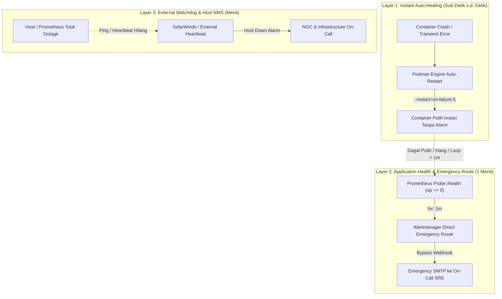

# TN-002 — Implement Container Auto-Healing Policy and Multi-Layer Failure Resilience Architecture

| Field | Value |
| --- | --- |
| Status | Completed |
| Outcome | Merumuskan dan menetapkan arsitektur ketahanan sistem berlapis (TM-ADR-0021), pemisahan tegas domain monitoring antara host NMS (SolarWinds/NOC) dan observabilitas aplikasi (Prometheus/SRE), standarisasi container restart policy (`--restart=on-failure:5`), serta pemetaan komprehensif mitigasi 5 vektor kegagalan startup (CrashLoop Prevention). |
| Activity Type | Architectural Definition and Implementation |
| Record Type | Live |
| Project | Tomcat Monitoring |
| Phase | Monitoring Platform Integration |
| Activity Date | 2026-09-08 |
| Recorded Date | 2026-09-08 |
| Owner | Eddy Wiyatno |
| Working Mode | Write |
| Authorization Status | Architecture decision (TM-ADR-0021) formulated, deployment restart policy standardized, and operational resilience guardrails approved |
| Approved By | Eddy Wiyatno |
| Approval Date | 2026-09-08 |

## 🎯 Objective

1. **Merumuskan TM-ADR-0021:** Mendokumentasikan keputusan arsitektur terkait ketahanan kegagalan berlapis (*Layered Defense-in-Depth Resilience*), pemisahan domain pemantauan (*Monitoring Domain Separation*), dan kebijakan *Auto-Healing*.
2. **Menjawab Pertanyaan SRE Krusial:**
   - *"Bagaimana jika Prometheus/Alertmanager itu sendiri down?"* $\rightarrow$ Penerapan pola *Watchdog / Dead Man's Switch* dan pemantauan NMS eksternal.
   - *"Bagaimana peran Auto-Healing versus Alerting?"* $\rightarrow$ Auto-healing menangani pemulihan instan crash transient, sedangkan alerting menangani kegagalan logis/persisten $> 1$ menit.
   - *"Apa saja hal yang menyebabkan service gagal up saat restart (CrashLoop)?"* $\rightarrow$ Identifikasi dan mitigasi 5 vektor kegagalan startup.
3. **Standarisasi Restart Policy Runtime:** Mengonfigurasi parameter restart policy yang terikat dan aman (`--restart=on-failure:5`) pada skrip deployment stack monitoring.

## 🌍 Background & Context

Setelah menyelesaikan mitigasi *Zero Silent Failure* ([TN-001](TN-001-implement-and-verify-diagnostic-service-self-monitoring-and-emergency-smtp-routing.md)) pada [TM-ADR-0016](../../../../adr/tomcat-monitoring/adr-records/TM-ADR-0016.md), diskusi arsitektural mendalam dilakukan untuk mengevaluasi keandalan menyeluruh pada seluruh komponen platform:

1. **Siapa yang Memonitor Sistem Monitoring? (*Quis custodiet ipsos custodes?*)**
   - Jika Prometheus crash, metrik tidak di-scrape dan alert rules tidak dievaluasi.
   - Untuk level host fisik dan ketersediaan server secara makro, sistem enterprise NMS (seperti **SolarWinds**) memegang otoritas independen melalui probing ICMP/SNMP.
   - Untuk level daemon observabilitas di dalam host, diperlukan kombinasi *Container Auto-Healing* dan *Heartbeat Watchdog*.

2. **Auto-Healing Tidak Menggantikan Observabilitas:**
   - Auto-healing (restart policy) bekerja di level proses/container.
   - Jika sebuah service mengalami *deadlock*, *stale database lock*, atau korupsi konfigurasi, container mungkin tetap berstatus `running` atau masuk ke siklus restart berulang (*CrashLoopBackOff*).
   - Oleh karena itu, *health probe* Prometheus (`/health` dengan `for: 1m`) dan rute darurat Alertmanager tetap menjadi garda pengaman mutlak.

## 🏛️ 3-Layer Defense-in-Depth Model



### Karakteristik Setiap Lapisan:
* **Layer 1 (Auto-Healing)**: Menangani pemulihan otomatis dalam hitungan detik tanpa membunyikan alarm palsu (*zero alert fatigue*).
* **Layer 2 (Application Observability)**: Menangani kegagalan fungsional/logis di mana proses hidup tetapi tidak merespons request atau mengalami *crashloop*.
* **Layer 3 (Infrastructure NMS)**: Menangani matinya server secara fisik atau terputusnya jaringan datacenter.

## 🏢 Monitoring Domain Separation

| Domain | Otoritas Monitoring | Metrik / Sinyal Utama | Tanggung Jawab Operasional |
| :--- | :--- | :--- | :--- |
| **Layer 1: Host & Network** | **SolarWinds / Enterprise NMS** | ICMP Ping, SNMP, Port Availability, Hypervisor, OS Uptime, Hardware Disk/Fan/NIC | Tim NOC / Infrastructure Engineer |
| **Layer 2: Container Engine** | **Podman / Orchestrator** | Exit code proses, memory limits, OOM events, restart counters | Platform / Container Runtime |
| **Layer 3: Application & JVM** | **Prometheus + Alertmanager** | Heap usage, Thread starvation, GC pause times, HTTP latencies, Service health | Tim SRE & DevOps Engineer |
| **Layer 4: Incident Triage** | **Diagnostic Service** | Multi-source evidence correlation, thread dumps, incident persistence, rich reports | Tim SRE & Application Developer |

## 🛡️ Mitigasi 5 Vektor Kegagalan Startup (CrashLoop Prevention)

Dalam perancangan ketahanan sistem, diidentifikasi 5 akar masalah yang dapat menggagalkan proses startup saat container me-restart sendiri:

| Vektor | Masalah | Dampak Jika Gagal | Strategi Mitigasi Terverifikasi |
| :--- | :--- | :--- | :--- |
| **1. Storage Depletion** | Disk penuh (*ENOSPC*) akibat lonjakan data TSDB atau file log. | Container panic saat inisialisasi buffer/WAL $\rightarrow$ abort seketika. | Volume data terisolasi, retensi TSDB ketat (`--storage.tsdb.retention.time=15d`), dan mekanisme pruning log/SQLite. |
| **2. Corrupted Lock / WAL** | File lock SQLite atau segmen WAL Prometheus rusak saat crash kasar. | Engine menolak membuka database demi mencegah korupsi data lebih lanjut. | SQLite WAL mode transaksional, volume terisolasi per container, dan recovery check saat boot. |
| **3. Port / Socket Conflict** | Socket TCP tertahan pada status `TIME_WAIT` atau ada *zombie process*. | Bind port gagal (`address already in use`) $\rightarrow$ exit code 1. | Penggunaan bridge network terisolasi (`devops-lab`) dan grace-period shutdown (`--time 10`). |
| **4. Permission Drift** | Hak akses volume di host berubah menjadi `root:root`. | Container non-root (`nobody:nobody` / UID 1000) terkena `Permission Denied`. | Standarisasi script inisialisasi volume (`initialize-*-volumes.sh`) yang mengatur ownership & perms eksplisit (`0755`/`0444`). |
| **5. Memory Replay OOM** | Prometheus mencoba me-replay WAL besar ke memori yang melebihi batas container. | Linux OOM Killer langsung membunuh container sebelum port dibuka. | Alokasi batas memori dengan *safety headroom* 2x dari konsumsi rata-rata. |

## 🔧 Implementasi dan Perubahan Konfigurasi

1. **Pembaruan Kode Skrip `run.sh` di Semua Repositori Stack:**
   - [`prometheus/scripts/run.sh`](file:///home/eddywiyatno/git/prometheus/scripts/run.sh): Menambahkan `--restart=on-failure:5` pada `run_args`.
   - [`alertmanager/scripts/run.sh`](file:///home/eddywiyatno/git/alertmanager/scripts/run.sh): Menambahkan `--restart=on-failure:5` pada `run_args`.
   - [`tomcat-jmx-exporter/scripts/run.sh`](file:///home/eddywiyatno/git/tomcat-jmx-exporter/scripts/run.sh): Menambahkan `--restart=on-failure:5` pada perintah `podman run`.
   - [`tomcat-monitoring/scripts/deploy-diagnostic-service.sh`](file:///home/eddywiyatno/git/tomcat-monitoring/scripts/deploy-diagnostic-service.sh): Mengganti `--restart=no` dengan `--restart=on-failure:5`.

2. **Aktivasi Daemon Auto-Restart Systemd User Service:**
   ```bash
   systemctl --user enable --now podman-restart.service
   ```

3. **Pembaruan Dokumen Keputusan Arsitektur:**
   - [`TM-ADR-0016`](../../../../adr/tomcat-monitoring/adr-records/TM-ADR-0016.md): Menambahkan Addendum Mitigasi *Zero Silent Failure*.
   - [`TM-ADR-0021`](../../../../adr/tomcat-monitoring/adr-records/TM-ADR-0021.md): Mendokumentasikan keputusan arsitektur ketahanan berlapis dan kebijakan auto-healing.
   - [`docs/adr/tomcat-monitoring/index.md`](../../../../adr/tomcat-monitoring/index.md): Memutakhirkan katalog ADR dan tabel pemetaan.

## 🧪 Live Verification & Evidence

### 1. Re-deployment dan Asersi Restart Policy
Seluruh container di-deploy ulang dan diverifikasi secara langsung di `devops-lab`:

```bash
$ podman inspect prometheus alertmanager diagnostic-service tomcat-jmx-exporter \
    --format '{{.Name}}: RestartPolicy={{.HostConfig.RestartPolicy.Name}}, MaxRetries={{.HostConfig.RestartPolicy.MaximumRetryCount}}, Status={{.State.Status}}'
```

**Hasil Verifikasi:**
```text
prometheus: RestartPolicy=on-failure, MaxRetries=5, Status=running
alertmanager: RestartPolicy=on-failure, MaxRetries=5, Status=running
diagnostic-service: RestartPolicy=on-failure, MaxRetries=5, Status=running
tomcat-jmx-exporter: RestartPolicy=on-failure, MaxRetries=5, Status=running
```

### 2. Pengujian Kesiapan Endpoint Seluruh Stack
```bash
$ curl -s http://127.0.0.1:9090/-/ready
Prometheus Server is Ready.

$ curl -s http://127.0.0.1:9093/-/ready
OK

$ curl -k -s https://127.0.0.1:8443/health
(HTTP 200 OK - Prometheus Exposition)

$ curl -k -s https://127.0.0.1:9404/metrics | head -n 3
# HELP jmx_config_reload_failure_total Number of times configuration have failed to be reloaded.
# TYPE jmx_config_reload_failure_total counter
jmx_config_reload_failure_total 0.0
```

### 3. Asersi Prometheus Scrape Targets
```json
[
  {
    "job": "tomcat-diagnostic-service",
    "health": "up"
  },
  {
    "job": "tomcat-jmx-exporter",
    "health": "up"
  }
]
```

## 📌 Summary & Next Actions

Kebijakan auto-healing (`--restart=on-failure:5`) dan arsitektur ketahanan berlapis (**TM-ADR-0021**) telah aktif dan terverifikasi secara teknis di seluruh container stack monitoring di `devops-lab`.

Langkah operasional selanjutnya:
* Melanjutkan eksekusi backlog berikutnya: **Kategori 4 (Diagnostic Rulepack Expansion)** untuk penanganan degradasi performa Tomcat (**TASK-TM-007: Thread Starvation** dan **TASK-TM-008: Heap/GC Memory Pressure**).

