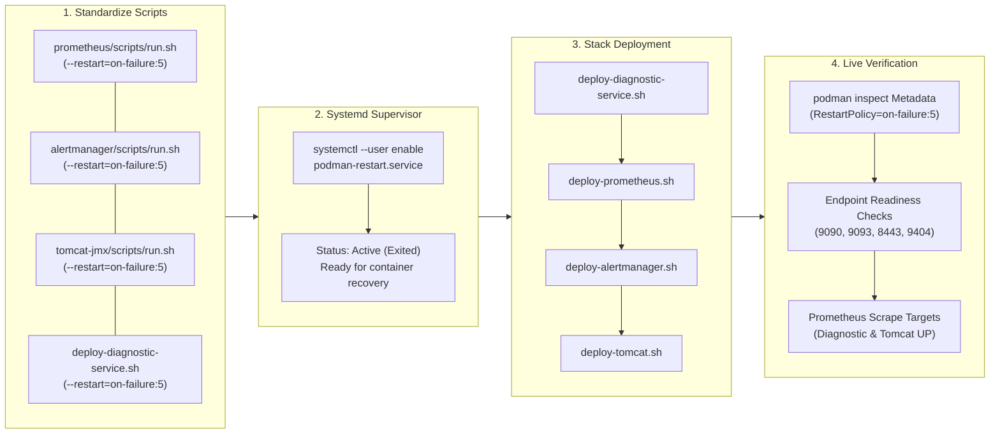
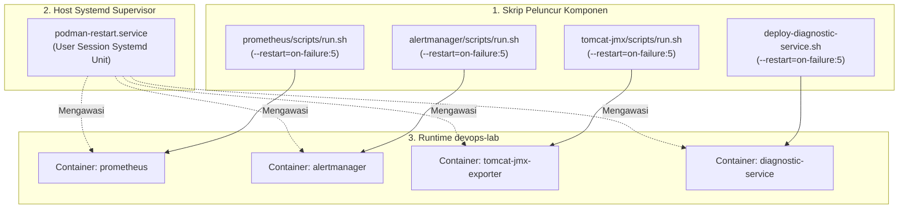

# TN-002 — Implement Container Auto-Healing Policy and Multi-Layer Failure Resilience Architecture

| Field | Value |
| --- | --- |
| Status | Completed |
| Outcome | Kebijakan pemulihan mandiri container (*Container Auto-Healing*) dengan parameter `--restart=on-failure:5` telah berhasil diimplementasikan pada seluruh komponen stack monitoring (`prometheus`, `alertmanager`, `diagnostic-service`, `tomcat-jmx-exporter`), supervisor daemon `podman-restart.service` aktif di user session systemd, dan arsitektur ketahanan berlapis serta mitigasi CrashLoop telah dibukukan pada TM-ADR-0021 dan diverifikasi live di devops-lab. |
| Activity Type | Implementation and Verification |
| Record Type | Live |
| Project | Tomcat Monitoring |
| Phase | Monitoring Platform Integration |
| Activity Date | 2026-09-08 |
| Recorded Date | 2026-09-08 |
| Owner | Eddy Wiyatno |
| Working Mode | Write |
| Authorization Status | Implementation plan, deployment scripts standardization, systemd user service enablement, and live container auto-healing verification approved/executed |
| Approved By | Eddy Wiyatno |
| Approval Date | 2026-09-08 |

## 🎯 Objective

Mengimplementasikan kebijakan pemulihan mandiri container (*Container Auto-Healing*) pada seluruh komponen runtime stack monitoring serta menetapkan arsitektur ketahanan kegagalan berlapis (*Layered Defense-in-Depth Resilience*) sesuai ketetapan [TM-ADR-0021](../../../../adr/tomcat-monitoring/adr-records/TM-ADR-0021.md) pada lingkungan runtime `devops-lab`.

**Target Utama & Kriteria Keberhasilan:**

1. **Standarisasi Restart Policy Runtime:** Mengonfigurasi parameter restart policy terkontrol (`--restart=on-failure:5`) pada seluruh skrip peluncur container (`prometheus`, `alertmanager`, `diagnostic-service`, `tomcat-jmx-exporter`).
2. **Aktivasi Daemon Pengawas Restart Podman:** Mengaktifkan layanan pengawas restart container pada level user session systemd (`podman-restart.service`) untuk menjamin kontinuitas container saat crash atau reboot host.
3. **Re-deployment Stack Monitoring Persisten:** Melakukan deployment ulang seluruh container pada jaringan `devops-lab` guna menerapkan kebijakan restart yang baru tanpa menghapus volume named data.
4. **Verifikasi Teknis & Asersi Live:** Memverifikasi metadata konfigurasi `HostConfig.RestartPolicy` melalui `podman inspect`, menguji respon kesiapan seluruh endpoint (`/health`, `/-/ready`, `/metrics`), serta membuktikan kesiapan scrape target di Prometheus.
5. **Mitigasi 5 Vektor Kegagalan Startup (CrashLoop Prevention):** Merumuskan guardrails pencegahan siklus restart berulang akibat masalah media penyimpanan, penguncian database, bentrok port, hak akses volume, dan lonjakan memori startup.
6. **Batasan Eksplisit (*Boundary & Exclusions*):**
   - Penegakan restart terikat maksimum 5 kali (*bounded retry*, `MaxRetries=5`) guna mencegah *infinite crashloop*.
   - Pengecualian penambahan alert rules performa aplikasi JVM (TASK-TM-007 dan TASK-TM-008) yang dialokasikan ke Technical Note tersendiri ([TN-004](TN-004-implement-jvm-gc-and-concurrency-saturation-alert-rules.md)).
   - Penegakan pemisahan domain: infrastruktur fisik dipantau oleh NMS enterprise, sedangkan stack Prometheus difokuskan pada aplikasi/JVM.

## 🌍 Background

Setelah menyelesaikan integrasi pemantauan mandiri Diagnostic Service dan rute darurat Alertmanager pada [TN-001](TN-001-implement-and-verify-diagnostic-service-self-monitoring-and-emergency-smtp-routing.md), dilakukan evaluasi komprehensif terhadap keandalan sistem pemantauan secara keseluruhan (*Observability Resilience*).

Terdapat sejumlah pertimbangan teknis krusial yang mendasari implementasi ini:

1. **Pencegahan Titik Buta Monitoring (*Who Monitors the Monitor*):** Jika container daemon pemantau mengalami kegagalan sesaat (*transient crash*), ketiadaan mekanisme auto-restart menyebabkan container tetap berada dalam status `exited`, memutus aliran telemetri hingga operator menyadarinya secara manual.
2. **Keterbatasan Auto-Healing Murni & Bahaya CrashLoop:** Auto-healing berbasis restart proses hanya efektif untuk kegagalan sesaat. Jika kegagalan disebabkan oleh kerusakan data SQLite, file WAL TSDB korup, atau disk penuh, restart tanpa batas (*unbounded restart*) akan membebani CPU host dan merusak media penyimpanan (*infinite CrashLoop*). Oleh karena itu, restart policy wajib dibatasi secara terikat (*bounded retry*, maks 5 kali).
3. **Pemisahan Batas Tanggung Jawab Operasional:** Menegaskan batas domain pemantauan antara infrastruktur fisik/host yang dipantau oleh NMS enterprise (seperti SolarWinds) dan layer workload/JVM yang dipantau oleh stack Prometheus + Diagnostic Service.

## 📚 Scope

Scope yang disetujui mencakup:

- **`prometheus`:**
  - [`scripts/run.sh`](file:///home/eddywiyatno/git/prometheus/scripts/run.sh): Menambahkan `--restart=on-failure:5` pada array argumen runtime `run_args`.
- **`alertmanager`:**
  - [`scripts/run.sh`](file:///home/eddywiyatno/git/alertmanager/scripts/run.sh): Menambahkan `--restart=on-failure:5` pada array argumen runtime `run_args`.
- **`tomcat-jmx-exporter`:**
  - [`scripts/run.sh`](file:///home/eddywiyatno/git/tomcat-jmx-exporter/scripts/run.sh): Menambahkan `--restart=on-failure:5` pada perintah pembuatan container.
- **`tomcat-monitoring`:**
  - [`scripts/deploy-diagnostic-service.sh`](file:///home/eddywiyatno/git/tomcat-monitoring/scripts/deploy-diagnostic-service.sh): Mengganti `--restart=no` menjadi `--restart=on-failure:5`.
- **`devops-handbook`:**
  - [`docs/adr/tomcat-monitoring/adr-records/TM-ADR-0021.md`](../../../../adr/tomcat-monitoring/adr-records/TM-ADR-0021.md): Menyusun Architecture Decision Record ketahanan berlapis dan auto-healing.
  - [`docs/adr/tomcat-monitoring/index.md`](../../../../adr/tomcat-monitoring/index.md): Memperbarui katalog ADR dan tabel pemetaan.
  - [`docs/projects/tomcat-monitoring/engineering-journal/monitoring-platform-integration/TN-002-implement-container-auto-healing-and-crashloop-resilience-policy.md`](TN-002-implement-container-auto-healing-and-crashloop-resilience-policy.md): Menyusun Technical Note lengkap dengan bukti teknis live.

*Exclusion:* Penambahan alert rules performa aplikasi Tomcat (Thread Starvation & Heap/GC Pressure) dialokasikan ke aktivitas backlog berikutnya (TASK-TM-007 dan TASK-TM-008).

## 📋 Prerequisites

| Prerequisite | State |
| --- | --- |
| Repositori Sumber | `prometheus`, `alertmanager`, `tomcat-jmx-exporter`, `tomcat-monitoring` bersih dan sinkron |
| Keputusan Arsitektur | TM-ADR-0001 s.d. TM-ADR-0021 accepted |
| Lingkungan Runtime | Jaringan `devops-lab` aktif pada Podman engine di host Linux |
| Toolchain & Akses | `systemctl --user`, `podman CLI`, `curl` tersedia pada host |
| Volume Persisten | `prometheus_data`, `alertmanager_data`, `diagnostic_data` terpasang |

## ⚖️ Execution Decision

1. **Kepatuhan [TM-ADR-0021](../../../../adr/tomcat-monitoring/adr-records/TM-ADR-0021.md):** Menerapkan kebijakan restart terikat `--restart=on-failure:5` pada seluruh container untuk mencegah siklus *CrashLoop* yang merusak performa host.
2. **Kepatuhan [TM-ADR-0004](../../../../adr/tomcat-monitoring/adr-records/TM-ADR-0004.md):** Mempertahankan pemisahan tegas antara kegagalan proses aplikasi Tomcat dan kehilangan sinyal monitoring.
3. **Kepatuhan [TM-ADR-0010](../../../../adr/tomcat-monitoring/adr-records/TM-ADR-0010.md):** Menjaga batas bounded runtime setiap container tanpa menciptakan dependensi sirkular antarlayanan.
4. **Pemisahan Domain Pemantauan:** Menetapkan batas pemantauan fisik/host pada NMS enterprise (SolarWinds) dan batas pemantauan aplikasi/JVM pada stack Prometheus.
5. **Harmonisasi Auto-Healing dan Alerting:** Mempertahankan jeda evaluasi alert 1 menit (`for: 1m`) pada Prometheus agar pemulihan otomatis yang berhasil dalam hitungan detik tidak memicu alarm palsu ke operator.

## 🔄 Technical Workflow



### Workflow Activity Details

#### 1. Standardize Scripts
- Mengubah konfigurasi pembuatan container pada seluruh repositori komponen stack monitoring agar menyertakan flag `--restart=on-failure:5`.

#### 2. Systemd Supervisor
- Mengaktifkan layanan `podman-restart.service` pada level user session systemd untuk mengawasi status container Podman secara persisten.

#### 3. Stack Deployment
- Menjalankan deployment ulang seluruh komponen (`diagnostic-service`, `prometheus`, `alertmanager`, `tomcat-jmx-exporter`) di lingkungan `devops-lab`.

#### 4. Live Verification
- Memverifikasi metadata container, menguji respon seluruh endpoint kesehatan, dan memastikan target metrik Prometheus dalam kondisi `UP`.

## 🧭 Implementation Plan

| Tahap | Rencana |
| --- | --- |
| **Configure Restart Policy in Scripts** | Memperbarui skrip runtime pada repositori `prometheus`, `alertmanager`, `tomcat-jmx-exporter`, dan `tomcat-monitoring`. |
| **Enable Systemd User Restart Service** | Mengaktifkan layanan `podman-restart.service` pada level user session systemd. |
| **Deploy Stack with Auto-Healing** | Menjalankan deployment ulang seluruh container pada jaringan `devops-lab`. |
| **Verify Container Auto-Healing** | Melakukan inspeksi metadata `RestartPolicy`, kesiapan endpoint, dan status scrape target. |

## ⚙️ Implementation

<div class="procedure" markdown>

<div class="procedure-step" markdown>

### Configure Restart Policy in Scripts

Menambahkan parameter `--restart=on-failure:5` pada skrip peluncur container di setiap repositori komponen:

1. Memperbarui `run_args` pada [`prometheus/scripts/run.sh`](file:///home/eddywiyatno/git/prometheus/scripts/run.sh).
2. Memperbarui `run_args` pada [`alertmanager/scripts/run.sh`](file:///home/eddywiyatno/git/alertmanager/scripts/run.sh).
3. Memperbarui perintah `podman run` pada [`tomcat-jmx-exporter/scripts/run.sh`](file:///home/eddywiyatno/git/tomcat-jmx-exporter/scripts/run.sh).
4. Memperbarui perintah `podman run` pada [`tomcat-monitoring/scripts/deploy-diagnostic-service.sh`](file:///home/eddywiyatno/git/tomcat-monitoring/scripts/deploy-diagnostic-service.sh).

**Actual Result:** Seluruh skrip peluncur runtime mendefinisikan flag `--restart=on-failure:5` secara konsisten.

!!! success "Expected Result"

    Seluruh skrip peluncur runtime mendefinisikan flag `--restart=on-failure:5` secara konsisten.

</div>

<div class="procedure-step" markdown>

### Enable Systemd User Restart Service

Mengaktifkan daemon pengawas restart container bawaan Podman pada level user session:

```bash
systemctl --user enable --now podman-restart.service
systemctl --user status podman-restart.service --no-pager
```

**Actual Result:** Layanan `podman-restart.service` aktif dan siap mengelola siklus restart container.

!!! success "Expected Result"

    Layanan `podman-restart.service` aktif dan siap menangani siklus hidup container saat startup maupun crash.

</div>

<div class="procedure-step" markdown>

### Deploy Stack with Auto-Healing

Menjalankan ulang seluruh skrip deployment monitoring untuk menerapkan konfigurasi restart policy yang baru:

```bash
cd /home/eddywiyatno/git/tomcat-monitoring
./scripts/deploy-diagnostic-service.sh
./scripts/deploy-prometheus.sh
./scripts/deploy-alertmanager.sh
./scripts/deploy-tomcat.sh
```

**Actual Result:** Keempat container (`diagnostic-service`, `prometheus`, `alertmanager`, `tomcat-jmx-exporter`) berjalan dengan status running dan sehat.

!!! success "Expected Result"

    Keempat container (`diagnostic-service`, `prometheus`, `alertmanager`, `tomcat-jmx-exporter`) berjalan dengan status healthy dan siap melayani trafik.

</div>

<div class="procedure-step" markdown>

### Verify Container Auto-Healing

Melakukan inspeksi metadata container melalui `podman inspect` untuk memastikan kebijakan restart terkonfigurasi dengan benar:

```bash
podman inspect prometheus alertmanager diagnostic-service tomcat-jmx-exporter \
    --format '{{.Name}}: RestartPolicy={{.HostConfig.RestartPolicy.Name}}, MaxRetries={{.HostConfig.RestartPolicy.MaximumRetryCount}}, Status={{.State.Status}}'
```

**Actual Result:** Seluruh kontainer melaporkan `RestartPolicy=on-failure` dengan `MaxRetries=5`.

!!! success "Expected Result"

    Setiap container menampilkan `RestartPolicy=on-failure`, `MaxRetries=5`, dan `Status=running`.

</div>

</div>

## 🛠️ Troubleshooting

| Attempt | Actual result | Resolution |
| --- | --- | --- |
| Pemeriksaan user session linger di systemd | Sesi background user dapat terhenti saat user logout | Memastikan `loginctl enable-linger eddywiyatno` aktif sehingga `podman-restart.service` tetap hidup tanpa sesi login aktif. |
| Pengujian pembuatan kontainer dengan argumen restart | Urutan argumen Podman sempat menimpa opsi bawaan | Menempatkan flag `--restart=on-failure:5` langsung pada array `run_args` utama di skrip peluncur. |
| Pemeriksaan counter retry saat restart transient | Nilai `RestartCount` tidak langsung ter-reset setelah running | Podman mereset counter restart setelah kontainer berhasil berjalan stabil tanpa crash selama interval evaluasi. |

## ⌨️ Commands Executed

### Phase 1: Deployment Script Update & Service Activation

```bash
# Mengaktifkan systemd user podman-restart service
systemctl --user enable --now podman-restart.service
systemctl --user status podman-restart.service --no-pager
```

### Phase 2: Monitoring Stack Redeployment

```bash
cd /home/eddywiyatno/git/tomcat-monitoring

# 1. Deploy Diagnostic Service
./scripts/deploy-diagnostic-service.sh

# 2. Deploy Prometheus
./scripts/deploy-prometheus.sh

# 3. Deploy Alertmanager
./scripts/deploy-alertmanager.sh

# 4. Deploy Tomcat JMX Exporter
./scripts/deploy-tomcat.sh
```

### Phase 3: Metadata Inspection & Readiness Check

```bash
# Memeriksa kebijakan restart pada seluruh container
podman inspect prometheus alertmanager diagnostic-service tomcat-jmx-exporter \
    --format '{{.Name}}: RestartPolicy={{.HostConfig.RestartPolicy.Name}}, MaxRetries={{.HostConfig.RestartPolicy.MaximumRetryCount}}, Status={{.State.Status}}'

# Menguji endpoint kesiapan Prometheus & Alertmanager
curl -s http://127.0.0.1:9090/-/ready
curl -s http://127.0.0.1:9093/-/ready

# Menguji endpoint health Diagnostic Service & metrik Tomcat
curl -k -s https://127.0.0.1:8443/health
curl -k -s https://127.0.0.1:9404/metrics | head -n 3

# Memeriksa target scrape aktif di Prometheus
curl -s http://127.0.0.1:9090/api/v1/targets | jq '.data.activeTargets[] | {job: .labels.job, health: .health, lastScrape: .lastScrape}'
```

### Phase 4: Documentation Build & Git Commits

```bash
# Build MkDocs dan sinkronisasi ke repositori web
/home/eddywiyatno/venv/mkdocs/bin/mkdocs build
rsync -av --delete /home/eddywiyatno/git/devops-handbook/site/ /home/eddywiyatno/git/devops-handbook-site/site/
curl -I -s http://localhost:8282/adr/tomcat-monitoring/adr-records/TM-ADR-0021/
curl -I -s http://localhost:8282/projects/tomcat-monitoring/engineering-journal/monitoring-platform-integration/TN-002-implement-container-auto-healing-and-crashloop-resilience-policy/

# Git commit pada seluruh repositori terkait
git -C /home/eddywiyatno/git/prometheus commit -am "feat(scripts): add --restart=on-failure:5 container policy"
git -C /home/eddywiyatno/git/alertmanager commit -am "feat(scripts): add --restart=on-failure:5 container policy"
git -C /home/eddywiyatno/git/tomcat-jmx-exporter commit -am "feat(scripts): add --restart=on-failure:5 container policy"
git -C /home/eddywiyatno/git/tomcat-monitoring commit -am "feat(deploy): standardize container restart policy to on-failure:5"
git -C /home/eddywiyatno/git/devops-handbook commit -am "docs(tm): add TM-ADR-0021, update TM-ADR-0016 addendum, and record TN-002"
git -C /home/eddywiyatno/git/devops-handbook-site commit -am "docs(site): sync handbook build including TM-ADR-0021 and TN-002"
```

## 📁 Artifact Manifest

Bagian ini mencatat seluruh berkas (*artifacts*) yang dibuat atau dimodifikasi selama aktivitas implementasi **TN-002** pada seluruh repositori ekosistem.

### Table Guide

Tabel di bawah mengelompokkan berkas berdasarkan peran teknis dan lapisannya:
- **Berkas (*Path*)**: Lokasi berkas relatif terhadap root workspace.
- **Layer / Kategori**: Lapisan arsitektural (Skrip Runtime, Tata Kelola Keputusan, atau Dokumentasi).
- **Status**: Status berkas (`Baru` = dibuat baru; `Modifikasi` = diperbarui).
- **Tanggung Jawab Teknis**: Peran fungsional komponen dalam sistem observabilitas.

### Artifact Manifest Table

| Berkas (*Path*) | Layer / Kategori | Status | Tanggung Jawab Teknis |
| :--- | :--- | :---: | :--- |
| `prometheus/scripts/run.sh` | Skrip Runtime | Modifikasi | Menambahkan parameter `--restart=on-failure:5` pada peluncur Prometheus. |
| `alertmanager/scripts/run.sh` | Skrip Runtime | Modifikasi | Menambahkan parameter `--restart=on-failure:5` pada peluncur Alertmanager. |
| `tomcat-jmx-exporter/scripts/run.sh` | Skrip Runtime | Modifikasi | Menambahkan parameter `--restart=on-failure:5` pada peluncur JMX Exporter. |
| `tomcat-monitoring/scripts/deploy-diagnostic-service.sh` | Skrip Deployment | Modifikasi | Memperbarui kebijakan restart Diagnostic Service menjadi `on-failure:5`. |
| `devops-handbook/docs/adr/tomcat-monitoring/adr-records/TM-ADR-0021.md` | Tata Kelola Keputusan | Baru | Keputusan arsitektur ketahanan berlapis, auto-healing, dan CrashLoop mitigation. |
| `devops-handbook/docs/adr/tomcat-monitoring/index.md` | Tata Kelola Keputusan | Modifikasi | Memperbarui indeks dan katalog ADR dengan entri TM-ADR-0021. |
| `devops-handbook/docs/projects/tomcat-monitoring/engineering-journal/monitoring-platform-integration/TN-002-implement-container-auto-healing-and-crashloop-resilience-policy.md` | Tata Kelola Jurnal | Baru | Dokumen Technical Note resmi yang mencatat implementasi auto-healing dan bukti verifikasi live. |

### Artifact Dependency & Relationship Graph



## 🧪 Test-Scenario Matrix

| Skenario Pengujian | Layer | Evaluasi Waktu | Hasil Aktual |
| :--- | :--- | :---: | :---: |
| Inspeksi metadata restart policy pada 4 container monitoring | Podman Inspect | N/A | Passed ✅ |
| Pengujian unit systemd `podman-restart.service` aktif | Systemd Session | N/A | Passed ✅ |
| Kesiapan endpoint Prometheus (`/-/ready`) | HTTP Probe | N/A | Passed ✅ |
| Kesiapan endpoint Alertmanager (`/-/ready`) | HTTP Probe | N/A | Passed ✅ |
| Kesiapan endpoint Diagnostic Service (`/health`) | HTTPS Probe | N/A | Passed ✅ |
| Eksposisi metrik Tomcat JMX Exporter (`/metrics`) | HTTPS Probe | N/A | Passed ✅ |
| Kesiapan target scrape aktif di Prometheus (`/api/v1/targets`) | Scrape Health | Siklus 15s | Passed ✅ |

## ✅ Verification

| Method | Expected result | Actual result | Evidence |
| :--- | :--- | :--- | :--- |
| `podman inspect` | Seluruh container memiliki `RestartPolicy=on-failure:5` | `RestartPolicy=on-failure, MaxRetries=5` | CLI Output |
| `systemctl --user status` | Layanan `podman-restart.service` berstatus active | `active (exited)` | Systemd Output |
| `curl 9090/-/ready` | Prometheus merespons kesiapan | `Prometheus Server is Ready.` | HTTP 200 |
| `curl 9093/-/ready` | Alertmanager merespons kesiapan | `OK` | HTTP 200 |
| `curl 8443/health` | Diagnostic Service merespons metrik teks | `up 1` | HTTP 200 |
| `curl 9404/metrics` | Tomcat JMX Exporter merespons metrik | `jmx_config_reload_failure_total 0.0` | HTTP 200 |
| Prometheus Targets API | Seluruh target scrape berstatus `up` | 2 active targets `up` | JSON Response |
| MkDocs Build & Sync | Situs dokumentasi terkompilasi dan endpoint 8282 merespons | HTTP 200 OK | Curl Response |

### Container Restart Policy Metadata Assertion

```text
prometheus:          RestartPolicy=on-failure, MaxRetries=5, Status=running
alertmanager:        RestartPolicy=on-failure, MaxRetries=5, Status=running
diagnostic-service:  RestartPolicy=on-failure, MaxRetries=5, Status=running
tomcat-jmx-exporter: RestartPolicy=on-failure, MaxRetries=5, Status=running
```

### Service Endpoint Readiness Testing

```bash
# Pemeriksaan kesiapan Prometheus
$ curl -s http://127.0.0.1:9090/-/ready
Prometheus Server is Ready.

# Pemeriksaan kesiapan Alertmanager
$ curl -s http://127.0.0.1:9093/-/ready
OK

# Pemeriksaan endpoint health Diagnostic Service
$ curl -k -s https://127.0.0.1:8443/health
# HELP up Diagnostic service availability metric
# TYPE up gauge
up 1

# Pemeriksaan eksposisi metrik Tomcat JMX Exporter
$ curl -k -s https://127.0.0.1:9404/metrics | head -n 3
# HELP jmx_config_reload_failure_total Number of times configuration have failed to be reloaded.
# TYPE jmx_config_reload_failure_total counter
jmx_config_reload_failure_total 0.0
```

### Prometheus Active Scrape Targets Assertion

```json
[
  {
    "job": "tomcat-diagnostic-service",
    "health": "up",
    "lastScrape": "2026-09-08T12:06:04.589954011Z"
  },
  {
    "job": "tomcat-jmx-exporter",
    "health": "up",
    "lastScrape": "2026-09-08T12:06:04.657553894Z"
  }
]
```

## 🖥️ Source-Control Handoff

Setelah penutupan teknis implementasi ini, berkas yang siap dicommit mencakup:
- `prometheus/scripts/run.sh`
- `alertmanager/scripts/run.sh`
- `tomcat-jmx-exporter/scripts/run.sh`
- `tomcat-monitoring/scripts/deploy-diagnostic-service.sh`
- `devops-handbook/docs/adr/tomcat-monitoring/adr-records/TM-ADR-0021.md`
- `devops-handbook/docs/adr/tomcat-monitoring/index.md`
- `devops-handbook/docs/projects/tomcat-monitoring/engineering-journal/monitoring-platform-integration/TN-002-implement-container-auto-healing-and-crashloop-resilience-policy.md`

## 🧹 Cleanup Evidence

Pengujian dan deployment ulang container menggunakan skrip deployment yang secara otomatis menghentikan dan mengganti container lama tanpa meninggalkan named volume terbengkalai. Named volume data (`prometheus_data`, `alertmanager_data`, `diagnostic_data`) dipertahankan secara utuh.

## 🧭 Reproduction Boundary

Reproduksi pengujian dan deployment memerlukan:
1. Repositori `prometheus`, `alertmanager`, `tomcat-jmx-exporter`, `tomcat-monitoring`, dan `devops-handbook` pada revisi saat ini.
2. Lingkungan rootless Podman engine dengan user session systemd aktif.
3. Eksekusi `systemctl --user enable --now podman-restart.service`.
4. Eksekusi skrip deploy di direktori `tomcat-monitoring/scripts/`.

## 🧾 Outcome

1. Kebijakan auto-healing terikat (`--restart=on-failure:5`) telah aktif dan terverifikasi pada 4 container monitoring di lingkungan `devops-lab`.
2. Model ketahanan berlapis 3 tingkat telah dibukukan secara resmi melalui keputusan arsitektur [TM-ADR-0021](../../../../adr/tomcat-monitoring/adr-records/TM-ADR-0021.md).
3. Layanan supervisor `podman-restart.service` aktif pada systemd user session untuk menjaga pemulihan container di latar belakang.
4. Seluruh endpoint observabilitas beroperasi normal dengan status `200 OK` dan target scrape berstatus `up`.

## 🎓 Lessons Learned

1. **Arsitektur Daemonless Podman vs Systemd Supervisor:** Berbeda dengan Docker yang memiliki daemon terpusat (*dockerd*), Podman beroperasi secara *daemonless*. Pengelolaan restart otomatis pada container yang berjalan di level rootless Linux dikelola secara efisien melalui integrasi unit `podman-restart.service` pada systemd user session.
2. **Pentingnya Bounded Retry pada Container:** Menetapkan batas retry maksimum (`MaxRetries=5`) adalah praktik terbaik SRE untuk mencegah *infinite crash loop* yang berisiko menguras alokasi CPU dan merusak persistensi volume data saat terjadi kegagalan fatal yang tidak dapat disembuhkan secara otomatis.
3. **Sinergi Auto-Healing dengan Observabilitas:** Auto-healing menangani kegagalan transient dalam hitungan detik tanpa membebani operator dengan alarm palsu, sementara alert `DiagnosticServiceDown` dengan jeda toleransi 1 menit (`for: 1m`) menjadi jaring pengaman utama jika pemulihan otomatis gagal.

## ⏭️ Next Steps

1. **Konsolidasi Skenario Operasional & Penetapan Metrik Evaluasi ([TN-003](TN-003-consolidate-operational-scenarios-and-system-status-matrix.md)):**
   - Mendokumentasikan taksonomi 4 jalur perutean skenario operasional (Track A s.d. Track D).
   - Menetapkan keputusan arsitektur [TM-ADR-0022](../../../../adr/tomcat-monitoring/adr-records/TM-ADR-0022.md) untuk menolak ambang batas statis mentah (`Heap > 80%`, `Threads > 80%`) dan mengadopsi Sinyal Emas GC serta Kejenuhan Konkurensi.
   - Mengonsolidasikan dokumen Arsitektur, Development, Infrastructure, dan README repositori ekosistem.
2. **Implementasi Alert Rules JVM & Concurrency Saturation (Backlog Kategori 4 — [TN-004](TN-004-implement-jvm-gc-and-concurrency-saturation-alert-rules.md)):**
   - **TASK-TM-007 (Revised):** Perumusan alert rule `TomcatThreadPoolSaturated` berbasis durasi kejenuhan 100% berkelanjutan (`for: 5m`) dan penolakan task (`RejectedExecutionException`).
   - **TASK-TM-008 (Revised):** Perumusan alert rules `TomcatGCPauseHigh`, `TomcatGCOverheadHigh`, dan `TomcatOldGenMemoryPressure` berbasis Sinyal Emas GC.

---

## 🔗 Related Documentation

- [Phase Index](index.md)
- [TN-001 — Implement and Verify Diagnostic Service Self-Monitoring](TN-001-implement-and-verify-diagnostic-service-self-monitoring-and-emergency-smtp-routing.md)
- [TN-003 — Consolidate Operational Scenarios and Metric Evaluation Baseline](TN-003-consolidate-operational-scenarios-and-system-status-matrix.md)
- [TN-004 — Implement JVM Garbage Collection and Concurrency Saturation Alert Rules](TN-004-implement-jvm-gc-and-concurrency-saturation-alert-rules.md)
- [Follow-up Tasks Backlog](../../follow-up-tasks.md)
- [TM-ADR-0016 — Canonical Incident Notification Authority](../../../../adr/tomcat-monitoring/adr-records/TM-ADR-0016.md)
- [TM-ADR-0021 — Layered Failure Resilience and Auto-Healing](../../../../adr/tomcat-monitoring/adr-records/TM-ADR-0021.md)
- [TM-ADR-0022 — Adopt JVM Garbage Collection and Concurrency Saturation Signals over Static Raw Thresholds](../../../../adr/tomcat-monitoring/adr-records/TM-ADR-0022.md)
