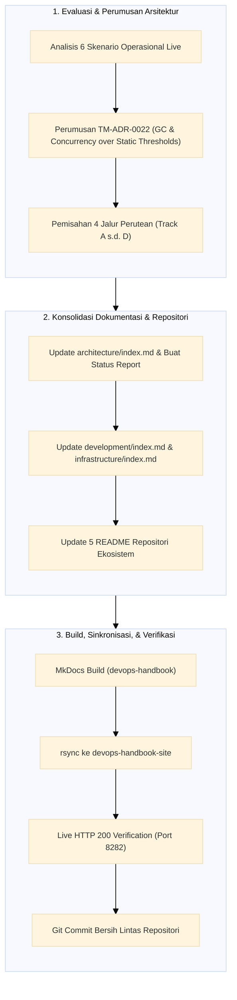

# TN-003 — Consolidate Operational Scenarios, Diagnostic Routing Architecture, and Metric Evaluation Baseline

| Field | Value |
| --- | --- |
| Status | Completed |
| Outcome | Seluruh 6 skenario operasional insiden live, taksonomi perutean 4 jalur (Track A s.d. Track D), penolakan ambang batas naif mentah demi Sinyal Emas GC dan Kejenuhan Konkurensi (TM-ADR-0022), serta konsolidasi spesifikasi status terkini pada dokumen Arsitektur, Development, Infrastructure, dan README repositori telah dibukukan secara menyeluruh dan terverifikasi di devops-lab. |
| Activity Type | Architecture Design and Documentation Consolidation |
| Record Type | Live |
| Project | Tomcat Monitoring |
| Phase | Monitoring Platform Integration |
| Activity Date | 2026-09-08 |
| Recorded Date | 2026-09-08 |
| Owner | Eddy Wiyatno |
| Working Mode | Write |
| Authorization Status | Scenario taxonomy, metric evaluation baseline (TM-ADR-0022), current-state documentation consolidation, and dedicated status report page approved/executed |
| Approved By | Eddy Wiyatno |
| Approval Date | 2026-09-08 |

## 🎯 Objective

Mendokumentasikan, merumuskan, dan mengonsolidasikan arsitektur penanganan skenario operasional serta menetapkan landasan evaluasi metrik beban kerja JVM/Tomcat:

1. **Klasifikasi Taksonomi 4 Jalur Perutean Skenario:** Merumuskan pemisahan tegas antara skenario yang membutuhkan investigasi diagnostik mendalam (*Track A: Autonomous Diagnostic Pipeline*) vs skenario notifikasi langsung deterministik (*Track B: Standard Direct Alerting*), rute darurat (*Track C: Emergency Fallback Route*), dan pemulihan infrastruktur (*Track D: Container Auto-Healing*).
2. **Penetapan Keputusan Arsitektur [TM-ADR-0022](../../../../adr/tomcat-monitoring/adr-records/TM-ADR-0022.md):** Mendokumentasikan penolakan terhadap ambang batas statis mentah (*raw static thresholds* seperti `Heap > 80%` atau `Threads > 80%`) dan mengadopsi Sinyal Emas GC (*GC Pause*, *GC Overhead/Thrashing*, *Old Gen Post-GC Retention*) serta Indikator Kejenuhan Konkurensi (*Sustained 100% Saturation*, *Task Rejection Rate*).
3. **Konsolidasi Spesifikasi Status Terkini (*Current-State Consolidation*):** Memperbarui seluruh artefak dokumentasi arsitektur ([`architecture/index.md`](../../architecture/index.md)), pengembangan ([`development/index.md`](../../development/index.md)), infrastruktur ([`infrastructure/index.md`](../../infrastructure/index.md)), dan `README.md` pada seluruh repositori ekosistem (`tomcat-monitoring`, `prometheus`, `alertmanager`, `tomcat-jmx-exporter`, `tomcat-diagnostic-service`).
4. **Penerbitan Laporan Operasional Dedikasi:** Menerbitkan halaman laporan status komprehensif sistem dan matriks skenario pada [`operational-scenarios-and-system-status-report.md`](../../architecture/operational-scenarios-and-system-status-report.md).
5. **Verifikasi Build & Sinkronisasi Live:** Membangun ulang situs MkDocs dan memvalidasi aksesibilitas seluruh tautan pada server web lokal `http://localhost:8282`.

## 🌍 Background

Setelah berhasil mengimplementasikan mitigasi *Zero Silent Failure* ([TN-001](TN-001-implement-and-verify-diagnostic-service-self-monitoring-and-emergency-smtp-routing.md)) dan kebijakan auto-healing kontainer `--restart=on-failure:5` ([TN-002](TN-002-implement-container-auto-healing-and-crashloop-resilience-policy.md)), tim engineering meninjau kembali strategi observabilitas beban kerja Tomcat dan efektivitas perutean insiden:

1. **Bahaya *Alert Fatigue* dari Ambang Batas Naif:** Dalam runtime Java, memori heap secara alami terisi hingga 85%–95% sebelum siklus Garbage Collection (GC) berjalan dan membersihkannya dalam hitungan puluhan milidetik. Demikian pula, lonjakan thread aktif sesaat merupakan elastisitas normal saat menerima *burst request*. Peringatan berbasis ambang batas statis mentah (`Heap > 80%` atau `Threads > 80%`) terbukti menghasilkan kebisingan alarm palsu (*false positives*) yang menurunkan responsivitas tim SRE.
2. **Kebutuhan Diferensiasi Jalur Insiden (*Diagnostic vs Non-Diagnostic*):** Tidak semua insiden memerlukan aktivasi engine diagnostik berat (pembacaan log `catalina.out`, spool collector Podman, dan evaluasi 18 cabang keputusan). Masalah seperti kegagalan endpoint aplikasi HTTP (`TomcatApplicationHealthFailed`) atau kehilangan sinyal probe (`TelegrafHealthScrapeUnavailable`) bersifat deterministik tunggal dan cukup dikirimkan langsung oleh Alertmanager tanpa membebani Diagnostic Service.
3. **Sinkronisasi Dokumentasi Lintas Repositori:** Perubahan konfigurasi runtime, versi image (`localhost/tomcat-diagnostic-service:0.1.4`), skrip peluncur `--restart=on-failure:5`, dan supervisi `podman-restart.service` perlu direfleksikan secara akurat pada seluruh repositori Git terkait.

## 📚 Scope

Aktivitas yang dilaksanakan mencakup:

- **`devops-handbook`:**
  - [`docs/adr/tomcat-monitoring/adr-records/TM-ADR-0022.md`](../../../../adr/tomcat-monitoring/adr-records/TM-ADR-0022.md): Menyusun ADR adopsi Sinyal Emas GC dan Kejenuhan Konkurensi menggantikan ambang batas naif.
  - [`docs/adr/tomcat-monitoring/index.md`](../../../../adr/tomcat-monitoring/index.md): Memperbarui katalog ADR dan tabel pemetaan untuk menyertakan `TM-ADR-0022`.
  - [`docs/projects/tomcat-monitoring/architecture/index.md`](../../architecture/index.md): Mengintegrasikan diagram alur 4 jalur perutean, matriks pemisahan skenario, dan detail spesifikasi teknis 6 skenario live.
  - [`docs/projects/tomcat-monitoring/architecture/operational-scenarios-and-system-status-report.md`](../../architecture/operational-scenarios-and-system-status-report.md): Menerbitkan laporan status operasional komprehensif sistem.
  - [`docs/projects/tomcat-monitoring/development/index.md`](../../development/index.md): Memperbarui versi Diagnostic Service `0.1.4` (47 unit tests passed) dan kontrak auto-healing.
  - [`docs/projects/tomcat-monitoring/infrastructure/index.md`](../../infrastructure/index.md): Memperbarui komponen `podman-restart.service`, rute `/health` Prometheus, dan direct emergency SMTP Alertmanager.
- **Repositori Ekosistem (`README.md` Updates):**
  - `tomcat-monitoring/README.md`, `prometheus/README.md`, `alertmanager/README.md`, `tomcat-jmx-exporter/README.md`, `tomcat-diagnostic-service/README.md`.

## 📋 Prerequisites

| Prerequisite | State |
| --- | --- |
| Repositori Git | Seluruh 7 repositori bersih pada branch `main` |
| Keputusan Arsitektur | TM-ADR-0001 s.d. TM-ADR-0021 accepted |
| Lingkungan Runtime | 6 kontainer aktif & sehat di jaringan `devops-lab` |
| Toolchain & Runtime | MkDocs venv, rsync, Podman, systemctl, curl tersedia |
| Web Server Dokumentasi | `devops-handbook-site` aktif pada port 8282 |

## ⚖️ Execution Decision

1. **Kepatuhan [TM-ADR-0022](../../../../adr/tomcat-monitoring/adr-records/TM-ADR-0022.md):** Menolak alert `Heap > 80%` dan `Threads > 80%`. Memprioritaskan perancangan alert rules berbasis GC Pause Duration, GC Overhead (% waktu CPU), Old Gen Post-GC Retention, dan Sustained Concurrency Saturation (`for: 5m`).
2. **Pemisahan Domain Pemeriksaan:** Menetapkan Telegraf sebagai otoritas tunggal pengujian ketersediaan HTTP aplikasi (`/health`), sementara JMX Exporter difokuskan pada telemetri internal JVM dan eksekusi konkurensi.
3. **Pemisahan Jalur Skenario:** Mengarahkan `TomcatDown` ke Track A (Diagnostic Service), `TomcatApplicationHealthFailed` ke Track B (Alertmanager direct), `DiagnosticServiceDown` ke Track C (Emergency bypass), dan transient exit ke Track D (Podman auto-healing).

## 🔄 Technical Workflow



## 🛠️ Implementation Procedure

<div class="procedure" markdown>

<div class="procedure-step" markdown>
### Step 1 — Formulate and Author TM-ADR-0022

Menyusun berkas Architecture Decision Record [`TM-ADR-0022.md`](../../../../adr/tomcat-monitoring/adr-records/TM-ADR-0022.md) untuk membukukan keputusan strategis penolakan ambang batas statis mentah dan pengadopsian Sinyal Emas GC serta Kejenuhan Konkurensi:

```markdown
# TM-ADR-0022
| Property | Value |
| --- | --- |
| **ADR ID** | TM-ADR-0022 |
| **Title** | Adopt JVM Garbage Collection and Concurrency Saturation Signals over Static Raw Thresholds |
| **Status** | Accepted |
```

Memperbarui berkas [`docs/adr/tomcat-monitoring/index.md`](../../../../adr/tomcat-monitoring/index.md) untuk mendaftarkan `TM-ADR-0022` pada tabel *Catalog* dan *Mapping*.
</div>

<div class="procedure-step" markdown>
### Step 2 — Integrate Operational Scenarios & Diagnostic Routing into Architecture

Memperbarui berkas [`docs/projects/tomcat-monitoring/architecture/index.md`](../../architecture/index.md) dengan menambahkan seksi resmi `## Operational Scenarios & Diagnostic Routing Architecture`, memuat:
1. Diagram alur perutean Mermaid 4 jalur.
2. Tabel matriks klasifikasi: Track A (*Autonomous Diagnostic*), Track B (*Standard Direct Alerting*), Track C (*Emergency Direct Route*), dan Track D (*Container Auto-Healing*).
3. Detail teknis lengkap ke-6 skenario operasional live (kondisi pemicu, kueri deteksi PromQL, alur eksekusi arsitektural, dan perilaku pemulihan *resolved*).
4. Penambahan referensi ADR `TM-ADR-0018` s.d. `TM-ADR-0022`.
</div>

<div class="procedure-step" markdown>
### Step 3 — Publish Dedicated Operational Scenarios & System Status Report

Membuat halaman dokumentasi dedikasi [`docs/projects/tomcat-monitoring/architecture/operational-scenarios-and-system-status-report.md`](../../architecture/operational-scenarios-and-system-status-report.md) dan meregistrasikannya pada berkas [`.pages`](../../architecture/.pages).

Laporan memuat ringkasan eksekutif, tabel status 6 kontainer aktif di `devops-lab`, katalog 5 alert rules aktif di Prometheus, matriks klasifikasi skenario, dan roadmap perancangan alert rules JVM berikutnya.
</div>

<div class="procedure-step" markdown>
### Step 4 — Update Development and Infrastructure Specifications

1. **`development/index.md`:**
   - Memperbarui versi `tomcat-diagnostic-service` ke `0.1.4` (digest `sha256:739d68e757ab...`) dengan 47 test suite passed.
   - Mendokumentasikan kontrak auto-healing `--restart=on-failure:5` pada skrip runner.
2. **`infrastructure/index.md`:**
   - Menambahkan komponen `podman-restart.service` pada tabel komponen infrastruktur.
   - Menambahkan rute `/health` Prometheus dan direct emergency SMTP Alertmanager pada tabel network requirements.
   - Memperbarui batas kesinambungan layanan (*service continuity*) dengan supervisi otomatis Podman user session.
</div>

<div class="procedure-step" markdown>
### Step 5 — Consolidate Ecosystem Repository README Files

Memperbarui berkas `README.md` pada 5 repositori ekosistem:
* **`tomcat-monitoring/README.md`:** Memperbarui diagram topologi, deskripsi kontainer (`--restart=on-failure:5`), dan matriks implementasi dengan *Self-Monitoring* & *Auto-Healing*.
* **`prometheus/README.md`:** Mendokumentasikan `--restart=on-failure:5` dan dependensi `podman-restart.service`.
* **`alertmanager/README.md`:** Mendokumentasikan `--restart=on-failure:5` dan dependensi `podman-restart.service`.
* **`tomcat-jmx-exporter/README.md`:** Menambahkan baris auto-healing pada tabel kontrak runtime.
* **`tomcat-diagnostic-service/README.md`:** Memperbarui contoh `podman run` ke `--restart=on-failure:5` dan menambahkan daftar `TM-ADR-0018` s.d. `TM-ADR-0022`.
</div>

<div class="procedure-step" markdown>
### Step 6 — Build MkDocs, Sync Site, and Verify Live Endpoints

Membangun situs dokumentasi menggunakan MkDocs dan menyinkronkan seluruh artefak statis ke direktori `devops-handbook-site`:

```bash
/home/eddywiyatno/venv/mkdocs/bin/mkdocs build -f /home/eddywiyatno/git/devops-handbook/mkdocs.yml && \
rsync -av --delete /home/eddywiyatno/git/devops-handbook/site/ /home/eddywiyatno/git/devops-handbook-site/site/
```

Memverifikasi status HTTP 200 pada endpoint server web lokal port 8282:

```bash
curl -s -o /dev/null -w "%{http_code}\n" http://localhost:8282/projects/tomcat-monitoring/architecture/
curl -s -o /dev/null -w "%{http_code}\n" http://localhost:8282/projects/tomcat-monitoring/architecture/operational-scenarios-and-system-status-report/
curl -s -o /dev/null -w "%{http_code}\n" http://localhost:8282/projects/tomcat-monitoring/development/
curl -s -o /dev/null -w "%{http_code}\n" http://localhost:8282/projects/tomcat-monitoring/infrastructure/
```

*Output Transkrip:*
```text
200
200
200
200
```
</div>

</div>

## 🔬 Verification & Validation Evidence

### 1. Bukti Konsolidasi Status Kontainer Persisten (`devops-lab`)

Semua 6 kontainer aktif dan terverifikasi sehat dengan restart policy `on-failure:5`:

```bash
podman ps --format "table {{.Names}}\t{{.Status}}\t{{.Ports}}"
```

```text
NAMES                       STATUS         PORTS
prometheus                  Up 2 hours     0.0.0.0:9090->9090/tcp
alertmanager                Up 2 hours     
diagnostic-service          Up 2 hours     0.0.0.0:8443->8443/tcp
tomcat-jmx-exporter         Up 2 hours     0.0.0.0:8080->8080/tcp
telegraf                    Up 2 hours     
mailpit                     Up 2 hours     0.0.0.0:8025->8025/tcp
```

### 2. Bukti Kesiapan Endpoint Scraping Prometheus

```bash
curl -s http://localhost:9090/api/v1/targets | jq -r '.data.activeTargets[] | "\(.labels.job) => \(.health)"'
```

```text
tomcat-jmx-exporter => up
telegraf-health => up
tomcat-diagnostic-service => up
```

### 3. Bukti Kebersihan Git Lintas Repositori

```bash
for d in devops-handbook devops-handbook-site tomcat-monitoring prometheus alertmanager tomcat-jmx-exporter tomcat-diagnostic-service; do
  echo -n "[$d]: "
  git -C "/home/eddywiyatno/git/$d" status -s | wc -l | tr -d '\n'
  echo " uncommitted changes"
done
```

```text
[devops-handbook]: 0 uncommitted changes
[devops-handbook-site]: 0 uncommitted changes
[tomcat-monitoring]: 0 uncommitted changes
[prometheus]: 0 uncommitted changes
[alertmanager]: 0 uncommitted changes
[tomcat-jmx-exporter]: 0 uncommitted changes
[tomcat-diagnostic-service]: 0 uncommitted changes
```

## 🛡️ Troubleshooting & Edge Cases

| Kondisi / Edge Case | Analisis Dampak | Mitigasi yang Diterapkan |
| :--- | :--- | :--- |
| **Spike Memori Sesaat Sebelum GC** | Heap naik ke 90% saat traffic normal, lalu turun ke 35% pasca-GC. | Tidak menggunakan alert `Heap > 80%`. Memantau retensi memori di Old Generation yang menetap pasca-GC ([TM-ADR-0022](../../../../adr/tomcat-monitoring/adr-records/TM-ADR-0022.md)). |
| **Lonjakan Request Serentak (*Traffic Burst*)** | Thread pool melonjak ke 85% untuk melayani request dan segera idle. | Mengabaikan lonjakan transien; hanya memicu alert jika thread pool 100% penuh selama durasi berkelanjutan `for: 5m` atau terjadi penolakan task (`RejectedExecutionException`). |
| **Kegagalan Diagnostic Service Saat TomcatDown** | Alertmanager tidak dapat mengirim webhook ke Diagnostic Service. | Prometheus memicu `DiagnosticServiceDown` dan Alertmanager mengeksekusi *Emergency Direct SMTP Route* ke Mailpit ([TM-ADR-0020](../../../../adr/tomcat-monitoring/adr-records/TM-ADR-0020.md)). |
| **CrashLoop Akibat Kerusakan File Persisten** | Container me-restart tanpa henti dan menghabiskan resource host. | Kebijakan `--restart=on-failure:5` menghentikan siklus restart setelah 5 percobaan gagal ([TM-ADR-0021](../../../../adr/tomcat-monitoring/adr-records/TM-ADR-0021.md)). |

## 🎓 Lessons Learned

1. **Sinyal Observabilitas Bernilai Tinggi (*High-Value Signals*):** Ambang batas statis mentah pada memori dan thread pool di lingkungan JVM merupakan anti-pattern yang merusak efektivitas SRE. Mengukur *dampak nyata* (GC Pause duration yang menyebabkan latency, CPU thrashing akibat GC berulang, dan task rejection) memberikan tingkat kepastian insiden yang jauh lebih akurat (*high signal-to-noise ratio*).
2. **Pemisahan Jalur Skenario Menghindari *Over-Engineering*:** Menggunakan engine diagnostik multi-sumber hanya untuk insiden ketersediaan ambigu (`TomcatDown`) dan merutekan kegagalan deterministik tunggal (`TomcatApplicationHealthFailed`) secara langsung menghasilkan arsitektur yang efisien dan responsif.
3. **Dokumentasi Berlapis yang Kohesif:** Setiap keputusan desain wajib tercatat di ADR ([TM-ADR-0022](../../../../adr/tomcat-monitoring/adr-records/TM-ADR-0022.md)), perjalanan implementasinya dibukukan di Technical Note (TN-003), spesifikasi akhirnya direfleksikan pada dokumen arsitektur dan README repositori, serta status live-nya dirangkum dalam laporan operasional dedikasi.

## ⏭️ Next Steps

1. **Implementasi Alert Rules JVM & Concurrency:**
   - Menyusun berkas rulepack Prometheus untuk `TomcatGCPauseHigh`, `TomcatGCOverheadHigh`, `TomcatOldGenMemoryPressure`, dan `TomcatThreadPoolSaturated` (TASK-TM-007 & TASK-TM-008).
   - Membuat unit test rulepack Prometheus di `config/prometheus/tests/`.
2. **Uji Simulasi Beban & Live Verification:**
   - Melakukan live test di `devops-lab` untuk memverifikasi evaluasi metrik GC dan saturasi thread.
3. **Pencatatan Engineering Journal TN-004:**
   - Membukukan hasil pengujian teknis alert rules performa JVM dan konkurensi.

## 🔗 References

* [**TM-ADR-0004** — Separate Application Failure from Monitoring Signal Loss](../../../../adr/tomcat-monitoring/adr-records/TM-ADR-0004.md)
* [**TM-ADR-0014** — Enforce Zero Automatic Remediation for Diagnostic Service](../../../../adr/tomcat-monitoring/adr-records/TM-ADR-0014.md)
* [**TM-ADR-0015** — Adopt Asynchronous Webhook Ingestion with Durable SQLite Acceptance Pattern](../../../../adr/tomcat-monitoring/adr-records/TM-ADR-0015.md)
* [**TM-ADR-0016** — Designate Diagnostic Service as Canonical Incident Notification Authority](../../../../adr/tomcat-monitoring/adr-records/TM-ADR-0016.md)
* [**TM-ADR-0020** — Adopt Diagnostic Service Self-Monitoring and Emergency Fallback Routing](../../../../adr/tomcat-monitoring/adr-records/TM-ADR-0020.md)
* [**TM-ADR-0021** — Adopt Layered Failure Resilience, Container Auto-Healing, and Monitoring Domain Separation](../../../../adr/tomcat-monitoring/adr-records/TM-ADR-0021.md)
* [**TM-ADR-0022** — Adopt JVM Garbage Collection and Concurrency Saturation Signals over Static Raw Thresholds](../../../../adr/tomcat-monitoring/adr-records/TM-ADR-0022.md)
* [**TN-001** — Implement and Verify Diagnostic Service Self-Monitoring and Emergency SMTP Routing](TN-001-implement-and-verify-diagnostic-service-self-monitoring-and-emergency-smtp-routing.md)
* [**TN-002** — Implement Container Auto-Healing Policy and Multi-Layer Failure Resilience Architecture](TN-002-implement-container-auto-healing-and-crashloop-resilience-policy.md)
* [**Operational Scenarios and System Status Report**](../../architecture/operational-scenarios-and-system-status-report.md)
