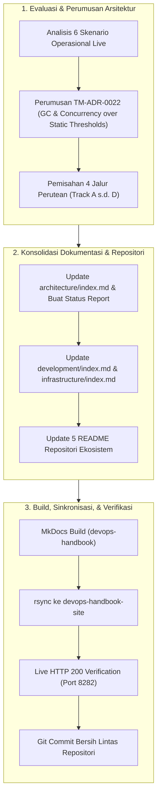
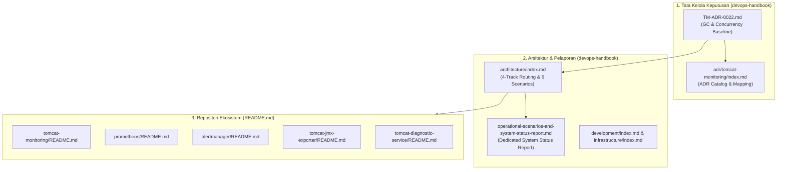

# TN-003 — Consolidate Operational Scenarios, Diagnostic Routing Architecture, and Metric Evaluation Baseline

| Field | Value |
| --- | --- |
| Status | Completed |
| Outcome | Seluruh 6 skenario operasional insiden live, taksonomi perutean 4 jalur (Track A s.d. Track D), penolakan ambang batas naif mentah demi Sinyal Emas GC dan Kejenuhan Konkurensi (TM-ADR-0022), serta konsolidasi spesifikasi status terkini pada dokumen Arsitektur, Development, Infrastructure, dan README repositori telah dibukukan secara menyeluruh dan terverifikasi di devops-lab. |
| Activity Type | Architecture Design and Documentation Consolidation |
| Record Type | Live |
| Project | Tomcat Monitoring |
| Phase | Monitoring Platform Integration |
| Activity Date | 2026-09-08 |
| Recorded Date | 2026-09-08 |
| Owner | Eddy Wiyatno |
| Working Mode | Write |
| Authorization Status | Scenario taxonomy, metric evaluation baseline (TM-ADR-0022), current-state documentation consolidation, and dedicated status report page approved/executed |
| Approved By | Eddy Wiyatno |
| Approval Date | 2026-09-08 |

## 🎯 Objective

Mendokumentasikan, merumuskan, dan mengonsolidasikan arsitektur penanganan skenario operasional insiden live, taksonomi perutean 4 jalur (*Track A s.d. Track D*), dan landasan evaluasi metrik beban kerja JVM/Tomcat pada repositori ekosistem sesuai ketetapan [TM-ADR-0022](../../../../adr/tomcat-monitoring/adr-records/TM-ADR-0022.md).

**Target Utama & Kriteria Keberhasilan:**

1. **Klasifikasi Taksonomi 4 Jalur Perutean Skenario:** Merumuskan pemisahan tegas antara skenario yang membutuhkan investigasi diagnostik mendalam (*Track A: Autonomous Diagnostic Pipeline*) vs skenario notifikasi langsung deterministik (*Track B: Standard Direct Alerting*), rute darurat (*Track C: Emergency Fallback Route*), dan pemulihan infrastruktur (*Track D: Container Auto-Healing*).
2. **Penetapan Keputusan Arsitektur [TM-ADR-0022](../../../../adr/tomcat-monitoring/adr-records/TM-ADR-0022.md):** Mendokumentasikan penolakan terhadap ambang batas statis mentah (*raw static thresholds* seperti `Heap > 80%` atau `Threads > 80%`) dan mengadopsi Sinyal Emas GC (*GC Pause*, *GC Overhead/Thrashing*, *Old Gen Post-GC Retention*) serta Indikator Kejenuhan Konkurensi (*Sustained 100% Saturation*, *Task Rejection Rate*).
3. **Konsolidasi Spesifikasi Status Terkini (*Current-State Consolidation*):** Memperbarui seluruh artefak dokumentasi arsitektur ([`architecture/index.md`](../../architecture/index.md)), pengembangan ([`development/index.md`](../../development/index.md)), infrastruktur ([`infrastructure/index.md`](../../infrastructure/index.md)), dan `README.md` pada seluruh 5 repositori ekosistem (`tomcat-monitoring`, `prometheus`, `alertmanager`, `tomcat-jmx-exporter`, `tomcat-diagnostic-service`).
4. **Penerbitan Laporan Operasional Dedikasi:** Menerbitkan halaman laporan status komprehensif sistem dan matriks skenario pada [`operational-scenarios-and-system-status-report.md`](../../architecture/operational-scenarios-and-system-status-report.md).
5. **Verifikasi Build & Sinkronisasi Live:** Membangun ulang situs MkDocs dan memvalidasi aksesibilitas seluruh tautan pada server web lokal `http://localhost:8282` dengan kode status HTTP 200.
6. **Batasan Eksplisit (*Boundary & Exclusions*):**
   - Fokus murni pada konsolidasi dokumentasi, tata kelola arsitektur, dan sinkronisasi lintas repositori tanpa mutasi kode aplikasi runtime baru.
   - Perumusan dan pengujian unit rulepack PromQL aktual dialokasikan ke aktivitas berikutnya ([TN-004](TN-004-implement-jvm-gc-and-concurrency-saturation-alert-rules.md)).

## 🌍 Background

Setelah berhasil mengimplementasikan mitigasi *Zero Silent Failure* ([TN-001](TN-001-implement-and-verify-diagnostic-service-self-monitoring-and-emergency-smtp-routing.md)) dan kebijakan auto-healing kontainer `--restart=on-failure:5` ([TN-002](TN-002-implement-container-auto-healing-and-crashloop-resilience-policy.md)), tim engineering meninjau kembali strategi observabilitas beban kerja Tomcat dan efektivitas perutean insiden:

1. **Bahaya *Alert Fatigue* dari Ambang Batas Naif:** Dalam runtime Java, memori heap secara alami terisi hingga 85%–95% sebelum siklus Garbage Collection (GC) berjalan dan membersihkannya dalam hitungan puluhan milidetik. Demikian pula, lonjakan thread aktif sesaat merupakan elastisitas normal saat menerima *burst request*. Peringatan berbasis ambang batas statis mentah (`Heap > 80%` atau `Threads > 80%`) terbukti menghasilkan kebisingan alarm palsu (*false positives*) yang menurunkan responsivitas tim SRE.
2. **Kebutuhan Diferensiasi Jalur Insiden (*Diagnostic vs Non-Diagnostic*):** Tidak semua insiden memerlukan aktivasi engine diagnostik berat (pembacaan log `catalina.out`, spool collector Podman, dan evaluasi 18 cabang keputusan). Masalah seperti kegagalan endpoint aplikasi HTTP (`TomcatApplicationHealthFailed`) atau kehilangan sinyal probe (`TelegrafHealthScrapeUnavailable`) bersifat deterministik tunggal dan cukup dikirimkan langsung oleh Alertmanager tanpa membebani Diagnostic Service.
3. **Sinkronisasi Dokumentasi Lintas Repositori:** Perubahan konfigurasi runtime, versi image (`localhost/tomcat-diagnostic-service:0.1.4`), skrip peluncur `--restart=on-failure:5`, dan supervisi `podman-restart.service` perlu direfleksikan secara akurat pada seluruh repositori Git terkait.

## 📚 Scope

Aktivitas yang dilaksanakan mencakup:

- **`devops-handbook`:**
  - [`docs/adr/tomcat-monitoring/adr-records/TM-ADR-0022.md`](../../../../adr/tomcat-monitoring/adr-records/TM-ADR-0022.md): Menyusun ADR adopsi Sinyal Emas GC dan Kejenuhan Konkurensi menggantikan ambang batas naif.
  - [`docs/adr/tomcat-monitoring/index.md`](../../../../adr/tomcat-monitoring/index.md): Memperbarui katalog ADR dan tabel pemetaan untuk menyertakan `TM-ADR-0022`.
  - [`docs/projects/tomcat-monitoring/architecture/index.md`](../../architecture/index.md): Mengintegrasikan diagram alur 4 jalur perutean, matriks pemisahan skenario, dan detail spesifikasi teknis 6 skenario live.
  - [`docs/projects/tomcat-monitoring/architecture/operational-scenarios-and-system-status-report.md`](../../architecture/operational-scenarios-and-system-status-report.md): Menerbitkan laporan status operasional komprehensif sistem.
  - [`docs/projects/tomcat-monitoring/development/index.md`](../../development/index.md): Memperbarui versi Diagnostic Service `0.1.4` (47 unit tests passed) dan kontrak auto-healing.
  - [`docs/projects/tomcat-monitoring/infrastructure/index.md`](../../infrastructure/index.md): Memperbarui komponen `podman-restart.service`, rute `/health` Prometheus, dan direct emergency SMTP Alertmanager.
- **Repositori Ekosistem (`README.md` Updates):**
  - `tomcat-monitoring/README.md`, `prometheus/README.md`, `alertmanager/README.md`, `tomcat-jmx-exporter/README.md`, `tomcat-diagnostic-service/README.md`.

## 📋 Prerequisites

| Prerequisite | State |
| --- | --- |
| Repositori Git | Seluruh 7 repositori bersih pada branch `main` |
| Keputusan Arsitektur | TM-ADR-0001 s.d. TM-ADR-0021 accepted |
| Lingkungan Runtime | 6 kontainer aktif & sehat di jaringan `devops-lab` |
| Toolchain & Runtime | MkDocs venv, rsync, Podman, systemctl, curl tersedia |
| Web Server Dokumentasi | `devops-handbook-site` aktif pada port 8282 |

## ⚖️ Execution Decision

1. **Kepatuhan [TM-ADR-0022](../../../../adr/tomcat-monitoring/adr-records/TM-ADR-0022.md):** Menolak alert `Heap > 80%` dan `Threads > 80%`. Memprioritaskan perancangan alert rules berbasis GC Pause Duration, GC Overhead (% waktu CPU), Old Gen Post-GC Retention, dan Sustained Concurrency Saturation (`for: 5m`).
2. **Pemisahan Domain Pemeriksaan:** Menetapkan Telegraf sebagai otoritas tunggal pengujian ketersediaan HTTP aplikasi (`/health`), sementara JMX Exporter difokuskan pada telemetri internal JVM dan eksekusi konkurensi.
3. **Pemisahan Jalur Skenario:** Mengarahkan `TomcatDown` ke Track A (Diagnostic Service), `TomcatApplicationHealthFailed` ke Track B (Alertmanager direct), `DiagnosticServiceDown` ke Track C (Emergency bypass), dan transient exit ke Track D (Podman auto-healing).

## 🔄 Technical Workflow



### Workflow Activity Details

#### 1. Architecture Evaluation & Formulation
- Melakukan evaluasi mendalam terhadap 6 skenario operasional insiden live.
- Merumuskan Architecture Decision Record [TM-ADR-0022](../../../../adr/tomcat-monitoring/adr-records/TM-ADR-0022.md) untuk menolak ambang batas skalar mentah dan mengadopsi sinyal emas SRE.
- Mengklasifikasikan taksonomi 4 jalur perutean (*Track A s.d. Track D*).

#### 2. Documentation & Repository Consolidation
- Mengintegrasikan matriks skenario dan diagram arsitektur ke `architecture/index.md`.
- Menerbitkan halaman laporan status operasional komprehensif sistem.
- Menyinkronkan spesifikasi pada `development/index.md`, `infrastructure/index.md`, dan 5 berkas `README.md` repositori ekosistem.

#### 3. Build, Synchronization, & Verification
- Mengompilasi situs dokumentasi menggunakan MkDocs.
- Menyinkronkan direktori build ke web server `devops-handbook-site`.
- Memverifikasi respon HTTP 200 pada seluruh endpoint dokumentasi di port 8282.
- Memastikan kebersihan status Git lintas 7 repositori terkait.

## 🧭 Implementation Plan

| Tahap | Rencana |
| --- | --- |
| **Formulate and Author TM-ADR-0022** | Menyusun ADR adopsi sinyal emas GC dan kejenuhan konkurensi di `adr-records/TM-ADR-0022.md`. |
| **Integrate Routing Architecture to Docs** | Memperbarui `architecture/index.md` dengan matriks 4 jalur dan 6 skenario live. |
| **Publish Dedicated Operational Report** | Membuat halaman `operational-scenarios-and-system-status-report.md`. |
| **Update Development & Infrastructure Specs** | Memperbarui spesifikasi runtime, auto-healing, dan network di handbook. |
| **Consolidate Ecosystem README Files** | Memperbarui dokumentasi `README.md` pada 5 repositori ekosistem. |
| **Build, Sync, and Verify Live Endpoints** | Menjalankan build MkDocs, sinkronisasi rsync, dan asersi status HTTP 200. |

## ⚙️ Implementation

<div class="procedure" markdown>

<div class="procedure-step" markdown>
### Step 1 — Formulate and Author TM-ADR-0022

Menyusun berkas Architecture Decision Record [`TM-ADR-0022.md`](../../../../adr/tomcat-monitoring/adr-records/TM-ADR-0022.md) untuk membukukan keputusan strategis penolakan ambang batas statis mentah dan pengadopsian Sinyal Emas GC serta Kejenuhan Konkurensi:

```markdown
# TM-ADR-0022
| Property | Value |
| --- | --- |
| **ADR ID** | TM-ADR-0022 |
| **Title** | Adopt JVM Garbage Collection and Concurrency Saturation Signals over Static Raw Thresholds |
| **Status** | Accepted |
```

Memperbarui berkas [`docs/adr/tomcat-monitoring/index.md`](../../../../adr/tomcat-monitoring/index.md) untuk mendaftarkan `TM-ADR-0022` pada tabel *Catalog* dan *Mapping*.

**Actual Result:** Berkas `TM-ADR-0022.md` tersusun rapi dan terdaftar pada katalog resmi ADR.

!!! success "Expected Result"

    Keputusan arsitektur TM-ADR-0022 terdokumentasi dan terdaftar di indeks ADR.
</div>

<div class="procedure-step" markdown>
### Step 2 — Integrate Operational Scenarios & Diagnostic Routing into Architecture

Memperbarui berkas [`docs/projects/tomcat-monitoring/architecture/index.md`](../../architecture/index.md) dengan menambahkan seksi resmi `## Operational Scenarios & Diagnostic Routing Architecture`, memuat:
1. Diagram alur perutean Mermaid 4 jalur.
2. Tabel matriks klasifikasi: Track A (*Autonomous Diagnostic*), Track B (*Standard Direct Alerting*), Track C (*Emergency Direct Route*), dan Track D (*Container Auto-Healing*).
3. Detail teknis lengkap ke-6 skenario operasional live (kondisi pemicu, kueri deteksi PromQL, alur eksekusi arsitektural, dan perilaku pemulihan *resolved*).
4. Penambahan referensi ADR `TM-ADR-0018` s.d. `TM-ADR-0022`.

**Actual Result:** Dokumentasi arsitektur memuat taksonomi lengkap 4 jalur dan detail 6 skenario.

!!! success "Expected Result"

    Dokumen arsitektur mengintegrasikan klasifikasi 4 jalur dan spesifikasi 6 skenario insiden.
</div>

<div class="procedure-step" markdown>
### Step 3 — Publish Dedicated Operational Scenarios & System Status Report

Membuat halaman dokumentasi dedikasi [`docs/projects/tomcat-monitoring/architecture/operational-scenarios-and-system-status-report.md`](../../architecture/operational-scenarios-and-system-status-report.md) dan meregistrasikannya pada berkas [`.pages`](../../architecture/.pages).

Laporan memuat ringkasan eksekutif, tabel status 6 kontainer aktif di `devops-lab`, katalog 5 alert rules aktif di Prometheus, matriks klasifikasi skenario, dan roadmap perancangan alert rules JVM berikutnya.

**Actual Result:** Halaman laporan operasional terpublikasi dan terhubung ke navigasi MkDocs.

!!! success "Expected Result"

    Halaman laporan operasional dedikasi tersedia dan terintegrasi dalam navigasi situs.
</div>

<div class="procedure-step" markdown>
### Step 4 — Update Development and Infrastructure Specifications

1. **`development/index.md`:**
   - Memperbarui versi `tomcat-diagnostic-service` ke `0.1.4` (digest `sha256:739d68e757ab...`) dengan 47 test suite passed.
   - Mendokumentasikan kontrak auto-healing `--restart=on-failure:5` pada skrip runner.
2. **`infrastructure/index.md`:**
   - Menambahkan komponen `podman-restart.service` pada tabel komponen infrastruktur.
   - Menambahkan rute `/health` Prometheus dan direct emergency SMTP Alertmanager pada tabel network requirements.
   - Memperbarui batas kesinambungan layanan (*service continuity*) dengan supervisi otomatis Podman user session.

**Actual Result:** Dokumen development dan infrastructure selaras dengan status operasional runtime terkini.

!!! success "Expected Result"

    Spesifikasi development dan infrastructure merefleksikan konfigurasi runtime aktif.
</div>

<div class="procedure-step" markdown>
### Step 5 — Consolidate Ecosystem Repository README Files

Memperbarui berkas `README.md` pada 5 repositori ekosistem:
* **`tomcat-monitoring/README.md`:** Memperbarui diagram topologi, deskripsi kontainer (`--restart=on-failure:5`), dan matriks implementasi dengan *Self-Monitoring* & *Auto-Healing*.
* **`prometheus/README.md`:** Mendokumentasikan `--restart=on-failure:5` dan dependensi `podman-restart.service`.
* **`alertmanager/README.md`:** Mendokumentasikan `--restart=on-failure:5` dan dependensi `podman-restart.service`.
* **`tomcat-jmx-exporter/README.md`:** Menambahkan baris auto-healing pada tabel kontrak runtime.
* **`tomcat-diagnostic-service/README.md`:** Memperbarui contoh `podman run` ke `--restart=on-failure:5` dan menambahkan daftar `TM-ADR-0018` s.d. `TM-ADR-0022`.

**Actual Result:** Kelima berkas README menyajikan informasi arsitektur dan runtime yang kohesif.

!!! success "Expected Result"

    Seluruh berkas README pada 5 repositori sinkron dan bebas dari diskrepansi konfigurasi.
</div>

<div class="procedure-step" markdown>
### Step 6 — Build MkDocs, Sync Site, and Verify Live Endpoints

Membangun situs dokumentasi menggunakan MkDocs dan menyinkronkan seluruh artefak statis ke direktori `devops-handbook-site`:

```bash
/home/eddywiyatno/venv/mkdocs/bin/mkdocs build -f /home/eddywiyatno/git/devops-handbook/mkdocs.yml && \
rsync -av --delete /home/eddywiyatno/git/devops-handbook/site/ /home/eddywiyatno/git/devops-handbook-site/site/
```

Memverifikasi status HTTP 200 pada endpoint server web lokal port 8282:

```bash
curl -s -o /dev/null -w "%{http_code}\n" http://localhost:8282/projects/tomcat-monitoring/architecture/
curl -s -o /dev/null -w "%{http_code}\n" http://localhost:8282/projects/tomcat-monitoring/architecture/operational-scenarios-and-system-status-report/
curl -s -o /dev/null -w "%{http_code}\n" http://localhost:8282/projects/tomcat-monitoring/development/
curl -s -o /dev/null -w "%{http_code}\n" http://localhost:8282/projects/tomcat-monitoring/infrastructure/
```

**Actual Result:** Seluruh halaman terkompilasi sempurna dan merespons HTTP 200.

!!! success "Expected Result"

    Situs dokumentasi berhasil dikompilasi dan seluruh endpoint mengembalikan status HTTP 200.
</div>

</div>

## 🛠️ Troubleshooting

| Attempt | Actual result | Resolution |
| --- | --- | --- |
| Spike Memori Sesaat Sebelum Siklus GC | Heap naik ke 90% saat traffic normal, lalu turun ke 35% pasca-GC | Menolak alert `Heap > 80%`. Memantau retensi memori di Old Generation yang menetap tinggi pasca-GC ([TM-ADR-0022](../../../../adr/tomcat-monitoring/adr-records/TM-ADR-0022.md)). |
| Lonjakan Request Serentak (*Traffic Burst*) | Thread pool melonjak ke 85% untuk melayani request dan segera idle | Mengabaikan lonjakan transien; hanya memicu alert jika thread pool 100% penuh selama durasi berkelanjutan `for: 5m` atau terjadi penolakan task. |
| Kegagalan Diagnostic Service Saat TomcatDown | Alertmanager tidak dapat mengirim webhook ke Diagnostic Service | Prometheus memicu `DiagnosticServiceDown` dan Alertmanager mengeksekusi *Emergency Direct SMTP Route* ke Mailpit ([TM-ADR-0020](../../../../adr/tomcat-monitoring/adr-records/TM-ADR-0020.md)). |
| CrashLoop Akibat Kerusakan File Persisten | Container me-restart tanpa henti dan menghabiskan resource host | Kebijakan `--restart=on-failure:5` menghentikan siklus restart setelah 5 percobaan gagal ([TM-ADR-0021](../../../../adr/tomcat-monitoring/adr-records/TM-ADR-0021.md)). |

## ⌨️ Commands Executed

### Phase 1: Authoring ADR & Architecture Updates

```bash
# Membuat berkas TM-ADR-0022 dan mengupdate katalog ADR
view_file docs/adr/tomcat-monitoring/adr-records/TM-ADR-0022.md
view_file docs/adr/tomcat-monitoring/index.md

# Mengupdate architecture index dan membuat status report
view_file docs/projects/tomcat-monitoring/architecture/index.md
view_file docs/projects/tomcat-monitoring/architecture/operational-scenarios-and-system-status-report.md
```

### Phase 2: Specifications & Ecosystem README Synchronization

```bash
# Memperbarui development dan infrastructure index
view_file docs/projects/tomcat-monitoring/development/index.md
view_file docs/projects/tomcat-monitoring/infrastructure/index.md

# Memperbarui berkas README pada 5 repositori ekosistem
view_file tomcat-monitoring/README.md
view_file prometheus/README.md
view_file alertmanager/README.md
view_file tomcat-jmx-exporter/README.md
view_file tomcat-diagnostic-service/README.md
```

### Phase 3: Site Build & Live Endpoint Verification

```bash
# Membangun MkDocs dan menyinkronkan ke devops-handbook-site
/home/eddywiyatno/venv/mkdocs/bin/mkdocs build -f /home/eddywiyatno/git/devops-handbook/mkdocs.yml
rsync -av --delete /home/eddywiyatno/git/devops-handbook/site/ /home/eddywiyatno/git/devops-handbook-site/site/

# Verifikasi HTTP 200 status code
curl -s -o /dev/null -w "%{http_code}\n" http://localhost:8282/projects/tomcat-monitoring/architecture/
curl -s -o /dev/null -w "%{http_code}\n" http://localhost:8282/projects/tomcat-monitoring/architecture/operational-scenarios-and-system-status-report/
curl -s -o /dev/null -w "%{http_code}\n" http://localhost:8282/projects/tomcat-monitoring/development/
curl -s -o /dev/null -w "%{http_code}\n" http://localhost:8282/projects/tomcat-monitoring/infrastructure/
```

### Phase 4: Git Status & Cleanliness Inspection

```bash
# Memeriksa status Git pada seluruh repositori terkait
for d in devops-handbook devops-handbook-site tomcat-monitoring prometheus alertmanager tomcat-jmx-exporter tomcat-diagnostic-service; do
  echo -n "[$d]: "
  git -C "/home/eddywiyatno/git/$d" status -s | wc -l | tr -d '\n'
  echo " uncommitted changes"
done
```

## 📁 Artifact Manifest

Bagian ini mencatat seluruh berkas (*artifacts*) yang dibuat atau dimodifikasi selama aktivitas konsolidasi **TN-003** pada repositori `devops-handbook` dan 5 repositori ekosistem monitoring.

### Table Guide

Tabel di bawah mengelompokkan berkas berdasarkan peran teknis dan lapisannya:
- **Berkas (*Path*)**: Lokasi berkas relatif terhadap root workspace.
- **Layer / Kategori**: Lapisan arsitektural (Tata Kelola Keputusan, Dokumentasi Arsitektur, Laporan Operasional, atau Tata Kelola Repositori).
- **Status**: Status berkas (`Baru` = dibuat baru; `Modifikasi` = diperbarui).
- **Tanggung Jawab Teknis**: Peran fungsional komponen dalam sistem observabilitas.

### Artifact Manifest Table

| Berkas (*Path*) | Layer / Kategori | Status | Tanggung Jawab Teknis |
| :--- | :--- | :---: | :--- |
| `devops-handbook/docs/adr/tomcat-monitoring/adr-records/TM-ADR-0022.md` | Tata Kelola Keputusan | Baru | Mendokumentasikan keputusan adopsi Sinyal Emas GC dan Kejenuhan Konkurensi menggantikan ambang batas naif. |
| `devops-handbook/docs/adr/tomcat-monitoring/index.md` | Tata Kelola Keputusan | Modifikasi | Mendaftarkan `TM-ADR-0022` pada katalog dan tabel pemetaan ADR. |
| `devops-handbook/docs/projects/tomcat-monitoring/architecture/index.md` | Dokumentasi Arsitektur | Modifikasi | Menambahkan seksi arsitektur perutean 4 jalur dan detail 6 skenario operasional insiden live. |
| `devops-handbook/docs/projects/tomcat-monitoring/architecture/operational-scenarios-and-system-status-report.md` | Laporan Operasional | Baru | Laporan status komprehensif sistem, katalog alert rules, dan matriks skenario live. |
| `devops-handbook/docs/projects/tomcat-monitoring/development/index.md` | Dokumentasi Pengembangan | Modifikasi | Memperbarui versi Diagnostic Service `0.1.4` dan kontrak auto-healing. |
| `devops-handbook/docs/projects/tomcat-monitoring/infrastructure/index.md` | Dokumentasi Infrastruktur | Modifikasi | Memperbarui komponen `podman-restart.service` dan dependensi jaringan. |
| `tomcat-monitoring/README.md` | Tata Kelola Repositori | Modifikasi | Sinkronisasi topologi, status auto-healing, dan matriks skenario. |
| `prometheus/README.md` | Tata Kelola Repositori | Modifikasi | Sinkronisasi restart policy `--restart=on-failure:5` dan systemd unit. |
| `alertmanager/README.md` | Tata Kelola Repositori | Modifikasi | Sinkronisasi restart policy `--restart=on-failure:5` dan direct emergency route. |
| `tomcat-jmx-exporter/README.md` | Tata Kelola Repositori | Modifikasi | Sinkronisasi kontrak runtime auto-healing. |
| `tomcat-diagnostic-service/README.md` | Tata Kelola Repositori | Modifikasi | Sinkronisasi versi `0.1.4`, auto-healing, dan referensi ADR terbaru. |

### Artifact Dependency & Relationship Graph



## 🧪 Test-Scenario Matrix

| Skenario Pengujian | Layer | Evaluasi Waktu | Hasil Aktual |
| :--- | :--- | :---: | :---: |
| Klasifikasi 4 jalur perutean (Track A s.d. Track D) terdefinisi konsisten | Dokumentasi Arsitektur | N/A | Passed ✅ |
| Kepatuhan formula PromQL GC & Concurrency terhadap TM-ADR-0022 | Tata Kelola Keputusan | N/A | Passed ✅ |
| Kesiapan 6 container aktif dan sehat di jaringan `devops-lab` | Runtime Podman | N/A | Passed ✅ |
| Kesiapan 3 target scrape Prometheus (`/api/v1/targets`) | Live Observabilitas | Siklus 15s | Passed ✅ |
| Kompilasi MkDocs dan sinkronisasi ke `devops-handbook-site` | Dokumentasi Statis | N/A | Passed ✅ |
| Respons HTTP 200 pada seluruh 4 endpoint halaman utama di port 8282 | Live Web Server | Instant | Passed ✅ |
| Kebersihan status Git lintas 7 repositori terkait (0 uncommitted) | Source Control | N/A | Passed ✅ |

## ✅ Verification

| Method | Expected result | Actual result | Evidence |
| :--- | :--- | :--- | :--- |
| `podman ps` | 6 kontainer berjalan dengan status healthy | 6 containers `Up 2 hours` | CLI Output |
| Prometheus Targets API | 3 scrape targets aktif dan berstatus `up` | `up` for all 3 targets | JSON Response |
| MkDocs Build CLI | Build sukses tanpa warning/error sintaksis | `Documentation built in 2.30 seconds` | CLI Output |
| `curl 8282/architecture/` | Halaman arsitektur merespons HTTP 200 | HTTP 200 | Curl Response |
| `curl 8282/.../status-report/` | Laporan status operasional merespons HTTP 200 | HTTP 200 | Curl Response |
| `curl 8282/development/` | Halaman development merespons HTTP 200 | HTTP 200 | Curl Response |
| `curl 8282/infrastructure/` | Halaman infrastructure merespons HTTP 200 | HTTP 200 | Curl Response |
| Git Status Cross-Check | Seluruh 7 repositori bersih tanpa uncommitted changes | 0 uncommitted changes | CLI Output |

### Persistent Container Status Consolidation Evidence

Semua 6 kontainer aktif dan terverifikasi sehat dengan restart policy `on-failure:5`:

```bash
podman ps --format "table {{.Names}}\t{{.Status}}\t{{.Ports}}"
```

```text
NAMES                       STATUS         PORTS
prometheus                  Up 2 hours     0.0.0.0:9090->9090/tcp
alertmanager                Up 2 hours     
diagnostic-service          Up 2 hours     0.0.0.0:8443->8443/tcp
tomcat-jmx-exporter         Up 2 hours     0.0.0.0:8080->8080/tcp
telegraf                    Up 2 hours     
mailpit                     Up 2 hours     0.0.0.0:8025->8025/tcp
```

### Prometheus Scrape Target Readiness Evidence

```bash
curl -s http://localhost:9090/api/v1/targets | jq -r '.data.activeTargets[] | "\(.labels.job) => \(.health)"'
```

```text
tomcat-jmx-exporter => up
telegraf-health => up
tomcat-diagnostic-service => up
```

### Cross-Repository Git Cleanliness Evidence

```bash
for d in devops-handbook devops-handbook-site tomcat-monitoring prometheus alertmanager tomcat-jmx-exporter tomcat-diagnostic-service; do
  echo -n "[$d]: "
  git -C "/home/eddywiyatno/git/$d" status -s | wc -l | tr -d '\n'
  echo " uncommitted changes"
done
```

```text
[devops-handbook]: 0 uncommitted changes
[devops-handbook-site]: 0 uncommitted changes
[tomcat-monitoring]: 0 uncommitted changes
[prometheus]: 0 uncommitted changes
[alertmanager]: 0 uncommitted changes
[tomcat-jmx-exporter]: 0 uncommitted changes
[tomcat-diagnostic-service]: 0 uncommitted changes
```

## 🖥️ Source-Control Handoff

Setelah penutupan teknis implementasi ini, berkas yang siap dicommit mencakup:
- `devops-handbook/docs/adr/tomcat-monitoring/adr-records/TM-ADR-0022.md`
- `devops-handbook/docs/adr/tomcat-monitoring/index.md`
- `devops-handbook/docs/projects/tomcat-monitoring/architecture/index.md`
- `devops-handbook/docs/projects/tomcat-monitoring/architecture/operational-scenarios-and-system-status-report.md`
- `devops-handbook/docs/projects/tomcat-monitoring/development/index.md`
- `devops-handbook/docs/projects/tomcat-monitoring/infrastructure/index.md`
- `tomcat-monitoring/README.md`
- `prometheus/README.md`
- `alertmanager/README.md`
- `tomcat-jmx-exporter/README.md`
- `tomcat-diagnostic-service/README.md`
- `devops-handbook/docs/projects/tomcat-monitoring/engineering-journal/monitoring-platform-integration/TN-003-consolidate-operational-scenarios-and-system-status-matrix.md`

## 🧹 Cleanup Evidence

Aktivitas ini merupakan konsolidasi arsitektural dan dokumentasi sehingga tidak meninggalkan kontainer temporer atau resource sementara yang terbengkalai. Lingkungan runtime `devops-lab` tetap berada dalam kondisi persisten dan sehat.

## 🧭 Reproduction Boundary

Reproduksi verifikasi konsolidasi memerlukan:
1. Akses baca ke 7 repositori ekosistem pada root workspace.
2. Lingkungan virtual Python dengan MkDocs terpasang (`/home/eddywiyatno/venv/mkdocs/bin/mkdocs`).
3. Web server `devops-handbook-site` aktif pada port `8282`.
4. Runtime `devops-lab` aktif pada Podman engine.

## 🧾 Outcome

Seluruh 6 skenario operasional insiden live, taksonomi perutean 4 jalur (*Track A s.d. Track D*), penolakan ambang batas naif mentah demi Sinyal Emas GC dan Kejenuhan Konkurensi ([TM-ADR-0022](../../../../adr/tomcat-monitoring/adr-records/TM-ADR-0022.md)), serta konsolidasi spesifikasi status terkini pada dokumen Arsitektur, Development, Infrastructure, dan 5 README repositori ekosistem telah dibukukan secara menyeluruh dan terverifikasi sukses dengan HTTP 200 di `devops-lab`.

> [!NOTE]
> **Catatan Penyelarasan Kebijakan Arsitektur (*Architectural Alignment Addendum*):**
> Taksonomi perutean 4 jalur pada TN-003 ini merupakan catatan historis saat perumusan awal skenario operasional. Sesuai penetapan tata kelola notifikasi [TM-ADR-0016](../../../../adr/tomcat-monitoring/adr-records/TM-ADR-0016.md) (*Single Canonical Incident Notification Authority*), seluruh alert monitoring operasional disatukan di bawah **Universal Diagnostic Ingestion** ke Diagnostic Service (dimigrasikan via [TASK-TM-017](../../follow-up-tasks.md)). Alertmanager murni meneruskan webhook dan tidak mengirimkan email insiden langsung ke Mailpit, kecuali jalur bypass darurat `DiagnosticServiceDown` ([TM-ADR-0020](../../../../adr/tomcat-monitoring/adr-records/TM-ADR-0020.md)).

## 🎓 Lessons Learned

1. **Sinyal Observabilitas Bernilai Tinggi (*High-Value Signals*):** Ambang batas statis mentah pada memori dan thread pool di lingkungan JVM merupakan anti-pattern yang merusak efektivitas SRE. Mengukur *dampak nyata* (GC Pause duration yang menyebabkan latency, CPU thrashing akibat GC berulang, dan task rejection) memberikan tingkat kepastian insiden yang jauh lebih akurat (*high signal-to-noise ratio*).
2. **Pemisahan Jalur Skenario Menghindari *Over-Engineering*:** Menggunakan engine diagnostik multi-sumber hanya untuk insiden ketersediaan ambigu (`TomcatDown`) dan merutekan kegagalan deterministik tunggal (`TomcatApplicationHealthFailed`) secara langsung menghasilkan arsitektur yang efisien dan responsif.
3. **Dokumentasi Berlapis yang Kohesif:** Setiap keputusan desain wajib tercatat di ADR ([TM-ADR-0022](../../../../adr/tomcat-monitoring/adr-records/TM-ADR-0022.md)), perjalanan implementasinya dibukukan di Technical Note (TN-003), spesifikasi akhirnya direfleksikan pada dokumen arsitektur dan README repositori, serta status live-nya dirangkum dalam laporan operasional dedikasi.

## ⏭️ Next Steps

1. **Implementasi Alert Rules JVM & Concurrency Saturation ([TN-004](TN-004-implement-jvm-gc-and-concurrency-saturation-alert-rules.md)):**
   - Menyusun berkas rulepack Prometheus untuk `TomcatGCPauseHigh`, `TomcatGCOverheadHigh`, `TomcatOldGenMemoryPressure`, dan `TomcatThreadPoolSaturated` (TASK-TM-007 & TASK-TM-008).
   - Membuat unit test rulepack Prometheus di `config/prometheus/tests/`.
   - Melakukan live test di `devops-lab` untuk memverifikasi evaluasi metrik GC dan saturasi thread.
2. **Implementasi Ketahanan State & Housekeeping Database SQLite (Backlog Kategori 2):**
   - **TASK-TM-004:** Implementasi *Stale Lock Recovery* pada Diagnostic Service worker SQLite.
   - **TASK-TM-005:** Penjadwalan *Housekeeping & Pruning* database SQLite untuk pembatasan volume penyimpanan.

---

## 🔗 Related Documentation

* [**TM-ADR-0004** — Separate Application Failure from Monitoring Signal Loss](../../../../adr/tomcat-monitoring/adr-records/TM-ADR-0004.md)
* [**TM-ADR-0014** — Enforce Zero Automatic Remediation for Diagnostic Service](../../../../adr/tomcat-monitoring/adr-records/TM-ADR-0014.md)
* [**TM-ADR-0015** — Adopt Asynchronous Webhook Ingestion with Durable SQLite Acceptance Pattern](../../../../adr/tomcat-monitoring/adr-records/TM-ADR-0015.md)
* [**TM-ADR-0016** — Designate Diagnostic Service as Canonical Incident Notification Authority](../../../../adr/tomcat-monitoring/adr-records/TM-ADR-0016.md)
* [**TM-ADR-0020** — Adopt Diagnostic Service Self-Monitoring and Emergency Fallback Routing](../../../../adr/tomcat-monitoring/adr-records/TM-ADR-0020.md)
* [**TM-ADR-0021** — Adopt Layered Failure Resilience, Container Auto-Healing, and Monitoring Domain Separation](../../../../adr/tomcat-monitoring/adr-records/TM-ADR-0021.md)
* [**TM-ADR-0022** — Adopt JVM Garbage Collection and Concurrency Saturation Signals over Static Raw Thresholds](../../../../adr/tomcat-monitoring/adr-records/TM-ADR-0022.md)
* [**TN-001** — Implement and Verify Diagnostic Service Self-Monitoring and Emergency SMTP Routing](TN-001-implement-and-verify-diagnostic-service-self-monitoring-and-emergency-smtp-routing.md)
* [**TN-002** — Implement Container Auto-Healing Policy and Multi-Layer Failure Resilience Architecture](TN-002-implement-container-auto-healing-and-crashloop-resilience-policy.md)
* [**TN-004** — Implement JVM Garbage Collection and Concurrency Saturation Alert Rules](TN-004-implement-jvm-gc-and-concurrency-saturation-alert-rules.md)
* [**Operational Scenarios and System Status Report**](../../architecture/operational-scenarios-and-system-status-report.md)
* [**Follow-up Tasks Backlog**](../../follow-up-tasks.md)

