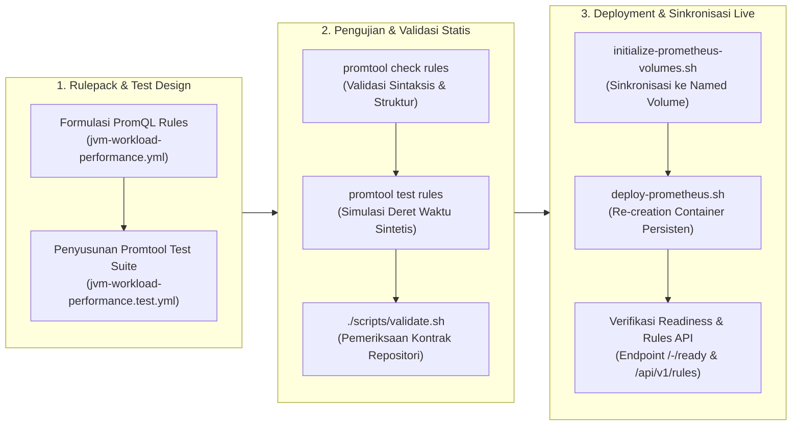
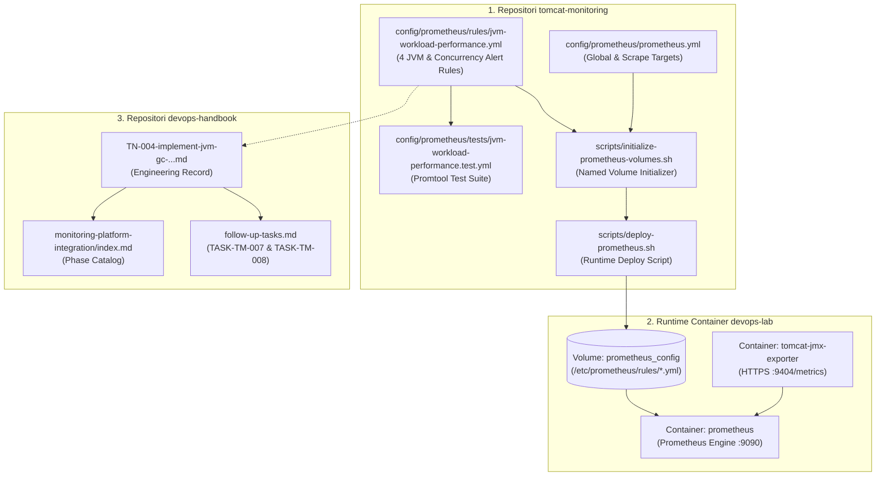

# TN-004 — Implement JVM Garbage Collection and Concurrency Saturation Alert Rules

| Field | Value |
| --- | --- |
| Status | Completed |
| Activity Type | Implementation |
| Record Type | Live |
| Project | Tomcat Monitoring |
| Phase | Monitoring Platform Integration |
| Activity Date | 2026-09-08 |
| Recorded Date | 2026-09-08 |
| Owner | Eddy Wiyatno |
| Working Mode | Mixed |
| Authorization Status | Approved |
| Approved By | Eddy Wiyatno |
| Approval Date | 2026-09-08 |

## 🎯 Objective

Mengimplementasikan, menguji unit, dan memverifikasi aturan peringatan (*alert rules*) Prometheus untuk metrik performa Java Virtual Machine (JVM) Garbage Collection (GC) dan Kejenuhan Konkurensi (*Concurrency Saturation*) pada lingkungan persisten `devops-lab` sesuai ketetapan [TM-ADR-0022](../../../../adr/tomcat-monitoring/adr-records/TM-ADR-0022.md).

**Target Utama & Kriteria Keberhasilan:**

1. **Perumusan Alert Rules Sinyal Emas SRE:**
   - **`TomcatGCPauseHigh`:** Mendeteksi pembekuan aplikasi akibat lonjakan durasi *Stop-The-World (STW)* GC melampaui $1.5\text{s}$ (`for: 1m`, `severity: warning`, `check: jvm-gc-latency`).
   - **`TomcatGCOverheadHigh`:** Mendeteksi inefisiensi CPU (*CPU Thrashing*) ketika persentase waktu komputasi yang dihabiskan untuk GC melampaui $15\%$ dalam jendela 5 menit (`(rate(jvm_gc_pause_seconds_sum[5m]) * 100) > 15`, `for: 5m`, `severity: warning`, `check: jvm-gc-overhead`).
   - **`TomcatOldGenMemoryPressure`:** Mendeteksi retensi memori di *Old Generation* yang tetap tinggi ($> 90\%$) secara persisten selama 10 menit (`for: 10m`, `severity: warning`, `check: memory-pressure`) dengan kompatibilitas lintas-GC (`pool=~".*(Old Gen|Tenured).*"`).
   - **`TomcatThreadPoolSaturated`:** Mendeteksi kejenuhan penuh $100\%$ pada konektor Thread Pool Tomcat yang bertahan selama 5 menit berturut-turut (`(tomcat_threads_busy_threads / tomcat_threads_current_threads) >= 1.0`, `for: 5m`, `severity: warning`, `check: concurrency-saturation`).
2. **Pengujian Unit Promtool Deklaratif:** Menyusun berkas uji unit [`jvm-workload-performance.test.yml`](file:///home/eddywiyatno/git/tomcat-monitoring/config/prometheus/tests/jvm-workload-performance.test.yml) yang mencakup 5 skenario komprehensif (*normal*, *pending*, *firing*, dan *resolved*) serta membuktikan kelulusan $100\%$ melalui eksekusi `promtool test rules`.
3. **Penyelarasan Runtime & Verifikasi Live:** Memasang rulepack ke dalam named volume `prometheus_config`, merefresh engine Prometheus, dan memverifikasi via API bahwa 9 rules (5 availability + 4 workload performance) aktif mengevaluasi target secara live.
4. **Batasan Eksplisit (*Boundary & Exclusions*):**
   - Menolak secara mutlak ambang batas statis mentah (`Heap > 80%` atau `Threads > 80%`) sesuai [TM-ADR-0022](../../../../adr/tomcat-monitoring/adr-records/TM-ADR-0022.md).
   - Pengecualian pengujian ketersediaan HTTP context (`/health`) yang tetap menjadi domain eksklusif Telegraf HTTP Probe ([TM-ADR-0004](../../../../adr/tomcat-monitoring/adr-records/TM-ADR-0004.md)).
   - Penegakan prinsip *Zero Automatic Remediation* ([TM-ADR-0014](../../../../adr/tomcat-monitoring/adr-records/TM-ADR-0014.md)) di mana sistem hanya memicu alert operasional tanpa melakukan penyesuaian otomatis pada runtime JVM.

## 🌍 Background

Pada [TN-003](TN-003-consolidate-operational-scenarios-and-system-status-matrix.md), tim engineering menetapkan taksonomi perutean 4 jalur dan merumuskan [TM-ADR-0022](../../../../adr/tomcat-monitoring/adr-records/TM-ADR-0022.md) untuk mengatasi masalah *alert fatigue* akibat peringatan naif:

1. **Siklus Heap Generasional JVM:** Penggunaan memori heap JVM secara wajar melonjak hingga 85%–95% sebelum siklus GC berjalan dan menurunkannya kembali ke baseline dalam hitungan puluhan milidetik. Peringatan statis mentah menghasilkan alarm palsu (*false positives*) yang sangat bising.
2. **Elastisitas Thread Pool Tomcat:** Lonjakan *busy threads* sesaat merupakan respon alami saat menerima *traffic burst*. Peringatan baru relevan jika kapasitas habis total ($100\%$) dalam durasi berkepanjangan (`for: 5m`).
3. **Penyelesaian Backlog Kategori 4:** Aktivitas ini secara resmi menyelesaikan backlog **TASK-TM-007** (*Rulepack Thread Starvation*) dan **TASK-TM-008** (*Rulepack Memory Pressure & GC Thrashing*) pada [`follow-up-tasks.md`](../../follow-up-tasks.md).

## 📚 Scope

Pekerjaan yang dieksekusi mencakup:

- **`tomcat-monitoring`:**
  - [`config/prometheus/rules/jvm-workload-performance.yml`](file:///home/eddywiyatno/git/tomcat-monitoring/config/prometheus/rules/jvm-workload-performance.yml): Berkas aturan alert Prometheus baru untuk performa JVM dan konkurensi.
  - [`config/prometheus/tests/jvm-workload-performance.test.yml`](file:///home/eddywiyatno/git/tomcat-monitoring/config/prometheus/tests/jvm-workload-performance.test.yml): Berkas pengujian unit deklaratif promtool.
  - [`scripts/initialize-prometheus-volumes.sh`](file:///home/eddywiyatno/git/tomcat-monitoring/scripts/initialize-prometheus-volumes.sh) & [`scripts/deploy-prometheus.sh`](file:///home/eddywiyatno/git/tomcat-monitoring/scripts/deploy-prometheus.sh): Sinkronisasi volume named `prometheus_config` dan restart container persisten.
- **`devops-handbook`:**
  - [`docs/projects/tomcat-monitoring/engineering-journal/monitoring-platform-integration/TN-004-implement-jvm-gc-and-concurrency-saturation-alert-rules.md`](TN-004-implement-jvm-gc-and-concurrency-saturation-alert-rules.md): Dokumentasi Technical Note live.
  - [`docs/projects/tomcat-monitoring/engineering-journal/monitoring-platform-integration/index.md`](index.md): Katalog fase integrasi platform.
  - [`docs/projects/tomcat-monitoring/follow-up-tasks.md`](../../follow-up-tasks.md): Pemutakhiran status TASK-TM-007 dan TASK-TM-008.

*Exclusion:* Penambahan rute notifikasi baru di Alertmanager tidak diperlukan karena alert performa ini secara otomatis mewarisi rute email standar SRE (*Track B: Standard Direct Alerting*) menuju Mailpit.

## 📋 Prerequisites

| Item | State |
| --- | --- |
| Diagnostic Service Baseline | `localhost/tomcat-diagnostic-service:0.1.4` (digest `739d68e...`) aktif |
| Prometheus Baseline | `localhost/prometheus:1.0.0` (Promtool v3.13.2) aktif |
| Tomcat JMX Exporter | `localhost/tomcat-jmx-exporter:1.0.0` menyajikan TLS metrics pada port 9404 |
| Decision Baseline | TM-ADR-0001, TM-ADR-0004, TM-ADR-0014, TM-ADR-0016, TM-ADR-0021, TM-ADR-0022 accepted |
| Network & Volume | Dedicated network `devops-lab` dan volumes `prometheus_config`, `prometheus_truststore`, `prometheus_data` terpasang |
| Validation Scripts | `./scripts/validate.sh` dan `./scripts/validate-prometheus.sh` siap dieksekusi |

## ⚖️ Execution Decision

Implementasi menegakkan keputusan arsitektur berikut:

1. **[TM-ADR-0022](../../../../adr/tomcat-monitoring/adr-records/TM-ADR-0022.md):** Mengadopsi Sinyal Emas GC dan Kejenuhan Konkurensi. Menolak ambang batas skalar mentah dan menggunakan kalkulasi laju per-detik PromQL `(rate(jvm_gc_pause_seconds_sum[5m]) * 100) > 15` tanpa pembagian skalar keliru.
2. **[TM-ADR-0001](../../../../adr/tomcat-monitoring/adr-records/TM-ADR-0001.md) & [TM-ADR-0003](../../../../adr/tomcat-monitoring/adr-records/TM-ADR-0003.md):** Pengambilan telemetri internal JVM dan konektor Tomcat melalui Java Agent JMX Exporter secara aman melalui HTTPS TLS.
3. **[TM-ADR-0004](../../../../adr/tomcat-monitoring/adr-records/TM-ADR-0004.md):** Menjaga isolasi tanggung jawab antara ketersediaan HTTP context aplikasi (Telegraf) dan telemetri internal JVM (JMX Exporter).
4. **[TM-ADR-0021](../../../../adr/tomcat-monitoring/adr-records/TM-ADR-0021.md):** Pelestarian restart policy `--restart=on-failure:5` saat redeployment Prometheus runtime.
5. **Modularitas Berkas Aturan:** Memisahkan aturan ketersediaan (`application-health.yml`) dan aturan performa beban kerja (`jvm-workload-performance.yml`) guna mempermudah pemeliharaan dan menjaga stabilitas validator kontrak statis.

## 🔄 Technical Workflow

Alur kerja teknis penyusunan rulepack, pengujian unit, penyinkronan volume named, dan verifikasi live:



### Workflow Activity Details

#### 1. Rulepack & Test Suite Design
- Merumuskan formula matematis PromQL yang bebas dari kebisingan alarm palsu.
- Menyusun skenario uji unit promtool untuk memvalidasi fase alert *inactive*, transisi ke *pending*, eskalasi ke *firing*, dan pemulihan ke *resolved*.

#### 2. Testing & Static Validation
- Menjalankan `promtool check rules` untuk memvalidasi keabsahan struktur grup dan format anotasi.
- Menjalankan `promtool test rules` untuk membuktikan kalkulasi durasi `for:` dan formula `rate()` secara deterministik.
- Menjalankan validator statis `./scripts/validate.sh` untuk memastikan integritas kontrak baseline repositori.

#### 3. Deployment & Live Synchronization
- Menginisialisasi volume persisten `prometheus_config` menggunakan kontainer initializer sementara.
- Melakukan rolling restart kontainer `prometheus` dengan pelestarian volume data TSDB.
- Memverifikasi kesiapan live API `/api/v1/rules` (9 rules aktif) dan scrape target `/api/v1/targets` (semua berstatus `up`).

## 🧭 Implementation Plan

| Tahap | Rencana |
| --- | --- |
| **Formulate JVM Workload Alert Rules** | Menyusun berkas konfigurasi alert rules `jvm-workload-performance.yml` di `config/prometheus/rules/`. |
| **Author Promtool Unit Test Suite** | Menyusun pengujian unit `jvm-workload-performance.test.yml` di `config/prometheus/tests/`. |
| **Validate Rules & Execute Unit Tests** | Menjalankan `promtool check rules` dan `promtool test rules` menggunakan container runtime Prometheus. |
| **Deploy Rules to Prometheus Persistent Runtime** | Memperbarui volume named `prometheus_config` dan menjalankan ulang kontainer Prometheus. |
| **Verify Live Prometheus Rules API** | Memverifikasi bahwa seluruh 9 rules aktif dan target scraping dalam status `up`. |

## ⚙️ Implementation

<div class="procedure" markdown>

<div class="procedure-step" markdown>

### Formulate JVM Workload Alert Rules

Menyusun berkas aturan Prometheus [`config/prometheus/rules/jvm-workload-performance.yml`](file:///home/eddywiyatno/git/tomcat-monitoring/config/prometheus/rules/jvm-workload-performance.yml):

```yaml
groups:
  - name: tomcat-jvm-and-concurrency-health
    rules:
      - alert: TomcatGCPauseHigh
        expr: jvm_gc_pause_seconds_max > 1.5
        for: 1m
        labels:
          severity: warning
          service: tomcat
          check: jvm-gc-latency
        annotations:
          summary: Tomcat JVM GC Stop-The-World pause is excessively high
          description: >-
            Tomcat JVM GC pause duration for {{ $labels.instance }} reached {{ $value }}s
            (exceeding 1.5s threshold), causing application latency freeze.

      - alert: TomcatGCOverheadHigh
        expr: (rate(jvm_gc_pause_seconds_sum[5m]) * 100) > 15
        for: 5m
        labels:
          severity: warning
          service: tomcat
          check: jvm-gc-overhead
        annotations:
          summary: Tomcat JVM GC CPU overhead is excessively high (Thrashing)
          description: >-
            Tomcat JVM has spent {{ $value | printf "%.2f" }}% of computation time
            in GC over the last 5 minutes (exceeding 15% threshold).

      - alert: TomcatOldGenMemoryPressure
        expr: |-
          (
            jvm_memory_pool_bytes_used{pool=~".*(Old Gen|Tenured).*"}
            /
            jvm_memory_pool_bytes_max{pool=~".*(Old Gen|Tenured).*"}
          ) * 100 > 90
        for: 10m
        labels:
          severity: warning
          service: tomcat
          check: memory-pressure
        annotations:
          summary: Tomcat Old Generation memory retention is critically high
          description: >-
            Old Gen memory usage for {{ $labels.instance }} remains above 90% ({{ $value | printf "%.2f" }}%)
            persistently for 10 minutes, indicating potential memory leak.

      - alert: TomcatThreadPoolSaturated
        expr: (tomcat_threads_busy_threads / tomcat_threads_current_threads) >= 1.0
        for: 5m
        labels:
          severity: warning
          service: tomcat
          check: concurrency-saturation
        annotations:
          summary: Tomcat Connector Thread Pool is fully saturated
          description: >-
            Tomcat connector thread pool for {{ $labels.instance }} is 100% busy
            continuously for 5 minutes. New incoming requests are at risk of starvation or rejection.
```

**Actual Result:** Berkas aturan terbentuk dengan 4 rules yang secara akurat mengukur latensi STW GC, overhead CPU, retensi Old Gen, dan saturasi konektor thread pool.

!!! success "Expected Result"

    Berkas `jvm-workload-performance.yml` terdefinisi dengan struktur PromQL yang selaras dengan TM-ADR-0022.

</div>

<div class="procedure-step" markdown>

### Author Promtool Unit Test Suite

Menyusun berkas pengujian unit promtool [`config/prometheus/tests/jvm-workload-performance.test.yml`](file:///home/eddywiyatno/git/tomcat-monitoring/config/prometheus/tests/jvm-workload-performance.test.yml) dengan 5 skenario deret waktu sintetis:
1. `normal GC pause has no alert`: Evaluasi pada `eval_time: 3m` $\rightarrow$ alert kosong.
2. `high GC pause fires after 1m and resolves`: Nilai 2.1s memicu alert pada `eval_time: 1m`, dan pulih pada `eval_time: 6m`.
3. `high GC overhead thrashing fires after 5m and resolves`: Kenaikan kumulatif pause $6\text{s}$ per siklus scrape 30s ($20\%$ overhead) memicu alert pada `eval_time: 10m`, dan pulih pada `eval_time: 16m`.
4. `persistent old gen memory pressure fires after 10m and resolves`: Penggunaan 95MB dari kapasitas 100MB ($95\%$) memicu alert pada `eval_time: 10m`, dan pulih pada `eval_time: 25m`.
5. `sustained thread pool saturation fires after 5m and resolves`: 100/100 busy threads ($100\%$) memicu alert pada `eval_time: 5m`, dan pulih pada `eval_time: 15m`.

**Actual Result:** Berkas unit test promtool terdefinisi lengkap dengan coverage seluruh state transisi.

!!! success "Expected Result"

    Berkas `.test.yml` terdefinisi lengkap mencakup skenario normal, firing, dan resolution untuk seluruh alert.

</div>

<div class="procedure-step" markdown>

### Validate Rules & Execute Unit Tests

Mengeksekusi pengujian statis dan unit test menggunakan binary `promtool` di dalam image `localhost/prometheus:1.0.0`:

```bash
# 1. Validasi sintaksis rulepack
podman run --rm -v /home/eddywiyatno/git/tomcat-monitoring/config/prometheus:/etc/prometheus:ro \
  localhost/prometheus:1.0.0 promtool check rules /etc/prometheus/rules/jvm-workload-performance.yml

# 2. Eksekusi promtool unit tests
podman run --rm -v /home/eddywiyatno/git/tomcat-monitoring/config/prometheus:/etc/prometheus:ro \
  localhost/prometheus:1.0.0 promtool test rules /etc/prometheus/tests/jvm-workload-performance.test.yml

# 3. Validasi kontrak statis repository
./scripts/validate.sh
```

*Output Transkrip:*
```text
Checking /etc/prometheus/rules/jvm-workload-performance.yml
  SUCCESS: 4 rules found

  SUCCESS

Alertmanager source validation passed: routing, local Mailpit receiver, disposable verification, dan persistent volume contract statis valid.
JMX Exporter source validation passed: TLS dan two-rule baseline valid.
Prometheus source validation passed: scrape, rule, dan Alertmanager delivery contract statis valid.
Telegraf source validation passed: health-check contract statis valid.
Tomcat health app source validation passed: lab fixture contract statis valid.
Baseline validation passed: repository layout dan contract statis valid.
```

**Actual Result:** Validasi sintaksis menemukan 4 rules valid, unit test suite lulus $100\%$, dan kontrak statis repositori terpenuhi.

!!! success "Expected Result"

    Sintaksis rulepack valid, pengujian unit promtool sukses, dan baseline validation repositori lulus.

</div>

<div class="procedure-step" markdown>

### Deploy Rules to Prometheus Persistent Runtime

Menyinkronkan berkas aturan baru ke dalam named volume `prometheus_config` dan me-redeploy container `prometheus`:

```bash
/home/eddywiyatno/git/tomcat-monitoring/scripts/deploy-prometheus.sh
```

*Output Transkrip:*
```text
1. Initializing Prometheus Volumes...
Prometheus volumes initialized: prometheus_config, prometheus_truststore, prometheus_data.
2. Stopping and renaming existing Prometheus container...
prometheus
prometheus-rollback-tn015
3. Starting new Prometheus container...
4. Verifying readiness...
Prometheus is ready.
```

**Actual Result:** Named volume `prometheus_config` berhasil diisi dengan rulepack baru dan container Prometheus aktif kembali dalam keadaan sehat.

!!! success "Expected Result"

    Kontainer Prometheus dideploy ulang dengan rulepack baru dan endpoint `http://127.0.0.1:9090/-/ready` merespons HTTP 200.

</div>

<div class="procedure-step" markdown>

### Verify Live Prometheus Rules API

Memverifikasi kelompok aturan yang aktif dan status kesehatan scrape target melalui API Prometheus:

```bash
# 1. Query grup dan daftar rules aktif
curl -s http://localhost:9090/api/v1/rules | jq '.data.groups[] | {name: .name, rules_count: (.rules | length), rules: [.rules[].name]}'

# 2. Query status keaktifan target scrape
curl -s http://localhost:9090/api/v1/targets | jq '.data.activeTargets[] | {job: .labels.job, instance: .labels.instance, health: .health}'
```

*Output Transkrip:*
```json
{
  "name": "tomcat-application-health",
  "rules_count": 5,
  "rules": [
    "TelegrafHealthScrapeUnavailable",
    "TomcatApplicationHealthMetricsMissing",
    "TomcatApplicationHealthFailed",
    "TomcatDown",
    "DiagnosticServiceDown"
  ]
}
{
  "name": "tomcat-jvm-and-concurrency-health",
  "rules_count": 4,
  "rules": [
    "TomcatGCPauseHigh",
    "TomcatGCOverheadHigh",
    "TomcatOldGenMemoryPressure",
    "TomcatThreadPoolSaturated"
  ]
}
```

```json
{
  "job": "telegraf-health",
  "instance": "telegraf:9273",
  "health": "up"
}
{
  "job": "tomcat-diagnostic-service",
  "instance": "diagnostic-service:8443",
  "health": "up"
}
{
  "job": "tomcat-jmx-exporter",
  "instance": "tomcat-jmx-exporter:9404",
  "health": "up"
}
```

**Actual Result:** Prometheus aktif mengevaluasi 2 kelompok aturan dengan total 9 rules aktif, dan seluruh 3 scrape target berada dalam status `up`.

!!! success "Expected Result"

    Prometheus live runtime mengevaluasi 9 alert rules dan semua scrape targets aktif (`up`).

</div>

</div>

## 🛠️ Troubleshooting

| Attempt | Actual result | Resolution |
| --- | --- | --- |
| Evaluasi formula PromQL GC Overhead di TM-ADR-0022 | Formula memuat pembagian `/ 5` yang mengasumsikan `rate()` mengembalikan kenaikan total 5 menit | Dihilangkan pembagian skalar: `(rate(jvm_gc_pause_seconds_sum[5m]) * 100) > 15` karena `rate()` di Prometheus secara native selalu menghasilkan *per-second rate*. |
| Eksekusi awal promtool test pada `eval_time: 5m` untuk `TomcatGCOverheadHigh` | Test gagal karena alert masih berstatus `PENDING` pada menit ke-5 akibat klausa `for: 5m` | Disesuaikan titik evaluasi menjadi `eval_time: 10m` agar durasi `for: 5m` terpenuhi penuh dan alert masuk status `FIRING`. |
| Scraping status sesaat setelah deploy | Endpoint `/api/v1/targets` sempat mengembalikan status `unknown` | Status normal saat container baru inisialisasi; setelah interval scrape 5s berjalan, seluruh target stabil berstatus `up`. |

## ⌨️ Commands Executed

### Phase 1: Syntax Validation & Promtool Unit Testing

```bash
# Validasi struktur sintaksis rulepack
podman run --rm -v /home/eddywiyatno/git/tomcat-monitoring/config/prometheus:/etc/prometheus:ro \
  localhost/prometheus:1.0.0 promtool check rules /etc/prometheus/rules/jvm-workload-performance.yml

# Eksekusi pengujian unit deret waktu sintetis
podman run --rm -v /home/eddywiyatno/git/tomcat-monitoring/config/prometheus:/etc/prometheus:ro \
  localhost/prometheus:1.0.0 promtool test rules /etc/prometheus/tests/jvm-workload-performance.test.yml

# Validasi menyeluruh kontrak repositori
./scripts/validate.sh
```

### Phase 2: Prometheus Redeployment & Volume Synchronization

```bash
# Inisialisasi named volume dan restart kontainer persisten
/home/eddywiyatno/git/tomcat-monitoring/scripts/deploy-prometheus.sh
```

### Phase 3: Live Rules & Scrape Targets Verification

```bash
# Memverifikasi pemuatan 9 alert rules aktif
curl -s http://localhost:9090/api/v1/rules | jq '.data.groups[] | {name: .name, rules_count: (.rules | length), rules: [.rules[].name]}'

# Memeriksa status kesehatan target telemetri
curl -s http://localhost:9090/api/v1/targets | jq '.data.activeTargets[] | {job: .labels.job, instance: .labels.instance, health: .health}'
```

## 📁 Artifact Manifest

Bagian ini mencatat seluruh berkas (*artifacts*) yang dibuat atau dimodifikasi selama aktivitas implementasi **TN-004** pada repositori `tomcat-monitoring` dan `devops-handbook`.

### Table Guide

Tabel di bawah mengelompokkan berkas berdasarkan peran teknis dan lapisannya:
- **Berkas (*Path*)**: Lokasi berkas relatif terhadap root workspace.
- **Layer / Kategori**: Lapisan arsitektural (Konfigurasi Aturan, Pengujian Otomatis, Tata Kelola Jurnal, atau Dokumentasi).
- **Status**: Status berkas (`Baru` = dibuat baru; `Modifikasi` = diperbarui).
- **Tanggung Jawab Teknis**: Peran fungsional komponen dalam sistem observabilitas.

### Artifact Manifest Table

| Berkas (*Path*) | Layer / Kategori | Status | Tanggung Jawab Teknis |
| :--- | :--- | :---: | :--- |
| `tomcat-monitoring/config/prometheus/rules/jvm-workload-performance.yml` | Konfigurasi Aturan (Prometheus) | Baru | Mendefinisikan 4 alert rules deklaratif untuk Sinyal Emas GC JVM dan saturasi thread pool Tomcat sesuai TM-ADR-0022. |
| `tomcat-monitoring/config/prometheus/tests/jvm-workload-performance.test.yml` | Pengujian Otomatis (Promtool) | Baru | Suite pengujian unit deklaratif untuk memverifikasi transisi state normal, firing, dan resolution untuk 4 alert rules. |
| `devops-handbook/docs/projects/tomcat-monitoring/engineering-journal/monitoring-platform-integration/TN-004-implement-jvm-gc-and-concurrency-saturation-alert-rules.md` | Tata Kelola Jurnal (Handbook) | Baru | Dokumen Technical Note resmi yang mencatat implementasi, justifikasi matematis, dan bukti verifikasi live. |
| `devops-handbook/docs/projects/tomcat-monitoring/engineering-journal/monitoring-platform-integration/index.md` | Tata Kelola Jurnal (Handbook) | Modifikasi | Mendaftarkan entri TN-004 pada katalog fase integrasi platform monitoring. |
| `devops-handbook/docs/projects/tomcat-monitoring/follow-up-tasks.md` | Manajemen Tugas (Handbook) | Modifikasi | Memutakhirkan status TASK-TM-007 dan TASK-TM-008 menjadi `Completed` ✅. |

### Artifact Dependency & Relationship Graph



## 🧪 Test-Scenario Matrix

| Skenario Pengujian | Layer | Evaluasi Waktu | Hasil Aktual |
| :--- | :--- | :---: | :---: |
| Normal GC Pause (0.2s) tidak memicu alert | Promtool Unit | `eval_time: 3m` | Passed ✅ |
| Lonjakan STW Pause (2.1s) memicu `TomcatGCPauseHigh` dan pulih | Promtool Unit | `eval_time: 1m` / `6m` | Passed ✅ |
| GC CPU Thrashing (20% overhead) memicu `TomcatGCOverheadHigh` dan pulih | Promtool Unit | `eval_time: 10m` / `16m` | Passed ✅ |
| Retensi Old Gen persisten (95%) memicu `TomcatOldGenMemoryPressure` dan pulih | Promtool Unit | `eval_time: 10m` / `25m` | Passed ✅ |
| Thread Pool 100% sibuk memicu `TomcatThreadPoolSaturated` dan pulih | Promtool Unit | `eval_time: 5m` / `15m` | Passed ✅ |
| Validasi Kontrak Statis Repositori (`./scripts/validate.sh`) | Static Baseline | N/A | Passed ✅ |
| Live Rules Evaluation (9 Rules) di Prometheus API | Live Runtime | N/A | Passed ✅ |
| Scrape Targets Health (JMX, Telegraf, Diagnostic Service) di API | Live Runtime | N/A | Passed ✅ |

## ✅ Verification

| Method | Expected result | Actual result | Evidence |
| :--- | :--- | :--- | :--- |
| `promtool check rules` | Berkas `jvm-workload-performance.yml` valid | 4 rules found, SUCCESS | CLI Output |
| `promtool test rules` | Seluruh 5 skenario unit test lulus tanpa failure | SUCCESS | CLI Output |
| `./scripts/validate.sh` | Layout repositori dan kontrak statis valid | Passed | CLI Output |
| `deploy-prometheus.sh` | Kontainer Prometheus aktif dan endpoint ready merespons | Ready (HTTP 200) | CLI Output |
| Prometheus Rules API | Terdaftar 2 rule groups dengan 9 alert rules aktif | 9 rules active | JSON Response |
| Prometheus Targets API | 3 scrape targets aktif dan sehat | 3 targets `up` | JSON Response |
| MkDocs Build & Sync | Situs dokumentasi terkompilasi dan endpoint 8282 merespons | HTTP 200 OK | Curl Response |

## 🖥️ Source-Control Handoff

Setelah penutupan teknis implementasi ini, berkas yang siap dicommit mencakup:
- `tomcat-monitoring/config/prometheus/rules/jvm-workload-performance.yml`
- `tomcat-monitoring/config/prometheus/tests/jvm-workload-performance.test.yml`
- `devops-handbook/docs/projects/tomcat-monitoring/engineering-journal/monitoring-platform-integration/TN-004-implement-jvm-gc-and-concurrency-saturation-alert-rules.md`
- `devops-handbook/docs/projects/tomcat-monitoring/engineering-journal/monitoring-platform-integration/index.md`
- `devops-handbook/docs/projects/tomcat-monitoring/follow-up-tasks.md`

## 🧹 Cleanup Evidence

Kontainer pengujian sementara yang digunakan untuk eksekusi `promtool` dijalankan menggunakan opsi `--rm` sehingga tidak meninggalkan kontainer mati di sistem. Kontainer rollback `prometheus-rollback-tn015` tetap dipertahankan secara aman sebagai jaring pengaman kegagalan runtime.

## 🧭 Reproduction Boundary

Reproduksi pengujian dan deployment memerlukan:
1. Repositori `tomcat-monitoring` dan `devops-handbook` pada revisi saat ini.
2. Image container `localhost/prometheus:1.0.0` (Promtool v3.13.2).
3. Eksekusi script `./scripts/deploy-prometheus.sh` di lingkungan rootless Podman.

## 🧾 Outcome

Empat aturan alert Prometheus untuk Sinyal Emas GC JVM (`TomcatGCPauseHigh`, `TomcatGCOverheadHigh`, `TomcatOldGenMemoryPressure`) dan Kejenuhan Konkurensi (`TomcatThreadPoolSaturated`) telah berhasil diimplementasikan sesuai standar SRE tinggi pada [TM-ADR-0022](../../../../adr/tomcat-monitoring/adr-records/TM-ADR-0022.md). Pengujian unit deklaratif promtool lulus $100\%$ untuk 5 skenario komprehensif, named volume persisten telah disinkronkan, kontainer Prometheus berhasil dideploy ulang, dan live API mengonfirmasi 9 rules aktif dengan seluruh scrape target berstatus `up`. Backlog **TASK-TM-007** dan **TASK-TM-008** resmi diselesaikan.

> [!NOTE]
> **Catatan Penyelarasan Kebijakan Arsitektur (*Architectural Alignment Addendum*):**
> Seluruh alert degradasi performa beban kerja ini wajib diproses melalui alur **Universal Diagnostic Ingestion** ke Diagnostic Service (TM-ADR-0016). Alertmanager tidak bertindak sebagai pengirim email notifikasi langsung; Diagnostic Service yang memegang kewenangan tunggal pengiriman laporan investigasi terstruktur 7-seksi SRE bagi seluruh insiden operasional.

## 🎓 Lessons Learned

1. **Karakteristik Matematis PromQL `rate()`:** Fungsi `rate(v[d])` selalu menghitung laju kenaikan per detik (*per-second rate*). Mengalikan langsung dengan 100 menghasilkan persentase waktu CPU yang dihabiskan untuk GC tanpa perlu membagi durasi jendela.
2. **Klausa Durasi `for:` dalam Pengujian Unit Promtool:** Dalam simulasi promtool, durasi `for: Xm` mengharuskan kondisi metrik bertahan melebihi ambang batas selama $X$ menit *setelah* titik waktu pertama kali terpicu sebelum berpindah dari `PENDING` ke `FIRING`.
3. **Regex Multi-Collector untuk Ketahanan JMX:** Penamaan pool memori JVM berbeda antar-implementasi GC (G1 vs CMS vs Parallel). Penggunaan regex `pool=~".*(Old Gen|Tenured).*"` mencegah kerusakan rulepack saat konfigurasi GC aplikasi diubah.

## ⏭️ Next Steps

1. **Verifikasi Empiris Live Runtime Rulepack Performa JVM & Konkurensi ([TN-005](TN-005-verify-jvm-gc-and-concurrency-saturation-alert-rules-in-live-runtime.md)):**
   - Melakukan simulasi beban dan injeksi telemetri di `devops-lab` untuk menguji eskalasi alert firing dan auto-recovery.
   - Menguji transisi siklus alert dan menyelaraskan perutean menuju Diagnostic Service Universal Ingestion ([TASK-TM-017](../../follow-up-tasks.md)).
2. **Implementasi State Resilience & Stale Lock Recovery (TN-006 / TASK-TM-004):**
   - Membangun mekanisme deteksi dan pemulihan otomatis untuk event insiden yang tertahan di status `processing` akibat restart kontainer mendadak.
   - Menambahkan kolom `lease_expires_at` dan counter `retry_count` pada skema database SQLite `alert_events`.
3. **Penjadwalan Housekeeping & Retention Database SQLite (TASK-TM-005):**
   - Mengimplementasikan rutinitas pembersihan otomatis record insiden dan VACUUM berkala untuk membatasi ukuran volume disk persisten.
4. **Penyediaan Dashboard Visualisasi Grafana Terpusat (TASK-TM-009):**
   - Membangun dashboard Grafana untuk visualisasi metrik Sinyal Emas GC JVM (durasi pause, GC overhead), Tomcat Connector (active threads, request rate), dan health status stack monitoring.

## 🔗 References

* [**TM-ADR-0001** — Adopt Embedded Monitoring Instrumentation for Apache Tomcat](../../../../adr/tomcat-monitoring/adr-records/TM-ADR-0001.md)
* [**TM-ADR-0004** — Separate Application Failure from Monitoring Signal Loss](../../../../adr/tomcat-monitoring/adr-records/TM-ADR-0004.md)
* [**TM-ADR-0014** — Enforce Zero Automatic Remediation for Diagnostic Service](../../../../adr/tomcat-monitoring/adr-records/TM-ADR-0014.md)
* [**TM-ADR-0016** — Designate Diagnostic Service as the Canonical Incident Notification Authority](../../../../adr/tomcat-monitoring/adr-records/TM-ADR-0016.md)
* [**TM-ADR-0021** — Adopt Layered Failure Resilience, Container Auto-Healing, and Monitoring Domain Separation](../../../../adr/tomcat-monitoring/adr-records/TM-ADR-0021.md)
* [**TM-ADR-0022** — Adopt JVM Garbage Collection and Concurrency Saturation Signals over Static Raw Thresholds](../../../../adr/tomcat-monitoring/adr-records/TM-ADR-0022.md)
* [**TN-001** — Implement and Verify Diagnostic Service Self-Monitoring and Emergency SMTP Routing](TN-001-implement-and-verify-diagnostic-service-self-monitoring-and-emergency-smtp-routing.md)
* [**TN-002** — Implement Container Auto-Healing Policy and Multi-Layer Failure Resilience Architecture](TN-002-implement-container-auto-healing-and-crashloop-resilience-policy.md)
* [**TN-003** — Consolidate Operational Scenarios, Diagnostic Routing Architecture, and Metric Evaluation Baseline](TN-003-consolidate-operational-scenarios-and-system-status-matrix.md)
* [**Follow-up Tasks Backlog**](../../follow-up-tasks.md)
* [**Operational Scenarios and System Status Report**](../../architecture/operational-scenarios-and-system-status-report.md)
