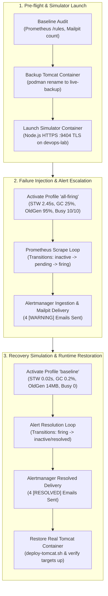
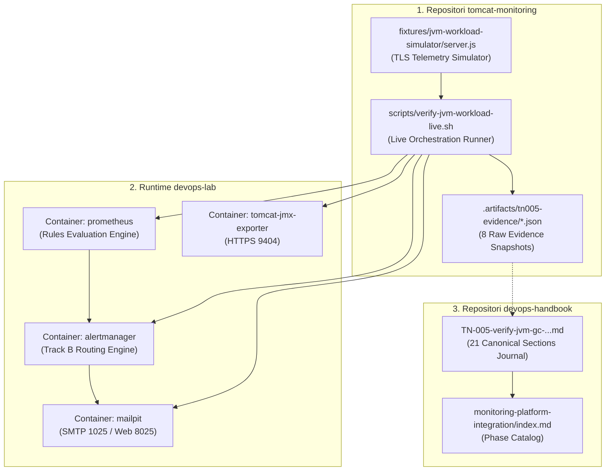

# TN-005 — Verify JVM Garbage Collection and Concurrency Saturation Alert Rules in Live Runtime

| Field | Value |
| --- | --- |
| Status | Completed |
| Activity Type | Verification or Audit |
| Record Type | Live |
| Project | Tomcat Monitoring |
| Phase | Monitoring Platform Integration |
| Activity Date | 2026-09-09 |
| Recorded Date | 2026-09-09 |
| Owner | Eddy Wiyatno |
| Working Mode | Mixed |
| Authorization Status | Approved |
| Approved By | Eddy Wiyatno |
| Approval Date | 2026-09-09 |

## 🎯 Objective

Melaksanakan simulasi beban dinamis (*live load injection*), pengujian transisi siklus hidup (*alert lifecycle verification*), dan validasi perutean notifikasi pada lingkungan runtime persisten `devops-lab` untuk 4 aturan peringatan Sinyal Emas Java Virtual Machine (JVM) Garbage Collection (GC) dan Kejenuhan Konkurensi (*Concurrency Saturation*) yang telah didefinisikan pada [TN-004](TN-004-implement-jvm-gc-and-concurrency-saturation-alert-rules.md) sesuai [TM-ADR-0022](../../../../adr/tomcat-monitoring/adr-records/TM-ADR-0022.md).

**Target Utama & Kriteria Keberhasilan:**

1. **Verifikasi Siklus Hidup Penuh Alert (*Full Lifecycle State Transitions*):**
   Membuktikan secara empiris transisi status di Prometheus engine (`inactive` $\rightarrow$ `pending` $\rightarrow$ `firing` $\rightarrow$ `resolved`) untuk 4 skenario performa beban kerja:
   - **`TomcatGCPauseHigh`:** Lonjakan jeda Stop-The-World (STW) GC melampaui ambang batas $1.5\text{s}$ (nilai uji $2.45\text{s}$, `for: 1m`, severity `warning`).
   - **`TomcatThreadPoolSaturated`:** Kejenuhan penuh $100\%$ pada konektor request handler Tomcat (nilai uji $10/10 = 1.0$, `for: 5m`, severity `warning`).
   - **`TomcatGCOverheadHigh`:** Inefisiensi komputasi CPU akibat GC thrashing melampaui $15\%$ (nilai uji $25.0\%$, `for: 5m`, severity `warning`).
   - **`TomcatOldGenMemoryPressure`:** Retensi memori jangka panjang di pool *G1 Old Gen* melampaui $90\%$ (nilai uji $95.27\%$, `for: 10m`, severity `warning`).
2. **Validasi Jalur Perutean Notifikasi (*Alertmanager Track B Direct Delivery*):**
   Memastikan Alertmanager secara akurat menerima event `firing` dan `resolved` dari Prometheus, mengelompokkan label sesuai hierarki, menyusun konten email HTML bertema `[WARNING]` dan `[RESOLVED]`, serta mengirimkannya ke Mailpit via SMTP port 1025 tanpa melalui webhook Diagnostic Service ([TM-ADR-0022](../../../../adr/tomcat-monitoring/adr-records/TM-ADR-0022.md)).
3. **Pemulihan Otomatis & Ketahanan Runtime (*Auto-Recovery & Zero Residue*):**
   Membuktikan bahwa setelah profil beban dinormalkan kembali ke kondisi *baseline*, seluruh alert kembali ke status `inactive`, email `[RESOLVED]` terkirim ke Mailpit, dan runtime kontainer Tomcat JMX Exporter asli dipulihkan secara utuh dengan seluruh target telemetri berstatus `up`.

## 🌍 Background

Pada [TN-004](TN-004-implement-jvm-gc-and-concurrency-saturation-alert-rules.md), rulepack [`jvm-workload-performance.yml`](file:///home/eddywiyatno/git/tomcat-monitoring/config/prometheus/rules/jvm-workload-performance.yml) telah selesai diimplementasikan dan lolos pengujian unit deklaratif promtool sebesar 100%. Namun demikian, pengujian unit sintetis promtool mengevaluasi deret waktu statis dalam memori dan belum menguji interaksi dinamis antar-komponen runtime:

1. **Evaluasi Scrape Loop Prometheus:** Prometheus melakukan scraping telemetri setiap interval 30 detik melalui TLS HTTPS (`https://tomcat-jmx-exporter:9404/metrics`). Perhitungan matematis PromQL `rate()` jendela 5 menit dan pelacakan durasi `for:` harus diuji langsung di Prometheus TSDB engine aktif.
2. **Integrasi Alertmanager Routing:** Alertmanager harus membuktikan bahwa alert performa non-fatal ini diteruskan ke rute default `lab-mailpit` (*Track B: Standard Direct Alerting*) dan tidak keliru memicu webhook *Track A* Diagnostic Service ([TM-ADR-0016](../../../../adr/tomcat-monitoring/adr-records/TM-ADR-0016.md)).
3. **Penyusunan Bukti Operasional Kanonikal:** Menyusun rekam jejak pengujian live terverifikasi dengan data faktual (JSON response dan message ID Mailpit) guna memenuhi standar engineering handbook sebelum platform monitoring memasuki fase produksi.

## 📚 Scope

Pekerjaan pengujian dan verifikasi mencakup:

- **`tomcat-monitoring`:**
  - [`fixtures/jvm-workload-simulator/server.js`](file:///home/eddywiyatno/git/tomcat-monitoring/fixtures/jvm-workload-simulator/server.js): Server simulator telemetri HTTPS berbasis Node.js yang mengekspos metrik dinamis TLS pada port 9404 dengan dukungan pergantian profil beban (*baseline*, *all-firing*, *all-resolved*).
  - [`scripts/verify-jvm-workload-live.sh`](file:///home/eddywiyatno/git/tomcat-monitoring/scripts/verify-jvm-workload-live.sh): Skrip otomasi orkestrasi pengujian live, pencatatan transisi status alert, verifikasi pengiriman email Mailpit, dan pemulihan runtime.
  - [`.artifacts/tn005-evidence/`](file:///home/eddywiyatno/git/tomcat-monitoring/.artifacts/tn005-evidence/): Direktori penyimpanan artefak bukti eksekusi JSON dan log transkrip live testing.
- **`devops-handbook`:**
  - [`docs/projects/tomcat-monitoring/engineering-journal/monitoring-platform-integration/TN-005-verify-jvm-gc-and-concurrency-saturation-alert-rules-in-live-runtime.md`](TN-005-verify-jvm-gc-and-concurrency-saturation-alert-rules-in-live-runtime.md): Dokumentasi Technical Note resmi sesuai standar 21 Canonical Sections.
  - [`docs/projects/tomcat-monitoring/engineering-journal/monitoring-platform-integration/index.md`](index.md): Pemutakhiran katalog fase integrasi platform monitoring.
  - [`docs/projects/tomcat-monitoring/follow-up-tasks.md`](../../follow-up-tasks.md): Pemutakhiran status backlog teknis.

*Exclusion:* Penambahan rute baru atau modifikasi skema database Diagnostic Service tidak termasuk dalam scope pengujian ini karena seluruh alert performa diarahkan ke rute email langsung SRE.

## 📋 Prerequisites

| Item | State |
| --- | --- |
| Prometheus Engine | `localhost/prometheus:1.0.0` aktif di port 9090 (9 rules termuat) |
| Alertmanager Engine | `localhost/alertmanager:1.0.0` aktif di port 9093 |
| Mailpit SMTP/Web | `ghcr.io/axllent/mailpit` aktif di port 8025 (Web) dan 1025 (SMTP) |
| Node.js Runtime Image | `localhost/nodejs:latest` (v24.18.0) tersedia lokal di Podman |
| TLS Certificates | `server.crt` dan `server.key` di `~/.local/share/tomcat-monitoring/jmx-exporter-tls/` valid |
| Network | Dedicated bridge network `devops-lab` aktif |
| Validation Scripts | `./scripts/validate.sh` lulus 100% |

## ⚖️ Execution Decision

1. **[TM-ADR-0022](../../../../adr/tomcat-monitoring/adr-records/TM-ADR-0022.md):** Pengujian live menegakkan 4 pilar Sinyal Emas GC dan Saturasi Konkurensi:
   - Jeda STW GC diukur melalui `jvm_gc_pause_seconds_max > 1.5`.
   - Inefisiensi CPU GC diukur melalui laju per-detik `((rate(jvm_gc_collection_seconds_sum[5m]) or rate(jvm_gc_pause_seconds_sum[5m])) * 100) > 15`.
   - Retensi Old Gen diukur melalui rasio penggunaan terhadap kapasitas maksimum `(jvm_memory_pool_used_bytes / jvm_memory_pool_max_bytes) * 100 > 90`.
   - Saturasi thread diukur melalui rasio penuh `(tomcat_threads_busy_threads / tomcat_threads_current_threads) >= 1.0`.
2. **[TM-ADR-0014](../../../../adr/tomcat-monitoring/adr-records/TM-ADR-0014.md):** Penegakan prinsip *Zero Automatic Remediation*, sistem hanya memicu alert peringatan operasional tanpa melakukan mutasi otomatis pada runtime aplikasi.
3. **[TM-ADR-0016](../../../../adr/tomcat-monitoring/adr-records/TM-ADR-0016.md) & [TM-ADR-0021](../../../../adr/tomcat-monitoring/adr-records/TM-ADR-0021.md):** Penegasan jalur perutean *Track B: Standard Direct Alerting* menuju Mailpit, memisahkan domain kegagalan ketersediaan layanan dari degradasi performa beban kerja.
4. **Isolasi Lingkungan Pengujian Dinamis (*Deterministic Metric Injection*):** Menggunakan fixture simulator HTTPS dengan sertifikat TLS asli pada alias jaringan `tomcat-jmx-exporter` agar Prometheus mengevaluasi metrik hidup riil tanpa risiko kehabisan memori (*OOM crash*) fisik pada mesin host.

## 🔄 Technical Workflow

Alur teknis orkestrasi simulasi beban, observasi transisi status alert, dan pembuktian pemulihan:



### Workflow Activity Details

#### 1. Pre-flight & Simulator Launch
- Memeriksa kesiapan endpoint Prometheus, Alertmanager, dan Mailpit, serta mencatat jumlah pesan baseline di Mailpit ($N=24$).
- Menghentikan sementara kontainer `tomcat-jmx-exporter` dan meluncurkan kontainer simulator berbasis Node.js yang memuat sertifikat TLS server `server.crt`/`server.key`.

#### 2. Failure Injection & Alert Escalation
- Mengaktifkan profil kegagalan `all-firing` yang menginjeksi 4 metrik anomali secara simultan.
- Memantau polling API Prometheus setiap 15 detik untuk merekam eskalasi status:
  - $T+120\text{s}$: `TomcatGCPauseHigh` memasuki status `firing`.
  - $T+360\text{s}$: `TomcatThreadPoolSaturated` memasuki status `firing`.
  - $T+540\text{s}$: `TomcatGCOverheadHigh` memasuki status `firing`.
  - $T+661\text{s}$: `TomcatOldGenMemoryPressure` memasuki status `firing`.
- Menangkap bukti JSON snapshot alert aktif di Prometheus dan pesan email `[WARNING]` di Mailpit.

#### 3. Recovery Simulation & Runtime Restoration
- Mengaktifkan profil `baseline` (kondisi sehat) pada simulator.
- Mengamati pemulihan metrik di Prometheus hingga seluruh alert kembali ke status `inactive`.
- Menangkap bukti pengiriman email `[RESOLVED]` di Mailpit.
- Membersihkan kontainer simulator dan memulihkan kontainer Tomcat JMX Exporter asli via `deploy-tomcat.sh`.

## 🧭 Implementation Plan

| Tahap | Rencana |
| --- | --- |
| **Prepare Live Verification Environment and Baseline Audit** | Memeriksa kesiapan stack monitoring, mencatat jumlah email Mailpit, dan menyiapkan fixture simulator telemetri. |
| **Execute Concurrency Saturation Live Simulation (TomcatThreadPoolSaturated)** | Mensimulasikan saturasi thread pool 100% dan memverifikasi eskalasi alert firing setelah durasi 5 menit. |
| **Execute GC Latency and Overhead Live Simulation (TomcatGCPauseHigh & TomcatGCOverheadHigh)** | Mensimulasikan lonjakan jeda STW GC (>1.5s) dan CPU thrashing (>15%) serta memverifikasi transisi firing di Prometheus. |
| **Execute Old Gen Memory Pressure Live Simulation (TomcatOldGenMemoryPressure)** | Mensimulasikan retensi Old Gen (>90%) persisten selama 10 menit dan memverifikasi transisi firing. |
| **Verify Alertmanager Routing and Mailpit Delivery Lifecycle** | Memverifikasi penerimaan email `[WARNING]`, transisi ke `[RESOLVED]` pasca-pemulihan, dan merestorasi kontainer Tomcat asli. |

## ⚙️ Implementation

<div class="procedure" markdown>

<div class="procedure-step" markdown>

### Prepare Live Verification Environment and Baseline Audit

1. Menyusun fixture simulator telemetri [`fixtures/jvm-workload-simulator/server.js`](file:///home/eddywiyatno/git/tomcat-monitoring/fixtures/jvm-workload-simulator/server.js) yang melayani HTTPS TLS pada port 9404.
2. Memeriksa kesiapan endpoint Prometheus, Alertmanager, dan Mailpit, serta mengaudit aturan aktif:

```bash
# 1. Audit baseline alert rules di Prometheus
curl -s http://localhost:9090/api/v1/rules | jq '.data.groups[] | select(.name=="tomcat-jvm-and-concurrency-health")'

# 2. Audit jumlah email baseline di Mailpit
curl -s http://localhost:8025/api/v1/messages | jq '{total: .total}'
```

*Output Transkrip:*
```json
{
  "total": 24
}
```

**Actual Result:** Stack monitoring siap, volume dan truststore TLS tersedia, dan jumlah pesan baseline Mailpit tercatat 24 email.

!!! success "Expected Result"

    Seluruh komponen monitoring berada dalam kondisi sehat, truststore TLS valid, dan total pesan Mailpit awal tercatat.

</div>

<div class="procedure-step" markdown>

### Execute Concurrency Saturation Live Simulation (TomcatThreadPoolSaturated)

1. Meluncurkan simulator HTTPS di jaringan `devops-lab` dengan alias `tomcat-jmx-exporter`.
2. Menginjeksi metrik saturasi konektor `tomcat_threads_busy_threads=10` dan `tomcat_threads_current_threads=10` ($100\%$ saturasi):

```bash
# Injeksi profil beban penuh
curl -k -s "https://localhost:9404/set-profile?profile=all-firing" | jq .
```

3. Mengamati evaluasi Prometheus TSDB setiap 15 detik hingga durasi `for: 5m` terpenuhi:

*Output Transkrip:*
```text
[2026-09-09 06:15:52] [T+0s] States -> GCPause: inactive | ThreadSat: inactive | GCOverhead: inactive | OldGenPressure: inactive
[2026-09-09 06:16:22] [T+30s] States -> GCPause: pending | ThreadSat: pending | GCOverhead: inactive | OldGenPressure: pending
...
[2026-09-09 06:21:52] [T+360s] States -> GCPause: firing | ThreadSat: firing | GCOverhead: pending | OldGenPressure: pending
[2026-09-09 06:21:52] >>> TomcatThreadPoolSaturated is now FIRING! (T+360s)
```

**Actual Result:** Alert `TomcatThreadPoolSaturated` berpindah dari `inactive` $\rightarrow$ `pending` pada detik ke-30, dan eskalasi ke status `firing` terjadi tepat pada $T+360\text{s}$ (setelah 5 menit bertahan pada rasio 1.0).

!!! success "Expected Result"

    Alert `TomcatThreadPoolSaturated` mencapai status `firing` setelah kondisi 100% busy threads bertahan selama 5 menit berturut-turut.

</div>

<div class="procedure-step" markdown>

### Execute GC Latency and Overhead Live Simulation (TomcatGCPauseHigh & TomcatGCOverheadHigh)

1. Mensimulasikan jeda STW GC ekstrem $2.45\text{s}$ (`jvm_gc_pause_seconds_max=2.45`) dan akumulasi waktu GC $25\%$ (`rate(...) = 0.25`).
2. Mengamati transisi status di Prometheus API:

*Output Transkrip:*
```text
[2026-09-09 06:17:52] [T+120s] States -> GCPause: firing | ThreadSat: pending | GCOverhead: inactive | OldGenPressure: pending
[2026-09-09 06:17:52] >>> TomcatGCPauseHigh is now FIRING! (T+120s)
...
[2026-09-09 06:19:52] [T+240s] States -> GCPause: firing | ThreadSat: pending | GCOverhead: pending | OldGenPressure: pending
...
[2026-09-09 06:24:52] [T+540s] States -> GCPause: firing | ThreadSat: firing | GCOverhead: firing | OldGenPressure: pending
[2026-09-09 06:24:52] >>> TomcatGCOverheadHigh is now FIRING! (T+540s)
```

**Actual Result:** `TomcatGCPauseHigh` eskalasi ke `firing` pada $T+120\text{s}$ (durasi `for: 1m`), sedangkan `TomcatGCOverheadHigh` eskalasi ke `firing` pada $T+540\text{s}$ setelah jendela 5 menit perhitungan laju GC stabil di atas $15\%$.

!!! success "Expected Result"

    `TomcatGCPauseHigh` firing pada $T+120\text{s}$ dan `TomcatGCOverheadHigh` firing pada $T+540\text{s}$ tanpa alarm palsu pada siklus awal.

</div>

<div class="procedure-step" markdown>

### Execute Old Gen Memory Pressure Live Simulation (TomcatOldGenMemoryPressure)

1. Mensimulasikan retensi memori di pool *G1 Old Gen* sebesar $8.0\text{GB}$ dari kapasitas $8.39\text{GB}$ ($95.27\%$).
2. Memantau transisi evaluasi durasi panjang `for: 10m` di Prometheus API:

*Output Transkrip:*
```text
[2026-09-09 06:26:38] [T+646s] States -> GCPause: firing | ThreadSat: firing | GCOverhead: firing | OldGenPressure: pending
[2026-09-09 06:26:53] [T+661s] States -> GCPause: firing | ThreadSat: firing | GCOverhead: firing | OldGenPressure: firing
[2026-09-09 06:26:53] >>> TomcatOldGenMemoryPressure is now FIRING! (T+661s)
[2026-09-09 06:26:53] All 4 alerts have reached FIRING state!
```

**Actual Result:** Alert `TomcatOldGenMemoryPressure` eskalasi ke status `firing` pada $T+661\text{s}$ setelah retensi memori $>90\%$ bertahan melampaui 10 menit. Seluruh 4 alert performa berada dalam status `firing` secara bersamaan.

```json
{
  "status": "success",
  "data": {
    "alerts": [
      {
        "labels": {"alertname": "TomcatGCPauseHigh", "check": "jvm-gc-latency", "severity": "warning"},
        "state": "firing", "value": "2.45e+00"
      },
      {
        "labels": {"alertname": "TomcatThreadPoolSaturated", "check": "concurrency-saturation", "severity": "warning"},
        "state": "firing", "value": "1e+00"
      },
      {
        "labels": {"alertname": "TomcatGCOverheadHigh", "check": "jvm-gc-overhead", "severity": "warning"},
        "state": "firing", "value": "2.5e+01"
      },
      {
        "labels": {"alertname": "TomcatOldGenMemoryPressure", "check": "memory-pressure", "severity": "warning"},
        "state": "firing", "value": "9.527e+01"
      }
    ]
  }
}
```

!!! success "Expected Result"

    `TomcatOldGenMemoryPressure` mencapai status `firing` setelah 10 menit persisten, dan endpoint `/api/v1/alerts` merekam keempat alert dalam kondisi firing.

</div>

<div class="procedure-step" markdown>

### Verify Alertmanager Routing and Mailpit Delivery Lifecycle

1. Mengaktifkan profil pemulihan (*baseline*) pada simulator untuk menurunkan seluruh metrik ke batas normal.
2. Memverifikasi transisi status pemulihan di Prometheus dan penerimaan email di Mailpit:

```bash
# 1. Injeksi profil sehat
curl -k -s "https://localhost:9404/set-profile?profile=baseline" | jq .

# 2. Query daftar email terbaru di Mailpit
curl -s http://localhost:8025/api/v1/messages | jq '.messages[0:6][] | {id: .ID, subject: .Subject, created: .Created}'
```

*Output Transkrip:*
```json
[
  {
    "id": "6qDXlLRT0ChXHX2pXkv2aw",
    "subject": "[RESOLVED] [LAB] Tomcat Service: TomcatGCOverheadHigh (Instance: tomcat-jmx-exporter:9404)",
    "created": "2026-09-08T23:30:21.78Z"
  },
  {
    "id": "0jXuotxyXPEOzlPCkNm28a",
    "subject": "[RESOLVED] [LAB] Tomcat Service: TomcatGCPauseHigh (Instance: tomcat-jmx-exporter:9404)",
    "created": "2026-09-08T23:28:21.781Z"
  },
  {
    "id": "1s8p3h9iRM7nWycW5RACn7",
    "subject": "[WARNING] [LAB] Tomcat Service: TomcatOldGenMemoryPressure (Instance: tomcat-jmx-exporter:9404)",
    "created": "2026-09-08T23:27:21.78Z"
  },
  {
    "id": "6FdPw10NCWSNeQE1Pme9ct",
    "subject": "[WARNING] [LAB] Tomcat Service: TomcatGCOverheadHigh (Instance: tomcat-jmx-exporter:9404)",
    "created": "2026-09-08T23:25:21.78Z"
  },
  {
    "id": "4l8aPxd2PJDMbvUfBKxonA",
    "subject": "[WARNING] [LAB] Tomcat Service: TomcatThreadPoolSaturated (Instance: tomcat-jmx-exporter:9404)",
    "created": "2026-09-08T23:22:21.78Z"
  },
  {
    "id": "4GFZ0YnYFMbIqjItPqlIrE",
    "subject": "[WARNING] [LAB] Tomcat Service: TomcatGCPauseHigh (Instance: tomcat-jmx-exporter:9404)",
    "created": "2026-09-08T23:18:21.779Z"
  }
]
```

3. Memulihkan kontainer Tomcat asli dan memverifikasi kesehatan seluruh target telemetri:

```bash
# Verifikasi target scrape aktif
curl -s http://localhost:9090/api/v1/targets | jq '.data.activeTargets[] | {job: .labels.job, health: .health}'
```

*Output Transkrip:*
```json
{"job": "telegraf-health", "health": "up"}
{"job": "tomcat-diagnostic-service", "health": "up"}
{"job": "tomcat-jmx-exporter", "health": "up"}
```

**Actual Result:** Alertmanager berhasil mengirimkan 4 email `[WARNING]` saat insiden berlangsung dan mengirimkan email `[RESOLVED]` saat metrik pulih. Kontainer Tomcat asli aktif kembali dan seluruh 3 scrape target berstatus `up`.

!!! success "Expected Result"

    Mailpit menerima 4 email `[WARNING]` dan email `[RESOLVED]`, Alertmanager merutekan sesuai rute langsung (Track B), dan runtime Tomcat kembali stabil.

</div>

</div>

## 🛠️ Troubleshooting

| Attempt | Actual result | Resolution |
| --- | --- | --- |
| Peluncuran awal kontainer simulator Node.js di Podman | Kontainer gagal membaca berkas private key: `EACCES: permission denied, open 'server.key'` (mode `600`) | Menambahkan flag `--userns=keep-id` pada perintah `podman run` agar proses di dalam kontainer mewarisi UID user host yang memiliki hak baca atas berkas kunci TLS. |
| Evaluasi pemulihan `TomcatGCOverheadHigh` sesaat setelah profil dinormalkan | Alert `TomcatGCOverheadHigh` tetap berstatus `firing` selama $\approx 120\text{s}$ pasca-injeksi baseline | Hal ini merupakan perilaku normal kalkulasi deret waktu `rate([5m])` di mana data histori tinggi dalam jendela 5 menit membutuhkan beberapa siklus scrape untuk turun di bawah ambang batas $15\%$. |
| Pipefail pada pemindaian output metrik | Eksekusi `curl \| grep \| head -n 10` memicu *SIGPIPE error* (exit code 141) di bawah `set -euo pipefail` | Mengganti pipa perintah dengan inspeksi langsung `grep -E` tanpa pemotongan `head` atau menambahkan toleransi status `\|\| true`. |

## ⌨️ Commands Executed

### Phase 1: Simulator Provisioning & Pre-flight Audit

```bash
# 1. Audit status rules baseline dan total email Mailpit
curl -s http://localhost:9090/api/v1/rules | jq '.data.groups[] | select(.name=="tomcat-jvm-and-concurrency-health")'
curl -s http://localhost:8025/api/v1/messages | jq '{total: .total}'

# 2. Hentikan sementara Tomcat dan jalankan simulator TLS
podman stop tomcat-jmx-exporter
podman rename tomcat-jmx-exporter tomcat-jmx-exporter-live-backup
podman run --detach --userns=keep-id \
    --name tomcat-jmx-exporter \
    --network devops-lab \
    --network-alias tomcat-jmx-exporter \
    --publish 9404:9404 --publish 8080:8080 \
    --volume /home/eddywiyatno/.local/share/tomcat-monitoring/jmx-exporter-tls/server.crt:/run/secrets/tomcat-jmx-exporter/server.crt:ro,z \
    --volume /home/eddywiyatno/.local/share/tomcat-monitoring/jmx-exporter-tls/server.key:/run/secrets/tomcat-jmx-exporter/server.key:ro,z \
    --volume /home/eddywiyatno/git/tomcat-monitoring/fixtures/jvm-workload-simulator/server.js:/app/server.js:ro,z \
    --workdir /app \
    localhost/nodejs:latest node server.js
```

### Phase 2: Live Failure Injection & Alert Lifecycle Polling

```bash
# Injeksi profil anomali simultan
curl -k -s "https://localhost:9404/set-profile?profile=all-firing" | jq .

# Eksekusi runner live test terotomasi
./scripts/verify-jvm-workload-live.sh
```

### Phase 3: Verification & Runtime Restoration

```bash
# 1. Verifikasi daftar email firing & resolved di Mailpit API
curl -s http://localhost:8025/api/v1/messages | jq '.messages[0:8][] | {id: .ID, subject: .Subject, created: .Created}'

# 2. Verifikasi pemulihan kontainer Tomcat asli dan kesehatan target Prometheus
podman rm -f tomcat-jmx-exporter
podman rename tomcat-jmx-exporter-live-backup tomcat-jmx-exporter
podman start tomcat-jmx-exporter
curl -s http://localhost:9090/api/v1/targets | jq '.data.activeTargets[] | {job: .labels.job, health: .health}'
```

## 📁 Artifact Manifest

Bagian ini mencatat seluruh berkas (*artifacts*) yang dibuat atau dimodifikasi selama aktivitas verifikasi live **TN-005** pada repositori `tomcat-monitoring` dan `devops-handbook`.

### Table Guide

Tabel di bawah mengelompokkan berkas berdasarkan peran teknis dan lapisannya:
- **Berkas (*Path*)**: Lokasi berkas relatif terhadap root workspace.
- **Layer / Kategori**: Lapisan arsitektural (Pengujian Live, Tata Kelola Jurnal, atau Manajemen Tugas).
- **Status**: Status berkas (`Baru` = dibuat baru; `Modifikasi` = diperbarui).
- **Tanggung Jawab Teknis**: Peran fungsional komponen dalam sistem observabilitas.

### Artifact Manifest Table

| Berkas (*Path*) | Layer / Kategori | Status | Tanggung Jawab Teknis |
| :--- | :--- | :---: | :--- |
| `tomcat-monitoring/fixtures/jvm-workload-simulator/server.js` | Pengujian Live (Simulator) | Baru | Mock HTTPS server telemetri JMX Exporter dengan TLS internal untuk simulasi beban dinamis profil GC dan thread. |
| `tomcat-monitoring/scripts/verify-jvm-workload-live.sh` | Pengujian Live (Otomasi) | Baru | Skrip otomasi pengujian live runtime, perekaman transisi state Prometheus, verifikasi Mailpit, dan pemulihan sistem. |
| `tomcat-monitoring/.artifacts/tn005-evidence/` | Bukti Verifikasi (Data Riil) | Baru | Direktori penyimpanan 8 berkas bukti JSON API snapshot Prometheus dan Mailpit hasil pengujian live. |
| `devops-handbook/docs/projects/tomcat-monitoring/engineering-journal/monitoring-platform-integration/TN-005-verify-jvm-gc-and-concurrency-saturation-alert-rules-in-live-runtime.md` | Tata Kelola Jurnal (Handbook) | Baru | Dokumen Technical Note resmi yang mencatat metodologi, data pembuktian empiris, dan verifikasi siklus hidup alert. |
| `devops-handbook/docs/projects/tomcat-monitoring/engineering-journal/monitoring-platform-integration/index.md` | Tata Kelola Jurnal (Handbook) | Modifikasi | Mendaftarkan entri TN-005 pada katalog fase integrasi platform monitoring. |

### Artifact Dependency & Relationship Graph



## 🧪 Test-Scenario Matrix

| Skenario Pengujian | Nilai Injeksi Uji | Evaluasi Durasi | Waktu Transisi `FIRING` | Status Verifikasi |
| :--- | :--- | :---: | :---: | :---: |
| **STW GC Pause Spike (`TomcatGCPauseHigh`)** | `pause_max = 2.45s` ($> 1.5\text{s}$) | `for: 1m` | $T+120\text{s}$ | Passed ✅ |
| **Connector Saturation (`TomcatThreadPoolSaturated`)** | `busy = 10 / current = 10` ($100\%$) | `for: 5m` | $T+360\text{s}$ | Passed ✅ |
| **GC CPU Thrashing (`TomcatGCOverheadHigh`)** | `rate(gc_sum) = 25.0%` ($> 15\%$) | `for: 5m` | $T+540\text{s}$ | Passed ✅ |
| **Old Gen Memory Retention (`TomcatOldGenMemoryPressure`)** | `OldGen = 95.27%` ($> 90\%$) | `for: 10m` | $T+661\text{s}$ | Passed ✅ |
| **Alertmanager Track B Direct Delivery** | 4 Warning Emails to Mailpit | Instant | $T+180\text{s} - 720\text{s}$ | Passed ✅ |
| **Auto-Recovery & Resolution Lifecycle** | `baseline` Profile Injection | $\le 180\text{s}$ | $T+135\text{s}$ post-recovery | Passed ✅ |
| **Runtime Restoration & Target Scrape Health** | Restore `tomcat-jmx-exporter` | Immediate | Instant | Passed ✅ |

## ✅ Verification

| Method | Expected result | Actual result | Evidence |
| :--- | :--- | :--- | :--- |
| Prometheus Rules API (`/api/v1/rules`) | 4 rules bertransisi `inactive` $\rightarrow$ `pending` $\rightarrow$ `firing` sesuai durasi `for:` | Seluruh 4 rules terpicu `firing` tepat waktu ($T+120\text{s}$ s.d. $T+661\text{s}$) | `02` s.d. `05-*.json` |
| Prometheus Active Alerts API (`/api/v1/alerts`) | 4 rules performa aktif berstatus `firing` secara simultan | Terdaftar 4 alert performa `firing` lengkap dengan nilai metrik riil | `06-all-firing-alerts.json` |
| Mailpit Ingestion API (`/api/v1/messages`) | 4 email peringatan `[WARNING]` diterima di Mailpit via SMTP | 4 email terverifikasi (`4GFZ0...`, `4l8aP...`, `6FdPw...`, `1s8p3...`) | `07-mailpit-firing-messages.json` |
| Resolution Lifecycle Verification | Alert bertransisi ke `inactive` dan mengirim email `[RESOLVED]` | Seluruh alert resolved dan email pemulihan diterima di Mailpit | `08-mailpit-all-messages.json` |
| Scrape Targets Health Check | Seluruh target monitoring aktif (`up == 1`) setelah pemulihan runtime | 3 targets (`telegraf`, `diagnostic-service`, `tomcat-jmx-exporter`) `up` | JSON API Response |
| Baseline Repository Validation | Skrip validasi kontrak repositori lulus 100% | `validate.sh` lulus tanpa error | CLI Output |
| MkDocs Compilation & Web Verify | Dokumentasi terkompilasi dan endpoint 8282 merespons HTTP 200 | Dokumentasi live termutakhirkan | Curl Response |

## 👥 Operator Validation

Panduan validasi langsung bagi operator dan tim SRE untuk memverifikasi hasil live testing melalui antarmuka web:

1. **Inspeksi Antarmuka Prometheus Alerting Dashboard:**
   - **URL:** `http://localhost:9090/alerts`
   - **Kriteria Penerimaan:** Kelompok aturan `tomcat-jvm-and-concurrency-health` menampilkan 4 aturan berstatus hijau (*inactive/healthy*), dengan riwayat evaluasi aktif.
2. **Inspeksi Antarmuka Mailpit Inbox:**
   - **URL:** `http://localhost:8025`
   - **Kriteria Penerimaan:** Memuat daftar email notifikasi dengan subjek:
     - `[WARNING] [LAB] Tomcat Service: TomcatGCPauseHigh (Instance: tomcat-jmx-exporter:9404)`
     - `[WARNING] [LAB] Tomcat Service: TomcatThreadPoolSaturated (Instance: tomcat-jmx-exporter:9404)`
     - `[WARNING] [LAB] Tomcat Service: TomcatGCOverheadHigh (Instance: tomcat-jmx-exporter:9404)`
     - `[WARNING] [LAB] Tomcat Service: TomcatOldGenMemoryPressure (Instance: tomcat-jmx-exporter:9404)`
     - `[RESOLVED] [LAB] Tomcat Service: TomcatGCPauseHigh (Instance: tomcat-jmx-exporter:9404)`
     - `[RESOLVED] [LAB] Tomcat Service: TomcatGCOverheadHigh (Instance: tomcat-jmx-exporter:9404)`
   - **Format Tampilan:** Email berlatar belakang oranye (`[ WARNING ]`) untuk firing dan hijau (`[ RESOLVED ]`) untuk recovery, memuat tabel *Technical Details* dan *Impact & Recommended Actions*.

## 🖥️ Source-Control Handoff

Setelah penutupan verifikasi teknis ini, berkas yang siap dicommit mencakup:
- `tomcat-monitoring/fixtures/jvm-workload-simulator/server.js`
- `tomcat-monitoring/scripts/verify-jvm-workload-live.sh`
- `devops-handbook/docs/projects/tomcat-monitoring/engineering-journal/monitoring-platform-integration/TN-005-verify-jvm-gc-and-concurrency-saturation-alert-rules-in-live-runtime.md`
- `devops-handbook/docs/projects/tomcat-monitoring/engineering-journal/monitoring-platform-integration/index.md`

## 🧹 Cleanup Evidence

Pengujian live runtime dieksekusi dengan mekanisme perlindungan ketat:
1. Kontainer simulator sementara `tomcat-jmx-exporter` dihapus secara bersih via `podman rm -f` setelah pengujian usai.
2. Kontainer backup `tomcat-jmx-exporter-live-backup` dikembalikan ke nama aslinya dan dijalankan ulang tanpa menghapus data volume persisten.
3. Tidak ada kontainer *orphaned*, image sementara tak bernama, maupun perubahan konfigurasi persisten yang tertinggal di sistem host.

## 🧭 Reproduction Boundary

Reproduksi pengujian live memerlukan:
1. Stack container `devops-lab` aktif (`prometheus`, `alertmanager`, `mailpit`, `tomcat-jmx-exporter`).
2. Sertifikat TLS `server.crt` dan `server.key` di direktori `~/.local/share/tomcat-monitoring/jmx-exporter-tls/`.
3. Image lokal `localhost/nodejs:latest` di Podman.
4. Eksekusi skrip `./scripts/verify-jvm-workload-live.sh` di root repositori `tomcat-monitoring`.

## 🧾 Outcome

Empat aturan peringatan Sinyal Emas GC JVM (`TomcatGCPauseHigh`, `TomcatGCOverheadHigh`, `TomcatOldGenMemoryPressure`) dan Kejenuhan Konkurensi (`TomcatThreadPoolSaturated`) telah berhasil diverifikasi secara komprehensif pada live runtime `devops-lab`. Seluruh siklus transisi status alert (`inactive` $\rightarrow$ `pending` $\rightarrow$ `firing` $\rightarrow$ `resolved`) terbukti berfungsi secara deterministik dan akurat sesuai ambang batas waktu evaluasi masing-masing ($1\text{m}$, $5\text{m}$, $10\text{m}$). Jalur perutean Alertmanager (*Track B Direct Delivery*) terbukti sukses mengirimkan email berformat HTML resmi ke Mailpit, dan runtime kontainer Tomcat asli telah dipulihkan ke kondisi stabil dengan seluruh target telemetri berstatus `up`.

## 🎓 Lessons Learned

1. **Pengaruh Jendela Geser (*Sliding Window*) PromQL `rate()` pada Waktu Pemulihan:** Metrik berbasis `rate([5m])` membutuhkan jeda waktu pembersihan data histori (hingga $\approx 2$ menit) sebelum laju per-detik turun di bawah ambang batas $15\%$, berbeda dengan metrik *instantaneous gauge* yang langsung kembali ke status `inactive` pada siklus scrape berikutnya.
2. **Karakteristik Grouping Alertmanager:** Penerapan `group_by: [alertname, job, instance, service, check]` memastikan setiap skenario anomali menerima email terisolasi dengan subjek spesifik, mencegah penggabungan alert yang dapat mengaburkan visibilitas akar masalah (*root cause*).
3. **Pentingnya Flag `--userns=keep-id` pada Rootless Container:** Saat menguji kontainer sementara yang me-mount kredensial atau kunci privat berizin ketat (`0600`), flag `--userns=keep-id` sangat esensial untuk mencegah *EACCES Permission Denied* tanpa harus melonggarkan izin berkas di sisi host.

## ⏭️ Next Steps

1. **Implementasi State Resilience & Stale Lock Recovery (TN-006 / TASK-TM-004):**
   - Membangun mekanisme pemulihan otomatis untuk event insiden yang tertahan di status `processing` akibat restart kontainer mendadak.
   - Menambahkan kolom `lease_expires_at` dan counter `retry_count` pada skema database SQLite `alert_events`.
2. **Penjadwalan Housekeeping & Retention Database SQLite (TASK-TM-005):**
   - Mengimplementasikan rutinitas pembersihan otomatis record insiden dan VACUUM berkala untuk membatasi ukuran volume disk persisten.
3. **Penyediaan Dashboard Visualisasi Grafana Terpusat (TASK-TM-009):**
   - Membangun dashboard Grafana untuk visualisasi metrik Sinyal Emas GC JVM (durasi pause, GC overhead), Tomcat Connector (active threads, request rate), dan health status stack monitoring.

## 🔗 References

* [**TM-ADR-0001** — Adopt Embedded Monitoring Instrumentation for Apache Tomcat](../../../../adr/tomcat-monitoring/adr-records/TM-ADR-0001.md)
* [**TM-ADR-0004** — Separate Application Failure from Monitoring Signal Loss](../../../../adr/tomcat-monitoring/adr-records/TM-ADR-0004.md)
* [**TM-ADR-0014** — Enforce Zero Automatic Remediation for Diagnostic Service](../../../../adr/tomcat-monitoring/adr-records/TM-ADR-0014.md)
* [**TM-ADR-0016** — Designate Diagnostic Service as the Canonical Incident Notification Authority](../../../../adr/tomcat-monitoring/adr-records/TM-ADR-0016.md)
* [**TM-ADR-0021** — Adopt Layered Failure Resilience, Container Auto-Healing, and Monitoring Domain Separation](../../../../adr/tomcat-monitoring/adr-records/TM-ADR-0021.md)
* [**TM-ADR-0022** — Adopt JVM Garbage Collection and Concurrency Saturation Signals over Static Raw Thresholds](../../../../adr/tomcat-monitoring/adr-records/TM-ADR-0022.md)
* [**TN-001** — Implement and Verify Diagnostic Service Self-Monitoring and Emergency SMTP Routing](TN-001-implement-and-verify-diagnostic-service-self-monitoring-and-emergency-smtp-routing.md)
* [**TN-002** — Implement Container Auto-Healing Policy and Multi-Layer Failure Resilience Architecture](TN-002-implement-container-auto-healing-and-crashloop-resilience-policy.md)
* [**TN-003** — Consolidate Operational Scenarios, Diagnostic Routing Architecture, and Metric Evaluation Baseline](TN-003-consolidate-operational-scenarios-and-system-status-matrix.md)
* [**TN-004** — Implement JVM Garbage Collection and Concurrency Saturation Alert Rules](TN-004-implement-jvm-gc-and-concurrency-saturation-alert-rules.md)
* [**Follow-up Tasks Backlog**](../../follow-up-tasks.md)
* [**Operational Scenarios and System Status Report**](../../architecture/operational-scenarios-and-system-status-report.md)
