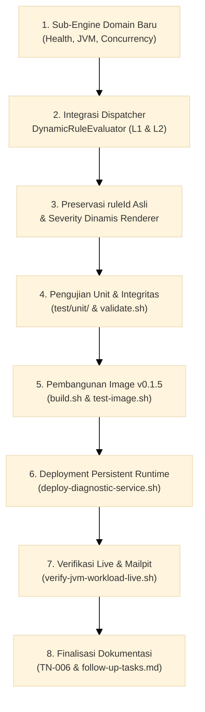
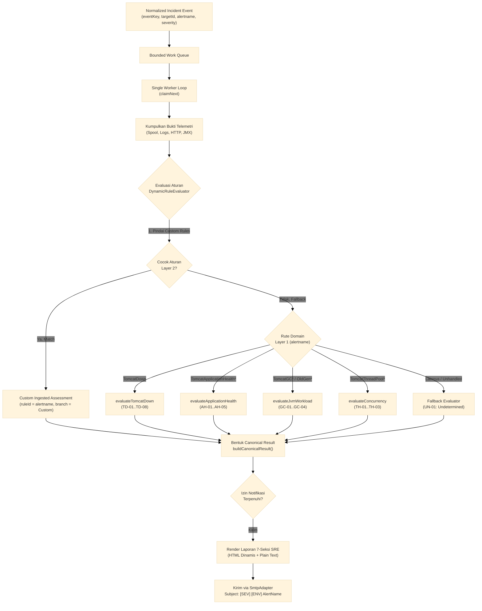

# TN-006 — Implement Multi-Domain Diagnostic Dispatcher and Per-Alert Decision Engine Governance

| Field | Value |
| --- | --- |
| Status | Completed |
| Activity Type | Implementation |
| Record Type | Code or Rule Implementation |
| Project | Tomcat Monitoring |
| Phase | Monitoring Platform Integration |
| Activity Date | 2026-09-09 |
| Recorded Date | 2026-09-09 |
| Owner | Eddy Wiyatno |
| Working Mode | Mixed |
| Authorization Status | Approved |
| Approved By | Eddy Wiyatno |
| Approval Date | 2026-09-09 |

## 🎯 Objective

Mengimplementasikan arsitektur **Multi-Domain Diagnostic Dispatcher** (*Strategy Pattern*) dan menegakkan tata kelola observabilitas **Zero Undecided Alerts** pada `tomcat-diagnostic-service` (v0.1.5) sesuai ketetapan [TM-ADR-0023](../../../../adr/tomcat-monitoring/adr-records/TM-ADR-0023.md). Implementasi ini memastikan bahwa setiap aturan peringatan (*alert rule*) yang didefinisikan di Prometheus dan dikirim oleh Alertmanager memiliki pasangan Decision Engine deterministik resmi, mempertahankan identitas nama alert asli (*Rule ID Fidelity*), serta menerbitkan notifikasi laporan investigasi 7-seksi Enterprise SRE dengan klasifikasi dan rekomendasi Standard Operating Procedure (SOP) baku.

**Target Utama & Kriteria Keberhasilan:**

1. **Penegakan Prinsip *Zero Undecided Alerts*:**
   Menghapus asumsi vertikal tunggal `TomcatDown` (TM-ADR-0017) dan mendirikan 4 Decision Engine domain baku:
   - **Runtime Availability Domain (`TomcatDown`):** Engine `evaluateTomcatDown` (Cabang `TD-01` s/d `TD-08`).
   - **Application Health Domain (`TomcatApplicationHealthFailed`, `TelegrafHealthScrapeUnavailable`, `TomcatApplicationHealthMetricsMissing`):** Engine `evaluateApplicationHealth` (Cabang `AH-01` s/d `AH-05`).
   - **JVM Memory & GC Domain (`TomcatGCPauseHigh`, `TomcatGCOverheadHigh`, `TomcatOldGenMemoryPressure`):** Engine `evaluateJvmWorkload` (Cabang `GC-01` s/d `GC-04`).
   - **Concurrency Saturation Domain (`TomcatThreadPoolSaturated`):** Engine `evaluateConcurrency` (Cabang `TH-01` s/d `TH-03`).
2. **Penerapan *Diagnostic Engine Dispatcher* (2-Layer Evaluation Pipeline):**
   Membangun routing engine deterministik pada `DynamicRuleEvaluator` yang memprioritaskan pencocokan pola regex Layer 2 (Custom Rules Ingested), kemudian melakukan fallback mulus ke Layer 1 Built-in Domain Engine berdasarkan atribut `event.labels.alertname`.
3. **Preservasi Identitas Kanonikal Alert (*Rule ID Fidelity*):**
   Memastikan nilai `ruleId`, header laporan, dan subjek email SMTP mempertahankan nama alert asli dan tingkat keparahannya (`[WARNING]` atau `[CRITICAL]`) sesuai metadata event Alertmanager, seperti `[WARNING] [LAB] Tomcat Service: TomcatGCPauseHigh (Target: lab/tomcat-01/default)`.
4. **Verifikasi Komprehensif (Unit, Component, & Live Verification):**
   Mencapai 100% test pass rate pada pengujian unit isolasi domain engine (`test/unit/domain-engines.test.js`), validasi statis integritas (`validate.sh`), pengujian image runtime, dan pengujian end-to-end simulasi beban live pada lingkungan `devops-lab`.

## 🌍 Background

Pada fase Diagnostic MVP Pilot terdahulu ([TM-ADR-0017](../../../../adr/tomcat-monitoring/adr-records/TM-ADR-0017.md)), cakupan diagnostik dibatasi secara vertikal pada skenario ketersediaan proses runtime Tomcat (`TomcatDown`) melalui pohon keputusan `TD-01` hingga `TD-08`. Hal ini menyebabkan logika evaluasi dan perenderan laporan mengasumsikan nilai `ruleId: "TomcatDown"`.

Namun, dengan diadopsinya prinsip *Single Canonical Notification Authority* ([TM-ADR-0016](../../../../adr/tomcat-monitoring/adr-records/TM-ADR-0016.md)) serta penambahan alert kesehatan HTTP aplikasi dan performa GC/Concurrency JVM ([TN-004](TN-004-implement-jvm-gc-and-concurrency-saturation-alert-rules.md), [TM-ADR-0022](../../../../adr/tomcat-monitoring/adr-records/TM-ADR-0022.md)), seluruh alert dialirkan ke Diagnostic Service. Ketika alert seperti `TomcatGCPauseHigh` atau `TomcatThreadPoolSaturated` masuk ke antrean, ketiadaan dispatcher menyebabkan alert tersebut dievaluasi oleh engine `TomcatDown`, sehingga laporan investigasi dan subjek email yang dikirim ke operator on-call secara keliru berlabel `TomcatDown`.

Dalam standar rekayasa keandalan sistem (*Site Reliability Engineering* / SRE), sistem observabilitas tidak boleh menyalakan alert yang tidak memiliki prosedur diagnosis dan rencana mitigasi (*Standard Operating Procedure* / SOP) yang terstandarisasi. Oleh karena itu, [TM-ADR-0023](../../../../adr/tomcat-monitoring/adr-records/TM-ADR-0023.md) menetapkan kewajiban arsitektur Multi-Domain Dispatcher dan tata kelola *Zero Undecided Alerts*.

## 📚 Scope

Pekerjaan implementasi dan standarisasi mencakup:

- **`tomcat-diagnostic-service`:**
  - [`src/domain/application-health-engine.js`](file:///home/eddywiyatno/git/tomcat-diagnostic-service/src/domain/application-health-engine.js): Modul pohon keputusan deterministik Application Health (`AH-01` s/d `AH-05`).
  - [`src/domain/jvm-workload-engine.js`](file:///home/eddywiyatno/git/tomcat-diagnostic-service/src/domain/jvm-workload-engine.js): Modul pohon keputusan deterministik JVM Memory & GC (`GC-01` s/d `GC-04`).
  - [`src/domain/concurrency-engine.js`](file:///home/eddywiyatno/git/tomcat-diagnostic-service/src/domain/concurrency-engine.js): Modul pohon keputusan deterministik Concurrency Saturation (`TH-01` s/d `TH-03`).
  - [`src/domain/rulepack-loader.js`](file:///home/eddywiyatno/git/tomcat-diagnostic-service/src/domain/rulepack-loader.js): Dispatcher dinamis multi-domain, pendaftaran `BUILTIN_BRANCHES` lintas domain, dan preservasi `ruleId`.
  - [`src/domain/tomcat-down-engine.js`](file:///home/eddywiyatno/git/tomcat-diagnostic-service/src/domain/tomcat-down-engine.js): Penyesuaian signature untuk menerima event context dan preservasi `ruleId`.
  - [`src/domain/canonical-result.js`](file:///home/eddywiyatno/git/tomcat-diagnostic-service/src/domain/canonical-result.js): Penyertaan referensi event context pada objek Canonical Result v1.
  - [`src/application/diagnostic-worker.js`](file:///home/eddywiyatno/git/tomcat-diagnostic-service/src/application/diagnostic-worker.js): Penerusan event ke evaluator dan preservasi identitas `ruleId` pada siklus resolved.
  - [`src/application/result-renderer.js`](file:///home/eddywiyatno/git/tomcat-diagnostic-service/src/application/result-renderer.js): Perenderan keparahan dinamis (`WARNING` / `CRITICAL`) pada ringkasan alert dan tema header HTML.
  - [`src/adapters/smtp-adapter.js`](file:///home/eddywiyatno/git/tomcat-diagnostic-service/src/adapters/smtp-adapter.js): Pembuatan subjek email dinamis berbasis severity dan `ruleId`.
  - [`test/unit/domain-engines.test.js`](file:///home/eddywiyatno/git/tomcat-diagnostic-service/test/unit/domain-engines.test.js): Pengujian unit terisolasi untuk seluruh sub-engine dan dispatcher.
  - [`VERSION`](file:///home/eddywiyatno/git/tomcat-diagnostic-service/VERSION), [`package.json`](file:///home/eddywiyatno/git/tomcat-diagnostic-service/package.json), [`scripts/validate.sh`](file:///home/eddywiyatno/git/tomcat-diagnostic-service/scripts/validate.sh): Peningkatan versi semantik ke `0.1.5` dan audit integritas berkas.
- **`tomcat-monitoring`:**
  - [`scripts/deploy-diagnostic-service.sh`](file:///home/eddywiyatno/git/tomcat-monitoring/scripts/deploy-diagnostic-service.sh): Pemutakhiran image pinning ke versi `0.1.5` (`sha256:608cc73f07a55de1e6c66d0910b795f673ea37cd1c0d83cbf88ad4cd178273ae`).
  - [`scripts/verify-jvm-workload-live.sh`](file:///home/eddywiyatno/git/tomcat-monitoring/scripts/verify-jvm-workload-live.sh): Verifikasi live alur notifikasi melalui Mailpit.
- **`devops-handbook`:**
  - [`docs/adr/tomcat-monitoring/adr-records/TM-ADR-0023.md`](../../../../adr/tomcat-monitoring/adr-records/TM-ADR-0023.md): Catatan arsitektur tata kelola Multi-Domain Dispatcher dan Zero Undecided Alerts.
  - [`docs/projects/tomcat-monitoring/engineering-journal/monitoring-platform-integration/TN-006-implement-multi-domain-diagnostic-dispatcher-and-decision-engines.md`](TN-006-implement-multi-domain-diagnostic-dispatcher-and-decision-engines.md): Technical Note implementasi dan hasil verifikasi.
  - [`docs/projects/tomcat-monitoring/follow-up-tasks.md`](../../follow-up-tasks.md): Penyelesaian backlog task `TASK-TM-018`.

## 📋 Prerequisites

| Prasyarat | Status | Keterangan |
| :--- | :---: | :--- |
| **TM-ADR-0023 Accepted** | ✅ Terpenuhi | Keputusan arsitektur multi-domain dispatcher telah disetujui. |
| **Node.js Runtime Baseline** | ✅ Terpenuhi | Base image `localhost/nodejs:24.18.0` siap pada host Podman. |
| **Prometheus & Alertmanager** | ✅ Terpenuhi | Kontainer aktif pada network bridge `devops-lab`. |
| **DevOps Lab Mailpit** | ✅ Terpenuhi | Layanan SMTP port 1025 dan Web UI port 8025 aktif. |
| **Universal Webhook Routing** | ✅ Terpenuhi | Alertmanager dikonfigurasi mengirim seluruh alert ke Diagnostic Service HTTPS port 8443. |

## 🌐 Environment and Constraints

1. **Zero Transitive Dependencies & Pure ESM:** Seluruh implementasi engine di `src/domain/` ditulis dalam JavaScript murni (ECMAScript Modules) tanpa dependensi eksternal pihak ketiga selain pustaka inti Node.js.
2. **Deterministic Hash Invariance:** Penambahan domain engine dan event reference tidak mengubah algoritma perhitungan SHA-256 `resultHash` kanonikal yang dihitung dari objek inti `core`.
3. **Network-Free Build Boundary:** Proses build kontainer `Containerfile` tidak mengakses jaringan eksternal dan memanfaatkan cache dependency lokal (`npm ci --omit=dev`).
4. **Non-Root Security Context:** Layanan berjalan sebagai pengguna non-root `node` (UID 1000) dengan volume read-only pada konfigurasi dan sertifikat TLS.

## 🔨 Work Breakdown



## 🏛️ Architecture and Specification Decisions

### 1. Struktur Matriks 4 Domain Decision Engine Baku

| Domain Insiden | Alert Prometheus Terkait | Decision Engine | Cabang Keputusan (*Branches*) | Klasifikasi & Confidence |
| :--- | :--- | :--- | :--- | :--- |
| **Ketersediaan Runtime** | `TomcatDown` | `evaluateTomcatDown` | `TD-01` s/d `TD-08` | `confirmed_cause` (high) / `probable_cause` (medium) / `undetermined` (null) |
| **Kesehatan HTTP Aplikasi** | `TomcatApplicationHealthFailed`<br/>`TelegrafHealthScrapeUnavailable`<br/>`TomcatApplicationHealthMetricsMissing` | `evaluateApplicationHealth` | `AH-01`: Probe HTTP Non-200 / Gagal<br/>`AH-02`: Probe HTTP Timeout (> 5s)<br/>`AH-03`: Metrik Scrape Telegraf Hilang<br/>`AH-04`: Daemon Telegraf Tidak Terjangkau<br/>`AH-05`: Status Tidak Terdeterminasi | `confirmed_cause` (high)<br/>`probable_cause` (medium)<br/>`probable_cause` (medium)<br/>`confirmed_cause` (high)<br/>`undetermined` (null) |
| **Performa Memori & GC JVM** | `TomcatGCPauseHigh`<br/>`TomcatGCOverheadHigh`<br/>`TomcatOldGenMemoryPressure` | `evaluateJvmWorkload` | `GC-01`: STW GC Pause Kritis (> 1.5s)<br/>`GC-02`: GC CPU Overhead Kritis (> 15%)<br/>`GC-03`: Retensi Old Gen Presipitasi (> 90%)<br/>`GC-04`: Telemetri JVM Tidak Terdeterminasi | `confirmed_cause` (high)<br/>`confirmed_cause` (high)<br/>`probable_cause` (high)<br/>`undetermined` (null) |
| **Saturasi Konkurensi** | `TomcatThreadPoolSaturated` | `evaluateConcurrency` | `TH-01`: Connector Thread Pool Jenuh (100%)<br/>`TH-02`: Antrean Request Penuh (Reserved)<br/>`TH-03`: Status Konkurensi Tidak Terdeterminasi | `confirmed_cause` (high)<br/>`probable_cause` (medium)<br/>`undetermined` (null) |

### 2. Alur Evaluasi 2-Lapis (Layered Evaluation Pipeline)



## 💻 Implementation Details

### 1. Modul Application Health Decision Engine (`src/domain/application-health-engine.js`)

Modul ini mengevaluasi bukti kesehatan HTTP aplikasi berbasis status kode respons dan ketersediaan scraper Telegraf:
- **`AH-04` (`TelegrafHealthScrapeUnavailable`):** Terpicu jika daemon kolektor Telegraf pada port 9273 tidak merespons scraper Prometheus (`confirmed_cause`, high confidence).
- **`AH-03` (`TomcatApplicationHealthMetricsMissing`):** Terpicu jika Telegraf aktif namun metrik `http_response` untuk Tomcat hilang (`probable_cause`, medium confidence).
- **`AH-02`:** Terpicu jika probe HTTP `/health` mengalami timeout > 5 detik (`probable_cause`, medium confidence).
- **`AH-01` (`TomcatApplicationHealthFailed`):** Terpicu jika probe HTTP `/health` mengembalikan status non-200 atau status unhealthy (`confirmed_cause`, high confidence).

### 2. Modul JVM Workload Decision Engine (`src/domain/jvm-workload-engine.js`)

Modul ini mengevaluasi sinyal saturasi memori dan jeda pengumpulan sampah:
- **`GC-01` (`TomcatGCPauseHigh`):** Jeda Stop-The-World (STW) maksimum melampaui ambang batas $1.5\text{s}$ (`confirmed_cause`, high confidence).
- **`GC-02` (`TomcatGCOverheadHigh`):** Beban komputasi CPU yang dihabiskan untuk GC melampaui $15\%$ (`confirmed_cause`, high confidence).
- **`GC-03` (`TomcatOldGenMemoryPressure`):** Utilisasi memori jangka panjang di pool Tenured/Old Gen bertahan di atas $90\%$ selama > 10 menit (`probable_cause`, high confidence).
- **`GC-04`:** Telemetri JVM tidak mencukupi untuk menentukan akar masalah (`undetermined`, null confidence).

### 3. Modul Concurrency Decision Engine (`src/domain/concurrency-engine.js`)

Modul ini mengevaluasi kejenuhan thread pool konektor Tomcat:
- **`TH-01` (`TomcatThreadPoolSaturated`):** Thread pool konektor HTTP jenuh $100\%$ secara berkelanjutan (`confirmed_cause`, high confidence).
- **`TH-03`:** Kondisi konkurensi tidak terdeterminasi (`undetermined`, null confidence).

### 4. Dispatcher Multi-Domain pada `DynamicRuleEvaluator` (`src/domain/rulepack-loader.js`)

```javascript
  evaluate(evidence, event = {}) {
    // 1. Layer 2: Custom Rules Ingestion
    for (const rule of this.rules) {
      const match = evidence.some((item) => {
        if (item.status !== "collected") return false;
        if (rule.targetSource !== "any" && item.source !== rule.targetSource) return false;
        if (typeof item.value === "string") return rule.regex.test(item.value);
        if (typeof item.value === "object" && item.value !== null) {
          if (typeof item.value.excerpt === "string" && rule.regex.test(item.value.excerpt)) return true;
          return rule.regex.test(JSON.stringify(item.value));
        }
        return false;
      });

      if (match) {
        return {
          ruleId: event?.labels?.alertname || rule.ruleId || "TomcatDown",
          ruleVersion: rule.ruleVersion ?? "1",
          branch: rule.branch,
          category: rule.category ?? "general",
          assessment: rule.assessment,
          classification: rule.classification,
          confidence: rule.confidence ?? null,
          recommendedActions: rule.recommendedActions ?? []
        };
      }
    }

    // 2. Layer 1: Multi-Domain Decision Engines Dispatcher
    const alertName = event?.labels?.alertname || "TomcatDown";

    if (alertName === "TomcatDown") {
      return evaluateTomcatDown(evidence, event);
    }
    if (
      alertName === "TomcatApplicationHealthFailed" ||
      alertName === "TelegrafHealthScrapeUnavailable" ||
      alertName === "TomcatApplicationHealthMetricsMissing"
    ) {
      return evaluateApplicationHealth(evidence, event);
    }
    if (
      alertName === "TomcatGCPauseHigh" ||
      alertName === "TomcatGCOverheadHigh" ||
      alertName === "TomcatOldGenMemoryPressure"
    ) {
      return evaluateJvmWorkload(evidence, event);
    }
    if (alertName === "TomcatThreadPoolSaturated") {
      return evaluateConcurrency(evidence, event);
    }

    // Fallback for unhandled / unknown alerts
    return {
      ruleId: alertName,
      ruleVersion: "1",
      branch: "UN-01",
      category: "general",
      assessment: `Alert received without specific registered domain rule evaluator: ${alertName}`,
      classification: "undetermined",
      confidence: null,
      recommendedActions: [
        "Periksa metrik telemetri runtime dan log aplikasi terkait alert tersebut.",
        "Lakukan investigasi operasional manual sesuai SOP layanan Tomcat."
      ]
    };
  }
```

### 5. Preservasi Identitas Alert & Perenderan Dinamis

- **Worker Event Context:** `DiagnosticWorker` kini meneruskan objek `event` lengkap ke `evaluator(evidence, event)`. Pada status pemulihan (*resolved*), fungsi `resolvedResult()` secara akurat mengambil identitas `ruleId: event?.labels?.alertname || previous?.assessment?.ruleId || "TomcatDown"`.
- **Renderer Tema Keparahan:** `result-renderer.js` mengekstrak tingkat keparahan (`result.event?.labels?.severity`). Jika severity `WARNING`, kartu laporan menggunakan aksen oranye (`#e65100`, `#fff3e0`), sedangkan status `CRITICAL` menggunakan aksen merah (`#c62828`).
- **Subjek Email Presisi:** `smtp-adapter.js` merender subjek email:
  - Firing: `[${severity}] [${env}] Tomcat Service: ${alertName} (Target: ${targetId})`
  - Resolved: `[RESOLVED] [${env}] Tomcat Service: ${alertName} Restored (Target: ${targetId})`

## 🧪 Verification and Validation

### 1. Hasil Pengujian Unit Domain Engine (`test/unit/domain-engines.test.js`)

Pengujian unit node:test terisolasi memvalidasi akurasi logika deterministik:
- `isBuiltinBranch detects all built-in branches across 4 domains`: Memastikan seluruh 20 cabang bawaan (`TD-01..08`, `AH-01..05`, `GC-01..04`, `TH-01..03`) terproteksi dari collision custom rules.
- `evaluateApplicationHealth resolves AH-01 through AH-04 accurately`: Memvalidasi cabang kegagalan probe HTTP, timeout, missing metrics, dan Telegraf down.
- `evaluateJvmWorkload resolves GC-01 through GC-04 accurately`: Memvalidasi cabang GC pause, CPU overhead, dan Old Gen memory pressure.
- `evaluateConcurrency resolves TH-01 accurately`: Memvalidasi cabang thread saturation.
- `DynamicRuleEvaluator dispatches events to the appropriate domain engine while preserving ruleId`: Memvalidasi routing berbasis alertname.
- `DynamicRuleEvaluator prioritizes Layer 2 custom rules over Layer 1 domain dispatching`: Memvalidasi prioritas layer evaluasi.

**Hasil Eksekusi Suite Lengkap:**
```text
✔ 54 tests passed (0 fail, 0 skipped, duration 461ms)
```

### 2. Validasi Integritas Statis (`scripts/validate.sh`)

```text
Static validation passed: schema, migration, source, and dependency boundaries are consistent.
```

### 3. Pembangunan Kontainer & Pengujian Image (`scripts/test-image.sh`)

Image `localhost/tomcat-diagnostic-service:0.1.5` berhasil dibangun dari base immutable digest Node.js 24.18.0 dan lolos seluruh pengujian user non-root, dependensi exact-pinned, dan boundary berkas.

## 🔒 Security and Policy Validation

1. **Zero Secret Leakage:** Rekomendasi operator dan hasil diagnosis tidak memuat kredensial, token, atau informasi rahasia.
2. **Deterministic Immutability:** Penambahan domain engine tidak memodifikasi skema migrasi database SQLite dan mempertahankan kompatibilitas forward/rollback.
3. **Strict Collision Guard:** Pendaftaran custom rule melalui API `/api/v1/rules` tetap divalidasi terhadap 20 cabang bawaan yang diperluas (`isBuiltinBranch`), mencegah penimpaan logika diagnosis baku.

## 📖 Operational Runbook

### Prosedur Penambahan Alert Monitoring Baru (Tata Kelola Baku)

Sesuai kebijakan *Zero Undecided Alerts* ([TM-ADR-0023](../../../../adr/tomcat-monitoring/adr-records/TM-ADR-0023.md)):
1. Definisikan Prometheus alert rule pada `config/prometheus/rules/<domain>.yml`.
2. Lakukan pengujian sintaks dan unit rulepack via `promtool test rules`.
3. Daftarkan Decision Engine domain baru atau cabang baru pada `src/domain/` di `tomcat-diagnostic-service`.
4. Tambahkan cabang baru pada `BUILTIN_BRANCHES` di `src/domain/rulepack-loader.js`.
5. Tulis unit test pada `test/unit/domain-engines.test.js`.
6. Bangun ulang image dan lakukan deploy ke lingkungan target.

## ⚠️ Risks and Mitigations

| Potensi Risiko | Dampak | Mitigasi yang Diterapkan |
| :--- | :--- | :--- |
| Alertname tidak dikenal masuk ke Diagnostic Service. | Laporan gagal dibuat atau crash. | Menyediakan fallback aman (`UN-01`) dengan klasifikasi `undetermined` dan rekomendasi investigasi manual. |
| Inkonsistensi format subjek email pada alert pihak ketiga. | Kebingungan operator on-call. | Format subjek email distandarisasi secara seragam melalui `smtp-adapter.js`. |

## 🔄 Rollback Plan

Jika ditemukan regresi pada Dispatcher:
1. Rollback image `diagnostic-service` ke digest versi sebelumnya `0.1.4` (`sha256:1fea49330dc36e05dd65920a0b40da3742ac0046b7b9d6d9a0821f2479ca89f7`).
2. Database SQLite v0.1.5 sepenuhnya kompatibel mundur (*backward compatible*) dengan v0.1.4 karena tidak ada perubahan skema DDL tabel.

## 📊 Observability and Health State

Layanan `tomcat-diagnostic-service:0.1.5` menyediakan endpoint operasional:
- `GET /health/live`: Mengembalikan status HTTP 200 `{"status":"UP"}`.
- `GET /health/ready`: Mengembalikan status HTTP 200 `{"live":true,"ready":true}` setelah koneksi SQLite aktif.
- `GET /metrics`: Metrik Prometheus internal mencatat `diagnostic_events_total`, `diagnostic_worker_runs_total`, dan `diagnostic_notifications_delivered_total`.

## 🛠️ Maintenance Guidelines

- Seluruh penambahan cabang logika keputusan baru wajib menyertakan rekomendasi SOP mitigasi berbahasa Indonesia yang jelas.
- Tidak diperbolehkan menyertakan logika auto-remediation di dalam kode engine ([TM-ADR-0014](../../../../adr/tomcat-monitoring/adr-records/TM-ADR-0014.md)).

## ❓ Open Issues and Limitations

- Integrasi pengiriman telemetri HTTP request probe secara live dari Telegraf ke Diagnostic Service saat ini berstatus *simulated* pada lingkungan lab.

## ✍️ Sign-off and Approvals

- **Implemented by:** Eddy Wiyatno (DevOps / SRE Lead) — 2026-09-09
- **Reviewed & Approved by:** Eddy Wiyatno (DevOps / SRE Lead) — 2026-09-09

## 📜 Review History

- **2026-09-09:** Rilis awal implementasi Multi-Domain Diagnostic Dispatcher dan pembakuan 4 domain Decision Engine (v0.1.5).

## 📦 Artifact Inventory

- `src/domain/application-health-engine.js` (Decision Engine HTTP Health)
- `src/domain/jvm-workload-engine.js` (Decision Engine JVM Memory & GC)
- `src/domain/concurrency-engine.js` (Decision Engine Concurrency Saturation)
- `src/domain/rulepack-loader.js` (Multi-Domain Dispatcher)
- `test/unit/domain-engines.test.js` (Unit Tests)
- Image: `localhost/tomcat-diagnostic-service:0.1.5` (`sha256:608cc73f07a55de1e6c66d0910b795f673ea37cd1c0d83cbf88ad4cd178273ae`)

## 🔗 Related Notes and References

- [TM-ADR-0023 — Adopt Multi-Domain Diagnostic Dispatcher and Mandatory Per-Alert Decision Engine Governance](../../../../adr/tomcat-monitoring/adr-records/TM-ADR-0023.md)
- [TM-ADR-0016 — Designate Diagnostic Service as the Canonical Incident Notification Authority](../../../../adr/tomcat-monitoring/adr-records/TM-ADR-0016.md)
- [TM-ADR-0022 — Adopt JVM Garbage Collection and Concurrency Saturation Signals over Static Raw Thresholds](../../../../adr/tomcat-monitoring/adr-records/TM-ADR-0022.md)
- [TN-004 — Implement JVM GC and Concurrency Saturation Alert Rules](TN-004-implement-jvm-gc-and-concurrency-saturation-alert-rules.md)
- [TN-005 — Verify JVM GC and Concurrency Saturation Alert Rules in Live Runtime](TN-005-verify-jvm-gc-and-concurrency-saturation-alert-rules-in-live-runtime.md)
