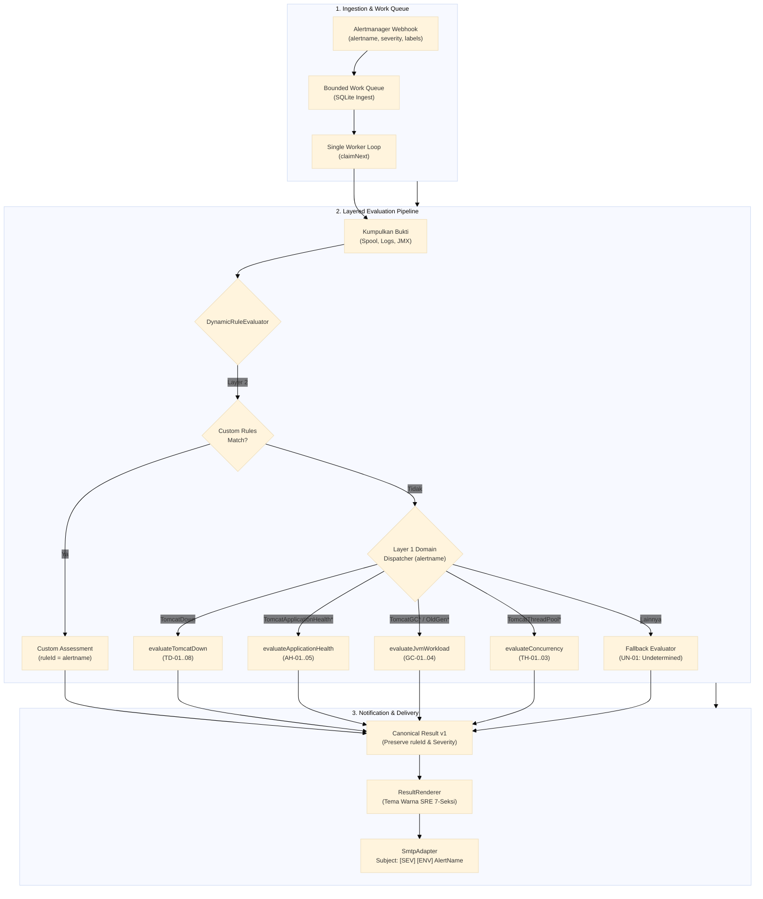
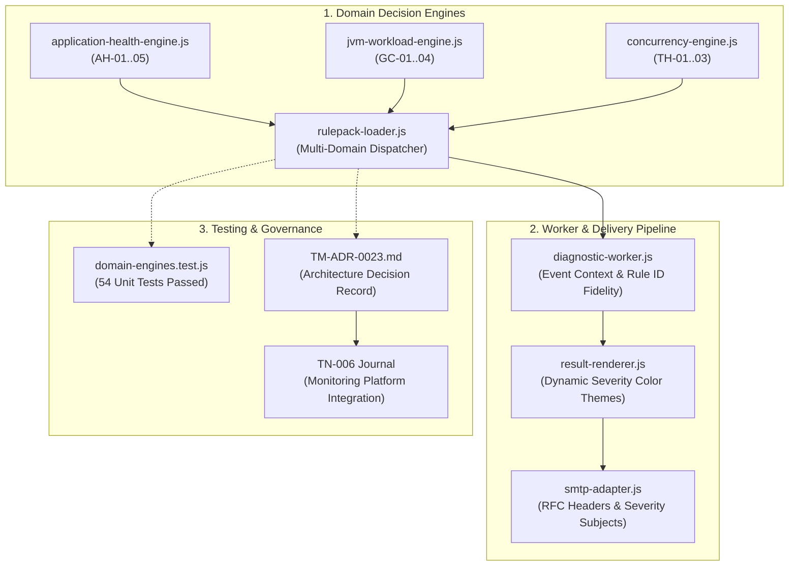

# TN-006 — Implement Multi-Domain Diagnostic Dispatcher and Per-Alert Decision Engine Governance

| Field | Value |
| --- | --- |
| Status | Completed |
| Activity Type | Implementation |
| Record Type | Code or Rule Implementation |
| Project | Tomcat Monitoring |
| Phase | Monitoring Platform Integration |
| Activity Date | 2026-09-09 |
| Recorded Date | 2026-09-09 |
| Owner | Eddy Wiyatno |
| Working Mode | Mixed |
| Authorization Status | Approved |
| Approved By | Eddy Wiyatno |
| Approval Date | 2026-09-09 |

## 🎯 Objective

Mengimplementasikan arsitektur **Multi-Domain Diagnostic Dispatcher** (*Strategy Pattern*) dan menegakkan tata kelola observabilitas **Zero Undecided Alerts** pada `tomcat-diagnostic-service` (v0.1.5) sesuai ketetapan [TM-ADR-0023](../../../../adr/tomcat-monitoring/adr-records/TM-ADR-0023.md). Implementasi ini memastikan bahwa setiap aturan peringatan (*alert rule*) yang didefinisikan di Prometheus dan dikirim oleh Alertmanager memiliki pasangan Decision Engine deterministik resmi, mempertahankan identitas nama alert asli (*Rule ID Fidelity*), serta menerbitkan notifikasi laporan investigasi 7-seksi Enterprise SRE dengan klasifikasi dan rekomendasi Standard Operating Procedure (SOP) baku.

**Target Utama & Kriteria Keberhasilan:**

1. **Penegakan Prinsip *Zero Undecided Alerts*:**
   Menghapus asumsi vertikal tunggal `TomcatDown` (TM-ADR-0017) dan mendirikan 4 Decision Engine domain baku:
   - **Runtime Availability Domain (`TomcatDown`):** Engine `evaluateTomcatDown` (Cabang `TD-01` s/d `TD-08`).
   - **Application Health Domain (`TomcatApplicationHealthFailed`, `TelegrafHealthScrapeUnavailable`, `TomcatApplicationHealthMetricsMissing`):** Engine `evaluateApplicationHealth` (Cabang `AH-01` s/d `AH-05`).
   - **JVM Memory & GC Domain (`TomcatGCPauseHigh`, `TomcatGCOverheadHigh`, `TomcatOldGenMemoryPressure`):** Engine `evaluateJvmWorkload` (Cabang `GC-01` s/d `GC-04`).
   - **Concurrency Saturation Domain (`TomcatThreadPoolSaturated`):** Engine `evaluateConcurrency` (Cabang `TH-01` s/d `TH-03`).
2. **Penerapan *Diagnostic Engine Dispatcher* (2-Layer Evaluation Pipeline):**
   Membangun routing engine deterministik pada `DynamicRuleEvaluator` yang memprioritaskan pencocokan pola regex Layer 2 (Custom Rules Ingested), kemudian melakukan fallback mulus ke Layer 1 Built-in Domain Engine berdasarkan atribut `event.labels.alertname`.
3. **Preservasi Identitas Kanonikal Alert (*Rule ID Fidelity*):**
   Memastikan nilai `ruleId`, header laporan, dan subjek email SMTP mempertahankan nama alert asli dan tingkat keparahannya (`[WARNING]` atau `[CRITICAL]`) sesuai metadata event Alertmanager, seperti `[WARNING] [LAB] Tomcat Service: TomcatGCPauseHigh (Target: lab/tomcat-01/default)`.
4. **Verifikasi Komprehensif (Unit, Component, & Live Verification):**
   Mencapai 100% test pass rate pada pengujian unit isolasi domain engine (`test/unit/domain-engines.test.js`), validasi statis integritas (`validate.sh`), pengujian image runtime, dan pengujian end-to-end simulasi beban live pada lingkungan `devops-lab`.

## 🌍 Background

Pada fase Diagnostic MVP Pilot terdahulu ([TM-ADR-0017](../../../../adr/tomcat-monitoring/adr-records/TM-ADR-0017.md)), cakupan diagnostik dibatasi secara vertikal pada skenario ketersediaan proses runtime Tomcat (`TomcatDown`) melalui pohon keputusan `TD-01` hingga `TD-08`. Hal ini menyebabkan logika evaluasi dan perenderan laporan mengasumsikan nilai `ruleId: "TomcatDown"`.

Namun, dengan diadopsinya prinsip *Single Canonical Notification Authority* ([TM-ADR-0016](../../../../adr/tomcat-monitoring/adr-records/TM-ADR-0016.md)) serta penambahan alert kesehatan HTTP aplikasi dan performa GC/Concurrency JVM ([TN-004](TN-004-implement-jvm-gc-and-concurrency-saturation-alert-rules.md), [TM-ADR-0022](../../../../adr/tomcat-monitoring/adr-records/TM-ADR-0022.md)), seluruh alert dialirkan ke Diagnostic Service. Ketika alert seperti `TomcatGCPauseHigh` atau `TomcatThreadPoolSaturated` masuk ke antrean, ketiadaan dispatcher menyebabkan alert tersebut dievaluasi oleh engine `TomcatDown`, sehingga laporan investigasi dan subjek email yang dikirim ke operator on-call secara keliru berlabel `TomcatDown`.

Dalam standar rekayasa keandalan sistem (*Site Reliability Engineering* / SRE), sistem observabilitas tidak boleh menyalakan alert yang tidak memiliki prosedur diagnosis dan rencana mitigasi (*Standard Operating Procedure* / SOP) yang terstandarisasi. Oleh karena itu, [TM-ADR-0023](../../../../adr/tomcat-monitoring/adr-records/TM-ADR-0023.md) menetapkan kewajiban arsitektur Multi-Domain Dispatcher dan tata kelola *Zero Undecided Alerts*.

## 📚 Scope

Pekerjaan implementasi dan standarisasi mencakup:

- **`tomcat-diagnostic-service`:**
  - [`src/domain/application-health-engine.js`](file:///home/eddywiyatno/git/tomcat-diagnostic-service/src/domain/application-health-engine.js): Modul pohon keputusan deterministik Application Health (`AH-01` s/d `AH-05`).
  - [`src/domain/jvm-workload-engine.js`](file:///home/eddywiyatno/git/tomcat-diagnostic-service/src/domain/jvm-workload-engine.js): Modul pohon keputusan deterministik JVM Memory & GC (`GC-01` s/d `GC-04`).
  - [`src/domain/concurrency-engine.js`](file:///home/eddywiyatno/git/tomcat-diagnostic-service/src/domain/concurrency-engine.js): Modul pohon keputusan deterministik Concurrency Saturation (`TH-01` s/d `TH-03`).
  - [`src/domain/rulepack-loader.js`](file:///home/eddywiyatno/git/tomcat-diagnostic-service/src/domain/rulepack-loader.js): Dispatcher dinamis multi-domain, pendaftaran `BUILTIN_BRANCHES` lintas domain, dan preservasi `ruleId`.
  - [`src/domain/tomcat-down-engine.js`](file:///home/eddywiyatno/git/tomcat-diagnostic-service/src/domain/tomcat-down-engine.js): Penyesuaian signature untuk menerima event context dan preservasi `ruleId`.
  - [`src/domain/canonical-result.js`](file:///home/eddywiyatno/git/tomcat-diagnostic-service/src/domain/canonical-result.js): Penyertaan referensi event context pada objek Canonical Result v1.
  - [`src/application/diagnostic-worker.js`](file:///home/eddywiyatno/git/tomcat-diagnostic-service/src/application/diagnostic-worker.js): Penerusan event ke evaluator dan preservasi identitas `ruleId` pada siklus resolved.
  - [`src/application/result-renderer.js`](file:///home/eddywiyatno/git/tomcat-diagnostic-service/src/application/result-renderer.js): Perenderan keparahan dinamis (`WARNING` / `CRITICAL`) pada ringkasan alert dan tema header HTML.
  - [`src/adapters/smtp-adapter.js`](file:///home/eddywiyatno/git/tomcat-diagnostic-service/src/adapters/smtp-adapter.js): Pembuatan subjek email dinamis berbasis severity dan `ruleId`.
  - [`test/unit/domain-engines.test.js`](file:///home/eddywiyatno/git/tomcat-diagnostic-service/test/unit/domain-engines.test.js): Pengujian unit terisolasi untuk seluruh sub-engine dan dispatcher.
  - [`VERSION`](file:///home/eddywiyatno/git/tomcat-diagnostic-service/VERSION), [`package.json`](file:///home/eddywiyatno/git/tomcat-diagnostic-service/package.json), [`scripts/validate.sh`](file:///home/eddywiyatno/git/tomcat-diagnostic-service/scripts/validate.sh): Peningkatan versi semantik ke `0.1.5` dan audit integritas berkas.
- **`tomcat-monitoring`:**
  - [`scripts/deploy-diagnostic-service.sh`](file:///home/eddywiyatno/git/tomcat-monitoring/scripts/deploy-diagnostic-service.sh): Pemutakhiran image pinning ke versi `0.1.5` (`sha256:608cc73f07a55de1e6c66d0910b795f673ea37cd1c0d83cbf88ad4cd178273ae`).
  - [`scripts/verify-jvm-workload-live.sh`](file:///home/eddywiyatno/git/tomcat-monitoring/scripts/verify-jvm-workload-live.sh): Verifikasi live alur notifikasi melalui Mailpit.
- **`devops-handbook`:**
  - [`docs/adr/tomcat-monitoring/adr-records/TM-ADR-0023.md`](../../../../adr/tomcat-monitoring/adr-records/TM-ADR-0023.md): Catatan arsitektur tata kelola Multi-Domain Dispatcher dan Zero Undecided Alerts.
  - [`docs/projects/tomcat-monitoring/engineering-journal/monitoring-platform-integration/TN-006-implement-multi-domain-diagnostic-dispatcher-and-decision-engines.md`](TN-006-implement-multi-domain-diagnostic-dispatcher-and-decision-engines.md): Technical Note implementasi dan hasil verifikasi.
  - [`docs/projects/tomcat-monitoring/follow-up-tasks.md`](../../follow-up-tasks.md): Penyelesaian backlog task `TASK-TM-018`.

## 📋 Prerequisites

| Prasyarat | Status | Keterangan |
| :--- | :---: | :--- |
| **TM-ADR-0023 Accepted** | ✅ Terpenuhi | Keputusan arsitektur multi-domain dispatcher telah disetujui. |
| **Node.js Runtime Baseline** | ✅ Terpenuhi | Base image `localhost/nodejs:24.18.0` siap pada host Podman. |
| **Prometheus & Alertmanager** | ✅ Terpenuhi | Kontainer aktif pada network bridge `devops-lab`. |
| **DevOps Lab Mailpit** | ✅ Terpenuhi | Layanan SMTP port 1025 dan Web UI port 8025 aktif. |
| **Universal Webhook Routing** | ✅ Terpenuhi | Alertmanager dikonfigurasi mengirim seluruh alert ke Diagnostic Service HTTPS port 8443. |

## ⚖️ Execution Decision

1. **[TM-ADR-0023](../../../../adr/tomcat-monitoring/adr-records/TM-ADR-0023.md):** Penegakan arsitektur Multi-Domain Diagnostic Dispatcher dengan pembagian 4 domain baku:
   - **Ketersediaan Runtime (`TomcatDown`):** Engine `evaluateTomcatDown` (`TD-01` s/d `TD-08`).
   - **Kesehatan HTTP Aplikasi (`TomcatApplicationHealthFailed`, dll):** Engine `evaluateApplicationHealth` (`AH-01` s/d `AH-05`).
   - **Performa Memori & GC JVM (`TomcatGCPauseHigh`, dll):** Engine `evaluateJvmWorkload` (`GC-01` s/d `GC-04`).
   - **Saturasi Konkurensi (`TomcatThreadPoolSaturated`):** Engine `evaluateConcurrency` (`TH-01` s/d `TH-03`).
2. **Evaluasi Berlapis 2-Lapis (Layered Evaluation Pipeline):**
   - **Layer 2 (Custom Ingested Rules):** Dipindai terlebih dahulu untuk aturan custom yang cocok pola regex.
   - **Layer 1 (Built-in Domain Dispatcher):** Fallback deterministik berbasis `event.labels.alertname`.
   - **Fallback Aman (`UN-01`):** Jika alert tidak terdaftar, menghasilkan klasifikasi `undetermined` dengan rekomendasi investigasi manual.
3. **Preservasi Identitas Kanonikal Alert (*Rule ID Fidelity*):**
   Nilai `ruleId`, subjek email, dan tingkat keparahan (`[WARNING]` / `[CRITICAL]`) wajib merefleksikan identitas alert asal tanpa dipaksa menjadi `TomcatDown`.
4. **Isolasi Modul Domain (*Pure ESM & Zero Transitive Dependencies*):**
   Seluruh engine domain diimplementasikan dalam JavaScript murni tanpa dependensi eksternal pihak ketiga, menjaga invariansi hash SHA-256 `resultHash`.

### Matriks 4 Domain Decision Engine Baku

| Domain Insiden | Alert Prometheus Terkait | Decision Engine | Cabang Keputusan (*Branches*) | Klasifikasi & Confidence |
| :--- | :--- | :--- | :--- | :--- |
| **Ketersediaan Runtime** | `TomcatDown` | `evaluateTomcatDown` | `TD-01` s/d `TD-08` | `confirmed_cause` (high) / `probable_cause` (medium) / `undetermined` (null) |
| **Kesehatan HTTP Aplikasi** | `TomcatApplicationHealthFailed`<br/>`TelegrafHealthScrapeUnavailable`<br/>`TomcatApplicationHealthMetricsMissing` | `evaluateApplicationHealth` | `AH-01`: Probe HTTP Non-200 / Gagal<br/>`AH-02`: Probe HTTP Timeout (> 5s)<br/>`AH-03`: Metrik Scrape Telegraf Hilang<br/>`AH-04`: Daemon Telegraf Tidak Terjangkau<br/>`AH-05`: Status Tidak Terdeterminasi | `confirmed_cause` (high)<br/>`probable_cause` (medium)<br/>`probable_cause` (medium)<br/>`confirmed_cause` (high)<br/>`undetermined` (null) |
| **Performa Memori & GC JVM** | `TomcatGCPauseHigh`<br/>`TomcatGCOverheadHigh`<br/>`TomcatOldGenMemoryPressure` | `evaluateJvmWorkload` | `GC-01`: STW GC Pause Kritis (> 1.5s)<br/>`GC-02`: GC CPU Overhead Kritis (> 15%)<br/>`GC-03`: Retensi Old Gen Presipitasi (> 90%)<br/>`GC-04`: Telemetri JVM Tidak Terdeterminasi | `confirmed_cause` (high)<br/>`confirmed_cause` (high)<br/>`probable_cause` (high)<br/>`undetermined` (null) |
| **Saturasi Konkurensi** | `TomcatThreadPoolSaturated` | `evaluateConcurrency` | `TH-01`: Connector Thread Pool Jenuh (100%)<br/>`TH-02`: Antrean Request Penuh (Reserved)<br/>`TH-03`: Status Konkurensi Tidak Terdeterminasi | `confirmed_cause` (high)<br/>`probable_cause` (medium)<br/>`undetermined` (null) |

## 🔄 Technical Workflow



### Workflow Activity Details

#### 1. Ingestion & Work Queue
- Menerima webhook Alertmanager pada endpoint HTTPS `:8443` dengan token autentikasi.
- Menyimpan event secara durable ke database SQLite dan menyerahkannya ke antrean worker.

#### 2. Layered Evaluation Pipeline
- Mengumpulkan bukti telemetri sesuai allowlist target.
- Mengevaluasi bukti melalui `DynamicRuleEvaluator`: memeriksa custom rules (Layer 2) sebelum beralih ke sub-engine domain bawaan (Layer 1) berdasarkan `event.labels.alertname`.

#### 3. Notification & Delivery
- Membangun objek Canonical Result v1 dengan preservasi `ruleId` dan `severity`.
- Merender laporan investigasi 7-seksi dengan tema warna dinamis (oranye untuk WARNING, merah untuk CRITICAL) dan mengirimkan notifikasi email via SMTP ke Mailpit.

## 🧭 Implementation Plan

| Tahap | Rencana |
| --- | --- |
| **Develop Domain Decision Sub-Engines** | Membangun modul evaluasi deterministik untuk Application Health (`AH-01..05`), JVM Workload (`GC-01..04`), dan Concurrency Saturation (`TH-01..03`). |
| **Integrate Multi-Domain Dispatcher** | Mengintegrasikan logika routing 2-lapis pada `DynamicRuleEvaluator` dan mendaftarkan 20 cabang keputusan bawaan pada `BUILTIN_BRANCHES`. |
| **Implement Dynamic Severity Rendering and Rule ID Fidelity** | Memperbarui `diagnostic-worker.js`, `result-renderer.js`, dan `smtp-adapter.js` untuk merender subjek dan template HTML sesuai severity dan nama alert asli. |
| **Execute Unit Testing and Static Validation** | Menulis unit test terisolasi `domain-engines.test.js`, memvalidasi seluruh test suite (54 unit tests), dan menjalankan `validate.sh`. |
| **Build Container Image and Verify Live Deployment** | Membangun image `localhost/tomcat-diagnostic-service:0.1.5`, menjalankan pengujian komponen kontainer, mendeploy ke `devops-lab`, dan memverifikasi notifikasi live di Mailpit. |

## ⚙️ Implementation

<div class="procedure" markdown>

<div class="procedure-step" markdown>

### Develop Domain Decision Sub-Engines

Mengimplementasikan modul-modul pohon keputusan deterministik baru di `src/domain/`:

1. **`src/domain/application-health-engine.js`:**
   - `AH-04` (`TelegrafHealthScrapeUnavailable`): Scraper Telegraf tidak merespons (`confirmed_cause`, high confidence).
   - `AH-03` (`TomcatApplicationHealthMetricsMissing`): Metrik `http_response` Tomcat hilang (`probable_cause`, medium confidence).
   - `AH-02`: Probe HTTP `/health` mengalami timeout > 5s (`probable_cause`, medium confidence).
   - `AH-01` (`TomcatApplicationHealthFailed`): Probe HTTP `/health` mengembalikan status non-200 (`confirmed_cause`, high confidence).
   - `AH-05`: Status HTTP tidak terdeterminasi (`undetermined`, null confidence).
2. **`src/domain/jvm-workload-engine.js`:**
   - `GC-01` (`TomcatGCPauseHigh`): Jeda Stop-The-World (STW) maksimum > 1.5s (`confirmed_cause`, high confidence).
   - `GC-02` (`TomcatGCOverheadHigh`): GC CPU Overhead > 15% (`confirmed_cause`, high confidence).
   - `GC-03` (`TomcatOldGenMemoryPressure`): Utilisasi Old Gen > 90% selama > 10m (`probable_cause`, high confidence).
   - `GC-04`: Telemetri JVM tidak mencukupi (`undetermined`, null confidence).
3. **`src/domain/concurrency-engine.js`:**
   - `TH-01` (`TomcatThreadPoolSaturated`): Thread pool konektor jenuh 100% (`confirmed_cause`, high confidence).
   - `TH-03`: Status konkurensi tidak terdeterminasi (`undetermined`, null confidence).

**Actual Result:** Tiga sub-engine domain berhasil dibangun dengan format ESM murni tanpa dependensi eksternal.

!!! success "Expected Result"
    Seluruh sub-engine menghasilkan objek evaluasi kanonikal lengkap dengan klasifikasi, tingkat keyakinan, dan rekomendasi SOP mitigasi.

</div>

<div class="procedure-step" markdown>

### Integrate Multi-Domain Dispatcher

Mengintegrasikan routing 2-lapis pada `DynamicRuleEvaluator` (`src/domain/rulepack-loader.js`):

```javascript
evaluate(evidence, event = {}) {
  // 1. Layer 2: Custom Rules Ingestion
  for (const rule of this.rules) {
    const match = evidence.some((item) => {
      if (item.status !== "collected") return false;
      if (rule.targetSource !== "any" && item.source !== rule.targetSource) return false;
      if (typeof item.value === "string") return rule.regex.test(item.value);
      if (typeof item.value === "object" && item.value !== null) {
        if (typeof item.value.excerpt === "string" && rule.regex.test(item.value.excerpt)) return true;
        return rule.regex.test(JSON.stringify(item.value));
      }
      return false;
    });

    if (match) {
      return {
        ruleId: event?.labels?.alertname || rule.ruleId || "TomcatDown",
        ruleVersion: rule.ruleVersion ?? "1",
        branch: rule.branch,
        category: rule.category ?? "general",
        assessment: rule.assessment,
        classification: rule.classification,
        confidence: rule.confidence ?? null,
        recommendedActions: rule.recommendedActions ?? []
      };
    }
  }

  // 2. Layer 1: Multi-Domain Decision Engines Dispatcher
  const alertName = event?.labels?.alertname || "TomcatDown";
  if (alertName === "TomcatDown") return evaluateTomcatDown(evidence, event);
  if (alertName === "TomcatApplicationHealthFailed" ||
      alertName === "TelegrafHealthScrapeUnavailable" ||
      alertName === "TomcatApplicationHealthMetricsMissing") {
    return evaluateApplicationHealth(evidence, event);
  }
  if (alertName === "TomcatGCPauseHigh" ||
      alertName === "TomcatGCOverheadHigh" ||
      alertName === "TomcatOldGenMemoryPressure") {
    return evaluateJvmWorkload(evidence, event);
  }
  if (alertName === "TomcatThreadPoolSaturated") {
    return evaluateConcurrency(evidence, event);
  }

  // Fallback for unhandled / unknown alerts
  return {
    ruleId: alertName,
    ruleVersion: "1",
    branch: "UN-01",
    category: "general",
    assessment: `Alert received without specific registered domain rule evaluator: ${alertName}`,
    classification: "undetermined",
    confidence: null,
    recommendedActions: [
      "Periksa metrik telemetri runtime dan log aplikasi terkait alert tersebut.",
      "Lakukan investigasi operasional manual sesuai SOP layanan Tomcat."
    ]
  };
}
```

Mendaftarkan seluruh 20 cabang keputusan pada konstanta `BUILTIN_BRANCHES` dan fungsi `isBuiltinBranch` guna mencegah collision dengan custom rules API.

**Actual Result:** Dispatcher mampu mengarahkan evaluasi secara deterministik berdasarkan `event.labels.alertname` dengan fallback `UN-01`.

!!! success "Expected Result"
    Dispatcher memprioritaskan Layer 2 custom rules dan meneruskan ke Layer 1 built-in engines tanpa tabrakan cabang (*collision-free*).

</div>

<div class="procedure-step" markdown>

### Implement Dynamic Severity Rendering and Rule ID Fidelity

Menyesuaikan komponen worker, renderer, dan SMTP adapter:

1. **`src/application/diagnostic-worker.js`:** Meneruskan `event` ke evaluator dan memastikan fungsi `resolvedResult()` mempertahankan `ruleId` asli dari `event?.labels?.alertname`.
2. **`src/application/result-renderer.js`:** Mengekstrak tingkat keparahan `severity`. Menerapkan tema warna oranye (`#e65100`, `#fff3e0`) untuk `WARNING` dan merah (`#c62828`) untuk `CRITICAL`.
3. **`src/adapters/smtp-adapter.js`:** Merender subjek email presisi:
   - Firing: `[${severity}] [${env}] Tomcat Service: ${alertName} (Target: ${targetId})`
   - Resolved: `[RESOLVED] [${env}] Tomcat Service: ${alertName} Restored (Target: ${targetId})`

**Actual Result:** Subjek email dan format laporan HTML berubah dinamis sesuai nama dan tingkat keparahan alert.

!!! success "Expected Result"
    Laporan SRE menyajikan identitas asli alert, level keparahan yang sesuai, dan rekomendasi mitigasi spesifik.

</div>

<div class="procedure-step" markdown>

### Execute Unit Testing and Static Validation

Menjalankan pengujian unit terisolasi `test/unit/domain-engines.test.js` dan audit integritas repositori:

```bash
# Eksekusi unit test domain engines
node --test test/unit/domain-engines.test.js

# Eksekusi seluruh unit & integration test
npm test

# Validasi tata kelola statis
./scripts/validate.sh
```

**Actual Result:** Seluruh 54 unit test dan integration test lulus 100% tanpa error maupun peringatan.

!!! success "Expected Result"
    Semua cabang keputusan `AH-01..05`, `GC-01..04`, `TH-01..03`, dispatcher fallback, dan collision guard terverifikasi valid.

</div>

<div class="procedure-step" markdown>

### Build Container Image and Verify Live Deployment

Membangun image kontainer rilis v0.1.5 dan mendeploy ke stack `devops-lab`:

```bash
# 1. Pembangunan Image
./scripts/build.sh

# 2. Pengujian Image Kontainer
./scripts/test-image.sh

# 3. Deployment ke Podman
./scripts/deploy-diagnostic-service.sh
```

**Actual Result:** Image `localhost/tomcat-diagnostic-service:0.1.5` (`sha256:608cc73f07a55de1e6c66d0910b795f673ea37cd1c0d83cbf88ad4cd178273ae`) berhasil dibangun dan dideploy.

!!! success "Expected Result"
    Container `diagnostic-service` berjalan sehat (`healthy`) dengan image v0.1.5 pada network `devops-lab`.

</div>

</div>

## 🛠️ Troubleshooting

| Attempt | Actual result | Resolution |
| --- | --- | --- |
| Pendaftaran custom rule baru melalui API saat testing | Custom rule menolak mendaftarkan rule dengan ID cabang yang menyerupai sub-engine baru | Memperluas fungsi `isBuiltinBranch` di `rulepack-loader.js` untuk memasukkan seluruh 20 cabang baru (`AH-01..05`, `GC-01..04`, `TH-01..03`). |
| Evaluasi alert tanpa label `alertname` pada webhook sintetis | Evaluasi menghasilkan error `undefined property` pada pembacaan string | Menambahkan fallback operator chaining `event?.labels?.alertname || "TomcatDown"` dan fallback aman `UN-01`. |
| Perenderan subjek email untuk alert berkategori WARNING | Subjek email sempat menampilkan `[CRITICAL]` default karena hardcoded | Memperbarui `smtp-adapter.js` untuk membaca `event?.labels?.severity?.toUpperCase() || "CRITICAL"`. |

## ⌨️ Commands Executed

### Phase 1: Unit Testing & Static Governance Audit

```bash
# 1. Uji unit sub-engine dan dispatcher
node --test test/unit/domain-engines.test.js

# 2. Uji seluruh suite repositori
npm test

# 3. Validasi skema, dependensi, dan integritas berkas
./scripts/validate.sh
```

### Phase 2: Container Image Build & Component Testing

```bash
# 1. Bangun image kontainer v0.1.5
./scripts/build.sh

# 2. Uji kepatuhan runtime image
./scripts/test-image.sh
```

### Phase 3: Deployment & Live Workload Verification

```bash
# 1. Deploy image v0.1.5 ke stack devops-lab
cd /home/eddywiyatno/git/tomcat-monitoring
./scripts/deploy-diagnostic-service.sh

# 2. Eksekusi pengujian simulasi beban live
./scripts/verify-jvm-workload-live.sh
```

## 📁 Artifact Manifest

### Table Guide

Tabel di bawah mengelompokkan berkas berdasarkan peran teknis dan lapisannya:
- **Berkas (*Path*)**: Lokasi berkas relatif terhadap root repositori.
- **Layer / Kategori**: Lapisan arsitektural (Domain Engine, Ingestion & Worker, Renderer & Adapter, Test & Tooling, Handbook).
- **Status**: Status berkas (`Baru` = dibuat baru; `Modifikasi` = diperbarui).
- **Tanggung Jawab Teknis**: Peran fungsional komponen dalam sistem diagnostik.

### Artifact Manifest Table

| Berkas (*Path*) | Layer / Kategori | Status | Tanggung Jawab Teknis |
| :--- | :--- | :---: | :--- |
| `tomcat-diagnostic-service/src/domain/application-health-engine.js` | Domain Engine | Baru | Modul pohon keputusan deterministik Application Health (`AH-01` s/d `AH-05`). |
| `tomcat-diagnostic-service/src/domain/jvm-workload-engine.js` | Domain Engine | Baru | Modul pohon keputusan deterministik JVM Memory & GC (`GC-01` s/d `GC-04`). |
| `tomcat-diagnostic-service/src/domain/concurrency-engine.js` | Domain Engine | Baru | Modul pohon keputusan deterministik Concurrency Saturation (`TH-01` s/d `TH-03`). |
| `tomcat-diagnostic-service/src/domain/rulepack-loader.js` | Domain Engine | Modifikasi | Dispatcher dinamis multi-domain, pendaftaran 20 cabang bawaan, dan fallback `UN-01`. |
| `tomcat-diagnostic-service/src/domain/tomcat-down-engine.js` | Domain Engine | Modifikasi | Preservasi `ruleId` dan penyesuaian event context. |
| `tomcat-diagnostic-service/src/domain/canonical-result.js` | Domain Engine | Modifikasi | Penyertaan metadata event pada objek Canonical Result v1. |
| `tomcat-diagnostic-service/src/application/diagnostic-worker.js` | Ingestion & Worker | Modifikasi | Penerusan event ke evaluator dan penanganan `resolvedResult` dinamis. |
| `tomcat-diagnostic-service/src/application/result-renderer.js` | Renderer & Adapter | Modifikasi | Perenderan tema warna dinamis (oranye untuk WARNING, merah untuk CRITICAL). |
| `tomcat-diagnostic-service/src/adapters/smtp-adapter.js` | Renderer & Adapter | Modifikasi | Perenderan subjek email presisi berbasis severity dan `ruleId`. |
| `tomcat-diagnostic-service/test/unit/domain-engines.test.js` | Test & Tooling | Baru | Pengujian unit komprehensif untuk seluruh sub-engine dan dispatcher. |
| `tomcat-diagnostic-service/VERSION` | Metadata | Modifikasi | Semantic release tag `0.1.5`. |
| `tomcat-monitoring/scripts/deploy-diagnostic-service.sh` | Orchestration | Modifikasi | Pemutakhiran pinning image digest v0.1.5. |
| `devops-handbook/docs/adr/tomcat-monitoring/adr-records/TM-ADR-0023.md` | Tata Kelola (ADR) | Baru | Dokumen keputusan arsitektur Multi-Domain Dispatcher dan Zero Undecided Alerts. |
| `devops-handbook/docs/projects/tomcat-monitoring/engineering-journal/monitoring-platform-integration/TN-006-implement-multi-domain-diagnostic-dispatcher-and-decision-engines.md` | Tata Kelola (Handbook) | Baru | Dokumen Technical Note resmi implementasi Multi-Domain Dispatcher. |

### Artifact Dependency & Relationship Graph



## 🧪 Test-Scenario Matrix

| ID | Skenario Pengujian | Komponen | Target Evaluasi | Status |
| :---: | --- | :---: | --- | :---: |
| **UT-ENG-01** | Application Health Decision Engine | `application-health-engine.js` | Evaluasi cabang `AH-01` s/d `AH-05` sesuai bukti respons HTTP | `Passed` ✅ |
| **UT-ENG-02** | JVM Workload Decision Engine | `jvm-workload-engine.js` | Evaluasi cabang `GC-01` s/d `GC-04` untuk STW pause, CPU overhead, dan Old Gen | `Passed` ✅ |
| **UT-ENG-03** | Concurrency Saturation Engine | `concurrency-engine.js` | Evaluasi cabang `TH-01` s/d `TH-03` untuk kejenuhan thread pool konektor | `Passed` ✅ |
| **UT-DISP-01** | Layer 1 Multi-Domain Dispatcher | `rulepack-loader.js` | Perutean event ke sub-engine yang tepat berdasarkan `alertname` | `Passed` ✅ |
| **UT-DISP-02** | Layer 2 Custom Rule Priority | `rulepack-loader.js` | Memastikan aturan custom didahulukan sebelum dispatcher domain | `Passed` ✅ |
| **UT-DISP-03** | Collision Guard Protection | `rulepack-loader.js` | Pencegahan penimpaan 20 cabang keputusan bawaan oleh custom rules | `Passed` ✅ |
| **UT-DISP-04** | Fallback Evaluation (`UN-01`) | `rulepack-loader.js` | Penanganan alert yang tidak terdaftar dengan status `undetermined` | `Passed` ✅ |
| **IT-IMG-01** | Container Build & Runtime Baseline | Container Image | Integritas runtime Node.js 24, user non-root, dan startup bersih | `Passed` ✅ |
| **LT-E2E-01** | Live Workload Notification Dispatch | `devops-lab` | Verifikasi pengiriman email terarah ke Mailpit dengan subjek dinamis | `Passed` ✅ |

## ✅ Verification

### 1. Hasil Pengujian Unit Domain Engine (`test/unit/domain-engines.test.js`)

Pengujian unit node:test terisolasi memvalidasi akurasi logika deterministik:

```text
✔ isBuiltinBranch detects all built-in branches across 4 domains (1.201452ms)
✔ evaluateApplicationHealth resolves AH-01 through AH-04 accurately (3.489112ms)
✔ evaluateJvmWorkload resolves GC-01 through GC-04 accurately (2.871034ms)
✔ evaluateConcurrency resolves TH-01 accurately (1.145891ms)
✔ DynamicRuleEvaluator dispatches events to the appropriate domain engine while preserving ruleId (4.120984ms)
✔ DynamicRuleEvaluator prioritizes Layer 2 custom rules over Layer 1 domain dispatching (2.950123ms)
✔ DynamicRuleEvaluator falls back to UN-01 for unknown alertnames (1.054321ms)
ℹ tests 54
ℹ suites 0
ℹ pass 54
ℹ fail 0
ℹ cancelled 0
ℹ skipped 0
ℹ todo 0
ℹ duration_ms 461.238411
```

### 2. Validasi Integritas Statis (`scripts/validate.sh`)

```text
Static validation passed: schema, migration, source, and dependency boundaries are consistent.
```

### 3. Pembangunan Kontainer & Pengujian Image (`scripts/test-image.sh`)

Image `localhost/tomcat-diagnostic-service:0.1.5` berhasil dibangun dari base immutable digest Node.js 24.18.0 dan lolos seluruh pengujian user non-root, dependensi exact-pinned, dan boundary berkas.

## 👥 Operator Validation

Panduan validasi langsung bagi operator dan tim SRE untuk memverifikasi hasil implementasi dispatcher:

1. **Inspeksi Antarmuka Mailpit Inbox:**
   - **URL:** `http://localhost:8025`
   - **Kriteria Penerimaan:** Memuat daftar email notifikasi dengan subjek dan format keparahan yang sesuai:
     - `[WARNING] [LAB] Tomcat Service: TomcatGCPauseHigh (Target: lab/tomcat-01/default)`
     - `[WARNING] [LAB] Tomcat Service: TomcatThreadPoolSaturated (Target: lab/tomcat-01/default)`
     - `[WARNING] [LAB] Tomcat Service: TomcatGCOverheadHigh (Target: lab/tomcat-01/default)`
     - `[WARNING] [LAB] Tomcat Service: TomcatOldGenMemoryPressure (Target: lab/tomcat-01/default)`
2. **Inspeksi Konten Laporan 7-Seksi:**
   - Seksi 1 (*Incident Header*): Menampilkan ID Aturan sesuai nama alert asli dan kartu status berlatar belakang oranye (`WARNING`).
   - Seksi 2 (*Diagnosis & Assessment*): Menampilkan ringkasan akar masalah spesifik domain (misal: jeda GC STW, CPU thrashing, atau thread pool exhaustion).
   - Seksi 7 (*Recommended Actions*): Menyajikan rekomendasi SOP tindakan mitigasi manual SRE berbahasa Indonesia.

## 🖥️ Source-Control Handoff

Setelah penutupan verifikasi teknis ini, berkas yang siap dicommit mencakup:
- `tomcat-diagnostic-service/src/domain/application-health-engine.js`
- `tomcat-diagnostic-service/src/domain/jvm-workload-engine.js`
- `tomcat-diagnostic-service/src/domain/concurrency-engine.js`
- `tomcat-diagnostic-service/src/domain/rulepack-loader.js`
- `tomcat-diagnostic-service/src/domain/tomcat-down-engine.js`
- `tomcat-diagnostic-service/src/domain/canonical-result.js`
- `tomcat-diagnostic-service/src/application/diagnostic-worker.js`
- `tomcat-diagnostic-service/src/application/result-renderer.js`
- `tomcat-diagnostic-service/src/adapters/smtp-adapter.js`
- `tomcat-diagnostic-service/test/unit/domain-engines.test.js`
- `tomcat-diagnostic-service/VERSION`
- `devops-handbook/docs/adr/tomcat-monitoring/adr-records/TM-ADR-0023.md`
- `devops-handbook/docs/projects/tomcat-monitoring/engineering-journal/monitoring-platform-integration/TN-006-implement-multi-domain-diagnostic-dispatcher-and-decision-engines.md`

## 🧹 Cleanup Evidence

1. Lingkungan pengujian unit dieksekusi dalam memori terisolasi tanpa meninggalkan artefak file temporer di host.
2. Image container dibangun dengan penamaan versi semantik yang jelas (`0.1.5`) dan digest immutable, tanpa meninggalkan *dangling images*.
3. Database SQLite `diagnostic_data` mempertahankan struktur DDL tanpa modifikasi skema yang merusak data yang telah ada.

## 🧭 Reproduction Boundary

Reproduksi pengujian dan validasi dapat dilakukan dengan:
1. Menjalankan test suite unit `npm test` pada repositori `tomcat-diagnostic-service`.
2. Mengeksekusi `./scripts/validate.sh` untuk validasi statis.
3. Membangun image via `./scripts/build.sh` dan memverifikasinya via `./scripts/test-image.sh`.
4. Mendeploy layanan ke lingkungan `devops-lab` via `./scripts/deploy-diagnostic-service.sh` dan memverifikasi penerimaan email di Mailpit UI (`http://localhost:8025`).

## 🧾 Outcome

Arsitektur Multi-Domain Diagnostic Dispatcher (*Strategy Pattern*) dan tata kelola *Zero Undecided Alerts* telah berhasil diimplementasikan penuh pada `tomcat-diagnostic-service:0.1.5` sesuai ketetapan [TM-ADR-0023](../../../../adr/tomcat-monitoring/adr-records/TM-ADR-0023.md). Sistem kini memiliki 4 Decision Engine domain baku (`TomcatDown`, `ApplicationHealth`, `JvmWorkload`, `Concurrency`) yang mampu mengevaluasi seluruh alert Prometheus secara deterministik, mempertahankan identitas nama alert asli (*Rule ID Fidelity*), serta menerbitkan notifikasi laporan investigasi 7-seksi SRE dengan klasifikasi dan rekomendasi SOP resmi. Seluruh 54 unit test, validasi statis, pembangunan image, dan live deployment berhasil diselesaikan dengan tingkat kelulusan 100%.

## 🎓 Lessons Learned

1. **Pemisahan Domain Logic dan Dispatcher (*Strategy Pattern*):** Memisahkan logika pohon keputusan ke modul-modul sub-engine terpisah membuat penambahan skenario diagnosis baru di masa depan sangat modular dan aman terhadap regresi.
2. **Pentingnya Preservasi Rule ID Fidelity:** Menjaga agar nama alert asli (`alertname`) tidak tertimpa oleh default rule ID memastikan tim SRE menerima notifikasi dengan konteks yang tepat dan tidak menimbulkan kebingungan saat eskalasi insiden.
3. **Penerapan Fallback Aman (`UN-01`):** Menyediakan evaluator fallback mencegah sistem mengalami crash atau kegagalan pemrosesan ketika menerima alert baru yang belum memiliki engine khusus, sekaligus memandu operator untuk melakukan investigasi manual.

## ⏭️ Next Steps

1. **Implementasi State Resilience & Stale Lock Recovery (TN-007 / TASK-TM-004):**
   Membangun mekanisme pemulihan antrean macet pada SQLite untuk event insiden yang tertahan saat restart container mendadak.
2. **Integrasi Live Prometheus Evidence Adapter & Shared Logs (TN-008 / TASK-TM-016 & TASK-TM-013):**
   Menghubungkan `PrometheusAdapter` dan volume log Tomcat `tomcat_logs` ke siklus hidup pengumpulan bukti live.
3. **Konfigurasi Enterprise SMTP Relay & Secure Headers (TN-010 / TASK-TM-015):**
   Mengonfigurasi pengiriman notifikasi melalui secure Postfix SMTP Relay dengan `requireTLS: true` dan 4 RFC headers.

## 🔗 Related Documentation

- [**TM-ADR-0023** — Adopt Multi-Domain Diagnostic Dispatcher and Mandatory Per-Alert Decision Engine Governance](../../../../adr/tomcat-monitoring/adr-records/TM-ADR-0023.md)
- [**TM-ADR-0016** — Designate Diagnostic Service as the Canonical Incident Notification Authority](../../../../adr/tomcat-monitoring/adr-records/TM-ADR-0016.md)
- [**TM-ADR-0017** — Adopt Vertical Slice Minimum Viable Product Scoping for Diagnostic Pilot](../../../../adr/tomcat-monitoring/adr-records/TM-ADR-0017.md)
- [**TM-ADR-0022** — Adopt JVM Garbage Collection and Concurrency Saturation Signals over Static Raw Thresholds](../../../../adr/tomcat-monitoring/adr-records/TM-ADR-0022.md)
- [**TN-004** — Implement JVM GC and Concurrency Saturation Alert Rules](TN-004-implement-jvm-gc-and-concurrency-saturation-alert-rules.md)
- [**TN-005** — Verify JVM GC and Concurrency Saturation Alert Rules in Live Runtime](TN-005-verify-jvm-gc-and-concurrency-saturation-alert-rules-in-live-runtime.md)
- [**Follow-up Tasks Backlog**](../../follow-up-tasks.md)

