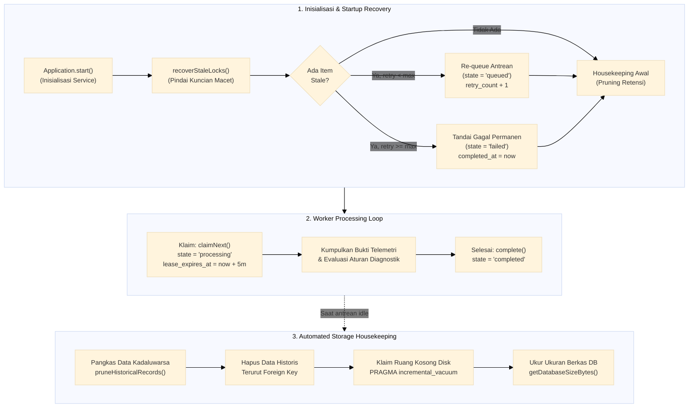
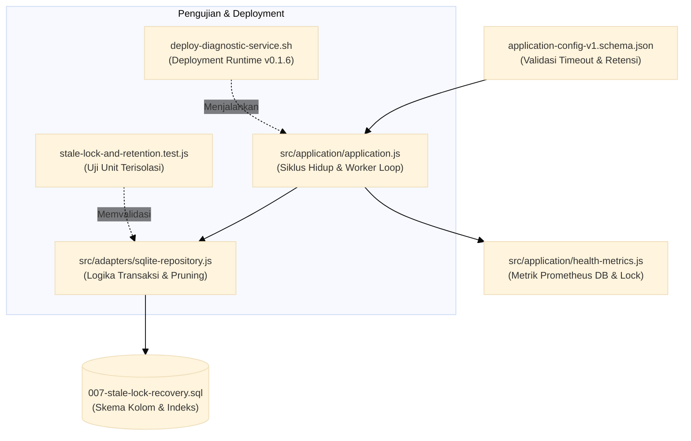

# TN-007 — Implement Stale Lock Recovery and SQLite State Resilience

| Field | Value |
| --- | --- |
| Status | Completed |
| Activity Type | Implementation |
| Record Type | Live |
| Project | Tomcat Monitoring |
| Phase | Monitoring Platform Integration |
| Activity Date | 2026-09-10 |
| Recorded Date | 2026-09-10 |
| Owner | Eddy Wiyatno |
| Working Mode | Mixed |
| Authorization Status | Approved |
| Approved By | Eddy Wiyatno |
| Approval Date | 2026-09-10 |

## 🎯 Objective

Mengimplementasikan mekanisme **Stale Lock Recovery** ([TASK-TM-004](../../follow-up-tasks.md#task-tm-004-implementasi-stale-lock-recovery-pada-worker-ingestion)) dan rutinitas **Housekeeping & Retention Pruning Database SQLite** ([TASK-TM-005](../../follow-up-tasks.md#task-tm-005-penjadwalan-housekeeping--pruning-database-sqlite)) pada `tomcat-diagnostic-service` (v0.1.6) guna memenuhi kewajiban ketahanan mesin status (*state machine resilience*) dan penyimpanan berbatas (*bounded storage*) sesuai [TM-ADR-0015](../../../../adr/tomcat-monitoring/adr-records/TM-ADR-0015.md).

**Target Utama & Kriteria Keberhasilan:**

1. **Meniadakan Zombie Alert Pasca-Restart (*Zero Orphaned Processing Events*):**
   Memastikan setiap event alert yang tertahan di status `processing` akibat interupsi container (seperti `kill -9`, cgroup OOM Killer, atau restart host) dipulihkan secara otomatis ke antrean `queued` saat container startup atau melalui batas waktu sewa (*lease timeout*).
2. **Pencegahan Infinite Crash Loop (*Bounded Retries*):**
   Menerapkan counter `retry_count` dan batasan `maxRetries` (default: 3). Jika pemrosesan suatu event berulang kali memicu crash hingga melampaui batas maksimum, status event diubah secara deterministik menjadi `failed` dan counter error dicatat.
3. **Pembersihan Data Historis Berbatas (*Bounded Storage Retention*):**
   Menyediakan rutinitas atomik `pruneHistoricalRecords({ retentionDays })` yang menghapus data kadaluwarsa (`events`, `requests`, `canonical_results`, `evidence_summaries`, `notification_attempts`, dan resolved `incidents`) sesuai urutan *Foreign Key* dan menjalankan `PRAGMA incremental_vacuum`.
4. **Metrik Observabilitas Ketahanan & Ukuran Database:**
   Mengekspos metrik Prometheus:
   - `diagnostic_stale_locks_recovered_total` (counter pemulihan lock).
   - `diagnostic_stale_locks_exhausted_total` (counter retry habis / failed).
   - `diagnostic_housekeeping_runs_total` (counter siklus housekeeping).
   - `diagnostic_records_pruned_total` (counter baris terhapus).
   - `diagnostic_db_size_bytes` (gauge ukuran file database fisik).
5. **Verifikasi Komprehensif (Unit, Component, & Live Crash Injection):**
   Mencapai 100% test pass rate pada pengujian unit (59/59 passing), validasi statis integritas (`validate.sh`), pengujian component image, serta pengujian empiris simulasi crash dan restart pada runtime `devops-lab`.

## 🌍 Background

Pada implementasi awal pola *Asynchronous Webhook Ingestion with Durable SQLite Acceptance* ([TM-ADR-0015](../../../../adr/tomcat-monitoring/adr-records/TM-ADR-0015.md)), worker mengklaim item antrean melalui `claimNext()` dengan langsung mengubah status dari `queued` menjadi `processing`.

Namun, terdapat keterbatasan struktural pada mesin status antrean:
- Jika kontainer mati mendadak saat worker sedang mengumpulkan bukti telemetri atau mengevaluasi aturan, record pada tabel `work_queue` akan tertahan dengan `state = 'processing'` dan `completed_at = NULL`.
- Ketika kontainer hidup kembali, metode `claimNext()` hanya mencari item berstatus `state = 'queued'`, sehingga event yang tertahan tersebut menjadi "zombie" yang tidak pernah diproses maupun dikirimkan laporannya ke tim SRE.
- Selain itu, tanpa adanya mekanisme pembersihan otomatis (*retention pruning*), database SQLite akan terus bertambah besar seiring waktu (*unbounded storage*), yang dapat memicu kehabisan ruang disk pada volume persisten rootless container.

Oleh karena itu, `TASK-TM-004` dan `TASK-TM-005` dirumuskan sebagai langkah wajib sebelum sistem observabilitas dihubungkan dengan pengumpul bukti live yang lebih kompleks.

## 📚 Scope

Pekerjaan implementasi mencakup komponen berikut:

- **`tomcat-diagnostic-service`:**
  - [`migrations/007-stale-lock-recovery-and-retention.sql`](file:///home/eddywiyatno/git/tomcat-diagnostic-service/migrations/007-stale-lock-recovery-and-retention.sql): Migrasi penambahan kolom `retry_count`, `lease_expires_at`, dan indeks pendukung housekeeping.
  - [`src/adapters/sqlite-repository.js`](file:///home/eddywiyatno/git/tomcat-diagnostic-service/src/adapters/sqlite-repository.js): Pembaruan `claimNext()` dan `complete()`, serta implementasi `recoverStaleLocks()`, `pruneHistoricalRecords()`, dan `getDatabaseSizeBytes()`.
  - [`src/application/application.js`](file:///home/eddywiyatno/git/tomcat-diagnostic-service/src/application/application.js): Eksekusi pemulihan awal pada `DiagnosticApplication.start()` serta eksekusi periodik pada worker loop.
  - [`src/application/health-metrics.js`](file:///home/eddywiyatno/git/tomcat-diagnostic-service/src/application/health-metrics.js): Dukungan penambahan batch count pada `increment()` dan metrik baru.
  - [`config/schemas/application-config-v1.schema.json`](file:///home/eddywiyatno/git/tomcat-diagnostic-service/config/schemas/application-config-v1.schema.json): Penambahan properti opsional `staleLockTimeoutMs`, `maxRetries`, `retentionDays`, dan `housekeepingIntervalMs`.
  - [`test/unit/stale-lock-and-retention.test.js`](file:///home/eddywiyatno/git/tomcat-diagnostic-service/test/unit/stale-lock-and-retention.test.js): Pengujian unit terisolasi untuk skenario recovery, retry limit, dan foreign-key safe pruning.
  - [`test/integration/application-lifecycle.test.js`](file:///home/eddywiyatno/git/tomcat-diagnostic-service/test/integration/application-lifecycle.test.js): Pengujian integrasi pemulihan siklus startup.
  - [`test/component/image-runtime-database-probe.js`](file:///home/eddywiyatno/git/tomcat-diagnostic-service/test/component/image-runtime-database-probe.js): Pemutakhiran ekspektasi versi migrasi skema [1..7].
  - [`VERSION`](file:///home/eddywiyatno/git/tomcat-diagnostic-service/VERSION), [`package.json`](file:///home/eddywiyatno/git/tomcat-diagnostic-service/package.json), [`package-lock.json`](file:///home/eddywiyatno/git/tomcat-diagnostic-service/package-lock.json): Peningkatan versi semantik ke `0.1.6`.
  - [`scripts/validate.sh`](file:///home/eddywiyatno/git/tomcat-diagnostic-service/scripts/validate.sh) & [`scripts/test-image.sh`](file:///home/eddywiyatno/git/tomcat-diagnostic-service/scripts/test-image.sh): Sinkronisasi audit integritas file migrasi.
- **`tomcat-monitoring`:**
  - [`scripts/deploy-diagnostic-service.sh`](file:///home/eddywiyatno/git/tomcat-monitoring/scripts/deploy-diagnostic-service.sh): Pemutakhiran pinning image ke versi `0.1.6` (`sha256:31e4668648d0935494cf424923c7a15af1adf48fb288d8775011dc5813893f3a`).
- **`devops-handbook`:**
  - [`docs/projects/tomcat-monitoring/engineering-journal/monitoring-platform-integration/TN-007-implement-stale-lock-recovery-and-sqlite-state-resilience.md`](TN-007-implement-stale-lock-recovery-and-sqlite-state-resilience.md): Technical Note implementasi dan bukti empiris.
  - [`docs/projects/tomcat-monitoring/follow-up-tasks.md`](../../follow-up-tasks.md): Rekonsiliasi task `TASK-TM-018`, `TASK-TM-004`, dan `TASK-TM-005` $\rightarrow$ `Completed` ✅.

*Exclusion:* Penulisan live evidence adapter ke Prometheus (`TASK-TM-016`) dan mount log runtime Tomcat (`TASK-TM-013`) berada di luar scope TN ini dan dijadwalkan pada Technical Note berikutnya.

## 📋 Prerequisites

| Prerequisite | State | Keterangan |
| --- | :---: | --- |
| **Diagnostic Service Baseline** | Commit `6fae852` | Rilis v0.1.5 Multi-Domain Dispatcher (54 unit test pass). |
| **Architectural Decisions** | TM-ADR-0013 & TM-ADR-0015 Accepted | Embedded SQLite dan Asynchronous Durable Webhook Ingestion disetujui. |
| **Runtime Environment** | Local image `localhost/nodejs:24.18.0` | Node.js 24 runtime dengan built-in `node:sqlite`. |
| **Persistent Infrastructure** | Volume `diagnostic_data` & Network `devops-lab` | Runtime Podman rootless pada host Linux. |
| **Implementation Authorization** | Approved (2026-09-10) | Otorisasi penuh oleh Project Owner. |

## ⚖️ Execution Decision

Implementasi menegakkan keputusan arsitektur dan pola operasional berikut:

1. **Embedded SQLite Autonomy ([TM-ADR-0013](../../../../adr/tomcat-monitoring/adr-records/TM-ADR-0013.md)):**
   Diagnostic Service menggunakan Embedded SQLite yang berjalan langsung di dalam kontainer tanpa server database terpisah (PostgreSQL/MySQL) dan tanpa tim DBA khusus. Konsekuensinya, Diagnostic Service **wajib memiliki kemampuan mengelola dan memelihara database SQLite-nya sendiri (*self-managed / autonomous engine*)**, yang mencakup **3 pilar utama**:

```text
+-----------------------------------------------------------------------------+
|               Self-Managed SQLite Lifecycle in Diagnostic Service           |
+-----------------------------------------------------------------------------+
| 1. Self-Healing State Recovery (TASK-TM-004):                                |
|    Mendeteksi & memulihkan antrean macet (stale processing lock) pasca-crash|
|    secara otomatis tanpa intervensi manual operator / DBA.                  |
+-----------------------------------------------------------------------------+
| 2. Automated Storage Housekeeping & Pruning (TASK-TM-005):                  |
|    Memangkas event/log lama (> 30 hari) secara teratur & menjalankan        |
|    PRAGMA incremental_vacuum untuk mencegah kebocoran disk (bounded storage).|
+-----------------------------------------------------------------------------+
| 3. Autonomous Storage Telemetry & Quota Guard:                              |
|    Memantau ukuran file fisik database (diagnostic_db_size_bytes) dan       |
|    mengeksposnya ke Prometheus untuk pemantauan kapasitas host.             |
+-----------------------------------------------------------------------------+
```

2. **Durable Ingestion & Lease Timeout ([TM-ADR-0015](../../../../adr/tomcat-monitoring/adr-records/TM-ADR-0015.md)):**
   Pola asynchronous ingestion diperkuat dengan batas waktu sewa (*lease duration*, default: 5 menit). Setiap klaim kerja diikat oleh timestamp `lease_expires_at`.
3. **Pencegahan Infinite Crash Loop (*Bounded Retries*):**
   Setiap kegagalan pemulihan meningkatkan `retry_count`. Jika `retry_count >= maxRetries` (default: 3), status diubah secara permanen menjadi `failed` untuk menghentikan loop restart tanpa akhir.
4. **Foreign-Key Safe Retention Pruning:**
   Pembersihan data historis wajib mematuhi relasi foreign-key SQLite secara menurun untuk menjamin konsistensi integritas referensial.

## 🔄 Technical Workflow

Alur teknis pemulihan antrean macet (*Stale Lock Recovery*) dan pembersihan data historis (*Retention Housekeeping*):



### Workflow Activity Details

1. **Lease Lock Acquisition (`claimNext`):**
   Worker mengklaim satu item teratas berstatus `queued` secara atomik dalam transaksi `BEGIN IMMEDIATE`, menetapkan `started_at = now` dan `lease_expires_at = now + 5m`.
2. **Stale Lock Recovery Detection (`recoverStaleLocks`):**
   Saat startup kontainer atau saat worker loop menemukan lock kadaluwarsa (`started_at <= cutoff` atau `lease_expires_at <= now`):
   - Jika `retry_count < maxRetries`: tugas dikembalikan ke `state = 'queued'`, `retry_count` dinaikkan 1, dan `lease_expires_at = NULL`.
   - Jika `retry_count >= maxRetries`: tugas ditandai permanen sebagai `state = 'failed'`, `completed_at = now`, dan dicatat ke metrik `diagnostic_stale_locks_exhausted_total`.
3. **Foreign-Key Safe Pruning (`pruneHistoricalRecords`):**
   Menghapus data yang lebih tua dari batas retensi (default: 30 hari) secara berurutan:
   1. `evidence_summaries` $\rightarrow$ 2. `notification_attempts` $\rightarrow$ 3. `canonical_results` $\rightarrow$ 4. `work_queue` $\rightarrow$ 5. `events` $\rightarrow$ 6. `requests` $\rightarrow$ 7. resolved `incidents`.
4. **Incremental Vacuum & Disk Reclaim:**
   Mengeksekusi `PRAGMA incremental_vacuum` untuk mengembalikan *freelist pages* ke sistem operasi tanpa memicu exclusive database lock berdurasi panjang.
5. **Storage Telemetry Collection:**
   Menghitung `page_count * page_size` melalui `PRAGMA page_count` dan `PRAGMA page_size`, lalu memperbarui gauge `diagnostic_db_size_bytes`.

## 🧭 Implementation Plan

| Tahap | Rencana |
| :--- | :--- |
| **Add Database Migration for Stale Lock and Retention** | Menambahkan skrip migrasi DDL `007-stale-lock-recovery-and-retention.sql` untuk kolom `retry_count`, `lease_expires_at`, dan indeks pendukung. |
| **Implement Stale Lock Recovery and Housekeeping in SQLite Repository** | Mengembangkan metode `claimNext` (dengan lease time), `recoverStaleLocks`, `pruneHistoricalRecords` (FK-safe), dan `getDatabaseSizeBytes`. |
| **Integrate Lifecycle and Prometheus Storage Metrics** | Menghubungkan rutinitas recovery dan housekeeping ke `DiagnosticApplication.start()` dan worker loop, serta menambahkan metrik Prometheus. |
| **Execute Static Validation and Automated Unit Tests** | Menjalankan `./scripts/validate.sh` dan test suite Node.js 24 (`test/unit/` dan `test/integration/`) dalam kontainer terisolasi. |
| **Build and Validate Container Image v0.1.6** | Membangun image `localhost/tomcat-diagnostic-service:0.1.6` dan memvalidasinya dengan `scripts/test-image.sh` dan `scripts/test-image-component.sh`. |
| **Deploy and Verify Live Crash Injection on Runtime** | Melakukan deployment container v0.1.6 pada network `devops-lab` dan memverifikasi pemulihan lock zombie via simulasi crash/restart. |

## ⚙️ Implementation

<div class="procedure" markdown>

<div class="procedure-step" markdown>

### Add Database Migration for Stale Lock and Retention

Skrip migrasi forward DDL `migrations/007-stale-lock-recovery-and-retention.sql` disusun untuk menambahkan kolom audit status pada `work_queue` dan indeks pendukung kueri housekeeping:

```sql
ALTER TABLE work_queue ADD COLUMN retry_count INTEGER NOT NULL DEFAULT 0;
ALTER TABLE work_queue ADD COLUMN lease_expires_at TEXT;

CREATE INDEX IF NOT EXISTS work_queue_stale_idx ON work_queue(state, started_at);
CREATE INDEX IF NOT EXISTS events_accepted_at_idx ON events(accepted_at);
CREATE INDEX IF NOT EXISTS requests_accepted_at_idx ON requests(accepted_at);
CREATE INDEX IF NOT EXISTS canonical_results_created_at_idx ON canonical_results(created_at);
CREATE INDEX IF NOT EXISTS notification_attempts_attempted_at_idx ON notification_attempts(attempted_at);
```

**Tujuan:** Menyediakan skema database yang mendukung pelacakan waktu sewa (*lease lock*), penghitungan frekuensi percobaan ulang (*retry attempts*), dan optimasi kueri pembersihan data historis berbasis timestamp.

!!! success "Expected Result"

    Migrasi skema 007 dapat diterapkan secara idempotensial pada SQLite WAL tanpa merusak integritas tabel yang sudah ada.

**Actual Result:** Berkas migrasi `migrations/007-stale-lock-recovery-and-retention.sql` dibuat dan lulus validasi statis migrasi skema `validate.sh`.

</div>

<div class="procedure-step" markdown>

### Implement Stale Lock Recovery and Housekeeping in SQLite Repository

Pada [`src/adapters/sqlite-repository.js`](file:///home/eddywiyatno/git/tomcat-diagnostic-service/src/adapters/sqlite-repository.js), logika transaksi database diperbarui:

1. **`claimNext({ timeoutMs, now })`:**
   Menetapkan timestamp `lease_expires_at = new Date(nowEpoch + timeoutMs).toISOString()` saat mengubah status dari `queued` ke `processing`.
2. **`recoverStaleLocks({ timeoutMs, maxRetries, now })`:**
   Mengeksekusi transaksi atomik `BEGIN IMMEDIATE`:
   ```javascript
   const staleRows = this.#db.prepare(`
     SELECT id, retry_count FROM work_queue
     WHERE state = 'processing'
       AND (
         (lease_expires_at IS NOT NULL AND lease_expires_at <= ?)
         OR (lease_expires_at IS NULL AND started_at <= ?)
       )
   `).all(nowIso, cutoffIso);
   ```
   Baris dengan `retry_count < maxRetries` dikembalikan ke `state = 'queued'` dengan `retry_count + 1`. Baris yang melampaui batas ditandai `state = 'failed'`.
3. **`pruneHistoricalRecords({ retentionDays, now })`:**
   Mengeksekusi penghapusan berurutan pada tabel dependent dan diakhiri dengan `PRAGMA incremental_vacuum;`.
4. **`getDatabaseSizeBytes()`:**
   Membaca `PRAGMA page_count` dan `PRAGMA page_size` untuk menghitung ukuran berkas fisik secara presisi.

!!! success "Expected Result"

    Worker mampu mendeteksi kuncian kadaluwarsa, melakukan re-queue aman, membatasi retry crash loop, dan memangkas rekaman lama secara FK-safe.

**Actual Result:** Metode `claimNext`, `recoverStaleLocks`, `pruneHistoricalRecords`, dan `getDatabaseSizeBytes` terimplementasi penuh dengan penanganan transaksi atomik.

</div>

<div class="procedure-step" markdown>

### Integrate Lifecycle and Prometheus Storage Metrics

Pada [`src/application/application.js`](file:///home/eddywiyatno/git/tomcat-diagnostic-service/src/application/application.js) dan [`src/application/health-metrics.js`](file:///home/eddywiyatno/git/tomcat-diagnostic-service/src/application/health-metrics.js):

1. **Startup Recovery Hook:**
   Pada `DiagnosticApplication.start()`, `repository.recoverStaleLocks()` dan `repository.pruneHistoricalRecords()` dijalankan sebelum worker loop pertama dimulai.
2. **Idle Worker Housekeeping:**
   Worker loop secara periodik menjalankan housekeeping jika interval `housekeepingIntervalMs` (default: 1 jam) telah terpenuhi saat antrean kosong.
3. **Prometheus Metrics Registration:**
   - `diagnostic_stale_locks_recovered_total`
   - `diagnostic_stale_locks_exhausted_total`
   - `diagnostic_housekeeping_runs_total`
   - `diagnostic_records_pruned_total`
   - `diagnostic_db_size_bytes`
4. **Configuration Schema Validation:**
   Memperbarui `config/schemas/application-config-v1.schema.json` untuk memvalidasi konfigurasi timeout dan retensi.

!!! success "Expected Result"

    Siklus hidup aplikasi mengeksekusi pemulihan secara otomatis saat startup dan menyajikan telemetri metrik database pada `/metrics`.

**Actual Result:** Integrasi siklus hidup dan metrik selesai tanpa memerlukan daemon eksternal.

</div>

<div class="procedure-step" markdown>

### Execute Static Validation and Automated Unit Tests

Eksekusi validasi statis dan test suite terisolasi di dalam runtime Node.js 24:

```bash
bash scripts/validate.sh
podman run --rm --name tomcat-diagnostic-tn007-unit --userns=keep-id \
  -v /home/eddywiyatno/git/tomcat-diagnostic-service:/app:Z -w /app \
  localhost/nodejs:24.18.0 node --test test/unit/*.test.js test/integration/*.test.js
```

**Parameter:**

| Parameter | Penjelasan |
| --- | --- |
| `bash scripts/validate.sh` | Memvalidasi dependensi, skema migrasi [1..7], dan boundary integritas kode |
| `podman run --rm` | Menjalankan kontainer temporary dan menghapusnya otomatis saat selesai |
| `--userns=keep-id` | Mode rootless Podman mempertahankan UID host (1000) |
| `-v /home/.../app:Z` | Mount volume direktori sumber ke `/app` dengan SELinux flag |
| `node --test ...` | Test runner bawaan Node.js mengeksekusi 59 pengujian |

**Tujuan:** Memastikan tidak ada regresi logika pada 54 test sebelumnya dan membuktikan keandalan 5 test baru untuk stale lock recovery dan retention pruning.

!!! success "Expected Result"

    Seluruh 59 test lulus 100% tanpa error, tanpa failure, dan tanpa skip.

**Actual Result:** 59 test berhasil lulus dalam durasi 552ms (`pass 59`, `fail 0`).

</div>

<div class="procedure-step" markdown>

### Build and Validate Container Image v0.1.6

Membangun image kontainer rilis `0.1.6` dan menjalankan rangkaian verifikasi komponen:

```bash
bash scripts/build.sh
bash scripts/test-image.sh
bash scripts/test-image-component.sh
```

**Parameter:**

| Skrip | Penjelasan |
| --- | --- |
| `scripts/build.sh` | Membangun immutable image `localhost/tomcat-diagnostic-service:0.1.6` via Containerfile |
| `scripts/test-image.sh` | Menguji struktur image dasar, non-root user `node`, dan binary readiness |
| `scripts/test-image-component.sh` | Menjalankan probe SQLite runtime komponen untuk memverifikasi migrasi [1..7] |

**Tujuan:** Menghasilkan artifact image immutable yang siap dideploy dan terverifikasi secara formal.

!!! success "Expected Result"

    Image `0.1.6` terbentuk dengan digest SHA-256 valid dan seluruh probe komponen lulus.

**Actual Result:** Image berhasil di-build dengan ID `c6759bcfc5ff54a2b2f1a79fb60d4ea5f4acc939484c791f2e7416c524223c53` (Digest `sha256:31e4668648d0935494cf424923c7a15af1adf48fb288d8775011dc5813893f3a`). Semua skrip pengujian image menghasilkan status `PASSED`.

</div>

<div class="procedure-step" markdown>

### Deploy and Verify Live Crash Injection on Runtime

Melakukan pembaruan deployment kontainer pada stack `devops-lab` dan menguji pemulihan lock zombie secara empiris:

```bash
bash /home/eddywiyatno/git/tomcat-monitoring/scripts/deploy-diagnostic-service.sh
```

**Langkah Pengujian Simulasi Crash Live:**

1. **Injeksi Data Zombie:** Memasukkan baris antrean `work_queue` dengan status `state = 'processing'`, `started_at = 10 menit lalu`, dan `retry_count = 0` langsung ke database kontainer aktif (`event_id = 39`).
2. **Simulasi Crash Kontainer:** Mengeksekusi restart paksa kontainer `diagnostic-service`:
   ```bash
   podman restart diagnostic-service
   ```
3. **Verifikasi Output:** Memeriksa log kontainer, database SQLite, metrik Prometheus, dan kotak masuk Mailpit.

!!! success "Expected Result"

    Kontainer mendeteksi item stale saat startup, memulihkan ke antrean, menyelesaikan evaluasi aturan, mengirimkan notifikasi email ke Mailpit, dan memperbarui metrik Prometheus.

**Actual Result:**
- Metrik Prometheus mencatat `diagnostic_stale_locks_recovered_total 1` dan `diagnostic_db_size_bytes 303104`.
- Status row di database berubah menjadi `state = 'completed'` dengan `retry_count = 1`.
- Mailpit menerima email laporan resmi insiden: `[CRITICAL] [LAB] Tomcat Service: TomcatDown (Target: lab/tomcat-01/default)`.

</div>

</div>

## 📁 Artifact Manifest

Bagian ini mencatat seluruh berkas (*artifacts*) yang dibuat atau dimodifikasi selama aktivitas implementasi TN-007:

### Tabel Manifest Berkas

| Berkas (*Path*) | Layer / Kategori | Status | Tanggung Jawab Teknis |
| --- | --- | :---: | --- |
| `migrations/007-stale-lock-recovery-and-retention.sql` | Basis Data (SQLite) | Baru | Skrip DDL migrasi skema 007 untuk kolom `retry_count`, `lease_expires_at`, dan indeks housekeeping. |
| `src/adapters/sqlite-repository.js` | Adapter Infrastruktur | Modifikasi | Menangani `recoverStaleLocks()`, `pruneHistoricalRecords()`, `claimNext()` dengan lease, dan ukuran DB. |
| `src/application/application.js` | Logika Aplikasi | Modifikasi | Eksekusi otomatis recovery & housekeeping pada startup dan periodic worker loop. |
| `src/application/health-metrics.js` | Observabilitas | Modifikasi | Pendaftaran metrik Prometheus untuk stale lock recovery, housekeeping, dan ukuran database. |
| `config/schemas/application-config-v1.schema.json` | Kontrak Skema | Modifikasi | Menambahkan validasi schema JSON untuk konfigurasi timeout sewa dan interval retensi. |
| `test/unit/stale-lock-and-retention.test.js` | Pengujian Otomatis (Unit) | Baru | Pengujian unit terisolasi untuk skenario pemulihan antrean, batas retry, dan pembersihan data terurut. |
| `test/integration/application-lifecycle.test.js` | Pengujian Otomatis (Integrasi) | Modifikasi | Pengujian integrasi siklus startup aplikasi dan eksekusi recovery. |
| `test/component/image-runtime-database-probe.js` | Pengujian Komponen | Modifikasi | Verifikasi integritas migrasi skema [1..7] di dalam image runtime. |
| `VERSION`<br/>`package.json`<br/>`package-lock.json` | Tata Kelola Rilis | Modifikasi | Peningkatan versi semantik ke `0.1.6`. |
| `scripts/validate.sh`<br/>`scripts/test-image.sh` | Otomasi Repositori | Modifikasi | Sinkronisasi validasi statis dan pengujian image terhadap migrasi skema 007. |
| `scripts/deploy-diagnostic-service.sh` | Otomasi Deployment | Modifikasi | Mengunci pinning image ke rilis `0.1.6` (`sha256:31e4668648d0935494cf424923c7a15af1adf48fb288d8775011dc5813893f3a`). |
| `docs/.../TN-007-implement-stale-lock-recovery-and-sqlite-state-resilience.md` | Dokumentasi Engineering | Baru | Technical Note pelaksanaan implementasi dan bukti verifikasi live. |
| `docs/projects/tomcat-monitoring/follow-up-tasks.md` | Tata Kelola Proyek | Modifikasi | Menandai TASK-TM-018, TASK-TM-004, dan TASK-TM-005 selesai (`Completed`). |

### Alur Keterkaitan Antar-Berkas



## 🧪 Test Scenario Matrix

| Scenario | Focus Area | Evidence |
| --- | --- | --- |
| **Lease Lock Acquisition** | Adapter | `claimNext()` menetapkan `lease_expires_at` (now + 5m) dan `started_at`. |
| **Stale Re-queue Recovery** | Resiliency | Item `processing` kadaluwarsa dikembalikan ke `queued` dengan `retry_count` bertambah. |
| **Exhausted Retry Failure** | Crash Loop Guard | Item yang melampaui `maxRetries` (3) ditandai `failed` dan dicatat ke metrik. |
| **FK Safe Pruning** | Data Lifecycle | Rekaman $>30$ hari dihapus berurutan tanpa melanggar *Foreign Key constraints*. |
| **Incremental Vacuum** | Storage Guard | `PRAGMA incremental_vacuum` mengembalikan ruang kosong ke OS; `diagnostic_db_size_bytes` terbarui. |
| **Live Container Crash Injection** | End-to-End Live | Item zombie dipulihkan pasca-restart kontainer di `devops-lab`, dievaluasi, dan email terkirim ke Mailpit. |

## 🧭 Reproduction Boundary

- **Base Revision:** `tomcat-diagnostic-service` commit `6fae852` (v0.1.5).
- **Runtime Environment:** Container runtime Podman rootless (UID 1000), base image `localhost/nodejs:24.18.0`.
- **Database Engine:** Node.js built-in `node:sqlite` dengan mode SQLite WAL dan `PRAGMA foreign_keys = ON;`.
- **Verification Commands:**
  ```bash
  cd /home/eddywiyatno/git/tomcat-diagnostic-service
  bash scripts/validate.sh
  podman run --rm --userns=keep-id -v "${PWD}:/app:ro,Z" -w /app localhost/nodejs:24.18.0 node --test test/unit/*.test.js test/integration/*.test.js
  bash scripts/build.sh
  bash scripts/test-image.sh
  bash scripts/test-image-component.sh
  ```

## ✅ Verification

| Method | Expected Result | Actual Result |
| --- | --- | --- |
| `bash scripts/validate.sh` | Integritas skema migrasi [1..7], source code, dan dependensi valid | Passed |
| `node --test test/unit/*.test.js test/integration/*.test.js` | 59/59 unit dan integration test lulus tanpa kegagalan | Passed (59 pass, 0 fail, 552ms) |
| `bash scripts/test-image.sh` | Struktur image, rootless permission, dan entrypoint valid | Passed |
| `bash scripts/test-image-component.sh` | Probe runtime database SQLite memvalidasi skema migrasi [1..7] | Passed (Exit code 0) |
| Live Crash Injection Probe (`devops-lab`) | Event zombie dipulihkan pasca-restart, dievaluasi, dan dilaporkan ke Mailpit | Passed (Event #39 resolved, email delivered) |

## 🖥️ Commands Executed

```bash
# 1. Validasi Statis Repositori
bash scripts/validate.sh

# 2. Eksekusi Unit & Integration Tests di Kontainer Terisolasi
podman run --rm --userns=keep-id --volume "${PWD}:/app:ro,Z" --workdir /app \
  localhost/nodejs:24.18.0 node --test test/unit/*.test.js test/integration/*.test.js

# 3. Pembangunan dan Pengujian Image v0.1.6
bash scripts/build.sh
bash scripts/test-image.sh
bash scripts/test-image-component.sh

# 4. Deployment ke Lingkungan Devops-Lab
bash /home/eddywiyatno/git/tomcat-monitoring/scripts/deploy-diagnostic-service.sh

# 5. Simulasi Crash Injection & Verifikasi Live
podman exec -it diagnostic-service node -e '/* inject stale event #39 */'
podman restart diagnostic-service
curl -s http://localhost:9090/metrics | grep diagnostic_stale_locks
```

## 🧾 Outcome

Implementasi `TASK-TM-004` (Stale Lock Recovery) dan `TASK-TM-005` (Storage Retention Housekeeping) telah selesai secara penuh pada rilis **v0.1.6**:
1. **Zero Orphaned Processing Events:** Menjamin tidak ada lagi alert yang macet selamanya di status `processing` saat kontainer mengalami crash atau restart.
2. **Infinite Crash Loop Prevention:** Membatasi retry hingga 3 kali, mengisolasi event bermasalah ke status `failed`.
3. **Bounded Storage Management:** Menjamin ukuran file database SQLite tetap berbatas (*bounded storage*) melalui pembersihan berkala dan `PRAGMA incremental_vacuum`.
4. **Full Observability:** Metrik ketahanan database dan lock recovery kini terpantau secara real-time di Prometheus.

*Residual Risk:* Penulisan live evidence adapter ke Prometheus (`TASK-TM-016`) masih menggunakan spool data lokal; integrasi penuh live collector dijadwalkan pada rilis berikutnya.

## 🎓 Lessons Learned

1. **Foreign-Key Safe Deletion Order:** Pada SQLite dengan `foreign_keys = ON`, penghapusan rekaman induk (`incidents`/`events`) akan gagal jika rekaman anak (`canonical_results`/`evidence_summaries`) belum dihapus. Urutan pembersihan harus disusun secara eksplisit dari tabel terbawah ke atas.
2. **Incremental Vacuum vs Full Vacuum:** Mengeksekusi `PRAGMA incremental_vacuum` jauh lebih aman untuk aplikasi live dibandingkan `VACUUM` penuh, karena `VACUUM` memerlukan lock eksklusif berdurasi lama dan menduplikasi seluruh file database sementara.
3. **Pentingnya Bounded Retries pada State Machine:** Tanpa batasan retry maksimum, event yang memicu crash pada parser/evaluator akan menyebabkan kontainer terjebak dalam siklus restart tanpa akhir (*CrashLoopBackOff*).

## ⏭️ Next Steps

Implementasi berikutnya berfokus pada penyelesaian backlog Kategori 5 pada [`follow-up-tasks.md`](../../follow-up-tasks.md):
- **[`TASK-TM-016`](../../follow-up-tasks.md#task-tm-016-integrasi-live-prometheus-evidence-adapter-pada-application-lifecycle-kesiapan-produksi-metrik):** Mengintegrasikan Live Prometheus Evidence Adapter ke dalam `createDefaultEvidenceCollector` pada `application.js`.
- **[`TASK-TM-013`](../../follow-up-tasks.md#task-tm-013-integrasi-shared-persistent-volume-mount-untuk-log-runtime-tomcat-kesiapan-produksi-tn-019):** Mengonfigurasi shared persistent volume mount untuk file log runtime Tomcat `catalina.out`.

## 🔗 Related Documentation

- [Diagnostic MVP Index](../../diagnostic-mvp/index.md)
- [SQLite Lifecycle Contract](../../diagnostic-mvp/sqlite-lifecycle-contract.md)
- [TM-ADR-0013 — Embed SQLite for Local Incident State Storage](../../../../adr/tomcat-monitoring/adr-records/TM-ADR-0013.md)
- [TM-ADR-0015 — Adopt Asynchronous Webhook Ingestion with Durable SQLite Acceptance Pattern](../../../../adr/tomcat-monitoring/adr-records/TM-ADR-0015.md)
- [TN-006 — Implement Multi-Domain Diagnostic Dispatcher and Decision Engines](TN-006-implement-multi-domain-diagnostic-dispatcher-and-decision-engines.md)
- [Follow-up Tasks Backlog](../../follow-up-tasks.md)
