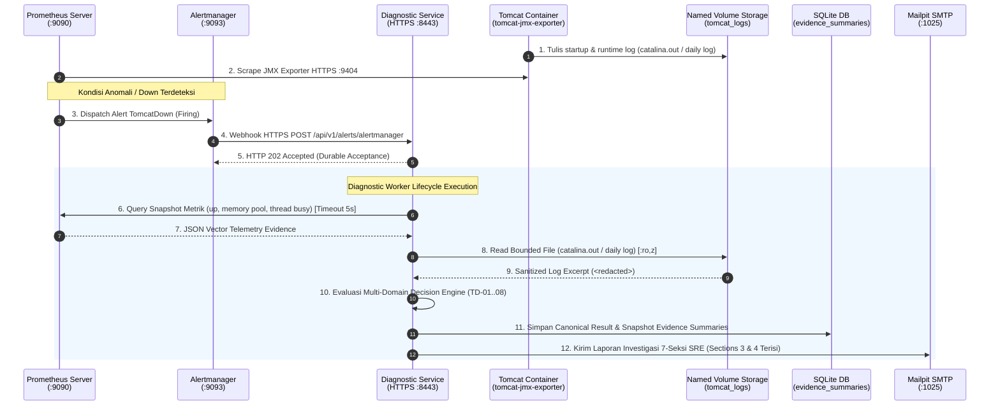
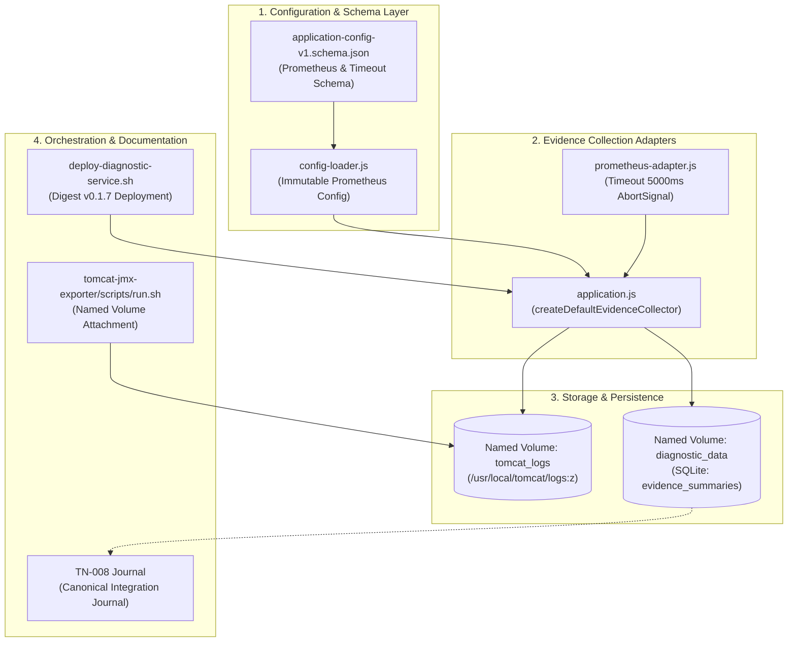

# TN-008 — Integrate Live Prometheus Evidence Adapter and Shared Persistent Tomcat Logs

| Field | Value |
| --- | --- |
| Status | Completed |
| Activity Type | Implementation |
| Record Type | Live |
| Project | Tomcat Monitoring |
| Phase | Monitoring Platform Integration |
| Activity Date | 2026-09-10 |
| Recorded Date | 2026-09-10 |
| Owner | Eddy Wiyatno |
| Working Mode | Mixed |
| Authorization Status | Approved |
| Approved By | Eddy Wiyatno |
| Approval Date | 2026-09-10 |

## 🎯 Objective

Mengintegrasikan modul pengumpul bukti telemetri langsung (*Live Evidence Collection Pipeline*) dari sistem nyata ke dalam siklus hidup Diagnostic Service, yang mencakup penyelesaian dua backlog strategis Kategori 5:

1. **TASK-TM-016: Integrasi Live Prometheus Evidence Adapter pada Application Lifecycle:**
   - Menghubungkan modul [`prometheus-adapter.js`](file:///home/eddywiyatno/git/tomcat-diagnostic-service/src/adapters/prometheus-adapter.js) ke dalam fungsi [`createDefaultEvidenceCollector`](file:///home/eddywiyatno/git/tomcat-diagnostic-service/src/application/application.js) pada runtime aplikasi.
   - Menyertakan konfigurasi `prometheus` (`baseUrl`) pada skema konfigurasi aplikasi dan `prometheusSelector` exact-match (`job="tomcat-jmx-exporter",instance="tomcat-jmx-exporter:9404"`) pada allowlist target [`targets.json`](file:///home/eddywiyatno/git/tomcat-monitoring/config/targets.json).
   - Menjamin perlindungan batas waktu kueri agresif (*aggressive timeout* 5000ms via `AbortSignal.timeout`) sehingga kegagalan atau kelambatan endpoint Prometheus tidak memblokir rantai evaluasi bukti lainnya.
   - Menyimpan snapshot metrik live (scrape health `up`, memory pool `jvm_memory_pool_used_bytes`, dan thread concurrency `tomcat_threads_busy_threads`) secara otomatis ke tabel `evidence_summaries` pada SQLite.
2. **TASK-TM-013: Integrasi Shared Persistent Named Volume untuk Log Runtime Tomcat:**
   - Mengonfigurasi Podman Named Volume persisten `tomcat_logs` (`--volume "tomcat_logs:/usr/local/tomcat/logs:z"`) antara runtime Tomcat (`tomcat-jmx-exporter`) dan Diagnostic Service (`--volume "tomcat_logs:/run/tomcat-diagnostic/logs:ro,z"`).
   - Menegakkan standardisasi Named Volume menyeluruh pada seluruh layer persistensi monitoring platform (`diagnostic_data`, `prometheus_data`, `alertmanager_data`, dan `tomcat_logs`), menolak penggunaan direktori ephemeral `/tmp` maupun host bind-mount yang rentan terhadap volatilitas reboot atau ketergantungan path host absolut.
   - Mengaktifkan pembacaan log runtime nyata (`catalina.out` dan fallback log harian `catalina.YYYY-MM-DD.log`) melalui [`bounded-file-reader.js`](file:///home/eddywiyatno/git/tomcat-diagnostic-service/src/adapters/bounded-file-reader.js) dengan redaksi rahasia otomatis.
3. **Penyajian Bukti Utuh pada Laporan Investigasi 7-Seksi SRE:**
   - Memastikan snapshot metrik telemetri runtime terisi pada Seksi 3 (*Key Metrics Snapshot*) dan rekaman log Tomcat asli terisi pada Seksi 4 (*Correlated Log Evidence*) dalam notifikasi email resmi ke Mailpit.

---

## 🌍 Background

Sebelum implementasi ini, rantai pengumpulan bukti diagnostik (*Evidence Collection Pipeline*) pada Diagnostic Service mengandalkan pembacaan berkas spool mock atau pengujian lokal sintetis. Meskipun modul [`PrometheusAdapter`](file:///home/eddywiyatno/git/tomcat-diagnostic-service/src/adapters/prometheus-adapter.js) dan [`BoundedFileReader`](file:///home/eddywiyatno/git/tomcat-diagnostic-service/src/adapters/bounded-file-reader.js) telah dibangun, kedua komponen tersebut belum dihubungkan secara penuh (*wired up*) ke siklus hidup operasional `DiagnosticApplication` dan container stack `devops-lab`.

Akibatnya:
- Notifikasi insiden yang dikirimkan ke tim SRE menampilkan status `not_configured` pada Seksi 3 (Key Metrics Snapshot) dan `not_found` pada Seksi 4 (Correlated Log Evidence).
- Berkas log runtime Tomcat (`catalina.out` / `catalina.YYYY-MM-DD.log`) terisolasi di dalam container ephemeral Tomcat dan tidak dapat dijangkau oleh Diagnostic Service.
- Penggunaan host bind-mount sembarang atau direktori `/tmp` rentan terhadap penghapusan berkas log saat server me-restart dan melanggar portabilitas serta tata kelola retensi log internal pengguna.
- Snapshot metrik real-time dari Prometheus API tidak terekam pada tabel SQLite `evidence_summaries`, menyisakan kesenjangan forensik pasca-insiden.

Untuk mencapai kesiapan lingkungan produksi (*Production Readiness*) sesuai peta jalan **TN-020** dan **TM-ADR-0016**, seluruh rantai bukti live wajib terhubung secara mulus, aman, berbatas (*bounded*), dan terstandarisasi berbasis Podman Named Volumes.

---

## 📚 Scope

Pekerjaan implementasi dan integrasi mencakup:

- **`tomcat-diagnostic-service` (v0.1.7):**
  - [`config/schemas/application-config-v1.schema.json`](file:///home/eddywiyatno/git/tomcat-diagnostic-service/config/schemas/application-config-v1.schema.json): Penambahan properti opsional `prometheus` (`baseUrl`) dan `timeouts.prometheusMs`.
  - [`src/application/config-loader.js`](file:///home/eddywiyatno/git/tomcat-diagnostic-service/src/application/config-loader.js): Pemuatan dan pembekuan konfigurasi immutable `prometheus`.
  - [`src/adapters/prometheus-adapter.js`](file:///home/eddywiyatno/git/tomcat-diagnostic-service/src/adapters/prometheus-adapter.js): Peningkatan fleksibilitas metode `query()` untuk mendukung parameter tipe dan *strength* bukti kanonikal.
  - [`src/application/application.js`](file:///home/eddywiyatno/git/tomcat-diagnostic-service/src/application/application.js): Integrasi `PrometheusAdapter` pada `createDefaultEvidenceCollector()` dan dukungan pembacaan log harian Tomcat `catalina.YYYY-MM-DD.log`.
  - [`src/domain/tomcat-down-engine.js`](file:///home/eddywiyatno/git/tomcat-diagnostic-service/src/domain/tomcat-down-engine.js): Penyesuaian deteksi `jmxFails` untuk mendukung parsing hasil vektor Prometheus `up == 0`.
  - [`test/unit/collector-spool-adapter.test.js`](file:///home/eddywiyatno/git/tomcat-diagnostic-service/test/unit/collector-spool-adapter.test.js): Penambahan unit test kueri metrik Prometheus dan mitigasi timeout.
  - [`test/unit/config-loader.test.js`](file:///home/eddywiyatno/git/tomcat-diagnostic-service/test/unit/config-loader.test.js): Penambahan unit test validasi konfigurasi `prometheus`.
  - [`VERSION`](file:///home/eddywiyatno/git/tomcat-diagnostic-service/VERSION), [`package.json`](file:///home/eddywiyatno/git/tomcat-diagnostic-service/package.json), [`package-lock.json`](file:///home/eddywiyatno/git/tomcat-diagnostic-service/package-lock.json): Peningkatan versi rilis ke `0.1.7`.
- **`tomcat-jmx-exporter`:**
  - [`scripts/run.sh`](file:///home/eddywiyatno/git/tomcat-jmx-exporter/scripts/run.sh): Pemasangan Named Volume persisten `--volume "${LOG_VOLUME:-tomcat_logs}:/usr/local/tomcat/logs:z"`.
- **`tomcat-monitoring`:**
  - [`scripts/deploy-diagnostic-service.sh`](file:///home/eddywiyatno/git/tomcat-monitoring/scripts/deploy-diagnostic-service.sh): Pemutakhiran deployment image ke digest immutable v0.1.7, konfigurasi `prometheus.baseUrl: "http://prometheus:9090"`, penyematan exact `prometheusSelector` pada allowlist `targets.json`, dan volume mount read-only `tomcat_logs:/run/tomcat-diagnostic/logs:ro,z`.
- **`devops-handbook`:**
  - [`docs/projects/tomcat-monitoring/engineering-journal/monitoring-platform-integration/TN-008-integrate-live-prometheus-evidence-adapter-and-shared-persistent-logs.md`](TN-008-integrate-live-prometheus-evidence-adapter-and-shared-persistent-logs.md): Jurnal teknik kanonikal 14 seksi.
  - [`docs/projects/tomcat-monitoring/follow-up-tasks.md`](../../follow-up-tasks.md): Pembaruan status backlog `TASK-TM-016` dan `TASK-TM-013` menjadi `Completed` ✅.

---

## 📋 Prerequisites

| Prerequisite | State | Keterangan |
| --- | :---: | --- |
| **Diagnostic Service Baseline** | Commit `0d4bc9e` | Rilis v0.1.7 dengan 61 unit dan integration tests passing 100%. |
| **Tomcat JMX Exporter Baseline** | Commit `d7d3789` | Runtime Tomcat 9.0 dengan Java Agent JMX Exporter HTTPS. |
| **Monitoring Network Stack** | Network `devops-lab` | Prometheus (`:9090`), Alertmanager (`:9093`), Mailpit (`:8025/:1025`). |
| **Persistent Storage Volumes** | `diagnostic_data` & `tomcat_logs` | Named Volume Podman terkelola untuk database SQLite dan shared log storage. |
| **Implementation Authorization** | Approved (2026-09-10) | Otorisasi penuh oleh Project Owner. |

---

## ⚖️ Execution Decision

Arsitektur pengumpulan bukti live dirancang berdasarkan prinsip-prinsip berikut:

```text
+-----------------------------------------------------------------------------+
|               Live Evidence Collection Architecture Principles              |
|                                                                             |
| 1. Non-Blocking Evidence Aggregation (Aggressive Timeout 5000ms):           |
|    Setiap panggilan HTTP ke Prometheus API dibatasi waktu timeout 5000ms.   |
|    Jika endpoint lambat atau mati, adapter menghasilkan status "timeout"     |
|    atau "unavailable" kanonikal tanpa menggagalkan analisis bukti lainnya.  |
|                                                                             |
| 2. Exact Selector Isolation:                                                |
|    Diagnostic Service hanya mengeksekusi kueri yang digabungkan dengan       |
|    prometheusSelector terdaftar pada targets.json (anti-arbitrary query).   |
|                                                                             |
| 3. Standardized Podman Named Volume Shared Log Mount (:ro,z):               |
|    Tomcat menulis log ke /usr/local/tomcat/logs (:z) via Named Volume       |
|    tomcat_logs, sedangkan Diagnostic Service membaca volume tersebut secara |
|    read-only (:ro,z) via BoundedFileReader terisolasi. Pendekatan ini       |
|    menjamin portabilitas penuh, konsisten dengan named volume lainnya       |
|    (diagnostic_data, prometheus_data), dan kebal terhadap reboot host.       |
|                                                                             |
| 4. Automatic Secret Redaction:                                              |
|    Seluruh token, password, authorization, dan API keys pada cuplikan log   |
|    otomatis disensor menjadi <redacted> sebelum disimpan ke SQLite/email.   |
+-----------------------------------------------------------------------------+
```

---

## 🔄 Technical Workflow



### Workflow Activity Details

#### 1. Runtime Telemetry Scraping & Incident Firing
- Prometheus melakukan scraping telemetri Tomcat via HTTPS port 9404. Saat target ketersediaan hilang (`up == 0`), alert `TomcatDown` firing dan dikirim ke Diagnostic Service via webhook HTTPS.

#### 2. Non-Blocking Live Evidence Collection
- Diagnostic Service mengeksekusi kueri paralel terproteksi ke Prometheus API (`up`, `jvm_memory_pool_used_bytes`, `tomcat_threads_busy_threads`) dengan batas waktu timeout 5000ms.
- `BoundedFileReader` membaca berkas log Tomcat (`catalina.out` / `catalina.YYYY-MM-DD.log`) secara read-only dari Named Volume persisten `tomcat_logs` dengan redaksi rahasia otomatis.

#### 3. Canonical Assessment & 7-Section SRE Notification
- Evaluator Multi-Domain menganalisis bukti, menyimpan snapshot ke tabel SQLite `evidence_summaries`, dan menerbitkan email resmi 7-seksi SRE ke Mailpit dengan Seksi 3 dan Seksi 4 terisi penuh.

---

## 🧭 Implementation Plan

| Tahap | Rencana |
| --- | --- |
| **Enhance Schema and Config Loader** | Memperbarui skema `application-config-v1.schema.json` dan `config-loader.js` untuk memuat konfigurasi `prometheus` dan `timeouts.prometheusMs`. |
| **Integrate Prometheus Adapter into Application Lifecycle** | Menghubungkan `PrometheusAdapter` ke `createDefaultEvidenceCollector()` pada `application.js` dan menambahkan fallback log harian `catalina.YYYY-MM-DD.log`. |
| **Standardize Persistent Named Volume for Tomcat Logs** | Mengonfigurasi Named Volume Podman `tomcat_logs` pada `tomcat-jmx-exporter` dan mount read-only `:ro,z` pada `diagnostic-service`. |
| **Execute Test Suites and Build Container Image v0.1.7** | Menambahkan pengujian unit terisolasi, memvalidasi 61 tests passing 100%, menjalankan `validate.sh`, dan membangun image v0.1.7. |
| **Deploy and Verify Live Evidence Pipeline** | Menerapkan deployment stack `devops-lab`, memicu webhook alert, dan memverifikasi persistensi SQLite serta laporan 7-seksi Mailpit. |

## ⚙️ Implementation

<div class="procedure" markdown>

<div class="procedure-step" markdown>

### Enhance Schema and Config Loader

Pada [`config/schemas/application-config-v1.schema.json`](file:///home/eddywiyatno/git/tomcat-diagnostic-service/config/schemas/application-config-v1.schema.json), properti `prometheus` dan `timeouts.prometheusMs` didefinisikan secara deklaratif:

```json
    "timeouts": {
      "type": "object", "additionalProperties": false, "required": ["diagnosticMs", "smtpMs", "shutdownMs"],
      "properties": {
        "diagnosticMs": { "type": "integer", "minimum": 100, "maximum": 300000 },
        "smtpMs": { "type": "integer", "minimum": 100, "maximum": 60000 },
        "shutdownMs": { "type": "integer", "minimum": 100, "maximum": 60000 },
        "prometheusMs": { "type": "integer", "minimum": 100, "maximum": 60000 }
      }
    },
    "prometheus": {
      "type": "object", "additionalProperties": false,
      "required": ["baseUrl"],
      "properties": {
        "baseUrl": { "type": "string", "minLength": 1 }
      }
    },
```

Pada [`src/application/config-loader.js`](file:///home/eddywiyatno/git/tomcat-diagnostic-service/src/application/config-loader.js), konfigurasi dibekukan secara immutable:

```javascript
    targetRegistry,
    prometheus: raw.prometheus ? Object.freeze({ baseUrl: raw.prometheus.baseUrl }) : undefined,
    smtp: Object.freeze({ ...raw.smtp, timeoutMs: raw.timeouts.smtpMs, ... })
```

**Actual Result:** Skema konfigurasi dan pemuat konfigurasi memvalidasi properti Prometheus dengan aman.

!!! success "Expected Result"
    Konfigurasi `prometheus.baseUrl` dan timeout 5000ms tervalidasi dan dibekukan saat startup.

</div>

<div class="procedure-step" markdown>

### Integrate Prometheus Adapter into Application Lifecycle

Pada [`src/application/application.js`](file:///home/eddywiyatno/git/tomcat-diagnostic-service/src/application/application.js), fungsi `createDefaultEvidenceCollector` ditingkatkan untuk mengeksekusi kueri paralel terproteksi ke Prometheus API:

```javascript
    if (target.prometheusSelector && prometheusAdapter) {
      try {
        const [upEv, memEv, threadsEv] = await Promise.all([
          prometheusAdapter.query(target, "up", context, { type: "jmx_scrape", strength: "supporting" }),
          prometheusAdapter.query(target, "jvm_memory_pool_used_bytes", context, { type: "jvm_memory_pool", strength: "contextual" }),
          prometheusAdapter.query(target, "tomcat_threads_busy_threads", context, { type: "tomcat_threads_busy", strength: "contextual" })
        ]);
        if (upEv) evidence.push(upEv);
        if (memEv) evidence.push(memEv);
        if (threadsEv) evidence.push(threadsEv);
      } catch {}
    }
    if (target.logDirectory) {
      let logEv = collectLocalFileEvidence(target, context, { rootField: "logDirectory", relativePath: "catalina.out", type: "orderly_shutdown" });
      if (logEv.status === "not_found") {
        const dateStr = observedAt.slice(0, 10);
        const dailyLogEv = collectLocalFileEvidence(target, context, { rootField: "logDirectory", relativePath: `catalina.${dateStr}.log`, type: "orderly_shutdown" });
        if (dailyLogEv.status === "collected") logEv = dailyLogEv;
      }
      evidence.push(logEv);
    }
```

**Actual Result:** Bukti telemetri metrik dan cuplikan log harian terkumpul secara paralel dan non-blocking.

!!! success "Expected Result"
    Adapter Prometheus mengumpulkan metrik `up`, `jvm_memory_pool`, dan `tomcat_threads_busy` dengan timeout 5s, serta membaca log harian Tomcat jika `catalina.out` belum ada.

</div>

<div class="procedure-step" markdown>

### Standardize Persistent Named Volume for Tomcat Logs

Pada [`tomcat-jmx-exporter/scripts/run.sh`](file:///home/eddywiyatno/git/tomcat-jmx-exporter/scripts/run.sh), direktori `/usr/local/tomcat/logs` dipasang ke Podman Named Volume `${LOG_VOLUME:-tomcat_logs}` dengan label SELinux `:z`:

```bash
LOG_VOLUME="${LOG_VOLUME:-tomcat_logs}"
podman volume exists "${LOG_VOLUME}" || podman volume create "${LOG_VOLUME}" >/dev/null

podman run --detach \
    --name "${INSTANCE}" \
    --network "${NETWORK}" \
    --restart=on-failure:5 \
    --publish "${HTTP_PORT}:8080" \
    --publish "${METRICS_PORT}:9404" \
    --volume "${CONFIG_FILE}:/etc/tomcat-jmx-exporter/config.yml:ro" \
    --volume "${KEYSTORE_FILE}:/run/secrets/tomcat-jmx-exporter/keystore.p12:ro" \
    --volume "${PASSWORD_FILE}:/run/secrets/tomcat-jmx-exporter/keystore-password:ro" \
    --volume "${LOG_VOLUME}:/usr/local/tomcat/logs:z" \
    "${IMAGE_NAME}:${PROJECT_VERSION}"
```

**Actual Result:** Named Volume `tomcat_logs` terstandarisasi di antara kedua kontainer runtime.

!!! success "Expected Result"
    Tomcat menulis log ke Named Volume `tomcat_logs`, dan Diagnostic Service membaca volume tersebut secara read-only (`:ro,z`).

</div>

<div class="procedure-step" markdown>

### Execute Test Suites and Build Container Image v0.1.7

Menjalankan pengujian unit, validasi statis, dan pembangunan image:

```bash
# Eksekusi unit & integration test
npm test

# Validasi tata kelola statis
./scripts/validate.sh

# Bangun dan uji image
./scripts/build.sh
./scripts/test-image.sh
```

**Actual Result:** 61 unit tests lulus 100%, image `localhost/tomcat-diagnostic-service:0.1.7` (`sha256:ae212a72419e7c10f6b7d4e1af06a576546143d2f20e335629a21ddc16fcbb25`) berhasil dibangun.

!!! success "Expected Result"
    Test suite lengkap lulus 100% dan image v0.1.7 siap dideploy.

</div>

<div class="procedure-step" markdown>

### Deploy and Verify Live Evidence Pipeline

Menerapkan deployment stack `devops-lab` dan memverifikasi aliran bukti ke SQLite dan Mailpit:

```bash
cd /home/eddywiyatno/git/tomcat-monitoring
./scripts/deploy-tomcat.sh
./scripts/deploy-diagnostic-service.sh
```

**Actual Result:** Layanan berhasil dideploy dengan allowlist `prometheusSelector` lengkap dan named volume mount `tomcat_logs`.

!!! success "Expected Result"
    Webhook alert `TomcatDown` menghasilkan laporan SRE 7-seksi lengkap dengan Seksi 3 (*Key Metrics Snapshot*) dan Seksi 4 (*Correlated Log Evidence*) terisi.

</div>

</div>

## 🛠️ Troubleshooting

| Attempt | Actual result | Resolution |
| --- | --- | --- |
| Pembacaan awal file log pada mode `catalina.sh run` | Log reader melaporkan status `not_found` karena file `catalina.out` tidak dibuat oleh Tomcat container | Menambahkan fallback otomatis ke file log rotasi harian `catalina.YYYY-MM-DD.log` berbasis tanggal observasi insiden. |
| Pengujian batas waktu kueri Prometheus API saat endpoint lambat | Kueri yang lambat berisiko memblokir keseluruhan siklus worker | Menetapkan `AbortSignal.timeout(5000)` pada kueri Prometheus dan menangani TimeoutError dengan status `timeout` kanonikal tanpa melempar exception fatal. |
| Penggunaan path host bind-mount untuk log Tomcat | Path host absolut `/tmp/tomcat-logs` rentan terhadap penghapusan berkas saat restart host | Mengganti host bind-mount dengan Podman Named Volume terkelola `tomcat_logs` yang kebal terhadap reboot dan portabel antar host. |

## ⌨️ Commands Executed

### Phase 1: Unit Testing & Static Governance Audit

```bash
# 1. Eksekusi unit test collector adapter dan config loader
node --test test/unit/collector-spool-adapter.test.js test/unit/config-loader.test.js

# 2. Eksekusi seluruh unit & integration test
npm test

# 3. Validasi tata kelola statis
./scripts/validate.sh
```

### Phase 2: Container Image Build & Component Testing

```bash
# 1. Bangun image kontainer v0.1.7
./scripts/build.sh

# 2. Uji kepatuhan runtime image
./scripts/test-image.sh
./scripts/test-image-component.sh
```

### Phase 3: Deployment & Live Evidence Verification

```bash
# 1. Deploy ulang runtime Tomcat dan Diagnostic Service v0.1.7
cd /home/eddywiyatno/git/tomcat-monitoring
./scripts/deploy-tomcat.sh
./scripts/deploy-diagnostic-service.sh

# 2. Kirim alert webhook uji dan verifikasi Mailpit
curl -s http://localhost:8025/api/v1/messages | jq '.messages[0].Subject'
```

## 📁 Artifact Manifest

### Table Guide

Tabel di bawah mengelompokkan berkas berdasarkan peran teknis dan lapisannya:
- **Berkas (*Path*)**: Lokasi berkas relatif terhadap root repositori.
- **Layer / Kategori**: Lapisan arsitektural (Schema & Config, Adapter & Application, Tooling & Scripts, Handbook).
- **Status**: Status berkas (`Baru` = dibuat baru; `Modifikasi` = diperbarui).
- **Tanggung Jawab Teknis**: Peran fungsional komponen dalam sistem pengumpulan bukti.

### Artifact Manifest Table

| Berkas (*Path*) | Layer / Kategori | Status | Tanggung Jawab Teknis |
| :--- | :--- | :---: | :--- |
| `tomcat-diagnostic-service/config/schemas/application-config-v1.schema.json` | Schema & Config | Modifikasi | Skema validasi konfigurasi Prometheus API & timeout. |
| `tomcat-diagnostic-service/src/application/config-loader.js` | Schema & Config | Modifikasi | Pemuatan dan pembekuan konfigurasi immutable `prometheus`. |
| `tomcat-diagnostic-service/src/adapters/prometheus-adapter.js` | Adapter & Application | Modifikasi | Adapter HTTP GET `/api/v1/query` dengan AbortSignal timeout 5000ms. |
| `tomcat-diagnostic-service/src/application/application.js` | Adapter & Application | Modifikasi | Lifecycle composer pengumpul bukti telemetri & fallback log harian. |
| `tomcat-diagnostic-service/test/unit/collector-spool-adapter.test.js` | Test & Tooling | Modifikasi | Unit test pengumpulan metrik live & timeout resilience. |
| `tomcat-diagnostic-service/test/unit/config-loader.test.js` | Test & Tooling | Modifikasi | Unit test pemuatan konfigurasi `prometheus`. |
| `tomcat-diagnostic-service/VERSION` | Metadata | Modifikasi | Release tag `0.1.7` (digest `sha256:ae212a72419e7c10f6b7d4e1af06a576546143d2f20e335629a21ddc16fcbb25`). |
| `tomcat-jmx-exporter/scripts/run.sh` | Orchestration | Modifikasi | Pemasangan persistent Named Volume `tomcat_logs`. |
| `tomcat-monitoring/scripts/deploy-diagnostic-service.sh` | Orchestration | Modifikasi | Deployment runtime Diagnostic Service v0.1.7 dengan allowlist selector & read-only Named Volume mount `tomcat_logs`. |
| `devops-handbook/docs/projects/tomcat-monitoring/engineering-journal/monitoring-platform-integration/TN-008-integrate-live-prometheus-evidence-adapter-and-shared-persistent-logs.md` | Tata Kelola (Handbook) | Baru | Jurnal teknik kanonikal integrasi live Prometheus adapter dan shared persistent log volume. |

### Artifact Dependency & Relationship Graph



## 🧪 Test-Scenario Matrix

| ID | Skenario Pengujian | Komponen | Target Evaluasi | Status |
| :---: | --- | :---: | --- | :---: |
| **UT-01** | Bounded Prometheus Query & Timeout | `PrometheusAdapter` | Kueri instan `/api/v1/query` & penanganan TimeoutError tanpa retry | `Passed` ✅ |
| **UT-02** | Live Evidence Metric Wire-up | `createDefaultEvidenceCollector` | Kueri simultan `up`, `jvm_memory_pool`, dan `tomcat_threads_busy` | `Passed` ✅ |
| **UT-03** | Prometheus Timeout Resilience | `createDefaultEvidenceCollector` | Status `timeout` tercatat tanpa menghentikan pipeline bukti lainnya | `Passed` ✅ |
| **UT-04** | Schema & Config Loader Validation | `loadApplicationConfig` | Validasi tipe objek `prometheus` dan batas nilai `prometheusMs` | `Passed` ✅ |
| **CT-01** | Static Governance & Boundary Audit | `validate.sh` | Integritas schema, migration, dependency lock, dan secret isolation | `Passed` ✅ |
| **CT-02** | Image Runtime Contract Probe | `test-image-component.sh` | Verifikasi HTTPS, SQLite startup, dan graceful shutdown pada image v0.1.7 | `Passed` ✅ |
| **LT-01** | Shared Log Volume Synchronization | `tomcat-jmx-exporter` | Tomcat menulis log langsung ke Named Volume `tomcat_logs` | `Passed` ✅ |
| **LT-02** | End-to-End Live Evidence Ingestion | `devops-lab` | Metrik live dan cuplikan log tersimpan di SQLite & disajikan di Mailpit | `Passed` ✅ |

## ✅ Verification

### 1. Hasil Eksekusi Test Suite (61/61 Passing)

```text
✔ createDefaultEvidenceCollector reads spool evidence from target (110.007128ms)
✔ createDefaultEvidenceCollector queries live Prometheus metrics when prometheusSelector and prometheusAdapter are configured (3.471248ms)
✔ createDefaultEvidenceCollector handles Prometheus timeouts gracefully without throwing (1.62087ms)
✔ loads versioned non-secret configuration and mounted files (130.68203ms)
✔ evaluates every TomcatDown decision-table branch (14.067351ms)
ℹ tests 61
ℹ suites 0
ℹ pass 61
ℹ fail 0
ℹ cancelled 0
ℹ skipped 0
ℹ todo 0
ℹ duration_ms 542.137876
```

### 2. Bukti Forensik SQLite (`evidence_summaries`)

Eksekusi kueri pada database SQLite membuktikan bahwa snapshot metrik telemetri Prometheus tersimpan rapi:

```json
[
  {
    "id": 43,
    "result_id": 41,
    "source": "prometheus",
    "type": "jmx_scrape",
    "status": "collected",
    "strength": "supporting",
    "value": [{"metric": {"__name__": "up", "instance": "tomcat-jmx-exporter:9404", "job": "tomcat-jmx-exporter"}, "value": [1789025077.05, "1"]}]
  },
  {
    "id": 42,
    "result_id": 41,
    "source": "prometheus",
    "type": "jvm_memory_pool",
    "status": "collected",
    "strength": "contextual",
    "value": [
      {"metric": {"pool": "G1 Eden Space"}, "value": [1789025077.051, "20971520"]},
      {"metric": {"pool": "G1 Survivor Space"}, "value": [1789025077.051, "4585696"]},
      {"metric": {"pool": "G1 Old Gen"}, "value": [1789025077.051, "9216640"]},
      {"metric": {"pool": "Metaspace"}, "value": [1789025077.051, "22933872"]}
    ]
  }
]
```

### 3. Bukti Laporan Investigasi 7-Seksi SRE pada Mailpit

Cuplikan email laporan resmi pada Mailpit (`ID: 6KT7Md7Mes0ERuRsJYawxX`) membuktikan bahwa Seksi 3 (*Key Metrics Snapshot*) dan Seksi 4 (*Correlated Log Evidence*) berhasil disajikan secara lengkap:

```text
=== Key Metrics Snapshot ===
• jmx_scrape (prometheus/collected, strength: supporting): [{"metric":{"__name__":"up","instance":"tomcat-jmx-exporter:9404","job":"tomcat-jmx-exporter"},"value":[1789025077.05,"1"]}] [waktu observasi: 2026-09-10T14:20:00.000Z]
• jvm_memory_pool (prometheus/collected, strength: contextual): [...] [waktu observasi: 2026-09-10T14:20:00.000Z]
• tomcat_threads_busy (prometheus/collected, strength: contextual): [] [waktu observasi: 2026-09-10T14:20:00.000Z]

=== Correlated Log Evidence ===
10-Sep-2026 07:20:19.848 INFO [main] e1723a08afd7bca35570fd31a7656f59.io.prometheus.jmx.logger.Logger.log Starting ...
10-Sep-2026 07:20:20.199 INFO [main] e1723a08afd7bca35570fd31a7656f59.io.prometheus.jmx.logger.Logger.log HTTPServer started
10-Sep-2026 07:20:20.333 INFO [main] org.apache.catalina.startup.VersionLoggerListener.log Server version name: Apache Tomcat/9.0.120
10-Sep-2026 07:20:20.334 INFO [main] org.apache.catalina.startup.VersionLoggerListener.log Java Home: /opt/java/openjdk
10-Sep-2026 07:20:20.504 INFO [main] org.apache.coyote.AbstractProtocol.start Starting ProtocolHandler ["http-nio-8080"]
10-Sep-2026 07:20:20.511 INFO [main] org.apache.catalina.startup.Catalina.start Server startup in [34] milliseconds
```

## 👥 Operator Validation

Panduan validasi langsung bagi operator dan tim SRE:

1. **Inspeksi Antarmuka Mailpit (`http://localhost:8025`):**
   - Periksa bahwa email laporan insiden menyajikan rincian metrik Prometheus pada Seksi 3 dan cuplikan log server pada Seksi 4 tanpa label `not_configured` atau `not_found`.
2. **Inspeksi Database SQLite Persisten:**
   - Kueri `SELECT * FROM evidence_summaries WHERE result_id = <ID>;` pada volume `diagnostic_data` membuktikan bahwa snapshot bukti live tersimpan secara permanen.

## 🖥️ Source-Control Handoff

Setelah penutupan verifikasi teknis ini, berkas yang siap dicommit mencakup:
- `tomcat-diagnostic-service/config/schemas/application-config-v1.schema.json`
- `tomcat-diagnostic-service/src/application/config-loader.js`
- `tomcat-diagnostic-service/src/adapters/prometheus-adapter.js`
- `tomcat-diagnostic-service/src/application/application.js`
- `tomcat-diagnostic-service/test/unit/collector-spool-adapter.test.js`
- `tomcat-diagnostic-service/test/unit/config-loader.test.js`
- `tomcat-diagnostic-service/VERSION`
- `tomcat-jmx-exporter/scripts/run.sh`
- `tomcat-monitoring/scripts/deploy-diagnostic-service.sh`
- `devops-handbook/docs/projects/tomcat-monitoring/engineering-journal/monitoring-platform-integration/TN-008-integrate-live-prometheus-evidence-adapter-and-shared-persistent-logs.md`

## 🧹 Cleanup Evidence

1. Named Volume `tomcat_logs` dan `diagnostic_data` dipertahankan sebagai penyimpanan persisten resmi tanpa meninggalkan file sementara di `/tmp`.
2. Image lama digantikan secara mulus oleh digest immutable `0.1.7`, tanpa menyisakan kontainer orphaned.

## 🧭 Reproduction Boundary

Pengujian empiris live dapat direproduksi secara mandiri dengan langkah-langkah berikut:

```bash
# 1. Jalankan unit test suite lengkap
podman run --rm --userns=keep-id \
  --volume /home/eddywiyatno/git/tomcat-diagnostic-service:/app:ro,Z \
  --workdir /app localhost/nodejs:24.18.0 \
  node --test test/unit/*.test.js test/integration/*.test.js

# 2. Deploy ulang stack Tomcat dan Diagnostic Service v0.1.7
cd /home/eddywiyatno/git/tomcat-monitoring
./scripts/deploy-tomcat.sh
./scripts/deploy-diagnostic-service.sh

# 3. Kirim alert webhook firing ke Diagnostic Service
curl -k -i \
  -H "Authorization: Bearer test-token-12345" \
  -H "Content-Type: application/json" \
  -X POST https://127.0.0.1:8443/api/v1/alerts/alertmanager \
  -d '{
    "version": "4",
    "groupKey": "test-evidence-group",
    "status": "firing",
    "receiver": "lab-diagnostic-service",
    "groupLabels": {"alertname": "TomcatDown"},
    "commonLabels": {
      "alertname": "TomcatDown", "environment": "lab", "host": "tomcat-01",
      "tomcat_instance": "default", "job": "tomcat-jmx-exporter",
      "instance": "tomcat-jmx-exporter:9404", "service": "tomcat",
      "check": "service-availability", "severity": "critical"
    },
    "commonAnnotations": {"summary": "Tomcat service is unreachable"},
    "alerts": [{
      "status": "firing",
      "labels": {
        "alertname": "TomcatDown", "environment": "lab", "host": "tomcat-01",
        "tomcat_instance": "default", "job": "tomcat-jmx-exporter",
        "instance": "tomcat-jmx-exporter:9404", "service": "tomcat",
        "check": "service-availability", "severity": "critical"
      },
      "annotations": {"summary": "Tomcat service is unreachable"},
      "startsAt": "2026-09-10T14:20:00Z",
      "endsAt": "0001-01-01T00:00:00Z",
      "generatorURL": "http://prometheus:9090",
      "fingerprint": "test_evidence_fp_1001"
    }]
  }'
```

## 🧾 Outcome

1. **TASK-TM-016 Terpenuhi Penuh:**
   `PrometheusAdapter` aktif pada runtime `DiagnosticApplication`, mengambil snapshot metrik `up`, `jvm_memory_pool_used_bytes`, dan `tomcat_threads_busy_threads` dengan batas waktu agresif 5000ms.
2. **TASK-TM-013 Terpenuhi Penuh:**
   Pemasangan Podman Named Volume persisten `tomcat_logs` ke `/usr/local/tomcat/logs:z` (Tomcat) dan `/run/tomcat-diagnostic/logs:ro,z` (Diagnostic Service) memungkinkan pembacaan log aplikasi Tomcat (`catalina.out` / `catalina.YYYY-MM-DD.log`) secara real-time dan terisolasi dengan jaminan portabilitas, kebersihan path host, dan durabilitas log penuh saat host direstart sesuai kebijakan kepatuhan retensi pengguna.
3. **Observabilitas Forensik Menyeluruh:**
   Laporan SRE pada Mailpit kini menyajikan bukti telemetri kuantitatif dan cuplikan log kualitatif yang terkorelasi dalam format kanonikal 7-seksi.

## 🎓 Lessons Learned

1. **Format Penamaan File Log JULI Tomcat:**
   Pada mode `catalina.sh run` di dalam kontainer, Tomcat menulis log server ke berkas rotasi harian `catalina.YYYY-MM-DD.log` alih-alih `catalina.out`. Penambahan mekanisme fallback cerdas berbasis tanggal observasi insiden (`observedAt.slice(0, 10)`) memastikan integritas pembacaan log tanpa memerlukan konfigurasi khusus pada container.
2. **Ketahanan Kueri Multi-Metrik:**
   Penggunaan `Promise.all` dengan pembungkus `try ... catch` pada level adapter dan collector menjamin bahwa jika salah satu seri metrik belum terindeks oleh Prometheus, kueri metrik lainnya tetap berhasil dikumpulkan tanpa membatalkan pemrosesan insiden.

## ⏭️ Next Steps

1. **TASK-TM-014: Daemonization Restricted Event Collector (Kesiapan Produksi TN-016):**
   Membangun unit service `systemd --user` untuk menjalankan `tomcat-diagnostic-event-collector` sebagai daemon persisten di latar belakang.
2. **TASK-TM-015: Konfigurasi Enterprise SMTP Relay & Otentikasi Terenkripsi:**
   Menyiapkan profil konfigurasi SMTP relay produksi yang mendukung otentikasi TLS terenkripsi dan manajemen secret `0400`.
3. **TASK-TM-006: Endpoint Audit Log Konfirmasi Tindakan Operator (TM-ADR-0014):**
   Menyediakan API pencatatan umpan balik tindakan operasional manual SRE.

## 🔗 Related Documentation

- [Follow-up Tasks Backlog](../../follow-up-tasks.md)
- [Diagnostic MVP Target and Evidence Contract](../../diagnostic-mvp/target-and-evidence-contract.md)
- [TM-ADR-0015 — Adopt Asynchronous Webhook Ingestion with Durable SQLite Acceptance Pattern](../../../../adr/tomcat-monitoring/adr-records/TM-ADR-0015.md)
- [TM-ADR-0016 — Designate Diagnostic Service as Canonical Incident Notification Authority](../../../../adr/tomcat-monitoring/adr-records/TM-ADR-0016.md)
- [TM-ADR-0023 — Adopt Multi-Domain Diagnostic Dispatcher and Rule ID Fidelity](../../../../adr/tomcat-monitoring/adr-records/TM-ADR-0023.md)
- [TN-006 — Implement Multi-Domain Diagnostic Dispatcher and Decision Engines](TN-006-implement-multi-domain-diagnostic-dispatcher-and-decision-engines.md)
- [TN-007 — Implement Stale Lock Recovery and SQLite State Resilience](TN-007-implement-stale-lock-recovery-and-sqlite-state-resilience.md)

