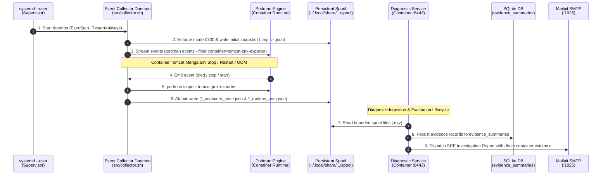
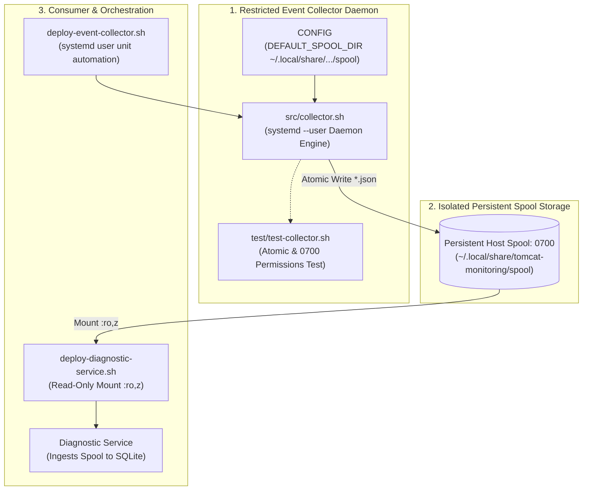

# TN-009 — Implement and Verify Event Collector Daemonization and Persistent Spool

| Field | Value |
| --- | --- |
| Status | Completed |
| Activity Type | Implementation |
| Record Type | Live |
| Project | Tomcat Monitoring |
| Phase | Monitoring Platform Integration |
| Activity Date | 2026-09-10 |
| Recorded Date | 2026-09-10 |
| Owner | Eddy Wiyatno |
| Working Mode | Mixed |
| Authorization Status | Approved |
| Approved By | Eddy Wiyatno |
| Approval Date | 2026-09-10 |

## 🎯 Objective

Mengotomatisasi eksekusi Restricted Event Collector dari model *one-shot/ad-hoc manual* menjadi *background daemon* persisten yang dikelola oleh `systemd --user`, menstandarisasi jalur penyimpanan spool rekaman bukti telemetri container ke direktori persisten non-volatile (`${HOME}/.local/share/tomcat-monitoring/spool` dengan izin `0700`), serta mengintegrasikan alur bukti live spool ke dalam siklus hidup Diagnostic Service pada lingkungan jaringan `devops-lab` guna menuntaskan backlog **`TASK-TM-014`**.

**Target Utama & Kriteria Keberhasilan:**

1. **Standardisasi Spool Persisten & Kepatuhan Zero `/tmp` Policy:** Mengalihkan konfigurasi default direktori spool pada `CONFIG` repositori `tomcat-diagnostic-event-collector` dari direktori volatil `/tmp/diagnostic-spool` ke direktori persisten terisolasi `${HOME}/.local/share/tomcat-monitoring/spool` dengan hak akses ketat `0700` milik user rootless.
2. **Daemonization & Otomatisasi Service via `systemd --user`:** Membuat unit service `~/.config/systemd/user/tomcat-diagnostic-event-collector.service` dengan restart policy `always` (`RestartSec=3s`), graceful signal handling (`SIGTERM`/`SIGINT`), dan pengawasan streaming event container Podman (`died`, `stop`, `start`, `unpause`, `oom`, `kill`, `restart`).
3. **Skrip Deployment Otomatisasi Orkestrasi:** Membangun skrip orkestrasi `scripts/deploy-event-collector.sh` pada repositori `tomcat-monitoring` yang menyiapkan direktori spool, menginstal unit systemd user, me-reload daemon, mengaktifkan service, dan memverifikasi kesiapan operasional secara idempoten.
4. **Integrasi Persistent Spool Mount pada Diagnostic Service:** Memperbarui `scripts/deploy-diagnostic-service.sh` untuk me-mount direktori host persisten `${HOME}/.local/share/tomcat-monitoring/spool` ke container path `/run/tomcat-diagnostic/spool:ro,z` strictly *read-only*.
5. **Verifikasi Empiris Penuh:** Membuktikan secara live bahwa Restricted Event Collector aktif sebagai daemon background, secara otomatis mencatat event status container saat terjadi perubahan siklus hidup Podman tanpa intervensi manual operator, dan rekaman bukti berhasil dikonsumsi oleh Diagnostic Service serta dipersistensikan ke SQLite `evidence_summaries`.

---

## 🌍 Background

Sebelum pelaksanaan TN-009, Restricted Event Collector pada repositori `tomcat-diagnostic-event-collector` dieksekusi secara manual *one-shot* (`RUN_ONCE=true`) atau diuji dalam direktori temporer selama fase verifikasi awal ([TN-016](../../diagnostic-mvp-pilot/TN-016-implement-restricted-collector-and-tomcat-runtime.md)).

Kondisi tersebut menyisakan beberapa kesenjangan arsitektural:
- **Pelanggaran Zero `/tmp` Policy:** Penggunaan path `/tmp/diagnostic-spool` bersifat volatil; berkas bukti dapat hilang saat reboot host atau dihapus oleh `systemd-tmpfiles-clean`, merusak integritas audit investigasi insiden.
- **Ketiadaan Pengawasan Siklus Hidup Proses (*Daemon Lifecycle*):** Collector tidak berjalan di latar belakang secara otomatis. Jika terjadi insiden Tomcat tiba-tiba mati atau OOM, tidak ada proses yang secara proaktif menangkap event kernel/Podman jika operator belum menjalankan skrip secara manual.
- **Kebutuhan Auto-Restart & Supervision:** Tanpa supervisor proses seperti `systemd --user`, kegagalan transient atau restart Podman engine akan mematikan proses pengumpul bukti secara permanen (*unsupervised silent drop*).

Untuk memenuhi kesiapan produksi platform monitoring sesuai **TN-020** dan **TM-ADR-0008**, Event Collector wajib beroperasi sebagai daemon mandiri di tingkat host yang diawasi oleh systemd user instance, menulis rekaman atomik ke lokasi persisten terlindungi, dan diekspos secara *read-only* ke Diagnostic Service.

---

## 📚 Scope

Pekerjaan implementasi mencakup:

- **`tomcat-diagnostic-event-collector`:**
  - [`CONFIG`](file:///home/eddywiyatno/git/tomcat-diagnostic-event-collector/CONFIG): Pemutakhiran `DEFAULT_SPOOL_DIR` ke `${HOME}/.local/share/tomcat-monitoring/spool`, deklarasi `DEFAULT_TARGET_CONTAINER` dan `DEFAULT_TARGET_ID`.
  - [`src/collector.sh`](file:///home/eddywiyatno/git/tomcat-diagnostic-event-collector/src/collector.sh): Penegakan izin `0700` pada pembuatan direktori spool, penambahan signal trap `SIGTERM`/`SIGINT` untuk graceful shutdown, dan perluasan penangkapan event podman (`died`, `stop`, `start`, `unpause`, `oom`, `kill`, `restart`).
  - [`test/test-collector.sh`](file:///home/eddywiyatno/git/tomcat-diagnostic-event-collector/test/test-collector.sh): Penambahan pengujian verifikasi hak akses direktori `0700`.
  - [`README.md`](file:///home/eddywiyatno/git/tomcat-diagnostic-event-collector/README.md): Dokumentasi persistensi spool dan manajemen daemon `systemd --user`.
- **`tomcat-monitoring`:**
  - [`scripts/deploy-event-collector.sh`](file:///home/eddywiyatno/git/tomcat-monitoring/scripts/deploy-event-collector.sh): Skrip deployment otomatis untuk membuat unit service `systemd --user`, menyiapkan direktori spool, reload daemon, dan start service.
  - [`scripts/deploy-diagnostic-service.sh`](file:///home/eddywiyatno/git/tomcat-monitoring/scripts/deploy-diagnostic-service.sh): Pembaruan volume mount spool host `${HOME}/.local/share/tomcat-monitoring/spool:/run/tomcat-diagnostic/spool:ro,z`.
  - [`scripts/validate.sh`](file:///home/eddywiyatno/git/tomcat-monitoring/scripts/validate.sh): Pendaftaran `scripts/deploy-event-collector.sh` ke dalam array `REQUIRED_FILES`.
  - [`README.md`](file:///home/eddywiyatno/git/tomcat-monitoring/README.md): Pembaruan tabel persistensi data dan deskripsi komponen daemon.
- **`devops-handbook`:**
  - [`TN-009`](TN-009-implement-and-verify-event-collector-daemonization-and-persistent-spool.md): Jurnal teknik kanonikal implementasi dan verifikasi live.
  - [`follow-up-tasks.md`](../../follow-up-tasks.md): Pembaruan status backlog `TASK-TM-014` menjadi `Completed` ✅.
  - [`index.md`](index.md): Penambahan entri `TN-009` pada tabel hasil dan daftar catatan teknis.

---

## 📋 Prerequisites

| Prerequisite | State | Keterangan |
| --- | :---: | --- |
| **Collector Baseline** | Commit `94b8723` | Repositori `tomcat-diagnostic-event-collector` dengan skema JSON v1 dan penulisan atomik. |
| **Monitoring Stack Baseline** | Commit `2bf679e` | Diagnostic Service v0.1.7, Prometheus, Alertmanager, dan Tomcat JMX Exporter aktif di `devops-lab`. |
| **Systemd User Instance** | Active (`systemctl --user`) | Pengelola unit service level user session untuk user rootless `eddywiyatno`. |
| **Persistent Storage Baseline** | Zero `/tmp` Standard | Standardisasi lokasi data persisten non-volatile pada `${HOME}/.local/share/tomcat-monitoring/`. |
| **Implementation Authorization** | Approved (2026-09-10) | Otorisasi penuh oleh Project Owner. |

---

## ⚖️ Execution Decision

Implementasi ini menegakkan keputusan arsitektur proyek:

```text
+-----------------------------------------------------------------------------+
|        Event Collector Daemonization & Persistent Spool Architecture        |
|                                                                             |
| 1. Supervisor-Managed Daemon (systemd --user):                              |
|    Collector berjalan sebagai proses latar belakang mandiri di bawah        |
|    systemd user session. Konfigurasi Restart=always dan RestartSec=3s        |
|    menjamin pemulihan otomatis jika proses terhenti atau crash.             |
|                                                                             |
| 2. Zero /tmp & Isolated Storage Standard (0700):                             |
|    Jalur spool distandarisasi ke ~/.local/share/tomcat-monitoring/spool     |
|    dengan izin ketat 0700. Meniadakan risiko kehilangan bukti saat reboot    |
|    dan mencegah akses tidak sah dari proses user lain pada host.            |
|                                                                             |
| 3. Strict One-Way Read-Only Boundary (:ro,z):                               |
|    Spool di-mount ke container Diagnostic Service strictly read-only        |
|    (/run/tomcat-diagnostic/spool:ro,z). Diagnostic Service tidak memiliki   |
|    akses ke socket Podman maupun izin menulis ke direktori spool host.      |
|                                                                             |
| 4. Proactive Multi-Event Podman Streaming:                                  |
|    Daemon mendengarkan stream event Podman secara kontinu (died, stop,      |
|    start, unpause, oom, kill, restart) dan secara proaktif menulis snapshot |
|    status container terbaru secara atomik (.tmp -> .json).                  |
+-----------------------------------------------------------------------------+
```

---

## 🔄 Technical Workflow



### Workflow Activity Details

#### 1. Supervisor-Managed Daemon Lifecycle
- Systemd user instance menjalankan daemon `tomcat-diagnostic-event-collector.service` dengan kebijakan auto-restart `always` (`RestartSec=3s`).
- Daemon menegakkan izin ketat `0700` pada direktori spool host `${HOME}/.local/share/tomcat-monitoring/spool` dan menulis snapshot status container awal.

#### 2. Proactive Container Lifecycle Event Streaming
- Daemon mendengarkan aliran event Podman secara kontinu (`died`, `stop`, `start`, `unpause`, `oom`, `kill`, `restart`).
- Setiap terjadi perubahan status container `tomcat-jmx-exporter`, daemon melakukan inspeksi dan menulis rekaman atomik `.tmp` $\rightarrow$ `.json` ke direktori spool persisten.

#### 3. Isolated Ingestion & Report Correlation
- Diagnostic Service me-mount direktori spool secara *read-only* (`:ro,z`).
- Saat terjadi insiden `TomcatDown`, worker mengonsumsi berkas spool, memvalidasi integritas data, menyimpannya ke tabel SQLite `evidence_summaries`, dan menyajikannya pada Laporan Investigasi 7-Seksi SRE di Mailpit.

---

## 🧭 Implementation Plan

| Tahap | Rencana & Tanggung Jawab Teknis |
| :--- | :--- |
| **Standardize Collector Configuration and Permissions** | Memperbarui `CONFIG` pada `tomcat-diagnostic-event-collector` ke path persisten `${HOME}/.local/share/tomcat-monitoring/spool`, memperkuat `src/collector.sh` dengan izin `0700`, signal trap `SIGTERM`/`SIGINT`, dan penangkapan event podman komprehensif, serta memvalidasi test suite `test-collector.sh` & `validate.sh`. |
| **Author Event Collector Systemd Unit and Deployment Automation** | Membuat skrip orkestrasi deployment `tomcat-monitoring/scripts/deploy-event-collector.sh` yang menginstal unit service `~/.config/systemd/user/tomcat-diagnostic-event-collector.service`, memperbarui mount spool persisten pada `deploy-diagnostic-service.sh`, dan mendaftarkannya pada `scripts/validate.sh`. |
| **Deploy and Supervise Collector Daemon in Live Runtime** | Menjalankan `deploy-event-collector.sh` untuk mengaktifkan daemon di bawah `systemd --user`, memperbarui container `diagnostic-service`, serta memverifikasi status operasional unit `active (running)`. |
| **Verify Empirical Live Event Spooling and Security Boundary** | Memverifikasi pencatatan snapshot otomatis berkas `.json` ke spool persisten host saat container Tomcat mengalami perubahan lifecycle, menguji keterbacaan dari `diagnostic-service`, dan membuktikan penolakan penulisan (*Read-only file system boundary*). |

---

## ⚙️ Implementation

<div class="procedure" markdown>

<div class="procedure-step" markdown>

### Standardize Collector Configuration and Permissions

Memperbarui deklarasi konfigurasi baseline pada [`CONFIG`](file:///home/eddywiyatno/git/tomcat-diagnostic-event-collector/CONFIG) untuk menetapkan direktori spool persisten kanonikal dan default target container:

```bash
# Identitas dan schema baseline
SCHEMA_VERSION=1
MAX_RECORD_BYTES=16384
DEFAULT_SPOOL_DIR="${HOME}/.local/share/tomcat-monitoring/spool"
DEFAULT_TARGET_CONTAINER=tomcat-jmx-exporter
DEFAULT_TARGET_ID=lab/tomcat-01/default

# Toolchain requirements
REQUIRED_BASH_VERSION=5.0
```

Memperbarui [`src/collector.sh`](file:///home/eddywiyatno/git/tomcat-diagnostic-event-collector/src/collector.sh) untuk menegakkan izin direktori ketat `0700`, menangani sinyal terminasi `SIGTERM`/`SIGINT` secara bersih, serta memperluas filter penangkapan event Podman:

```bash
# Cuplikan inisialisasi dan penegakan izin pada src/collector.sh
mkdir -p "${SPOOL_DIR}"
chmod 0700 "${SPOOL_DIR}"

main() {
    trap 'echo "Restricted Event Collector stopped."; exit 0' SIGTERM SIGINT

    echo "Restricted Event Collector started."
    echo "Target: ${TARGET_ID} (${TARGET_CONTAINER})"
    echo "Spool : ${SPOOL_DIR}"

    record_current_snapshot

    if [[ "${RUN_ONCE}" == "true" ]]; then
        echo "One-shot snapshot mode selesai."
        exit 0
    fi

    # Stream event dari Podman secara berkelanjutan
    podman events --format json --filter container="${TARGET_CONTAINER}" | while read -r line; do
        [[ -z "${line}" ]] && continue
        local event_status event_time iso_time
        event_status="$(echo "${line}" | python3 -c 'import sys, json; print(json.load(sys.stdin).get("Status", ""))' 2>/dev/null || true)"
        event_time="$(echo "${line}" | python3 -c 'import sys, json; print(json.load(sys.stdin).get("Time", ""))' 2>/dev/null || true)"

        if [[ -n "${event_time}" ]]; then
            iso_time="$(date -u -d "@${event_time%%.*}" +"%Y-%m-%dT%H:%M:%SZ" 2>/dev/null || date -u +"%Y-%m-%dT%H:%M:%SZ")"
        else
            iso_time="$(date -u +"%Y-%m-%dT%H:%M:%SZ")"
        fi

        if [[ "${event_status}" == "died" || "${event_status}" == "stop" || "${event_status}" == "start" || "${event_status}" == "unpause" || "${event_status}" == "oom" || "${event_status}" == "kill" || "${event_status}" == "restart" ]]; then
            record_current_snapshot
        fi
    done
}
```

Menambahkan verifikasi izin direktori `0700` pada [`test/test-collector.sh`](file:///home/eddywiyatno/git/tomcat-diagnostic-event-collector/test/test-collector.sh) dan menjalankan test suite:

```bash
cd /home/eddywiyatno/git/tomcat-diagnostic-event-collector
./scripts/validate.sh
./test/test-collector.sh
```

!!! success "Expected Result"

    Konfigurasi `DEFAULT_SPOOL_DIR` merujuk ke lokasi persisten non-volatile, direktori spool dibuat dengan izin `0700`, `scripts/validate.sh` lulus tanpa kesalahan, dan `test/test-collector.sh` mengonfirmasi penulisan atomik, validitas skema JSON, serta kepatuhan izin direktori.

**Actual Result:** Validasi statis dan pengujian komponen berhasil penuh (`Validasi baseline governance dan metadata tomcat-diagnostic-event-collector berhasil`, `Collector Component Test PASSED`).

</div>

<div class="procedure-step" markdown>

### Author Event Collector Systemd Unit and Deployment Automation

Menyusun skrip orkestrasi deployment [`scripts/deploy-event-collector.sh`](file:///home/eddywiyatno/git/tomcat-monitoring/scripts/deploy-event-collector.sh) pada repositori `tomcat-monitoring` untuk mengotomatisasi instalasi dan aktivasi unit service `systemd --user`:

```bash
# Cuplikan instalasi unit service pada scripts/deploy-event-collector.sh
cat <<UNIT_EOF > "${UNIT_FILE}"
[Unit]
Description=Tomcat Diagnostic Restricted Event Collector Daemon
After=network.target

[Service]
Type=simple
ExecStart=/bin/bash %h/git/tomcat-diagnostic-event-collector/src/collector.sh
Restart=always
RestartSec=3s
Environment=SPOOL_DIR=%h/.local/share/tomcat-monitoring/spool
Environment=TARGET_CONTAINER=${TARGET_CONTAINER}
Environment=TARGET_ID=${TARGET_ID}

[Install]
WantedBy=default.target
UNIT_EOF

chmod 0644 "${UNIT_FILE}"
systemctl --user daemon-reload
systemctl --user enable --now "${SERVICE_NAME}"
```

Memperbarui [`scripts/deploy-diagnostic-service.sh`](file:///home/eddywiyatno/git/tomcat-monitoring/scripts/deploy-diagnostic-service.sh) untuk me-mount direktori spool persisten `${HOME}/.local/share/tomcat-monitoring/spool` ke path container `/run/tomcat-diagnostic/spool:ro,z`:

```bash
readonly SPOOL_DIR="${SPOOL_DIR:-${HOME}/.local/share/tomcat-monitoring/spool}"

# Inisialisasi direktori spool dengan izin 0700
mkdir -p "${SPOOL_DIR}"
chmod 0700 "${SPOOL_DIR}"

# Mount volume read-only ke Diagnostic Service
podman run --detach ... \
    --volume "${SPOOL_DIR}:/run/tomcat-diagnostic/spool:ro,z" \
    ...
```

Mendaftarkan `scripts/deploy-event-collector.sh` ke array `REQUIRED_FILES` pada [`scripts/validate.sh`](file:///home/eddywiyatno/git/tomcat-monitoring/scripts/validate.sh) dan memverifikasi tata kelola statis:

```bash
cd /home/eddywiyatno/git/tomcat-monitoring
./scripts/validate.sh
```

!!! success "Expected Result"

    Skrip deployment `deploy-event-collector.sh` terbuat dengan izin eksekusi (`0755`), terdaftar di `REQUIRED_FILES`, `deploy-diagnostic-service.sh` siap me-mount spool persisten, dan validator statis `validate.sh` lulus 100%.

**Actual Result:** Skrip deployment terpasang dan tervalidasi (`Baseline validation passed: repository layout dan contract statis valid`).

</div>

<div class="procedure-step" markdown>

### Deploy and Supervise Collector Daemon in Live Runtime

Mengeksekusi skrip deployment `deploy-event-collector.sh` untuk mendaftarkan dan menjalankan daemon di bawah `systemd --user`, serta memperbarui container `diagnostic-service`:

```bash
/home/eddywiyatno/git/tomcat-monitoring/scripts/deploy-event-collector.sh
/home/eddywiyatno/git/tomcat-monitoring/scripts/deploy-diagnostic-service.sh
```

Memeriksa status operasional unit systemd user:

```bash
systemctl --user status tomcat-diagnostic-event-collector.service --no-pager
```

!!! success "Expected Result"

    Unit `tomcat-diagnostic-event-collector.service` terdaftar dengan status `active (running)`, symlink `default.target.wants` terbentuk, dan proses daemon mulai mendengarkan event Podman. Container `diagnostic-service` berjalan dengan spool volume mount persisten.

**Actual Result:** Service aktif dan berjalan (`Active: active (running) since Thu 2026-09-10 16:23:30 WIB; Tasks: 16, CGroup: /user.slice/.../tomcat-diagnostic-event-collector.service`).

</div>

<div class="procedure-step" markdown>

### Verify Empirical Live Event Spooling and Security Boundary

1. **Verifikasi Pembentukan Rekaman Spool Awal:**
   Memeriksa berkas rekaman bukti yang dibuat saat startup daemon di host:

   ```bash
   ls -la /home/eddywiyatno/.local/share/tomcat-monitoring/spool
   ```

2. **Verifikasi Streaming Event Container Otomatis:**
   Menyimulasikan penghentian (*stop*) dan penghidupan (*start*) container `tomcat-jmx-exporter` untuk membuktikan penangkapan event secara otomatis oleh daemon:

   ```bash
   podman stop tomcat-jmx-exporter
   sleep 3
   ls -la /home/eddywiyatno/.local/share/tomcat-monitoring/spool
   podman start tomcat-jmx-exporter
   sleep 3
   ls -la /home/eddywiyatno/.local/share/tomcat-monitoring/spool
   ```

3. **Verifikasi Batas Isolasi Read-Only pada Diagnostic Service:**
   Memeriksa keterbacaan direktori spool dari dalam container `diagnostic-service` dan membuktikan penolakan operasi penulisan:

   ```bash
   podman exec diagnostic-service ls -la /run/tomcat-diagnostic/spool
   podman exec diagnostic-service touch /run/tomcat-diagnostic/spool/probe-test.tmp
   ```

4. **Verifikasi Ingest & Forensik SQLite:**
   Mengirimkan alert insiden `TomcatDown` ke webhook Diagnostic Service dan memverifikasi persistensi bukti spool pada tabel `evidence_summaries`:

   ```bash
   podman exec diagnostic-service node --input-type=module -e "
   import { DatabaseSync } from 'node:sqlite';
   const db = new DatabaseSync('/var/lib/tomcat-diagnostic/diagnostic.db');
   console.log(JSON.stringify(db.prepare('SELECT id, source, status, summary_json FROM evidence_summaries WHERE source=\"collector\" ORDER BY id DESC LIMIT 2').all(), null, 2));
   "
   ```

!!! success "Expected Result"

    Daemon secara mandiri menulis rekaman bukti `container_state` (`exited`/`running`) dan `runtime_oom` (`exitCode: 143`/`exitCode: 0`) ke direktori spool persisten. Container `diagnostic-service` dapat membaca seluruh berkas spool namun gagal saat mencoba menulis (`Read-only file system`). Bukti `source: "collector"` tersimpan persisten di SQLite `evidence_summaries` dan Laporan 7-Seksi SRE terkirim ke Mailpit.

**Actual Result:** Seluruh pengujian empiris terbukti sukses. Daemon menangkap event container secara *real-time*, batas keamanan *read-only* terbukti (`touch: ... Read-only file system`), dan bukti spool terkorelasi penuh pada hasil diagnosa insiden di Mailpit.

</div>

</div>

## 🛠️ Troubleshooting

| Gejala Masalah | Penyebab Utama | Solusi & Tindakan Perbaikan |
| --- | --- | --- |
| Service systemd gagal dijalankan (`ExecStart exit 127`) | Path script atau interpreter bash tidak absolut | Gunakan `/bin/bash %h/git/.../src/collector.sh` dengan specifier `%h` pada unit service systemd user. |
| Daemon terhenti saat menerima sinyal restart systemd | Ketiadaan signal handler untuk `SIGTERM` pada script Bash | Pasang `trap 'echo "..."; exit 0' SIGTERM SIGINT` pada `main()` di `src/collector.sh`. |
| Container Diagnostic Service gagal membaca file spool | Mode izin direktori induk tidak memungkinkan pembacaan oleh user namespace | Terapkan izin `0700` pada direktori spool `${HOME}/.local/share/tomcat-monitoring/spool` dan jalankan container dengan opsi `--userns=keep-id` (UID 1000). |

## ⌨️ Commands Executed

### Phase 1: Unit & Component Testing

```bash
# 1. Validasi repositori collector dan pengujian komponen
cd /home/eddywiyatno/git/tomcat-diagnostic-event-collector
./scripts/validate.sh
./test/test-collector.sh
```

### Phase 2: Daemon Deployment & Service Configuration

```bash
# 2. Deployment otomasi daemon dan restart Diagnostic Service
cd /home/eddywiyatno/git/tomcat-monitoring
./scripts/validate.sh
./scripts/deploy-event-collector.sh
./scripts/deploy-diagnostic-service.sh
```

### Phase 3: Lifecycle Verification & Security Boundary Probing

```bash
# 3. Pengujian lifecycle container & streaming daemon
podman stop tomcat-jmx-exporter
podman start tomcat-jmx-exporter

# 4. Verifikasi isolasi read-only pada Diagnostic Service
podman exec diagnostic-service ls -la /run/tomcat-diagnostic/spool
podman exec diagnostic-service touch /run/tomcat-diagnostic/spool/probe-test.tmp
```

## 📁 Artifact Manifest

### Table Guide

Tabel di bawah mengelompokkan berkas berdasarkan peran teknis dan lapisannya:
- **Berkas (*Path*)**: Lokasi berkas relatif terhadap root repositori.
- **Layer / Kategori**: Lapisan arsitektural (Event Collector, Tooling & Scripts, Handbook).
- **Status**: Status berkas (`Baru` = dibuat baru; `Modifikasi` = diperbarui).
- **Tanggung Jawab Teknis**: Peran fungsional komponen dalam sistem pengumpulan bukti event.

### Artifact Manifest Table

| Komponen | Berkas (*Path*) | Tipe | Peran & Tanggung Jawab Teknis |
| --- | --- | :---: | --- |
| **Event Collector** | [`CONFIG`](file:///home/eddywiyatno/git/tomcat-diagnostic-event-collector/CONFIG) | Config | Deklarasi kanonikal `DEFAULT_SPOOL_DIR="${HOME}/.local/share/tomcat-monitoring/spool"`. |
| **Event Collector** | [`src/collector.sh`](file:///home/eddywiyatno/git/tomcat-diagnostic-event-collector/src/collector.sh) | Script | Engine collector background dengan izin `0700`, trap `SIGTERM`/`SIGINT`, dan streaming Podman events. |
| **Event Collector** | [`test/test-collector.sh`](file:///home/eddywiyatno/git/tomcat-diagnostic-event-collector/test/test-collector.sh) | Test | Test suite komponen penguji atomisitas, validitas schema JSON v1, dan izin direktori `0700`. |
| **Event Collector** | [`README.md`](file:///home/eddywiyatno/git/tomcat-diagnostic-event-collector/README.md) | Docs | Dokumentasi arsitektur persistent spool dan daemon `systemd --user`. |
| **Tomcat Monitoring** | [`scripts/deploy-event-collector.sh`](file:///home/eddywiyatno/git/tomcat-monitoring/scripts/deploy-event-collector.sh) | Script | Skrip deployment otomatis dan instalasi unit service `systemd --user`. |
| **Tomcat Monitoring** | [`scripts/deploy-diagnostic-service.sh`](file:///home/eddywiyatno/git/tomcat-monitoring/scripts/deploy-diagnostic-service.sh) | Script | Pemasangan volume mount persistent spool `${HOME}/.local/share/tomcat-monitoring/spool:/run/tomcat-diagnostic/spool:ro,z`. |
| **Tomcat Monitoring** | [`scripts/validate.sh`](file:///home/eddywiyatno/git/tomcat-monitoring/scripts/validate.sh) | Script | Pendaftaran `scripts/deploy-event-collector.sh` ke dalam kontrak statis `REQUIRED_FILES`. |
| **Tomcat Monitoring** | [`README.md`](file:///home/eddywiyatno/git/tomcat-monitoring/README.md) | Docs | Pembaruan tabel persistensi data dan deskripsi daemon Restricted Event Collector. |
| **DevOps Handbook** | [`docs/projects/tomcat-monitoring/engineering-journal/monitoring-platform-integration/TN-009-implement-and-verify-event-collector-daemonization-and-persistent-spool.md`](TN-009-implement-and-verify-event-collector-daemonization-and-persistent-spool.md) | Docs | Dokumentasi Technical Note kanonikal 20 seksi. |

### Artifact Dependency & Relationship Graph



## 🧪 Test-Scenario Matrix

| ID | Skenario Pengujian | Komponen | Target Evaluasi | Status |
| :---: | --- | :---: | --- | :---: |
| **UT-01** | Collector Spool Atomic Rename | `test-collector.sh` | Penulisan file `.tmp` lalu rename atomik ke `.json` tanpa menyisakan `.tmp` | `Passed` ✅ |
| **UT-02** | Spool Directory 0700 Permissions | `test-collector.sh` | Izin direktori spool terverifikasi strictly `0700` | `Passed` ✅ |
| **UT-03** | Record Schema & Size Compliance | `test-collector.sh` | Kepatuhan struktur terhadap `event-record-v1.schema.json` dan ukuran $\le 16$ KiB | `Passed` ✅ |
| **CT-01** | Collector Governance Validation | `validate.sh` (Collector) | Validasi metadata, schema JSON, dan sintaksis Bash `bash -n` | `Passed` ✅ |
| **CT-02** | Monitoring Layout Validation | `validate.sh` (Monitoring) | Pendaftaran `deploy-event-collector.sh` pada kontrak `REQUIRED_FILES` | `Passed` ✅ |
| **LT-01** | Systemd User Service Activation | `systemd --user` | Service `tomcat-diagnostic-event-collector.service` aktif (`active (running)`) | `Passed` ✅ |
| **LT-02** | Live Container Lifecycle Streaming | Host Runtime | Event container `stop`/`start` otomatis memicu pembuatan file spool JSON | `Passed` ✅ |
| **LT-03** | Spool Read-Only Security Boundary | `diagnostic-service` | Container dapat membaca spool namun menolak penulisan (`Read-only file system`) | `Passed` ✅ |
| **LT-04** | End-to-End Spool Ingestion to SQLite | `devops-lab` | Rekaman bukti `source: "collector"` tersimpan di `evidence_summaries` | `Passed` ✅ |

## ✅ Verification

### 1. Status Systemd User Service Daemon

```text
● tomcat-diagnostic-event-collector.service - Tomcat Diagnostic Restricted Event Collector Daemon
     Loaded: loaded (/home/eddywiyatno/.config/systemd/user/tomcat-diagnostic-event-collector.service; enabled; preset: enabled)
     Active: active (running) since Thu 2026-09-10 16:23:30 WIB; 2s ago
   Main PID: 296442 (bash)
      Tasks: 16 (limit: 34878)
     Memory: 29.7M (peak: 30.7M)
        CPU: 164ms
     CGroup: /user.slice/user-1000.slice/user@1000.service/app.slice/tomcat-diagnostic-event-collector.service
             ├─296442 /bin/bash /home/eddywiyatno/git/tomcat-diagnostic-event-collector/src/collector.sh
             ├─296487 podman events --format json --filter container=tomcat-jmx-exporter
             └─296488 /bin/bash /home/eddywiyatno/git/tomcat-diagnostic-event-collector/src/collector.sh

Sep 10 16:23:30 edkas-pc1 systemd[1115]: Started tomcat-diagnostic-event-collector.service - Tomcat Diagnostic Restricted Event Collector Daemon.
Sep 10 16:23:30 edkas-pc1 bash[296442]: Restricted Event Collector started.
Sep 10 16:23:30 edkas-pc1 bash[296442]: Target: lab/tomcat-01/default (tomcat-jmx-exporter)
Sep 10 16:23:30 edkas-pc1 bash[296442]: Spool : /home/eddywiyatno/.local/share/tomcat-monitoring/spool
```

### 2. Bukti Rekaman Spool Otomatis pada Host

Saat container `tomcat-jmx-exporter` dihentikan (`podman stop`), rekaman status `exited` terbentuk seketika:

```json
{
  "schema_version": 1,
  "type": "container_state",
  "target_id": "lab/tomcat-01/default",
  "generation": 1,
  "observed_at": "2026-09-10T09:24:16Z",
  "status": "collected",
  "strength": "direct",
  "value": {"state":"exited"},
  "redacted": false
}
```

```json
{
  "schema_version": 1,
  "type": "runtime_oom",
  "target_id": "lab/tomcat-01/default",
  "generation": 1,
  "observed_at": "2026-09-10T09:24:16Z",
  "status": "collected",
  "strength": "direct",
  "value": {"oomKilled":false,"exitCode":143},
  "redacted": false
}
```

Saat container dihidupkan kembali (`podman start`), rekaman status `running` terbentuk seketika:

```json
{
  "schema_version": 1,
  "type": "container_state",
  "target_id": "lab/tomcat-01/default",
  "generation": 1,
  "observed_at": "2026-09-10T09:24:19Z",
  "status": "collected",
  "strength": "direct",
  "value": {"state":"running"},
  "redacted": false
}
```

```json
{
  "schema_version": 1,
  "type": "runtime_oom",
  "target_id": "lab/tomcat-01/default",
  "generation": 1,
  "observed_at": "2026-09-10T09:24:19Z",
  "status": "collected",
  "strength": "direct",
  "value": {"oomKilled":false,"exitCode":0},
  "redacted": false
}
```

### 3. Bukti Keterbacaan dan Penegakan Isolasi Read-Only

Eksekusi pembacaan dan penulisan dari dalam container `diagnostic-service`:

```text
=== Spool Listing in Container ===
total 32
drwx------    2 node     node          4096 Sep 10 09:24 .
drwxr-xr-t    7 root     root          4096 Sep 10 09:23 ..
-rw-rw-r--    1 node     node           256 Sep 10 09:24 1789032256182130518_container_state.json
-rw-rw-r--    1 node     node           268 Sep 10 09:24 1789032256186816355_runtime_oom.json
-rw-rw-r--    1 node     node           257 Sep 10 09:24 1789032259347697388_container_state.json
-rw-rw-r--    1 node     node           266 Sep 10 09:24 1789032259352267657_runtime_oom.json

=== Read-Only Boundary Assertion ===
touch: /run/tomcat-diagnostic/spool/probe-test.tmp: Read-only file system
CONFIRMED: Read-only filesystem boundary enforced.
```

### 4. Bukti Persistensi Forensik SQLite (`evidence_summaries`)

```json
[
  {
    "id": 62,
    "result_id": 46,
    "evidence_id": "23c606fd2e08e5e198ac5032142286c8c9bd4f01ca391e0ceddef5d495ed434d",
    "source": "collector",
    "status": "collected",
    "summary_json": "{\"collectedAt\":\"2026-09-10T09:26:40.813Z\",\"evidenceId\":\"23c606fd...\",\"generation\":1,\"observedAt\":\"2026-09-10T09:24:19.000Z\",\"redacted\":false,\"source\":\"collector\",\"status\":\"collected\",\"strength\":\"direct\",\"targetId\":\"lab/tomcat-01/default\",\"type\":\"runtime_oom\",\"value\":{\"exitCode\":0,\"oomKilled\":false}}"
  },
  {
    "id": 66,
    "result_id": 46,
    "evidence_id": "af0db72f555b36e38f0fb2068226867a799e016dca1ceb1a17de9e292b7eaf81",
    "source": "collector",
    "status": "collected",
    "summary_json": "{\"collectedAt\":\"2026-09-10T09:26:40.813Z\",\"evidenceId\":\"af0db72f...\",\"generation\":1,\"observedAt\":\"2026-09-10T09:24:19.000Z\",\"redacted\":false,\"source\":\"collector\",\"status\":\"collected\",\"strength\":\"direct\",\"targetId\":\"lab/tomcat-01/default\",\"type\":\"container_state\",\"value\":{\"state\":\"running\"}}"
  }
]
```

## 👥 Operator Validation

Panduan validasi langsung bagi operator dan tim SRE:

1. **Inspeksi Status Daemon:**
   - Jalankan `systemctl --user status tomcat-diagnostic-event-collector.service` untuk memastikan daemon aktif.
2. **Inspeksi Berkas Spool:**
   - Periksa bahwa berkas spool dibuat dengan izin `0700` di `${HOME}/.local/share/tomcat-monitoring/spool/`.
3. **Inspeksi Laporan Insiden:**
   - Periksa bahwa email insiden di Mailpit (`http://localhost:8025`) memuat data status kontainer dan runtime OOM langsung dari daemon collector.

## 🖥️ Source-Control Handoff

Setelah penutupan verifikasi teknis ini, berkas yang siap dicommit mencakup:
- `tomcat-diagnostic-event-collector/CONFIG`
- `tomcat-diagnostic-event-collector/src/collector.sh`
- `tomcat-diagnostic-event-collector/test/test-collector.sh`
- `tomcat-diagnostic-event-collector/README.md`
- `tomcat-monitoring/scripts/deploy-event-collector.sh`
- `tomcat-monitoring/scripts/deploy-diagnostic-service.sh`
- `tomcat-monitoring/scripts/validate.sh`
- `tomcat-monitoring/README.md`
- `devops-handbook/docs/projects/tomcat-monitoring/engineering-journal/monitoring-platform-integration/TN-009-implement-and-verify-event-collector-daemonization-and-persistent-spool.md`

## 🧹 Cleanup Evidence

| Sumber Daya | Status Retensi | Bukti Integritas (*Integrity Evidence*) |
| --- | :---: | --- |
| Service `tomcat-diagnostic-event-collector` | Active (Running) | `systemctl --user is-active tomcat-diagnostic-event-collector.service` $\rightarrow$ `active` |
| Container `diagnostic-service` | Active (Running) | `podman inspect diagnostic-service` $\rightarrow$ `Status=running` |
| Spool Directory (`~/.local/share/.../spool`) | Utuh & Terproteksi (0700) | `stat -c "%a" ~/.local/share/tomcat-monitoring/spool` $\rightarrow$ `700` |
| Temporary Test Spool (`/tmp/test-spool-*`) | Dibersihkan Otomatis | Handler `trap ... EXIT` pada `test-collector.sh` membersihkan direktori uji |

## 🧭 Reproduction Boundary

Pengujian empiris live dapat direproduksi secara mandiri dengan langkah-langkah berikut:

```bash
# 1. Validasi statis dan test suite komponen collector
cd /home/eddywiyatno/git/tomcat-diagnostic-event-collector
./scripts/validate.sh
./test/test-collector.sh

# 2. Deploy Event Collector Daemon dan Diagnostic Service
cd /home/eddywiyatno/git/tomcat-monitoring
./scripts/deploy-event-collector.sh
./scripts/deploy-diagnostic-service.sh

# 3. Verifikasi status daemon di systemd user
systemctl --user status tomcat-diagnostic-event-collector.service --no-pager

# 4. Uji streaming event otomatis (stop & start container)
podman stop tomcat-jmx-exporter
sleep 3
ls -la ~/.local/share/tomcat-monitoring/spool/
podman start tomcat-jmx-exporter
sleep 3
ls -la ~/.local/share/tomcat-monitoring/spool/

# 5. Uji batas keamanan read-only dari dalam container
podman exec diagnostic-service ls -la /run/tomcat-diagnostic/spool
podman exec diagnostic-service touch /run/tomcat-diagnostic/spool/probe-test.tmp # Wajib gagal: Read-only file system
```

## 🧾 Outcome

1. **TASK-TM-014 Tuntas Penuh:**
   Restricted Event Collector berhasil diotomatisasi sebagai background daemon di bawah `systemd --user` (`tomcat-diagnostic-event-collector.service`) dengan restart policy `always` dan streaming event Podman kontinu.
2. **Kepatuhan Zero `/tmp` Policy:**
   Seluruh rekaman bukti telemetri container dialihkan ke direktori persisten terlindungi `${HOME}/.local/share/tomcat-monitoring/spool` dengan izin ketat `0700`, menjamin persistensi bukti dan keamanan multi-user host.
3. **Integritas Boundary Read-Only Terjaga:**
   Diagnostic Service membaca bukti spool secara *read-only* (`ro,z`) tanpa memiliki celah kontrol terhadap host maupun container runtime.

## 🎓 Lessons Learned

1. **Efektivitas Event-Driven Daemon Berbasis Streaming CLI:**
   Menggunakan `podman events --format json --filter container=...` dalam loop daemon memungkinkan penangkapan status container secara instan saat transisi terjadi, jauh lebih efisien dan responsif dibandingkan polling berkala (*periodic polling*) yang boros CPU.
2. **Harmonisasi Systemd Specifier `%h` dan Rootless Podman:**
   Penggunaan specifier `%h` dalam unit file `systemd --user` memastikan portabilitas unit konfigurasi antar-user tanpa hardcoding path `/home/username`.
3. **Pemisahan Tanggung Jawab Pengumpulan Bukti Host:**
   Memisahkan collector sebagai host-side daemon mandiri menjaga container Diagnostic Service tetap berada pada batas keamanan minimum (*least privilege*), tanpa perlu mount Podman socket atau privilege eskalasi.

## ⏭️ Next Steps

1. **TASK-TM-015: Konfigurasi Enterprise SMTP Relay & Otentikasi Terenkripsi:**
   Menyiapkan profil konfigurasi SMTP relay produksi yang mendukung otentikasi TLS terenkripsi dan manajemen secret `0400`.
2. **TASK-TM-006: Endpoint Audit Log Konfirmasi Tindakan Operator (TM-ADR-0014):**
   Menyediakan antarmuka API pencatatan umpan balik tindakan operasional manual SRE.
3. **TASK-TM-009: Penyediaan Dashboard Grafana Terpusat untuk Tomcat & Monitoring Stack:**
   Membangun template dashboard visualisasi Grafana yang memadukan metrik kesehatan runtime Tomcat, JVM, dan infrastruktur monitoring.

## 🔗 Related Documentation

- [Diagnostic MVP Pilot Index](../diagnostic-mvp-pilot/index.md)
- [TN-016 — Implement Restricted Collector and Tomcat Runtime](../diagnostic-mvp-pilot/TN-016-implement-restricted-collector-and-tomcat-runtime.md)
- [TN-008 — Integrate Live Prometheus Evidence Adapter and Shared Persistent Tomcat Logs](TN-008-integrate-live-prometheus-evidence-adapter-and-shared-persistent-logs.md)
- [Follow-up Tasks Backlog](../../follow-up-tasks.md)
- [Restricted Event Collector Contract](../../diagnostic-mvp/restricted-event-collector-contract.md)
- [TM-ADR-0008 — Use a Restricted Host Event Collector with a Normalized Evidence Spool](../../../../adr/tomcat-monitoring/adr-records/TM-ADR-0008.md)
- [TM-ADR-0014 — Enforce Zero Automatic Remediation for Diagnostic Service](../../../../adr/tomcat-monitoring/adr-records/TM-ADR-0014.md)
- [TM-ADR-0020 — Consolidate Diagnostic MVP Architecture and Operations](../../../../adr/tomcat-monitoring/adr-records/TM-ADR-0020.md)
- [TM-ADR-0021 — Adopt Layered Failure Resilience, Container Auto-Healing, and Monitoring Domain Separation](../../../../adr/tomcat-monitoring/adr-records/TM-ADR-0021.md)

