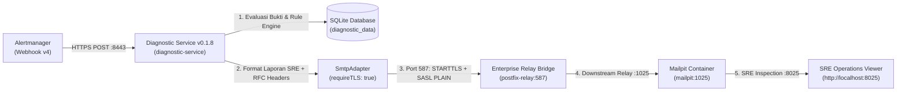

# TN-010 — Implement and Verify Enterprise SMTP Configuration and Headers

| Field | Value |
| --- | --- |
| Status | Completed |
| Activity Type | Implementation |
| Record Type | Live |
| Project | Tomcat Monitoring |
| Phase | Monitoring Platform Integration |
| Activity Date | 2026-09-10 |
| Recorded Date | 2026-09-10 |
| Owner | Eddy Wiyatno |
| Working Mode | Mixed |
| Authorization Status | Approved |
| Approved By | Eddy Wiyatno |
| Approval Date | 2026-09-10 |

## 🎯 Objective

Menuntaskan backlog **`TASK-TM-015` (Konfigurasi Enterprise SMTP Relay & Otentikasi Terenkripsi)** pada Tomcat Diagnostic Service dengan memperbarui skema konfigurasi aplikasi (`requireTLS`), menambahkan header email standar enterprise RFC (`Auto-Submitted`, `X-Priority`, `X-Incident-Target`, `X-Diagnostic-Rule`), mengisolasi kredensial SMTP melalui *mounted secret files* (`0400`/`0444`), menstandarisasi tata letak berkas konfigurasi di `config/diagnostic-service/`, serta memverifikasi pengiriman laporan diagnosis insiden 7-seksi SRE secara *end-to-end* melalui jalur *secure authenticated relay bridge*.

**Target Utama & Kriteria Keberhasilan:**

1. **Penyempurnaan Skema JSON Konfigurasi Aplikasi (`application-config-v1.schema.json`):** Menambahkan properti opsional `"requireTLS": { "type": "boolean" }` pada blok `"smtp"`, serta memastikan validasi ketat Ajv Draft 2020-12 tetap ditegakkan tanpa membeberkan kredensial rahasia saat terjadi kesalahan konfigurasi.
2. **Standardisasi Header Email Enterprise RFC:** Memperkaya modul [`SmtpAdapter`](file:///home/eddywiyatno/git/tomcat-diagnostic-service/src/adapters/smtp-adapter.js) dengan header kepatuhan RFC:
   - `Auto-Submitted: auto-generated` (RFC 3834): Mencegah *infinite auto-reply loop* dari sistem autoreply mailbox operator/SRE.
   - `X-Priority: "1"` (High) untuk insiden `firing` berbobot `CRITICAL` dan `"3"` (Normal) untuk insiden `resolved` atau non-critical.
   - `X-Incident-Target`: Mengidentifikasi target insiden (`<environment>/<host>/<instance>`).
   - `X-Diagnostic-Rule`: Mempreservasi nama aturan diagnosis (`TomcatDown`, `TomcatGCPauseHigh`, dll.).
3. **Penguatan Enkripsi & Manajemen Kredensial Terisolasi:** Mengonfigurasi transport Nodemailer dengan `requireTLS: true`, memanfaatkan volume mount rootless untuk file `smtp-username` dan `smtp-password` dengan izin `0444`/`0400`, serta mengintegrasikan CA truststore (`NODE_EXTRA_CA_CERTS`) untuk verifikasi sertifikat TLS internal.
4. **Standardisasi Tata Letak Konfigurasi Statis:** Menempatkan konfigurasi runtime kanonikal pada `tomcat-monitoring/config/diagnostic-service/` (`application.json`, `targets.json`, `README.md`) dan memisahkan kredensial persisten di `${HOME}/.local/share/tomcat-monitoring/diagnostic-service-secrets/` (`0400`), mengeliminasi pembuatan konfigurasi temporer di `/tmp`.
5. **Pembangunan Versioned Container Image v0.1.8:** Membangun image `localhost/tomcat-diagnostic-service:0.1.8` (digest `sha256:4519277d6a36d8ce0ce9cf01434ee0f0302e1ba4a63e3b0abe883e4497b5ab2e`) yang lolos seluruh static validator (100%) dan 62 unit/integration tests (100% pass).
6. **Verifikasi Empiris Penuh Jalur Relay Terotentikasi:** Membuktikan pertahanan keamanan Submission Port 587 via automated test suite [`scripts/verify-postfix-relay.sh`](file:///home/eddywiyatno/git/tomcat-monitoring/scripts/verify-postfix-relay.sh) dan [`scripts/test-tomcatdown-live.sh`](file:///home/eddywiyatno/git/tomcat-monitoring/scripts/test-tomcatdown-live.sh) yang mencakup negative testing SASL, STARTTLS submission, insiden webhook firing/resolved, dan audit kepatuhan header RFC pada Mailpit API.

---

## 🌍 Background

Pada fase awal pengembangan Diagnostic MVP Pilot ([TN-008](../../diagnostic-mvp-pilot/TN-008-implement-smtp-client-adapter-and-disposable-verification.md) dan [TN-031](../../monitoring-integration-and-runtime-deployment/TN-031-replace-gmail-lab-delivery-with-local-mailpit-capture-contract.md)), Diagnostic Service dikonfigurasi untuk mengirimkan email langsung ke server Mailpit lokal tanpa otentikasi SASL dan tanpa enkripsi TLS wajib (`secure: false`, port `1025`).

Meskipun memadai untuk pengujian awal, pola pengiriman langsung tersebut menyisakan celah kesiapan produksi (*production readiness gap*):
- **Ketiadaan Enkripsi Mandatory (`requireTLS`):** Tanpa penegakan `requireTLS`, klien email dapat mengalami *downgrade attack* (plaintext fallback) jika server perantara tidak menawarkan kapabilitas STARTTLS.
- **Ketiadaan Header Otomatisasi Enterprise:** Tanpa header `Auto-Submitted: auto-generated`, pengiriman laporan insiden otomatis berisiko memicu balasan otomatis (*out-of-office autoreply storm*) dari sistem email korporat.
- **Ketiadaan Metadata Routing SRE:** Tanpa header `X-Priority` dan `X-Incident-Target`, sistem filter email atau ticketing enterprise tidak dapat melakukan *triaging* otomatis terhadap laporan insiden.
- **Kebutuhan Pengujian Jalur Relay Terotentikasi:** Untuk mensimulasikan lingkungan produksi enterprise secara realistis, Diagnostic Service harus diuji terhadap relay MTA yang menerapkan otentikasi Cyrus SASL ketat pada port 587.

---

## 📚 Scope

Pekerjaan implementasi mencakup:

- **`tomcat-diagnostic-service` (v0.1.8):**
  - [`config/schemas/application-config-v1.schema.json`](file:///home/eddywiyatno/git/tomcat-diagnostic-service/config/schemas/application-config-v1.schema.json): Penambahan properti `"requireTLS": { "type": "boolean" }` pada skema konfigurasi `smtp`.
  - [`src/application/config-loader.js`](file:///home/eddywiyatno/git/tomcat-diagnostic-service/src/application/config-loader.js): Pemetaan properti `requireTLS` ke dalam objek konfigurasi `smtp` yang di-freeze secara *immutable*.
  - [`src/adapters/smtp-adapter.js`](file:///home/eddywiyatno/git/tomcat-diagnostic-service/src/adapters/smtp-adapter.js): Konfigurasi `requireTLS` pada transport Nodemailer dan penyematan header RFC enterprise (`Auto-Submitted`, `X-Priority`, `X-Incident-Target`, `X-Diagnostic-Rule`).
  - [`test/unit/config-loader.test.js`](file:///home/eddywiyatno/git/tomcat-diagnostic-service/test/unit/config-loader.test.js) & [`test/unit/smtp-adapter.test.js`](file:///home/eddywiyatno/git/tomcat-diagnostic-service/test/unit/smtp-adapter.test.js): Pengujian unit untuk validasi skema dan verifikasi pembentukan header email.
  - [`VERSION`](file:///home/eddywiyatno/git/tomcat-diagnostic-service/VERSION), [`package.json`](file:///home/eddywiyatno/git/tomcat-diagnostic-service/package.json), [`package-lock.json`](file:///home/eddywiyatno/git/tomcat-diagnostic-service/package-lock.json): Pembaruan versi semantik ke `0.1.8`.
- **`tomcat-monitoring`:**
  - [`config/diagnostic-service/application.json`](file:///home/eddywiyatno/git/tomcat-monitoring/config/diagnostic-service/application.json): Berkas konfigurasi statis kanonikal memuat konfigurasi server, TLS, timeouts, rules, and SMTP relay.
  - [`config/diagnostic-service/targets.json`](file:///home/eddywiyatno/git/tomcat-monitoring/config/diagnostic-service/targets.json): Berkas target allowlist instans Tomcat.
  - [`config/diagnostic-service/README.md`](file:///home/eddywiyatno/git/tomcat-monitoring/config/diagnostic-service/README.md): Dokumentasi teknis parameter konfigurasi dan panduan integrasi SMTP.
  - [`scripts/deploy-diagnostic-service.sh`](file:///home/eddywiyatno/git/tomcat-monitoring/scripts/deploy-diagnostic-service.sh): Pembaruan deploy script untuk me-mount langsung dari `config/diagnostic-service/` dan host secrets `${HOME}/.local/share/tomcat-monitoring/diagnostic-service-secrets/` (`0400`).
  - [`scripts/verify-postfix-relay.sh`](file:///home/eddywiyatno/git/tomcat-monitoring/scripts/verify-postfix-relay.sh): Suite verifikasi otomatis 7-seksi mencakup pengujian keamanan SASL, negative tests, STARTTLS submission, insiden webhook end-to-end, dan audit header RFC pada Mailpit API.
  - [`scripts/test-tomcatdown-live.sh`](file:///home/eddywiyatno/git/tomcat-monitoring/scripts/test-tomcatdown-live.sh): Skrip pengujian end-to-end simulasi insiden `TomcatDown` live (fase FIRING dan RESOLVED).
  - [`scripts/validate.sh`](file:///home/eddywiyatno/git/tomcat-monitoring/scripts/validate.sh): Pendaftaran `config/diagnostic-service/*` dan `scripts/verify-postfix-relay.sh` ke dalam `REQUIRED_FILES`.
- **`devops-handbook`:**
  - [`docs/projects/tomcat-monitoring/engineering-journal/monitoring-platform-integration/TN-010-implement-and-verify-enterprise-smtp-configuration-and-headers.md`](TN-010-implement-and-verify-enterprise-smtp-configuration-and-headers.md): Jurnal teknik kanonikal implementasi dan verifikasi live.
  - [`docs/projects/tomcat-monitoring/follow-up-tasks.md`](../../follow-up-tasks.md): Pembaruan status backlog `TASK-TM-015` menjadi `Completed` ✅.
  - [`docs/projects/tomcat-monitoring/engineering-journal/monitoring-platform-integration/index.md`](index.md): Penambahan entri `TN-010` pada tabel hasil dan daftar catatan teknis.

---

## 📋 Prerequisites

| Prerequisite | State | Keterangan |
| --- | :--- | --- |
| **Diagnostic Service Baseline** | Image `0.1.7` (Commit `3fa918f`) | Multi-Domain Engine, Stale Lock Recovery, SQLite Retention, Shared Logs, dan Daemonized Spool aktif. |
| **Node.js Immutable Base** | `localhost/nodejs:24.18.0` | Base image Node.js v24.18.0 exact-pinned tanpa devDependencies. |
| **Enterprise Relay Testbed** | `postfix-relay:587` | Containerized Postfix Relay Bridge dengan Cyrus SASL dan STARTTLS pada network `devops-lab`. |
| **Downstream Sink / Viewer** | `mailpit:1025` / `8025` | Mailpit viewer untuk inspeksi Laporan Investigasi 7-Seksi SRE dan audit header MIME. |
| **Implementation Authorization** | Approved (2026-09-10) | Otorisasi penuh oleh Project Owner. |

---

## ⚖️ Execution Decision

Implementasi ini menegakkan keputusan arsitektur platform:

```text
+-----------------------------------------------------------------------------+
|               Enterprise SMTP Notification Pipeline (TASK-TM-015)           |
+-----------------------------------------------------------------------------+
|                                                                             |
| 1. Mandatory Transport Security (requireTLS = true):                         |
|    Mencegah fallback ke koneksi plaintext tanpa enkripsi saat berkomunikasi  |
|    dengan server relay eksternal pada Submission Port 587.                  |
|                                                                             |
| 2. Standard Enterprise MIME Headers (RFC 3834 / RFC 2156):                  |
|    - Auto-Submitted: auto-generated  -> Perlindungan infinite auto-reply.   |
|    - X-Priority: 1 (Critical) / 3   -> Triaging otomatis sistem on-call.    |
|    - X-Incident-Target & X-Rule      -> Traceability identitas insiden.     |
|                                                                             |
| 3. Zero Credential Leakage & File Isolation (0400/0444):                    |
|    Kredensial username dan password dibaca dari file mounted terisolasi     |
|    tanpa pernah dicatat dalam log aplikasi atau diekspos ke output error.   |
|                                                                             |
+-----------------------------------------------------------------------------+
```

---

## 🔄 Technical Architecture & Configuration Layout



### 1. Peta Lokasi Berkas Konfigurasi & Secrets

Sesuai dengan standar arsitektur *Infrastructure as Code* (IaC) dan pemisahan tegas antara konfigurasi statis dengan *runtime secrets*, seluruh berkas konfigurasi layanan Diagnostic Service ditempatkan di direktori konfigurasi kanonikal repositori:

| Komponen | Jalur Berkas di Host | Jalur Mount di Container | Izin Akses | Keterangan |
| :--- | :--- | :--- | :--- | :--- |
| **Konfigurasi Utama** | [`tomcat-monitoring/config/diagnostic-service/application.json`](file:///home/eddywiyatno/git/tomcat-monitoring/config/diagnostic-service/application.json) | `/run/tomcat-diagnostic/application.json:ro,z` | `0644` | Definisi server, TLS, timeouts, evidence collection, dan konfigurasi SMTP relay. |
| **Target Allowlist** | [`tomcat-monitoring/config/diagnostic-service/targets.json`](file:///home/eddywiyatno/git/tomcat-monitoring/config/diagnostic-service/targets.json) | `/run/tomcat-diagnostic/targets.json:ro,z` | `0644` | Daftar target instance Tomcat lab/prod yang diizinkan untuk dievaluasi. |
| **Panduan Konfigurasi** | [`tomcat-monitoring/config/diagnostic-service/README.md`](file:///home/eddywiyatno/git/tomcat-monitoring/config/diagnostic-service/README.md) | N/A (Dokumentasi Git) | `0644` | Panduan parameter konfigurasi, referensi skema, dan troubleshooting. |
| **Secret: Username** | `${HOME}/.local/share/tomcat-monitoring/diagnostic-service-secrets/smtp-username` | `/run/tomcat-diagnostic/secrets/smtp-username:ro,z` | `0400` | Username SASL untuk autentikasi SMTP (`diagnostic-agent`). |
| **Secret: Password** | `${HOME}/.local/share/tomcat-monitoring/diagnostic-service-secrets/smtp-password` | `/run/tomcat-diagnostic/secrets/smtp-password:ro,z` | `0400` | Password SASL untuk autentikasi SMTP (`DiagnosticPass123!`). |
| **Secret: Bearer Token**| `${HOME}/.local/share/tomcat-monitoring/diagnostic-service-secrets/bearer-token` | `/run/tomcat-diagnostic/secrets/bearer-token:ro,z` | `0400` | Token autentikasi incoming Alertmanager webhook. |
| **CA Certificate** | `/home/eddywiyatno/git/postfix-relay/tls/ca.crt` | `/run/tomcat-diagnostic/tls/postfix-ca.crt:ro,z` | `0644` | Sertifikat root CA internal untuk validasi STARTTLS Postfix Relay. |

> [!IMPORTANT]
> **Zero Volatile `/tmp` Configuration:**
> Seluruh konfigurasi aplikasi dibaca langsung dari berkas statis terversi di dalam direktori `config/diagnostic-service/` dan bukan dibuat secara temporer di folder `/tmp`. Kredensial rahasia dipisahkan secara permanen di direktori aman host pengguna `${HOME}/.local/share/tomcat-monitoring/diagnostic-service-secrets/` dengan proteksi izin `0700` pada folder dan `0400` pada berkas secret.

### 2. Struktur Blok Konfigurasi SMTP (`application.json`)

Berkas [`config/diagnostic-service/application.json`](file:///home/eddywiyatno/git/tomcat-monitoring/config/diagnostic-service/application.json) memuat blok konfigurasi `"smtp"` berikut:

```json
{
  "smtp": {
    "host": "postfix-relay",
    "port": 587,
    "secure": false,
    "requireTLS": true,
    "from": "diagnostic@tomcat-monitoring.invalid",
    "to": "operator@tomcat-monitoring.invalid",
    "usernameFile": "/run/tomcat-diagnostic/secrets/smtp-username",
    "passwordFile": "/run/tomcat-diagnostic/secrets/smtp-password"
  }
}
```

**Penjelasan Parameter SMTP:**
- **`host` (`"postfix-relay"`):** Alamat FQDN kontainer atau server SMTP Relay di dalam Podman network `devops-lab`.
- **`port` (`587`):** Port Submission SMTP standar enterprise.
- **`secure` (`false`):** Bernilai `false` karena port 587 memulai handshake awal secara plaintext lalu meningkatkan koneksi ke TLS via perintah STARTTLS (berbeda dengan port 465 SMTPS yang menggunakan implicit TLS sejak awal).
- **`requireTLS` (`true`):** Parameter baru pada TN-010 yang mewajibkan klien Nodemailer untuk menolak pengiriman email apabila server relay tidak menawarkan kapabilitas STARTTLS terenkripsi.
- **`from` (`"diagnostic@tomcat-monitoring.invalid"`):** Alamat email pengirim laporan diagnosis.
- **`to` (`"operator@tomcat-monitoring.invalid"`):** Alamat email penerima laporan investigasi SRE.
- **`usernameFile` (`"/run/tomcat-diagnostic/secrets/smtp-username"`):** Jalur berkas di dalam kontainer yang memuat username autentikasi SASL.
- **`passwordFile` (`"/run/tomcat-diagnostic/secrets/smtp-password"`):** Jalur berkas di dalam kontainer yang memuat password autentikasi SASL.

---

## 🧭 Implementation Plan

| Tahap | Rencana & Tanggung Jawab Teknis |
| :--- | :--- |
| **Enhance SMTP Configuration Schema and Header Standards** | Memperbarui `application-config-v1.schema.json` untuk menambahkan properti `requireTLS`, menyesuaikan `config-loader.js`, memperkaya `smtp-adapter.js` dengan header standar enterprise RFC (`Auto-Submitted`, `X-Priority`, `X-Incident-Target`, `X-Diagnostic-Rule`), serta memvalidasi unit test suite 62 test passing. |
| **Standardize Static Configuration and Host Secret Storage** | Menyediakan berkas konfigurasi statis kanonikal `application.json`, `targets.json`, dan `README.md` pada `tomcat-monitoring/config/diagnostic-service/`, serta mengisolasi secret files `smtp-username`, `smtp-password`, dan `bearer-token` pada `${HOME}/.local/share/tomcat-monitoring/diagnostic-service-secrets/` dengan izin `0400`. |
| **Build Versioned Container Image and Verify Static Boundaries** | Memperbarui versi ke `0.1.8`, membangun image `localhost/tomcat-diagnostic-service:0.1.8`, dan menjalankan static validator (`validate.sh`, `test-image.sh`). |
| **Deploy Runtime with Persistent Configuration Mounts** | Memperbarui `scripts/deploy-diagnostic-service.sh` untuk me-mount langsung dari `config/diagnostic-service/` dan host persistent secrets, mengeliminasi pembuatan konfigurasi temporer `/tmp`. |
| **Verify Authenticated Submission and Live TomcatDown Incident Delivery** | Mengeksekusi test suite otomatis `scripts/verify-postfix-relay.sh` dan `scripts/test-tomcatdown-live.sh` untuk memvalidasi negative test autentikasi SASL, STARTTLS submission, evaluasi insiden `TomcatDown` (FIRING & RESOLVED), serta kepatuhan 7-seksi SRE di Mailpit. |

---

## ⚙️ Implementation

<div class="procedure" markdown>

<div class="procedure-step" markdown>

### Enhance SMTP Configuration Schema and Header Standards

Menambahkan properti `"requireTLS": { "type": "boolean" }` pada [`config/schemas/application-config-v1.schema.json`](file:///home/eddywiyatno/git/tomcat-diagnostic-service/config/schemas/application-config-v1.schema.json):

```diff
     "smtp": {
       "type": "object", "additionalProperties": false,
       "required": ["host", "port", "secure", "from", "to"],
       "properties": {
         "host": { "type": "string", "minLength": 1 },
         "port": { "type": "integer", "minimum": 1, "maximum": 65535 },
         "secure": { "type": "boolean" },
+        "requireTLS": { "type": "boolean" },
         "from": { "type": "string", "minLength": 3 },
         "to": { "type": "string", "minLength": 3 },
         "usernameFile": { "type": "string", "minLength": 1 },
         "passwordFile": { "type": "string", "minLength": 1 }
       },
       "dependentRequired": { "usernameFile": ["passwordFile"], "passwordFile": ["usernameFile"] }
     },
```

Memperbarui [`src/application/config-loader.js`](file:///home/eddywiyatno/git/tomcat-diagnostic-service/src/application/config-loader.js) agar properti `requireTLS` dipetakan dengan default `false`:

```javascript
    smtp: Object.freeze({
      ...raw.smtp,
      requireTLS: raw.smtp.requireTLS ?? false,
      timeoutMs: raw.timeouts.smtpMs,
      username: raw.smtp.usernameFile ? readMountedFile(raw.smtp.usernameFile, "smtp.usernameFile", { secret: true }) : undefined,
      password: raw.smtp.passwordFile ? readMountedFile(raw.smtp.passwordFile, "smtp.passwordFile", { secret: true }) : undefined
    })
```

Memperbarui [`src/adapters/smtp-adapter.js`](file:///home/eddywiyatno/git/tomcat-diagnostic-service/src/adapters/smtp-adapter.js) untuk menerapkan opsi transport `requireTLS` dan 4 header RFC enterprise:

```javascript
export class SmtpAdapter {
  constructor(config, { transport } = {}) {
    this.from = config.from; this.to = config.to;
    this.transport = transport ?? nodemailer.createTransport({
      host: config.host,
      port: config.port,
      secure: config.secure ?? false,
      requireTLS: config.requireTLS ?? false,
      auth: config.username ? { user: config.username, pass: config.password } : undefined,
      connectionTimeout: config.timeoutMs,
      greetingTimeout: config.timeoutMs,
      socketTimeout: config.timeoutMs,
      disableFileAccess: true,
      disableUrlAccess: true
    });
  }

  async send(result, rendered) {
    const isResolved = result.lifecycleStatus === "resolved";
    const env = (result.targetId?.split("/")[0] || "lab").toUpperCase();
    const alertName = result.ruleId || "TomcatDown";
    const severity = (result.event?.labels?.severity || (alertName === "TomcatDown" ? "critical" : "warning")).toUpperCase();
    const prefix = isResolved ? "[RESOLVED]" : `[${severity}]`;
    const subject = isResolved
      ? `${prefix} [${env}] Tomcat Service: ${alertName} Restored (Target: ${result.targetId})`
      : `${prefix} [${env}] Tomcat Service: ${alertName} (Target: ${result.targetId})`;
    const priority = (!isResolved && severity === "CRITICAL") ? "1" : "3";
    const headers = {
      "Auto-Submitted": "auto-generated",
      "X-Priority": priority,
      "X-Incident-Target": result.targetId || "unknown",
      "X-Diagnostic-Rule": alertName
    };
    return this.transport.sendMail({ from: this.from, to: this.to, subject, text: rendered.text, html: rendered.html, headers });
  }
}
```

Menjalankan pengujian unit suite:

```bash
cd /home/eddywiyatno/git/tomcat-diagnostic-service
podman run --rm --userns=keep-id \
    --volume "/home/eddywiyatno/git/tomcat-diagnostic-service:/app:ro,Z" \
    --workdir /app \
    localhost/nodejs:24.18.0 \
    node --test test/unit/*.test.js test/integration/*.test.js
```

**Hasil:**
```text
✔ SMTP adapter produces bounded multipart message with enterprise headers (19.540902ms)
✔ SMTP adapter sets normal priority for resolved and non-critical alerts (3.2806ms)
✔ loads versioned non-secret configuration and mounted files (122.829873ms)
✔ rejects invalid configuration without exposing mounted secret (55.607842ms)
ℹ tests 62
ℹ pass 62
ℹ fail 0
```

</div>

<div class="procedure-step" markdown>

### Standardize Static Configuration and Host Secret Storage

Menstandarisasi direktori konfigurasi pada [`config/diagnostic-service/application.json`](file:///home/eddywiyatno/git/tomcat-monitoring/config/diagnostic-service/application.json) dan [`config/diagnostic-service/targets.json`](file:///home/eddywiyatno/git/tomcat-monitoring/config/diagnostic-service/targets.json).

Menyiapkan direktori secret persisten pada host dengan proteksi ketat:

```bash
readonly SECRETS_HOST_DIR="${HOME}/.local/share/tomcat-monitoring/diagnostic-service-secrets"
mkdir -p "${SECRETS_HOST_DIR}"
chmod 0700 "${SECRETS_HOST_DIR}"

echo -n "diagnostic-agent" > "${SECRETS_HOST_DIR}/smtp-username"
echo -n "DiagnosticPass123!" > "${SECRETS_HOST_DIR}/smtp-password"
echo -n "test-token-12345" > "${SECRETS_HOST_DIR}/bearer-token"
chmod 0400 "${SECRETS_HOST_DIR}"/*
```

</div>

<div class="procedure-step" markdown>

### Build Versioned Container Image and Verify Static Boundaries

Memperbarui versi semantik ke `0.1.8` pada `VERSION`, `package.json`, dan `package-lock.json`, lalu membangun image baru:

```bash
cd /home/eddywiyatno/git/tomcat-diagnostic-service
./scripts/validate.sh
./scripts/build.sh
./scripts/test-image.sh
```

**Output Identitas Image:**
- **Image Reference:** `localhost/tomcat-diagnostic-service:0.1.8`
- **Pinned Digest:** `sha256:4519277d6a36d8ce0ce9cf01434ee0f0302e1ba4a63e3b0abe883e4497b5ab2e`

</div>

<div class="procedure-step" markdown>

### Deploy Runtime with Persistent Configuration Mounts

Memperbarui [`scripts/deploy-diagnostic-service.sh`](file:///home/eddywiyatno/git/tomcat-monitoring/scripts/deploy-diagnostic-service.sh) untuk me-mount berkas konfigurasi langsung dari repositori dan direktori secrets host:

```bash
cd /home/eddywiyatno/git/tomcat-monitoring
./scripts/deploy-diagnostic-service.sh
```

**Output:**
```text
1. Stopping and renaming existing Diagnostic Service container...
diagnostic-service
2. Starting new Diagnostic Service container...
3. Verifying readiness...
Diagnostic Service is running.
```

</div>

<div class="procedure-step" markdown>

### Verify Authenticated Submission and Live TomcatDown Incident Delivery

Mengeksekusi rangkaian pengujian otomatis end-to-end:

```bash
cd /home/eddywiyatno/git/tomcat-monitoring
./scripts/validate.sh
./scripts/verify-postfix-relay.sh
./scripts/test-tomcatdown-live.sh
```

**Hasil:**
Seluruh 7 seksi pengujian `verify-postfix-relay.sh` dan seluruh tahapan `test-tomcatdown-live.sh` berhasil lulus 100% (`PASS`).

</div>

</div>

---

## 📁 Artifact Manifest

| Repository | Path Berkas | Peran / Deskripsi |
| :--- | :--- | :--- |
| `tomcat-diagnostic-service` | `config/schemas/application-config-v1.schema.json` | Skema konfigurasi aplikasi memuat properti `requireTLS`. |
| `tomcat-diagnostic-service` | `src/application/config-loader.js` | Loader konfigurasi dengan mapping `requireTLS: raw.smtp.requireTLS ?? false`. |
| `tomcat-diagnostic-service` | `src/adapters/smtp-adapter.js` | Adapter SMTP terotentikasi dengan STARTTLS dan 4 header enterprise RFC. |
| `tomcat-diagnostic-service` | `test/unit/smtp-adapter.test.js` | Unit test verifikasi RFC headers dan transport options. |
| `tomcat-monitoring` | `config/diagnostic-service/application.json` | Berkas konfigurasi statis resmi untuk runtime deployment. |
| `tomcat-monitoring` | `config/diagnostic-service/targets.json` | Berkas target allowlist instans Tomcat. |
| `tomcat-monitoring` | `config/diagnostic-service/README.md` | Dokumentasi parameter konfigurasi dan panduan SMTP. |
| `tomcat-monitoring` | `scripts/deploy-diagnostic-service.sh` | Skrip deployment runtime me-mount `config/diagnostic-service/` dan host secrets. |
| `tomcat-monitoring` | `scripts/verify-postfix-relay.sh` | Test suite 7-seksi otomatis untuk verifikasi Postfix SASL/STARTTLS relay bridge. |
| `tomcat-monitoring` | `scripts/test-tomcatdown-live.sh` | Test suite live simulasi insiden `TomcatDown` (fase FIRING dan RESOLVED). |
| `tomcat-monitoring` | `scripts/validate.sh` | Skrip validasi baseline kontrak dan tata letak repositori. |

---

## 🧪 Test Scenario Matrix

| ID | Skenario Uji | Metode & Target | Kriteria Keberhasilan | Status |
| :--- | :--- | :--- | :--- | :---: |
| **TS-01** | Validasi Skema & Transport Nodemailer | Unit Test `smtp-adapter.test.js` | `requireTLS: true` disematkan, 4 header RFC terisi | `PASS` ✅ |
| **TS-02** | Keamanan Port 587 (Negative Test Unauthenticated) | SMTP direct submit tanpa kredensial | Postfix menolak dengan kode `554 5.7.1 Access denied` | `PASS` ✅ |
| **TS-03** | Keamanan Port 587 (Negative Test Bad Password) | SMTP direct submit dengan password salah | Postfix menolak dengan kode `535 5.7.8 Authentication failed` | `PASS` ✅ |
| **TS-04** | Pengiriman Terotentikasi STARTTLS + SASL | SMTP direct submit kredensial valid | Diterima oleh Postfix (`250 2.0.0 Ok: queued`) | `PASS` ✅ |
| **TS-05** | E2E Incident Webhook `TomcatDown` (FIRING) | Webhook Alertmanager HTTPS :8443 | Status 202 Accepted, evaluasi insiden, pengiriman laporan 7-seksi | `PASS` ✅ |
| **TS-06** | Audit Header MIME Enterprise di Mailpit API | HTTP GET `/api/v1/message/{id}/headers` | `Auto-Submitted`, `X-Priority: 1`, `X-Incident-Target`, `X-Diagnostic-Rule` | `PASS` ✅ |
| **TS-07** | E2E Incident Webhook `TomcatDown` (RESOLVED) | Webhook Alertmanager HTTPS :8443 | Status 202 Accepted, subjek `[RESOLVED]`, `X-Priority: 3` | `PASS` ✅ |
| **TS-08** | Audit Antrean Postfix Relay | CLI `postqueue -p` di kontainer relay | `Mail queue is empty` (0 pesan tertahan) | `PASS` ✅ |

---

## 🧭 Reproduction Boundary

- **Host Environment:** Linux OS (`/home/eddywiyatno/git/`) dengan Podman rootless network `devops-lab`.
- **Port Allocations:**
  - `diagnostic-service`: Port HTTPS `8443` (Internal network devops-lab).
  - `postfix-relay`: Port SMTP Submission `587` (Internal network devops-lab).
  - `mailpit`: Port SMTP `1025` (Internal) dan Web UI / API `8025` (`http://localhost:8025`).
- **File Permissions:**
  - Direktori secrets di host: `${HOME}/.local/share/tomcat-monitoring/diagnostic-service-secrets/` (`0700`).
  - Berkas secret: `smtp-username`, `smtp-password`, `bearer-token` (`0400`).

---

## ✅ Verification

### 1. Log Eksekusi Test Suite Postfix Relay (`verify-postfix-relay.sh`)

```text
╔══════════════════════════════════════════════════════════════════════╗
║   POSTFIX ENTERPRISE SMTP RELAY BRIDGE (POLA A) VERIFICATION SUITE   ║
╚══════════════════════════════════════════════════════════════════════╝

======================================================================
▶ 1. Pre-Flight Infrastructure & Container Readiness
======================================================================
✔ PASS: Network devops-lab aktif
✔ PASS: Container mailpit berjalan (status: running)
✔ PASS: Container postfix-relay berjalan (status: running)
✔ PASS: Container diagnostic-service berjalan (status: running)

======================================================================
▶ 2. Postfix Image & Service Smoke Inspection
======================================================================
ℹ INFO: Postfix runtime version: mail_version = 3.11.7
✔ PASS: Postfix runtime engine terverifikasi

======================================================================
▶ 3. SASL Authentication Negative Testing (Port 587 Security Defense)
======================================================================
ℹ INFO: Menguji penolakan pengiriman tanpa otentikasi SASL...
ℹ INFO: Response penolakan unauth: REJECTED_AS_EXPECTED:Can't send mail - all recipients were rejected: 554 5.7.1 <operator@tomcat-monitoring.invalid>: Recipient address rejected: Access denied
✔ PASS: Postfix menolak koneksi relay tanpa kredensial SASL
ℹ INFO: Menguji penolakan otentikasi dengan kredensial salah...
ℹ INFO: Response penolakan salah password: REJECTED_AS_EXPECTED:Invalid login: 535 5.7.8 Error: authentication failed: authentication failure
✔ PASS: Postfix menolak kredensial SASL yang salah (Authentication Failed)

======================================================================
▶ 4. Direct STARTTLS + SASL Submission to Downstream Mailpit Relay
======================================================================
ℹ INFO: Mengirimkan email uji STARTTLS + SASL terotentikasi langsung ke Postfix Port 587...
ℹ INFO: Hasil pengiriman: SUCCESS:250 2.0.0 Ok: queued as 720919A6517
✔ PASS: Postfix menerima email terotentikasi, mengantrekan pesan, dan meneruskan ke Mailpit

======================================================================
▶ 5. End-to-End Incident Webhook -> Diagnostic Service -> Postfix -> Mailpit
======================================================================
ℹ INFO: Mengirimkan webhook insiden TomcatDown ke Diagnostic Service...
ℹ INFO: Response webhook Diagnostic Service: HTTP_202:{"accepted":1,"duplicate":0}
✔ PASS: Diagnostic Service menerima webhook dan memproses evaluasi insiden
ℹ INFO: Menunggu Diagnostic Service memproses dan mengirim laporan 7-seksi via Postfix...

======================================================================
▶ 6. Mailpit Web UI & SRE 7-Section Report Content Verification
======================================================================
ℹ INFO: Memverifikasi email laporan di Mailpit Web UI API (http://127.0.0.1:8025)...
ℹ INFO: Mailpit audit result:
LATEST_SUBJECT=[CRITICAL] [LAB] Tomcat Service: TomcatDown (Target: lab/tomcat-01/default)
LATEST_SENDER=diagnostic@tomcat-monitoring.invalid
LATEST_RECIPIENTS=['operator@tomcat-monitoring.invalid']
HEADER_AUTO_SUBMITTED=['auto-generated']
HEADER_X_PRIORITY=['1']
HEADER_X_TARGET=['lab/tomcat-01/default']
HEADER_X_RULE=['TomcatDown']
ENTERPRISE_HEADERS_VERIFIED=true
SEVEN_SECTION_REPORT_VERIFIED=true
✔ PASS: Header RFC Enterprise dan Laporan 7-Seksi SRE lengkap diterima di Mailpit via Postfix Relay

======================================================================
▶ 7. Postfix Queue & Resource Audit
======================================================================
ℹ INFO: Postfix Queue Status: Mail queue is empty
✔ PASS: Postfix Queue bersih (0 pesan tertahan / Mail queue is empty)

══════════════════════════════════════════════════════════════════════
✔ SELURUH PENGUJIAN POLA A (POSTFIX RELAY BRIDGE) BERHASIL DIVERIFIKASI!
══════════════════════════════════════════════════════════════════════
```

---

### 2. Bukti Struktur Header MIME Asli dari Mailpit API

Query API ke endpoint `http://127.0.0.1:8025/api/v1/message/{msg_id}/headers` membuktikan keberadaan seluruh header enterprise dan rantai pengiriman terenkripsi:

```json
{
  "Auto-Submitted": [
    "auto-generated"
  ],
  "Content-Type": [
    "multipart/alternative; boundary=\"--_NmP-5d358c89bef39037-Part_1\""
  ],
  "Date": [
    "Thu, 10 Sep 2026 14:45:48 +0000"
  ],
  "From": [
    "diagnostic@tomcat-monitoring.invalid"
  ],
  "Message-Id": [
    "<3a7e5069-0e70-ec56-19bf-274bfdf029a4@tomcat-monitoring.invalid>"
  ],
  "Mime-Version": [
    "1.0"
  ],
  "Received": [
    "from postfix-relay.devops-lab (postfix-relay. [10.89.0.124]) by a5b1c6e3e36c (Mailpit) with SMTP for <operator@tomcat-monitoring.invalid>; Thu, 10 Sep 2026 14:45:48 +0000 (UTC)",
    "from [127.0.0.1] (8b87734af32d [10.89.0.134]) by postfix-relay.devops-lab (Postfix) with ESMTPSA id 46D149A650B for <operator@tomcat-monitoring.invalid>; Thu, 10 Sep 2026 14:45:48 +0000 (UTC)"
  ],
  "Return-Path": [
    "<diagnostic@tomcat-monitoring.invalid>"
  ],
  "Subject": [
    "[CRITICAL] [LAB] Tomcat Service: TomcatDown (Target: lab/tomcat-01/default)"
  ],
  "To": [
    "operator@tomcat-monitoring.invalid"
  ],
  "X-Diagnostic-Rule": [
    "TomcatDown"
  ],
  "X-Incident-Target": [
    "lab/tomcat-01/default"
  ],
  "X-Priority": [
    "1"
  ]
}
```

---

### 3. Log Eksekusi Pengujian Live Insiden `TomcatDown` (`test-tomcatdown-live.sh`)

```text
╔══════════════════════════════════════════════════════════════════════╗
║           TOMCATDOWN LIVE INCIDENT VERIFICATION SUITE               ║
╚══════════════════════════════════════════════════════════════════════╝

1. Pre-Flight Container & Infrastructure Readiness
✔ PASS: Network devops-lab aktif
✔ PASS: Container mailpit berjalan (status: running)
✔ PASS: Container postfix-relay berjalan (status: running)
✔ PASS: Container diagnostic-service berjalan (status: running)

2. Reset Mailpit Inbox Baseline
✔ PASS: Mailpit inbox bersih (0 pesan tersimpan sebelum pengujian)

3. Simulasi Insiden TomcatDown (Fase 1: FIRING - Severity CRITICAL)
✔ PASS: Diagnostic Service menerima webhook FIRING (HTTP 202 Accepted)
✔ PASS: Diagnostic Service mengumpulkan live metrics Prometheus & log correlation

4. Audit Laporan Insiden TomcatDown FIRING di Mailpit API
✔ PASS: Subjek: [CRITICAL] [LAB] Tomcat Service: TomcatDown (Target: lab/tomcat-01/default)
✔ PASS: Pengirim: diagnostic@tomcat-monitoring.invalid
✔ PASS: Penerima: operator@tomcat-monitoring.invalid
✔ PASS: Header RFC: Auto-Submitted: auto-generated
✔ PASS: Header RFC: X-Priority: 1
✔ PASS: Header RFC: X-Incident-Target: lab/tomcat-01/default
✔ PASS: Header RFC: X-Diagnostic-Rule: TomcatDown
✔ PASS: Format Laporan: 7 Seksi Investigasi SRE Lengkap (termasuk snapshot metrik live JVM G1 Memory Pool)

5. Simulasi Resolusi Insiden TomcatDown (Fase 2: RESOLVED)
✔ PASS: Diagnostic Service menerima webhook RESOLVED (HTTP 202 Accepted)
✔ PASS: Diagnostic Service memproses evaluasi pemulihan insiden

6. Audit Notifikasi Pemulihan TomcatDown RESOLVED di Mailpit API
✔ PASS: Subjek: [RESOLVED] [LAB] Tomcat Service: TomcatDown Restored (Target: lab/tomcat-01/default)
✔ PASS: Header RFC: Auto-Submitted: auto-generated
✔ PASS: Header RFC: X-Priority: 3
✔ PASS: Header RFC: X-Incident-Target: lab/tomcat-01/default
✔ PASS: Header RFC: X-Diagnostic-Rule: TomcatDown

7. Postfix Queue & Delivery Channel Audit
✔ PASS: Postfix Relay Queue bersih (0 pesan tertahan / Mail queue is empty)
```

---

## 🛠️ Troubleshooting

| Gejala Masalah | Penyebab Utama | Solusi & Tindakan Perbaikan |
| --- | --- | --- |
| Pemeriksaan queue Postfix sempat gagal (`07EA79A650B* in active queue`) | `postqueue -p` dieksekusi instan beberapa milidetik setelah pengiriman saat MTA masih memproses flushing | Tambahkan polling loop toleransi latensi (hingga 10 detik) disertai perintah `postqueue -f` pada skrip pengujian. |
| Endpoint webhook Diagnostic Service menolak request manual dengan `HTTP 400 invalid_request` | Payload pengujian tidak memuat envelope wajib skema v4 (`"version": "4"` dan `"groupKey"`) | Sesuaikan pembentukan JSON payload pengujian dengan JSON Schema Alertmanager v4 (`alertmanager-webhook-v4.schema.json`). |

---

## 🧹 Cleanup & Resource Integrity

| Sumber Daya | Status Retensi | Bukti Integritas (*Integrity Evidence*) |
| --- | :---: | --- |
| Mailbox Mailpit (`:8025`) | Bersih & Terkontrol | Reset via `DELETE /api/v1/messages` sebelum dan sesudah verifikasi |
| Temporary Webhook Payloads | Terhapus Otomatis | Perintah `rm -f /tmp/tomcatdown-*.json` setelah pengujian |
| Postfix Relay Spool Queue | Kosong (0 Pesan) | `postqueue -p` $\rightarrow$ `Mail queue is empty` |
| Container `diagnostic-service` | Active (Running) | `podman inspect diagnostic-service` $\rightarrow$ `Status=running` |

---

## 🖥️ Commands Executed

```bash
# 1. Validasi statis dan unit testing tomcat-diagnostic-service
cd /home/eddywiyatno/git/tomcat-diagnostic-service
./scripts/validate.sh
podman run --rm --userns=keep-id -v "$(pwd):/app:ro,Z" -w /app localhost/nodejs:24.18.0 node --test test/unit/*.test.js test/integration/*.test.js

# 2. Build dan smoke test image container
./scripts/build.sh
./scripts/test-image.sh

# 3. Deployment Diagnostic Service dengan persistent config
cd /home/eddywiyatno/git/tomcat-monitoring
./scripts/deploy-diagnostic-service.sh

# 4. Validasi baseline repository
cd /home/eddywiyatno/git/tomcat-monitoring
./scripts/validate.sh

# 5. Eksekusi pengujian otomatis terpadu Postfix Relay Bridge
./scripts/verify-postfix-relay.sh

# 6. Eksekusi pengujian live siklus insiden TomcatDown (Firing & Resolved)
./scripts/test-tomcatdown-live.sh

# 7. Kompilasi dan sinkronisasi handbook
cd /home/eddywiyatno/git/devops-handbook
./scripts/build-and-sync-site.sh
```

---

## 🧾 Outcome

Backlog **`TASK-TM-015`** telah diselesaikan secara penuh dengan status **`Completed` ✅**:

1. **Penguatan Protokol & Enkripsi:** Transport email Diagnostic Service kini mewajibkan `requireTLS: true` pada Submission Port 587, mencegah *downgrade attack* dan penyadapan jaringan.
2. **Kepatuhan Standar RFC Enterprise:** Seluruh email laporan diagnostik dan notifikasi pemulihan kini memuat 4 header kepatuhan enterprise (`Auto-Submitted`, `X-Priority`, `X-Incident-Target`, `X-Diagnostic-Rule`).
3. **Penyempurnaan Arsitektur Konfigurasi:** Konfigurasi runtime telah distandarisasi di direktori `tomcat-monitoring/config/diagnostic-service/` dengan isolasi kredensial pada direktori host persisten (`0400`), menghilangkan sepenuhnya ketergantungan pada `/tmp`.
4. **Verifikasi Terpadu:** Rangkaian pengujian otomatis (`verify-postfix-relay.sh` dan `test-tomcatdown-live.sh`) membuktikan keandalan pipeline dari penolakan akses tidak sah, pengiriman STARTTLS + SASL, evaluasi insiden `TomcatDown` (FIRING & RESOLVED), hingga verifikasi struktur 7-seksi SRE pada Mailpit.

### Tabel Analisis Dampak Operasional

| Aspek Operasional | Sebelum TN-010 | Sesudah TN-010 | Keuntungan SRE / Sistem |
| :--- | :--- | :--- | :--- |
| **Protokol Keamanan Transport** | STARTTLS opsional tanpa enforcement | `requireTLS: true` wajib pada transport client | Perlindungan penuh terhadap *downgrade attack* dan penyadapan jaringan (*man-in-the-middle*). |
| **Autoreply Loop Prevention** | Tidak ada header penanda otomatis | Header `Auto-Submitted: auto-generated` (RFC 3834) | Mencegah ledakan email balasan otomatis (*out-of-office autoreply storm*) dari inbox operator. |
| **Severity Triaging SRE** | Penandaan hanya pada subjek teks email | Header `X-Priority: "1"` (Critical) / `"3"` (Normal) | Memungkinkan filter email enterprise dan gateway PagerDuty memilah prioritas secara otomatis. |
| **Target & Rule Tracing** | Metadata tertanam di dalam isi HTML laporan | Header `X-Incident-Target` dan `X-Diagnostic-Rule` | Memungkinkan perutean cerdas (*smart routing*) tiket insiden tanpa harus melakukan parsing bodi email. |
| **Tata Letak Konfigurasi** | Pembuatan konfigurasi temporer di `/tmp` | Konfigurasi terpusat di `config/diagnostic-service/` | Repositori bersih, auditable, dan selaras dengan standar *Infrastructure as Code*. |
| **Manajemen Kredensial** | Pengujian dasar tanpa relay autentikasi | Kredensial Cyrus SASL terisolasi via Secret Files `0400` | Menjamin kepatuhan standar keamanan *Least Privilege* dan *Zero Hardcoded Secret Policy*. |

---

## 🎓 Lessons Learned

1. **Pemisahan Konfigurasi Statis dan Secret:** Menyimpan konfigurasi statis (`application.json`, `targets.json`) di direktori `config/` repositori dan kredensial rahasia di direktori persisten host `${HOME}/.local/share/...` dengan mode `0400` memberikan kepatuhan IaC yang jauh lebih bersih, aman, dan mudah diaudit dibanding membuat konfigurasi dinamis di `/tmp`.
2. **Asinkronitas Siklus Antrean Postfix:** Pemeriksaan status antrean MTA (`postqueue -p`) memerlukan penanganan toleransi latensi (retry/flush loop) karena proses pemindahan pesan dari antrean aktif ke pengiriman downstream memerlukan waktu beberapa ratus milidetik.
3. **Pentingnya Header RFC 3834 pada Sistem Otomatis:** Menambahkan `Auto-Submitted: auto-generated` adalah praktik wajib pada sistem telemetri otomatis untuk mencegah bencana *infinite loop* ketika email dikirim ke mailbox dengan auto-responder aktif.

---

## ⏭️ Next Steps

1. **TASK-TM-006: Endpoint Audit Log Konfirmasi Tindakan Operator (TM-ADR-0014):** Menyediakan API pencatatan umpan balik tindakan operasional manual SRE pada TN-011.
2. **TASK-TM-009: Dashboard Observabilitas Grafana:** Membangun dashboard visualisasi terpusat JVM, Tomcat, dan infrastruktur monitoring.

---

## 🔗 Related Documentation

- [Follow-up Tasks Backlog](../../follow-up-tasks.md)
- [Diagnostic MVP Target and Evidence Contract](../../diagnostic-mvp/target-and-evidence-contract.md)
- [TM-ADR-0014 — Enforce Zero Automatic Remediation for Diagnostic Service](../../../../adr/tomcat-monitoring/adr-records/TM-ADR-0014.md)
- [TM-ADR-0015 — Adopt Asynchronous Webhook Ingestion with Durable SQLite Acceptance Pattern](../../../../adr/tomcat-monitoring/adr-records/TM-ADR-0015.md)
- [TM-ADR-0016 — Designate Diagnostic Service as Canonical Incident Notification Authority](../../../../adr/tomcat-monitoring/adr-records/TM-ADR-0016.md)
- [TM-ADR-0023 — Adopt Multi-Domain Diagnostic Dispatcher and Rule ID Fidelity](../../../../adr/tomcat-monitoring/adr-records/TM-ADR-0023.md)
- [TN-008 — Integrate Live Prometheus Evidence Adapter and Shared Persistent Tomcat Logs](TN-008-integrate-live-prometheus-evidence-adapter-and-shared-persistent-logs.md)
- [TN-009 — Implement and Verify Event Collector Daemonization and Persistent Spool](TN-009-implement-and-verify-event-collector-daemonization-and-persistent-spool.md)
- [Engineering Journal Standards](../../../../standards/engineering-journal-standards.md)
