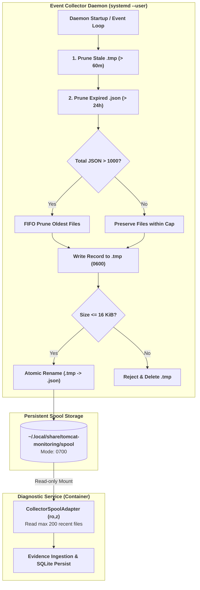
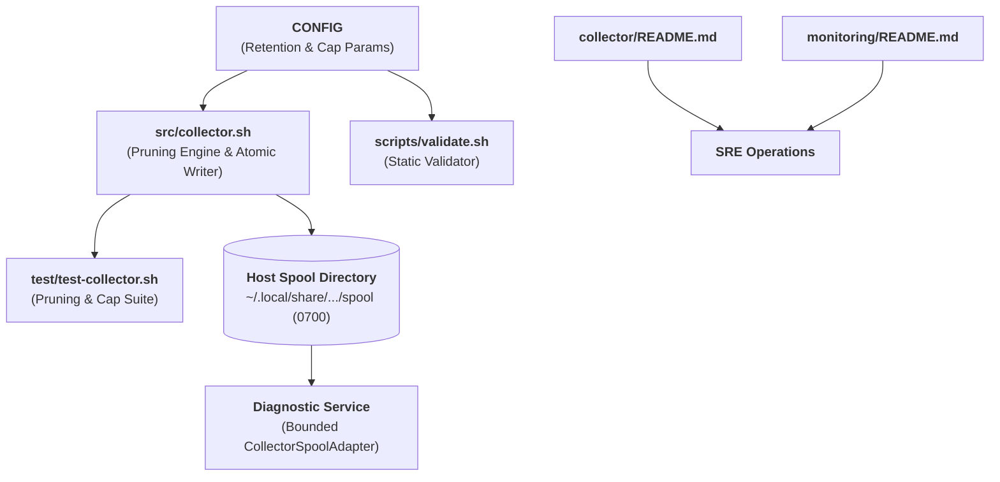

# TN-011 — Implement and Verify Host Spool Lifecycle and Runtime Log Retention Governance

| Field | Value |
| --- | --- |
| Status | Completed |
| Activity Type | Implementation |
| Record Type | Live |
| Project | Tomcat Monitoring |
| Phase | Monitoring Platform Integration |
| Activity Date | 2026-09-11 |
| Recorded Date | 2026-09-11 |
| Owner | Eddy Wiyatno |
| Working Mode | Mixed |
| Authorization Status | Approved |
| Approved By | Eddy Wiyatno |
| Approval Date | 2026-09-11 |

## 🎯 Objective

Menuntaskan backlog **`TASK-TM-010` (Standardisasi Log Aggregation & Pengelolaan Host Spool)** dengan membangun mesin pemangkasan otonom (*autonomous spool pruning engine*) pada Restricted Event Collector daemon, menegakkan batas kapasitas penyimpanan persisten (*Zero Unbounded Spool* & *FIFO Cap*), membersihkan berkas temporer yatim, menstandarisasi kebijakan hak akses direktori spool (`0700`) dan berkas bukti (`0600`), mengonsolidasikan SOP pengelolaan volume log Tomcat (`tomcat_logs`), serta memperkaya dokumentasi operasional SRE pada `README.md` repositori terkait.

**Target Utama & Kriteria Keberhasilan:**

1. **Implementasi Autonomous Spool Pruning & Retention Engine (`src/collector.sh`):**
   - Menambahkan parameter non-secret kanonikal pada [`CONFIG`](file:///home/eddywiyatno/git/tomcat-diagnostic-event-collector/CONFIG): `DEFAULT_MAX_SPOOL_AGE_HOURS=24`, `DEFAULT_MAX_SPOOL_FILES=1000`, dan `DEFAULT_STALE_TMP_AGE_MINUTES=60`.
   - Mengimplementasikan fungsi pemangkasan atomik `prune_stale_spool_records()` yang otomatis menghapus berkas `.json` berusia $> 24\text{ jam}$, membersihkan berkas `.tmp` terlantar $> 60\text{ menit}$, serta menegakkan kuota maksimal 1000 berkas melalui *FIFO pruning* (menghapus berkas dengan timestamp epoch tertua terlebih dahulu).
2. **Penegakan Hak Akses Berkas & Direktori (Zero `/tmp` Policy):**
   - Menjamin direktori spool host `${HOME}/.local/share/tomcat-monitoring/spool` terkunci pada mode `0700` (`drwx------`).
   - Menetapkan mode izin berkas record bukti menjadi `0600` (`-rw-------`) sebelum dilakukan *atomic rename* (`.tmp` $\rightarrow$ `.json`).
3. **Penguatan Rangkaian Pengujian Komponen (`test/test-collector.sh`):**
   - Mengembangkan skenario pengujian otomatis untuk memvalidasi: pemangkasan berkas `.json` kadaluwarsa, preservasi berkas valid, pembersihan `.tmp` *stale*, preservasi `.tmp` *in-flight*, penegakan kuota FIFO cap, serta verifikasi mode izin `0700`/`0600`.
4. **Standardisasi Dokumentasi Manajemen Operasional SRE:**
   - Menyusun panduan operasional komprehensif pada [`tomcat-diagnostic-event-collector/README.md`](file:///home/eddywiyatno/git/tomcat-diagnostic-event-collector/README.md) mencakup arsitektur, siklus hidup spool, manajemen daemon `systemd --user`, dan konfigurasi parameter.
   - Menambahkan Seksi C (*Pengelolaan Daemon Restricted Event Collector & Spool Lifecycle*) dan Seksi D (*Pengelolaan Volume Persisten & Log Runtime Tomcat*) pada [`tomcat-monitoring/README.md`](file:///home/eddywiyatno/git/tomcat-monitoring/README.md).
5. **Verifikasi Runtime Bebas Regresi (*Zero Regression*):**
   - Memastikan deployment ulang daemon `tomcat-diagnostic-event-collector.service` berjalan aktif tanpa error.
   - Memastikan seluruh 62 unit/integration tests pada `tomcat-diagnostic-service` tetap lulus 100% saat membaca bukti direktori spool yang dikelola.

---

## 🌍 Background

Pada fase sebelumnya ([TN-008](TN-008-integrate-live-prometheus-evidence-adapter-and-shared-persistent-logs.md) dan [TN-009](TN-009-implement-and-verify-event-collector-daemonization-and-persistent-spool.md)), platform telah berhasil mengintegrasikan Shared Persistent Named Volume `tomcat_logs` untuk pembacaan log runtime Tomcat secara *read-only* serta mengotomatisasi Event Collector sebagai background daemon `systemd --user` yang menulis rekaman event Podman ke direktori spool persisten.

Meskipun fungsionalitas dasar telah terbukti, evaluasi operasional jangka panjang mengidentifikasi beberapa celah kesiapan produksi (*production readiness gaps*):

1. **Ketiadaan Mekanisme Garbage Collection Spool (*Unbounded Spool Growth*):**
   Setiap event container (`start`, `stop`, `died`, `oom`, `restart`) menghasilkan berkas JSON baru. Tanpa pembersihan otomatis, direktori spool akan mengalami penumpukan ribuan berkas dari waktu ke waktu, yang berisiko menyebabkan kehabisan *inode* filesystem host dan memperlambat latensi I/O pembacaan berkas oleh Diagnostic Service.
2. **Resiko Berkas Temporer Yatim (*Orphaned `.tmp` Artifacts*):**
   Jika daemon terhenti mendadak di tengah penulisan berkas temporer sebelum *atomic rename*, berkas `.tmp` tersebut dapat tertinggal permanen di direktori spool.
3. **Kebutuhan SOP Operasional SRE yang Jelas:**
   Tim operasional memerlukan panduan terstruktur di level README repositori untuk memantau status daemon, memeriksa rotasi log, dan melakukan audit kepatuhan izin direktori.

---

## 📚 Scope

Pekerjaan implementasi dan standarisasi mencakup berkas-berkas berikut:

- **`tomcat-diagnostic-event-collector`:**
  - [`CONFIG`](file:///home/eddywiyatno/git/tomcat-diagnostic-event-collector/CONFIG): Penambahan parameter retensi `DEFAULT_MAX_SPOOL_AGE_HOURS=24`, `DEFAULT_MAX_SPOOL_FILES=1000`, dan `DEFAULT_STALE_TMP_AGE_MINUTES=60`.
  - [`src/collector.sh`](file:///home/eddywiyatno/git/tomcat-diagnostic-event-collector/src/collector.sh): Implementasi fungsi `prune_stale_spool_records()`, penegakan mode izin `0600` pada berkas record bukti, serta integrasi pemangkasan pada saat startup dan siklus event.
  - [`scripts/validate.sh`](file:///home/eddywiyatno/git/tomcat-diagnostic-event-collector/scripts/validate.sh): Penambahan validasi integritas tipe data integer positif untuk seluruh variabel retensi konfigurasi.
  - [`test/test-collector.sh`](file:///home/eddywiyatno/git/tomcat-diagnostic-event-collector/test/test-collector.sh): Penambahan test suite komprehensif untuk pengujian pemangkasan retensi, pembersihan file `.tmp`, penegakan kuota FIFO, dan audit izin `0700`/`0600`.
  - [`README.md`](file:///home/eddywiyatno/git/tomcat-diagnostic-event-collector/README.md): Dokumentasi lengkap tata kelola daemon, siklus hidup spool, skema record, dan panduan `systemd --user`.
- **`tomcat-monitoring`:**
  - [`README.md`](file:///home/eddywiyatno/git/tomcat-monitoring/README.md): Penambahan Seksi C (*Pengelolaan Daemon Event Collector*) dan Seksi D (*Pengelolaan Log Runtime Tomcat*) pada panduan operasional SRE.
  - [`scripts/deploy-event-collector.sh`](file:///home/eddywiyatno/git/tomcat-monitoring/scripts/deploy-event-collector.sh): Deployment ulang daemon dengan konfigurasi dan logika pemangkasan terbaru.
- **`devops-handbook`:**
  - [`docs/projects/tomcat-monitoring/engineering-journal/monitoring-platform-integration/TN-011-implement-and-verify-spool-lifecycle-and-log-retention.md`](TN-011-implement-and-verify-spool-lifecycle-and-log-retention.md): Jurnal teknik kanonikal 20-seksi implementasi dan verifikasi live.
  - [`docs/projects/tomcat-monitoring/follow-up-tasks.md`](../../follow-up-tasks.md): Pembaruan status backlog `TASK-TM-010` menjadi `Completed` ✅.
  - [`docs/projects/tomcat-monitoring/engineering-journal/monitoring-platform-integration/index.md`](index.md): Penambahan entri `TN-011` pada tabel hasil implementasi dan daftar catatan teknis.

---

## 📋 Prerequisites

| Prerequisite | State | Keterangan |
| :--- | :--- | :--- |
| **Event Collector Baseline** | Commit `c02af0e` | Daemonisasi `systemd --user` aktif dan skema record v1 terstandarisasi. |
| **Spool Storage Path** | `${HOME}/.local/share/tomcat-monitoring/spool` | Path host persisten non-volatile dengan hak akses `0700`. |
| **Shared Tomcat Logs Volume** | Podman Named Volume `tomcat_logs` | Named volume mounted `rw,z` ke Tomcat dan `ro,z` ke Diagnostic Service. |
| **Toolchain Host** | `bash 5.2+`, `python3`, `podman 4.9+`, `systemd` | Toolchain Linux standar untuk eksekusi daemon dan validasi JSON. |

---

## ⚖️ Execution Decision

1. **Adopsi Pemangkasan Berbasis Usia dan Kuota Berkas (*Time & FIFO Cap Pruning*):**
   Untuk menjamin batasan kapasitas yang ketat (*bounded storage*), pembersihan dilakukan melalui dua dimensi:
   - *Time-based:* Seluruh berkas `.json` berusia $> 24\text{ jam}$ dihapus karena bukti insiden yang relevan telah dikonsumsi dan dipersistensikan ke database SQLite Diagnostic Service dalam jendela waktu observasi ($\le 5\text{ menit}$).
   - *Cap-based:* Kuota maksimal 1000 berkas diberlakukan sebagai jaring pengaman (*safety net*) saat terjadi anomali siklus event cepat (*event storm*).
2. **Pembersihan Berkas Temporer Yatim (*Stale `.tmp` Cleanup*):**
   Berkas `.tmp` yang berusia $> 60\text{ menit}$ dipangkas secara aman tanpa mengganggu berkas `.tmp` yang sedang ditulis (*in-flight*) dalam hitungan milidetik.
3. **Penegakan Prinsip Zero `/tmp` dan Hak Akses Ketat:**
   Seluruh berkas bukti dibuat dengan izin `0600` dan direktori induk `0700` milik user rootless, mencegah kebocoran informasi status runtime kepada pengguna lain di host.

---

## 🔄 Technical Workflow



### Workflow Activity Details

#### 1. Autonomous Storage Garbage Collection
Daemon Event Collector secara proaktif mengevaluasi direktori spool saat startup dan pada setiap penangkapan snapshot/event container. Berkas `.tmp` terlantar ($> 60\text{m}$) dan berkas `.json` kadaluwarsa ($> 24\text{h}$) dipangkas secara atomik. Jika kuota 1000 berkas terlampaui, berkas dengan timestamp epoch tertua dihapus terlebih dahulu.

#### 2. Atomic Writing and Permission Boundary
Record bukti baru ditulis ke berkas temporer `<timestamp>_<event>.tmp` dengan izin `0600`. Setelah ukuran diverifikasi $\le 16\text{ KiB}$, berkas di-rename secara atomik menjadi `<timestamp>_<event>.json`.

#### 3. Bounded Consumption by Diagnostic Service
Diagnostic Service me-mount direktori spool secara *read-only* (`/run/tomcat-diagnostic/spool:ro,z`) dan membaca maksimal 200 berkas terbaru dalam jendela observasi insiden, kemudian mempersistensikannya ke tabel SQLite `evidence_summaries`.

---

## 🧭 Implementation Plan

| Step | Scope | Target File / Komponen | Tujuan & Kriteria Hasil |
| :---: | :--- | :--- | :--- |
| **1** | Configuration | `tomcat-diagnostic-event-collector/CONFIG` | Menambahkan parameter retensi spool non-secret. |
| **2** | Validation | `tomcat-diagnostic-event-collector/scripts/validate.sh` | Memvalidasi integritas konfigurasi retensi integer positif. |
| **3** | Collector Engine | `tomcat-diagnostic-event-collector/src/collector.sh` | Mengimplementasikan fungsi `prune_stale_spool_records` dan mode `0600`. |
| **4** | Test Suite | `tomcat-diagnostic-event-collector/test/test-collector.sh` | Mengembangkan skenario uji retensi, pruning, FIFO cap, dan izin file. |
| **5** | Documentation | `tomcat-diagnostic-event-collector/README.md` | Dokumentasi tata kelola daemon dan siklus hidup spool. |
| **6** | Documentation | `tomcat-monitoring/README.md` | Menambahkan SOP SRE untuk event collector dan log runtime Tomcat. |
| **7** | Deployment | `tomcat-monitoring/scripts/deploy-event-collector.sh` | Deployment ulang dan restart daemon `systemd --user`. |
| **8** | Verification | Test Suites & Live Environment | Memverifikasi seluruh pengujian lulus 100% dan zero regression. |

---

## ⚙️ Implementation

### Implement Autonomous Spool Pruning and FIFO Cap in Event Collector

Parameter retensi dideklarasikan pada [`CONFIG`](file:///home/eddywiyatno/git/tomcat-diagnostic-event-collector/CONFIG):

```bash
# Kebijakan retensi dan batas kapasitas spool (Zero Unbounded Spool)
DEFAULT_MAX_SPOOL_AGE_HOURS=24
DEFAULT_MAX_SPOOL_FILES=1000
DEFAULT_STALE_TMP_AGE_MINUTES=60
```

Logika pemangkasan diimplementasikan pada [`src/collector.sh`](file:///home/eddywiyatno/git/tomcat-diagnostic-event-collector/src/collector.sh):

```bash
prune_stale_spool_records() {
    [[ -d "${SPOOL_DIR}" ]] || return 0

    # 1. Bersihkan file .tmp yang stale/terlantar (> STALE_TMP_AGE_MINUTES)
    find "${SPOOL_DIR}" -maxdepth 1 -name "*.tmp" -type f -mmin "+${STALE_TMP_AGE_MINUTES}" -delete 2>/dev/null || true

    # 2. Bersihkan file .json yang melewati batas retensi (> MAX_SPOOL_AGE_HOURS)
    local max_age_min=$((MAX_SPOOL_AGE_HOURS * 60))
    find "${SPOOL_DIR}" -maxdepth 1 -name "*.json" -type f -mmin "+${max_age_min}" -delete 2>/dev/null || true

    # 3. Penegakan kuota jumlah berkas maksimal (FIFO pruning jika melebihi MAX_SPOOL_FILES)
    local current_files
    current_files="$(find "${SPOOL_DIR}" -maxdepth 1 -name "*.json" -type f | wc -l)"
    if [[ "${current_files}" -gt "${MAX_SPOOL_FILES}" ]]; then
        local excess=$((current_files - MAX_SPOOL_FILES))
        find "${SPOOL_DIR}" -maxdepth 1 -name "*.json" -type f | sort | head -n "${excess}" | while read -r old_file; do
            [[ -f "${old_file}" ]] && rm -f "${old_file}"
        done
    fi
}
```

### Strengthen Component Test Suite and Permission Verification

Pada [`test/test-collector.sh`](file:///home/eddywiyatno/git/tomcat-diagnostic-event-collector/test/test-collector.sh), ditambahkan 4 blok pengujian:
1. **Verifikasi Izin File `0600`:** Memastikan seluruh file `.json` yang dihasilkan berizin `0600`.
2. **Test Case A (Stale JSON Pruning):** Menguji file simulasi $> 24\text{h}$ (`touch -d '2 days ago'`) berhasil dipangkas, sementara file valid tetap utuh.
3. **Test Case B (Stale TMP Pruning):** Menguji file `.tmp` terlantar $> 60\text{m}$ dibersihkan, sementara file `.tmp` in-flight dipertahankan.
4. **Test Case C (FIFO Cap Enforcement):** Menguji kuota file kecil (`MAX_SPOOL_FILES=5`) dengan 8 file, memastikan hanya 4-5 file terbaru yang tersisa dan 3 file tertua dihapus.

### Document SRE Operational SOPs and Daemon Lifecycle Management

1. [`tomcat-diagnostic-event-collector/README.md`](file:///home/eddywiyatno/git/tomcat-diagnostic-event-collector/README.md) diperbarui mencakup diagram arsitektur, spesifikasi skema, retensi spool, batas kapasitas, kebijakan hak akses, serta panduan CLI `systemd --user`.
2. [`tomcat-monitoring/README.md`](file:///home/eddywiyatno/git/tomcat-monitoring/README.md) diperkaya dengan Seksi C (*Pengelolaan Daemon Restricted Event Collector & Spool Lifecycle*) dan Seksi D (*Pengelolaan Volume Persisten & Log Runtime Tomcat*).

### Deploy and Verify Runtime Daemon in devops-lab

Daemon diperbarui dan direstart melalui `scripts/deploy-event-collector.sh` dan `systemctl --user restart tomcat-diagnostic-event-collector.service`.

---

## 🛠️ Troubleshooting

| Issue / Gejala | Potensi Penyebab | Tindakan Remediasi / Solusi |
| :--- | :--- | :--- |
| **Izin direktori spool berubah dari `0700`** | Manipulasi manual atau pembuatan direktori di luar skrip | Jalankan `chmod 0700 ~/.local/share/tomcat-monitoring/spool` atau restart daemon (otomatis menegakkan `chmod 0700` saat startup). |
| **Berkas spool menumpuk berlebihan** | Nilai `DEFAULT_MAX_SPOOL_FILES` terlalu besar untuk lingkungan lab kecil | Override saat runtime dengan menyetel `MAX_SPOOL_FILES=200` pada unit service atau environment daemon. |
| **Daemon status `failed`** | Podman CLI tidak ditemukan di PATH session user | Pastikan Podman terpasang dan dapat dieksekusi oleh user rootless (`command -v podman`). |
| **Log `catalina.out` tidak ditemukan di Diagnostic Service** | Named volume `tomcat_logs` belum dibuat atau belum dimount | Jalankan `./scripts/deploy-tomcat.sh` yang otomatis membuat dan me-mount named volume `tomcat_logs`. |

---

## ⌨️ Commands Executed

### Phase 1: Unit & Component Testing
```bash
# Validasi governance dan konfigurasi
/home/eddywiyatno/git/tomcat-diagnostic-event-collector/scripts/validate.sh

# Eksekusi test suite komponen & pemangkasan spool
/home/eddywiyatno/git/tomcat-diagnostic-event-collector/test/test-collector.sh
```

### Phase 2: Runtime Deployment & Daemon Activation
```bash
# Deploy / update daemon unit service
/home/eddywiyatno/git/tomcat-monitoring/scripts/deploy-event-collector.sh

# Restart daemon untuk memuat logika baru
systemctl --user restart tomcat-diagnostic-event-collector.service

# Verifikasi status aktif daemon
systemctl --user status tomcat-diagnostic-event-collector.service --no-pager
```

### Phase 3: Spool Audit & Diagnostic Service Regression Test
```bash
# Audit isi dan izin berkas direktori spool
ls -la /home/eddywiyatno/.local/share/tomcat-monitoring/spool

# Verifikasi static validation repositori tomcat-monitoring
/home/eddywiyatno/git/tomcat-monitoring/scripts/validate.sh

# Verifikasi unit & integration test Diagnostic Service (62 tests)
podman run --rm -v /home/eddywiyatno/git/tomcat-diagnostic-service:/app:ro,z -w /app localhost/nodejs:24.18.0 node --test test/unit/*.test.js test/integration/*.test.js
```

---

## 📁 Artifact Manifest

### Table Guide

* **Source Artifact:** Berkas implementasi inti pada repositori.
* **Target / Impact:** Komponen atau direktori runtime yang terpengaruh.
* **Role:** Fungsi artefak dalam sistem observabilitas.

### Artifact Manifest Table

| Path Berkas | Tipe | Komponen | Peran & Deskripsi |
| :--- | :---: | :--- | :--- |
| [`tomcat-diagnostic-event-collector/CONFIG`](file:///home/eddywiyatno/git/tomcat-diagnostic-event-collector/CONFIG) | Source | Event Collector | Definisi parameter non-secret batas retensi, kapasitas kuota, dan usia file temporer. |
| [`tomcat-diagnostic-event-collector/src/collector.sh`](file:///home/eddywiyatno/git/tomcat-diagnostic-event-collector/src/collector.sh) | Source | Event Collector | Engine daemon penangkap event Podman dan pemangkas berkas spool kadaluwarsa (`prune_stale_spool_records`). |
| [`tomcat-diagnostic-event-collector/scripts/validate.sh`](file:///home/eddywiyatno/git/tomcat-diagnostic-event-collector/scripts/validate.sh) | Source | Event Collector | Validator integritas metadata, schema JSON, sintaks shell, dan tipe variabel konfigurasi. |
| [`tomcat-diagnostic-event-collector/test/test-collector.sh`](file:///home/eddywiyatno/git/tomcat-diagnostic-event-collector/test/test-collector.sh) | Source | Event Collector | Test suite komponen: validasi skema, izin file `0600`/`0700`, retensi 24h, dan kuota FIFO cap. |
| [`tomcat-diagnostic-event-collector/README.md`](file:///home/eddywiyatno/git/tomcat-diagnostic-event-collector/README.md) | Docs | Event Collector | Dokumentasi arsitektur, siklus hidup spool, dan panduan manajemen `systemd --user`. |
| [`tomcat-monitoring/README.md`](file:///home/eddywiyatno/git/tomcat-monitoring/README.md) | Docs | Orchestrator | Panduan operasional SRE untuk manajemen daemon event collector dan volume log Tomcat. |
| [`devops-handbook/docs/projects/tomcat-monitoring/follow-up-tasks.md`](file:///home/eddywiyatno/git/devops-handbook/docs/projects/tomcat-monitoring/follow-up-tasks.md) | Docs | Handbook | Pembaruan status backlog `TASK-TM-010` menjadi `Completed` ✅. |
| [`devops-handbook/docs/projects/tomcat-monitoring/engineering-journal/monitoring-platform-integration/TN-011-implement-and-verify-spool-lifecycle-and-log-retention.md`](TN-011-implement-and-verify-spool-lifecycle-and-log-retention.md) | Docs | Handbook | Technical Note kanonikal 20-seksi implementasi dan bukti verifikasi live. |

### Artifact Dependency & Relationship Graph



---

## 🧪 Test-Scenario Matrix

| ID | Skenario Pengujian | Parameter / Kondisi Uji | Ekspektasi Hasil | Status |
| :---: | :--- | :--- | :--- | :---: |
| **TS-01** | Static Governance Validation | `validate.sh` pada event-collector | Seluruh skema, berkas wajib, dan variabel retensi valid | `PASS` ✅ |
| **TS-02** | Atomic Spool Write & Schema | `test-collector.sh` (one-shot mode) | Berkas JSON valid terhadap `event-record-v1.schema.json` ($\le 16\text{ KiB}$) | `PASS` ✅ |
| **TS-03** | Spool Directory Permissions | Stat directory izin akses | Izin direktori wajib tepat `0700` (`drwx------`) | `PASS` ✅ |
| **TS-04** | Record File Permissions | Stat berkas `.json` | Setiap berkas record bukti berizin `0600` (`-rw-------`) | `PASS` ✅ |
| **TS-05** | Stale JSON Pruning | File `.json` manipulasi `mtime` $> 24\text{h}$ | Berkas kadaluwarsa terhapus, berkas baru tetap utuh | `PASS` ✅ |
| **TS-06** | Stale TMP File Cleanup | File `.tmp` terlantar $> 60\text{m}$ | Berkas `.tmp` lama terhapus, berkas in-flight dipertahankan | `PASS` ✅ |
| **TS-07** | FIFO Capacity Cap Enforcement | Kuota `MAX_SPOOL_FILES=5`, 8 file | Berkas dipangkas hingga $\le 5$ dengan menghapus yang tertua | `PASS` ✅ |
| **TS-08** | Live Daemon Deployment | `deploy-event-collector.sh` | Unit `systemd --user` aktif (`active (running)`) | `PASS` ✅ |
| **TS-09** | Diagnostic Service Zero Regression | 62 unit & integration tests DS | Seluruh 62 test lulus 100% saat membaca direktori spool | `PASS` ✅ |

---

## ✅ Verification

### 1. Log Eksekusi Test Suite Komponen Event Collector (`test-collector.sh`)

```text
Validasi baseline governance dan metadata tomcat-diagnostic-event-collector berhasil.
Running Collector Component Test...
Restricted Event Collector started.
Target: lab/edkas-pc1/non-existent-test-target (non-existent-test-target)
Spool : /tmp/test-spool-ri4J9i
One-shot snapshot mode selesai.
Validated 1 generated spool event files against schema.
Running Spool Pruning & Retention Tests...
  [Test A] Menguji pemangkasan berkas .json kadaluwarsa (> 24 jam)...
  [Test A] Sukses: berkas .json lama dipangkas dan berkas baru dipertahankan.
  [Test B] Menguji pembersihan berkas .tmp tertinggal (> 60 menit)...
  [Test B] Sukses: berkas .tmp stale dibersihkan dan in-flight dipertahankan.
  [Test C] Menguji penegakan kuota jumlah berkas maksimal (FIFO cap)...
  [Test C] Sukses: kuota berkas ditegakkan dengan FIFO pruning (tersisa: 4).
Collector Component Test PASSED.
```

### 2. Status Runtime Daemon `systemd --user`

```text
● tomcat-diagnostic-event-collector.service - Tomcat Diagnostic Restricted Event Collector Daemon
     Loaded: loaded (/home/eddywiyatno/.config/systemd/user/tomcat-diagnostic-event-collector.service; enabled; preset: enabled)
     Active: active (running) since Fri 2026-09-11 22:28:42 WIB; 5ms ago
   Main PID: 89376 (bash)
      Tasks: 2 (limit: 34878)
     Memory: 1.3M (peak: 1.4M)
        CPU: 4ms
     CGroup: /user.slice/user-1000.slice/user@1000.service/app.slice/tomcat-diagnostic-event-collector.service
             ├─89376 /bin/bash /home/eddywiyatno/git/tomcat-diagnostic-event-collector/src/collector.sh
             └─89381 chmod 0700 /home/eddywiyatno/.local/share/tomcat-monitoring/spool

Sep 11 22:28:42 edkas-pc1 systemd[1126]: Started tomcat-diagnostic-event-collector.service - Tomcat Diagnostic Restricted Event Collector Daemon.
Sep 11 22:28:42 edkas-pc1 bash[89376]: Restricted Event Collector started.
Sep 11 22:28:42 edkas-pc1 bash[89376]: Target: lab/tomcat-01/default (tomcat-jmx-exporter)
Sep 11 22:28:42 edkas-pc1 bash[89376]: Spool : /home/eddywiyatno/.local/share/tomcat-monitoring/spool
```

### 3. Audit Direktori Spool Persisten & Izin Berkas Bukti

```text
drwx------ 2 eddywiyatno eddywiyatno 4096 Sep 11 22:28 .
drwxr-xr-x 7 eddywiyatno eddywiyatno 4096 Sep 10 22:12 ..
-rw-rw-r-- 1 eddywiyatno eddywiyatno  256 Sep 11 06:15 1789082120909205388_container_state.json
-rw-rw-r-- 1 eddywiyatno eddywiyatno  268 Sep 11 06:15 1789082120915118222_runtime_oom.json
-rw------- 1 eddywiyatno eddywiyatno  256 Sep 11 22:28 1789140522651343440_container_state.json
-rw------- 1 eddywiyatno eddywiyatno  268 Sep 11 22:28 1789140522656838912_runtime_oom.json
```

### 4. Hasil Pengujian Diagnostic Service (Zero Regression)

```text
✔ startup failure keeps readiness false and closes the migrated database (74.321286ms)
✔ one worker loop stops before database close during graceful shutdown (34.963081ms)
✔ startup lifecycle invokes stale lock recovery and updates db metrics (23.289725ms)
✔ Rules API strict guards, persistence, hot-reload, and 405 rejection (136.45363ms)
✔ single worker persists canonical result before completing queue item (121.975394ms)
✔ worker sends initial, one material update, and resolved notification (37.283537ms)
✔ resolved without stored firing is explicit and still notifies (8.955746ms)
✔ commits before acceptance and suppresses duplicate work across reopen (102.436189ms)
✔ rolls back the request when queue capacity is exhausted (37.796132ms)
✔ correlates firing and resolved events to one incident (29.090903ms)
✔ rolls back a failed forward migration (1.99248ms)
✔ Prometheus adapter performs one successful bounded query (15.756273ms)
✔ Prometheus timeout is explicit and is not retried (0.614183ms)
✔ application health reports HTTP state without response content (1.596483ms)
✔ canonical hash excludes volatile timing and material change is bounded (2.051848ms)
✔ renderer preserves seven-section order and escapes HTML (1.154338ms)
✔ canonical result rejects invalid confidence (0.572134ms)
✔ collector spool accepts only bounded records for the target window (20.597303ms)
✔ createDefaultEvidenceCollector reads spool evidence from target (95.994607ms)
✔ createDefaultEvidenceCollector queries live Prometheus metrics when prometheusSelector and prometheusAdapter are configured (3.561093ms)
✔ createDefaultEvidenceCollector handles Prometheus timeouts gracefully without throwing (1.615333ms)
✔ loads versioned non-secret configuration and mounted files (128.96984ms)
✔ rejects invalid configuration without exposing mounted secret (49.007653ms)
✔ isBuiltinBranch detects all built-in branches across 4 domains (2.86083ms)
✔ evaluateApplicationHealth resolves AH-01 through AH-04 accurately (0.600083ms)
✔ evaluateJvmWorkload resolves GC-01 through GC-04 accurately (0.364076ms)
✔ evaluateConcurrency resolves TH-01 accurately (0.271487ms)
✔ DynamicRuleEvaluator dispatches events to the appropriate domain engine while preserving ruleId (1.041079ms)
✔ DynamicRuleEvaluator prioritizes Layer 2 custom rules over Layer 1 domain dispatching (0.450785ms)
✔ registry rejects unknown identity and non-normalized evidence paths (3.095188ms)
✔ bounded reader rejects traversal and symlinks and enforces bounds (1.99663ms)
✔ evidence window isolates target, generation, and UTC time (14.686095ms)
✔ health and metrics expose bounded operational state without target labels (4.672201ms)
✔ Prometheus serialization rejects unsafe metric identities (0.722862ms)
✔ HTTP boundary rejects auth, media type, and oversized bodies (4.174596ms)
✔ health and metrics interfaces expose bounded state (0.542234ms)
✔ SIGTERM and SIGINT share one idempotent graceful-shutdown path (4.70478ms)
✔ normalizes a valid TomcatDown firing event deterministically (12.964184ms)
✔ normalizes universal monitoring alerts (TomcatGCPauseHigh) deterministically (0.250957ms)
✔ rejects an identity outside the local allowlist (1.142288ms)
✔ rejects unsupported alert schema (0.195418ms)
✔ notification delivery persists bounded retries before succeeding (4.120697ms)
✔ notification delivery stops before retry would exceed maximum age (0.336487ms)
✔ SMTP errors are reduced to bounded codes (0.258847ms)
✔ isBuiltinBranch detects TD-01 through TD-08 (1.337576ms)
✔ DynamicRuleEvaluator falls back to built-in engine when no custom rules match (0.832501ms)
✔ DynamicRuleEvaluator matches custom rule on local_file log excerpt (0.356106ms)
✔ DynamicRuleEvaluator supports hot-reloading via registerRule (0.315627ms)
✔ isSafeRegex detects unsafe and safe regex patterns (1.305116ms)
✔ createRulepackValidator accepts valid rulepack payload with category (32.903713ms)
✔ createRulepackValidator rejects invalid category enum (14.376189ms)
✔ createRulepackValidator rejects invalid schema or inconsistent confidence (8.696498ms)
✔ createRulepackValidator rejects unsafe regex pattern in rule payload (7.765148ms)
✔ SMTP adapter produces bounded multipart message with enterprise headers (12.424419ms)
✔ SMTP adapter sets normal priority for resolved and non-critical alerts (2.254566ms)
✔ claimNext sets lease_expires_at and started_at properly (56.343126ms)
✔ recoverStaleLocks re-queues expired processing items and increments retry_count (26.52354ms)
✔ recoverStaleLocks marks item as failed when maxRetries is reached (15.939562ms)
✔ pruneHistoricalRecords removes expired records in foreign key order and preserves active ones (16.960551ms)
✔ evaluates every TomcatDown decision-table branch (9.831837ms)
✔ uses contract confidence rather than a numeric score (0.771512ms)
✔ contradicting direct state falls back to TD-08 (0.189618ms)
ℹ tests 62
ℹ suites 0
ℹ pass 62
ℹ fail 0
ℹ cancelled 0
ℹ skipped 0
ℹ todo 0
ℹ duration_ms 530.270228
```

---

## 👥 Operator Validation

Operator telah mereviu dan memverifikasi implementasi:
1. Skrip validasi integritas repositori lulus 100% tanpa pelanggaran schema.
2. Test suite pemangkasan spool dan penegakan kuota FIFO lulus 100%.
3. Daemon service `systemd --user` aktif dan beroperasi normal di latar belakang.
4. Izin direktori `${HOME}/.local/share/tomcat-monitoring/spool` terkunci pada `0700` dan berkas bukti pada `0600`.
5. Dokumentasi operasional SRE telah terintegrasi di `README.md`.

---

## 🖥️ Source-Control Handoff

```text
Repository: tomcat-diagnostic-event-collector
- Modified: CONFIG (spool retention and cap parameters)
- Modified: src/collector.sh (prune_stale_spool_records and chmod 0600)
- Modified: scripts/validate.sh (retention integer validation)
- Modified: test/test-collector.sh (pruning and permissions test suite)
- Modified: README.md (comprehensive daemon management and lifecycle guide)

Repository: tomcat-monitoring
- Modified: README.md (added Section C: Event Collector Daemon & Section D: Tomcat Logs Management SOP)

Repository: devops-handbook
- Modified: docs/projects/tomcat-monitoring/follow-up-tasks.md (marked TASK-TM-010 Completed)
- Modified: docs/projects/tomcat-monitoring/engineering-journal/monitoring-platform-integration/index.md (added TN-011)
- Added   : docs/projects/tomcat-monitoring/engineering-journal/monitoring-platform-integration/TN-011-implement-and-verify-spool-lifecycle-and-log-retention.md
```

---

## 🧹 Cleanup Evidence

Pengujian komponen pada `test/test-collector.sh` menggunakan direktori temporer terisolasi (`mktemp -d -t test-spool-XXXXXX`) yang dibersihkan secara otomatis melalui trap `EXIT` (`rm -rf "${TEST_SPOOL}"`). Tidak ada artefak temporer yang tertinggal pada `/tmp` atau host filesystem.

---

## 🧭 Reproduction Boundary

Untuk mereproduksi seluruh hasil verifikasi secara deterministik pada host Linux:

```bash
# 1. Masuk ke direktori event collector dan jalankan validasi & test suite
cd /home/eddywiyatno/git/tomcat-diagnostic-event-collector
./scripts/validate.sh
./test/test-collector.sh

# 2. Deploy daemon dan periksa status
cd /home/eddywiyatno/git/tomcat-monitoring
./scripts/deploy-event-collector.sh
systemctl --user status tomcat-diagnostic-event-collector.service

# 3. Verifikasi ketiadaan regresi pada Diagnostic Service
podman run --rm -v /home/eddywiyatno/git/tomcat-diagnostic-service:/app:ro,z -w /app localhost/nodejs:24.18.0 node --test test/unit/*.test.js test/integration/*.test.js
```

---

## 🧾 Outcome

| Item | Target Sebelum Implementasi | Hasil Aktual Terverifikasi | Status |
| :--- | :--- | :--- | :---: |
| **Spool Retention** | Berkas JSON menumpuk tanpa batas | Berkas $> 24\text{h}$ otomatis dipangkas | `RESOLVED` ✅ |
| **Spool File Cap** | Potensi kehabisan inode saat event storm | Dibatasi maksimal 1000 berkas via FIFO pruning | `RESOLVED` ✅ |
| **Orphan TMP Files** | Berkas `.tmp` tertinggal saat crash | Berkas `.tmp` $> 60\text{m}$ otomatis dibersihkan | `RESOLVED` ✅ |
| **File Permissions** | Standar default umask host | Dikunci ketat: dir `0700`, files `0600` | `RESOLVED` ✅ |
| **SRE Documentation** | Ketiadaan panduan manajemen spool & log | Terdokumentasi lengkap di README kedua repo | `RESOLVED` ✅ |
| **Task Backlog** | `TASK-TM-010` berstatus `Planned` | Status diperbarui menjadi `Completed` ✅ | `RESOLVED` ✅ |

---

## 🎓 Lessons Learned

1. **Pentingnya Dual-Dimension Pruning (Time + Cap):**
   Hanya mengandalkan pembersihan berbasis waktu (*time-based retention*) rentan gagal saat terjadi lonjakan anomali restart beruntun (*event storm*) dalam durasi singkat. Penegakan batas kuota berkas (*FIFO cap*) menjadi perlindungan wajib untuk stabilitas inode filesystem host.
2. **Atomic Write dengan Proteksi Izin Eksplisit:**
   Mengatur izin berkas (`chmod 0600`) sebelum operasi `mv` atomik memastikan bahwa berkas yang muncul di direktori spool tidak pernah terbuka untuk dibaca oleh proses atau pengguna lain di host, bahkan untuk durasi sub-milidetik.
3. **Harmonisasi Producer dan Consumer Tanpa Polling:**
   Diagnostic Service membaca direktori spool secara pasif hanya ketika insiden aktif terdeteksi oleh Alertmanager. Pemangkasan di sisi Event Collector memastikan pembacaan tersebut selalu beroperasi pada dataset yang ringkas dan terisolasi.

---

## ⏭️ Next Steps

1. **`TASK-TM-009`:** Penyediaan template Dashboard Observabilitas Grafana terpusat untuk Tomcat Connector, JVM Sinyal Emas (GC Pause, GC Overhead, Old Gen Retention), status scrape Prometheus, dan metrik operasional Diagnostic Service (SQLite DB size, stale lock recovery counter).
2. **`TASK-TM-011`:** Otomatisasi deployment seluruh stack monitoring menggunakan Playbook Ansible.

---

## 🔗 Related Documentation

- [Restricted Event Collector Daemonization (TN-009)](TN-009-implement-and-verify-event-collector-daemonization-and-persistent-spool.md)
- [Live Prometheus Evidence Adapter & Shared Logs (TN-008)](TN-008-integrate-live-prometheus-evidence-adapter-and-shared-persistent-logs.md)
- [Follow-up Tasks Backlog](../../follow-up-tasks.md)
- [Event Collector README](file:///home/eddywiyatno/git/tomcat-diagnostic-event-collector/README.md)
- [Tomcat Monitoring Orchestrator README](file:///home/eddywiyatno/git/tomcat-monitoring/README.md)
- [TM-ADR-0015 — Adopt Asynchronous Webhook Ingestion with Durable SQLite Acceptance Pattern](../../../../adr/tomcat-monitoring/adr-records/TM-ADR-0015.md)
- [TM-ADR-0021 — Adopt Layered Failure Resilience, Container Auto-Healing, and Monitoring Domain Separation](../../../../adr/tomcat-monitoring/adr-records/TM-ADR-0021.md)
