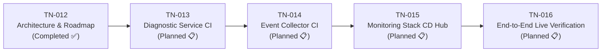

# TN-012 — Design Production-Ready Jenkins CI/CD Pipeline Architecture and Implementation Roadmap

| Field | Value |
| --- | --- |
| Status | Completed |
| Activity Type | Discovery and Assessment |
| Record Type | Live |
| Project | Tomcat Monitoring |
| Phase | Monitoring Platform Integration |
| Activity Date | 2026-09-11 |
| Recorded Date | 2026-09-11 |
| Owner | Eddy Wiyatno |
| Working Mode | Read-only |
| Authorization Status | Approved |
| Approved By | Eddy Wiyatno |
| Approval Date | 2026-09-11 |

## 🎯 Objective

Mendokumentasikan secara komprehensif seluruh hasil diskusi arsitektur, evaluasi kebutuhan, dan perancangan strategi **Continuous Integration & Continuous Deployment (CI/CD) Pipeline berbasis Jenkins** untuk platform Tomcat Monitoring.

Tujuan utama perancangan ini adalah menghasilkan spesifikasi arsitektur pipeline berstandar **Enterprise Production-Ready** yang bersifat mandiri (*self-contained*), aman (*zero secret leakage*), modular, dan langsung dapat diterapkan (*Plug-and-Play / Tinggal Pakai*) di lingkungan produksi institusi/kantor target tanpa memerlukan refactor arsitektur ulang.

---

## 🌍 Background

Setelah penyelesaian stabilisasi runtime fondasi, integrasi platform monitoring, penegakan isolasi volume host spool ([TN-011](TN-011-implement-and-verify-spool-lifecycle-and-log-retention.md)), dan pembuktian *Enterprise SMTP Relay* terotentikasi ([TN-010](TN-010-implement-and-verify-enterprise-smtp-configuration-and-headers.md)), kebutuhan operasional berikutnya adalah otomasi pengiriman kode dan kontainer secara berkelanjutan (**TASK-TM-019: Otomatisasi CI/CD Pipeline Menggunakan Jenkins**).

Dalam diskusi pendahuluan, disepakati bahwa:
1. Backlog **`TASK-TM-009` (Dashboard Grafana)** dikesampingkan (*descoped*) karena platform difokuskan pada investigasi otonom akar masalah (*autonomous root-cause diagnostics*), penyusunan laporan kanonikal 7-seksi SRE via SMTP Relay, dan query langsung Prometheus TSDB.
2. Backlog **`TASK-TM-012` (Integrasi TrueSight)** dikesampingkan (*descoped*) karena target lingkungan kantor tidak menyediakan infrastruktur TrueSight dan kebutuhan notifikasi insiden enterprise telah terpenuhi sepenuhnya oleh Enterprise SMTP Relay (Pola A).
3. Fokus rekayasa dialihkan sepenuhnya ke implementasi **CI/CD Pipeline Jenkins Skala Produksi** untuk mengotomatisasi pengujian, pembuatan image kontainer, deployment ke runtime Podman rootless, hingga pengujian insiden langsung (*live incident injection*).

---

## 📚 Scope

Dokumentasi perancangan arsitektur CI/CD ini mencakup:
1. **Analisis Kebutuhan & Ekspektasi Produksi Enterprise:** Identifikasi pilar-pilar kesiapan produksi (parameterisasi, keamanan rahasia, *quality gates*, immutability, ketahanan deployment, dan runbook).
2. **Evaluasi Alternatif Topologi Pipeline:** Perbandingan antara pendekatan *Monolithic Single Pipeline* versus *Decoupled Component CI + Orchestrated Stack CD Hub*.
3. **Standar Keamanan & Tata Kelola Runtime Jenkins:** Standarisasi eksekusi DooD (*Docker/Podman-out-of-Docker*) via Rootless Podman, isolasi credential via Jenkins Store, dan penegakan *Zero `/tmp` Policy*.
4. **Desain Detail Tahapan Pipeline (*Stage Quality Gates*):** Linting & validasi kontrak, automated unit/schema testing, build OCI image dengan SHA-256 digest pinning, atomic deployment, live smoke verification, dan automated rollback.
5. **Peta Jalan Implementasi Bertahap (*Implementation Roadmap*):** Perincian Technical Notes lanjutan (TN-013 s.d. TN-016) untuk eksekusi teknis yang terukur.

---

## 📥 Inputs

1. **Kode Sumber & Konfigurasi Repositori Eksisting:**
   - [`tomcat-monitoring`](file:///home/eddywiyatno/git/tomcat-monitoring): Orchestrator stack monitoring, Prometheus rules, Alertmanager config, skrip deployment (`scripts/deploy-*.sh`), dan skrip pengujian live (`test-tomcatdown-live.sh`, `verify-postfix-relay.sh`).
   - [`tomcat-diagnostic-service`](file:///home/eddywiyatno/git/tomcat-diagnostic-service): Node.js Express service, unit/integration test suites (`npm test`), JSON Schema validators, rulepacks, dan `Containerfile`.
   - [`tomcat-diagnostic-event-collector`](file:///home/eddywiyatno/git/tomcat-diagnostic-event-collector): Bash daemon systemd untuk monitoring event Podman host dan spool lifecycle.
2. **Standar Pipeline As Code di Handbook:**
   - Implementasi Jenkins CI/CD pada Personal Site ([PS-ADR-0007](../../../../adr/personal-site/adr-records/PS-ADR-0007.md), [PS-ADR-0008](../../../../adr/personal-site/adr-records/PS-ADR-0008.md), [TN-004 Personal Site CI](../../../web-platform/personal-site/engineering-journal/continuous-integration/TN-004-create-jenkinsfile.md)).
   - Image Jenkins Controller kustom dengan runtime Podman ([`jenkins-podman`](file:///home/eddywiyatno/git/jenkins-podman)).
3. **Arahan & Persyaratan Pengguna:**
   - Mengharuskan rancangan pipeline siap digunakan pada skala produksi enterprise (*production-ready*) tanpa refactor lanjutan saat diimplementasikan di lingkungan kerja/kantor.

---

## 🔍 Findings & Assessment

### 1. Karakteristik Multi-Repositori Platform

Platform Tomcat Monitoring tersusun atas 3 repositori utama dengan siklus hidup (*lifecycle*) dan peran yang berbeda:

```text
+------------------------------------+-------------------------------------------+-----------------------------------+
| Repositori                         | Sifat Komponen                            | Frekuensi Rilis & Tanggung Jawab  |
+------------------------------------+-------------------------------------------+-----------------------------------+
| tomcat-diagnostic-service          | Layanan backend mikro (Node.js ES Module) | Sering berubah (fitur diagnosa,   |
|                                    | Memiliki unit tests, schema, migrasi DB   | AI prompt/rules, perbaikan bug)   |
+------------------------------------+-------------------------------------------+-----------------------------------+
| tomcat-diagnostic-event-collector  | Host daemon (Bash script + systemd unit)  | Jarang berubah (stabilitas spool  |
|                                    | Menangkap event lifecycle container lokal | dan retensi berkas)               |
+------------------------------------+-------------------------------------------+-----------------------------------+
| tomcat-monitoring                  | Orkestrator Platform & Multi-Container    | Mengatur topologi deploy, alert   |
|                                    | Prometheus, Alertmanager, Postfix, Tests  | rules, dan verifikasi integrasi   |
+------------------------------------+-------------------------------------------+-----------------------------------+
```

### 2. Kebutuhan Kesiapan Produksi (*Enterprise Production-Ready*)

Implementasi skala enterprise mengharuskan pipeline memenuhi kriteria ketat berikut:
- **Portabilitas Registry:** Tidak terkunci pada `localhost`, tetapi mampu mempublikasikan image ke *Enterprise Container Registry* internal perusahaan (seperti Harbor, Nexus OSS, JFrog Artifactory, atau GitLab Container Registry) melalui parameterisasi.
- **Kepatuhan Zero Secret Leakage:** Tidak boleh ada password SMTP SASL, secret token, atau private key yang dicatat dalam Git atau file konfigurasi statis. Seluruh secret wajib diinjeksi saat runtime pipeline menggunakan Jenkins Credentials Store.
- **Isolasi Keamanan Rootless:** Pipeline harus dieksekusi oleh user non-root (`eddywiyatno`) melalui Rootless Podman pada dedicated agent (`builder-01`), mencegah eskalasi hak akses ke host operating system.
- **Pengujian Berlapis (*Quality Gates*):** Mencegah image cacat ter-deploy dengan memvalidasi shell script, menjalankan unit tests, memvalidasi schema JSON, dan melakukan ephemeral container smoke test sebelum menyentuh kontainer live.
- **Ketahanan Deployment (*Zero-Downtime & Rollback*):** Menjaga kontinuitas layanan melalui *atomic container replacement* dan pemulihan otomatis (*automated rollback*) ke snapshot container sebelumnya jika verifikasi live gagal.

---

## ⚖️ Alternatives Considered

### Opsi A: Monolithic All-in-One Pipeline di `tomcat-monitoring`

Seluruh proses build dan pengujian ketiga komponen digabungkan ke dalam satu file `Jenkinsfile` tunggal di repositori `tomcat-monitoring`.

- **Kelebihan:** Hanya perlu mengelola satu Jenkins Job.
- **Kekurangan:**
  - Melanggar batas kepemilikan repositori (*repository boundaries*).
  - Feedback loop lambat bagi developer yang hanya memodifikasi logic di `tomcat-diagnostic-service`.
  - Memerlukan mekanisme checkout multi-repo yang rentan konflik versi.

### Opsi B: Decoupled Component CI + Orchestrated Stack CD Hub (Pilihan Terpilih ⭐)

Menerapkan pemisahan tugas secara bersih:
1. **Component CI Jobs:** `tomcat-diagnostic-service` dan `tomcat-diagnostic-event-collector` memiliki `Jenkinsfile` CI masing-masing untuk linting, unit testing, packaging OCI image, dan ephemeral smoke testing.
2. **Stack CD Hub Job:** `tomcat-monitoring` memiliki `Jenkinsfile` orkestrasi untuk validasi kontrak platform, deployment multi-kontainer rootless, eksekusi live verification suite, dan automated rollback.

- **Kelebihan:**
  - Mengikuti prinsip *Single Responsibility* dan standar arsitektur microservices enterprise.
  - Feedback loop sangat cepat (hitungan detik) untuk perubahan kode unit.
  - Deployment stack terisolasi dan dapat dipicu secara mandiri maupun berantai (*upstream/downstream trigger*).
  - Portabel dan mudah diadaptasi ke sistem CI/CD lain (GitLab CI / GitHub Actions) jika diperlukan di masa depan.
- **Kekurangan:** Memerlukan konfigurasi 3 job pipeline deklaratif di Jenkins (dapat diotomatisasi melalui Jenkinsfile).

---

## 🏛️ Architectural Standards & Core Pillars

Untuk menjamin kualitas skala produksi, arsitektur CI/CD Tomcat Monitoring ditegakkan di atas **6 Pilar Produksi Enterprise**:

```mermaid
flowchart TD
    subgraph P1["Pilar 1: Parameterized & Registry-Agnostic"]
        A1["Parameter BUILD_ENV, REGISTRY_HOST, IMAGE_TAG"]
        A2["Dukungan Local Podman & Enterprise Registry (Harbor/Nexus)"]
    end

    subgraph P2["Pilar 2: Zero Secret Exposure & Security Isolation"]
        B1["Injeksi Rahasia via Jenkins Credentials Store (withCredentials)"]
        B2["Eksekusi Non-Root Rootless Podman di Agent builder-01"]
        B3["Penegakan Zero /tmp Policy & Izin Ketat 0700/0400"]
    end

    subgraph P3["Pilar 3: Strict Multi-Stage Quality Gates"]
        C1["Stage 1: Linting & Contract Validation (validate.sh & ShellCheck)"]
        C2["Stage 2: Unit, Contract & Schema Test (npm test & AJV)"]
        C3["Stage 3: Ephemeral Smoke Test (/health & /metrics)"]
    end

    subgraph P4["Pilar 4: Immutable OCI Packaging & Metadata"]
        D1["Build OCI Image dengan Buildah/Podman"]
        D2["Sematkan Metadata Standar OCI (git-sha, build-no, version)"]
        D3["Pinning SHA-256 Digest Lokal"]
    end

    subgraph P5["Pilar 5: Atomic Deployment & Automated Rollback"]
        E1["Deployment tanpa downtime via deploy-*.sh"]
        E2["Snapshot Kontainer Rollback Aktif (diagnostic-service-rollback-*)"]
        E3["Pemulihan Otomatis pada Blok post.failure"]
    end

    subgraph P6["Pilar 6: Live SRE Verification & Self-Documentation"]
        F1["Pengujian Simulasi Insiden Live (test-tomcatdown-live.sh)"]
        F2["Pengujian Validasi Postfix Relay (verify-postfix-relay.sh)"]
        F3["Dokumentasi Lengkap di DevOps Handbook & Runbook"]
    end

    P1 --> P2 --> P3 --> P4 --> P5 --> P6
```



### 1. Spesifikasi Standar `Jenkinsfile` Komponen (`tomcat-diagnostic-service`)

Struktur pipeline deklaratif yang dirancang untuk komponen backend:

```groovy
pipeline {
    agent {
        label 'builder'
    }

    parameters {
        choice(name: 'DEPLOY_ENV', choices: ['STAGING', 'PRODUCTION'], description: 'Target deployment environment')
        string(name: 'REGISTRY_HOST', defaultValue: 'localhost', description: 'Target OCI Image Registry (e.g. localhost, harbor.internal.corp:5000)')
        booleanParam(name: 'PUSH_IMAGE', defaultValue: false, description: 'Push container image to remote registry if configured')
    }

    environment {
        PROJECT_NAME    = 'tomcat-diagnostic-service'
        APP_PORT        = '8443'
        NODE_ENV        = 'production'
    }

    stages {
        stage('Checkout Source') {
            steps {
                checkout scm
            }
        }

        stage('Static Lint & Contract Validation') {
            steps {
                sh '''
                    set -euo pipefail
                    echo "=== [Stage 1] Validating Shell Scripts & Non-secret Contract ==="
                    bash scripts/validate.sh
                '''
            }
        }

        stage('Automated Unit & Schema Tests') {
            steps {
                sh '''
                    set -euo pipefail
                    echo "=== [Stage 2] Executing Node.js Unit & Component Tests ==="
                    npm test
                '''
            }
        }

        stage('Build & Pin OCI Image') {
            steps {
                sh '''
                    set -euo pipefail
                    echo "=== [Stage 3] Building Immutable OCI Image ==="
                    VERSION="$(<VERSION)"
                    BUILD_TAG="${VERSION}-b${BUILD_NUMBER}-${GIT_COMMIT:0:7}"
                    IMAGE_URI="${REGISTRY_HOST}/${PROJECT_NAME}"

                    echo "Building image: ${IMAGE_URI}:${BUILD_TAG}"
                    bash scripts/build.sh

                    podman tag "${PROJECT_NAME}:${VERSION}" "${IMAGE_URI}:${BUILD_TAG}"
                    podman tag "${PROJECT_NAME}:${VERSION}" "${IMAGE_URI}:latest"
                    
                    echo "IMAGE_BUILD_TAG=${BUILD_TAG}" > build.env
                '''
            }
        }

        stage('Ephemeral Smoke Test') {
            steps {
                sh '''
                    set -euo pipefail
                    echo "=== [Stage 4] Ephemeral Container Healthcheck Test ==="
                    VERSION="$(<VERSION)"
                    bash scripts/test-image.sh
                '''
            }
        }

        stage('Publish Container Image') {
            when {
                expression { return params.PUSH_IMAGE == true && params.REGISTRY_HOST != 'localhost' }
            }
            steps {
                sh '''
                    set -euo pipefail
                    echo "=== [Stage 5] Pushing Image to Enterprise Registry ==="
                    # Autentikasi dan push image ke remote registry
                '''
            }
        }
    }

    post {
        always {
            cleanWs deleteDirs: true, notFailBuild: true
        }
        failure {
            echo "❌ Build Pipeline Gagal. Menjaga runtime aktif tetap utuh tanpa perubahan."
        }
    }
}
```

### 2. Spesifikasi Standar `Jenkinsfile` Orkestrator Stack (`tomcat-monitoring`)

Pipeline orkestrator yang bertanggung jawab atas deployment lingkungan dan verifikasi live:

```groovy
pipeline {
    agent {
        label 'builder'
    }

    parameters {
        choice(name: 'DEPLOY_ACTION', choices: ['DEPLOY_AND_VERIFY', 'VERIFY_ONLY', 'ROLLBACK'], description: 'Tindakan orkestrasi')
        booleanParam(name: 'RUN_INCIDENT_SIMULATION', defaultValue: true, description: 'Jalankan live incident injection & SMTP verification')
    }

    stages {
        stage('Checkout Stack Source') {
            steps {
                checkout scm
            }
        }

        stage('Validate Platform Contracts') {
            steps {
                sh '''
                    set -euo pipefail
                    echo "=== Validating Monitoring Stack Configurations ==="
                    bash scripts/validate.sh
                '''
            }
        }

        stage('Verify Runtime & Volume Isolation') {
            steps {
                sh '''
                    set -euo pipefail
                    echo "=== Verifying Network & Named Volumes ==="
                    podman network exists devops-lab || podman network create devops-lab
                    podman volume exists diagnostic_data || podman volume create diagnostic_data
                    podman volume exists tomcat_logs || podman volume create tomcat_logs
                '''
            }
        }

        stage('Execute Zero-Touch Deployment') {
            when {
                expression { return params.DEPLOY_ACTION == 'DEPLOY_AND_VERIFY' }
            }
            steps {
                sh '''
                    set -euo pipefail
                    echo "=== Deploying Stack Containers ==="
                    bash scripts/deploy-diagnostic-service.sh
                    bash scripts/deploy-postfix-relay.sh
                    bash scripts/deploy-prometheus.sh
                    bash scripts/deploy-alertmanager.sh
                '''
            }
        }

        stage('Live Verification Suite') {
            when {
                expression { return params.RUN_INCIDENT_SIMULATION == true }
            }
            steps {
                sh '''
                    set -euo pipefail
                    echo "=== Executing Live End-to-End Verification ==="
                    bash scripts/verify-postfix-relay.sh
                    bash scripts/test-tomcatdown-live.sh
                '''
            }
        }
    }

    post {
        failure {
            sh '''
                echo "⚠️ Deployment / Verifikasi Gagal! Melakukan rollback otomatis ke versi snapshot sebelumnya..."
                # Eksekusi rollback kontainer jika verifikasi live gagal
                bash scripts/deploy-diagnostic-service.sh --rollback || true
            '''
        }
    }
}
```

---

## ⚠️ Risks & Mitigations

| Risiko Operasional | Dampak | Mitigasi Arsitektural |
| :--- | :--- | :--- |
| **Jenkins Agent kekurangan izin Podman** | Build gagal saat eksekusi container | Agent dijalankan di bawah user lokal `eddywiyatno` yang telah terdaftar subuid/subgid dan memiliki session daemon aktif. |
| **Kebocoran Kredensial SMTP / SASL** | Pelanggaran keamanan enterprise | Menggunakan Jenkins Credential Store; kredensial diinjeksi hanya saat execution stage dan tidak pernah ditulis ke disk repositori. |
| **Kegagalan Runtime saat Deploy Baru** | Layanan monitoring mengalami downtime | Menerapkan snapshot kontainer sebelum update (`diagnostic-service-rollback-*`) dan blok `post.failure` otomatis memicu restore. |
| **Penumpukan Workspace & Image Kadaluwarsa** | Kehabisan ruang disk server | Penggunaan direktif `cleanWs` pada blok `post.always` serta pruning image dangling secara berkala. |

---

## 🗺️ Implementation Roadmap

Berdasarkan rancangan arsitektur di atas, pekerjaan implementasi dibagi menjadi 4 Technical Notes (TN) terstruktur:



| ID TN | Topik & Sasaran Rekayasa | Deliverables Utama |
| :--- | :--- | :--- |
| **TN-012** | **Design Production-Ready Jenkins CI/CD Pipeline Architecture & Roadmap** | Dokumen arsitektur, standar 6 pilar produksi, evaluasi multi-repo, dan roadmap. *(Dokumen Ini - Selesai)* |
| **TN-013** | **Implement Production-Ready CI Pipeline for `tomcat-diagnostic-service`** | `Jenkinsfile` deklaratif, parameterisasi registry, skrip build berversi, automated test runner, ephemeral smoke testing, dan verifikasi OCI image. |
| **TN-014** | **Implement CI Pipeline for `tomcat-diagnostic-event-collector`** | `Jenkinsfile` deklaratif, static analysis & shellcheck, dan mock event spool validation. |
| **TN-015** | **Implement Stack Orchestration CD Pipeline for `tomcat-monitoring`** | `Jenkinsfile` orkestrasi stack, automated deployment, integrasi network `devops-lab`, dan automated rollback logic. |
| **TN-016** | **Execute and Verify End-to-End CI/CD Pipelines in Jenkins Controller** | Registrasi jobs di Jenkins Controller, pengujian build live (`SUCCESS`), pembuktian incident injection, dan konsolidasi dokumentasi buku petunjuk SRE di Handbook. |

---

## 🧾 Outcome

1. Seluruh diskusi arsitektur, evaluasi kebutuhan, dan perancangan strategi CI/CD skala produksi telah **berhasil dicatat secara sistematis** pada Technical Note ini.
2. Ditetapkan pola arsitektur terpilih: **Decoupled Component CI + Orchestrated Stack CD Hub** yang modular dan memenuhi standar kepatuhan enterprise.
3. Dirumuskan **6 Pilar Standar Produksi** sebagai jaminan agar seluruh artefak kode dan pipeline yang dibangun bersifat *Plug-and-Play* (*Tinggal Pakai*) di lingkungan kantor.
4. Disusun peta jalan implementasi 4 langkah (**TN-013 s.d. TN-016**) untuk memandu eksekusi teknis berikutnya dengan aman dan terukur.

---

## 🎓 Lessons Learned

1. **Pentingnya Memisahkan CI Komponen dari CD Orkestrator:** Menggabungkan seluruh komponen ke satu pipeline monolitik memperlambat siklus pengembangan dan menyulitkan pelacakan kegagalan. Model decoupled memberikan fleksibilitas penuh untuk evolusi independen setiap microservice.
2. **Kesiapan Produksi Ditentukan Sejak Perancangan Awal:** Menambahkan parameterisasi registry, penegakan isolasi secret, dan mekanisme rollback otomatis sejak fase desain mencegah timbulnya *technical debt* saat kode dipindahkan dari lab ke server produksi enterprise.

---

## ⏭️ Next Steps

- Menunggu konfirmasi persetujuan pengguna untuk memulai eksekusi tahap pertama: **TN-013 — Implement Production-Ready CI Pipeline for `tomcat-diagnostic-service`**.

---

## 🔗 Related Documentation

- [TN-010 — Implement and Verify Enterprise SMTP Configuration and Headers](TN-010-implement-and-verify-enterprise-smtp-configuration-and-headers.md)
- [TN-011 — Implement and Verify Host Spool Lifecycle and Runtime Log Retention Governance](TN-011-implement-and-verify-spool-lifecycle-and-log-retention.md)
- [Follow-up Tasks Backlog](../../follow-up-tasks.md)
- [Personal Site Continuous Integration Engineering Journal](../../../web-platform/personal-site/engineering-journal/continuous-integration/index.md)
- [PS-ADR-0007 — Use Pipeline as Code](../../../../adr/personal-site/adr-records/PS-ADR-0007.md)
- [PS-ADR-0008 — Adopt Stage-Based CI Pipeline](../../../../adr/personal-site/adr-records/PS-ADR-0008.md)
