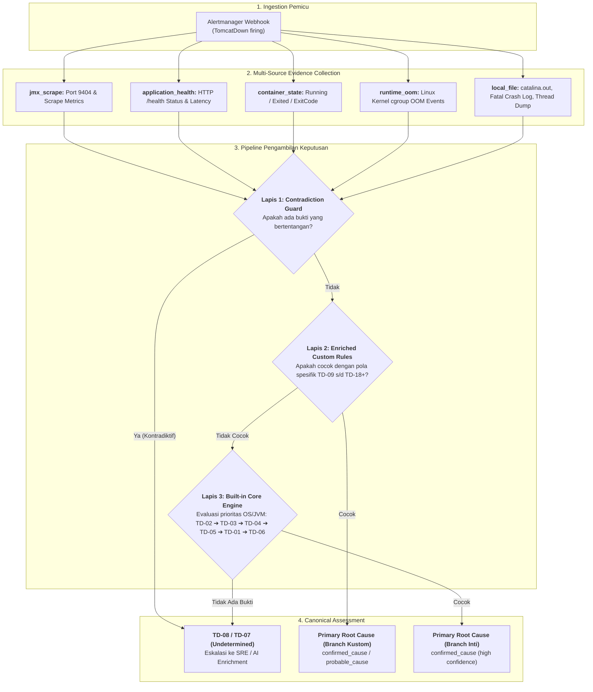
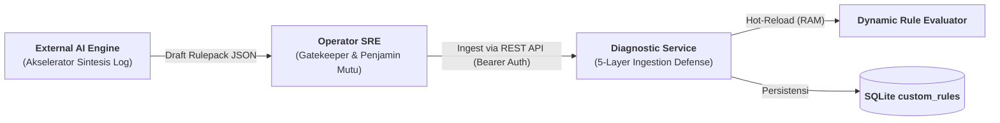

# Frequently Asked Questions (FAQ) & Arsitektur Diagnosis

Halaman ini mendokumentasikan pertanyaan yang sering diajukan (*Frequently Asked Questions*), prinsip arsitektur, dan panduan teknis mendalam mengenai platform **Tomcat Monitoring & Autonomous Diagnostic Platform**.

---

## 🎯 I. Decision Engine, Multi-Error & Penentuan Akar Masalah

### 1. Bagaimana cara sistem mendiagnosis akar masalah (*root cause*) saat terjadi situasi *multi-error* atau kegagalan beruntun (*cascading failure*)?

Dalam insiden produksi, satu kegagalan sering kali memicu serangkaian error turunan secara berantai (misal: *Database Backend Down* ➔ *Connection Pool Habis* ➔ *Thread Pool Habis* ➔ *Health Endpoint Timeout* ➔ *Prometheus Scrape Gagal*).

Sistem **tidak mengambil kesimpulan hanya dari satu log** atau melakukan tebakan spekulatif. Sebaliknya, sistem menjalankan **alur evaluasi berbasis bukti bertingkat (*multi-source deterministic pipeline*)**:



1. **Pengumpulan Bukti Multi-Dimensi:** Engine secara paralel mengumpulkan telemetri dari 5 adapter independen (`jmx_scrape`, `application_health`, `container_state`, `runtime_oom`, dan `local_file`).
2. **Penyaringan Kontradiksi (*Contradiction Guard*):** Memastikan tidak ada anomali sensor (misal kontainer dilaporkan *running* sekaligus *exited*).
3. **Pencocokan Pola Spesifik (*Enriched Rules*):** Aturan yang menargetkan tanda tangan error spesifik pada berkas log aplikasi (`local_file`) didahulukan daripada metrik hilir umum.
4. **Evaluasi Prioritas Inti (*Built-in Cascade*):** Jika tidak ada custom rule yang cocok, engine mengevaluasi kegagalan tingkat OS (OOM Kill), JVM (Fatal Crash), dan Container (Port Conflict, Orderly Shutdown) secara berurutan.

---

### 2. Bagaimana sistem membedakan akar masalah (*root cause*) dari gejala turunan (*symptoms / contributing factors*)?

Sistem menggunakan **Taksonomi Klasifikasi Formal** pada model data [Diagnostic Result Contract](diagnostic-mvp/diagnostic-result-and-confidence-contract.md):

* **`confirmed_cause` (Keyakinan: `high`):** Bukti langsung dan tak terbantahkan bahwa peristiwa inilah yang mematikan atau melumpuhkan proses Tomcat (misal: *Linux cgroup OOM Killer*, *Fatal JVM Crash SIGSEGV*, *Java Thread Deadlock*).
* **`probable_cause` (Keyakinan: `medium` / `high`):** Bukti kuat menunjukkan peristiwa ini sebagai pemicu utama kegagalan hulu (misal: *Database Connection Pool Exhausted*, *SSL Handshake Failure*).
* **`possible_cause` (Keyakinan: `low` / `medium`):** Anomali terdeteksi (misal: *long pause GC* atau jeda waktu respon), namun belum cukup bukti definitif bahwa Tomcat mati.
* **`contributing_factor` / `symptom`:** Gejala turunan atau efek domino yang muncul akibat akar masalah utama. Seluruh gejala ini **tetap dicatat dalam larik bukti (*evidence array*)** sebagai konteks forensik pelengkap tanpa mengaburkan kesimpulan utama (*primary assessment*).
* **`undetermined` (Keyakinan: `null`):** Bukti tidak cukup atau pola belum dikenali. Sistem menolak berspekulasi demi menjaga keandalan diagnosis (*no false diagnosis*).

---

### 3. Bagaimana jika bukti telemetri saling bertentangan (*contradicting telemetry*)?

Jika sistem mendeteksi kondisi yang secara fisik mustahil terjadi bersamaan (misalnya adapter `container_state` mendeteksi kontainer berstatus `running`, namun secara simultan terdeteksi `exited`; atau HTTP `/health` merespons `UP` tetapi koneksi TCP dinyatakan terputus):

* **Keputusan Aman (*Fail-Safe Decision*):** Sistem tidak memilih salah satu secara acak, melainkan menetapkan cabang **`TD-08 (Contradicting State / Undetermined)`** dengan klasifikasi `undetermined`.
* **Pencatatan Anomali:** Anomali dicatat secara eksplisit pada blok `contradictions` di dalam Canonical Result.
* **Tindakan SRE:** Notifikasi email akan meminta operator melakukan verifikasi manual langsung ke host target tanpa memberikan rekomendasi remediasi yang berpotensi keliru.

---

### 4. Mengapa engine tidak menggunakan *machine learning black-box* atau skor probabilitas angka acak untuk menentukan akar masalah?

Platform mengadopsi prinsip **Deterministic & Explainable SRE Operations**:
1. **Auditabilitas & Akuntabilitas:** Tim SRE wajib mengetahui dengan pasti *mengapa* sistem mengambil keputusan tertentu berdasarkan bukti fisik yang dapat diverifikasi (file log, baris error, exit code).
2. **Reproducibility:** Bukti yang sama dievaluasi dengan versi aturan yang sama dijamin 100% selalu menghasilkan kesimpulan yang identik (*deterministic idempotency*).
3. **Pencegahan Halusinasi:** Model *black-box* berisiko menghasilkan rekomendasi mitigasi yang salah (*false positive/negative*) saat menghadapi pola log yang ambigu di level produksi.

---

## 🤖 II. Tata Kelola AI Knowledge Enrichment & Manajemen Rulepack

### 5. Mengapa sistem mengadopsi prinsip *Human-in-the-Loop Governance* alih-alih membiarkan AI mengubah kode runtime secara langsung?

Arsitektur tata kelola pengetahuan (*Knowledge Governance*) dirancang dengan memisahkan peran secara tegas:



* **AI sebagai Akselerator Analisis:** Bertugas merumuskan pola log (*regex/substring*), kategori failure domain, dan langkah mitigasi SOP Bahasa Indonesia dari data forensik insiden.
* **Operator SRE sebagai Otoritas Tertinggi (*Gatekeeper*):** Memvalidasi keamanan pola regex (pencegahan ReDoS), memastikan ID branch tidak bertabrakan, dan mengevaluasi kelayakan langkah operasional sebelum diaktifkan ke runtime produksi.
* **Stabilitas Sistem:** AI tidak memiliki akses menulis langsung ke server, database, atau source code layanan.

---

### 6. Bagaimana alur operasional rekan SRE yang ingin mengakses sistem dari laptop masing-masing?

Diagnostic Service mengekspos endpoint REST API standar melalui port TLS `8443` (`https://<DIAGNOSTIC_HOST>:8443/api/v1/rules`), sehingga operator dapat berinteraksi langsung menggunakan tool standar seperti `curl` tanpa perlu memasang dependensi khusus:

#### A. Ekspor Master Catalog:
```bash
curl -k -s -H "Authorization: Bearer test-token-12345" \
  https://<SERVER_IP>:8443/api/v1/rules > ~/master-rules.json
```

#### B. Prompting AI & Formulasi Rule:
SRE memasukkan berkas `~/master-rules.json` dan bukti log insiden ke AI (ChatGPT / Claude / Gemini) menggunakan template prompt resmi pada [Runbook Operasional](operations/ai-knowledge-enrichment-and-rule-management-runbook.md).

#### C. Ingest Aturan Baru (*Hot-Reload*):
```bash
curl -k -s -X POST https://<SERVER_IP>:8443/api/v1/rules \
  -H "Authorization: Bearer test-token-12345" \
  -H "Content-Type: application/json" \
  -d @~/proactive-rules.json
```

---

### 7. Bagaimana pertahanan *5-Layer Ingestion Defense-in-Depth* melindungi sistem?

Setiap payload aturan yang dikirim ke endpoint `POST /api/v1/rules` wajib melewati 5 lapis proteksi ketat sebelum diizinkan aktif:

| Lapis Pertahanan | Mekanisme Validasi | Tindakan Jika Melanggar |
| :--- | :--- | :---: |
| **Layer 1: Auth Guard** | Memeriksa validitas header `Authorization: Bearer <token>` terhadap kredensial resmi. | `401 Unauthorized` |
| **Layer 2: Schema Guard** | Validasi skema JSON via pustaka Ajv terhadap `rulepack-v1.schema.json` (memeriksa properti wajib, tipe data, enum klasifikasi, dan pola regex). | `400 Bad Request` |
| **Layer 3: Collision Guard** | Mencegah penimpaan cabang bawaan immutable (`TD-01` s/d `TD-08`) dan mendeteksi duplikasi cabang kustom yang sudah terdaftar. | `409 Conflict` |
| **Layer 4: Size Guard** | Membatasi ukuran payload maksimum 64 KB per aturan untuk mencegah serangan kejenuhan memori (*Memory Exhaustion / DoS*). | `413 Payload Too Large` |
| **Layer 5: Immutability Guard** | Menegakkan prinsip *append-only*. Endpoint menolak seluruh operasi modifikasi (`PUT`) atau penghapusan (`DELETE`). | `405 Method Not Allowed` |

---

### 8. Bagaimana sistem menangani duplikasi saat proses *batch ingestion* dilakukan?

Pada mode *batch ingestion* (mengirimkan array JSON berisi banyak aturan sekaligus):
* Sistem memproses setiap aturan secara terisolasi (*atomic per-rule validation*).
* Aturan baru yang valid akan disimpan dan mengembalikan status `201 Created`.
* Aturan yang branch ID atau namanya sudah pernah terdaftar sebelumnya akan **dilewati secara otomatis (*graceful skip*)** dengan status `409 Conflict`, tanpa membatalkan atau menggagalkan proses aturan baru lainnya dalam batch tersebut.

---

## 🔐 III. Keamanan Data, Batas Sumber Daya & Keandalan Operasional

### 9. Bagaimana Diagnostic Service mencegah kebocoran data sensitif (*credential / secret redaction*)?

Diagnostic Service menerapkan prinsip **Bounded & Sanitized Data Collection**:
1. **Penyaringan Otomatis (*Redaction Masking*):** Pola teks yang menyerupai *password*, *token*, *API key*, *private key*, dan *session cookie* disamarkan secara otomatis sebelum disimpan ke database SQLite atau dikirim ke notifikasi email.
2. **Kapasitas Cuplikan Terbatas (*Bounded Excerpts*):** Pembacaan log dibatasi secara ketat (maksimal 64 KB per berkas / 100 baris terakhir). Engine dilarang membaca atau menyimpan keseluruhan dump log yang tidak terbatas (*unbounded dumps*).
3. **Instruksi Mitigasi Non-Eksekutif:** Seluruh `recommendedActions` hanya berupa teks panduan SOP untuk operator manusia dan tidak pernah dieksekusi secara otomatis oleh sistem, mencegah risiko eksekusi perintah berbahaya (*arbitrary code execution*).

---

### 10. Mengapa webhook Alertmanager diproses secara asinkron dengan antrean *Bounded Queue* dan SQLite?

Untuk menjamin keandalan dan mencegah *bottleneck* performa:
* **Respons Instan (Fast Ingestion):** Saat menerima webhook dari Alertmanager, HTTP Ingestion Handler segera memvalidasi payload dan mengembalikan HTTP `202 Accepted` dalam hitungan milidetik.
* **Perlindungan Tekanan Balik (*Backpressure Protection*):** Antrean memori dibatasi kapasitasnya (*bounded queue*). Jika antrean penuh, webhook tetap tercatat aman di tabel persisten SQLite `diagnostic_events`.
* **Pemrosesan Terisolasi (*Dedicated Worker*):** Proses pengumpulan bukti log dan evaluasi keputusan dijalankan oleh *Diagnostic Worker* di latar belakang secara asinkron tanpa membebani thread HTTP server.

---

### 11. Apa perbedaan antara *Firing Diagnosis* dan *Resolved Notification*?

* **Firing Diagnosis:** Diterbitkan saat insiden pertama kali terjadi atau saat terjadi perubahan material (*material update*). Memuat 7 seksi laporan forensik mendalam (ringkasan insiden, klasifikasi akar masalah, bukti telemetri lengkap, anomali, dan 4 langkah SOP mitigasi terstruktur).
* **Resolved Notification:** Diterbitkan saat Alertmanager mengirimkan webhook pemulihan layanan (`status: "resolved"`). Notifikasi ini mengonfirmasi bahwa target telah kembali sehat (*healthy*), merujuk pada riwayat diagnosis firing sebelumnya, dan memberikan instruksi penutupan tiket insiden bagi operator.
