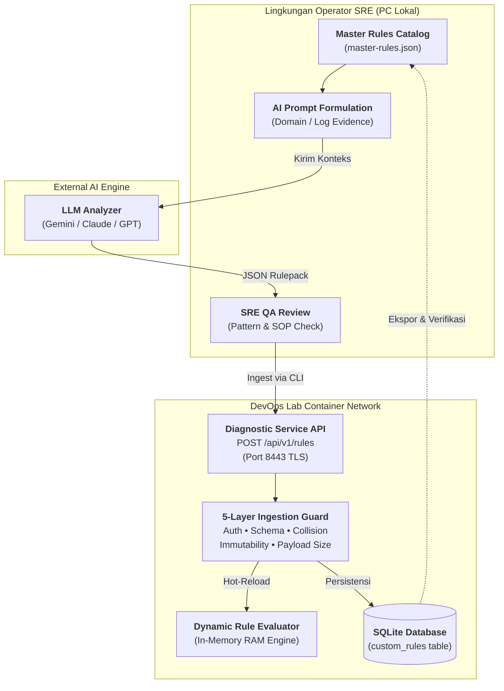
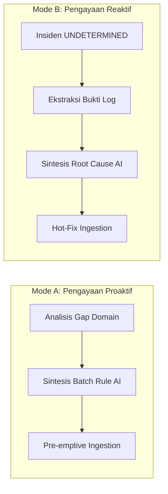
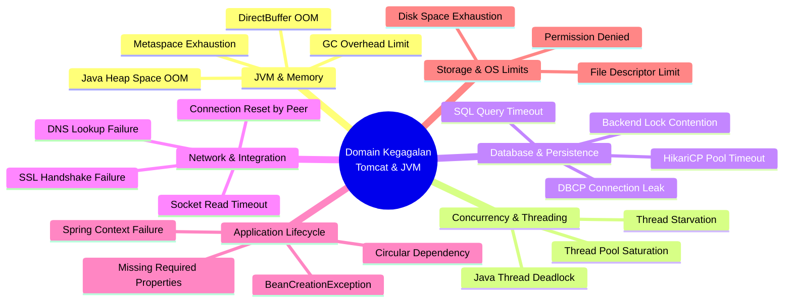
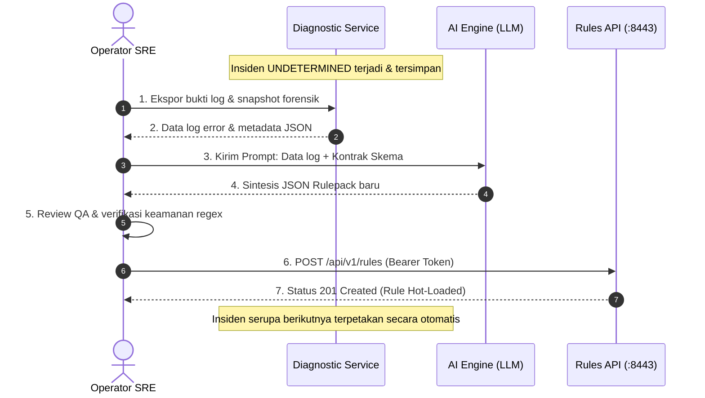

# Runbook: AI Knowledge Enrichment & Declarative Rule Management

## 🔍 Overview

Dokumen operasional (*runbook*) ini menetapkan prosedur standar bagi **Operator / Site Reliability Engineer (SRE)** dalam mengelola, memperkaya, memvalidasi, dan mengimpor basis pengetahuan diagnosis (*Declarative Rulepacks*) ke dalam **Tomcat Diagnostic Service** menggunakan pendekatan **Human-in-the-Loop AI Governance**.

Penerapan alur kerja ini memastikan bahwa pengembangan basis pengetahuan diagnosis dapat dilakukan secara mandiri, aman, dan teruji tanpa memerlukan restart layanan (*zero-downtime hot-reload*), serta terlindungi oleh sistem pengamanan berlapis (*5-Layer Ingestion Defense*).

---

## 🏛️ Arsitektur Human-in-the-Loop Governance

Arsitektur tata kelola pengetahuan memisahkan peran antara akselerasi kecerdasan buatan (*AI synthesis*), kendali verifikasi manusia (*SRE gatekeeper*), dan determinisme mesin (*deterministic engine*):



### 📋 Empat Pilar Tata Kelola Operasional

1. **AI sebagai Akselerator Analisis:** Bertugas merumuskan pola log (*regex/substring*) dan langkah mitigasi SOP berbasis data forensik insiden atau taksonomi domain kegagalan.
2. **Operator SRE sebagai Otoritas Tertinggi (*Gatekeeper*):** Memverifikasi keabsahan logika diagnosis, memeriksa keunikan pola, dan mengeksekusi *ingestion* dengan kredensial resmi.
3. **5-Layer Ingestion Defense-in-Depth:** Memastikan setiap aturan yang masuk melalui API tervalidasi secara ketat terhadap autentikasi token, kepatuhan skema JSON, pencegahan tabrakan *branch* bawaan (`TD-01` s/d `TD-08`), batas ukuran memori (maks. 64 KB), dan sifat *append-only*.
4. **Zero-Downtime Hot-Reload:** Aturan yang berhasil di-ingest langsung aktif seketika di memori engine (*RAM*) dan tersimpan permanen di database SQLite `custom_rules` tanpa perlu me-restart container layanan.

---

## 🔄 Dua Mode Pengayaan Pengetahuan (*Enrichment Modes*)

Operator dapat memperkaya basis pengetahuan diagnosis melalui dua pendekatan komplementer:



### 1. Mode A: Pengayaan Proaktif (*Pre-emptive Domain Engineering*)

Pengayaan proaktif bertujuan melengkapi pustaka aturan diagnosis **sebelum insiden nyata terjadi** di lingkungan produksi. Ketika insiden pertama kali muncul, sistem langsung memberikan diagnosis deterministik (`confirmed_cause`) dan SOP mitigasi seketika tanpa jatuh ke status `UNDETERMINED`.



### 2. Mode B: Pengayaan Reaktif (*Incident-Driven Post-Mortem*)

Pengayaan reaktif dilakukan saat Diagnostic Service menerima insiden baru yang belum terpetakan dalam basis aturan (*unmapped failure pattern*), sehingga diklasifikasikan sebagai `UNDETERMINED` (`Branch TD-08`).



---

## 🧭 Implementation & Operating Plan

| Tahap | Rencana Operasional |
| --- | --- |
| **Export Master Catalog** | Mengambil salinan berkas katalog master aktif dari Diagnostic Service ke PC lokal operator. |
| **Formulate AI Prompting Context** | Menyusun konteks prompt terstruktur (proaktif per domain atau reaktif per insiden) ke AI Engine. |
| **Conduct SRE QA Review** | Melakukan evaluasi kepatuhan (*gatekeeping review*) terhadap JSON Rulepack yang dihasilkan AI. |
| **Ingest Rulepack via API** | Mengimpor berkas JSON (single rule / batch array) ke Diagnostic Service dengan Bearer Token. |
| **Verify Hot-Reload & Sync** | Memverifikasi ketersediaan aturan di runtime dan menyinkronkan kembali katalog master lokal di PC. |

---

## ⚙️ Prosedur Standar Operasional (Implementation Stages)

<div class="procedure-sequence" markdown>

<div class="procedure-step" markdown>

### Export & Backup Master Catalog

**Action:** Mengambil salinan seluruh aturan diagnosis aktif dari Diagnostic Service dan menyimpannya ke direktori kerja PC lokal operator.

```bash
/home/eddywiyatno/git/tomcat-monitoring/scripts/export-rules.sh > ~/master-rules.json
```

!!! success "Expected Result"

    Berkas `master-rules.json` tersimpan di PC lokal operator dalam format JSON terstruktur yang memuat seluruh deklarasi aturan aktif (`TD-09` s/d `TD-18`).

</div>

<div class="procedure-step" markdown>

### Formulate AI Prompting Context

**Action:** Menyusun prompt terstandarisasi yang memuat ringkasan branch yang ada, target domain kegagalan atau data log insiden riil, serta batasan kontrak skema JSON yang wajib dipatuhi AI Engine.

#### A. Template Prompt Proaktif (Per Domain)
````markdown
Kamu adalah Principal JVM & Tomcat SRE Architect.
Saya sedang melakukan PROACTIVE KNOWLEDGE ENRICHMENT untuk Tomcat Diagnostic Service.

Berikut adalah ringkasan branch aturan yang telah aktif di sistem:
- TD-01 s/d TD-08: Built-in Scrape, OOM Kill, JVM Crash, Port Bind, Orderly Stop, Undetermined.
- TD-09 s/d TD-18: Database Pool Exhausted, Thread Pool Exhausted, Heap OOM, Metaspace OOM, SSL Handshake, HikariCP Timeout, Context Init Failure, Thread Deadlock, Socket Read Timeout, SQL Timeout.

--- TUGAS PROAKTIF ---
Rancang kumpulan Declarative Rulepack baru untuk domain: [PILIH DOMAIN: Misal OS Limits / Spring Framework / Network].
Rumuskan 3-5 failure patterns yang paling sering terjadi di level production.

--- KONTRAK SCHEMA (WAJIB DIPATUHI) ---
1. "branch": ID branch baru kelanjutan (misal: "TD-19", "TD-20", dst).
2. "ruleName": Nama unik PascalCase/camelCase deskriptif.
3. "targetSource": "local_file"
4. "pattern": Substring unik atau regex aman (tidak boleh mengandung nested quantifier).
5. "assessment": Ringkasan akar masalah dalam 1 kalimat padat.
6. "classification": Wajib "confirmed_cause" atau "probable_cause".
7. "confidence": "high" (jika confirmed_cause) atau "medium" (jika probable_cause).
8. "recommendedActions": Array 4 langkah mitigasi SOP Bahasa Indonesia terstruktur.
9. "createdBy": "sre-proactive-enrichment"

Keluarkan HANYA satu blok Array JSON valid: [ {...}, {...} ] tanpa teks pengantar di luar blok.
````

#### B. Template Prompt Reaktif (Berdasarkan Insiden Riil)
````markdown
Kamu adalah Enterprise SRE Expert untuk platform Tomcat Diagnostic.
Terdapat insiden kegagalan baru yang saat ini berstatus UNDETERMINED.

--- BUKTI LOG ERROR INSIDEN ---
<TEMPELKAN CUPLIKAN LOG ERROR ATAU STACK TRACE DI SINI>

--- TUGAS REAKTIF ---
1. Analisis bukti log error di atas dan tentukan akar masalah utamanya.
2. Buatkan 1 Declarative Rulepack JSON valid dengan nomor branch lanjutan (misal: "TD-19").
3. Pastikan pola "pattern" unik dan spesifik untuk mencocokkan error tersebut.
4. Sertakan 4 langkah mitigasi SOP Bahasa Indonesia terstruktur.
5. Keluarkan HANYA satu blok JSON tunggal {...} sesuai kontrak skema.
````

!!! success "Expected Result"

    AI Engine menghasilkan output berupa blok JSON mentah (*single object* atau *batch array*) yang mematuhi 9 properti wajib tanpa teks naratif di luar blok JSON.

</div>

<div class="procedure-step" markdown>

### Conduct SRE QA & Gatekeeping Review

**Action:** Melakukan tinjauan kualitas dan keamanan (*quality assurance & gatekeeping*) terhadap output JSON yang dihasilkan AI sebelum dieksekusi ke runtime Diagnostic Service.

**Daftar Periksa Kepatuhan (*Verification Checklist*):**
* [x] **Branch Safety:** Nilai `branch` tidak menggunakan rentang terproteksi `TD-01` s/d `TD-08`.
* [x] **Pattern Precision:** Pola `pattern` spesifik dan tidak menimbulkan potensi salah deteksi (*false positive*).
* [x] **ReDoS Prevention:** Pola regex bebas dari konstruksi rawan ledakan komputasi (*nested quantifier* seperti `(a+)+` atau `([a-z]+)*`).
* [x] **Classification & Confidence Mapping:** Nilai klasifikasi selaras dengan tingkat keyakinan (`confirmed_cause` wajib berpasangan dengan `high`).
* [x] **Operational Actionability:** Rekomendasi mitigasi pada `recommendedActions` jelas, aman, terurut secara logis, dan dapat dieksekusi operator.

!!! success "Expected Result"

    Seluruh butir daftar periksa terpenuhi (*100% compliant*) dan berkas JSON siap untuk proses *ingestion*.

</div>

<div class="procedure-step" markdown>

### Ingest Rulepack via Diagnostic API

**Action:** Mengirimkan payload JSON yang telah divalidasi ke endpoint `POST /api/v1/rules` pada Diagnostic Service menggunakan helper CLI [`scripts/ingest-rule.sh`](file:///home/eddywiyatno/git/tomcat-monitoring/scripts/ingest-rule.sh) dengan kredensial Bearer Token resmi operator.

#### Ingest Berkas Batch Array (Mode Proaktif)
```bash
BEARER_TOKEN="test-token-12345" /home/eddywiyatno/git/tomcat-monitoring/scripts/ingest-rule.sh ~/proactive-rules.json
```

#### Ingest Berkas Tunggal (Mode Reaktif)
```bash
BEARER_TOKEN="test-token-12345" /home/eddywiyatno/git/tomcat-monitoring/scripts/ingest-rule.sh ~/rule-td19.json
```

#### Ingest Langsung via Stdin Pipe
```bash
cat ~/new-rule.json | BEARER_TOKEN="test-token-12345" /home/eddywiyatno/git/tomcat-monitoring/scripts/ingest-rule.sh -
```

!!! success "Expected Result"

    Endpoint mengembalikan HTTP status `201 Created`. Aturan baru langsung ter-rehidrasi di memori `DynamicRuleEvaluator` secara *hot-reload* dan tercatat permanen di tabel SQLite `custom_rules`. Pada mode batch, aturan yang sudah terdaftar akan dilewati (`409 Conflict`) tanpa memutus alur aturan lainnya.

</div>

<div class="procedure-step" markdown>

### Verify Hot-Reload & Synchronize Master Catalog

**Action:** Memverifikasi ketersediaan aturan baru di lingkungan runtime dan memperbarui berkas master catalog di PC lokal operator.

```bash
# 1. Verifikasi aturan spesifik yang baru di-ingest
/home/eddywiyatno/git/tomcat-monitoring/scripts/export-rules.sh TD-19

# 2. Sinkronkan seluruh katalog master ke PC lokal operator
/home/eddywiyatno/git/tomcat-monitoring/scripts/export-rules.sh > ~/master-rules.json
```

!!! success "Expected Result"

    Diagnostic Service menyajikan metadata aturan `TD-19` secara presisi, dan berkas `~/master-rules.json` di PC lokal operator berada dalam status mutakhir (*up-to-date*).

</div>

</div>

---

## 📊 Matriks Master Knowledge Base Terkurasi (18 Branches)

Tabel berikut merangkum 18 cabang aturan diagnosis aktif yang saat ini telah terverifikasi di lingkungan *DevOps Lab*:

| Branch | Nama Rule (*Rule Identifier*) | Pola Bukti Error (*Pattern*) | Klasifikasi & Keyakinan | SOP Rekomendasi Mitigasi Operator |
| :---: | :--- | :--- | :---: | :--- |
| **`TD-01`** | `ScrapeTlsUnavailable` *(Built-in)* | Port 9404 unreachable / TLS fail | `confirmed_cause`<br/>*(high)* | Periksa port binding, sertifikat TLS, dan konektivitas scraper Prometheus. |
| **`TD-02`** | `OOMKilled` *(Built-in)* | Exit 137 / cgroup OOM event | `confirmed_cause`<br/>*(high)* | Periksa limit memori container host, alokasi JVM, dan cgroup bounds. |
| **`TD-03`** | `JvmCrash` *(Built-in)* | `hs_err_pid*.log` / SIGSEGV / exit 134 | `confirmed_cause`<br/>*(high)* | Analisis fatal crash dump JVM dan kompatibilitas native library APR. |
| **`TD-04`** | `PortBindConflict` *(Built-in)* | `BindException: Address already in use` | `confirmed_cause`<br/>*(high)* | Periksa port collision pada host port 8080/9404 dan proses zombie. |
| **`TD-05`** | `OrderlyShutdown` *(Built-in)* | Exit 143 / SIGTERM orderly stop | `confirmed_cause`<br/>*(high)* | Verifikasi proses deployment atau shutdown terjadwal yang disengaja. |
| **`TD-06`** | `ContainerExitedUnknown` *(Built-in)* | Container exited tanpa bukti spesifik | `undetermined`<br/>*(none)* | Periksa status cgroup, runtime container engine, dan log host. |
| **`TD-07`** | `ContradictingState` *(Built-in)* | Telemetri saling bertentangan | `undetermined`<br/>*(none)* | Lakukan verifikasi manual langsung ke target endpoint runtime aplikasi. |
| **`TD-08`** | `UndeterminedEvidence` *(Built-in)* | Bukti tidak cukup / pola asing | `undetermined`<br/>*(none)* | Ekspor data forensik insiden ke AI untuk perumusan rulepack baru. |
| **`TD-09`** | `DatabasePoolExhausted` *(Enriched)* | `CannotGetJdbcConnectionException` | `confirmed_cause`<br/>*(high)* | Periksa utilisasi database backend, kapasitas `maxTotal`, dan connection leak. |
| **`TD-10`** | `ThreadPoolExhausted` *(Enriched)* | `RejectedExecutionException: Thread pool is exhausted` | `confirmed_cause`<br/>*(high)* | Ambil thread dump JVM, sesuaikan parameter `maxThreads`, dan evaluasi traffic spike. |
| **`TD-11`** | `JavaHeapSpaceOOM` *(Enriched)* | `OutOfMemoryError: Java heap space` | `confirmed_cause`<br/>*(high)* | Analisis heap dump (.hprof) via Eclipse MAT, naikkan alokasi `-Xmx`. |
| **`TD-12`** | `MetaspaceOOM` *(Enriched)* | `OutOfMemoryError: Metaspace` | `confirmed_cause`<br/>*(high)* | Periksa ClassLoader leak, batasi dynamic bytecode generator, naikkan `-XX:MaxMetaspaceSize`. |
| **`TD-13`** | `SSLHandshakeFailure` *(Enriched)* | `javax.net.ssl.SSLHandshakeException` | `confirmed_cause`<br/>*(high)* | Periksa validitas sertifikat backend, perbarui truststore `/conf/truststore.p12`. |
| **`TD-14`** | `HikariPoolTimeout` *(Enriched)* | `Connection is not available, request timed out` | `confirmed_cause`<br/>*(high)* | Aktifkan `leakDetectionThreshold`, tingkatkan `maximumPoolSize`, periksa database lock. |
| **`TD-15`** | `ContextInitFailure` *(Enriched)* | `LifecycleException: Failed to start component` | `confirmed_cause`<br/>*(high)* | Periksa berkas `web.xml`, Spring context, kelengkapan `WEB-INF/lib`, dan file permission. |
| **`TD-16`** | `JavaThreadDeadlock` *(Enriched)* | `Found one Java-level deadlock` | `confirmed_cause`<br/>*(high)* | Ambil thread dump (`jstack`), analisis siklus lock graph, perbaiki urutan sinkronisasi kode. |
| **`TD-17`** | `SocketReadTimeout` *(Enriched)* | `SocketTimeoutException: Read timed out` | `confirmed_cause`<br/>*(high)* | Periksa latency upstream API, sesuaikan `connectTimeout`/`readTimeout`, pasang Circuit Breaker. |
| **`TD-18`** | `SQLQueryTimeout` *(Enriched)* | `java.sql.SQLTimeoutException` | `confirmed_cause`<br/>*(high)* | Analisis slow query log, periksa missing index via `EXPLAIN ANALYZE`, periksa row lock. |

---

## 🛡️ Panduan Respon & Penanganan Error 5-Layer Guard

| HTTP Status | Kode Error (*Error Code*) | Akar Masalah | Tindakan Perbaikan Operator |
| :---: | :--- | :--- | :--- |
| **`201`** | `Created` | Payload valid, aturan berhasil di-ingest. | Tidak ada tindakan lanjutan. Aturan langsung aktif secara *hot-reload*. |
| **`401`** | `unauthorized` | Header `Authorization: Bearer <token>` salah, kedaluwarsa, atau tidak dikirim. | Pastikan variabel `BEARER_TOKEN` yang dikirim cocok dengan token rahasia yang terkonfigurasi. |
| **`400`** | `invalid_rule_schema` | Struktur JSON tidak lengkap, tipe data salah, atau nilai enum tidak valid. | Periksa apakah seluruh properti wajib (`branch`, `ruleName`, `targetSource`, `pattern`, `assessment`, `classification`, `confidence`, `recommendedActions`, `createdBy`) telah lengkap dan sesuai tipe data. |
| **`400`** | `unsafe_regex_pattern` | Pola `pattern` mengandung konstruksi regex berbahaya yang berisiko *ReDoS*. | Sederhanakan pola regex atau gunakan pencocokan substring teks langsung. |
| **`409`** | `rule_branch_conflict` | ID `branch` bertabrakan dengan branch *built-in* (`TD-01` s/d `TD-08`) atau branch kustom yang telah tersimpan. | Gunakan nomor branch baru yang belum pernah terdaftar sebelumnya (misal: `TD-19`). |
| **`413`** | `payload_too_large` | Ukuran payload JSON melebihi ambang batas keamanan 64 KB. | Ringkas instruksi teks rekomendasi mitigasi atau perpendek pola pencocokan. |
| **`405`** | `Method Not Allowed` | Endpoint diakses menggunakan method HTTP yang tidak diizinkan (`PUT`, `DELETE`, `PATCH`). | Basis aturan bersifat *append-only* (*immutable*). Gunakan method `POST` untuk menambahkan aturan baru. |
