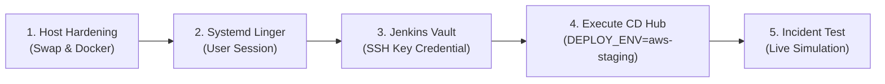

# SOP: Panduan Deployment Armada Cloud AWS (EC2 Free Tier)

| Metadata | Nilai |
| --- | --- |
| **Dokumen ID** | SOP-TM-OPS-003 |
| **Kategori** | Standar Operasional Prosedur (SOP) & Runbook |
| **Proyek** | Tomcat Monitoring |
| **Status** | Aktif / Disetujui |
| **Tanggal Efektif** | 2026-09-14 |
| **Pemilik Prosedur** | Tim DevOps & Platform Engineering |

---

## 🎯 Tujuan dan Ruang Lingkup

Dokumen Standar Operasional Prosedur (*Standard Operating Procedure* — SOP) ini memberikan panduan operasional langkah demi langkah bagi tim DevOps, SRE, dan Platform Engineers untuk menyebarkan (*deploy*), mengonfigurasi, dan memelihara armada tumpukan Tomcat Monitoring pada instans **Amazon EC2 (AWS Free Tier - `t2.micro`)** atau lingkungan cloud publik sejenis.

Prosedur ini mencakup penguatan host (*host hardening*), partisi swap memori, konfigurasi runtime Docker Engine, pendaftaran kredensial Jenkins, eksekusi pipeline CD deklaratif, dan verifikasi pasca-deploy.

---

## 📋 Prasyarat Infrastruktur AWS

Sebelum menjalankan deployment, pastikan hal-hal berikut telah tersedia:

1. **Instans Amazon EC2:**
   - Tipe: `t2.micro` (1 vCPU, 1 GiB RAM).
   - Sistem Operasi: **Amazon Linux 2023 (AL2023)** AMI 64-bit (x86_64).
   - Security Group Inbound Rules:
     - SSH: TCP Port `22` (dibatasi ke IP Controller / CI Runner).
   - Kunci SSH Kredensial: Berkas RSA Private Key (`.pem`) tersimpan aman dengan izin `0400`.
2. **Akses Jenkins Controller:**
   - Jenkins Controller aktif dengan koneksi ke Git Server dan Agen DooD `builder-01`.
   - Plugin SSH Credentials dan Pipeline Credentials terpasang.

---

## 🛠️ Langkah-Langkah Operasional Deployment



---

### 1. Pre-Flight Host Hardening pada AWS EC2 Target

Hubungkan terminal ke instans EC2 melalui SSH dan jalankan perintah penguatan berikut:

```bash
# 1. Hubungkan ke instans
ssh -i ~/.ssh/tomcat-monitoring-aws-key.pem ec2-user@<PUBLIC_IP_EC2>

# 2. Alokasikan 2GB Swap Memory (Mencegah OOM Killer pada t2.micro)
sudo dd if=/dev/zero of=/swapfile bs=128M count=16
sudo chmod 600 /swapfile
sudo mkswap /swapfile
sudo swapon /swapfile
echo '/swapfile swap swap defaults 0 0' | sudo tee -a /etc/fstab
sudo sysctl vm.swappiness=10
echo 'vm.swappiness=10' | sudo tee -a /etc/sysctl.d/99-swap.conf

# 3. Instalasi Docker Engine dan Git
sudo dnf install -y docker git
sudo systemctl enable --now docker
sudo usermod -aG docker ec2-user

# 4. Aktifkan Systemd User Lingering dan Refresh Session Bus
sudo loginctl enable-linger ec2-user
sudo systemctl restart user@1000.service
```

---

### 2. Registrasi Kredensial SSH pada Jenkins Controller

1. Buka dashboard Jenkins: `http://localhost:8080` $\rightarrow$ **Manage Jenkins** $\rightarrow$ **Credentials** $\rightarrow$ **System** $\rightarrow$ **Global credentials (unrestricted)**.
2. Klik **Add Credentials**:
   - **Kind:** `SSH Username with private key`
   - **ID:** `aws-ec2-ssh-key`
   - **Description:** `AWS EC2 SSH Key for Remote Fleet Provisioning`
   - **Username:** `ec2-user`
   - **Private Key:** Pilih *Enter directly* dan tempelkan seluruh isi berkas `.pem`.
3. Klik **Create**.

---

### 3. Konfigurasi Inventori Ansible

Pastikan berkas inventori target telah dikonfigurasi pada repositori `tomcat-monitoring`:

- **Berkas:** [`inventories/aws-staging.ini`](file:///home/eddywiyatno/git/tomcat-monitoring/inventories/aws-staging.ini)
```ini
[monitoring_nodes]
aws-ec2-mon-01 ansible_host=98.81.129.144 ansible_user=ec2-user

[all:vars]
ansible_python_interpreter=/usr/bin/python3
ansible_ssh_common_args='-o StrictHostKeyChecking=no'
ansible_ssh_private_key_file="{{ lookup('env', 'ANSIBLE_SSH_KEY_FILE') | default('/home/eddywiyatno/.ssh/tomcat-monitoring-aws-key.pem', true) }}"
```

---

### 4. Eksekusi Deployment via Jenkins CD Pipeline

1. Buka job `tomcat-monitoring` pada Jenkins Controller (`http://localhost:8080/job/tomcat-monitoring/`).
2. Klik **Build with Parameters**.
3. Pilih parameter:
   - `DEPLOY_ENV`: `aws-staging` (atau `aws-production`).
4. Klik **Build**.
5. Jenkins akan secara otomatis:
   - Menjalankan Quality Gates (validasi sintaks shell dan Ansible).
   - Menginjeksikan kunci SSH dari Jenkins Credentials Store.
   - Menjalankan Ansible Thin Orchestrator via `scripts/run-ansible-playbook.sh`.
   - Menginisialisasi direktori, sertifikat TLS, dan volume di AWS EC2.
   - Menyebarkan kontainer OCI via `tmctl` dan daemon `tm-agent`.
   - Menjalankan verifikasi kesehatan 6 endpoint via SSH.

---

### 5. Verifikasi Operasional & Simulasi Insiden

Untuk membuktikan alur investigasi insiden berjalan normal di lingkungan cloud:

```bash
# 1. Masuk ke node AWS EC2
ssh -i ~/.ssh/tomcat-monitoring-aws-key.pem ec2-user@<PUBLIC_IP_EC2>

# 2. Periksa status daemon tm-agent
systemctl --user status tm-agent.service

# 3. Simulasikan insiden TomcatDown
docker stop tomcat-jmx-exporter

# 4. Amati log penerimaan bukti di spool
ls -la ~/.local/share/tomcat-monitoring/spool/

# 5. Buka Web UI Mailpit di EC2 (atau via SSH Tunnel port 8025)
# ssh -L 8025:localhost:8025 -i ~/.ssh/tomcat-monitoring-aws-key.pem ec2-user@<PUBLIC_IP_EC2>
# Buka http://localhost:8025 di browser dan periksa Laporan Investigasi 7-Seksi SRE.

# 6. Pulihkan kontainer Tomcat
docker start tomcat-jmx-exporter
# Periksa penerimaan laporan [RESOLVED] di Mailpit.
```

---

## 📞 Penanganan Insiden & Troubleshooting

- **Kendala 1: `tm-agent` tidak dapat mengakses Docker socket (`permission denied`):**
  - Penyebab: User session manager belum memperbarui GID grup `docker`.
  - Tindakan: Jalankan `sudo systemctl restart user@1000.service` pada host EC2.
- **Kendala 2: Diagnostic Service gagal membuat SQLite database (`EACCES`):**
  - Penyebab: Named volume `diagnostic_data` dimiliki oleh `root:root`.
  - Tindakan: Jalankan `docker run --rm -v diagnostic_data:/data alpine chown -R 1000:1000 /data`.
- **Kendala 3: Postfix Relay error `postfix-ca.crt is a directory`:**
  - Penyebab: Docker membuat bind-mount non-existent file sebagai direktori.
  - Tindakan: Hapus direktori dummy (`rm -rf ~/.local/share/tomcat-monitoring/tls/postfix-ca.crt`) dan buat sebagai berkas kosong (`touch ~/.local/share/tomcat-monitoring/tls/postfix-ca.crt`).
