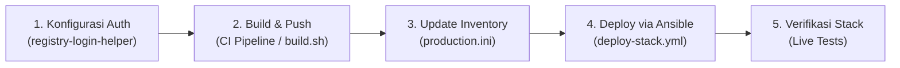

# SOP: Panduan Migrasi Enterprise Container Registry

| Metadata | Nilai |
| --- | --- |
| **Dokumen ID** | SOP-TM-OPS-002 |
| **Kategori** | Standar Operasional Prosedur (SOP) & Runbook |
| **Proyek** | Tomcat Monitoring |
| **Status** | Aktif / Disetujui |
| **Tanggal Efektif** | 2026-09-13 |
| **Pemilik Prosedur** | Tim DevOps & Platform Engineering |

---

## 🎯 Tujuan dan Ruang Lingkup

Dokumen Standar Operasional Prosedur (*Standard Operating Procedure* — SOP) ini memberikan panduan langkah demi langkah bagi perekayasa DevOps, SRE, dan sysadmin untuk memigrasikan deployment platform Tomcat Monitoring dari repositori citra lokal laboratorium (*localhost*) ke **Repositori Citra Enterprise Kantor (*Enterprise Container Registry*)** seperti VMware Harbor, Sonatype Nexus, Red Hat Quay, GitLab Container Registry, atau Gitea Registry.

Prinsip utama prosedur ini adalah **Zero Logic Modification**: seluruh proses migrasi dilakukan secara deklaratif murni hanya dengan mengubah berkas konfigurasi (`CONFIG` dan `inventories/production.ini`), tanpa mengubah satu baris pun kode pada skrip shell, Containerfile, Jenkinsfile, atau Ansible Tasks.

---

## 📋 Prasyarat Migrasi

Sebelum memulai migrasi, pastikan prasyarat teknis berikut telah terpenuhi:

1. **Akses ke Enterprise Container Registry:**
   - URL endpoint registri dapat dijangkau dari server target (contoh: `harbor.internal.corp:5000` atau `nexus.internal:8443`).
   - Akun otentikasi registri (*Robot Account* atau *Service Account*) telah memiliki izin `Push` dan `Pull` pada *project / namespace* target (misalnya: `tomcat-monitoring`).
2. **Sertifikat TLS Registri (Jika Menggunakan Internal Private CA):**
   - Berkas sertifikat root/intermediate CA perusahaan (misalnya `/etc/pki/ca-trust/source/anchors/corp-ca.crt` atau `/usr/local/share/ca-certificates/corp-ca.crt`) telah terpasang pada host atau diletakkan pada direktori certs.
3. **Ketersediaan Alat Pengendali (*Tools Readiness*):**
   - Podman / Docker terpasang pada peladen pengendali (*Ansible Controller* / *Jenkins Agent*).
   - Repositori platform [`tomcat-monitoring`](file:///home/eddywiyatno/git/tomcat-monitoring), [`tomcat-diagnostic-service`](file:///home/eddywiyatno/git/tomcat-diagnostic-service), dan [`ansible-controller`](file:///home/eddywiyatno/git/ansible-controller) telah berada pada branch versi stabil.

---

## 🛠️ Langkah-Langkah Operasional Migrasi



### 1. Autentikasi ke Enterprise Container Registry

Gunakan skrip pembantu autentikasi terisolasi untuk login tanpa mencemari konfigurasi global pengguna:

```bash
# Menggunakan helper autentikasi terisolasi
./scripts/registry-login-helper.sh login \
    "harbor.internal.corp:5000" \
    "robot-tomcat-monitoring" \
    "SecretTokenPassword123!" \
    "${HOME}/.config/containers/auth.json" \
    "true"
```

Jika menggunakan Jenkins Pipeline, daftarkan kredensial pada **Jenkins Credentials Store** dengan tipe *Username with Password* (misalnya dengan ID `harbor-robot-creds`).

---

### 2. Pembangunan dan Publikasi Citra ke Registri Kantor

Eksekusi pembangunan dan publikasi citra mikrokomponen menggunakan parameter registri:

#### A. Publikasi Diagnostic Service
```bash
cd /home/eddywiyatno/git/tomcat-diagnostic-service

# Eksekusi build dan push deklaratif
REGISTRY_URL="harbor.internal.corp:5000" \
REGISTRY_NAMESPACE="tomcat-monitoring" \
REGISTRY_TLS_VERIFY="true" \
REGISTRY_AUTH_FILE="${HOME}/.config/containers/auth.json" \
PUSH_IMAGE="true" \
./scripts/build.sh
```

#### B. Publikasi Alertmanager
```bash
cd /home/eddywiyatno/git/alertmanager

REGISTRY_URL="harbor.internal.corp:5000" \
REGISTRY_NAMESPACE="tomcat-monitoring" \
REGISTRY_TLS_VERIFY="true" \
REGISTRY_AUTH_FILE="${HOME}/.config/containers/auth.json" \
PUSH_IMAGE="true" \
./scripts/build.sh
```

#### C. Publikasi Ansible Controller
```bash
cd /home/eddywiyatno/git/ansible-controller

REGISTRY_URL="harbor.internal.corp:5000" \
REGISTRY_NAMESPACE="tomcat-monitoring" \
REGISTRY_TLS_VERIFY="true" \
REGISTRY_AUTH_FILE="${HOME}/.config/containers/auth.json" \
PUSH_IMAGE="true" \
./scripts/build.sh
```

---

### 3. Penyesuaian Berkas Konfigurasi Deklaratif Platform

Pada repositori [`tomcat-monitoring`](file:///home/eddywiyatno/git/tomcat-monitoring), lakukan penyesuaian berkas konfigurasi SSOT:

#### A. Penyesuaian `CONFIG`
Salin template [`CONFIG.example`](file:///home/eddywiyatno/git/tomcat-monitoring/CONFIG.example) ke `CONFIG` dan sesuaikan parameter registri:

```bash
# 0. Enterprise Container Registry Baseline
REGISTRY_URL="harbor.internal.corp:5000"
REGISTRY_NAMESPACE="tomcat-monitoring"
REGISTRY_TLS_VERIFY="true"
IMAGE_PULL_POLICY="Always"
REGISTRY_AUTH_FILE="${HOME}/.config/containers/auth.json"
```

#### B. Penyesuaian Inventori Ansible `production.ini`
Salin template [`inventories/production.ini.example`](file:///home/eddywiyatno/git/tomcat-monitoring/inventories/production.ini.example) ke `inventories/production.ini`:

```ini
[monitoring_core]
mon-prd-01.internal ansible_host=10.20.10.10 ansible_user=ansible

[tomcat_fleet]
tomcat-prd-01.internal ansible_host=10.20.20.11 ansible_user=ansible
tomcat-prd-02.internal ansible_host=10.20.20.12 ansible_user=ansible
tomcat-prd-03.internal ansible_host=10.20.20.13 ansible_user=ansible
tomcat-prd-04.internal ansible_host=10.20.20.14 ansible_user=ansible

[all:children]
monitoring_core
tomcat_fleet

[all:vars]
deploy_env=production
container_engine=podman

# Enterprise Container Registry Configuration
registry_host=harbor.internal.corp:5000
registry_ns=tomcat-monitoring
registry_tls_verify=true
image_pull_policy=Always
registry_auth_file=/home/ansible/.config/containers/auth.json
```

---

### 4. Eksekusi Deployment Menggunakan Ansible Playbook

Jalankan playbook deployment armada untuk menarik citra dari registri enterprise dan meluncurkan layanan:

```bash
cd /home/eddywiyatno/git/tomcat-monitoring

# 1. Validasi sintaksis sebelum eksekusi
./scripts/validate-ansible.sh

# 2. Eksekusi deployment stack ke lingkungan produksi
./scripts/run-ansible-playbook.sh deploy-stack.yml -i inventories/production.ini
```

---

## 🔍 Verifikasi dan Uji Pasca-Migrasi

Setelah deployment selesai, jalankan rangkaian pengujian verifikasi untuk membuktikan sistem beroperasi 100% normal di atas citra registri enterprise:

### 1. Verifikasi Kesiapan Endpoint Layanan (*Readiness Probes*)
Pastikan seluruh endpoint merespons `HTTP 200 OK`:
- Prometheus TSDB: `curl -s http://10.20.10.10:9090/-/ready`
- Alertmanager: `curl -s http://10.20.10.10:9093/-/ready`
- Diagnostic Service: `curl -sk https://10.20.10.10:8443/health`
- Tomcat JMX Exporter: `curl -sk https://10.20.20.11:9404/metrics`

### 2. Verifikasi Uji Alur Insiden Nyata (*Live Incident Simulation*)
Eksekusi pengujian insiden otomatis untuk memastikan rantai notifikasi dan analitik bekerja sempurna:

```bash
# Uji jembatan Postfix Enterprise SMTP Relay
bash ./scripts/verify-postfix-relay.sh

# Uji simulasi insiden TomcatDown dan pengiriman Laporan 7-Seksi SRE
bash ./scripts/test-tomcatdown-live.sh
```

---

## ⚠️ Penanganan Kendala (Troubleshooting)

| Gejala Kendala (*Symptom*) | Kemungkinan Penyebab (*Root Cause*) | Tindakan Remediasi (*Remediation*) |
| :--- | :--- | :--- |
| `x509: certificate signed by unknown authority` | Sertifikat TLS registri menggunakan internal CA yang belum dipercaya oleh host target. | Setel `REGISTRY_TLS_VERIFY="/path/ke/corp-ca.crt"` atau pasang CA pada sistem truststore host (`update-ca-trust` / `update-ca-certificates`). |
| `401 Unauthorized / Access denied` | Kredensial login salah, kadaluwarsa, atau berkas `--authfile` tidak terbaca. | Jalankan ulang `./scripts/registry-login-helper.sh login` dan pastikan izin berkas auth adalah `0600`. |
| `image not found / 404 Not Found` | Nama project/namespace pada registri belum dibuat atau berbeda dengan `REGISTRY_NAMESPACE`. | Buat project `tomcat-monitoring` pada antarmuka web Harbor/Nexus, atau sesuaikan `REGISTRY_NAMESPACE` pada berkas `CONFIG`. |
| `Container fails with ImagePullBackOff / pull error` | Host target tidak memiliki koneksi internet/intranet ke URL registri. | Periksa firewall dan rute DNS internal antara host target armada dengan server registri. |

---

## 🔗 Dokumen Terkait

- [Technical Note TN-010: Plug-and-Play Enterprise Container Registry Integration](../engineering-journal/continuous-integration-and-deployment/TN-010-implement-plug-and-play-container-registry-integration.md)
- [TM-ADR-0024: Decoupled Component CI & Orchestrated Stack CD Architecture](../../adr/tomcat-monitoring/adr-records/TM-ADR-0024.md)
- [TM-ADR-0025: Responsibilities Between Jenkins and Ansible](../../adr/tomcat-monitoring/adr-records/TM-ADR-0025.md)
- [TM-ADR-0026: Multi-Engine Container Runtime Portability](../../adr/tomcat-monitoring/adr-records/TM-ADR-0026.md)
- [Runbook: AI Knowledge Enrichment & Declarative Rule Management](ai-knowledge-enrichment-and-rule-management-runbook.md)
- [Follow-up Tasks Backlog](../follow-up-tasks.md)
