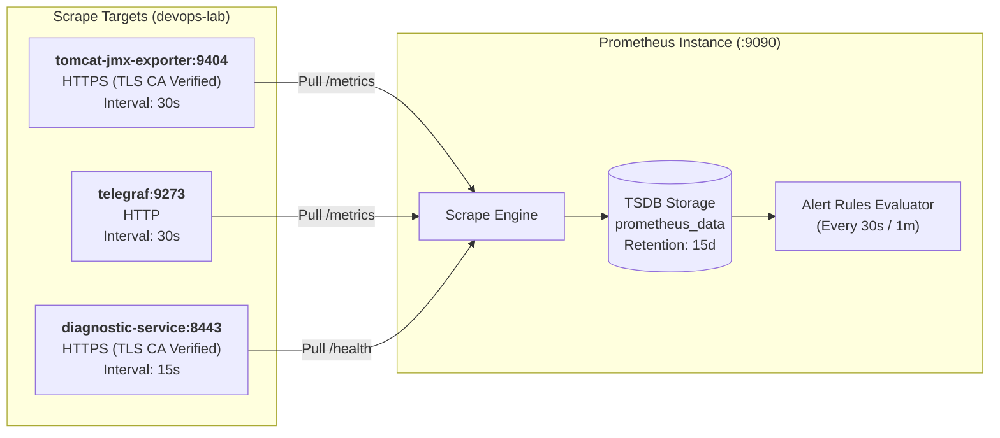

# Prometheus Metrics Catalog & PromQL Reference

## 🔍 Overview

Dokumen ini merupakan katalog referensi resmi (*Authoritative Prometheus Metrics Catalog & Operational PromQL Reference*) untuk seluruh metrik observabilitas yang dikumpulkan oleh **Prometheus** pada ekosistem platform **Tomcat Monitoring & Diagnostic Platform**.

Prometheus bertindak sebagai *Time Series Database* (TSDB) terpusat pada host yang mengumpulkan, mengevaluasi aturan ambang batas (*alert rules*), serta menyimpan data metrik historis secara persisten pada Podman Named Volume `prometheus_data` dengan masa retensi default **15 hari (`15d`)**.

---

## 🏛️ Konfigurasi Target Scrape & Siklus Pengumpulan

Prometheus dikonfigurasi (`config/prometheus/prometheus.yml`) untuk mengumpulkan metrik secara periodik dari 3 target utama:



---

## ☕ 1. Target: `tomcat-jmx-exporter` (Tomcat & JVM Runtime)

Target ini diekspos oleh Java Agent JMX Exporter pada endpoint HTTPS `https://tomcat-jmx-exporter:9404/metrics` dengan verifikasi TLS internal (`jmx-exporter-ca.crt`).

### A. JVM Memory & Pool Allocations (Sinyal Emas Memori)

| Nama Metrik | Tipe | Label Kunci | Deskripsi Fungsional |
| :--- | :---: | :--- | :--- |
| **`jvm_memory_heap_used_bytes`** | Gauge | `area="heap"` | Kapasitas memori Heap yang sedang digunakan saat ini oleh objek aplikasi (Bytes). |
| **`jvm_memory_bytes_used`** | Gauge | `area="heap"`, `area="nonheap"` | Kapasitas memori terpakai pada area Heap atau Non-Heap (Metaspace, Code Cache). |
| **`jvm_memory_bytes_max`** | Gauge | `area="heap"`, `area="nonheap"` | Alokasi memori maksimum yang dialokasikan (`-Xmx` untuk heap). Nilai `-1` jika unbounded. |
| **`jvm_memory_bytes_committed`** | Gauge | `area="heap"`, `area="nonheap"` | Kapasitas memori yang telah dijamin/dialokasikan oleh sistem operasi kernel ke JVM. |
| **`jvm_memory_pool_used_bytes`** | Gauge | `pool="G1 Eden Space"`, `pool="G1 Survivor Space"`, `pool="G1 Old Gen"`, `pool="Metaspace"` | Penggunaan memori granular per sub-pool JVM. |
| **`jvm_memory_pool_max_bytes`** | Gauge | `pool="..."` | Batas maksimum per memory pool. |
| **`jvm_buffer_pool_used_bytes`** | Gauge | `pool="direct"`, `pool="mapped"` | Penggunaan memori *off-heap* Direct Buffer (NIO) dan Mapped Buffer. |

### B. Garbage Collection & STW Latency (Sinyal Emas GC)

| Nama Metrik | Tipe | Label Kunci | Deskripsi Fungsional |
| :--- | :---: | :--- | :--- |
| **`jvm_gc_pause_seconds_max`** | Gauge | `gc="..."` | Durasi jeda *Stop-The-World* (STW) terlama yang dialami aplikasi pada siklus observasi (Detik). |
| **`jvm_gc_pause_seconds_sum`** | Counter | `gc="..."` | Total akumulasi waktu terhenti CPU akibat eksekusi Garbage Collector sejak aplikasi aktif (Detik). |
| **`jvm_gc_pause_seconds_count`** | Counter | `gc="..."` | Frekuensi/jumlah total eksekusi siklus Garbage Collection yang telah berlangsung. |
| **`jvm_gc_collection_seconds_sum`** | Counter | `gc="G1 Young Generation"`, `gc="G1 Old Generation"` | Akumulasi durasi koleksi per generasi GC. |

### C. Thread Pool, Concurrency & Workload (Sinyal Emas Konkurensi)

| Nama Metrik | Tipe | Label Kunci | Deskripsi Fungsional |
| :--- | :---: | :--- | :--- |
| **`tomcat_threads_busy_threads`** | Gauge | - | Jumlah worker thread konektor Tomcat yang sedang aktif melayani request HTTP secara bersamaan. |
| **`tomcat_threads_current_threads`** | Gauge | - | Kapasitas total worker thread yang sedang dialokasikan oleh thread pool executor Tomcat. |
| **`jvm_threads_current`** | Gauge | - | Total seluruh thread internal JVM yang aktif (worker, scheduler, GC workers, system threads). |
| **`jvm_threads_daemon`** | Gauge | - | Jumlah thread JVM yang berstatus daemon. |
| **`jvm_threads_deadlocked`** | Gauge | - | Indikator kondisi deadlock antar-thread pada JVM (`0` = Normal, `> 0` = Deadlock Terdeteksi). |
| **`jvm_classes_currently_loaded`** | Gauge | - | Jumlah Java class yang saat ini dimuat dalam memori runtime Metaspace. |
| **`tomcat_server`** | Gauge | `version="Apache Tomcat/9.0.x"` | Indikator keberadaan instance dan informasi versi server Tomcat. |

---

## 🏥 2. Target: `telegraf-health` (Application HTTP Health Probe)

Target ini diekspos oleh daemon Telegraf pada endpoint `http://telegraf:9273/metrics` yang melakukan probe terhadap endpoint HTTP aplikasi `/health` setiap 30 detik.

| Nama Metrik | Tipe | Label Kunci | Nilai & Deskripsi Fungsional |
| :--- | :---: | :--- | :--- |
| **`http_response_result_code`** | Gauge | `service="tomcat"`, `check="application-health"` | **Status Kode Hasil Evaluasi Health Check:**<br/>• `0` = **Success** (HTTP 200 dan response body mengandung `"status":"UP"`).<br/>• `1` = **Status Code Mismatch** (HTTP status bukan 200, misal: 500/503).<br/>• `2` = **Body Mismatch** (HTTP 200 tetapi JSON tidak mengandung status UP).<br/>• `3` = **Response Timeout** (Respons aplikasi melebihi 5 detik).<br/>• `4` = **Connection Error** (Koneksi ke port 8080 ditolak/gagal). |
| **`http_response_status_code`** | Gauge | `service="tomcat"`, `check="application-health"` | Kode status respons HTTP aktual yang diterima (misal: `200`, `404`, `500`, `503`). |
| **`http_response_response_time`** | Gauge | `service="tomcat"`, `check="application-health"` | Durasi latensi perjalanan request-response probe kesehatan aplikasi (Detik). |
| **`http_response_content_length`** | Gauge | `service="tomcat"`, `check="application-health"` | Panjang payload response body dari endpoint `/health` (Bytes). |

---

## 🛡️ 3. Target: `tomcat-diagnostic-service` (Diagnostic Service Self-Monitoring)

Target ini diekspos oleh Diagnostic Service pada endpoint HTTPS `https://diagnostic-service:8443/health` untuk memantau status operasional dan kesehatan database internal.

| Nama Metrik | Tipe | Deskripsi Fungsional |
| :--- | :---: | :--- |
| **`diagnostic_service_ready`** | Gauge | Status kesiapan Diagnostic Service (`1` = Siap melayani webhook, `0` = Mati/Startup/Shutdown). |
| **`diagnostic_db_size_bytes`** | Gauge | Ukuran fisik file database SQLite `diagnostic.db` pada volume disk (Bytes). |
| **`diagnostic_stale_locks_recovered_total`** | Counter | Jumlah total item antrean berstatus macet (*stale processing locks*) yang berhasil di-requeue otomatis. |
| **`diagnostic_stale_locks_exhausted_total`** | Counter | Jumlah total task macet yang mencapai batas retry maksimum (3x) dan ditandai gagal permanen. |
| **`diagnostic_records_pruned_total`** | Counter | Jumlah rekaman data historis (event/incident) yang dibersihkan oleh siklus retensi housekeeping. |
| **`diagnostic_housekeeping_runs_total`** | Counter | Akumulasi frekuensi eksekusi pembersihan retensi data SQLite. |
| **`diagnostic_worker_failures_total`** | Counter | Jumlah kegagalan tak terduga yang dialami diagnostic background worker loop. |
| **`diagnostic_notifications_sent_total`** | Counter | Total laporan diagnosis 7-seksi SRE yang sukses dikirim ke Mailpit / relay SMTP. |
| **`diagnostic_notifications_failed_total`** | Counter | Total laporan diagnosis yang gagal terkirim setelah batas percobaan habis. |

---

## 🌐 4. Metrik Universal Scrape Engine (Semua Target)

Metrik yang diproduksi secara otomatis oleh Prometheus untuk mengukur ketersediaan dan latensi scraping:

| Nama Metrik | Tipe | Deskripsi Fungsional |
| :--- | :---: | :--- |
| **`up`** | Gauge | **Ketersediaan Target:** `1` jika target aktif & berhasil di-scrape, `0` jika mati/gagal koneksi. |
| **`scrape_duration_seconds`** | Gauge | Waktu yang dibutuhkan Prometheus untuk menyelesaikan satu siklus scrape terhadap target (Detik). |
| **`scrape_samples_scraped`** | Gauge | Total jumlah data titik sampel metrik yang diperoleh pada siklus scrape terakhir. |

---

## ⌨️ SRE Operational PromQL Cheatsheet (Rumus Query Siap Pakai)

Berikut adalah rumus-rumus query PromQL yang dapat langsung disalin ke Web UI Prometheus (`http://<host>:9090/graph`) untuk investigasi insiden:

### 1. Investigasi Memori & Deteksi Memory Leak

```promql
# Persentase Penggunaan Heap Memory (%)
(jvm_memory_bytes_used{area="heap"} / jvm_memory_bytes_max{area="heap"}) * 100

# Persentase Penggunaan Old Generation Memory (%)
(jvm_memory_pool_used_bytes{pool=~".*(Old Gen|Tenured).*"} / jvm_memory_pool_max_bytes{pool=~".*(Old Gen|Tenured).*"}) * 100

# Penggunaan Non-Heap / Metaspace dalam MegaBytes (MB)
jvm_memory_pool_used_bytes{pool="Metaspace"} / (1024 * 1024)
```

### 2. Investigasi Performa Garbage Collection & Freeze STW

```promql
# Durasi Jeda GC Stop-The-World (STW) Terlama saat ini (Detik)
jvm_gc_pause_seconds_max

# Persentase CPU Overhead Tersita untuk GC (GC Thrashing Detection) (%)
(rate(jvm_gc_pause_seconds_sum[5m]) * 100)

# Frekuensi Eksekusi GC per Detik
rate(jvm_gc_pause_seconds_count[5m])
```

### 3. Investigasi Kejenuhan Thread Pool & Konkurensi

```promql
# Rasio Kejenuhan Worker Thread Pool Tomcat (%)
(tomcat_threads_busy_threads / tomcat_threads_current_threads) * 100

# Jumlah Thread Sibuk vs Kapasitas Total Thread
tomcat_threads_busy_threads
tomcat_threads_current_threads

# Deteksi Deadlock Thread pada JVM (Harus bernilai 0)
jvm_threads_deadlocked
```

### 4. Investigasi Kesehatan Aplikasi & Ketersediaan Target

```promql
# Deteksi Kegagalan Health Check Aplikasi Web (Nilai != 0 berarti gagal)
http_response_result_code{service="tomcat", check="application-health"}

# Latensi Respons Endpoint /health (Detik)
http_response_response_time{service="tomcat", check="application-health"}

# Status Ketersediaan Seluruh Target Monitoring (Nilai 0 berarti Down)
up
```

### 5. Investigasi Diagnostic Service & Persistensi SQLite

```promql
# Ukuran Database SQLite di Disk dalam KiloBytes (KB)
diagnostic_db_size_bytes / 1024

# Task Antrean Macet yang Berhasil Dipulihkan (Stale Locks)
diagnostic_stale_locks_recovered_total

# Total Siklus Pembersihan Retensi Data
diagnostic_housekeeping_runs_total
```

---

## ⚙️ Arsitektur Penyimpanan, Retensi Data & Sizing TSDB

Prometheus menggunakan engine penyimpanan **Time Series Database (TSDB)** yang dioptimalkan untuk performa tinggi dan efisiensi kompresi data time-series:

```text
+-----------------------------------------------------------------------------+
|                     PROMETHEUS TSDB STORAGE ARCHITECTURE                    |
+-----------------------------------------------------------------------------+
|                                                                             |
|  [Scrape Samples] ──> [In-Memory Head Block] ──> [Write-Ahead Log (WAL)]    |
|                              │                                              |
|                              ▼ (Setiap 2 Jam / Flush)                       |
|                   [Persistent TSDB Block (2h)]                              |
|                              │                                              |
|                              ▼ (Compaction Background)                      |
|                   [Compacted Blocks (4h, 8h...)]                            |
|                              │                                              |
|                              ▼ (Age > 15d)                                  |
|                   [Automated Rolling Retention Purge]                       |
|                                                                             |
+-----------------------------------------------------------------------------+
```

### 📋 Spesifikasi Teknis Penyimpanan & Retensi

| Parameter | Nilai Konfigurasi / Kontrak | Penjelasan Teknis |
| :--- | :---: | :--- |
| **Storage Engine** | Prometheus TSDB | Format kolom time-series dengan algoritma kompresi Gorilla / Double-delta. |
| **Named Volume** | `prometheus_data` | Volume Podman persisten non-rootless di `/prometheus` (`${HOME}/.local/share/containers/storage/volumes/prometheus_data/_data`). |
| **Default Data Retention** | **`15 hari (15d)`** | Batas usia penyimpanan time-series. Data lebih lama dari 15 hari akan dibersihkan secara otomatis (*rolling compaction*). |
| **Block Size (Chunk)** | 2 Jam (`2h`) | Setiap 2 jam, data di memori di-flush ke disk menjadi satu blok direktori mandiri. |
| **Write-Ahead Log (WAL)** | Aktif (`/prometheus/wal`) | Menjamin integritas data saat container mati mendadak; data direkonstruksi otomatis saat restart (*crash-resilient*). |
| **Scrape Interval (JMX & Telegraf)** | **`30s`** (Timeout: `10s`) | Frekuensi pengambilan metrik JVM, thread pool, dan health check aplikasi. |
| **Scrape Interval (Diagnostic Service)** | **`15s`** (Timeout: `5s`) | Frekuensi pengawasan kesehatan Diagnostic Service untuk deteksi cepat `DiagnosticServiceDown`. |
| **Estimasi Kebutuhan Disk** | ~30 – 50 MB / 15 hari | Rumus: `Kapasitas = Series * (Sampel/Detik) * 1.5 Bytes * 15 Hari`. Untuk footprint ~50 metrik aktif, konsumsi disk sangat hemat (< 100 MB). |

---

## 🛠️ Panduan Operasional SRE: Prosedur Konfigurasi & Retensi (How-To SOP)

Bagian ini merupakan Standard Operating Procedure (SOP) bagi tim SRE untuk memodifikasi parameter runtime Prometheus, menyesuaikan kapasitas retensi, menambah aturan alert, dan memverifikasi kesehatan engine TSDB.

### 1. Prosedur Mengubah Kebijakan Retensi Data (Time & Size Based)

Jika host memiliki keterbatasan kapasitas disk (misal ingin diperkecil ke `7d`) atau kebijakan audit mensyaratkan retensi historis lebih panjang (misal `30d`):

- **Variabel Waktu (`PROMETHEUS_RETENTION_TIME`):** Menentukan lama penyimpanan (contoh: `7d`, `15d`, `30d`, `60d`).
- **Variabel Ukuran Disk (`PROMETHEUS_RETENTION_SIZE`):** Membatasi kuota maksimum volume TSDB di disk (contoh: `5GB`, `10GB`).

```bash
# Skenario A: Mengubah retensi menjadi 30 hari
PROMETHEUS_RETENTION_TIME="30d" ./scripts/deploy-prometheus.sh

# Skenario B: Mengubah retensi menjadi 7 hari dengan batas kapasitas 5 GB
PROMETHEUS_RETENTION_TIME="7d" PROMETHEUS_RETENTION_SIZE="5GB" ./scripts/deploy-prometheus.sh
```

> [!NOTE]
> **Preservasi Data Volume:**
> Skrip `deploy-prometheus.sh` menggunakan Named Volume Podman `prometheus_data`. Menjalankan skrip ini **TIDAK akan menghapus atau memformat ulang** data historis yang sudah tersimpan sebelumnya. Data yang masih berada dalam rentang retensi baru akan tetap terjaga secara utuh.

---

### 2. Prosedur Mengubah Scrape Interval & Timeout

Untuk mempercepat resolusi deteksi anomali atau menghemat bandwidth jaringan scrape:

1. Buka dan sesuaikan berkas konfigurasi [`config/prometheus/prometheus.yml`](file:///home/eddywiyatno/git/tomcat-monitoring/config/prometheus/prometheus.yml):
   ```yaml
   global:
     scrape_interval: 30s    # Default global interval (dapat diubah ke 15s)
     scrape_timeout: 10s     # Default global timeout
   
   scrape_configs:
     - job_name: "tomcat-jmx-exporter"
       scrape_interval: 15s  # Khusus job JMX Exporter
   ```
2. Validasi sintaks konfigurasi menggunakan promtool:
   ```bash
   promtool check config config/prometheus/prometheus.yml
   ```
3. Terapkan perubahan tanpa restart container (*Zero Downtime*) dengan langkah Hot-Reload di bawah.

---

### 3. Prosedur Menambah atau Mengubah Alert Rules

Jika tim SRE ingin menyesuaikan ambang batas (*threshold*) alert atau menambahkan aturan deteksi baru:

1. Modifikasi atau tambahkan aturan pada direktori `config/prometheus/rules/` (misalnya [`jvm-workload-performance.yml`](file:///home/eddywiyatno/git/tomcat-monitoring/config/prometheus/rules/jvm-workload-performance.yml)).
2. Jalankan unit test promtool untuk memverifikasi logika transisi firing/resolved:
   ```bash
   promtool test rules config/prometheus/tests/*.test.yml
   ```
3. Jalankan validator statis repositori:
   ```bash
   ./scripts/validate-prometheus.sh
   ```
4. Terapkan perubahan ke runtime via Hot-Reload.

---

### 4. Prosedur Menerapkan Perubahan (Hot-Reload vs Redeployment)

#### A. Metode Hot-Reload (Rekomendasi Utama — Zero Downtime)
Gunakan metode ini ketika hanya memperbarui `prometheus.yml` atau berkas rule di `rules/*.yml`:

```bash
# 1. Sinkronkan berkas konfigurasi ke Named Volume Prometheus
./scripts/initialize-prometheus-volumes.sh ~/.local/share/tomcat-monitoring/jmx-exporter-tls/server.crt

# 2. Trigger reload via endpoint HTTP lifecycle Prometheus
curl -X POST http://127.0.0.1:9090/-/reload
```

*Verifikasi log runtime:*
```bash
podman logs --tail 20 prometheus | grep "Completed loading of configuration file"
```

#### B. Metode Redeployment (Jika Mengubah Retensi atau Opsi Container)
Gunakan metode ini jika mengubah variabel retensi (`PROMETHEUS_RETENTION_TIME`/`PROMETHEUS_RETENTION_SIZE`) atau port binding:

```bash
./scripts/deploy-prometheus.sh
```

---

### 5. Prosedur Inspeksi Kapasitas & TSDB Health Check

Untuk memastikan engine TSDB berjalan optimal dan tidak mengalami kebocoran kapasitas:

1. **Pemeriksaan via Prometheus Web UI:**
   Buka browser ke `http://<host>:9090/status` lalu pilih tab **TSDB Status**. Halaman ini menyajikan metrik kardinalitas label tertinggi dan rincian chunk block aktif.
2. **Kueri PromQL Diagnostik TSDB:**
   ```promql
   # Laju penambahan sampel per detik ke Head Block
   rate(prometheus_tsdb_head_samples_appended_total[5m])
   
   # Total ukuran penyimpanan blok TSDB di disk (Bytes)
   prometheus_tsdb_storage_blocks_bytes
   
   # Jumlah tombstone / rekam jejak penghapusan data kadaluwarsa
   prometheus_tsdb_tombstones_applied_total
   ```
3. **Pemeriksaan Ukuran Disk Mountpoint di Host:**
   ```bash
   mountpoint=$(podman volume inspect prometheus_data --format '{{.Mountpoint}}')
   du -sh "${mountpoint}"
   ```

---

## 🔗 Related Documentation

- [Diagnostic Service REST API Reference](diagnostic-service-rest-api-reference.md)
- [Application Health Alert Rules Contract](../diagnostic-mvp/requirements-traceability.md)
- [Tomcat Monitoring Architecture Decision Records](../../../adr/tomcat-monitoring/index.md)
- [Runbook: AI Knowledge Enrichment & Declarative Rule Management](../operations/ai-knowledge-enrichment-and-rule-management-runbook.md)

