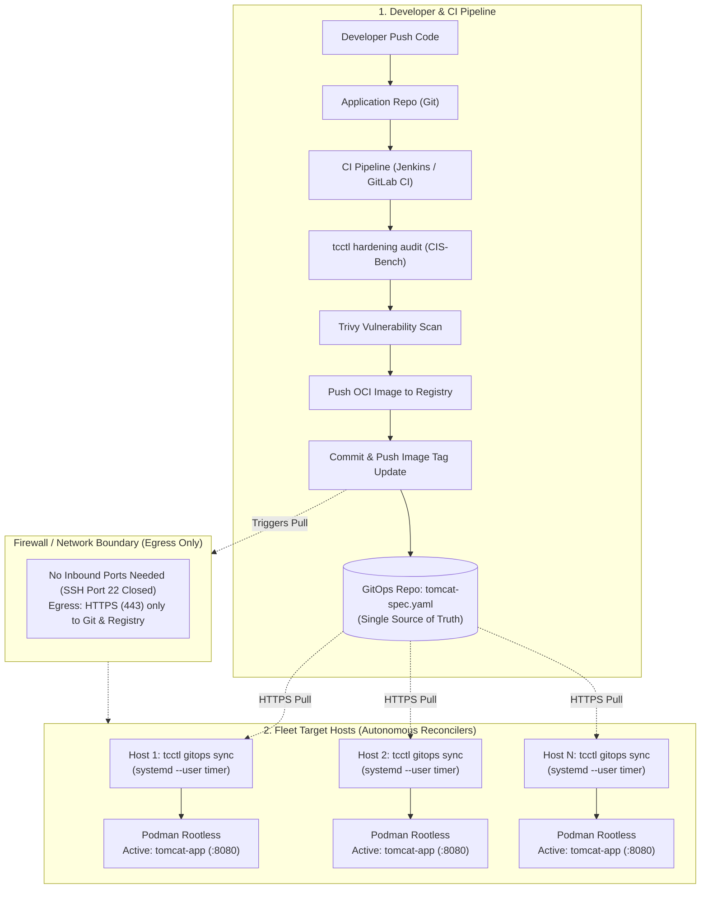
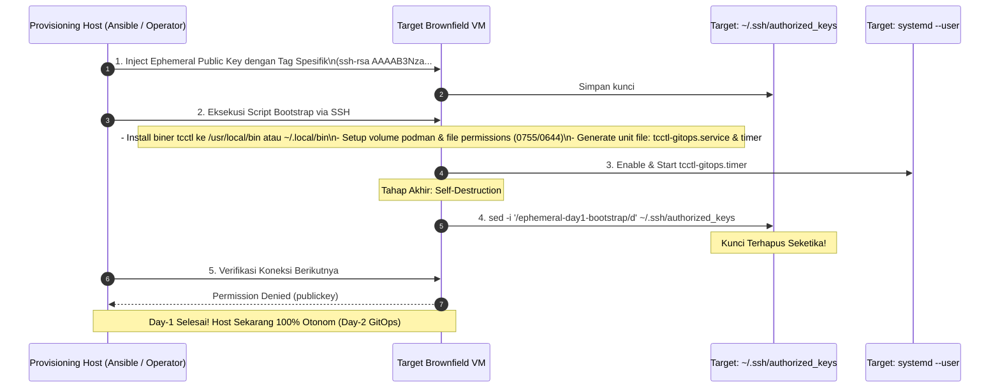
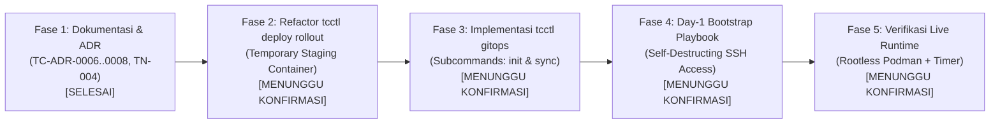

# TN-004 — Design Pure Pull-Based GitOps, Temporary Staging Rollout, and Self-Destructing Bootstrap

| Field | Value |
| --- | --- |
| Status | Completed |
| Activity Type | Architecture & Design |
| Record Type | Live |
| Project | Apache Tomcat Enterprise |
| Phase | Platform Foundation & Hardening |
| Activity Date | 2026-09-22 |
| Recorded Date | 2026-09-22 |
| Owner | Project owner |
| Working Mode | Write |
| Authorization Status | Approved |
| Approved By | Project owner |
| Approval Date | 2026-09-22 |

## 🎯 Objective

Mendokumentasikan keputusan arsitektur dan spesifikasi desain komprehensif terkait tiga pilar operasional modern pada platform **Apache Tomcat Enterprise**:

1. **Refactoring Zero-Downtime Rollout**: Mengeliminasi suffix permanen (`-blue`/`-green`) menjadi **Temporary Staging Container (`<name>-staging`)** dengan promosi nama kanonikal (`<name>`) secara atomik, sehingga kontainer produksi aktif selalu memiliki identitas bersih yang stabil.
2. **Adopsi Pure Pull-Based GitOps**: Mengadopsi prinsip CNCF OpenGitOps melalui **Autonomous Host Reconciler** (`tcctl gitops sync` via `systemd --user timer`), memisahkan secara tegas tanggung jawab CI (Build, Hardening Audit, Vulnerability Scanning) dari CD (Deklaratif, Self-Healing, Pull-Based).
3. **Penyelesaian Paradoks Day-1 Bootstrapping**: Mengimplementasikan pola **Self-Destructing Ephemeral SSH Access** untuk provisioning biner `tcctl` dan timer pada armada VM eksisting (*brownfield*), memusnahkan kredensial sementara dari `~/.ssh/authorized_keys` seketika saat bootstrap selesai tanpa meninggalkan *dormant backdoor*.

---

## 🌍 Background

Pengelolaan armada Apache Tomcat pada puluhan server virtual (VM) atau bare-metal di lingkungan enterprise memunculkan tantangan operasional dan perdebatan arsitektur:

### 1. Keterbatasan Model CI/CD Tradisional (Push via SSH / Ansible)
Pada model push tradisional, Jenkins CI server atau Ansible Controller bertindak sebagai orkestrator sentral yang melakukan SSH push langsung ke seluruh host target:
- **Blast Radius Kredensial**: Server CI memegang kunci SSH superuser ke puluhan VM produksi. Kompromi pada CI server membuka akses langsung ke seluruh armada host.
- **Inbound Firewall Holes**: Setiap VM target harus membuka port 22 (SSH) ke runner CI atau Ansible controller.
- **Ketiadaan Deteksi Drift Berkelanjutan**: Model push hanya berjalan saat ada trigger rilis. Jika terjadi modifikasi konfigurasi manual atau container mati di luar jam rilis, tidak ada mekanisme rekonsiliasi mandiri (*self-healing*).

### 2. Ortodoksi GitOps (CNCF OpenGitOps Standard)
GitOps mensyaratkan empat prinsip utama:
1. **Deklaratif**: Seluruh kondisi sistem didefinisikan secara deklaratif dalam Git (`tomcat-spec.yaml`).
2. **Berversi dan Tak Berubah (*Versioned & Immutable*)**: Git menjadi *Single Source of Truth* tunggal.
3. **Ditarik Otomatis (*Pulled Automatically*)**: Agen software pada runtime target secara otonom menarik kondisi yang dideklarasikan.
4. **Rekonsiliasi Berkelanjutan (*Continuously Reconciled*)**: Agen secara konstan membandingkan kondisi aktual dengan kondisi yang diinginkan dan melakukan koreksi otomatis (*self-healing*).

Menggunakan Ansible atau script dari CI untuk melakukan push ke target **bukanlah GitOps**, melainkan *Scripted Push Configuration Management*. Untuk mencapai GitOps murni pada multi-host non-Kubernetes, biner operator `tcctl` di host target harus bertindak sebagai *Pull Reconciler*.

### 3. Paradoks Bootstrapping (Day-1 vs Day-2)
Untuk menjalankan agent GitOps di host target, biner `tcctl` dan unit systemd harus terpasang terlebih dahulu. Pada VM yang sudah terbentuk (*brownfield*), hal ini membutuhkan akses awal (Day-1). Namun, membiarkan kunci SSH tersimpan di puluhan server menimbulkan beban pembersihan manual (*post-bootstrap cleanup PR*) yang rawan kelalaian. Pola *Self-Destructing Ephemeral SSH Access* dipilih sebagai solusi paling elegan: kunci bootstrap secara otomatis memusnahkan baris dirinya sendiri dari `~/.ssh/authorized_keys` di akhir skrip instalasi.

### 4. Ketidaknyamanan Suffix Permanen Blue-Green
Model Blue-Green konvensional menamai kontainer dengan `<name>-blue` atau `<name>-green`. Akibatnya, nama kontainer produksi yang sedang aktif berganti-ganti setiap rilis, menyulitkan tim monitoring, operator lapangan, serta penulisan query Prometheus dan reverse proxy routing. Solusi yang lebih bersih adalah kontainer aktif selalu bernama kanonikal `<name>`, dan kontainer baru sementara diberi nama `<name>-staging` hanya selama proses pre-flight probe berlangsung.

---

## 📚 Scope & Decision References

Dokumen ini merangkum dan menjadi acuan bagi tiga Architecture Decision Records:

- [**TC-ADR-0006**: Refactor Zero-Downtime Rollout to Temporary Staging Containers with Canonical Name Promotion](../../../../adr/tomcat/adr-records/TC-ADR-0006.md)
- [**TC-ADR-0007**: Adoption of Pure Pull-Based GitOps via Autonomous Host Reconciler and Day-1/Day-2 Decoupling](../../../../adr/tomcat/adr-records/TC-ADR-0007.md)
- [**TC-ADR-0008**: Zero-Touch Day-1 Host Bootstrapping via Self-Destructing Ephemeral SSH Access](../../../../adr/tomcat/adr-records/TC-ADR-0008.md)

---

## 📐 Architecture & Design Blueprint

### 1. Arsitektur Dekopel CI dan Pure Pull-Based GitOps (Day-2)

Pemisahan tanggung jawab secara tegas antara Continuous Integration (CI) dan Continuous Deployment (CD):



### 2. Alur Transisi Temporary Staging Container Rollout

Mekanisme zero-downtime tanpa suffix permanen pada kontainer produksi:

```mermaid
sequenceDiagram
    autonumber
    participant Op as tcctl gitops sync / deploy
    participant Host as Podman Engine
    participant Active as tomcat-app (Active :8080)
    participant Staging as tomcat-app-staging (:9080)
    participant Upstream as Nginx / Edge Proxy

    Note over Active: Kondisi Normal: tomcat-app aktif di port 8080
    Op->>Host: 1. Tarik Image OCI Baru (podman pull)
    Op->>Host: 2. Jalankan Staging Container: tomcat-app-staging (Port 9080)
    activate Staging
    
    loop Health Probe Loop (max 60 detik)
        Op->>Staging: GET http://localhost:9080/health
        Staging-->>Op: 200 OK (Ready & Warm)
    end

    Note over Op,Host: Promosi Atomik (Switchover)
    Op->>Active: 3. Stop kontainer lama (Graceful SIGTERM)
    deactivate Active
    Op->>Active: 4. Hapus kontainer lama (podman rm tomcat-app)
    
    Op->>Staging: 5. Stop staging sementara (podman stop tomcat-app-staging)
    Op->>Host: 6. Jalankan kontainer baru dengan nama kanonikal: tomcat-app (Port 8080)
    activate Active
    Op->>Host: 7. Cleanup staging container (podman rm tomcat-app-staging)
    deactivate Staging
    
    Note over Active: Layanan Kembali Normal di Port 8080 Tanpa Suffix!
```

### 3. Alur Self-Destructing Ephemeral SSH Access (Day-1 Bootstrapping)

Pola provisioning awal yang membersihkan jejaknya sendiri:



---

## ⚙️ Detail Spesifikasi Teknis

### 1. Spesifikasi Deklarasi GitOps (`tomcat-spec.yaml`)

File manifes yang disimpan di repositori GitOps (misalnya `git@git.corp/infra/tomcat-fleet.git`):

```yaml
version: "1.0"
metadata:
  application: "core-payment-service"
  environment: "production"
  tier: "backend"

spec:
  # Konfigurasi Image OCI
  image:
    repository: "registry.corp.internal/tomcat/hardened-app"
    tag: "10.1.24-dist-v1.4.2"
    pullPolicy: "IfNotPresent"

  # Konfigurasi Instance & Jaringan
  runtime:
    containerName: "payment-service"      # Nama kanonikal bersih
    httpPort: 8080                       # Port produksi utama
    stagingPort: 9080                    # Port sementara saat rollout
    httpsPort: 8443
    memoryLimit: "2048m"
    cpuLimit: "2.0"

  # Engine Runtime Named Volumes (Rootless Podman compliant)
  storage:
    configVolume: "payment_conf"
    webappsVolume: "payment_webapps"
    logsVolume: "payment_logs"
    volumePermissions:
      dirMode: "0755"
      fileMode: "0644"

  # Pre-Flight Readiness & Smoke Test
  healthCheck:
    path: "/"
    expectedStatus: 200
    initialDelaySeconds: 5
    timeoutSeconds: 60
    intervalSeconds: 3

  # Target Rollback Policy
  autoRollback: true
```

### 2. Spesifikasi Autonomous Host Reconciler (`tcctl gitops`)

Subcommand baru yang akan ditambahkan pada `tcctl`:

- **`tcctl gitops init`**:
  - Menerima argumen URL repositori GitOps dan interval timer (misal: `5m`).
  - Mengkloning atau mengonfigurasi local working copy di `~/.config/tcctl/gitops/`.
  - Mendaftarkan dan mengaktifkan unit systemd timer pada user level:
    - Unit Service: `~/.config/systemd/user/tcctl-gitops.service`
    - Unit Timer: `~/.config/systemd/user/tcctl-gitops.timer`
- **`tcctl gitops sync`**:
  - Mengeksekusi `git fetch origin` dan memeriksa apakah `HEAD` branch sinkron berbeda dengan commit aktif saat ini.
  - Membaca dan memvalidasi sintaks `tomcat-spec.yaml`.
  - Memeriksa apakah versi image, port, konfigurasi volume, atau variabel lingkungan mengalami deviasi (*drift*).
  - Jika terjadi perubahan atau drift:
    - Melakukan `podman pull` image OCI yang baru.
    - Menjalankan `tcctl deploy rollout` menggunakan temporary staging container.
    - Memperbarui file state lokal `~/.config/tcctl/gitops/state.json` dengan commit hash terbaru.
    - Mengirimkan audit log rekonsiliasi ke Syslog / Journald.

### 3. Template Unit Systemd User Service & Timer

**File: `~/.config/systemd/user/tcctl-gitops.service`**
```ini
[Unit]
Description=Apache Tomcat Enterprise GitOps Reconciler (tcctl)
Documentation=https://devops-handbook.corp.internal/projects/tomcat/
After=network.target

[Service]
Type=oneshot
WorkingDirectory=%h/.config/tcctl/gitops
ExecStart=%h/bin/tcctl gitops sync --spec %h/.config/tcctl/gitops/tomcat-spec.yaml
StandardOutput=journal
StandardError=journal

[Install]
WantedBy=default.target
```

**File: `~/.config/systemd/user/tcctl-gitops.timer`**
```ini
[Unit]
Description=Periodic GitOps Reconciliation Timer for Apache Tomcat
RefersTo=tcctl-gitops.service

[Timer]
OnBootSec=1min
OnUnitActiveSec=5min
RandomizedDelaySec=30s
Persistent=true

[Install]
WantedBy=timers.target
```

---

## 🔒 Security & Governance Assessment

| Aspek Keamanan | Status Tradisional (Push/SSH) | Status Baru (Pure GitOps & Ephemeral Day-1) |
| --- | --- | --- |
| **Akses Jaringan Inbound** | Membuka Port 22 ke CI/Ansible Controller | **Zero Inbound Ports**. Host hanya membuka egress HTTPS (443) ke Git & Registry. |
| **Kredensial SSH** | Kunci tersimpan permanen di puluhan server target | **Kunci terhapus seketika (*self-destruct*)** setelah Day-1 selesai. |
| **Blast Radius Kompromi CI** | Penyerang di CI mendapatkan shell akses ke semua VM produksi | Penyerang di CI **hanya dapat mengubah manifes Git**, dicegah oleh branch protection, CIS quality gate, dan PR review. |
| **Deteksi Deviasi (*Drift*)** | Tidak terdeteksi hingga jadwal rilis berikutnya | **Otomatis pulih (*self-healing*)** dalam interval maksimal 5 menit melalui reconciler. |
| **Hak Akses File Runtime** | Berisiko permission mismatch pada non-root rootless Podman | Terjamin `0755` (dir) dan `0644` (file) sehingga user `tomcat` (UID 1001) dapat membaca volume `:ro,Z`. |

---

## 🗺️ Implementation Roadmap



1. **Fase 1 (Dokumentasi & ADR - Saat Ini)**:
   - Membuat `TC-ADR-0006`, `TC-ADR-0007`, `TC-ADR-0008`.
   - Membuat Technical Note `TN-004` dan memperbarui seluruh indeks dokumentasi `devops-handbook`.
   - Mengonfirmasi seluruh blueprint kepada pengguna sebelum melakukan perubahan kode.
2. **Fase 2 (Refactoring Operator `tcctl deploy rollout`)**:
   - Merefaktor `internal/deploy/` pada repositori `tcctl` untuk mengeliminasi parameter `--color` blue/green statis.
   - Mengimplementasikan alur staging: meluncurkan `<name>-staging`, melakukan health polling, menghentikan container aktif lama `<name>`, menghapus container lama, mempromosikan staging menjadi `<name>`, dan membersihkan container staging.
3. **Fase 3 (Implementasi Paket `internal/gitops` pada `tcctl`)**:
   - Membangun parser `tomcat-spec.yaml`.
   - Mengimplementasikan `tcctl gitops init` dan `tcctl gitops sync`.
   - Mengintegrasikan pembuatan otomatis unit systemd user timer.
4. **Fase 4 (Otomasi Day-1 Ephemeral Bootstrap)**:
   - Menyediakan skrip bootstrap dan playbook Ansible dengan instruksi self-purge `authorized_keys`.
5. **Fase 5 (Pengujian Live Runtime & Verifikasi)**:
   - Menguji skenario: push update tag di Git, verifikasi reconciler mendeteksi drift dan melakukan zero-downtime rollout tanpa intervensi manusia, dan memastikan kontainer tetap bernama bersih `<name>`.

---

## 🔗 Related Documentation

- [TC-ADR-0006: Refactor Zero-Downtime Rollout to Temporary Staging Containers](../../../../adr/tomcat/adr-records/TC-ADR-0006.md)
- [TC-ADR-0007: Adoption of Pure Pull-Based GitOps via Autonomous Host Reconciler](../../../../adr/tomcat/adr-records/TC-ADR-0007.md)
- [TC-ADR-0008: Zero-Touch Day-1 Host Bootstrapping via Self-Destructing Ephemeral SSH Access](../../../../adr/tomcat/adr-records/TC-ADR-0008.md)
- [Update Management Specification](../../update-management/index.md)
- [Architecture Decision Records Index](../../../../adr/tomcat/index.md)
- [Engineering Journal Index](index.md)
