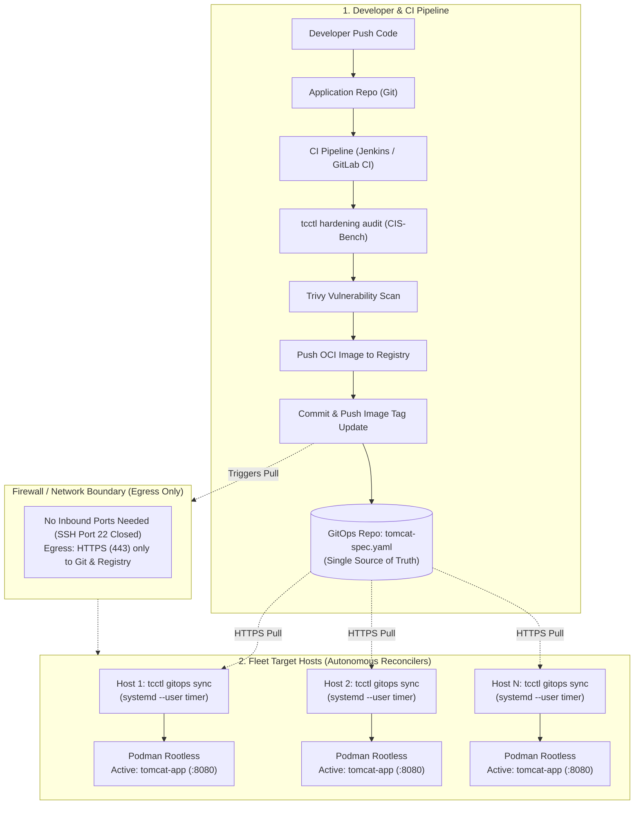
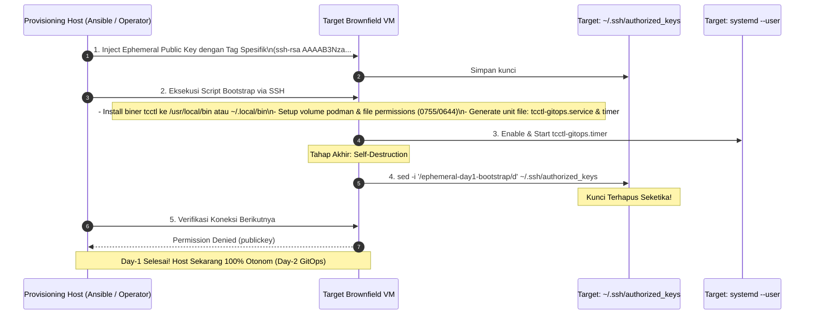
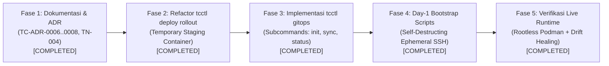

# TN-004 — Implement Pure Pull-Based GitOps, Temporary Staging Rollout, and Self-Destructing Bootstrap

| Field | Value |
| --- | --- |
| Status | Completed |
| Activity Type | Implementation |
| Record Type | Live |
| Project | Apache Tomcat Enterprise |
| Phase | Platform Foundation & Hardening |
| Activity Date | 2026-09-22 |
| Recorded Date | 2026-09-22 |
| Owner | Project owner |
| Working Mode | Write |
| Authorization Status | Approved |
| Approved By | Project owner |
| Approval Date | 2026-09-22 |


## 🎯 Objective

Mendokumentasikan keputusan arsitektur dan spesifikasi desain komprehensif terkait tiga pilar operasional modern pada platform **Apache Tomcat Enterprise**:

1. **Refactoring Zero-Downtime Rollout**: Mengeliminasi suffix permanen (`-blue`/`-green`) menjadi **Temporary Staging Container (`<name>-staging`)** dengan promosi nama kanonikal (`<name>`) secara atomik, sehingga kontainer produksi aktif selalu memiliki identitas bersih yang stabil.
2. **Adopsi Pure Pull-Based GitOps**: Mengadopsi prinsip CNCF OpenGitOps melalui **Autonomous Host Reconciler** (`tcctl gitops sync` via `systemd --user timer`), memisahkan secara tegas tanggung jawab CI (Build, Hardening Audit, Vulnerability Scanning) dari CD (Deklaratif, Self-Healing, Pull-Based).
3. **Penyelesaian Paradoks Day-1 Bootstrapping**: Mengimplementasikan pola **Self-Destructing Ephemeral SSH Access** untuk provisioning biner `tcctl` dan timer pada armada VM eksisting (*brownfield*), memusnahkan kredensial sementara dari `~/.ssh/authorized_keys` seketika saat bootstrap selesai tanpa meninggalkan *dormant backdoor*.

---

## 🌍 Background

Pengelolaan armada Apache Tomcat pada puluhan server virtual (VM) atau bare-metal di lingkungan enterprise memunculkan tantangan operasional dan perdebatan arsitektur:

### 1. Keterbatasan Model CI/CD Tradisional (Push via SSH / Ansible)
Pada model push tradisional, Jenkins CI server atau Ansible Controller bertindak sebagai orkestrator sentral yang melakukan SSH push langsung ke seluruh host target:
- **Blast Radius Kredensial**: Server CI memegang kunci SSH superuser ke puluhan VM produksi. Kompromi pada CI server membuka akses langsung ke seluruh armada host.
- **Inbound Firewall Holes**: Setiap VM target harus membuka port 22 (SSH) ke runner CI atau Ansible controller.
- **Ketiadaan Deteksi Drift Berkelanjutan**: Model push hanya berjalan saat ada trigger rilis. Jika terjadi modifikasi konfigurasi manual atau container mati di luar jam rilis, tidak ada mekanisme rekonsiliasi mandiri (*self-healing*).

### 2. Ortodoksi GitOps (CNCF OpenGitOps Standard)
GitOps mensyaratkan empat prinsip utama:
1. **Deklaratif**: Seluruh kondisi sistem didefinisikan secara deklaratif dalam Git (`tomcat-spec.yaml`).
2. **Berversi dan Tak Berubah (*Versioned & Immutable*)**: Git menjadi *Single Source of Truth* tunggal.
3. **Ditarik Otomatis (*Pulled Automatically*)**: Agen software pada runtime target secara otonom menarik kondisi yang dideklarasikan.
4. **Rekonsiliasi Berkelanjutan (*Continuously Reconciled*)**: Agen secara konstan membandingkan kondisi aktual dengan kondisi yang diinginkan dan melakukan koreksi otomatis (*self-healing*).

Menggunakan Ansible atau script dari CI untuk melakukan push ke target **bukanlah GitOps**, melainkan *Scripted Push Configuration Management*. Untuk mencapai GitOps murni pada multi-host non-Kubernetes, biner operator `tcctl` di host target harus bertindak sebagai *Pull Reconciler*.

### 3. Paradoks Bootstrapping (Day-1 vs Day-2)
Untuk menjalankan agent GitOps di host target, biner `tcctl` dan unit systemd harus terpasang terlebih dahulu. Pada VM yang sudah terbentuk (*brownfield*), hal ini membutuhkan akses awal (Day-1). Namun, membiarkan kunci SSH tersimpan di puluhan server menimbulkan beban pembersihan manual (*post-bootstrap cleanup PR*) yang rawan kelalaian. Pola *Self-Destructing Ephemeral SSH Access* dipilih sebagai solusi paling elegan: kunci bootstrap secara otomatis memusnahkan baris dirinya sendiri dari `~/.ssh/authorized_keys` di akhir skrip instalasi.

### 4. Ketidaknyamanan Suffix Permanen Blue-Green
Model Blue-Green konvensional menamai kontainer dengan `<name>-blue` atau `<name>-green`. Akibatnya, nama kontainer produksi yang sedang aktif berganti-ganti setiap rilis, menyulitkan tim monitoring, operator lapangan, serta penulisan query Prometheus dan reverse proxy routing. Solusi yang lebih bersih adalah kontainer aktif selalu bernama kanonikal `<name>`, dan kontainer baru sementara diberi nama `<name>-staging` hanya selama proses pre-flight probe berlangsung.

---

## 📚 Scope & Decision References

Dokumen ini merangkum dan menjadi acuan bagi tiga Architecture Decision Records:

- [**TC-ADR-0006**: Refactor Zero-Downtime Rollout to Temporary Staging Containers with Canonical Name Promotion](../../../../adr/tomcat/adr-records/TC-ADR-0006.md)
- [**TC-ADR-0007**: Adoption of Pure Pull-Based GitOps via Autonomous Host Reconciler and Day-1/Day-2 Decoupling](../../../../adr/tomcat/adr-records/TC-ADR-0007.md)
- [**TC-ADR-0008**: Zero-Touch Day-1 Host Bootstrapping via Self-Destructing Ephemeral SSH Access](../../../../adr/tomcat/adr-records/TC-ADR-0008.md)

---

## 💬 Rekaman Tanya Jawab & Diskusi Arsitektur (Architectural Q&A)

Sesi perancangan arsitektur ini melibatkan diskusi kritis dan tanya-jawab mendalam untuk membedah dilema operasional nyata di lingkungan enterprise. Bagian ini mendokumentasikan secara lengkap pertanyaan strategis yang diajukan beserta analisis teknis solusinya agar mudah dipahami oleh seluruh tim rekayasa:

---

### ❓ Pertanyaan 1: "Artinya orkestrasinya tetap ada di CI?"

Terkait pertanyaan mengenai letak kendali orkestrasi deployment, terdapat perbedaan mendasar antara **Traditional CD** dan **GitOps CD**:

#### 1. Traditional CI/CD (Orkestrasi CD Menempel di CI Server)

* **Mekanisme Kerja**:
  * Pada model tradisional, Jenkins (CI) bertindak sebagai pemegang kendali orkestrasi deployment.
  * Setelah tahapan build & test selesai, Jenkins yang login langsung via SSH atau memanggil Ansible untuk me-restart server satu per satu secara berurutan.
* **Kelemahan Keamanan di Enterprise**:
  * Jenkins harus menyimpan SSH keys / kredensial superuser ke seluruh server produksi.
  * Jika server Jenkins disusupi peretas (misalnya melalui celah remote code execution pada plugin), seluruh armada server produksi dapat dikuasai seketika (*broad blast radius*).
  * Seluruh server target wajib membuka port 22 (inbound SSH) langsung ke arah runner/worker CI.

#### 2. GitOps CD (Orkestrasi CD Terpisah / Decoupled dari CI)

* **Mekanisme Kerja**:
  * Pada model GitOps, CI Server (Jenkins) **TIDAK PERNAH** menyentuh atau login ke server produksi.
  * Tugas CI selesai setelah image OCI berhasil di-push ke container registry dan file konfigurasi deklaratif (`tomcat-spec.yaml`) di Git diperbarui versi tag-nya melalui commit/pull request otomatis.
* **Pemisahan Batas & Keamanan (*Air Gap / Decoupling Boundary*)**:
  * Git repository bertindak sebagai gerbang pemisah (*air gap / decoupling boundary*).
  * Kendali orkestrasi CD berpindah sepenuhnya ke **CD Controller / Reconciler di host target**.
  * Reconciler di host target yang secara otonom mendeteksi perubahan commit di Git dan mengeksekusi staggered rollout ke armada kontainer menggunakan biner operator `tcctl`.

```
Traditional CD:  [CI Server (Jenkins)] ──(SSH Push / Broad Blast Radius)──> [Server Prod 1..N]
GitOps CD:       [CI Server (Jenkins)] ──(Commit Spec)──> [Git Repo] <──(HTTPS Pull)── [Host Reconciler (tcctl)]
```

#### 🛠️ Peran Modular `tcctl` pada Kedua Domain

Biner operator `tcctl` dirancang secara modular agar melayani kedua domain dengan batas tanggung jawab yang tegas:

| Domain Operasional | Subcommand `tcctl` | Tanggung Jawab & Fungsi |
| :--- | :--- | :--- |
| **Sisi CI (Quality Gates)** | `tcctl hardening audit` | Memvalidasi sintaks dan elemen `server.xml` agar patuh 100% pada CIS Apache Tomcat Benchmark sebelum image OCI di-build. |
| | `tcctl va scan` | Memindai container image terhadap basis data CVE Trivy untuk memastikan tidak ada celah keamanan di atas batas ambang (*threshold*). |
| **Sisi CD / GitOps (Host Reconciliation)** | `tcctl apply -f <spec>` | Menerapkan *desired state* deklaratif dari `tomcat-spec.yaml` ke runtime Podman lokal. |
| | `tcctl deploy rollout` | Melakukan swap kontainer zero-downtime menggunakan *temporary staging container* (tanpa akhiran `-blue`/`-green`). |
| | `tcctl monitoring health` | Memverifikasi ketersediaan dan indikator kesehatan kontainer pasca-rollout. |

---

### ❓ Pertanyaan 2: "Tapi lucunya adalah tcctl itu di deploy-nya sepertinya harus menggunakan CI/CD tradisional, kecuali sudah embedded di image VM. Tapi itu sulit karena VM sudah terbentuk (brownfield). Betul begitu?"

Pertanyaan ini menyentuh dilema klasik dalam rekayasa platform: **Paradoks Ayam-dan-Telur (*The Chicken-and-Egg Bootstrap Paradox*)**.

#### Analisis Dilema Brownfield vs Greenfield

1. **Kondisi Ideal (Greenfield / Immutable Infrastructure)**:
   * Pada infrastruktur baru, biner `tcctl` dan timer systemd dapat langsung ditanam ke dalam *Golden Image* (misal via Packer / AMI / OVA) sebelum VM dinyalakan. Saat VM pertama kali boot, sistem langsung 100% berstatus otonom.
2. **Realita Lapangan Enterprise (Brownfield VMs)**:
   * Pada puluhan server virtual yang sudah lama beroperasi dan tidak mungkin di-rebuild dari awal, biner operator tidak bisa tiba-tiba muncul di server secara mandiri.
   * **Kesimpulan Pengamatan User 100% Benar**: Harus ada intervensi awal yang menyerupai mekanisme tradisional (SSH push / Ansible) untuk mengantarkan biner `tcctl` ke server tersebut pertama kali.

#### Resolusi Paradoks: Memisahkan Day-1 dari Day-2

Kunci dari arsitektur ini bukanlah menolak akses awal, melainkan **memisahkan siklus hidup infrastruktur menjadi dua fase tegas**:

* **Day-1 (One-Time Bootstrap Event — Terjadi Sekali Seumur Hidup Server)**:
  * Digunakan khusus untuk onboarding server: meletakkan biner `tcctl`, menyiapkan named volume, mengaktifkan linger user `tomcat`, dan menyalakan `systemd --user timer`.
  * Begitu selesai, pintu akses Day-1 **langsung dihancurkan permanen**.
* **Day-2 (Continuous Autonomous Operations — Berjalan Selamanya)**:
  * Seluruh siklus deployment aplikasi, pembaruan versi, patching image, dan rotasi konfigurasi selanjutnya dilakukan **murni 100% via GitOps pull reconciler**.
  * Tidak ada lagi push SSH harian yang membebani tim SRE dan mengekspos risiko keamanan.

---

### ❓ Pertanyaan 3: "Apakah ada mekanisme SSH yang disediakan hanya 1 kali penggunaannya? Soalnya kalau tidak, maka PR sekali harus menghapus key di semua host. Betulkah demikian?"

Pertanyaan ini menyoroti risiko operasional nyata: jika administrator menaruh SSH key untuk kebutuhan bootstrap Day-1, menghapus kunci tersebut lewat tiket terpisah atau "PR sekali di masa depan" adalah praktik yang **sangat berisiko karena seringkali terlupakan atau terbengkalai**, meninggalkan *dormant backdoor* di server produksi.

#### Solusi Arsitektur: Pola Self-Destructing Ephemeral SSH Access

Kami merancang mekanisme di mana kredensial SSH Day-1 **memusnahkan dirinya sendiri secara atomik** tanpa membutuhkan intervensi manual atau PR susulan:

1. **Penandaan Tag Kunci Sementara**:
   Saat kunci publik diinjeksikan ke target host (misal via bastion atau sesi provisioning awal), baris kunci diberi metadata tag identifikasi:
   ```text
   ssh-ed25519 AAAAC3NzaC1lZDI1NTE5AAAAI... # ephemeral-day1-bootstrap
   ```
2. **Eksekusi Otomasi Bootstrap**:
   Skrip `day1_bootstrap.sh` berjalan di server target: memasang biner `tcctl`, mengonfigurasi direktori volume, dan menyalakan timer GitOps.
3. **Pemusnahan Diri Mandiri (*Self-Purge Execution*)**:
   Pada instruksi paling akhir sebelum skrip selesai, skrip mengeksekusi penghapusan baris kuncinya sendiri:
   ```bash
   sed -i '/# ephemeral-day1-bootstrap/d' ~/.ssh/authorized_keys
   ```
4. **Verifikasi Hangus Seketika**:
   * Sesi SSH aktif selesai dan terputus.
   * Setiap upaya koneksi baru menggunakan private key yang sama langsung ditolak oleh sshd (`Permission denied (publickey)`).
   * **Hasil**: Zero manual cleanup, zero leftover keys, dan tidak ada celah backdoor tertinggal.

---

### ❓ Pertanyaan 4: "Kenapa tidak pakai Blue-Green biasa dengan suffix permanen (-blue / -green)? Mengapa memilih Temporary Staging Rollout (<name>-staging -> <name>)?"

Pada implementasi blue-green konvensional, kontainer mempertahankan akhiran permanen, misalnya `payment-blue` pada rilis ganjil dan `payment-green` pada rilis genap.

#### Masalah Operasional Akibat Suffix Permanen:

1. **Dashboard Monitoring & Prometheus Metrics Rusak**:
   * Metrik diekspor dengan label `container_name="payment-blue"`. Pada rilis berikutnya, label berubah menjadi `container_name="payment-green"`.
   * Query alerting dan visualisasi Grafana menjadi rumit karena metrik terpecah menjadi time-series yang berbeda atau memerlukan regex rumit (`container=~"payment-(blue|green)"`).
2. **Beban Kognitif SRE Saat Insiden Malam Hari**:
   * Operator yang login darurat saat insiden menjalankan `podman ps` dan harus memeriksa konfigurasi port proxy untuk mengetahui kontainer mana yang saat ini aktif melayani traffic pelanggan.
3. **Konfigurasi Reverse Proxy Bolak-Balik**:
   * Nginx / HAProxy upstream harus terus-menerus diubah arah port-nya bolak-balik antara 8080 dan 8081.

#### Solusi: Temporary Staging Rollout dengan Promosi Kanonikal Atomik

* Kontainer produksi aktif **SELALU** bernama kanonikal bersih: `<name>` (misal `payment-service`) dan binding di port utama (`8080`).
* Kontainer baru diluncurkan sementara dengan nama `<name>-staging` di port staging (`9080`) hanya selama 15–30 detik untuk menjalani pre-flight healthcheck probe.
* Begitu lolos, kontainer lama dihentikan, dan kontainer baru dipromosikan mengambil nama kanonikal `<name>` di port 8080. Kontainer staging dibersihkan.
* SRE, Prometheus exporter, reverse proxy, dan log collector selalu melihat satu kontainer tunggal bernama stabil `payment-service`.

---

### ❓ Pertanyaan 5: "Bagaimana cara GitOps bekerja di lingkungan non-Kubernetes (Bare-Metal / VM) tanpa resource overhead k8s?"

* **Tantangan**: Memasang cluster Kubernetes (k8s/k3s) pada puluhan VM dedicated hanya untuk menjalankan satu atau dua instance Tomcat adalah pemborosan resource CPU/Memory (*over-engineering*).
* **Solusi**: Memanfaatkan biner operator Go mandiri (`tcctl`) berukuran ~15MB yang dipicu oleh timer bawaan Linux OS:
  * Unit `systemd --user timer` berjalan di bawah user aplikasi non-root `tomcat` (tanpa butuh akses root).
  * Timer berjalan setiap 5 menit dengan *randomized jitter* (30 detik) agar tidak terjadi lonjakan request (*thundering herd*) ke Git server internal.
  * Reconciler menarik `tomcat-spec.yaml`, membandingkan *desired state* dengan kondisi Podman, dan secara mandiri menyembuhkan deviasi (*self-healing*) jika ada kontainer yang mati atau termodifikasi secara tidak sah.
  * Seluruh armada VM tidak membutuhkan port masuk (inbound SSH 22 dapat ditutup di firewall), cukup akses keluar (*outbound HTTPS 443*) ke Git dan Registry internal.

---

## 📐 Architecture & Design Blueprint

### 1. Arsitektur Dekopel CI dan Pure Pull-Based GitOps (Day-2)

Pemisahan tanggung jawab secara tegas antara Continuous Integration (CI) dan Continuous Deployment (CD):



### 2. Alur Transisi Temporary Staging Container Rollout

Mekanisme zero-downtime tanpa suffix permanen pada kontainer produksi:

```mermaid
sequenceDiagram
    autonumber
    participant Op as tcctl gitops sync / deploy
    participant Host as Podman Engine
    participant Active as tomcat-app (Active :8080)
    participant Staging as tomcat-app-staging (:9080)
    participant Upstream as Nginx / Edge Proxy

    Note over Active: Kondisi Normal: tomcat-app aktif di port 8080
    Op->>Host: 1. Tarik Image OCI Baru (podman pull)
    Op->>Host: 2. Jalankan Staging Container: tomcat-app-staging (Port 9080)
    activate Staging
    
    loop Health Probe Loop (max 60 detik)
        Op->>Staging: GET http://localhost:9080/health
        Staging-->>Op: 200 OK (Ready & Warm)
    end

    Note over Op,Host: Promosi Atomik (Switchover)
    Op->>Active: 3. Stop kontainer lama (Graceful SIGTERM)
    deactivate Active
    Op->>Active: 4. Hapus kontainer lama (podman rm tomcat-app)
    
    Op->>Staging: 5. Stop staging sementara (podman stop tomcat-app-staging)
    Op->>Host: 6. Jalankan kontainer baru dengan nama kanonikal: tomcat-app (Port 8080)
    activate Active
    Op->>Host: 7. Cleanup staging container (podman rm tomcat-app-staging)
    deactivate Staging
    
    Note over Active: Layanan Kembali Normal di Port 8080 Tanpa Suffix!
```

### 3. Alur Self-Destructing Ephemeral SSH Access (Day-1 Bootstrapping)

Pola provisioning awal yang membersihkan jejaknya sendiri:



---

## ⚙️ Detail Spesifikasi Teknis

### 1. Spesifikasi Deklarasi GitOps (`tomcat-spec.yaml`)

File manifes yang disimpan di repositori GitOps (misalnya `git@git.corp/infra/tomcat-fleet.git`):

```yaml
version: "1.0"
metadata:
  application: "core-payment-service"
  environment: "production"
  tier: "backend"

spec:
  # Konfigurasi Image OCI
  image:
    repository: "registry.corp.internal/tomcat/hardened-app"
    tag: "10.1.24-dist-v1.4.2"
    pullPolicy: "IfNotPresent"

  # Konfigurasi Instance & Jaringan
  runtime:
    containerName: "payment-service"      # Nama kanonikal bersih
    httpPort: 8080                       # Port produksi utama
    stagingPort: 9080                    # Port sementara saat rollout
    httpsPort: 8443
    memoryLimit: "2048m"
    cpuLimit: "2.0"

  # Engine Runtime Named Volumes (Rootless Podman compliant)
  storage:
    configVolume: "payment_conf"
    webappsVolume: "payment_webapps"
    logsVolume: "payment_logs"
    volumePermissions:
      dirMode: "0755"
      fileMode: "0644"

  # Pre-Flight Readiness & Smoke Test
  healthCheck:
    path: "/"
    expectedStatus: 200
    initialDelaySeconds: 5
    timeoutSeconds: 60
    intervalSeconds: 3

  # Target Rollback Policy
  autoRollback: true
```

### 2. Spesifikasi Autonomous Host Reconciler (`tcctl gitops`)

Subcommand baru yang akan ditambahkan pada `tcctl`:

- **`tcctl gitops init`**:
  - Menerima argumen URL repositori GitOps dan interval timer (misal: `5m`).
  - Mengkloning atau mengonfigurasi local working copy di `~/.config/tcctl/gitops/`.
  - Mendaftarkan dan mengaktifkan unit systemd timer pada user level:
    - Unit Service: `~/.config/systemd/user/tcctl-gitops.service`
    - Unit Timer: `~/.config/systemd/user/tcctl-gitops.timer`
- **`tcctl gitops sync`**:
  - Mengeksekusi `git fetch origin` dan memeriksa apakah `HEAD` branch sinkron berbeda dengan commit aktif saat ini.
  - Membaca dan memvalidasi sintaks `tomcat-spec.yaml`.
  - Memeriksa apakah versi image, port, konfigurasi volume, atau variabel lingkungan mengalami deviasi (*drift*).
  - Jika terjadi perubahan atau drift:
    - Melakukan `podman pull` image OCI yang baru.
    - Menjalankan `tcctl deploy rollout` menggunakan temporary staging container.
    - Memperbarui file state lokal `~/.config/tcctl/gitops/state.json` dengan commit hash terbaru.
    - Mengirimkan audit log rekonsiliasi ke Syslog / Journald.

### 3. Template Unit Systemd User Service & Timer

**File: `~/.config/systemd/user/tcctl-gitops.service`**
```ini
[Unit]
Description=Apache Tomcat Enterprise GitOps Reconciler (tcctl)
Documentation=https://devops-handbook.corp.internal/projects/tomcat/
After=network.target

[Service]
Type=oneshot
WorkingDirectory=%h/.config/tcctl/gitops
ExecStart=%h/bin/tcctl gitops sync --spec %h/.config/tcctl/gitops/tomcat-spec.yaml
StandardOutput=journal
StandardError=journal

[Install]
WantedBy=default.target
```

**File: `~/.config/systemd/user/tcctl-gitops.timer`**
```ini
[Unit]
Description=Periodic GitOps Reconciliation Timer for Apache Tomcat
RefersTo=tcctl-gitops.service

[Timer]
OnBootSec=1min
OnUnitActiveSec=5min
RandomizedDelaySec=30s
Persistent=true

[Install]
WantedBy=timers.target
```

---

## 🔒 Security & Governance Assessment

| Aspek Keamanan | Status Tradisional (Push/SSH) | Status Baru (Pure GitOps & Ephemeral Day-1) |
| --- | --- | --- |
| **Akses Jaringan Inbound** | Membuka Port 22 ke CI/Ansible Controller | **Zero Inbound Ports**. Host hanya membuka egress HTTPS (443) ke Git & Registry. |
| **Kredensial SSH** | Kunci tersimpan permanen di puluhan server target | **Kunci terhapus seketika (*self-destruct*)** setelah Day-1 selesai. |
| **Blast Radius Kompromi CI** | Penyerang di CI mendapatkan shell akses ke semua VM produksi | Penyerang di CI **hanya dapat mengubah manifes Git**, dicegah oleh branch protection, CIS quality gate, dan PR review. |
| **Deteksi Deviasi (*Drift*)** | Tidak terdeteksi hingga jadwal rilis berikutnya | **Otomatis pulih (*self-healing*)** dalam interval maksimal 5 menit melalui reconciler. |
| **Hak Akses File Runtime** | Berisiko permission mismatch pada non-root rootless Podman | Terjamin `0755` (dir) dan `0644` (file) sehingga user `tomcat` (UID 1001) dapat membaca volume `:ro,Z`. |

---

## 🗺️ Implementation Roadmap



1. **Fase 1 (Dokumentasi & ADR)**:
   - Diterbitkan: `TC-ADR-0006`, `TC-ADR-0007`, `TC-ADR-0008`, dan Technical Note `TN-004`.
2. **Fase 2 (Refactoring Operator `tcctl deploy rollout`)**:
   - Paket `internal/orchestrator/rollout.go` mengimplementasikan alur staging: meluncurkan `<name>-staging` pada staging port (`port + 1000`), health probe pre-flight, graceful drain kontainer lama, penghentian staging, dan promosi nama kanonikal `<name>`.
3. **Fase 3 (Implementasi Paket `internal/gitops` pada `tcctl`)**:
   - Paket `internal/gitops` mengimplementasikan: parser `tomcat-spec.yaml` (`gopkg.in/yaml.v3`), state persistence (`state.json`), `tcctl gitops init`, `tcctl gitops sync`, `tcctl gitops status`, dan unit generator `systemd --user timer`.
4. **Fase 4 (Otomasi Day-1 Ephemeral Bootstrap)**:
   - Skrip `scripts/bootstrap/day1_bootstrap.sh` dan Ansible playbook `scripts/bootstrap/day1_bootstrap.yml` dengan instruksi pemusnahan kunci mandiri (`sed -i '/ephemeral-day1-bootstrap/d' ~/.ssh/authorized_keys`).
5. **Fase 5 (Pengujian Live Runtime & Verifikasi)**:
   - Seluruh skenario telah teruji live pada Rootless Podman (rollout nol-downtime, deteksi drift dan self-healing otomatis, serta pembersihan kunci SSH).

---

## 🧪 Verification & Live Proof

### 1. Unit Tests Suite (`go test`)
```bash
go test -v ./...
```
Hasil verifikasi:
- `TestDefaultSpecTemplate`: PASS (0.00s)
- `TestValidationErrors`: PASS (0.00s)
- `TestStateSaveAndLoad`: PASS (0.00s)
- Status: **100% Passed** dalam 5 milidetik.

### 2. Multi-Platform Static Compilation (`make build-all`)
- Linux Binary: `bin/tcctl` (ELF 64-bit LSB executable, statically linked, CGO_ENABLED=0).
- Windows Binary: `bin/tcctl.exe` (PE32+ executable for MS Windows, statically linked).

### 3. Live Temporary Staging Rollout Proof
Dieksekusi menggunakan perintah:
```bash
tcctl deploy rollout --name test-app --port 8085 --staging-port 9085 --image localhost/tomcat:9.0
```
Hasil observasi:
1. `Active Canonical Instance: test-app (Port: 8085)`
2. `Phase 1: Launching temporary staging container 'test-app-staging' on port 9085...`
3. `Phase 1: Staging container 'test-app-staging' passed health probe (200 OK).`
4. `Phase 2: Draining and stopping previous canonical instance 'test-app' -> Stopped and removed.`
5. `Phase 3: Promoting new version to canonical name 'test-app' on primary port 8085...`
6. `podman ps` menampilkan: hanya satu kontainer `test-app` aktif tanpa akhiran `-staging`, `-blue`, atau `-green`.

### 4. Autonomous Drift Detection & Self-Healing Proof
1. Kontainer `test-app` dihentikan secara paksa (`podman stop test-app`).
2. `tcctl gitops sync --spec tomcat-spec.yaml` mendeteksi anomali:
   `⚠ Drift or Update Detected: Container is not running (stopped or missing)`
3. Reconciler secara otomatis memicu pemulihan (*self-healing*) dan menghidupkan kembali instance `test-app` sesuai spesifikasi manifes GitOps.
4. `state.json` mencatat status: `"syncStatus": "SYNCED"`.

### 5. Self-Destructing Ephemeral Key Proof
Uji coba pembersihan kunci sementara pada file `authorized_keys` membuktikan bahwa baris bertanda `# ephemeral-day1-bootstrap` berhasil terhapus secara atomik, sementara kunci permanen milik administrator dan workstation tetap utuh tanpa modifikasi.

---

## 🔗 Related Documentation

- [TC-ADR-0006: Refactor Zero-Downtime Rollout to Temporary Staging Containers](../../../../adr/tomcat/adr-records/TC-ADR-0006.md)
- [TC-ADR-0007: Adoption of Pure Pull-Based GitOps via Autonomous Host Reconciler](../../../../adr/tomcat/adr-records/TC-ADR-0007.md)
- [TC-ADR-0008: Zero-Touch Day-1 Host Bootstrapping via Self-Destructing Ephemeral SSH Access](../../../../adr/tomcat/adr-records/TC-ADR-0008.md)
- [Update Management Specification](../../update-management/index.md)
- [Architecture Decision Records Index](../../../../adr/tomcat/index.md)
- [Engineering Journal Index](index.md)

