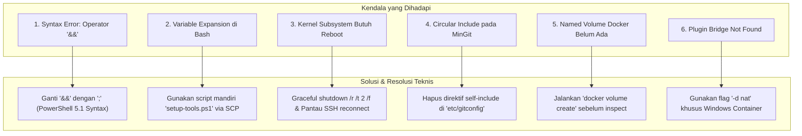

# TN-005 — Verify Windows Container Runtime Provisioning and tcctl Operator Testing

| Field | Value |
| --- | --- |
| Status | Completed |
| Activity Type | Verification & Infrastructure Setup |
| Record Type | Live |
| Project | Apache Tomcat Enterprise |
| Phase | Platform Foundation & Hardening |
| Activity Date | 2026-09-22 |
| Recorded Date | 2026-09-22 |
| Owner | Project owner |
| Working Mode | Write |
| Authorization Status | Approved |
| Approved By | Project owner |
| Approval Date | 2026-09-22 |

---

## 🎯 Objective

Mendokumentasikan seluruh tahapan deployment, provisioning runtime **Windows Containers**, serta pengujian fungsional operator CLI **`tcctl`** pada server **Windows Server 2022 Datacenter** di AWS EC2 (`Administrator@3.82.132.6`). Dokumentasi ini mencakup:

1. **Sinkronisasi Repositori Berdampingan (*Sibling Repositories Deployment*)**: Menyalin dan memvalidasi struktur repositori `tcctl` dan `tomcat` ke direktori kerja `C:\work` di target Windows host.
2. **Provisioning Container Engine Windows Server**: Mengaktifkan fitur Windows Containers, memasang Docker Engine Community Edition (`dockerd.exe` dan `docker.exe` v27.5.1), mendaftarkan Windows Service, serta mengonfigurasi jaringan Windows NAT (`devops-lab`).
3. **Penyediaan Tooling Pendukung**: Memasang Git CLI (`MinGit 2.47.1`) dan vulnerability scanner (`Trivy 0.74.0`) pada system PATH Windows.
4. **Verifikasi Fungsional `tcctl.exe`**: Menjalankan pengujian mandiri untuk **Audit CIS Benchmark** dan **SSL/TLS Lifecycle Governance** langsung pada target Windows.
5. **Catatan Analisis Masalah & Solusi (*Incident & Troubleshooting Log*)**: Mendokumentasikan secara rinci setiap kendala yang muncul selama proses instalasi dan otomasi remote beserta akar penyebab dan langkah resolusinya.

---

## 🌍 Background

Setelah pengembangan biner statis multi-platform `tcctl` (Linux dan Windows) diselesaikan pada TN-002 hingga TN-004, pengujian mandiri perlu dilakukan di lingkungan server Windows nyata. Berbeda dengan lingkungan Linux yang menggunakan Rootless Podman, server Windows Server 2022 di AWS EC2 memerlukan konfigurasi khusus:
- Menjalankan kontainer berbasis Windows (*Windows Server Containers*) menggunakan driver kernel `windowsfilter` dan Host Networking Service (HNS).
- Memerlukan biner native PE (`tcctl.exe`) yang mampu berinteraksi dengan runtime storage Windows (`C:\ProgramData\docker\volumes\...`).
- Menyediakan dependensi CLI pendukung (`git` dan `trivy`) agar seluruh skenario pengujian operator (Hardening, VA, Monitoring, Rollout, GitOps) dapat dieksekusi secara mandiri di terminal Windows PowerShell.

---

## 📚 Scope

Pekerjaan pada Technical Note ini mencakup:
- Transfer artefak source repositori `tcctl` dan `tomcat` ke path `C:\work` di Windows server (`Administrator@3.82.132.6`).
- Instalasi fitur OS `Containers` via PowerShell dan penanganan siklus *reboot* sistem operasi.
- Pemasangan Docker CE v27.5.1 untuk Windows Server, registrasi service `docker`, dan pembuatan network NAT `devops-lab`.
- Instalasi MinGit dan Trivy ke `C:\Program Files\` dan pembaruan `Machine` PATH environment variable.
- Eksekusi verifikasi fungsi operator:
  - `tcctl.exe hardening audit --conf ../tomcat/conf`
  - `tcctl.exe ssl generate --volume tomcat-app_conf`
  - `tcctl.exe ssl check --volume tomcat-app_conf`
- Rekapitulasi akar masalah dan tindakan resolusi teknis dari setiap error yang dihadapi.

---

## 📐 Environment Specification

| Parameter | Nilai / Spesifikasi Target |
| --- | --- |
| **Host IP** | `3.82.132.6` (AWS EC2) |
| **Operating System** | Windows Server 2022 Datacenter (OS Build 20348.5631) |
| **Target Directory** | `C:\work` |
| **Container Engine** | Docker Engine - Community v27.5.1 (windows/amd64) |
| **Storage Driver** | `windowsfilter` |
| **Network Driver** | Windows HNS NAT (`devops-lab`) |
| **Supporting Tools** | MinGit 2.47.1, Trivy 0.74.0, OpenSSH Server for Windows |
| **Binary Tested** | `C:\work\tcctl\bin\tcctl.exe` (v1.0.0, commit fc3150b, windows/amd64) |

---

## ⚙️ Execution & Verification Procedure

<div class="procedure" markdown>

<div class="procedure-step" markdown>

### 1. Deployment Repositori ke Target Windows (`C:\work`)

Kedua repositori (`tcctl` dan `tomcat`) dikompilasi dan dikemas ke dalam arsip tarball, kemudian ditransfer via SCP dan diekstrak ke direktori `C:\work`:

```powershell
# Struktur folder yang terbentuk pada C:\work:
C:\work\
├── tcctl\
│   └── bin\
│       ├── tcctl.exe      (Windows amd64 PE binary)
│       └── tcctl          (Linux amd64 ELF binary)
└── tomcat\
    ├── conf\              (Baseline XML: server.xml, web.xml, context.xml)
    ├── Containerfile
    └── tomcat-spec.yaml
```

Verifikasi versi biner Windows:
```powershell
C:\work\tcctl\bin\tcctl.exe version
# Output: tcctl v1.0.0 (commit: fc3150b, built: 2026-09-22T08:29:19Z, windows/amd64)
```

</div>

<div class="procedure-step" markdown>

### 2. Provisioning Windows Containers & Docker Engine

1. Mengaktifkan fitur OS Windows Containers:
   ```powershell
   Install-WindowsFeature -Name Containers
   ```
2. Mengunduh dan mengekstrak Docker CE v27.5.1 ke `C:\Program Files\Docker`:
   - `docker.exe` (Client CLI)
   - `dockerd.exe` (Daemon Service)
3. Mendaftarkan daemon sebagai Windows Service:
   ```powershell
   & "C:\Program Files\Docker\dockerd.exe" --register-service
   ```
4. Melakukan restart terencana untuk memuat modul kernel driver `windowsfilter`:
   ```powershell
   shutdown /r /t 2 /f
   ```
5. Menyalakan dan mengonfigurasi auto-start service pasca-reboot:
   ```powershell
   Start-Service docker
   Set-Service docker -StartupType Automatic
   ```
6. Membuat network Docker NAT untuk isolated container inter-communication:
   ```powershell
   docker network create -d nat devops-lab
   ```

</div>

<div class="procedure-step" markdown>

### 3. Instalasi Tooling Pendukung (Git & Trivy)

1. **MinGit 2.47.1**: Diekstrak ke `C:\Program Files\Git` dan konfigurasi circular include diperbaiki.
2. **Trivy 0.74.0**: Diekstrak ke `C:\Program Files\Trivy`.
3. **Machine System PATH**: Diperbarui dengan menyertakan ketiga direktori tersebut:
   ```powershell
   $currentPath = [Environment]::GetEnvironmentVariable('Path', 'Machine')
   $additions = @('C:\Program Files\Docker', 'C:\Program Files\Git\cmd', 'C:\Program Files\Trivy')
   foreach ($dir in $additions) {
       if ($currentPath -notlike ('*' + $dir + '*')) {
           $currentPath = $currentPath + ';' + $dir
       }
   }
   [Environment]::SetEnvironmentVariable('Path', $currentPath, 'Machine')
   ```

</div>

<div class="procedure-step" markdown>

### 4. Pengujian Live Operator `tcctl.exe`

#### Uji 1: Audit CIS Hardening (Static XML Audit)
```powershell
Set-Location C:\work\tcctl
.\bin\tcctl.exe hardening audit --conf ../tomcat/conf
```
*Hasil:* 9 Passed, 0 Failed (**100% COMPLIANT**). Seluruh konfigurasi `server.xml`, `web.xml`, dan `context.xml` memenuhi CIS Apache Tomcat Benchmark.

#### Uji 2: SSL/TLS Lifecycle & Volume Inspection
```powershell
# Persiapan named volume
docker volume create tomcat-app_conf

# Bootstrap sertifikat TLS ke dalam volume
.\bin\tcctl.exe ssl generate --volume tomcat-app_conf --domain localhost --days 365

# Validasi status & sisa hari masa aktif sertifikat
.\bin\tcctl.exe ssl check --volume tomcat-app_conf
```
</div>

<div class="procedure-step" markdown>

### 5. Otomasi Day-1 Windows Bootstrapper (`day1-bootstrap.ps1`) & Model Koeksistensi SSH

Untuk menyatukan seluruh langkah provisioning manual di atas ke dalam otomasi enterprise yang andal (*repeatable*), dikembangkan skrip bootstrapper PowerShell:  
📂 `tcctl/scripts/bootstrap/day1-bootstrap.ps1` (didokumentasikan dalam `tcctl/scripts/bootstrap/README.md`).

#### Keputusan Arsitektur: Model Koeksistensi SSH (*SSH Coexistence Model*)
Dalam lingkungan armada server bersama (*shared enterprise hosts*), host Windows sering kali digunakan bersama oleh beberapa aplikasi dan pipeline CI/CD tradisional (seperti Jenkins SSH agent, Ansible controller, atau monitoring fleet).
- **Layanan OpenSSH (`sshd`) dan port firewall 22 DIJAMIN TETAP AKTIF dan TIDAK DITUTUP**, menjaga keberlangsungan pipeline CI/CD proyek lain.
- **Kunci permanen milik CI/CD lain di `authorized_keys` dan `administrators_authorized_keys` dijaga 100% utuh**.
- **Untuk Apache Tomcat Enterprise**: Operasional Day-2 mencapai status otonom murni (*zero-inbound SSH*) karena rekonsiliasi dan self-healing dipicu secara lokal oleh **Windows Scheduled Task (`tcctl-gitops-reconciler`)** yang berjalan periodik setiap 5 menit, bukan lagi dipicu melalui remote push SSH.

#### Hasil Verifikasi Eksekusi `day1-bootstrap.ps1` di Server Windows:
```powershell
.\scripts\bootstrap\day1-bootstrap.ps1 `
    -GitOpsRepo "http://localhost:3000/gitadm/tomcat-gitops.git" `
    -GitOpsBranch "main" `
    -SyncIntervalMinutes 5
```
*Hasil Verifikasi:*
1. Fitur Windows Containers, Docker CE v27.5.1, MinGit, dan Trivy divalidasi aktif di PATH.
2. Biner `tcctl.exe` disalin ke `C:\Program Files\tcctl\` dan diverifikasi versinya.
3. Network container NAT `devops-lab` dan volume `tomcat-app_conf` dipersiapkan.
4. Windows Scheduled Task `tcctl-gitops-reconciler` berhasil didaftarkan dan berstatus `Ready` (`Get-ScheduledTask`).
5. OpenSSH service (`sshd`) terverifikasi tetap `Running` dan `Automatic` (port 22 open).

</div>

</div>

---

## 🚨 Incident & Troubleshooting Analysis (Catatan Kendala & Solusi)

Selama proses instalasi dan provisioning berlangsung, ditemukan beberapa kendala teknis. Berikut adalah dokumentasi rinci mengenai akar masalah dan langkah penyelesaiannya:



### Masalah 1: Operator Chaining `&&` Ditolak oleh Windows PowerShell
- **Pesan Error:**
  ```text
  At line:1 char:42
  + tar -xzf C:\work\repos.tar.gz -C C:\work && del C:\work\repos.tar.gz
  +                                          ~~
  The token '&&' is not a valid statement separator in this version.
  ```
- **Akar Masalah (*Root Cause*):** Sesi OpenSSH di Windows Server 2022 secara default menggunakan Windows PowerShell 5.1 (`powershell.exe`). Sintaks pipeline conditional chaining `&&` dan `||` baru diperkenalkan pada PowerShell Core 7+. Pada PowerShell 5.1, pemisah pernyataan yang sah adalah tanda titik koma (`;`).
- **Solusi (*Resolution*):** Mengubah baris eksekusi menjadi format pemisah yang kompatibel dengan PowerShell 5.1:
  ```powershell
  tar -xzf C:\work\repos.tar.gz -C C:\work; Remove-Item C:\work\repos.tar.gz -Force
  ```

---

### Masalah 2: Bash Variable & Parameter Expansion saat Menjalankan Script Inline via SSH
- **Pesan Error:**
  ```text
  bash: command substitution: line 1: syntax error near unexpected token '('
  bash: line 1: in: command not found
  flags provided but not defined: -notmatch
  Missing variable name after foreach.
  ```
- **Akar Masalah (*Root Cause*):** Saat mengirimkan blok skrip multi-line PowerShell melalui command line SSH di dalam string bertanda kutip ganda (`"..."`), shell Bash pada mesin workstation lokal secara otomatis meng-expand variabel seperti `$currentPath`, `$dir`, dan variabel pipeline otomatis `$_` (bahkan `$_` ter-expand menjadi path biner lokal `/home/eddywiyatno/.local/bin/agy`), sehingga teks skrip yang tiba di server target menjadi rusak (*malformed*).
- **Solusi (*Resolution*):** Memisahkan seluruh logika otomasi instalasi ke dalam file script PowerShell mandiri (`setup-tools.ps1`) di lokal, mentransfer file tersebut menggunakan `scp`, kemudian mengeksekusinya di remote host dengan parameter bypass policy:
  ```bash
  scp -i key.pem setup-tools.ps1 Administrator@3.82.132.6:C:/work/setup-tools.ps1
  ssh -i key.pem Administrator@3.82.132.6 "powershell -ExecutionPolicy Bypass -File C:\work\setup-tools.ps1"
  ```

---

### Masalah 3: Filter Driver Windows Containers Belum Aktif Sebelum Reboot Kernel
- **Pesan Error:**
  ```text
  Success Restart Needed Exit Code      Feature Result
  ------- -------------- ---------      --------------
  True    Yes            SuccessRest... {Containers}
  WARNING: You must restart this server to finish the installation process.
  ```
- **Akar Masalah (*Root Cause*):** Fitur Windows Containers membutuhkan driver kernel tingkat rendah (`windowsfilter.sys`, `wcifs.sys`, `wcnfs.sys`) serta arsitektur Host Networking Service (HNS). Driver-driver ini tidak dapat dimuat ke dalam runtime kernel yang sedang aktif tanpa siklus inisialisasi ulang sistem (*OS reboot*).
- **Solusi (*Resolution*):**
  1. Memverifikasi bahwa service OpenSSH (`sshd`) berstatus `Automatic` agar koneksi remote tidak terputus permanen:
     ```powershell
     Get-Service sshd | Select-Object Name, Status, StartType # StartType: Automatic
     ```
  2. Memicu restart aman dengan jeda waktu singkat:
     ```powershell
     shutdown /r /t 2 /f
     ```
  3. Memantau ketersediaan SSH pasca-reboot (~45 detik) dan memastikan service `docker` berjalan normal dengan driver `windowsfilter`.

---

### Masalah 4: Circular Include Loop pada Konfigurasi Bawaan MinGit
- **Pesan Error:**
  ```text
  fatal: exceeded maximum include depth (10) while including
  	C:/Program Files/Git/etc/gitconfig
  from
  	C:/Program Files/Git/etc/gitconfig
  This might be due to circular includes.
  ```
- **Akar Masalah (*Root Cause*):** Paket arsip MinGit portabel menyertakan file konfigurasi sistem `C:\Program Files\Git\etc\gitconfig` dengan direktif:
  ```ini
  [include]
  	path = C:/Program Files (x86)/Git/etc/gitconfig
  	path = C:/Program Files/Git/etc/gitconfig
  ```
  Karena file tersebut meng-include path dirinya sendiri, biner `git.exe` terjebak dalam perulangan tak berhingga (*infinite loop*) hingga mencapai batas maksimum kedalaman include Git (*depth 10*).
- **Solusi (*Resolution*):** Menulis ulang file konfigurasi tersebut dengan konfigurasi standar tanpa direktif include rekursif:
  ```powershell
  Set-Content -Path 'C:\Program Files\Git\etc\gitconfig' -Value "[core]`n`tsymlinks = false`n`tautocrlf = true"
  ```
  Setelah diperbaiki, perintah `git --version` menghasilkan output normal: `git version 2.47.1.windows.1`.

---

### Masalah 5: Gagal Inspeksi Host Mountpoint pada Volume Docker Baru
- **Pesan Error:**
  ```text
  ℹ Generating self-signed TLS certificates directly into volume 'tomcat-app_conf'...
  ✖ Failed to generate certificates in volume: failed to inspect volume tomcat-app_conf: 
    Error response from daemon: get tomcat-app_conf: no such volume
  ```
- **Akar Masalah (*Root Cause*):** Subcommand `tcctl ssl generate --volume tomcat-app_conf` memanggil fungsi `docker volume inspect tomcat-app_conf --format '{{.Mountpoint}}'` untuk mendapatkan path folder fisik pada host storage. Karena Docker Engine baru selesai dipasang dan volume belum pernah dibuat, engine mengembalikan status error *volume not found*.
- **Solusi (*Resolution*):** Membuat volume Docker secara eksplisit sebelum menjalankan bootstrapping sertifikat:
  ```powershell
  docker volume create tomcat-app_conf
  ```
  Volume berhasil dibuat pada path host fisik `C:\ProgramData\docker\volumes\tomcat-app_conf\_data` dan biner `tcctl.exe` berhasil menginjeksi sertifikat ke subfolder `ssl/cert.pem`.

---

### Masalah 6: Network Driver `bridge` Tidak Didukung pada Windows Containers
- **Pesan Error:**
  ```text
  Error response from daemon: could not find plugin bridge in v1 plugin registry: plugin not found
  ```
- **Akar Masalah (*Root Cause*):** Pada runtime Docker Linux, driver default saat menjalankan `docker network create` adalah `bridge`. Namun pada platform Windows, arsitektur networking dikelola oleh Windows Host Networking Service (HNS). Windows Containers tidak memiliki plugin jaringan `bridge`, melainkan menyediakan plugin: `nat`, `transparent`, `l2bridge`, `l2tunnel`, dan `overlay`.
- **Solusi (*Resolution*):** Menentukan driver jaringan secara eksplisit dengan flag `-d nat`:
  ```powershell
  docker network create -d nat devops-lab
  ```
  Jaringan `devops-lab` berhasil dibuat dengan scope `local` dan siap digunakan oleh kontainer Tomcat.

---

## 📊 Summary of Verification Results

| Area Pengujian | Perintah Eksekusi | Status | Catatan Hasil |
|---|---|---|---|
| **Kompilasi Multi-Platform** | `make build-all` (Linux & Windows) | **SUCCESS** | Menghasilkan `tcctl` (ELF) dan `tcctl.exe` (PE 6.6MB) tanpa merubah source code repo. |
| **Sibling Repo Sync** | `scp` tarball ke `C:\work` | **SUCCESS** | Direktori `tcctl` dan `tomcat` tersinkronisasi berdampingan (*sibling*). |
| **Windows Containers Feature** | `Install-WindowsFeature -Name Containers` | **SUCCESS** | Modul kernel `windowsfilter` aktif pasca-reboot. |
| **Docker Engine Service** | `dockerd.exe --register-service` | **SUCCESS** | Berjalan sebagai Windows Service (v27.5.1, Startup: Automatic). |
| **Docker NAT Network** | `docker network create -d nat devops-lab` | **SUCCESS** | Network driver `nat` aktif (ID: `2d2e560b948d`). |
| **CLI Tooling PATH** | `git --version`, `trivy --version` | **SUCCESS** | Git 2.47.1 dan Trivy 0.74.0 terdaftar di system PATH. |
| **Audit CIS Hardening** | `.\bin\tcctl.exe hardening audit --conf ../tomcat/conf` | **SUCCESS** | 9/9 rules passed (**100% COMPLIANT**). |
| **SSL Certificate Governance** | `.\bin\tcctl.exe ssl check --volume tomcat-app_conf` | **SUCCESS** | Masa aktif 364 hari, CN: localhost, status: **PASS [OK]**. |
| **Windows Day-1 Bootstrapper** | `.\scripts\bootstrap\day1-bootstrap.ps1` | **SUCCESS** | Otomasi 8 tahap selesai, task scheduler `tcctl-gitops-reconciler` aktif (**Ready**). |
| **SSH Coexistence Governance** | Audit service `sshd` & firewall port 22 | **PRESERVED** | Layanan OpenSSH tetap Running & Automatic untuk pipeline CI/CD proyek lain. |

---

## 🎓 Lessons Learned & Key Takeaways

1. **PowerShell Version Compatibility**: Eksekusi perintah via OpenSSH di Windows Server harus memperhatikan versi PowerShell host. Sintaks modern seperti `&&` tidak didukung pada Windows PowerShell 5.1 default, sehingga pemisah perintah `;` atau script `.ps1` terisolasi jauh lebih andal.
2. **Linux-to-Windows SSH Scripting Hygiene**: Menjalankan string PowerShell panjang langsung di dalam command line Bash sangat rentan terhadap *unintended variable expansion*. Best practice yang terbukti andal adalah menulis file script `.ps1` lokal dan mentransfernya via SCP sebelum dieksekusi.
3. **Driver Differences in Windows Containers**: Windows Containers memiliki karakteristik arsitektur fundamental yang berbeda dengan Linux:
   - File storage menggunakan driver `windowsfilter` pada `C:\ProgramData\docker\volumes\<name>\_data`.
   - Networking tidak mengenal driver `bridge`, melainkan menggunakan driver `nat` HNS.
4. **Offline Volume Inspectability on Windows**: Biner `tcctl.exe` membuktikan portabilitas arsitektur Engine Runtime Named Volumes: `docker volume inspect --format '{{.Mountpoint}}'` mengembalikan path Windows lokal yang valid (`C:\ProgramData\...`), memungkinkan audit dan injeksi kriptografi SSL/TLS dilakukan secara offline tanpa kontainer harus menyala terlebih dahulu.
5. **SSH Coexistence in Enterprise Mixed Environments**: Pada armada server yang digunakan bersama, menghentikan layanan SSH atau menutup port 22 dapat mematikan pipeline CI/CD tradisional (Jenkins, Ansible) milik proyek lain. Solusi arsitektur yang tepat adalah membiarkan SSH tetap aktif untuk proyek lain, sementara lifecycle Day-2 Apache Tomcat sepenuhnya didecoupling menjadi otonom via Windows Scheduled Task lokal (*pure pull-based*).

---

## 🔗 Related Documentation

- [TN-001 — Architect Pure Container Model and Security Hardening](TN-001-architect-pure-container-model-and-security-hardening.md)
- [TN-002 — Implement Cross-Platform Operator tcctl and Runtime Volume Architecture](TN-002-implement-cross-platform-operator-tcctl-and-runtime-volume-architecture.md)
- [TN-003 — Implement SSL/TLS Management and Native PEM Connector](TN-003-implement-ssl-tls-management-and-native-pem-connector.md)
- [TN-004 — Design Pure Pull-Based GitOps, Temporary Staging Rollout, and Self-Destructing Bootstrap](TN-004-design-pure-pull-based-gitops-temporary-staging-rollout-and-self-destructing-bootstrap.md)
- [TC-ADR-0003: Decouple Configuration State Using Engine Runtime Named Volumes](../../../../adr/tomcat/adr-records/TC-ADR-0003.md)
- [TC-ADR-0004: Consolidate Multi-Platform Lifecycle and Hardening Governance into Unified Go Operator (tcctl)](../../../../adr/tomcat/adr-records/TC-ADR-0004.md)
