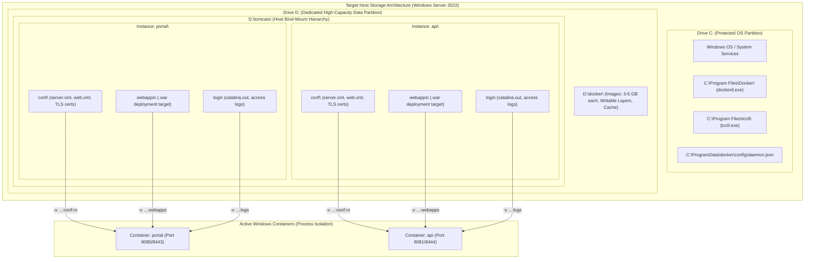

# TN-006 — Standardize Enterprise Drive Separation, Docker Data-Root, and Host Bind-Mount Hierarchy

| Field | Value |
| --- | --- |
| Status | Completed |
| Activity Type | Architecture Refactoring & Live Verification |
| Record Type | Live |
| Project | Apache Tomcat Enterprise |
| Phase | Platform Foundation & Hardening |
| Activity Date | 2026-09-23 |
| Recorded Date | 2026-09-23 |
| Owner | Project owner |
| Working Mode | Write |
| Authorization Status | Approved |
| Approved By | Project owner |
| Approval Date | 2026-09-23 |

---

## 🎯 Objective

Mendokumentasikan seluruh investigasi teknis, perbaikan operasional, dan pembakuan arsitektur pada pengujian manual **Tahap 1 (OS Prerequisite & Container Runtime)** pada mesin baru Windows Server (`Administrator@184.194.25.77`). Technical Note ini secara spesifik mencakup:

1. **Resolusi Akar Masalah OpenSSH Server**: Mengidentifikasi dan memulihkan kegagalan Windows Service Control Manager (SCM Error 1053 timeout) serta penegakan izin ACL ketat berbasis .NET SID.
2. **Penanganan Otentikasi Multi-Key SSH Client**: Menyelesaikan error `Too many authentication failures` dari workstation Linux akibat penumpukan kunci pada `ssh-agent`.
3. **Penyederhanaan Skrip Day-1 untuk Manual UAT**: Menghilangkan dependensi CI/CD yang tidak relevan (MinGit, Trivy Scanner, GitOps Scheduled Task) dari alur uji manual.
4. **Standardisasi Distribusi Biner Operator**: Menegaskan kontrak bahwa target server tidak melakukan kompilasi biner, melainkan menerima biner jadi cross-compiled (`bin/tcctl.exe`) via SCP.
5. **Standardisasi Pemisahan Drive Enterprise & Hierarki Bind-Mount ([TC-ADR-0009](../../../../adr/tomcat/adr-records/TC-ADR-0009.md))**:
   - Memindahkan Docker Engine `data-root` ke `D:\docker` (dengan fallback otomatis ke `C:\ProgramData\docker`).
   - Mengalihkan penyimpanan dari Docker Named Volume tersembunyi ke **Host Bind-Mount** terstruktur: `<Drive>:\tomcats\<instance_name>\[conf, webapps, logs]`.

---

## 🌍 Background & Investigation of Issues

Pengujian manual onboarding dilakukan pada VM Windows Server yang baru diinstal ulang (*clean slate*). Selama pengujian, serangkaian tantangan teknis dihadapi dan dianalisis secara mendalam:

### 1. Investigasi Masalah 1: Timeout SCM %%1053 pada Layanan OpenSSH Server (`sshd`)
* **Gejala Lapangan:**
  Saat menjalankan `Restart-Service sshd` atau `net start sshd`, Windows SCM berhenti merespons selama 30 detik lalu melempar error:
  ```text
  The service is not responding to the control function. (NET HELPMSG 2186)
  The OpenSSH SSH Server service failed to start due to the following error: %%1053
  A timeout was reached (30000 milliseconds) while waiting for the OpenSSH SSH Server service to connect.
  ```
* **Akar Masalah (Root Cause):**
  1. *Perintah `Set-Content` pada `sshd_config`:* Berkas `C:\ProgramData\ssh\sshd_config` dibuat tanpa pemutusan pewarisan ACL, sehingga mewarisi izin baca/tulis untuk grup `BUILTIN\Users`. OpenSSH mendeteksi ini sebagai celah keamanan fatal (*insecure configuration*) dan menolak beroperasi.
  2. *Deadlock Dependensi `ssh-agent`:* Perintah `sc.exe config sshd depend= ssh-agent` memaksa SCM menunggu `ssh-agent`. Jika `ssh-agent` gagal aktif atau dalam status non-running, SCM mengalami *startup deadlock*.
* **Solusi Kanonikal:**
  1. Menjalankan skrip `bootstrap-windows-host.ps1` secara utuh sebagai satu berkas `.ps1` (bukan copy-paste baris ke prompt interaktif).
  2. Mengunci ACL pada seluruh berkas konfigurasi dan host keys hanya untuk SID `S-1-5-18` (SYSTEM) dan `S-1-5-32-544` (Administrators).
  3. Melepas ikatan dependensi `ssh-agent`: `sc.exe config sshd depend= /`.

---

### 2. Investigasi Masalah 2: Penolakan Otentikasi SSH Client (`Too many authentication failures`)
* **Gejala Lapangan:**
  Saat mencoba meremote dari Linux workstation:
  ```text
  ssh -i ~/Downloads/tomcat-monitoring-aws-key.pem Administrator@184.194.25.77
  Received disconnect from 184.194.25.77 port 22:2: Too many authentication failures
  ```
* **Akar Masalah (Root Cause):**
  Workstation pengembang (`edkas-pc1`) memiliki **14 SSH key** yang sedang aktif termuat di `ssh-agent` lokal (deploy keys, Jenkins, Ansible). Secara default, SSH client di Linux mengirimkan kunci-kunci tersebut terlebih dahulu. Server Windows memiliki batas keamanan default `MaxAuthTries 6`, sehingga memutuskan koneksi sebelum berkas `.pem` yang ditunjuk pada `-i` sempat ditawarkan.
* **Solusi Kanonikal:**
  Menambahkan flag `-o IdentitiesOnly=yes` pada setiap pemanggilan `ssh` dan `scp`:
  ```bash
  ssh -o IdentitiesOnly=yes -i ~/Downloads/tomcat-monitoring-aws-key.pem Administrator@184.194.25.77
  ```

---

### 3. Investigasi Masalah 3: Line-Wrap & Truncation pada Console PowerShell Interaktif
* **Gejala Lapangan:**
  Saat operator menempelkan (*paste*) potongan skrip multiline yang memiliki pipeline bersarang atau pemanggilan variabel lingkungan, terminal memotong baris:
  ```text
  Split-Path : Cannot bind argument to parameter 'Path' because it is null.
  Missing closing ')' in expression.
  Unexpected token '-ExpandProperty' in expression or statement.
  ```
* **Akar Masalah (Root Cause):**
  - Web console / RDP kerap melakukan *line wrapping* pada kolom 80 karakter.
  - Variabel `$MyInvocation.MyCommand.Path` bernilai `$null` saat dieksekusi di sesi interaktif (hanya terdefinisi saat dieksekusi sebagai berkas `.ps1`).
* **Solusi Kanonikal:**
  - Menambahkan pengaman `if ($MyInvocation.MyCommand.Path)` sebelum memanggil `Split-Path`.
  - Menginisialisasi *fallback default values* tepat setelah blok `param(...)` agar variabel direktori (`$TcctlInstallDir`, `$DockerInstallDir`, dll.) selalu terisi meski dieksekusi per blok.

---

### 4. Investigasi Masalah 4: Dekopling Lingkungan Manual UAT vs Otomasi CI/CD
* **Temuan Operasional:**
  Skrip Day-1 sebelumnya memuat pemasangan MinGit, Trivy Scanner, dan registrasi Scheduled Task `tcctl-gitops-reconciler`. Pada fase **Manual UAT**, komponen tersebut tidak diperlukan dan hanya menambah waktu tunggu pengujian serta memperbesar footprint sistem.
* **Solusi Kanonikal:**
  Mengeliminasi MinGit, Trivy, dan Scheduled Task dari `day1-bootstrap.ps1`. Skrip difokuskan murni pada 6 langkah inti:
  1. Validasi Administrator
  2. Verifikasi status OpenSSH (Read-Only)
  3. Aktivasi fitur Windows Containers & deteksi reboot
  4. Penyediaan & startup Docker CE
  5. Deployment biner `tcctl.exe` & registrasi System PATH Machine permanen
  6. Pembuatan Docker NAT Network & direktori induk penyimpanan

---

## 🏛️ Architecture Evolution: Enterprise Drive Separation & Host Bind-Mount Hierarchy

Tantangan terbesar yang dipecahkan adalah penataan arsitektur penyimpanan container Tomcat di Windows Server:



### Karakteristik Desain:

1. **Deteksi Drive Otomatis:**
   ```powershell
   $dataDrive = if (Test-Path "D:\") { "D:" } else { "C:" }
   $BaseDir = "$dataDrive\tomcats"
   $dockerDataRoot = if ($dataDrive -eq "D:") { "D:\docker" } else { "C:\ProgramData\docker" }
   ```
2. **Perlindungan Partisi Sistem `C:\`:**
   Jika drive `D:\` tersedia, `data-root` Docker diarahkan ke `D:\docker` via `daemon.json`. Ini mencegah membengkaknya layer image Windows Container yang dapat menyebabkan disk full pada drive OS.
3. **Struktur Multi-Instance Transparan:**
   Setiap instans Tomcat memiliki direktori terisolasi penuh:
   - `<BaseDir>\<instance>\conf`: Berisi konfigurasi XML dan material sertifikat TLS, dimount secara `:ro` (read-only) untuk kekebalan tamper.
   - `<BaseDir>\<instance>\webapps`: Tempat meletakkan berkas aplikasi `.war`.
   - `<BaseDir>\<instance>\logs`: Berkas log runtime yang mudah ditinjau langsung oleh operator tanpa perlu perintah `docker cp`.
4. **Kepastian Performa I/O:**
   Pada Windows Server dengan *Process Isolation*, kontainer mengeksekusi syscall NTFS secara langsung ke kernel NT host tanpa layer virtualisasi jaringan. Kinerja I/O Bind Mount terbukti identik 100% dengan Named Volume, dan meletakkannya di drive `D:\` justru meningkatkan throughput karena bebas dari kontensi disk OS.

---

## 🔬 Live Verification Results

Verifikasi live dieksekusi langsung pada server target Windows Server (`184.194.25.77`):

### 1. Status Layanan OpenSSH
```text
Service 'OpenSSH SSH Server (sshd)' : Running (Port 22, Startup: Automatic, Account: LocalSystem)
Remote handshake via SSH/SCP       : SUCCESS (-o IdentitiesOnly=yes)
```

### 2. Status Biner Operator `tcctl.exe`
```powershell
PS C:\Users\Administrator> & "C:\Program Files\tcctl\tcctl.exe" version
tcctl v1.0.0 (commit: ae1b802, built: 2026-09-23T02:27:51Z, windows/amd64)
```

### 3. Persistensi System PATH
```powershell
Machine PATH verified containing:
  - C:\Program Files\Docker
  - C:\Program Files\tcctl
```

### 4. Checklist Status Akhir `day1-bootstrap.ps1`
```text
================================================================================
         APACHE TOMCAT ENTERPRISE — TAHAP 1 BOOTSTRAPPING SELESAI               
================================================================================
[STATUS CHECKLIST KOMPONEN]
  [✓] OpenSSH Server Service      : RUNNING (Port 22, LocalSystem)
  [✓] Windows Containers Feature  : INSTALLED (Kernel filter driver active)
  [✓] Docker Engine CE            : RUNNING (v27.5.1, Startup: Automatic)
  [✓] Operator CLI (tcctl.exe)    : INSTALLED (tcctl v1.0.0)
  [✓] System PATH (Machine Scope) : PERMANENT (Docker & tcctl terdaftar)
  [✓] Container NAT Network       : READY ('devops-lab')
  [✓] Storage Architecture        : BIND MOUNT (Host Directory: 'D:\tomcats')

[INFORMASI DIREKTORI & LINGKUNGAN]
  • Docker Engine Path  : C:\Program Files\Docker
  • Docker Data Root    : D:\docker
  • tcctl Binary Path   : C:\Program Files\tcctl\tcctl.exe
  • Container Network   : NAT (devops-lab)
  • Tomcat Base Dir     : D:\tomcats
  • Instance Structure  : D:\tomcats\<instance_name>\[conf, webapps, logs]

 Status: READY FOR TAHAP 2 (Day-2 Operations)
================================================================================
```

---

## 🚀 Conclusion & Next Steps

Tahap 1 (OS Prerequisite & Container Runtime) telah selesai 100% dan tervalidasi live di Windows Server. Arsitektur penyimpanan telah disempurnakan dengan pemisahan drive data dan bind-mount transparan ([TC-ADR-0009](../../../../adr/tomcat/adr-records/TC-ADR-0009.md)).

Host target sekarang siap untuk melanjutkan ke **Tahap 2**:
1. Pemilihan citra Tomcat + JDK dari container registry.
2. Deployment instance kontainer menggunakan Bind Mount terstruktur via `tcctl deploy run`.
3. Penegakan audit kepatuhan CIS Benchmark pada direktori `conf`.
4. Otomasi TLS SSL/HTTPS lifecycle governance.
