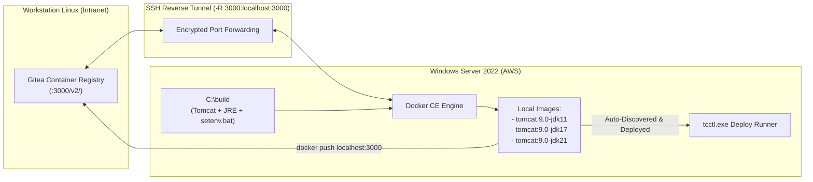

# TN-007 — Build Windows Container Tomcat NanoServer Multi-Java, Gitea OCI Registry Integration, and tcctl Interactive Provisioning Verification

| Field | Value |
| --- | --- |
| Status | Completed |
| Activity Type | Container Architecture, Multi-OS Build & Live Verification |
| Record Type | Live |
| Project | Apache Tomcat Enterprise |
| Phase | Platform Foundation & Hardening |
| Activity Date | 2026-09-23 |
| Recorded Date | 2026-09-23 |
| Owner | Project owner |
| Working Mode | Write |
| Authorization Status | Approved |
| Approved By | Project owner |
| Approval Date | 2026-09-23 |

---

## 🎯 Objective

Technical Note ini mencatat penyelesaian penuh tahapan **Container Provisioning, Hardening & HTTPS Lifecycle Governance (Tahap 2)** untuk Apache Tomcat Enterprise pada lingkungan Windows Server 2022 (`Administrator@184.194.25.77`), yang mencakup:

1. **Penyediaan Image Container Windows Offline / Air-Gapped**: Membangun image Apache Tomcat 9.0 berbasis **Windows NanoServer (`nanoserver:ltsc2022`)** dengan varian **Java 11, 17, dan 21** berukuran ultra-ringan (~185 MB layer delta, ~430–456 MB total) guna memecahkan keterbatasan akses internet di lingkungan production.
2. **Integrasi Gitea OCI Container Registry**: Mengintegrasikan registry bawaan Gitea (`localhost:3000/gitadm/tomcat:<tag>`) melalui *SSH Reverse Port Forwarding* (`-R 3000:localhost:3000`), sehingga host Windows dapat melakukan push dan pull image secara lokal tanpa internet publik.
3. **Penyelesaian Serangkaian Masalah Operasional Lapangan**: Mendokumentasikan dan memitigasi 6 kendala teknis kritis yang ditemukan saat pengujian manual (PowerShell Here-String indentation, Dockerfile backslash escaping, OpenSSH environment caching & KeepAlive timeout, Insecure Registry directory path, serta Tomcat JRE vs JDK environment requirement).
4. **Verifikasi Live Deployment Operator `tcctl`**: Memvalidasi fitur auto-discovery image lokal, seleksi interaktif versi Java, otomatisasi pembuatan struktur direktori Host Bind-Mount (`C:\tomcats\<instance>`), injeksi CIS Hardened XML templates, pembuatan sertifikat TLS self-signed, dan kelulusan probe kesehatan HTTP 8080 dengan status **HEALTHY (100% Compliant)**.

---

## 🌍 Background & Architecture Decisions

### 1. Tantangan Lingkungan Air-Gapped di Production
Di lingkungan enterprise, server production Windows Container sering kali berada di jaringan tertutup (*air-gapped*) tanpa akses ke Docker Hub atau Microsoft Container Registry (`mcr.microsoft.com`). Image resmi Tomcat di Docker Hub hanya menyediakan container Linux ELF, sehingga image container Windows native harus dirakit secara independen dan disimpan di repositori privat internal perusahaan.

### 2. Trade-Off Arsitektur: NanoServer vs ServerCore
Terdapat perbedaan signifikan antara varian base image Windows Containers:
- **ServerCore (`servercore:ltsc2022`)**: Ukuran base image sangat besar (**~4.5 GB**). Varian ini hanya diwajibkan jika aplikasi membutuhkan **Java 8** atau dependensi legacy GDI/AWT grafik dan Win32 sub-system.
- **NanoServer (`nanoserver:ltsc2022`)**: Ukuran base image sangat ramping (**~170 MB**). NanoServer mendukung runtime Java modern (**Java 11, 17, dan 21**) yang berjalan secara headless-native.
- **Keputusan**: Menggunakan **NanoServer + Eclipse Temurin JRE (11, 17, 21)** untuk menghemat ruang disk EBS (sisa disk lab ~8.6 GB) dan bandwidth transfer data.

### 3. Arsitektur Distribusi Melalui Gitea Registry & SSH Reverse Tunnel
Untuk menyalurkan image yang di-build di host Windows ke Gitea di workstation Linux tanpa mengekspos port publik:



---

## 🔬 Investigation of Operational Issues & Resolutions

Selama pelaksanaan pengujian manual, dijumpai 6 kendala operasional yang dianalisis akar masalahnya dan diselesaikan secara permanen:

### 1. Masalah 1: PowerShell Here-String Indentation Trap (Stuck pada Prompt `>>`)
* **Gejala:** Saat mem-paste script pembuatan Dockerfile ke prompt PowerShell, terminal tertahan dan terus menampilkan prompt kelanjutan baris `>>`.
* **Akar Masalah:** Sintaks here-string PowerShell (`@' ... '@`) mensyaratkan penutup `'@` berada **persis di kolom pertama (tanpa spasi/indentasi)**. Indentasi copy-paste membuat PowerShell menganggap string belum ditutup.
* **Solusi Kanonikal:** Mengganti here-string menjadi format array string `@( "baris 1", "baris 2" ) | Set-Content -Encoding ASCII` yang 100% kebal terhadap masalah spasi dan indentasi.

### 2. Masalah 2: Dockerfile Path Backslash Escape Trap (`C:usrlocaltomcat is invalid`)
* **Gejala:** Saat menjalankan `docker build`, proses gagal pada Step 4 dengan error:
  ```text
  the working directory 'C:usrlocaltomcat' is invalid, it needs to be an absolute path
  ```
* **Akar Masalah:** Pada Dockerfile Windows, karakter backslash (`\`) berfungsi sebagai *escape character* secara default. String `C:\usr\local\tomcat` di-escape menjadi `C:usrlocaltomcat` karena `\u`, `\l`, dan `\t` dianggap escape sequence.
* **Solusi Kanonikal:** Menggunakan *forward slash* (`/`) yang merupakan standar resmi Docker untuk path Windows:
  `WORKDIR C:/usr/local/tomcat` dan `ENV CATALINA_HOME="C:/usr/local/tomcat"`.

### 3. Masalah 3: Docker Command Not Recognized pada Sesi SSH Baru
* **Gejala:** Setelah Docker CE diinstal, sesi SSH baru menampilkan error:
  `docker : The term 'docker' is not recognized as the name of a cmdlet...`
* **Akar Masalah:** Layanan OpenSSH Windows (`sshd`) me-*cache* daftar System `PATH` di memori saat service pertama kali dinyalakan. Penambahan PATH baru di registry tidak otomatis dimuat oleh child process sesi SSH.
* **Solusi Kanonikal:**
  1. Menambahkan direktori `C:\Program Files\Docker` ke All-Users PowerShell Profile (`$PSHOME\profile.ps1`) agar setiap sesi baru otomatis memuat path tersebut.
  2. Memperbarui skrip `setup_openssh_win_bootstrap.ps1` untuk melakukan pre-registrasi Machine PATH sebelum service `sshd` di-start pertama kali.

### 4. Masalah 4: OpenSSH Sering Terputus (Timeout / Broken Pipe)
* **Gejala:** Sesi SSH ke server Windows sering terputus otomatis (*connection closed by remote host*) jika terminal didiamkan idle selama 60–120 detik.
* **Akar Masalah:** Router NAT dan AWS Security Group melakukan *silent drop* pada state TCP connection yang tidak memiliki lalu lintas paket data.
* **Solusi Kanonikal:**
  1. Mengonfigurasi `ServerAliveInterval 30` dan `ServerAliveCountMax 5` di `~/.ssh/config` workstation Linux.
  2. Menambahkan `ClientAliveInterval 30` di `sshd_config` Windows Server.
  3. Mengatasi penolakan SCM `Cannot stop sshd service` saat restart dari dalam sesi SSH aktif dengan mengeksekusi restart via background process:
     ```powershell
     Start-Process powershell -ArgumentList "-Command Start-Sleep 1; Restart-Service sshd -Force"
     ```

### 5. Masalah 5: Error DirectoryNotFoundException pada `daemon.json`
* **Gejala:** Menulis konfigurasi `insecure-registries` ke `C:\ProgramData\docker\config\daemon.json` gagal dengan `DirectoryNotFoundException`.
* **Akar Masalah:** Folder induk `C:\ProgramData\docker\config` belum dibuat oleh instalasi default Docker.
* **Solusi Kanonikal:** Menambahkan `New-Item -ItemType Directory -Force -Path "C:\ProgramData\docker\config"` sebelum perintah `Set-Content`.

### 6. Masalah 6: Tomcat JRE vs JDK Environment Trap
* **Gejala:** Container langsung mati (*exit*) seketika saat di-start, tanpa sempat menulis log ke direktori `logs`.
* **Akar Masalah:** Image `eclipse-temurin` versi JRE mengekspor variabel `JAVA_HOME=C:\openjdk-11`. Script `bin\catalina.bat` secara eksplisit memeriksa keberadaan `javac.exe` jika `JAVA_HOME` didefinisikan. Karena JRE tidak memiliki compiler `javac.exe`, script Tomcat menolak berjalan dan langsung keluar dengan status non-zero.
* **Solusi Kanonikal:** Menambahkan file `bin\setenv.bat` di dalam direktori Tomcat sebelum proses build:
  ```cmd
  set "JRE_HOME=%JAVA_HOME%"
  set "JAVA_HOME="
  ```
  Dengan mengalihkan ke `JRE_HOME`, Tomcat hanya memvalidasi keberadaan `java.exe` dan langsung berjalan normal.

---

## 🏗️ Step-by-Step Implementation & Artifacts

Berikut konfigurasi kanonikal yang telah terbukti berhasil di lapangan:

### 1. Persiapan Binary dan `setenv.bat`
```powershell
Set-Location C:\build
Invoke-WebRequest -Uri "https://archive.apache.org/dist/tomcat/tomcat-9/v9.0.98/bin/apache-tomcat-9.0.98.zip" -OutFile "tomcat.zip"
Expand-Archive -Path "tomcat.zip" -DestinationPath "temp"
Move-Item "temp\apache-tomcat-9.0.98" "tomcat"
Remove-Item -Recurse -Force "temp", "tomcat.zip"

# Injeksi JRE_HOME handler
Set-Content -Path "C:\build\tomcat\bin\setenv.bat" -Value 'set "JRE_HOME=%JAVA_HOME%" & set "JAVA_HOME="'
```

### 2. Dockerfile Windows NanoServer Kanonikal
```dockerfile
ARG JAVA_TAG=11-jre-nanoserver-ltsc2022
FROM eclipse-temurin:${JAVA_TAG}

ENV CATALINA_HOME="C:/usr/local/tomcat"
WORKDIR C:/usr/local/tomcat

COPY tomcat .

EXPOSE 8080 8443

CMD ["cmd.exe", "/c", "bin\\catalina.bat", "run"]
```

### 3. Eksekusi Build Multi-Java
```powershell
docker build --build-arg JAVA_TAG=11-jre-nanoserver-ltsc2022 -t tomcat:9.0-jdk11 .
docker build --build-arg JAVA_TAG=17-jre-nanoserver-ltsc2022 -t tomcat:9.0-jdk17 .
docker build --build-arg JAVA_TAG=21-jre-nanoserver-ltsc2022 -t tomcat:9.0-jdk21 .
```

### 4. Publikasi ke Gitea Registry
```powershell
docker tag tomcat:9.0-jdk11 localhost:3000/gitadm/tomcat:9.0-jdk11
docker tag tomcat:9.0-jdk17 localhost:3000/gitadm/tomcat:9.0-jdk17
docker tag tomcat:9.0-jdk21 localhost:3000/gitadm/tomcat:9.0-jdk21

docker push localhost:3000/gitadm/tomcat:9.0-jdk11
docker push localhost:3000/gitadm/tomcat:9.0-jdk17
docker push localhost:3000/gitadm/tomcat:9.0-jdk21
```
Hasil publish terverifikasi langsung pada Web UI Gitea:
`http://localhost:3000/gitadm/-/packages/container/tomcat/9.0-jdk21` (Platform: `windows/amd64`).

---

## 🚀 Live Verification with tcctl

Pengujian deployment dilakukan menggunakan biner `C:\Users\Administrator\tcctl.exe`:

```powershell
C:\Users\Administrator\tcctl.exe deploy run --name tomcat-lab --port 8080 --https-port 8443
```

### Rekaman Log Eksekusi Aktual:
```text
ℹ Discovered available Tomcat / Java images in local container repository:
   [1] tomcat:9.0-jdk11
   [2] eclipse-temurin:21-jre-nanoserver-ltsc2022
   [3] localhost/tomcat:9.0-jdk21
   [4] eclipse-temurin:17-jre-nanoserver-ltsc2022
   [5] localhost/tomcat:9.0-jdk17
   [6] eclipse-temurin:11-jre-nanoserver-ltsc2022

 Select image to deploy [1-6] (default: 1): 1
✔ Selected image: tomcat:9.0-jdk11

========================================================
 Deploying Hardened Tomcat Container: tomcat-lab
========================================================
ℹ Detected Container Engine: docker
ℹ Step 1: Preparing Host Bind-Mount Directory Structure in C:\tomcats\tomcat-lab...
ℹ Seeding hardened XML configuration templates into C:\tomcats\tomcat-lab\conf...
✔ Hardened XML templates successfully written into 'C:\tomcats\tomcat-lab\conf'.
ℹ Bootstrapping self-signed TLS material for instance 'tomcat-lab'...
✔ Self-signed TLS certificate created in C:\tomcats\tomcat-lab\conf\ssl
ℹ Step 2: Auditing XML in Host Directory (C:\tomcats\tomcat-lab\conf)...
✔ Pre-flight XML audit on Host Directory passed (100% compliant).
ℹ Step 3: Launching container 'tomcat-lab' (image: tomcat:9.0-jdk11) via docker...
✔ Container started successfully (ID: a7e962a23e67)
ℹ Step 4: Probing HTTP healthcheck endpoint: http://localhost:8080/
✔ Tomcat HTTP Server is HEALTHY (Response status: 404)
✔ HTTP healthcheck probe passed.
✔ Tomcat instance 'tomcat-lab' is up, running, and fully hardened!

 Endpoints:
   - HTTP    : http://localhost:8080/
   - HTTPS   : https://localhost:8443/

 Host Bind Mounts (TC-ADR-0009):
   - Base Dir : C:\tomcats
   - Conf     : C:\tomcats\tomcat-lab\conf (Read-Only :ro)
   - Webapps  : C:\tomcats\tomcat-lab\webapps
   - Logs     : C:\tomcats\tomcat-lab\logs
```

---

## 💡 Lessons Learned

1. **Efisiensi NanoServer**: Penggunaan Windows NanoServer memangkas ukuran container Tomcat dari ~5 GB (ServerCore) menjadi **~185 MB layer delta** (~430 MB total image), menghemat kuota dan ruang disk EBS secara drastis.
2. **Kepekaan Dockerfile Windows**: Penggunaan forward slash (`/`) pada Dockerfile Windows wajib dibiasakan untuk menghindari bug parsing backslash escaping.
3. **Pemisahan JRE dan JDK di Tomcat**: Menjalankan Apache Tomcat di atas runtime JRE murni (seperti Temurin JRE) selalu memerlukan pengalihan `JAVA_HOME` ke `JRE_HOME` melalui `bin\setenv.bat`.
4. **Sinergi Host Bind-Mount & Operator CLI**: Arsitektur [TC-ADR-0009](../../../../adr/tomcat/adr-records/TC-ADR-0009.md) terbukti sangat intuitif; operator dapat langsung mengaudit konfigurasi XML, memeriksa file log, dan memperbarui aplikasi WAR langsung dari direktori host `C:\tomcats\<instance>` layaknya instalasi bare-metal.

---

## 📚 References

- [TC-ADR-0009: Transparent Host Bind-Mount Hierarchy and Base-Dir Architecture](../../../../adr/tomcat/adr-records/TC-ADR-0009.md)
- [How-To: Build Windows Container Tomcat NanoServer & Publikasi ke Gitea Registry](../../../../how-to/Tomcat/build-windows-nanoserver-image-and-publish-gitea.md)
- [How-To: Tips & Trik SSH KeepAlive Anti-Putus dan Reverse Port Forwarding](../../../../how-to/configure-ssh-keepalive-and-reverse-tunnel.md)
- [Apache Tomcat 9.0 Official Documentation](https://tomcat.apache.org/tomcat-9.0-doc/)
- [Microsoft Windows Containers Base Images Documentation](https://learn.microsoft.com/en-us/virtualization/windows-containers/manage-images/container-base-images)
