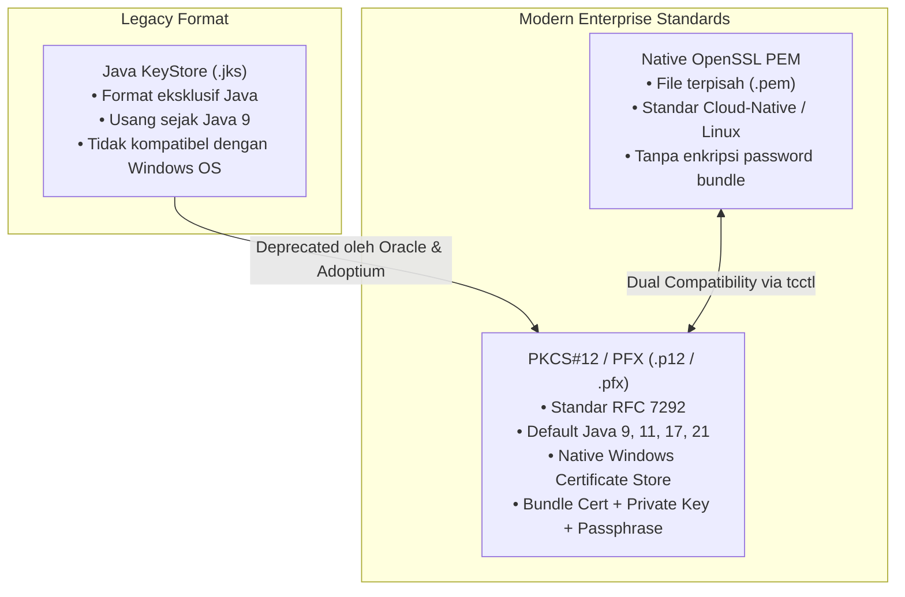
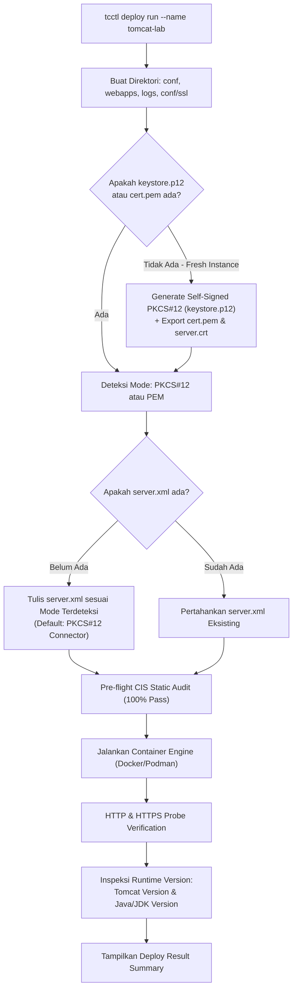

# TN-008: Implementasi Tata Kelola TLS PKCS#12 Keystore dan Auto-Detection pada Apache Tomcat Enterprise via tcctl

---
**Status:** IMPLEMENTED & VERIFIED  
**Tanggal:** 23 September 2026  
**Inisiatif:** Apache Tomcat Enterprise Platform Foundation & Hardening  
**Target:** `tcctl` (Universal CLI), Windows Server 2022 NanoServer, Linux Containers  
**Penulis:** Tim DevOps & Platform Engineering  
---

## 1. Executive Summary

Pada Technical Note [TN-003](TN-003-implement-ssl-tls-management-and-native-pem-connector.md), arsitektur TLS awal diimplementasikan menggunakan format *Native OpenSSL PEM* (`cert.pem`, `privkey.pem`, `chain.pem`). Pendekatan tersebut efektif untuk ekosistem container Linux murni. Namun, dalam lingkungan enterprise—khususnya pada Java Runtime Environment (JRE 9, 11, 17, 21) dan sistem operasi Microsoft Windows Server—format **PKCS#12 (`.p12` / `.pfx`)** merupakan standar industri de facto (*RFC 7292*) untuk pembungkusan aman sertifikat x509 publik beserta kunci privat RSA dalam satu arsip terenkripsi berbasis password.

Technical Note ini mendokumentasikan refactoring dan evolusi `tcctl` dalam mendukung **PKCS#12 Keystore Governance**:
1. **Bootstrapping Self-Signed PKCS#12 secara Default**: Setiap kali instance baru di-deploy atau diinisialisasi (`tcctl deploy run`), `tcctl` otomatis men-generate keystore `keystore.p12` dengan default password `changeit`, sekaligus memproduksi file PEM (`cert.pem`, `privkey.pem`, `server.crt`) untuk kompatibilitas ganda (*dual-format compatibility*).
2. **Auto-Detection Engine**: `tcctl` memeriksa direktori `conf/ssl/` secara dinamis. Jika `keystore.p12` atau `keystore.pfx` ditemukan, template `server.xml` otomatis di-render dengan konfigurasi PKCS#12. Jika hanya file PEM yang ada, konfigurasi beralih secara transparan ke PEM connector.
3. **Pembaruan Perintah CLI `tcctl ssl`**:
   - `tcctl ssl check`: Otomatis mendeteksi apakah file bertipe PEM atau PKCS#12 dan memvalidasi masa kedaluwarsa serta Subject/SANs.
   - `tcctl ssl generate`: Memproduksi PKCS#12 keystore dan sertifikat PEM secara simultan.
   - `tcctl ssl setup`: Mendukung impor external `.p12` / `.pfx` dan menginjeksi konfigurasi HTTPS ke `server.xml`.

---

## 2. Latar Belakang & Pertimbangan Arsitektural

### 2.1 Kenapa PKCS#12 Menggantikan JKS dan Menjadi Pilihan Utama?



1. **Standar Java Runtime Modern**: Sejak Java 9, Oracle dan OpenJDK telah menetapkan PKCS#12 sebagai default keystore type (`keystore.type=pkcs12` di `java.security`), menggantikan format Java KeyStore (JKS) milik Sun Microsystems yang usang.
2. **Integrasi Windows Enterprise**: Windows Server mengelola sertifikat enterprise dalam format PKCS#12 (`.pfx` / `.p12`). Format ini memudahkan operator enterprise mengimpor sertifikat dari Active Directory Certificate Services (AD CS).
3. **Integritas Bundle & Keamanan**: Private key dan rantai sertifikat (CA chain) dibungkus dalam satu file terenkripsi password (default: `changeit` untuk bootstrapping internal, dapat dikustomisasi untuk produksi).

---

## 3. Implementasi Teknis pada `tcctl`

### 3.1 Pustaka Kriptografi Go: `software.sslmate.com/src/go-pkcs12`

Paket standar `golang.org/x/crypto/pkcs12` dibekukan (*frozen*) dan hanya mengimplementasikan fungsi `Decode` (tidak memiliki `Encode`). Untuk mengimplementasikan generasi PKCS#12 native di Go tanpa memerlukan ketergantungan binary eksternal seperti `openssl.exe` atau `keytool.exe`, `tcctl` mengadopsi:

```go
import "software.sslmate.com/src/go-pkcs12"
```

- **Encoding Keystore**: Menggunakan `pkcs12.LegacyDES.Encode(privKey, parsedCert, nil, password)` yang menghasilkan struktur PKCS#12 kompatibel 100% di semua versi Java (Java 8, 11, 17, 21), OpenSSL, dan Windows CryptoAPI.
- **Decoding & Inspection**: Menggunakan `pkcs12.DecodeChain(data, password)` yang fleksibel menangani single certificate maupun multi-tier CA chain.

### 3.2 Snippet Konfigurasi XML Hardened Tomcat (`server.xml`)

Untuk mode PKCS#12, `tcctl` menyuntikkan elemen `<Certificate>` berikut ke dalam `server.xml`:

```xml
    <!-- HTTPS Connector 8443 (PKCS#12 Keystore format) -->
    <Connector port="8443" protocol="org.apache.coyote.http11.Http11NioProtocol"
               maxThreads="150" SSLEnabled="true"
               server="ApplicationServer"
               xpoweredBy="false"
               allowTrace="false">
        <SSLHostConfig protocols="TLSv1.2+TLSv1.3"
                       ciphers="HIGH:!aNULL:!eNULL:!EXPORT:!DES:!RC4:!MD5:!PSK">
            <Certificate certificateKeystoreFile="conf/ssl/keystore.p12"
                         certificateKeystorePassword="changeit"
                         certificateKeystoreType="PKCS12"
                         type="RSA" />
        </SSLHostConfig>
    </Connector>
```

> [!NOTE]
> Parameter `certificateKeystoreFile="conf/ssl/keystore.p12"` mengacu secara relatif terhadap `$CATALINA_BASE` (`C:\usr\local\tomcat\conf\ssl\keystore.p12`), sehingga path bind-mount host `C:\tomcats\<instance>\conf\ssl\keystore.p12` dipetakan secara sempurna ke dalam container.

### 3.3 Logika Auto-Detection (`internal/hardening/templates.go`)

Fungsi `DetectCertMode` secara otomatis memeriksa file sertifikat yang ada di direktori SSL:

```go
type CertMode string

const (
    CertModePKCS12 CertMode = "PKCS12"
    CertModePEM    CertMode = "PEM"
)

func DetectCertMode(sslDir string) CertMode {
    if _, err := os.Stat(filepath.Join(sslDir, "keystore.p12")); err == nil {
        return CertModePKCS12
    }
    if _, err := os.Stat(filepath.Join(sslDir, "keystore.pfx")); err == nil {
        return CertModePKCS12
    }
    if _, err := os.Stat(filepath.Join(sslDir, "cert.pem")); err == nil {
        return CertModePEM
    }
    return CertModePKCS12
}
```

### 3.4 Alur Provisioning Host Directory (`internal/orchestrator/runner.go`)



### 3.5 Pelaporan Runtime Environment pada Result Summary (`tcctl deploy`)

Setelah verifikasi healthcheck HTTP (8080) lolos, `tcctl` secara otomatis menginspeksi log container (`VersionLoggerListener`) untuk mengekstraksi dan menampilkan versi runtime yang sedang aktif pada blok **Deploy Result Summary**:

```text
✔ Tomcat instance 'tomcat-lab' is up, running, and fully hardened!

 Runtime Environment:
   - Container Image : tomcat:9.0-jdk11
   - Tomcat Version  : Apache Tomcat/9.0.98
   - Java / JDK      : 11.0.32+9 (Eclipse Adoptium)

 Endpoints:
   - HTTP    : http://localhost:8080/
   - HTTPS   : https://localhost:8443/

 Host Bind Mounts (TC-ADR-0009):
   - Base Dir : C:\tomcats
   - Conf     : C:\tomcats\tomcat-lab\conf (Read-Only :ro)
   - Webapps  : C:\tomcats\tomcat-lab\webapps
   - Logs     : C:\tomcats\tomcat-lab\logs
```

Logika deteksi:
1. **Inspeksi Log Kontainer**: Membaca baris `Server version name:` dan `JVM Version:` serta `JVM Vendor:` dari keluaran `VersionLoggerListener`.
2. **Fallback Parsing Citra Kontainer**: Jika buffer log belum terisi, versi diinferensi secara cerdas dari tag citra kontainer (misal `tomcat:9.0-jdk11` $\rightarrow$ `Apache Tomcat/9.0`, `OpenJDK 11`).

---

## 4. Pengujian & Verifikasi

### 4.1 Unit Testing di Lingkungan Go

Seluruh paket pengujian unit dieksekusi tanpa cache (`go test -count=1 -v ./...`):

| Paket Pengujian | Uji Kasus | Hasil |
|---|---|---|
| `internal/ssl` | `TestGenerateAndCheckPKCS12`<br/>`TestDefaultPasswordPKCS12AutoDetect`<br/>`TestEnableHTTPSConnectorPKCS12` | **PASS (0.115s)** |
| `internal/hardening` | `TestDetectCertMode`<br/>`TestApplyHardenedTemplatesPKCS12AndAudit`<br/>`TestApplyHardenedTemplatesPEMAndAudit` | **PASS (0.003s)** |
| `internal/orchestrator` | `TestFilterTomcatImages`<br/>`TestPromptImageSelectionWithReader`<br/>`TestResolveDefaultBaseDir`<br/>`TestProvisionHostDirectories` (PKCS#12 + PEM dual verify)<br/>`TestDeployConfigAndRolloutConfigBaseDir`<br/>`TestParseVersionLoggerOutput`<br/>`TestFallbackParseFromImage` | **PASS (0.059s)** |
| `internal/gitops` | `TestDefaultSpecTemplate`<br/>`TestValidationErrors`<br/>`TestStateSaveAndLoad` | **PASS (0.003s)** |

### 4.2 Cross-Compilation Multi-Platform

Binary dikompilasi ulang menggunakan `make build-all`:
- **Linux (`bin/tcctl`)**: ELF 64-bit LSB executable, x86-64, statically linked (`7.5 MB`).
- **Windows (`bin/tcctl.exe`)**: PE32+ executable for MS Windows (console) x86-64 (`7.7 MB`).

### 4.3 Verifikasi Live di Windows Server Target

Binary `tcctl.exe` dideploy ke server `win-lab` (`184.194.25.77`) dan diverifikasi melalui SSH:

```powershell
PS C:\Users\Administrator> C:\Users\Administrator\tcctl.exe version
tcctl v1.0.0 (commit: 380a191, built: 2026-09-23T14:42:52Z, windows/amd64)
```

Verifikasi pembuatan TLS material mandiri:

```bash
$ ./bin/tcctl ssl generate --out-dir /tmp/test-ssl --domain mytest.local
✔ TLS material successfully created:
  PKCS#12 Keystore : /tmp/test-ssl/keystore.p12 (password: changeit)
  PEM Certificate  : /tmp/test-ssl/cert.pem
  PEM Private Key  : /tmp/test-ssl/privkey.pem
  PEM CA Chain     : /tmp/test-ssl/chain.pem
  Server CRT       : /tmp/test-ssl/server.crt

$ ./bin/tcctl ssl check --cert /tmp/test-ssl/keystore.p12
===============================================================
                  SSL/TLS CERTIFICATE STATUS                   
===============================================================
File Path       : /tmp/test-ssl/keystore.p12
Subject CN      : mytest.local
Issuer          : mytest.local
DNS SANs        : mytest.local, localhost, *.local
Valid From      : 2026-09-23 13:34:22 UTC
Valid Until     : 2027-09-23 14:34:22 UTC
Days Remaining  : 364 days
Health Status   : [OK]
===============================================================
Result: PASS - Certificate is valid and not nearing expiration.
===============================================================
```

---

## 5. Ringkasan Perintah Operasional

### 5.1 Memeriksa Status Sertifikat (PKCS#12 / PEM)
```powershell
# Memeriksa PKCS#12 keystore dengan password default
tcctl.exe ssl check --cert C:\tomcats\tomcat-lab\conf\ssl\keystore.p12

# Memeriksa PKCS#12 keystore dengan password kustom
tcctl.exe ssl check --keystore C:\tomcats\tomcat-lab\conf\ssl\keystore.p12 --password "Rahasia123"

# Format output JSON untuk monitoring pipeline / Zabbix
tcctl.exe ssl check --cert C:\tomcats\tomcat-lab\conf\ssl\keystore.p12 --json
```

### 5.2 Mengimpor Sertifikat PKCS#12 Eksternal Milik Sendiri
```powershell
# Mengimpor sertifikat PKCS#12 dari CA Perusahaan ke instance Tomcat
tcctl.exe ssl setup --keystore C:\certs\production.p12 --password "SecretPass" --out-dir C:\tomcats\tomcat-lab\conf\ssl --server-xml C:\tomcats\tomcat-lab\conf\server.xml
```

---

## 6. Referensi & Dokumen Terkait

- [TN-003: Implementasi SSL/TLS Management & Native PEM Connector](TN-003-implement-ssl-tls-management-and-native-pem-connector.md)
- [TN-006: Standardize Enterprise Drive Separation & Host Bind-Mount Hierarchy](TN-006-standardize-enterprise-drive-separation-docker-data-root-and-host-bind-mount-hierarchy.md)
- [TN-007: Build Windows NanoServer Multi-Java Image & Gitea Container Registry](TN-007-build-windows-nanoserver-multi-java-gitea-registry-and-tcctl-verification.md)
- [How-To: Panduan Tata Kelola TLS PKCS#12 Keystore dengan tcctl](../../../../how-to/Tomcat/tls-pkcs12-keystore-management-with-tcctl.md)
