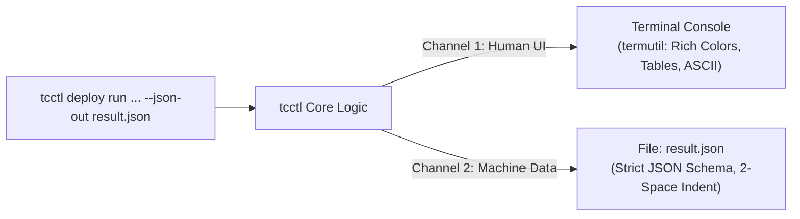
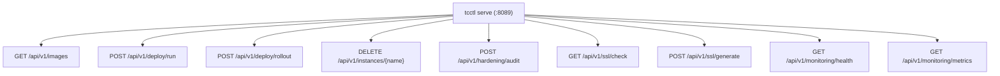

# TN-009: Desain Arsitektur REST API Daemon dan Standardisasi JSON Output pada tcctl untuk Integrasi Aplikasi Self-Service

---
**Status:** DRAFT & ACCEPTED FOR IMPLEMENTATION  
**Tanggal:** 24 September 2026  
**Inisiatif:** Apache Tomcat Enterprise Platform Foundation & Hardening  
**Target:** `tcctl` (Universal CLI & Platform Daemon), Self-Service Portal / IDP Integration  
**Penulis:** Tim DevOps & Platform Engineering  
---

## 1. Executive Summary

Sejak rilis [TN-002](TN-002-implement-cross-platform-operator-tcctl-and-runtime-volume-architecture.md) hingga [TN-008](TN-008-pkcs12-keystore-governance-and-auto-detection.md), `tcctl` (*Tomcat Control CLI*) telah membuktikan keandalannya sebagai kakas operator tunggal (*unified CLI*) yang mencakup 6 pilar tata kelola enterprise: hardening keamanan CIS, pemindaian kerentanan Trivy, observabilitas JMX, orkestrasi deployment zero-downtime, otonom GitOps reconciler, dan tata kelola sertifikat TLS PKCS#12.

Namun, dalam operasional enterprise skala besar, model interaksi CLI berbasis terminal memiliki keterbatasan mendasar:
1. **Ketergantungan Akses Langsung**: Tim aplikasi (*developer*) harus meminta bantuan tim SRE/Infra atau membutuhkan akses langsung (SSH / RDP / WinRM) ke host server Windows/Linux untuk mengeksekusi perintah.
2. **Kerapuhan Log Scraping (*Brittle Regex*)**: Ketika sistem eksternal atau CI/CD mencoba mengonsumsi output terminal `tcctl`, setiap perubahan format spasi, warna ANSI, atau kalimat status berisiko merusak parser otomatis.

Technical Note ini menetapkan **cetak biru arsitektur (*architectural blueprint*)** untuk mentransformasikan `tcctl` dari sekadar kakas CLI manual menjadi **Platform Service & Automation Engine** melalui dua inovasi utama:
- **Standardisasi Output JSON Non-Destruktif (Dual-Channel Pattern)**: Menambahkan opsi `--json-out <path>` pada seluruh sub-command `tcctl` tanpa mengubah atau merusak tampilan visual antarmuka terminal yang kaya (*rich human-readable CLI*).
- **Embedded REST API Daemon (`tcctl serve`)**: Menyematkan server HTTP REST API ringan langsung ke dalam biner Go tunggal `tcctl`, memungkinkan aplikasi web *Self-Service Portal* atau *Internal Developer Platform (IDP)* memicu provisi kontainer, inspeksi kepatuhan CIS, rotasi sertifikat, dan pembersihan kontainer secara programatik dan aman.

---

## 2. Latar Belakang & Analisis Masalah

### 2.1 Dilema Self-Service vs Principle of Least Privilege

```mermaid
flowchart TD
    subgraph PROBLEM_STATE ["Model Tradisional: Friksi & Celah Keamanan"]
        DEV1["Developer / App Team"]
        SSH["Akses Host Langsung<br/>(SSH / RDP / WinRM)"]
        HOST1["Production Host<br/>(Raw CLI Execution)"]
        DEV1 -->|Memerlukan akses tinggi| SSH --> HOST1
    end

    subgraph TARGET_STATE ["Model Modern: Self-Service Portal + tcctl Daemon"]
        DEV2["Developer / App Team"]
        PORTAL["Self-Service Web Portal<br/>(Backstage / IDP / Custom React)"]
        DAEMON["tcctl serve (:8089)<br/>(Embedded REST API Engine)"]
        HOST2["Windows / Linux Host<br/>(Container & Bind-Mounts)"]
        
        DEV2 -->|1. Request Instance via Web| PORTAL
        PORTAL -->|2. REST API Call + API Key| DAEMON
        DAEMON -->|3. In-Process Orchestration| HOST2
    end
```



Dalam tata kelola keamanan perbankan dan enterprise:
- Memberikan akses SSH/RDP kepada tim pengembang aplikasi untuk me-restart atau men-deploy instance Tomcat melanggar prinsip *Least Privilege* dan regulasi pemisahan tugas (*Separation of Duties*).
- Sebaliknya, jika semua permintaan harus ditangani manual melalui tiket IT (*ITSM Ticket Queue*), *Time-to-Market* rilis aplikasi melambat secara signifikan.
- Solusi terbaik adalah menyediakan portal swalayan (*Self-Service Portal*). Namun, backend portal membutuhkan kontrak antarmuka (*API Contract*) yang stabil dan aman untuk memerintahkan host server.

### 2.2 Tantangan Log Scraping

Terminal output `tcctl` sangat kaya informasi: memuat tabel sertifikat, ASCII summary box, spinner progress, dan indikator warna. Jika backend portal memanggil CLI via subprocess dan membaca `stdout`, parser regex akan mudah pecah (*brittle*) bila ada penambahan metrik baru. 

Oleh karena itu, diperlukan format pertukaran data standar (JSON) dengan skema yang terdefinisi ketat (*strict typed schema*).

---

## 3. Arsitektur Dual-Channel JSON Output

### 3.1 Prinsip Desain Non-Destruktif
1. **Layar Terminal Tetap Utuh**: Pengguna manusia (SRE) yang menjalankan perintah di terminal tetap mendapatkan tampilan interaktif kaya warna tanpa gangguan apa pun.
2. **Flag Universal `--json-out <path>`**: Menulis representasi data terstruktur yang identik langsung ke path file yang ditentukan.
3. **Standarisasi Tag JSON**: Seluruh struktur Go di dalam `tcctl` menggunakan penamaan `snake_case` konsisten.



### 3.2 Spesifikasi Skema JSON Per Sub-Command

#### A. `tcctl hardening audit`
```json
{
  "timestamp": "2026-09-24T06:00:00Z",
  "target": "C:\\tomcats\\tomcat-lab\\conf",
  "target_type": "host_bind_mount",
  "total_rules": 9,
  "passed": 9,
  "failed": 0,
  "compliance_percentage": 100.0,
  "status": "PASS",
  "results": [
    {
      "id": "CIS-TC-01",
      "description": "Server shutdown port disabled (-1)",
      "status": "PASS",
      "details": "Server shutdown port is set to -1"
    }
  ]
}
```

#### B. `tcctl deploy run` / `rollout` / `bluegreen`
```json
{
  "timestamp": "2026-09-24T06:01:00Z",
  "instance_name": "tomcat-lab",
  "container_id": "a7e962a23e67",
  "image": "tomcat:9.0-jdk11",
  "runtime": {
    "tomcat_version": "Apache Tomcat/9.0.98",
    "jvm_version": "11.0.32+9",
    "jvm_vendor": "Eclipse Adoptium"
  },
  "networking": {
    "http_port": 8080,
    "https_port": 8443,
    "jmx_metrics_port": 9404,
    "network": "devops-lab"
  },
  "storage": {
    "type": "host_bind_mount",
    "base_dir": "C:\\tomcats",
    "conf_path": "C:\\tomcats\\tomcat-lab\\conf",
    "conf_mode": "ro",
    "webapps_path": "C:\\tomcats\\tomcat-lab\\webapps",
    "logs_path": "C:\\tomcats\\tomcat-lab\\logs"
  },
  "health_check": {
    "endpoint": "http://localhost:8080/",
    "http_status": 404,
    "healthy": true
  },
  "status": "SUCCESS"
}
```

#### C. `tcctl monitoring health` & `metrics`
```json
{
  "timestamp": "2026-09-24T06:02:10Z",
  "endpoint": "http://localhost:9404/metrics",
  "jvm": {
    "heap_used_bytes": 145227776,
    "heap_max_bytes": 2147483648,
    "heap_usage_percent": 6.76,
    "non_heap_used_bytes": 45088768,
    "thread_count": 28,
    "thread_peak": 32,
    "uptime_seconds": 1240
  },
  "connectors": {
    "http_processing_time_ms": 45,
    "http_request_count": 120,
    "http_error_count": 0
  }
}
```

---

## 4. Desain Embedded REST API Daemon (`tcctl serve`)

### 4.1 Mengapa Embedded di Go?
- **Zero Runtime Dependency**: Biner statis tunggal tanpa perlu Node.js, Python, atau JVM di server target.
- **In-Process Performance**: Panggilan API memicu fungsi Go secara langsung di memori, menjamin eksekusi berkecepatan tinggi dengan footprint memori sangat rendah (<25MB RAM).

### 4.2 Endpoint Matrix (`/api/v1`)



| Method | Endpoint | Deskripsi Fungsi | Request Body Utama | Response Utama |
| :--- | :--- | :--- | :--- | :--- |
| `GET` | `/api/v1/images` | Discovery citra kontainer Tomcat/Java lokal | - | Array list image tags |
| `POST` | `/api/v1/deploy/run` | Men-deploy kontainer hardened baru | `{name, image, port, https_port}` | Deploy Result JSON |
| `POST` | `/api/v1/deploy/rollout` | Zero-downtime temporary staging update | `{name, image, port, staging_port}` | Rollout Result JSON |
| `DELETE` | `/api/v1/instances/{name}` | Teardown tuntas (stop, rm, hapus storage) | - | `{status: "DELETED", name}` |
| `POST` | `/api/v1/hardening/audit` | Static pre-flight audit CIS XML | `{conf_path}` atau `{volume}` | Audit Summary JSON |
| `POST` | `/api/v1/hardening/apply` | Tulis template XML CIS baseline | `{conf_path}` atau `{volume}` | Status penerapan |
| `GET` | `/api/v1/ssl/check` | Periksa masa berlaku & validity sertifikat | Query `?path=...` | SSL Status JSON |
| `POST` | `/api/v1/ssl/generate` | Generate self-signed PKCS#12 keystore | `{out_dir, domain, password}` | Status generasi |
| `GET` | `/api/v1/monitoring/health` | Probe HTTP/HTTPS endpoint | Query `?endpoint=...` | Health status JSON |
| `GET` | `/api/v1/monitoring/metrics` | Ambil metrik ringkas JVM JMX | Query `?endpoint=...` | Metrics JSON |

### 4.3 Keamanan REST API
1. **Otentikasi Token**: Header wajib `X-API-Key: <token>` atau `Authorization: Bearer <token>`.
2. **CORS Middleware**: Mengizinkan origin terdaftar (domain aplikasi Self-Service).
3. **Network Binding**: Default mengikat ke IP lokal `127.0.0.1` atau subnet manajemen yang ditentukan via flag `--host`.

---

## 5. Integrasi Background Service

### 5.1 Windows Server (Windows Service / Task)
Dijalankan sebagai background daemon:
```powershell
# Jalankan langsung di console / background
tcctl.exe serve --port 8089 --api-key "EnterpriseSecretToken2026" --host 0.0.0.0
```

### 5.2 Linux Host (systemd Unit)
Unit file `/etc/systemd/system/tcctl.service`:
```ini
[Unit]
Description=Tomcat Control REST API Daemon
After=network.target

[Service]
Type=simple
ExecStart=/usr/local/bin/tcctl serve --port 8089 --api-key "EnterpriseSecretToken2026" --host 0.0.0.0
Restart=always
RestartSec=5
User=root

[Install]
WantedBy=multi-user.target
```

---

## 6. Pemetaan Komponen UI Portal Self-Service

Dengan struktur JSON ini, tim frontend dapat merender antarmuka tanpa perlu memproses teks mentah:

| Field Data JSON | Elemen Visual Antarmuka Web |
| :--- | :--- |
| `instance_name` & `status` | **Card Title & Status Pill** (🟢 Running / 🔴 Failed) |
| `runtime.tomcat_version` | **Badge Info Versi Tomcat** (contoh: `Tomcat 9.0.98`) |
| `runtime.jvm_version` | **Badge Info Versi JDK** (contoh: `JDK 11.0.32+9 Adoptium`) |
| `networking.http_port` / `https_port` | **Hyperlink Akses Cepat** (`http://host:8080`, `https://host:8443`) |
| `compliance_percentage` | **Progress Bar CIS Compliance** (100% Hijau) |
| `health_check.healthy` | **Heartbeat Icon** (💓 Normal) |
| `storage.conf_mode` | **Security Chip** (🔒 Read-Only) |

---

## 7. Roadmap Implementasi

1. **Paket `internal/jsonutil`**: Menyediakan helper thread-safe untuk serialisasi dan ekspor file JSON.
2. **Refactoring CLI Subcommands**: Menambahkan flag `--json-out` pada command `hardening`, `deploy`, `monitoring`, `ssl`, dan `gitops`.
3. **Paket `internal/api`**: Membangun router HTTP REST, middleware auth/CORS, dan handler endpoint.
4. **Subcommand `tcctl serve`**: Menyematkan perintah daemon ke `cmd/tcctl/main.go`.
5. **Testing & Kompilasi Multi-Platform**: Unit test API handlers dan kompilasi via `make build-all`.
6. **Verifikasi Live**: Pengujian integrasi API via `curl` / Postman pada Windows Lab dan Linux.
