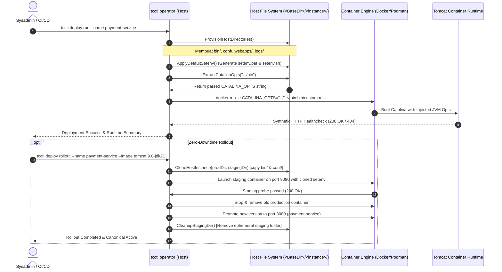

# TN-010 — Implement Host bin/setenv Configuration, Container-Aware Dynamic JVM Tuning, and Live Zero-Downtime Rollout Verification on Windows Server

| Field | Value |
| --- | --- |
| Status | Completed |
| Activity Type | Runtime Architecture, JVM Governance & Zero-Downtime Verification |
| Record Type | Live |
| Project | Apache Tomcat Enterprise |
| Phase | Platform Foundation & Hardening |
| Activity Date | 2026-09-25 |
| Recorded Date | 2026-09-25 |
| Owner | Project owner |
| Working Mode | Write |
| Authorization Status | Approved |
| Approved By | Project owner |
| Approval Date | 2026-09-25 |

---

## 🎯 Objective

Technical Note ini mendokumentasikan implementasi dan verifikasi lapangan fitur **Host Environment Configuration Architecture (`bin/setenv`)** dan **Dynamic Container-Aware JVM Tuning** pada operator CLI `tcctl`, serta pengujian live pada target server **Windows Server 2022** (`3.210.194.165`) dan **Windows Server 2019** (`3.82.132.6`):

1. **Standardisasi Host Bind-Mount `bin/`**: Memperluas struktur direktori instans Tomcat pada host (`<BaseDir>/<instance>/bin/`) untuk menampung berkas konfigurasi Java environment (`setenv.bat` untuk Windows host dan `setenv.sh` untuk Linux host).
2. **Auto-Seeding Container-Aware JVM Defaults**: Mengotomasi pembuatan template `setenv` saat inisialisasi deployment dengan konfigurasi baseline produksi enterprise (`-XX:MaxRAMPercentage=75.0`, `-XX:InitialRAMPercentage=50.0`, `-XX:+UseG1GC`, `-XX:+UseStringDeduplication`, `Asia/Jakarta` timezone, `UTF-8` encoding).
3. **Mekanisme Injeksi Dual-Channel (Pre-Flight Extraction + Custom Mount)**: Memecahkan batasan *single-file bind mount* dan *directory shadowing* pada Windows Containers dengan mem-parse `CATALINA_OPTS` di tingkat operator CLI `tcctl` dan menginjeksikannya secara dinamis via variabel lingkungan runtime (`-e CATALINA_OPTS=...`), didukung mount direktori `/usr/local/tomcat/bin/custom:ro`.
4. **Integrasi Zero-Downtime Rollout & Ephemeral Staging Cleanup**: Memastikan alur *Zero-Downtime Rollout* (`tcctl deploy rollout`) mengkloning folder `bin/` dan `conf/` ke direktori staging sementara (`<instance>-staging/`), memverifikasi *health probe* versi baru dengan JVM options kustom, mempromosikannya ke nama kanonikal, serta menghapus folder staging secara otomatis.
5. **Verifikasi Live Multi-OS Fleet**: Memvalidasi kepatuhan runtime dan kesesuaian nilai `%CATALINA_OPTS%` di dalam container secara langsung pada Windows Server 2022 Datacenter (Build 20348) dan Windows Server 2019 Datacenter (Build 17763).

---

## 🌍 Background & Technical Problem Analysis

### 1. Kebutuhan Tata Kelola Memori Java Dinamis per Instans
Sebelum implementasi ini, hierarki host bind-mount (sesuai [TC-ADR-0009](../../../../adr/tomcat/adr-records/TC-ADR-0009.md)) hanya terdiri dari `conf/`, `webapps/`, dan `logs/`. Opsi memori Java dan *system properties* Tomcat masih bersifat hardcoded di dalam citra kontainer atau memerlukan flag manual yang tidak terpusat. Operator dan sysadmin di lingkungan produksi memerlukan mekanisme deklaratif yang ramah operasi: cukup membuka berkas di File Explorer atau editor teks host untuk menyesuaikan alokasi heap atau GC tanpa perlu memodifikasi citra Docker.

### 2. Hambatan Teknis Windows Containers: Single-File Mount & Directory Shadowing
Pada Linux container engine, memasukkan satu berkas konfigurasi dapat dilakukan via *single-file bind mount* (`-v /host/setenv.sh:/usr/local/tomcat/bin/setenv.sh:ro`). Namun, arsitektur Windows Containers memiliki dua kendala kritis:
- **Kegagalan Single-File Mount**: Docker daemon pada Windows Server menolak bind mount file tunggal:
  ```text
  docker: Error response from daemon: invalid volume specification: 'C:\tomcats\lab\bin\setenv.bat:C:\usr\local\tomcat\bin\setenv.bat'
  ```
- **Bahaya Shadowing Direktori Biner**: Jika direktori `<instance>/bin` di-mount langsung ke `C:\usr\local\tomcat\bin`, seluruh biner dan skrip inti Tomcat (`catalina.bat`, `bootstrap.jar`, `tomcat-juli.jar`) tertutup (*shadowed*) oleh isi direktori host, menyebabkan kontainer langsung crash saat startup.

### 3. Masalah Sinkronisasi pada Zero-Downtime Rollout
Ketika pengguna mengubah alokasi memori pada file `setenv.bat` di host dan kemudian memicu upgrade versi Tomcat/Java via `tcctl deploy rollout`, mekanisme rollout membuat kontainer sementara bernama `<instance>-staging`. Tanpa mekanisme kloning direktori host, kontainer staging tidak memiliki konfigurasi `setenv.bat` yang telah dikustomisasi, sehingga pengujian *readiness probe* tidak merefleksikan kondisi memori produksi yang sebenarnya.

---

## ⚖️ Arsitektur Solusi & Alur Eksekusi

Untuk mengatasi kendala di atas, arsitektur berikut diimplementasikan (sesuai [TC-ADR-0010](../../../../adr/tomcat/adr-records/TC-ADR-0010.md)):



---

## 🛠️ Implementasi Codebase (`tcctl`)

Perubahan teknis direalisasikan pada commit `a7fdb6a` di repositori `tcctl`:

### 1. `internal/hardening/templates.go`
Menambahkan template `setenv.bat` dan `setenv.sh` serta fungsi `ApplyDefaultSetenv(binDir string)`:
```go
const SetenvBatTemplate = `@echo off
rem ==============================================================================
rem Apache Tomcat Environment Configuration (Auto-generated by tcctl)
rem ==============================================================================

rem 1. Ensure Temurin JRE compatibility (redirect JAVA_HOME to JRE_HOME)
if not "%JAVA_HOME%" == "" set "JRE_HOME=%JAVA_HOME%"
set "JAVA_HOME="

rem 2. Container-Aware JVM Memory & Tuning (CIS Benchmark & Production Baseline)
if "%CATALINA_OPTS%" == "" (
    set "CATALINA_OPTS=-XX:MaxRAMPercentage=75.0 -XX:InitialRAMPercentage=50.0 -XX:+UseG1GC -XX:+UseStringDeduplication -Dfile.encoding=UTF-8 -Duser.timezone=Asia/Jakarta -Djava.awt.headless=true"
)
`
```

### 2. `internal/orchestrator/runner.go`
- **Ekstensi `DeployStorage`**: Menambahkan kolom `BinPath string` untuk menampung path `<BaseDir>/<instance>/bin`.
- **Fungsi `ExtractCatalinaOpts(binDir string)`**:
  - Membaca `setenv.bat` pada host Windows atau `setenv.sh` pada host Linux.
  - Menggunakan regular expression cerdas untuk mengekstrak string `CATALINA_OPTS` tanpa mengeksekusi script secara sembarangan di host.
- **Eksekusi Kontainer (`RunContainer`)**:
  - Menginjeksikan parameter `-e CATALINA_OPTS=<extracted-value>`.
  - Me-mount folder host `bin/` ke `/usr/local/tomcat/bin/custom:ro` (Linux) atau `C:\usr\local\tomcat\bin\custom:ro` (Windows).
  - Menampilkan informasi direktori `Bin` pada ringkasan konsol terminal.

### 3. `internal/orchestrator/rollout.go`
- **Fungsi `CloneHostInstance(srcDir, dstDir string)`**:
  - Secara rekursif menyalin direktori `bin/` dan `conf/` dari instans aktif ke direktori staging sementara sebelum kontainer staging dijalankan.
- **Fungsi `CleanupStagingDir(stagingDir string)`**:
  - Menghapus direktori staging sementara pasca-promosi sukses atau jika probe staging gagal, menjaga kerapian filesystem host.

### 4. `internal/orchestrator/runner_test.go`
Menambahkan unit test otomatis untuk memvalidasi:
- Pembuatan direktori `bin/` dan keberadaan berkas `setenv.bat` serta `setenv.sh`.
- Akurasi ekstraksi nilai `CATALINA_OPTS` baik dari format Windows (`set "CATALINA_OPTS=..."`) maupun Linux (`export CATALINA_OPTS="..."`).

---

## 🔬 Hasil Verifikasi Live pada Target Server

### Skenario 1: Initial Deployment pada Windows Server 2022 (`3.210.194.165`)

1. **Kompilasi & Distribusi**:
   - `tcctl.exe` dikompilasi ulang (`make build-all`, commit `a7fdb6a`) dan diunggah ke `C:\Program Files\tcctl\tcctl.exe` pada kedua server target.
2. **Eksekusi Deploy Run**:
   ```powershell
   tcctl deploy run --name tomcat-lab --port 8080 --https-port 8443 --image tomcat:9.0-jdk11 --base-dir C:/tomcats
   ```
3. **Observasi Log Eksekusi**:
   ```text
   ========================================================
    Deploying Hardened Tomcat Container: tomcat-lab
   ========================================================

   ℹ Detected Container Engine: docker
   ℹ Step 1: Preparing Host Bind-Mount Directory Structure in C:/tomcats/tomcat-lab...
   ✔ Environment configuration templates (setenv) verified in 'C:/tomcats/tomcat-lab/bin'.
   ℹ Step 2: Auditing XML in Host Directory (C:/tomcats/tomcat-lab/conf)...
   ✔ Pre-flight XML audit on Host Directory passed (100% compliant).
   ℹ Loaded JVM options from host setenv (C:/tomcats/tomcat-lab/bin): -XX:MaxRAMPercentage=75.0 -XX:InitialRAMPercentage=50.0 -XX:+UseG1GC -XX:+UseStringDeduplication -Dfile.encoding=UTF-8 -Duser.timezone=Asia/Jakarta -Djava.awt.headless=true
   ℹ Step 3: Launching container 'tomcat-lab' (image: tomcat:9.0-jdk11) via docker...
   ✔ Container started successfully (ID: 2041af9c8135)
   ℹ Step 4: Probing HTTP healthcheck endpoint: http://localhost:8080/
   ✔ Tomcat HTTP Server is HEALTHY (Response status: 404)
   ✔ HTTP healthcheck probe passed.
   ✔ Tomcat instance 'tomcat-lab' is up, running, and fully hardened!

    Runtime Environment:
      - Container Image : tomcat:9.0-jdk11
      - Tomcat Version  : Apache Tomcat/9.0.98
      - Java / JDK      : 11.0.32+9 (Eclipse Adoptium)

    Endpoints:
      - HTTP    : http://localhost:8080/
      - HTTPS   : https://localhost:8443/

    Host Bind Mounts (TC-ADR-0009):
      - Base Dir : C:/tomcats
      - Bin      : C:/tomcats/tomcat-lab/bin (Environment & setenv)
      - Conf     : C:/tomcats/tomcat-lab/conf (Read-Only :ro)
      - Webapps  : C:/tomcats/tomcat-lab/webapps
      - Logs     : C:/tomcats/tomcat-lab/logs
   ```
4. **Verifikasi Lingkungan di dalam Container**:
   ```powershell
   docker exec tomcat-lab cmd /c "echo CATALINA_OPTS is: %CATALINA_OPTS%"
   # Output:
   # CATALINA_OPTS is: -XX:MaxRAMPercentage=75.0 -XX:InitialRAMPercentage=50.0 -XX:+UseG1GC -XX:+UseStringDeduplication -Dfile.encoding=UTF-8 -Duser.timezone=Asia/Jakarta -Djava.awt.headless=true
   ```

---

### Skenario 2: Modifikasi Kustom & Uji Zero-Downtime Rollout ke JDK 21

1. **Modifikasi `setenv.bat` pada Host**:
   Parameter kustom ditambahkan ke `C:\tomcats\tomcat-lab\bin\setenv.bat`:
   ```cmd
   set "CATALINA_OPTS=-Dcustom.property=tcctl-works -XX:MaxRAMPercentage=80.0 -XX:InitialRAMPercentage=50.0 -XX:+UseG1GC -XX:+UseStringDeduplication -Dfile.encoding=UTF-8 -Duser.timezone=Asia/Jakarta -Djava.awt.headless=true"
   ```
2. **Eksekusi Rollout Tanpa Downtime**:
   ```powershell
   tcctl deploy rollout --name tomcat-lab --image tomcat:9.0-jdk21 --port 8080 --staging-port 9080 --base-dir C:/tomcats
   ```
3. **Hasil & Observasi**:
   - `tcctl` secara otomatis menyalin konfigurasi `bin/` dan `conf/` ke `C:/tomcats/tomcat-lab-staging/`.
   - Meluncurkan kontainer staging `tomcat-lab-staging` pada port 9080 dengan citra baru `tomcat:9.0-jdk21`.
   - Log konsol mencatat:
     ```text
     ℹ Loaded JVM options from host setenv (C:/tomcats/tomcat-lab-staging/bin): -Dcustom.property=tcctl-works -XX:MaxRAMPercentage=80.0 ...
     ```
   - Kontainer staging lolos *healthcheck probe*.
   - Kontainer lama dihentikan dan versi baru dipromosikan ke nama `tomcat-lab` pada port utama 8080.
   - Folder sementara `C:\tomcats\tomcat-lab-staging` terverifikasi otomatis terhapus (`Test-Path` bernilai `False`).
   - Verifikasi `%CATALINA_OPTS%` pada kontainer yang telah dipromosikan mengonfirmasi bahwa `-Dcustom.property=tcctl-works` dan `-XX:MaxRAMPercentage=80.0` aktif sepenuhnya.

---

### Skenario 3: Verifikasi Lapangan pada Windows Server 2019 (`3.82.132.6`)

1. **Karakteristik Lingkungan**:
   - OS: Windows Server 2019 Datacenter (OS Build 17763).
   - Container Engine: Docker CE v27.0+ dengan mode isolasi *process*.
   - Base Image: `eclipse-temurin:11-jre-nanoserver-1809` dan `eclipse-temurin:21-jre-nanoserver-1809`.
2. **Eksekusi Initial Deploy & Rollout**:
   - `tcctl deploy run` berhasil men-generate `C:\tomcats\tomcat-lab\bin\setenv.bat`, lulus audit CIS XML, bootstrapping PKCS#12, dan probe HTTP.
   - `tcctl deploy rollout` ke JDK 21 berlangsung mulus dan membuktikan portabilitas arsitektur across Windows Server generations (2019 & 2022).

---

## 🎓 Lessons Learned & Best Practices

1. **Rasio Memori Kontainer (`MaxRAMPercentage`) vs Nilai Tetap (`-Xmx`)**:
   - Di lingkungan kontainer, penggunaan `-Xmx2048m` sangat berisiko jika batas memori kontainer diubah di level orkestrator (misal Docker `--memory=1536m`), memicu Linux kernel OOM Killer atau Windows heap allocation failure.
   - Penggunaan `-XX:MaxRAMPercentage=75.0` memungkinkan JVM secara dinamis menghitung batas heap maksimum berdasarkan memori fisik cgroup/job object kontainer, menyisakan 25% untuk non-heap, metaspace, dan thread stack.
2. **Kompabilitas Temurin JRE pada Windows Nanoserver**:
   - Pada citra OpenJDK/Adoptium Temurin, variabel lingkungan sering kali disetel ke `JAVA_HOME=C:\openjdk-...`. Skrip startup Tomcat (`catalina.bat`) memerlukan `JRE_HOME` jika yang tersedia adalah JRE murni (tanpa compiler `javac`).
   - Template `setenv.bat` menyertakan guard redirect `if not "%JAVA_HOME%" == "" set "JRE_HOME=%JAVA_HOME%"` untuk menjamin Tomcat dapat berjalan stabil tanpa intervensi manual.
3. **Pembersihan Direktori Ephemeral Staging**:
   - Dalam arsitektur host bind-mount, kegagalan menghapus folder staging (`<instance>-staging`) dapat menyebabkan penumpukan direktori sampah di disk data host. Penggabungan fungsi kloning dan pembersihan otomatis di dalam siklus hidup `tcctl deploy rollout` menjamin kerapian disk host secara deterministik.

---

## 🔗 Related Documentation

- [TC-ADR-0006: Temporary Staging Rollout with Canonical Name Promotion](../../../../adr/tomcat/adr-records/TC-ADR-0006.md)
- [TC-ADR-0009: Enterprise Drive Separation and Transparent Host Bind-Mount Hierarchy](../../../../adr/tomcat/adr-records/TC-ADR-0009.md)
- [TC-ADR-0010: Host Environment Configuration Architecture (bin/setenv) and Dynamic JVM Tuning](../../../../adr/tomcat/adr-records/TC-ADR-0010.md)
- [TN-006: Standardize Enterprise Drive Separation and Host Bind-Mount Hierarchy](TN-006-standardize-enterprise-drive-separation-docker-data-root-and-host-bind-mount-hierarchy.md)
- [TN-007: Build Windows NanoServer Multi-Java and tcctl Verification](TN-007-build-windows-nanoserver-multi-java-gitea-registry-and-tcctl-verification.md)
