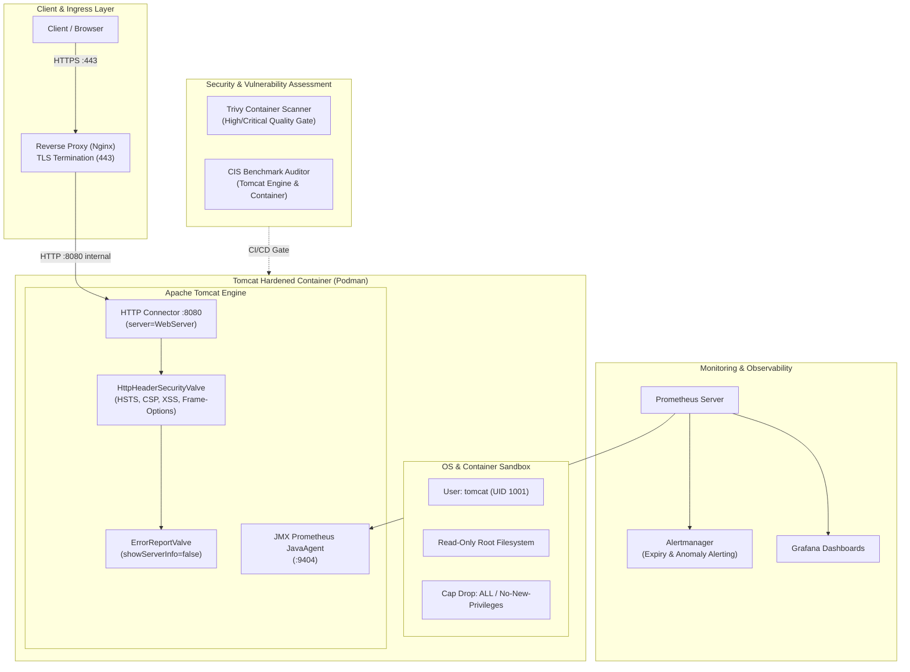

# Apache Tomcat Enterprise Solution

## 🔍 Overview

**Apache Tomcat Enterprise Solution** adalah solusi menyeluruh (*end-to-end*) untuk standarisasi, pengoperasian, dan pengamanan platform Apache Tomcat berbasis container di lingkungan DevOps dan produksi. Solusi ini dirancang untuk menggantikan pengelolaan Tomcat tradisional yang rapuh dan terfragmentasi dengan model murni (*pure cloud-native/container model*) yang idempoten, terobservasi, aman secara default (*secure-by-default*), dan minim intervensi manual.

Arsitektur platform mengintegrasikan runtime container non-root, pemantauan metrik internal JVM, kepatuhan audit keamanan berbasis CIS Benchmark, pemindaian kerentanan otomatis (*vulnerability assessment*), siklus hidup pembaruan zero-downtime, serta tata kelola sertifikat SSL/TLS otomatis.

---

## 🎯 Project Objectives

Solusi ini dibangun untuk mencapai target keandalan dan keamanan enterprise:

1. **Modernisasi Runtime**: Menstandarkan runtime Apache Tomcat 9.0 ke dalam immutable container image berbasis OCI menggunakan Podman.
2. **Observabilitas Melekat (*Self-Instrumented*)**: Mengintegrasikan JMX Exporter dan Telegraf secara *in-process* tanpa membuka port JMX remote yang tidak aman.
3. **Keamanan Berlapis (*Security Hardening*)**: Menerapkan prinsip *least-privilege* pada level OS/container (UID 1001, *read-only filesystem*, capabilities drop) serta level Tomcat engine (*shutdown port disable*, *server banner masking*, *security header valves*).
4. **Penilaian Kerentanan Berkelanjutan (*Continuous VA*)**: Menyematkan *quality gate* otomatis di alur CI/CD menggunakan Trivy, OWASP SCA, dan CIS Benchmark audit.
5. **Manajemen Pembaruan Andal (*Zero-Downtime Patching*)**: Menyediakan alur *Blue-Green deployment* dan penanganan *graceful shutdown* untuk pembaruan OS maupun aplikasi.
6. **Manajemen Sertifikat Terotomasi**: Mendukung enkripsi TLS modern dengan rotasi otomatis, mekanisme *hot-reload* tanpa me-restart JVM, serta pemantauan masa berlaku sertifikat.

---

## 🏗️ End-to-End Architecture

Diagram berikut mengilustrasikan alur operasional, keamanan, dan deployment dari model murni Apache Tomcat Enterprise:

---

## 📊 Matriks 6 Pilar Solusi

| No | Pilar Solusi | Status | Fokus Implementasi |
| :---: | :--- | :---: | :--- |
| **1** | **Modernisasi Container** | `Completed` | Greenfield OCI Containerfile standar, Podman rootless runtime, mount volume modular (`conf:ro`, `webapps`, `logs`). |
| **2** | **Self-Instrumented Monitoring** | `Completed` | Prometheus JMX Exporter agent, metrik JVM/thread/memory, Telegraf synthetic check, metrics parser di `tcctl`. |
| **3** | **Security Hardening** | `Completed` | Non-root UID 1001, read-only rootfs, noexec tmpfs, shutdown port (-1), 9 aturan CIS Benchmark audit offline di `tcctl`. |
| **4** | **Vulnerability Assessment** | `Completed` | CI/CD Trivy container scanning, automated quality gate thresholding (HIGH/CRITICAL), compliance reports di `tcctl va`. |
| **5** | **Manajemen Update** | `Completed` | Blue-Green zero-downtime deployment, automated health probe loop, instant rollback orchestration di `tcctl deploy`. |
| **6** | **Manajemen SSL Certificate** | `Completed` | Native OpenSSL PEM connector (port 8443), self-signed generator, CSR creation, key matching setup, dan expiry check di `tcctl ssl`. |

---

## 📁 Struktur Dokumentasi Project

Dokumentasi project ini diorganisasikan ke dalam beberapa topik utama:

* [**Architecture**](architecture/index.md): Rincian topologi container, spesifikasi storage/volume, dan pemetaan port.
* [**Security Hardening**](security-hardening/index.md): Pedoman teknis hardening OS container dan engine Tomcat.
* [**Vulnerability Assessment**](vulnerability-assessment/index.md): Alur scanning, tooling VA, dan kepatuhan standar CIS.
* [**Update Management**](update-management/index.md): Prosedur patch management, zero-downtime blue-green switch, dan rollback.
* [**SSL Management**](ssl-management/index.md): Tata kelola sertifikat, integrasi reverse proxy, native PEM connector, dan alert expiry.
* [**Engineering Journal**](engineering-journal/platform-foundation-and-hardening/index.md): Catatan teknis rekayasa, ADR, dan evolusi platform (TN-001 hingga TN-009).
