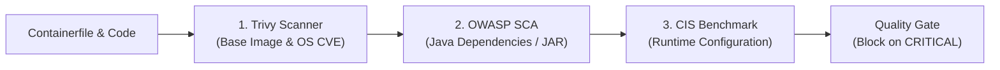

# Vulnerability Assessment Specification

## 🔍 Overview

Pilar **Vulnerability Assessment (VA)** bertugas memindai, mendeteksi, dan mencegah celah keamanan masuk ke lingkungan produksi secara proaktif melalui integrasi pengujian keamanan statis dan dinamis.

---

## 🔎 Lapisan Pemindaian Keamanan



### 1. Static Container Scanning (Trivy)
Trivy digunakan untuk mendeteksi kerentanan pada layer sistem operasi Linux dan library sistem:
* **Command Standar**:
  ```bash
  trivy image \
      --severity HIGH,CRITICAL \
      --ignore-unfixed \
      --exit-code 1 \
      localhost/${PROJECT}:${VERSION}
  ```
* **Quality Gate Policy**:
  * Severity `CRITICAL` dengan patch yang tersedia: **Build dibatalkan (Exit 1)**.
  * Severity `HIGH`: Notifikasi peringatan dan masa remediasi 14 hari.

### 2. Software Composition Analysis (SCA)
Memindai seluruh file library Java (`.jar`) yang berada di dalam `$CATALINA_HOME/lib` dan `WEB-INF/lib` terhadap basis data NVD (National Vulnerability Database).

### 3. Automated CIS Benchmark Audit
Audit kepatuhan berbasis skrip untuk memeriksa:
- [x] Kepemilikan berkas (tidak ada berkas milik root yang dapat dimodifikasi oleh user `tomcat`).
- [x] Hak akses direktori `conf/` (maksimal `0750`).
- [x] Status port shutdown dinonaktifkan (`port="-1"`).
- [x] Tidak ada aplikasi sampel atau manager yang tertinggal di `webapps/`.
