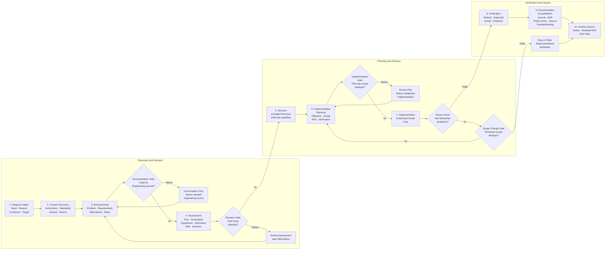

# Engineering Journal Standards

## 🔍 Overview

Engineering Journal Standards mendefinisikan cara mencatat perjalanan
engineering suatu project secara kronologis, terstruktur, dan dapat ditelusuri.
Pencatatan dimulai sejak kebutuhan disampaikan dan brainstorming dilakukan,
bukan hanya ketika perubahan teknis mulai diterapkan.

Engineering Journal menyimpan konteks saat pekerjaan dilakukan, seperti
kebutuhan, fakta, asumsi, alternatif, risiko, keputusan, authorization,
implementasi, hasil verifikasi, masalah, dan pembelajaran. Catatan tersebut
dikurasi menjadi rekaman engineering; jurnal bukan transkrip percakapan dan
bukan sumber utama untuk arsitektur atau prosedur operasional yang sedang
berlaku.

## 🎯 Objectives

- Menjaga perjalanan project sejak kebutuhan, brainstorming, keputusan,
  implementasi, hingga penutupan aktivitas agar dapat ditelusuri.
- Membedakan fakta, asumsi, hipotesis, alternatif, risiko, pertanyaan terbuka,
  dan keputusan selama pekerjaan berlangsung.
- Mencatat approval, authorization, scope change, dan evidence yang relevan.
- Menyediakan bukti bahwa perubahan atau kesimpulan telah diverifikasi.
- Merekam masalah, investigasi, penyelesaian, dan pembelajaran engineering.
- Memisahkan catatan perjalanan dari dokumentasi kondisi terkini.
- Menyediakan struktur yang konsisten untuk Engineering Journal lintas project.

## 📚 Scope

Standar ini berlaku untuk Engineering Journal pada seluruh project di handbook.
Jurnal mencatat discovery, brainstorming, assessment, perancangan, eksperimen,
implementasi, migrasi, deployment, verification, audit, troubleshooting,
recovery, dan konsolidasi dokumentasi.

Gunakan jenis dokumen berikut sesuai kebutuhan:

| Information | Source of Truth |
| --- | --- |
| Perjalanan project, pembahasan, dan hasil aktivitas | Engineering Journal |
| Keputusan arsitektur beserta alasan dan konsekuensinya | ADR |
| Ringkasan project serta arsitektur dan kondisi yang berlaku saat ini | Dokumentasi utama project |
| Prosedur penyelesaian masalah yang dapat digunakan kembali | Troubleshooting atau How To |
| Aturan tetap tentang cara AI bekerja di repository | `AGENTS.md` |

Engineering Journal boleh mengacu pada sumber lain, tetapi tidak menduplikasi
tanggung jawab dokumen tersebut. Ketika implementasi mengubah kondisi sistem,
dokumentasi utama project harus diperbarui bersama atau segera setelah
Technical Note diselesaikan.

Engineering Journal Standards tidak mengatur command permission, sandbox,
branch atau push policy, maupun perilaku tool tertentu. Aturan tersebut menjadi
tanggung jawab `AGENTS.md`. Jurnal hanya mencatat working mode, authorization,
approved scope, perubahan scope, dan evidence yang relevan dengan aktivitas.

## 🧭 Design Principles

### Chronological

Catat pekerjaan menurut urutan terjadinya. Jangan menulis ulang histori agar
terlihat seolah-olah seluruh implementasi berhasil pada percobaan pertama.

### Evidence-based

Nyatakan hasil berdasarkan verifikasi yang benar-benar dijalankan. Hindari
status `Completed` atau `Verified` jika bukti keberhasilan belum tersedia.

### Append-oriented

Setelah diterbitkan, pertahankan konteks historis Technical Note. Koreksi salah
ketik atau tautan yang rusak diperbolehkan. Perubahan engineering berikutnya
dicatat pada Technical Note baru dan dihubungkan dengan catatan sebelumnya.

Pengecualian hanya berlaku untuk controlled documentation migration yang
disetujui project owner, seperti menggabungkan Technical Note yang hanya
mencatat source control ke aktivitas teknis pemiliknya. Migrasi tersebut wajib
mempertahankan technical result, activity date, verification evidence, dan
commit identity yang masih relevan serta memperbarui seluruh nomor, navigation,
dan tautan secara konsisten.

### Current-state separation

Perintah, nilai konfigurasi, atau arsitektur di dalam jurnal dapat menjadi
usang. Berikan tautan menuju dokumentasi utama agar pembaca mengetahui sumber
prosedur dan kondisi terkini.

### Reproducible and safe

Sertakan informasi yang cukup untuk memahami atau mengulangi pekerjaan tanpa
menyimpan password, token, private key, session cookie, atau data sensitif lain.
Gunakan placeholder untuk secret dan samarkan data sensitif pada output.

### Curated record

Catat informasi yang memengaruhi pemahaman, keputusan, pelaksanaan, atau hasil
aktivitas. Ringkas percakapan menjadi konteks, temuan, alternatif, keputusan,
dan tindak lanjut. Jangan menyalin percakapan mentah sebagai dokumentasi resmi.

### Transparent reconstruction

Utamakan pencatatan secara live. Jika aktivitas harus direkonstruksi, jelaskan
waktu aktivitas dan waktu pencatatan secara terpisah, evidence yang digunakan,
serta bagian yang tidak dapat dipastikan. Jangan membentuk kronologi yang tidak
didukung evidence.

## 🚦 Engineering Activity Lifecycle

Engineering Journal dimulai sejak kebutuhan project diidentifikasi, bukan
hanya ketika perubahan teknis diterapkan. Lifecycle berikut menghubungkan
discovery, decision, delivery, verification, dan documentation tanpa
mengharuskan setiap tahap menjadi Technical Note terpisah.

Gunakan alur ini untuk project baru atau perubahan besar pada project yang
sudah berjalan. Aktivitasnya boleh dicatat dalam satu atau beberapa Technical
Note sesuai kompleksitas pekerjaan. Jangan membuat fase tambahan hanya untuk
memenuhi urutan ini apabila aktivitas tersebut sudah tercakup dalam fase yang
relevan.

### Workflow

| Stage | Purpose | Expected Output |
| --- | --- | --- |
| Request Intake | Menangkap kebutuhan, alasan awal, pengguna, dan hasil yang diharapkan. | Problem statement awal dan communication context. |
| Context Discovery | Mengumpulkan kondisi saat ini, batas repository, standar, dependency, dan evidence awal. | Facts, assumptions, constraints, dan source references. |
| Brainstorming | Mengeksplorasi kebutuhan, alternatif, konsekuensi, dan pertanyaan terbuka tanpa menganggapnya sebagai keputusan. | Alternatives, hypotheses, risks, dan open questions. |
| Assessment | Membandingkan temuan dan alternatif terhadap objective, constraint, keamanan, biaya, dan operability. | Findings dan recommendation yang dapat direview. |
| Decision | Menyetujui pilihan dan konsekuensi yang akan menjadi dasar pekerjaan. | Accepted decision; ADR untuk keputusan signifikan. |
| Implementation Planning | Menentukan scope, prerequisite, urutan kerja, rollback, dan verification criteria. | Approved implementation plan dan readiness result. |
| Implementation | Melaksanakan perubahan sesuai authorized scope dan mencatat deviation. | Perubahan, artifact, dan implementation evidence. |
| Verification | Membandingkan actual result dengan expected result. | Verification evidence dan conclusion. |
| Documentation Consolidation | Menerjemahkan hasil yang berlaku ke dokumentasi project, How-to, Troubleshooting, atau ADR. | Current-state documentation dan cross-reference yang diperbarui. |
| Activity Closure | Menutup objective berdasarkan completion criteria serta mencatat outstanding item dan residual risk. | Final status dan closure result. |

### Workflow diagram



Alur tersebut bukan proses linear yang melarang revisi. Temuan pada tahap
discovery, assessment, atau verification dapat mengembalikan pekerjaan ke tahap
sebelumnya. Catat perubahan secara kronologis dan jangan memperbarui dokumen
current-state berdasarkan alternatif yang belum disetujui atau hasil yang belum
berlaku.

### Approval gates

| Gate | Purpose | Minimum Record |
| --- | --- | --- |
| Documentation Gate | Memberikan izin untuk membuat atau memperbarui dokumentasi dalam scope aktivitas. | Communication context atau working-record metadata. |
| Decision Gate | Menetapkan pilihan yang menjadi dasar pekerjaan. | Accepted decision dan ADR jika keputusan signifikan. |
| Implementation Gate | Memberikan izin perubahan berdasarkan plan dan scope yang telah direview. | Authorization status, approver, approval date, dan approved scope. |
| Scope Change Gate | Menyetujui perubahan terhadap scope yang sedang dikerjakan. | Alasan, dampak, approver, dan approval date secara append-oriented. |

Approval tidak perlu disimpan sebagai transkrip percakapan. Catat hasilnya
secara ringkas dan dapat ditelusuri. Approval pada satu gate tidak otomatis
memberikan authorization untuk gate berikutnya.

### Documentation Output Mapping

Setiap hasil pembahasan ditempatkan berdasarkan tujuan dokumennya. Dokumentasi
project menyampaikan ringkasan dan kondisi yang berlaku, sedangkan Engineering
Journal menyimpan perjalanan, alasan, percobaan, dan bukti pekerjaan.

| Activity | Primary Documentation Output | Section or Document | Standard Reference |
| --- | --- | --- | --- |
| Penyampaian kebutuhan dan alasan awal | Engineering Journal | Discovery Technical Note — `Background` atau `Inputs` | `Discovery and Assessment` pada standar ini |
| Brainstorming, fakta, asumsi, dan pertanyaan awal | Engineering Journal | Discovery Technical Note — conditional sections | `Information Types and States` pada standar ini |
| Pembahasan desain dan arsitektur | Engineering Journal selama pembahasan; dokumentasi project setelah desain berlaku | Technical Note — `Findings` atau `Alternatives`; `architecture/index.md` | Standar ini dan [Documentation Standards](documentation-standards.md) |
| Penetapan kemampuan, batas, tujuan, dan keberhasilan | Engineering Journal selama pembahasan; dokumentasi project setelah disepakati | Technical Note; root `index.md` — `Scope` dan `Project Objectives` | Standar ini dan [Documentation Standards](documentation-standards.md) |
| Keputusan arsitektur signifikan | ADR | Dokumen ADR dan katalog ADR | [Architecture Decision Records](../adr/index.md) |
| Penetapan tanggung jawab repository dan workflow source | Dokumentasi development setelah berlaku; Engineering Journal selama perencanaan | `development/index.md`; Technical Note terkait | [Documentation Standards](documentation-standards.md) dan standar ini |
| Identifikasi kebutuhan environment dan platform | Dokumentasi infrastructure setelah tersedia; Engineering Journal untuk persiapan | `infrastructure/index.md`; Technical Note terkait | [Documentation Standards](documentation-standards.md) dan standar ini |
| Identifikasi kebutuhan delivery automation | Dokumentasi CI/CD setelah berlaku; Engineering Journal untuk perencanaan dan pelaksanaan | `ci-cd/index.md`; Technical Note terkait | [Documentation Standards](documentation-standards.md) dan standar ini |
| Penyusunan urutan implementasi | Engineering Journal | Phase index dan rangkaian Technical Note | `Phase index` dan `Repository Workflow` pada standar ini |
| Penyusunan serta pelaksanaan verifikasi | Engineering Journal | Technical Note — `Verification` | `Verification` pada standar ini |
| Prosedur teknis yang dapat digunakan lintas project | How-to | Root `how-to/` | [How-to Catalog](../how-to/index.md) |
| Hasil yang telah disepakati atau diterapkan dan menjadi kondisi berlaku | Dokumentasi utama project | Root `index.md` atau section current-state yang relevan | [Documentation Standards](documentation-standards.md) |

Pemetaan ini tidak mewajibkan informasi yang sama disalin ke beberapa tempat.
Gunakan tautan silang ketika pembaca memerlukan detail dari dokumen lain.
Sebagai contoh, Technical Note mencatat alasan penggunaan suatu komponen dan
menautkan How-to untuk prosedur pemasangannya; dokumentasi infrastructure
hanya merangkum komponen yang akhirnya digunakan.

### Implementation Gate checklist

Implementasi dapat dimulai ketika persiapan minimum berikut telah dipenuhi:

- [ ] Kebutuhan dan alasan pekerjaan telah dipahami.
- [ ] Scope dan exclusion telah disepakati.
- [ ] Objective dan success criteria dapat diverifikasi.
- [ ] Topology atau hubungan komponen yang relevan telah dijelaskan.
- [ ] Keputusan arsitektur signifikan telah dicatat sebagai ADR.
- [ ] Repository boundary dan ownership artifact telah ditentukan.
- [ ] Kebutuhan development, infrastructure, security, dan CI/CD telah
      diidentifikasi.
- [ ] Dependency, akses, dan prerequisite untuk pekerjaan awal tersedia atau
      memiliki tindak lanjut yang jelas.
- [ ] Urutan implementasi dan verification criteria awal telah disiapkan.
- [ ] Risiko atau hambatan yang diketahui telah dicatat.
- [ ] Authorization status, approver, approval date, dan approved scope telah
      dicatat.

Checklist ini menilai kesiapan untuk memulai, bukan menjamin seluruh kebutuhan
fase berikutnya sudah tersedia. Item yang belum diperlukan pada pekerjaan awal
dapat dijadwalkan sebagai tindak lanjut apabila tidak menghalangi objective dan
verification Technical Note pertama.

Jika readiness review menemukan hambatan yang memengaruhi desain, scope, atau
keputusan, lanjutkan pencatatan pada activity yang relevan. Jika hambatan hanya
memengaruhi pelaksanaan satu aktivitas, gunakan status `Blocked` pada Technical
Note dan catat kondisi yang diperlukan untuk melanjutkan.

## 🧩 Activity and Information Model

### Activity Types

Activity type menjelaskan sifat pekerjaan dan menentukan conditional sections.
Activity type bukan nama phase dan tidak menggantikan status Technical Note.

| Activity Type | Used For | Typical Output |
| --- | --- | --- |
| Discovery and Assessment | Kebutuhan, brainstorming, input arsitektur, assessment, dan readiness review. | Problem statement, findings, alternatives, assumptions, risks, open questions, dan recommendation. |
| Implementation | Perubahan source, configuration, automation, atau artifact. | Verified change dan implementation evidence. |
| Experiment | Prototype atau pengujian hypothesis sebelum keputusan atau implementasi final. | Supported atau rejected hypothesis beserta evidence. |
| Deployment or Migration | Perubahan runtime target, provisioning, release, atau pemindahan workload. | Deployment result, rollback status, dan runtime verification. |
| Verification or Audit | Pemeriksaan independen terhadap kondisi, compliance, artifact, atau implementasi. | Findings dan verification conclusion. |
| Troubleshooting or Recovery | Investigasi gangguan, root cause analysis, resolution, atau service recovery. | Confirmed cause, applied resolution, dan re-verification. |
| Documentation Consolidation | Konsolidasi hasil engineering ke current-state documentation, How-to, atau Troubleshooting. | Updated documentation dan source mapping. |

Implementation planning bukan activity type terpisah. Planning dicatat pada
Technical Note aktivitas yang akan dieksekusi dan statusnya tetap `Planned`
sampai Implementation Gate disetujui.

Keputusan juga bukan activity type terpisah. Pembahasannya berada pada aktivitas
yang menghasilkan keputusan, sedangkan keputusan signifikan dan konsekuensinya
dicatat pada ADR.

### Information Types and States

Gunakan information type untuk membedakan sifat informasi dan state untuk
menjelaskan perkembangannya. Jangan mencatat informasi yang belum pasti sebagai
fact atau accepted decision.

| Information Type | Meaning | States |
| --- | --- | --- |
| Fact | Kondisi atau hasil yang benar-benar diamati. | Observed, Verified, Disputed |
| Assumption | Pernyataan yang digunakan sementara tetapi belum dibuktikan. | Open, Verified, Invalidated |
| Hypothesis | Penjelasan atau dugaan yang harus diuji. | Proposed, Tested, Supported, Rejected |
| Alternative | Pilihan yang dipertimbangkan sebelum keputusan. | Proposed, Assessed, Selected, Rejected |
| Risk | Kondisi yang dapat menghambat atau merugikan hasil. | Open, Mitigated, Accepted, Closed |
| Open Question | Informasi yang masih membutuhkan jawaban. | Open, Answered, Deferred |
| Decision | Pilihan yang telah melewati Decision Gate. | Proposed, Accepted, Superseded |

Technical Note tidak wajib membuat tabel untuk seluruh information type. Catat
hanya informasi yang benar-benar muncul dan gunakan state ketika perubahan
statusnya perlu ditelusuri.

### Record Types and Dates

| Record Type | Usage |
| --- | --- |
| Live | Technical Note dibuat sebelum atau selama aktivitas dan diperbarui berdasarkan perjalanan aktual. |
| Reconstructed | Technical Note dibuat setelah aktivitas selesai berdasarkan source, evidence, dan ingatan yang masih tersedia. |

Reconstructed record wajib:

- Menyatakan bahwa catatan direkonstruksi;
- Mencatat `Activity Date` dan `Recorded Date` secara terpisah;
- Menjelaskan evidence yang digunakan;
- Menyatakan bagian yang tidak dapat diverifikasi; dan
- Tidak menulis ulang histori seolah-olah catatan dibuat secara live.

### Approval and Authorization Records

Metadata berikut wajib untuk seluruh Technical Note:

| Field | Purpose |
| --- | --- |
| Status | Menunjukkan lifecycle aktivitas. |
| Activity Type | Menentukan karakter aktivitas dan conditional sections. |
| Record Type | Membedakan live dan reconstructed record. |
| Project | Menunjukkan project pemilik aktivitas. |
| Phase | Menunjukkan workstream tempat aktivitas berada. |
| Activity Date | Menunjukkan tanggal aktivitas dimulai atau dilakukan. |
| Recorded Date | Menunjukkan tanggal Technical Note pertama kali dibuat. |
| Owner | Menunjukkan pihak yang bertanggung jawab terhadap hasil aktivitas. |

Untuk aktivitas yang melibatkan perubahan, tambahkan metadata berikut:

| Field | Allowed Values or Purpose |
| --- | --- |
| Working Mode | `Read-only`, `Write`, atau `Mixed`. |
| Authorization Status | `Not Required`, `Pending`, atau `Approved`. |
| Approved By | Pihak yang menyetujui implementation plan dan scope. |
| Approval Date | Tanggal authorization diberikan. |

Authorized scope tetap dijelaskan pada section `Scope`; metadata hanya mencatat
status authorization dan pihak yang menyetujui. Scope change dicatat secara
append-oriented dengan alasan, dampak, approver, dan tanggal persetujuan.

## 📂 Documentation Structure

Tempatkan Engineering Journal di dalam dokumentasi project dan kelompokkan
Technical Note berdasarkan fase atau workstream.

```text
<project>/
├── index.md
├── architecture/
├── operations/
└── engineering-journal/
    ├── index.md
    ├── <phase-a>/
    │   ├── index.md
    │   ├── TN-001-<activity>.md
    │   └── TN-002-<activity>.md
    └── <phase-b>/
        ├── index.md
        └── TN-001-<activity>.md
```

Fase menggambarkan kelompok pekerjaan yang memiliki tujuan dan output yang
jelas, misalnya `continuous-integration`, `continuous-deployment`,
`infrastructure-preparation`, atau `platform-migration`. Hindari membuat fase
hanya untuk menampung satu teknologi apabila aktivitas tersebut merupakan
bagian dari fase yang sudah ada.

Untuk jurnal kecil yang belum memerlukan pengelompokan, Technical Note boleh
ditempatkan langsung di `engineering-journal/`. Buat subdirektori fase ketika
jumlah atau hubungan antarcatatan mulai sulit dinavigasi.

## 🏷️ File Naming Convention

### Directory names

Gunakan huruf kecil dan tanda minus sebagai pemisah kata.

```text
engineering-journal/
continuous-integration/
infrastructure-preparation/
```

### Technical Note files

Gunakan format berikut:

```text
TN-NNN-<activity-in-kebab-case>.md
```

Contoh:

```text
TN-001-design-deployment-pipeline.md
TN-002-prepare-runtime-environment.md
TN-003-execute-initial-deployment.md
```

Aturan penomoran:

1. Gunakan tiga digit dan mulai dari `TN-001`.
2. Nomor berurutan berdasarkan kemunculan Technical Note di dalam satu fase.
3. Penomoran boleh dimulai kembali dari `TN-001` pada fase berbeda.
4. Nomor yang telah diterbitkan tidak digunakan ulang atau diubah, kecuali
   controlled documentation migration memenuhi pengecualian pada prinsip
   `Append-oriented`.
5. Sisipkan aktivitas baru dengan nomor berikutnya, lalu jelaskan hubungan
   kronologisnya melalui tautan.

Judul dokumen menggunakan pola `TN-NNN — <Action-oriented Title>`. Nama file dan
judul harus menjelaskan aktivitas utama, bukan hanya nama teknologi.

## 📌 Status

Gunakan status berikut pada katalog jurnal dan header Technical Note.

| Status | Meaning |
| --- | --- |
| Planned | Aktivitas telah direncanakan tetapi belum dimulai. |
| In Progress | Aktivitas sedang berlangsung. |
| Blocked | Aktivitas tidak dapat dilanjutkan sampai hambatan diselesaikan. |
| Completed | Objective selesai berdasarkan completion criteria activity type. |
| Superseded | Catatan tetap dipertahankan, tetapi hasilnya telah digantikan oleh Technical Note lain. |
| Abandoned | Aktivitas dihentikan tanpa menyelesaikan objective. |

`Completed` menjelaskan bahwa objective Technical Note telah selesai, bukan
bahwa seluruh project atau phase selesai dan bukan pula bahwa konfigurasi di
dalamnya masih berlaku. Gunakan completion criteria berikut:

| Activity Type | Completed When |
| --- | --- |
| Discovery and Assessment | Findings diklasifikasikan, open item terlihat, dan recommendation atau handoff tersedia. |
| Implementation | Approved scope selesai dan mandatory verification memenuhi expected result. |
| Experiment | Method dijalankan dan conclusion didukung actual result. |
| Deployment or Migration | Target state atau rollback state telah diverifikasi. |
| Verification or Audit | Seluruh criteria memiliki result atau exception yang dinyatakan. |
| Troubleshooting or Recovery | Root cause atau batas investigasi dinyatakan, resolution dicatat, dan re-verification dilakukan jika perubahan diterapkan. |
| Documentation Consolidation | Target documentation diperbarui dan source mapping direview. |

Untuk `Blocked`, `Superseded`, dan `Abandoned`, jelaskan alasan serta tautkan
tindak lanjut jika tersedia.

## 📄 Document Templates

### Project journal index

File `engineering-journal/index.md` memberikan orientasi seluruh jurnal
project. Gunakan struktur minimum berikut:

```markdown
# <Project> Engineering Journal

## 🔍 Overview

<Purpose, historical nature, and current-state documentation boundary.>

## 🧭 How to Use This Journal

<Recommended reading and links to current-state documentation.>

## 🛠️ Engineering Phases

| Phase | Scope | Status |
| --- | --- | --- |
| <Phase> | <Expected outcome> | <Status> |

## 📄 Document Types

<Relationship among Technical Notes, ADRs, and current-state documentation.>

## 🔗 Related Documentation

- [<Phase Journal>](<phase>/index.md)
- [<Current-state Documentation>](<relative-path>)
- [<ADR Catalog>](<relative-path>)
```

### Phase index

Setiap `phase/index.md` merangkum objective, hasil, dan urutan Technical Note
dalam fase tersebut.

```markdown
# <Phase> Engineering Journal

## 🔍 Overview

<Jelaskan konteks fase dan batas pembahasan jurnal.>

## 🎯 Objective

<Tuliskan hasil fase yang spesifik dan dapat diverifikasi.>

## 🛠️ Implementation Result

| Component | Implementation | Status |
| --- | --- | --- |
| <Component> | <Hasil implementasi> | <Status> |

## 📄 Technical Notes

1. **[TN-001 — <Judul>](TN-001-<activity>.md)**

    <Jelaskan tujuan atau hasil Technical Note secara ringkas.>

!!! note "Phase Output"

    <Tuliskan output ringkas, kontrak artefak, atau serah terima menuju fase berikutnya jika diperlukan.>

## 🎓 Lessons Learned

<Tuliskan pembelajaran penting yang ditemukan selama fase berlangsung.>

## 🔗 Related Documentation

<Berikan tautan menuju fase terkait dan dokumentasi current-state.>
```

Bagian `Implementation Result` dapat dihilangkan sebelum hasil implementasi
tersedia. `Lessons Learned` dapat dihilangkan jika belum terdapat pembelajaran
yang dapat digunakan kembali, tetapi harus dievaluasi kembali ketika fase
selesai. Admonition `Phase Output` bersifat opsional. Output fase yang ringkas,
seperti artifact contract, ditulis sebagai admonition `note` dan bukan section
level dua. Section tambahan seperti `Runtime Result` hanya digunakan jika
memberikan informasi hasil yang tidak terwakili oleh tabel implementation
result. Daftar Technical Note harus
mengikuti nomor, bukan urutan alfabet judul.

Phase index boleh memiliki section tambahan jika diperlukan untuk menjelaskan
karakter khusus fase. Sebagai contoh, fase CI/CD dapat menggunakan
`Final Pipeline Flow`, sedangkan fase lain tidak perlu menyediakan section tersebut.
Section tambahan bukan bagian struktur minimum dan tidak boleh dipaksakan pada
seluruh jenis fase.

### Technical Note

Gunakan satu base template dan pilih conditional sections berdasarkan activity
type. Pendekatan ini menjaga konsistensi tanpa memaksa aktivitas discovery,
experiment, implementation, atau troubleshooting menggunakan struktur yang
sama.

Seluruh Technical Note memiliki base sections berikut:

```text
Objective
Background
Scope
Activity Record               # diisi conditional sections
Outcome
Lessons Learned               # optional
Next Steps                    # optional
Notes                         # optional
Related Documentation
```

`Activity Record` bukan heading literal. Ganti bagian tersebut dengan
conditional sections yang sesuai. Nama base section tidak diganti dengan nama
yang lebih spesifik.

```markdown
# TN-NNN — <Action-oriented Title>

| Field | Value |
| --- | --- |
| Status | <Planned/In Progress/Blocked/Completed/Superseded/Abandoned> |
| Activity Type | <Activity type> |
| Record Type | <Live/Reconstructed> |
| Project | <Project name> |
| Phase | <Phase name> |
| Activity Date | YYYY-MM-DD |
| Recorded Date | YYYY-MM-DD |
| Owner | <Responsible party> |
| Working Mode | <Read-only/Write/Mixed; conditional> |
| Authorization Status | <Not Required/Pending/Approved; conditional> |
| Approved By | <Approver; conditional> |
| Approval Date | <YYYY-MM-DD; conditional> |

## 🎯 Objective

<One explicit outcome for this activity.>

## 🌍 Background

<Initial condition and reason for the activity.>

## 📚 Scope

<Activity boundary and authorized work. State exclusions only when needed.>

<!-- Insert conditional sections for the selected activity type here. -->

## 🧾 Outcome

<Result, conclusion, closure status, outstanding item, and residual risk.>

## 🎓 Lessons Learned

<Reusable learning or trade-off.>

## ⏭️ Next Steps

<Follow-up activity or N/A.>

## 📝 Notes

<Additional historical context or N/A.>

## 🔗 Related Documentation

- [<Previous or next Technical Note>](<relative-path>)
- [<Current-state Documentation>](<relative-path>)
```

`Objective`, `Background`, `Scope`, `Outcome`, dan `Related Documentation` wajib
untuk seluruh Technical Note. Gunakan `N/A` disertai alasan singkat hanya ketika
base section benar-benar tidak memiliki isi. `Lessons Learned`, `Next Steps`,
dan `Notes` digunakan jika relevan.

### Conditional sections

Pilih section berdasarkan activity type berikut. Urutkan section agar pembaca
dapat mengikuti konteks, aktivitas, dan hasil secara logis.

| Activity Type | Conditional Sections |
| --- | --- |
| Discovery and Assessment | Inputs, Findings, Assumptions, Alternatives, Risks, Open Questions, Recommendation, Decision Handoff |
| Implementation | Prerequisites, Execution Decision, Architecture jika diperlukan, Implementation Plan, Implementation, Verification, Troubleshooting, Scope Changes |
| Experiment | Prerequisites, Hypothesis, Experiment Setup, Method, Expected Result, Actual Result, Conclusion |
| Deployment or Migration | Prerequisites, Execution Decision, Change Plan, Rollback Plan, Deployment or Migration, Verification, Rollback Result, Scope Changes |
| Verification or Audit | Criteria, Method, Evidence, Findings, Exceptions, Conclusion |
| Troubleshooting or Recovery | Symptom, Impact, Investigation, Hypotheses, Root Cause, Resolution or Recovery, Re-verification |
| Documentation Consolidation | Source Inputs, Documentation Mapping, Changes, Review Result |

Tidak semua conditional section harus digunakan jika memang tidak relevan,
kecuali section tersebut diperlukan oleh completion criteria aktivitas. Bila
sebuah section dihilangkan, informasi pentingnya tidak boleh hilang atau
dipindahkan ke heading yang membingungkan.

`Execution Decision` menjelaskan keputusan yang diterapkan dan menautkan ADR
sebagai sumber keputusan. Ringkas penerapannya dalam scope Technical Note dan
jangan menyalin seluruh isi ADR.

`Scope Changes` digunakan hanya ketika authorized scope berubah setelah
Implementation Gate. Catat alasan, dampak, approver, dan approval date tanpa
menghapus scope awal.

## ⚙️ Implementation

### Sequential procedures

Gunakan komponen `procedure` ketika implementasi terdiri dari beberapa langkah
operasional yang harus dibaca atau dijalankan secara berurutan. Jangan gunakan
komponen ini untuk daftar keputusan, alasan, pilihan konfigurasi, katalog, atau
informasi lain yang tidak membentuk urutan kerja.

```markdown
<div class="procedure" markdown>

<div class="procedure-step" markdown>

### <Action-oriented Step Title>

<Brief context or purpose of the step.>

1. <First action.>
2. <Second action.>
3. <Third action.>

!!! success "Expected Result"

    <Specific and verifiable condition after completing the step.>

</div>

<div class="procedure-step" markdown>

### <Next Action-oriented Step Title>

<Brief context or purpose of the step.>

1. <First action.>
2. <Second action.>

!!! success "Expected Result"

    <Specific and verifiable condition after completing the step.>

</div>

</div>
```

Terapkan aturan berikut:

- Gunakan judul langkah berbahasa Inggris yang diawali kata kerja, seperti
  `Create`, `Configure`, `Run`, atau `Verify`.
- Jangan menulis `Step 1`, karakter `①`, atau nomor langkah lain secara manual.
  Nomor lingkaran dan garis vertikal dihasilkan otomatis oleh stylesheet
  procedure.
- Gunakan ordered list untuk tindakan yang harus dilakukan secara berurutan.
- Gunakan unordered list untuk pilihan, atribut konfigurasi, persyaratan, atau
  informasi yang tidak memiliki urutan eksekusi.
- Batasi satu procedure step pada satu tujuan utama. Pecah langkah yang memiliki
  hasil independen menjadi procedure step berikutnya.
- Berikan konteks singkat sebelum daftar tindakan ketika tujuan langkah belum
  terlihat jelas dari judulnya.

### Expected result per step

Setiap procedure step wajib ditutup dengan admonition berikut:

```markdown
!!! success "Expected Result"

    <Specific and verifiable condition after completing the step.>
```

`Expected Result` menjelaskan kondisi langsung yang seharusnya tercapai setelah
satu langkah selesai. Gunakan hasil yang dapat diamati, seperti file terbentuk,
service aktif, node berstatus `Online`, atau command mengembalikan hasil yang
ditentukan. Hindari pernyataan umum seperti "konfigurasi berhasil" tanpa
kriteria yang dapat diperiksa.

Admonition tersebut boleh memuat tautan menuju How-to, dokumentasi konsep, atau
referensi current-state jika pembaca membutuhkan penjelasan tambahan. Gunakan
tautan untuk memperluas konteks dan jangan menduplikasi pembahasan panjang di
dalam Technical Note.

### Commands and configuration

- Catat perintah yang relevan dan aman untuk ditampilkan.
- Jelaskan host, container, environment, atau working directory jika konteksnya
  tidak terlihat dari perintah.
- Gunakan placeholder seperti `<username>`, `<host>`, dan `<secret>` untuk nilai
  yang berbeda antar-environment atau bersifat sensitif.
- Hindari menyalin seluruh log. Sertakan potongan minimum yang membuktikan hasil
  atau menjelaskan masalah.
- Tautkan source file yang menjadi sumber kebenaran daripada menduplikasi file
  konfigurasi panjang.
- Setiap Technical Note yang menjalankan command wajib memiliki section
  `Commands Executed`. Catat seluruh command aktual, termasuk discovery yang
  material terhadap finding, implementation, verification, diagnostic, cleanup,
  dan command gagal. Jangan mengganti command dengan ringkasan; parameter
  sensitif diganti placeholder tanpa menghilangkan bentuk command.
- Untuk aktivitas dengan urutan teknis, tempatkan command aktual pada procedure
  step atau `Execution Record` sesuai urutan pelaksanaan. Setiap tahap harus
  mencatat purpose, command, expected result, actual result, dan evidence.
  Daftar `Commands Executed` tetap menjadi indeks atau pelengkap, bukan
  pengganti chronology. Command cleanup dicatat setelah resource yang menjadi
  target cleanup.

### Decisions

Technical Note boleh mencatat keputusan implementasi lokal yang kecil. Buat ADR
atau tautkan ADR yang ada jika keputusan memengaruhi arsitektur, memiliki
alternatif bermakna, atau menimbulkan konsekuensi jangka panjang.

### Issues and failed attempts

Catat kegagalan yang memberikan konteks atau pembelajaran. Pisahkan fakta yang
diamati dari kesimpulan. Jangan menyatakan root cause sebelum didukung oleh
hasil investigasi. Setelah resolution, ulangi verifikasi yang sebelumnya gagal.

## ✅ Verification

Gunakan Verification untuk aktivitas yang menghasilkan klaim teknis, perubahan
artifact, atau perubahan sistem. Verification harus membedakan empat hal:

| Element | Description |
| --- | --- |
| Method | Perintah, test, atau pemeriksaan yang dijalankan. |
| Expected result | Kriteria keberhasilan yang ditentukan. |
| Actual result | Hasil yang benar-benar diamati. |
| Evidence | Output, artifact, log ringkas, screenshot, atau referensi yang mendukung actual result. |

Sertakan tanggal atau environment apabila hasil mudah berubah. Jika suatu
kriteria belum diuji, nyatakan `Not verified`; jangan menganggap keberhasilan
berdasarkan hasil langkah lain.

`Expected Result` pada procedure merupakan kriteria keberhasilan untuk satu
langkah dan ditentukan sebelum atau saat implementasi dilakukan. Section
`Verification` tetap diperlukan pada activity type yang mencantumkannya sebagai
conditional section. Section tersebut mencatat metode pemeriksaan, hasil yang
diharapkan, actual result, dan evidence. Admonition per langkah tidak
menggantikan actual result dan tidak boleh digunakan sebagai bukti bahwa
verifikasi telah dilakukan.

## 🔄 Repository Workflow

1. Catat request intake dan communication context pada Engineering Journal.
2. Tentukan phase, objective, activity type, record type, scope, dan nomor
   Technical Note.
3. Buat entri `Planned` atau `In Progress` pada phase index.
4. Catat discovery, pembahasan, keputusan, aktivitas, dan evidence secara live.
5. Selesaikan approval gate yang diperlukan sebelum melanjutkan ke perubahan.
6. Catat scope change sebelum pekerjaan di luar authorized scope dilakukan.
7. Perbarui status menggunakan completion criteria activity type.
8. Buat atau perbarui ADR jika aktivitas menghasilkan keputusan signifikan.
9. Konsolidasikan hasil yang berlaku ke project documentation, How-to, atau
   Troubleshooting tanpa menduplikasi source of truth.
10. Perbarui phase index dan project journal index, lalu catat closure result,
    outstanding item, dan residual risk.
11. Review tautan, data sensitif, chronology, metadata, dan evidence sebelum
    diterbitkan.

### Version-control handoff

Stage, commit, push, dan konfirmasi push rutin merupakan mekanisme pengelolaan
source, bukan objective engineering yang berdiri sendiri. Jangan membuat
Technical Note baru, menambah entri phase index, atau memperpanjang rangkaian
aktivitas hanya untuk operasi tersebut.

Terapkan batas berikut:

- Commit yang diperlukan untuk menyimpan hasil aktivitas tetap menjadi bagian
  dari Technical Note yang menghasilkan perubahan. Jangan memecah commit atau
  finalisasi dokumentasi menjadi Technical Note terpisah.
- Push dilakukan manual oleh operator setelah handoff, kecuali authorization
  eksplisit menetapkan mekanisme lain. Informasikan kebutuhan push pada
  session handoff, bukan sebagai `Next Steps` Technical Note atau record
  publication tambahan.
- Push manual dan konfirmasi rutin bahwa push selesai tidak perlu dicatat pada
  Engineering Journal. Commit identity hanya dicatat jika diperlukan untuk
  traceability hasil utama.
- Publication, audit remote ref, troubleshooting Git, atau recovery boleh
  menjadi Technical Note hanya ketika aktivitas tersebut merupakan objective
  engineering, release, atau compliance yang disetujui secara eksplisit dan
  memiliki verification criteria sendiri.
- Technical Note source-control-only yang sudah ada boleh digabungkan melalui
  controlled documentation migration dengan authorization project owner.
  Pertahankan commit scope dan identity pada Technical Note teknis pemilik
  perubahan, hapus detail push rutin, lalu validasi ulang numbering,
  navigation, dan seluruh tautan.

Aturan ini mengatur granularitas Engineering Journal dan tidak memberikan
authorization untuk stage, commit, push, perubahan branch, atau remote
mutation. Permission dan workflow Git tetap mengikuti `AGENTS.md` serta
authorization repository yang berlaku.

### Runtime Component Ownership Gate

Sebelum configuration integration, image pull, atau component test untuk
runtime container baru dimulai, aktivitas discovery harus menetapkan salah satu
pilihan berikut:

1. Menggunakan repository runtime generik yang sudah tersedia.
2. Membuat repository runtime baru untuk component tersebut.
3. Mengonsumsi upstream langsung sebagai pengecualian yang disetujui.

Catat owner artifact, upstream identity dan pinning, lifecycle build/test/run/
cleanup, repository yang memiliki configuration integration, serta alasan
pilihan. Component dengan lifecycle image reusable sendiri harus memiliki
repository runtime terpisah; project integration tetap memiliki configuration,
validation lintas component, dan deployment orchestration. Jika ownership belum
jelas, berhenti pada discovery dan minta Decision Gate—jangan mengasumsikan
upstream image langsung sebagai contract implementasi.

## ⭐ Best Practices

- Buat satu Technical Note untuk satu objective yang dapat diverifikasi.
- Mulai Technical Note sebelum aktivitas berjalan jika konteksnya telah tersedia.
- Gunakan `Reconstructed` secara jujur ketika pencatatan live tidak terjadi.
- Bedakan fact, assumption, hypothesis, alternative, risk, open question, dan
  decision ketika perbedaannya memengaruhi pekerjaan.
- Pecah catatan jika memiliki beberapa hasil independen atau terlalu panjang
  untuk direview sebagai satu unit.
- Gunakan timestamp hanya ketika urutan kejadian di dalam satu aktivitas penting.
- Gunakan diagram untuk alur atau hubungan komponen yang sulit dijelaskan dengan
  teks, bukan sebagai dekorasi.
- Tautkan Technical Note pendahulu dan penerus ketika dependensinya tidak jelas
  dari nomor.
- Promosikan prosedur atau troubleshooting yang berulang ke dokumentasi utama,
  How To, atau Troubleshooting.
- Jangan memindahkan raw discussion langsung ke project documentation. Kurasi
  lebih dahulu dan publikasikan hanya hasil yang telah disepakati atau berlaku.
- Tulis bahasa dan istilah secara konsisten dengan
  [Writing Standards](writing-standards.md).

## 📋 Technical Note Review Requirements

Bagian ini mendefinisikan persyaratan yang digunakan saat mereview Technical
Note. Tabel berikut bukan laporan review dan tidak dicentang pada halaman
standar. Hasil pemeriksaan yang benar-benar dijalankan harus dicatat pada
`Verification`, `Outcome`, atau review record aktivitas terkait.

### Base requirements

| Category | Requirement | Applies To |
| --- | --- | --- |
| Placement | Lokasi phase dan nomor `TN` harus mengikuti struktur dan urutan yang berlaku. | Seluruh Technical Note |
| Metadata | Activity type, record type, tanggal, owner, dan status harus tersedia. | Seluruh Technical Note |
| Objective | Objective harus menyatakan satu hasil aktivitas yang jelas. | Seluruh Technical Note |
| Context | Background dan scope harus menjelaskan alasan dan batas aktivitas secara tidak ambigu. | Seluruh Technical Note |
| Structure | Conditional sections harus sesuai dengan activity type dan kebutuhan aktivitas. | Seluruh Technical Note |
| Information classification | Fact, assumption, hypothesis, alternative, risk, open question, dan decision harus dibedakan ketika relevan. | Seluruh Technical Note |
| Reconstruction | Chronology, evidence, dan uncertainty harus dijelaskan secara transparan. | Record type `Reconstructed` |
| Outcome | Hasil, outstanding item, dan residual risk yang relevan harus dinyatakan. | Seluruh Technical Note |
| Status | Status akhir harus memenuhi completion criteria activity type. | Seluruh Technical Note |
| Security | Secret dan data sensitif tidak boleh disimpan dalam jurnal. | Seluruh Technical Note |
| Decision | Keputusan signifikan harus menautkan ADR sebagai source of truth. | Aktivitas yang menghasilkan atau menerapkan keputusan signifikan |
| Documentation handoff | Perubahan current state harus dikonsolidasikan ke project documentation atau memiliki tindak lanjut yang jelas. | Aktivitas yang mengubah current state |
| Navigation | Project journal index, phase index, relative link, dan heading harus konsisten dan dapat dirender. | Seluruh Technical Note |

### Change activity requirements

| Category | Requirement | Applies To |
| --- | --- | --- |
| Authorization | Working mode dan authorization metadata harus tersedia sebelum perubahan dimulai. | Implementation dan Deployment or Migration |
| Approved scope | Scope yang disetujui harus dapat dibedakan dari rencana atau alternatif. | Aktivitas yang mengubah source, artifact, configuration, atau runtime |
| Scope change | Perubahan scope harus mencatat alasan, dampak, approver, dan approval date. | Aktivitas dengan perubahan authorized scope |
| Readiness | Prerequisite dan rollback requirement yang relevan harus dinyatakan secara tidak ambigu. | Implementation dan Deployment or Migration |
| Execution context | Implementation atau deployment harus menjelaskan environment dan konteks pelaksanaannya. | Implementation dan Deployment or Migration |
| Procedure | Procedure hanya digunakan untuk tindakan berurutan dan nomor langkah tidak ditulis secara manual. | Aktivitas yang menggunakan sequential procedure |
| Step result | Setiap procedure step harus memiliki `Expected Result` yang dapat diperiksa. | Aktivitas yang menggunakan sequential procedure |
| Verification evidence | Method, expected result, actual result, dan evidence harus dapat dibedakan. | Aktivitas yang memerlukan verification |
| Result boundary | `Expected Result` per langkah tidak boleh digunakan sebagai pengganti actual result. | Aktivitas yang menggunakan procedure dan verification |

### Discovery and decision requirements

| Category | Requirement | Applies To |
| --- | --- | --- |
| Curation | Raw discussion harus dikurasi menjadi konteks dan temuan yang relevan. | Discovery and Assessment |
| Decision boundary | Alternatives dan recommendation harus dapat dibedakan dari accepted decision. | Discovery and Assessment |
| Open items | Open question dan risk harus memiliki state atau tindak lanjut yang jelas. | Discovery and Assessment |
| Decision handoff | ADR harus ditautkan ketika Decision Handoff menghasilkan keputusan signifikan. | Discovery and Assessment yang menghasilkan keputusan signifikan |

## 🔗 Related Documentation

- [Documentation Standards](documentation-standards.md)
- [Writing Standards](writing-standards.md)
- [Personal Site Engineering Journal](../web-platform/personal-site/engineering-journal/index.md)
