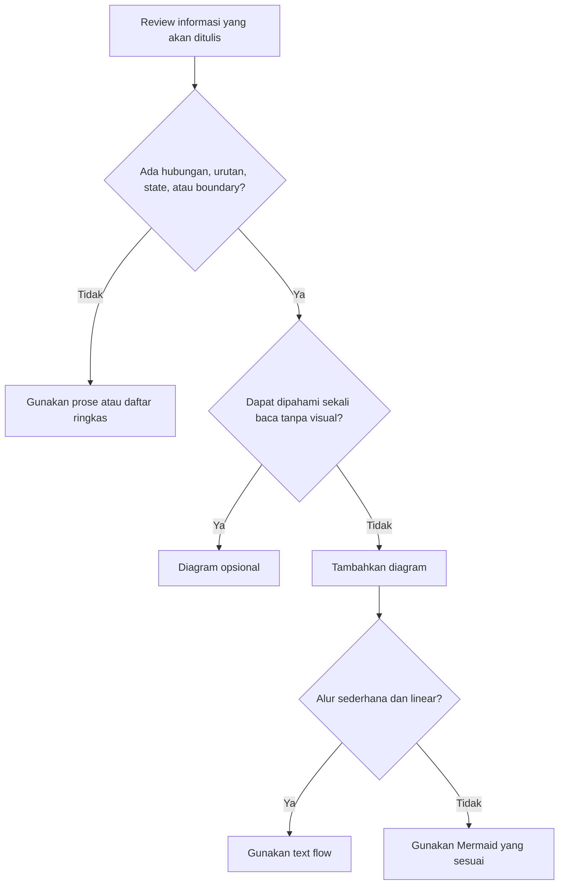

# Writing Standards

## 🔍 Overview

Writing Standards mendefinisikan gaya penulisan yang digunakan pada seluruh dokumentasi di DevOps Engineering Handbook.

Standar ini bertujuan menjaga konsistensi bahasa, struktur heading, penggunaan ikon, tabel, diagram, admonition, code block, serta elemen visual lainnya sehingga dokumentasi memiliki tampilan yang seragam dan mudah dipahami.

---

## 🎯 Objectives

Writing Standards bertujuan untuk:

- Menjaga konsistensi gaya penulisan dokumentasi.
- Meningkatkan keterbacaan dokumentasi.
- Menstandarkan penggunaan elemen visual.
- Mempermudah proses review dokumentasi.
- Memberikan pengalaman membaca yang konsisten.

---

## ✍️ Writing Style

Gunakan bahasa yang jelas, ringkas, dan mudah dipahami.

Gunakan kalimat aktif apabila memungkinkan.

Hindari penggunaan istilah yang ambigu atau tidak konsisten.

Gunakan istilah teknis yang umum digunakan dalam industri.

---

## 📝 Headings

Gunakan struktur heading secara berurutan.

```text
#
##
###
####
```

Jangan melompati level heading.

Contoh:

```markdown
# Architecture

## 🔍 Overview

### Build Process
```

Gunakan heading yang singkat namun mampu menjelaskan isi pembahasan.

Gunakan ikon hanya pada heading level dua (`##`) sesuai standar yang telah ditetapkan.

---

## 🎨 Icons

Ikon digunakan untuk membantu pembaca mengenali jenis informasi serta menjaga konsistensi visual di seluruh DevOps Engineering Handbook.

### Navigation

Ikon hanya digunakan pada **section utama** di sidebar.

Contoh:

- 🏠 Home
- 📏 Standards
- 🛠️ How To
- 🏛️ Architecture Decision Records
- 🚨 Troubleshooting

Ikon **tidak digunakan** pada sub navigasi seperti:

- Project
- Kategori
- Dokumen
- Architecture Decision Record (ADR)

Contoh:

```text
🏛️ Architecture Decision Records

Getting Started

Handbook

Personal Site

Ubuntu Base

Ubuntu SSH

NGINX Image
```

### Document Headings

Gunakan ikon pada heading level dua (`##`) sesuai dengan jenis informasi yang disajikan.

| Heading | Icon |
| -------- | ---- |
| Welcome | 👋 |
| Overview | 🔍 |
| Background | 🌍 |
| Why | ❓ |
| Objectives | 🎯 |
| Scope | 📚 |
| Requirements | 📋 |
| Target Audience | 👥 |
| Architecture | 🏛️ |
| High-Level Architecture | 🗺️ |
| Architecture Components | 🧩 |
| Build Flow | 🔨 |
| Deployment Flow | 🚀 |
| Storage Architecture | 💾 |
| Design Principles | 🧭 |
| How to Use This Journal | 🧭 |
| Engineering Phases | 🛠️ |
| Document Types | 📄 |
| Technical Notes | 📄 |
| Implementation Result | 🛠️ |
| Repository Structure | 📁 |
| Repository Organization | 🗂️ |
| Repository Responsibilities | 📌 |
| Repository Workflow | 🔄 |
| Technology Stack | 🧰 |
| Implementation | ⚙️ |
| Deployment | 🚀 |
| Backup and Recovery | 💾 |
| Verification | ✅ |
| Troubleshooting | 🛠️ |
| Best Practices | ⭐ |
| Release History | 📦 |
| Lessons Learned | 🎓 |
| Related Documentation | 🔗 |
| References | 📖 |
| Summary | 📝 |
| Next Step | ⏭️ |
| Recommended Reading Order | 🧭 |
| Documentation Structure | 📂 |
| Project Documentation Structure | 📁 |
| Document Templates | 📄 |
| File Naming Convention | 🏷️ |
| Directory Naming Convention | 📁 |
| ADR Numbering Convention | 🔢 |
| Architecture Decision References | 🏛️ |
| Visual Style | 🎨 |
| Context | 🌍 |
| Decision | ⚖️ |
| Execution Decision | ⚖️ |
| Rationale | 💡 |
| Consequences | ⚠️ |
| Status | 📌 |
| Date | 📅 |
| ADR Identifier Convention | 🆔 |
| Project Identifier | 📁 |
| ADR Lifecycle | 🔄 |
| ADR Template | 📋 |
| ADR Status | 📌 |
| Appendix | 📎 |
| Review Checklist | 📋 |

Gunakan ikon secara konsisten.

Hindari penggunaan ikon yang berbeda untuk heading dengan makna yang sama.

---

## 📊 Tables

Gunakan tabel untuk menyajikan informasi yang bersifat terstruktur.

Contoh:

| Component | Description |
| --------- | ----------- |
| Hugo | Static Site Generator |
| Git | Version Control |

Gunakan alignment bawaan Markdown.

---

## 🗺️ Diagrams

Gunakan diagram ketika hubungan, urutan, perubahan state, atau batas scope akan
lebih mudah dipahami secara visual daripada melalui paragraf atau daftar saja.
Diagram harus membantu pembaca membentuk mental model, bukan sekadar menjadi
dekorasi.

### Kapan Diagram Diperlukan

Tambahkan diagram apabila dokumentasi menjelaskan satu atau lebih kondisi
berikut:

- tiga atau lebih langkah yang saling bergantung;
- alur data, request, alert, deployment, rollback, atau approval;
- perubahan state, seperti `Planned` → `Approved` → `Implemented` → `Verified`;
- satu komponen yang memengaruhi beberapa komponen atau jalur berikutnya;
- topology, ownership, network boundary, atau hubungan antarkomponen;
- perbedaan antara current state, target state, dan bagian yang belum
  diverifikasi; atau
- rangkaian Technical Note atau next step yang harus dikerjakan secara
  berurutan.

Diagram tidak wajib untuk satu fakta, satu tindakan, atau daftar sederhana yang
sudah jelas tanpa visualisasi.

Gunakan alur berikut ketika menentukan kebutuhan visual:



### Pemilihan Bentuk Visual

| Informasi | Bentuk yang Direkomendasikan |
| --- | --- |
| Urutan linear sederhana | Text flow |
| Workflow dengan cabang atau approval gate | Mermaid flowchart |
| Interaksi berdasarkan waktu antarkomponen | Mermaid sequence diagram |
| Perubahan lifecycle atau status | Mermaid state diagram |
| Topology, ownership, atau network boundary | Mermaid architecture atau flowchart |
| Mapping field atau perbandingan berulang | Tabel |
| Layout visual yang tidak dapat diwakili Markdown atau Mermaid | Gambar |

Gunakan diagram text apabila sudah cukup menjelaskan alur atau hubungan
antarkomponen.

Contoh:

```text
Developer
     │
     ▼
Git
     │
     ▼
Jenkins
     │
     ▼
NGINX
```

Gunakan Mermaid apabila alur memiliki cabang, beberapa actor, perubahan state,
atau label hubungan yang akan sulit dibaca sebagai diagram text. Gunakan
diagram gambar hanya apabila text, tabel, dan Mermaid tidak lagi memadai.

### Aturan Penyajian

- Letakkan diagram sedekat mungkin dengan penjelasan yang didukungnya.
- Berikan heading atau kalimat pengantar yang menjelaskan tujuan diagram.
- Gunakan arah panah secara konsisten dan beri label pada hubungan penting,
  seperti protocol, port, approval, atau hasil transisi.
- Bedakan dengan jelas `current`, `target`, `verified`, `planned`, dan
  `unverified`; jangan menampilkan target seolah-olah sudah diterapkan.
- Setelah diagram, tulis ringkasan singkat mengenai kesimpulan atau batas yang
  harus dipahami pembaca.
- Jaga diagram tetap fokus. Pecah diagram jika satu visual memuat beberapa alur
  independen atau terlalu padat untuk dibaca.
- Jangan memasukkan password, token, private endpoint, personal recipient, atau
  material sensitif ke dalam diagram.
- Pastikan nama component, arah alur, port, dan status konsisten dengan source
  of truth serta penjelasan prose.

### Next Steps dan Technical Notes

Bagian `Next Steps` sebaiknya memiliki flow diagram ketika memuat beberapa
tahap berurutan, approval gate, atau perbedaan antara hasil Technical Note saat
ini dan target aktivitas berikutnya. Diagram minimum harus menunjukkan:

```text
Current verified state
          |
          v
Decision atau prerequisite
          |
          v
Implementation berikutnya
          |
          v
Verification target
```

Gunakan prose setelah diagram untuk menjelaskan exclusion, authorization yang
masih diperlukan, dan hal yang belum diverifikasi. Diagram tidak menggantikan
evidence atau penjelasan scope.

### Diagram Review Checklist

- Apakah diagram membuat hubungan atau urutan lebih cepat dipahami?
- Apakah current state dan target state dapat dibedakan?
- Apakah arah panah serta label hubungan tidak ambigu?
- Apakah diagram konsisten dengan prose, tabel, dan implementation aktual?
- Apakah diagram menghindari klaim bahwa pekerjaan planned sudah verified?
- Apakah diagram dapat disederhanakan atau diganti tabel/prose tanpa kehilangan
  kejelasan?

---

## 📢 Admonitions

Gunakan admonition untuk memberikan informasi penting.

Jenis admonition yang direkomendasikan:

- note
- info
- warning
- tip

Contoh:

````markdown
!!! note "Related Architecture Decision"

    #### Reference

    Implementasi pada bagian ini mengacu pada **PS-ADR-0003**.
````
