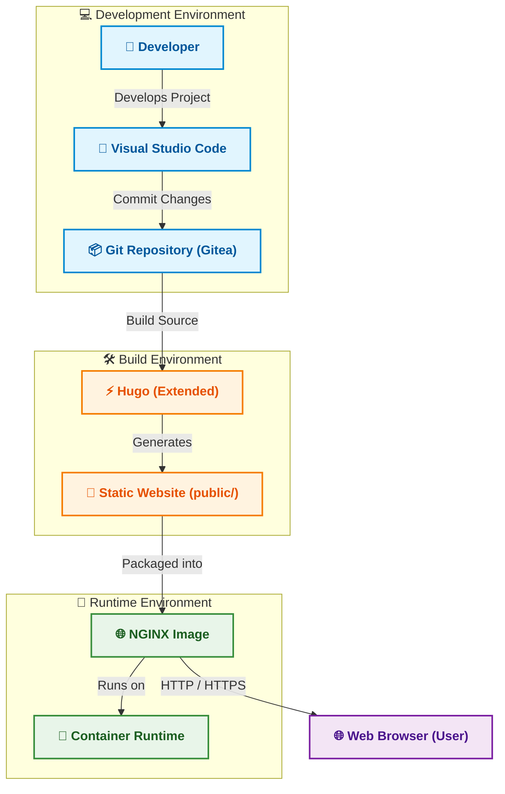

# 🏗️ Architecture

## 🔍 Overview

Halaman ini menjelaskan **arsitektur** yang digunakan pada project **Personal Site**.

Arsitektur menggambarkan bagaimana teknologi yang telah dipilih pada halaman **[Technology Stack](../planning/technology-stack.md)** diorganisasikan menjadi sebuah solusi yang mendukung proses **Development**, **Build**, dan **Runtime**.

Dokumen ini berfokus pada hubungan logis antar komponen serta tanggung jawab masing-masing komponen. Detail implementasi dijelaskan pada bagian **Implementation**.

---

## 📌 Architecture at a Glance

Arsitektur **Personal Site** memisahkan proses **Development**, **Build**, dan **Runtime** ke dalam lingkungan yang memiliki tanggung jawab berbeda.

| Environment | Primary Responsibility |
|-------------|------------------------|
| 💻 **Development** | Mengembangkan source code, konfigurasi, dan konten website. |
| 🛠️ **Build** | Menghasilkan static website menggunakan Hugo. |
| 🚀 **Runtime** | Menjalankan NGINX untuk mempublikasikan website kepada pengguna. |

!!! info "Architecture Principle"

    Arsitektur memisahkan proses **Development**, **Build**, dan **Runtime** agar setiap lingkungan memiliki tanggung jawab yang jelas, mudah dipelihara, serta siap mendukung otomatisasi pada tahap implementasi.

---

## 🎯 Architecture Goals

Arsitektur **Personal Site** dirancang berdasarkan tujuan berikut.

- 🧩 **Separation of Responsibilities** – Memisahkan lingkungan **Development**, **Build**, dan **Runtime** agar setiap komponen memiliki tanggung jawab yang jelas.
- ⚡ **High Performance** – Menghasilkan static website yang ringan, cepat, dan efisien.
- 📦 **Containerized Deployment** – Mendukung deployment menggunakan container agar proses distribusi lebih konsisten.
- 🔧 **Maintainability** – Mempermudah pengembangan, pemeliharaan, dan pengelolaan project.
- 🚀 **Automation Ready** – Menyediakan fondasi arsitektur yang siap diintegrasikan dengan proses otomatisasi di masa mendatang.

---

## 🏛️ High-Level Architecture

Diagram berikut menggambarkan hubungan antar komponen utama pada project **Personal Site**.

Arsitektur tersebut membagi solusi menjadi tiga lingkungan utama yang masing-masing memiliki tanggung jawab berbeda.

| Environment | Responsibility | Output |
|-------------|----------------|--------|
| **Development Environment** | Mengembangkan source code, konfigurasi, dan konten website. | Source Code |
| **Build Environment** | Mengompilasi source code menjadi static website menggunakan Hugo. | Static Website (`public/`) |
| **Runtime Environment** | Menjalankan NGINX untuk mempublikasikan website kepada pengguna. | Running Website |

Pemisahan lingkungan ini membuat setiap proses memiliki tanggung jawab yang jelas sehingga mempermudah pengembangan, pengujian, maupun deployment.

---

## 🧩 Architecture Components

| Component | Responsibility |
|-----------|----------------|
| **Developer** | Mengembangkan source code, konfigurasi, dan konten website. |
| **Visual Studio Code** | Lingkungan pengembangan project. |
| **Git Repository (Gitea)** | Menyimpan source code, histori perubahan, serta menjadi sumber proses build. |
| **Hugo (Extended)** | Menghasilkan static website dari source code Markdown. |
| **Static Website (`public/`)** | Hasil proses build yang siap dipublikasikan. |
| **NGINX Image** | Menyajikan static website kepada pengguna. |
| **Container Runtime** | Menjalankan NGINX Image. |
| **Web Browser** | Mengakses website menggunakan protokol HTTP/HTTPS. |

---

## 📦 Source Code Repository

Source code **Personal Site** dikelola menggunakan **Git** dan disimpan pada **Gitea** sebagai platform *Git Repository*.

Repository berfungsi sebagai pusat pengelolaan source code, histori perubahan, serta kolaborasi selama proses pengembangan.

| Component | Technology |
|-----------|------------|
| Version Control | Git |
| Repository Platform | Gitea |
| Default Branch | `main` |

Seluruh perubahan source code dilakukan melalui proses **commit** ke repository sebelum digunakan pada proses build maupun deployment.

---

## 📐 Design Principles

Arsitektur **Personal Site** dibangun berdasarkan prinsip-prinsip berikut.

### Configuration as Code

Seluruh konfigurasi project disimpan sebagai source code sehingga mudah dikelola, ditinjau, dan dipelihara.

---

### Separation of Responsibilities

Setiap lingkungan memiliki tanggung jawab yang berbeda sehingga perubahan pada satu lingkungan tidak memengaruhi lingkungan lainnya.

---

### Static Website First

Website dipublikasikan sebagai static website sehingga tidak memerlukan application server pada lingkungan produksi.

---

### Immutable Runtime

Runtime hanya bertugas menyajikan static website dan tidak melakukan proses build maupun menyimpan source code.

---

### Containerized Deployment

Deployment dilakukan menggunakan container sehingga proses distribusi menjadi lebih sederhana dan konsisten.

---

## 🔗 Related Documentation

| Documentation | Description |
|---------------|-------------|
| **Requirements** | Menjelaskan kebutuhan yang harus dipenuhi oleh sistem. |
| **Technology Stack** | Menjelaskan teknologi yang dipilih untuk memenuhi kebutuhan project. |
| **Implementation** | Menjelaskan implementasi solusi berdasarkan arsitektur yang telah dirancang. |

---

## 📝 Summary

Pada halaman ini telah dijelaskan:

- Tujuan arsitektur project.
- High-Level Architecture.
- Pembagian lingkungan **Development**, **Build**, dan **Runtime**.
- Hubungan antar komponen dalam solusi.
- Pengelolaan source code menggunakan **Git Repository (Gitea)**.
- Prinsip desain yang digunakan pada project.

Selanjutnya akan dibahas proses implementasi project pada bagian **Implementation**.