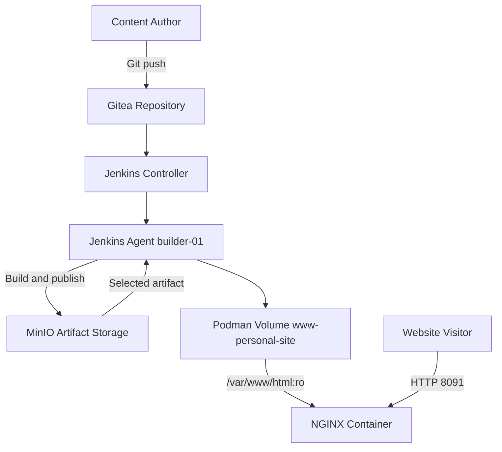

# Architecture

## Overview

Personal Site menggunakan arsitektur static website dengan pemisahan jelas
antara source code, build artifact, deployment automation, persistent content,
dan web runtime. Artifact yang dihasilkan CI menjadi satu-satunya input CD.

## System Context

## Component Architecture

| Component | Responsibility |
| --- | --- |
| `personal-site` repository | Hugo source, content, Jenkinsfiles, dan deployment configuration |
| Gitea | Source control dan SCM source bagi Jenkins |
| Jenkins Controller | Orkestrasi job CI dan CD |
| `builder-01` | Menjalankan pipeline menggunakan rootless Podman |
| Hugo container | Menghasilkan static website pada `public/` |
| MinIO | Menyimpan versioned immutable artifact |
| `www-personal-site` | Menyimpan content yang sedang aktif |
| `personal-site-web` | Menyajikan content melalui NGINX |

## Delivery Architecture

### Continuous Integration

CI melakukan checkout source, menginisialisasi Hugo theme submodule, menjalankan
Hugo, memvalidasi `public/index.html`, membuat archive, lalu mengunggahnya ke
MinIO.

### Continuous Deployment

CD mengunduh artifact yang dipilih, memvalidasi archive, membuat backup content
aktif, mengisi Podman volume, menjalankan NGINX, lalu memvalidasi HTTP,
healthcheck, dan read-only mount.

## Runtime Architecture

| Runtime Setting | Value |
| --- | --- |
| Container | `personal-site-web` |
| Image | `localhost/nginx-image:1.0` |
| Podman network | `web` |
| Named volume | `www-personal-site` |
| Content mount | `/var/www/html:ro` |
| HTTP mapping | `8091:80` |
| HTTPS mapping | `8443:443` |
| SSH mapping | `2224:22` |

MinIO tidak dipasang sebagai filesystem pada NGINX. Jenkins agent mengunduh
artifact ke workspace, lalu menyalin hasil validasi ke named volume.

## Design Principles

- **Immutable artifact:** artifact CI yang dipilih CD tidak dibangun ulang.
- **Separation of responsibilities:** generic NGINX image tidak menyimpan
  konfigurasi deployment khusus Personal Site.
- **Configuration as code:** pipeline dan konfigurasi non-secret disimpan dalam
  repository aplikasi.
- **Rootless runtime:** pipeline dan container dijalankan tanpa user root.
- **Persistent content:** static content berada pada Podman named volume.
- **Read-only serving:** NGINX tidak dapat mengubah content website.

## Architecture Decisions

Keputusan dan alasannya dicatat pada koleksi ADR root. Lihat
[Personal Site ADR Catalog](../../../adr/personal-site/index.md).
