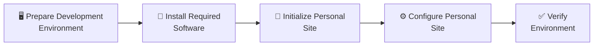

# Development Environment Setup

## 🔍 Overview

Halaman ini menjelaskan proses **Setup** pada project **Personal Site**.

Tahap **Setup** terdiri atas aktivitas persiapan lingkungan pengembangan, instalasi software, inisialisasi project, konfigurasi awal, dan verifikasi lingkungan pengembangan.

Berbeda dengan dokumentasi **How-To**, halaman ini tidak menjelaskan cara menggunakan setiap teknologi, melainkan menjelaskan bagaimana teknologi tersebut diterapkan pada project **Personal Site**.

---

## 📌 Setup at a Glance

Tahap **Setup** terdiri dari beberapa aktivitas berikut.

| Activity | Purpose |
|----------|---------|
| 🖥️ Prepare Development Environment | Menyiapkan workstation pengembangan. |
| 🧰 Install Required Software | Menyiapkan software yang digunakan project. |
| 📁 Initialize Personal Site | Menyiapkan repository dan struktur dasar project. |
| ⚙️ Configure Personal Site | Menerapkan konfigurasi awal project. |
| ✅ Verify Environment | Memastikan seluruh komponen siap digunakan. |

---

## 🔄 Setup Workflow

Diagram berikut menggambarkan alur proses **Setup** sebelum project memasuki tahap **Development**.

---

## 🖥️ Prepare Development Environment

**Purpose**

Menyiapkan workstation yang akan digunakan sebagai lingkungan pengembangan project.

**Implementation**

Project **Personal Site** menerapkan konfigurasi lingkungan pengembangan berikut.

| Component | Configuration |
|-----------|---------------|
| Platform | Linux Workstation |
| Code Editor | Visual Studio Code |
| Version Control | Git |
| Static Site Generator | Hugo (Extended) |
| Container Runtime | Podman |

Detail instalasi dan konfigurasi setiap komponen dijelaskan pada dokumentasi **How-To**.

**Verification**

Pastikan workstation siap digunakan untuk aktivitas pengembangan.

!!! note "Engineering Notes"

    Konfigurasi lingkungan pengembangan dikelola secara terpisah sehingga proses setup dapat direproduksi secara konsisten pada workstation lain apabila diperlukan.

---

## 🧰 Install Required Software

**Purpose**

Menyiapkan software yang digunakan selama siklus pengembangan.

**Implementation**

Project **Personal Site** menggunakan software berikut sebagai bagian dari lingkungan pengembangan.

| Software | Project Usage |
|----------|---------------|
| Git | Mengelola source code dan version history. |
| Hugo (Extended) | Membangun static website. |
| Visual Studio Code | Lingkungan pengembangan utama. |
| Podman | Menjalankan website pada container lokal. |

Seluruh software diinstal dan dikonfigurasi mengikuti panduan pada dokumentasi **How-To**.

!!! abstract "References"

    - How-To → Git
    - How-To → Hugo
    - How-To → Visual Studio Code
    - How-To → Podman

**Verification**

Pastikan seluruh software telah tersedia dan dapat digunakan.

!!! note "Engineering Notes"

    Versi software dikelola secara independen sehingga proses upgrade dapat dilakukan tanpa memengaruhi struktur project.

---

## 📁 Initialize Personal Site

**Purpose**

Menyiapkan repository dan struktur dasar project **Personal Site**.

**Implementation**

Project **Personal Site** menggunakan **Gitea** sebagai Source Repository.

Repository dibuat terlebih dahulu pada Gitea, kemudian di-*clone* ke workstation untuk membentuk **working directory** sebagai area pengembangan lokal.

Project **Personal Site** selanjutnya diinisialisasi menggunakan **Hugo** di dalam working directory sehingga seluruh histori pengembangan dapat dikelola melalui Git sejak commit pertama.

Setelah struktur project berhasil dibuat, working directory dibuka menggunakan **Visual Studio Code** sebagai lingkungan pengembangan utama.

!!! abstract "References"

    - How-To → Git → Create Repository
    - How-To → Git → Clone Repository
    - How-To → Hugo → Create Project

**Verification**

Pastikan:

- Source Repository tersedia.
- Struktur project **Personal Site** berhasil dibuat.
- Project dapat dibuka menggunakan **Visual Studio Code**.

!!! note "Engineering Notes"

    Source Repository menjadi **Single Source of Truth** untuk seluruh source code, konfigurasi, dan dokumentasi project.

---

## ⚙️ Configure Personal Site

**Purpose**

Menerapkan konfigurasi awal yang menjadi dasar implementasi project.

**Implementation**

Konfigurasi awal yang diterapkan pada project meliputi:

- Memilih Hugo Theme sebagai dasar tampilan website.
- Menyesuaikan konfigurasi `hugo.toml`.
- Menyusun struktur direktori konten.
- Mengintegrasikan theme menggunakan Git Submodule apabila berasal dari repository eksternal.

Konfigurasi awal mencerminkan keputusan implementasi yang spesifik untuk project **Personal Site** dan dapat berkembang sesuai kebutuhan project.

!!! abstract "References"

    - How-To → Hugo → Configure Hugo
    - How-To → Hugo → Install Theme
    - How-To → Git → Git Submodule

**Verification**

Pastikan:

- Konfigurasi Hugo berhasil dimuat.
- Theme berhasil diterapkan.
- Struktur project sesuai dengan standar yang telah ditetapkan.

!!! note "Engineering Notes"

    Konfigurasi project dipisahkan dari source code theme sehingga proses pemeliharaan dan upgrade theme dapat dilakukan secara lebih mudah.

---

## ✅ Verify Environment

**Purpose**

Memastikan seluruh lingkungan pengembangan siap digunakan.

**Implementation**

Verifikasi dilakukan setelah seluruh aktivitas **Setup** selesai untuk memastikan lingkungan pengembangan siap digunakan.

| Component | Verification |
|-----------|--------------|
| Git | Source Repository dapat diakses. |
| Hugo | Project dapat dijalankan tanpa error. |
| Theme | Theme berhasil dimuat. |
| Visual Studio Code | Workspace dapat dibuka dengan benar. |
| Podman | Runtime tersedia untuk deployment lokal. |

!!! note "Engineering Notes"

    Tahap ini menjadi checkpoint terakhir sebelum proses **Development** dimulai.

---

## 📦 Setup Output

Tahap **Setup** menghasilkan output berikut.

| Artifact | Description |
|----------|-------------|
| Development Environment | Workstation dan software siap digunakan. |
| Source Repository | Repository project telah diinisialisasi pada Gitea. |
| Personal Site Project | Struktur dasar project berhasil dibuat. |
| Initial Configuration | Konfigurasi awal project telah diterapkan. |

Output tersebut menjadi input pada tahap **Development**.

---

## ▶️ Next Steps

Setelah proses **Setup** selesai, project memasuki tahap **Development**.

Pada tahap tersebut dilakukan pengembangan konten, penyesuaian tampilan, serta implementasi fitur yang akan membentuk website **Personal Site**.

---

## 🔗 Related Documentation

| Documentation | Description |
|---------------|-------------|
| Requirements | Kebutuhan lingkungan pengembangan. |
| Technology Stack | Teknologi yang digunakan project. |
| Architecture | Desain solusi project. |
| Development | Tahap pengembangan setelah Setup selesai. |

---

## 📝 Summary

Pada halaman ini telah dijelaskan:

- Persiapan lingkungan pengembangan.
- Software yang digunakan oleh project.
- Inisialisasi project **Personal Site**.
- Konfigurasi awal project.
- Verifikasi lingkungan pengembangan.
- Output yang dihasilkan dari tahap **Setup**.

Dengan selesainya tahap **Setup**, seluruh lingkungan pengembangan telah siap digunakan.

Tahap berikutnya adalah **Development**, yaitu mengembangkan konten, melakukan kustomisasi tampilan, dan mengimplementasikan fitur sesuai kebutuhan project.
