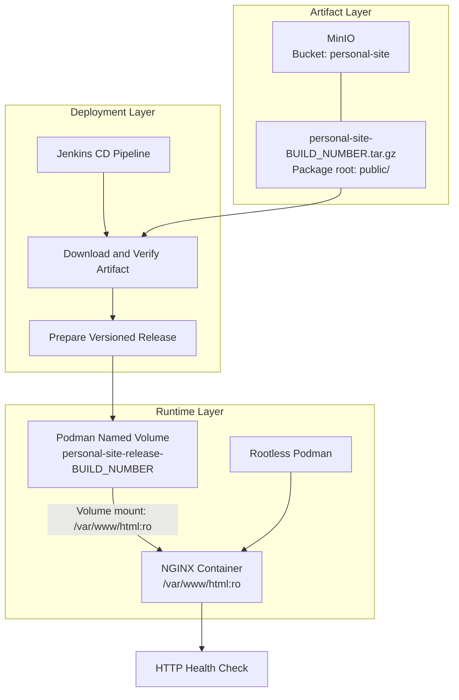
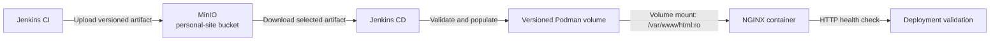

# TN-001 — Design Continuous Deployment Pipeline

## Objective

Merancang alur **Continuous Deployment (CD)** untuk mengambil artefak hasil CI dari MinIO dan mempublikasikannya ke container NGINX yang dikelola melalui repository `nginx-image`.

## Background

Pipeline CI pada project `personal-site` telah menghasilkan static website Hugo, mengemas direktori `public/` sebagai artefak `personal-site-<BUILD_NUMBER>.tar.gz`, lalu mengunggahnya ke bucket `personal-site` pada MinIO.

Tahap berikutnya adalah membangun pipeline deployment yang menggunakan artefak tersebut sebagai satu-satunya input rilis. Source code Hugo tidak dibangun ulang pada tahap CD agar artefak yang diuji dan artefak yang di-deploy tetap sama.

## Scope

Technical Note ini mencakup:

- identifikasi input dan target deployment;
- rancangan alur awal pipeline CD;
- kontrak artefak antara pipeline CI dan CD;
- identifikasi perubahan yang diperlukan pada runtime NGINX;
- kriteria kesiapan sebelum implementasi pipeline dimulai.

Technical Note ini belum mencakup implementasi `Jenkinsfile`, credential, mekanisme rollback otomatis, atau eksekusi deployment pertama. Aktivitas tersebut akan dicatat pada TN berikutnya.

## Current Environment

| Component | Technology | Status | Role / Notes |
| --- | --- | --- | --- |
| Build Pipeline | Jenkins | Ready | Menghasilkan dan mempublikasikan artefak static website. |
| Artifact Storage | MinIO | Ready | Bucket `personal-site` menyimpan `personal-site-<BUILD_NUMBER>.tar.gz`. |
| Container Runtime | Podman | Ready | Menjalankan container NGINX. |
| Web Server Image | NGINX | Ready | Dikelola melalui repository `nginx-image`. |
| Deployment Pipeline | Jenkins | Planned | Mengambil artefak dari MinIO dan melakukan deployment. |
| Runtime Content Volume | Podman named volume | Not configured | Container saat ini menyajikan konten bawaan image dari `/var/www/html`. |

## Artifact Contract

Pipeline CD harus menerima identitas artefak secara eksplisit dan tidak memilih artefak hanya berdasarkan waktu modifikasi.

| Item | Value |
| --- | --- |
| Bucket | `personal-site` |
| Artifact name | `personal-site-<BUILD_NUMBER>.tar.gz` |
| Package format | `tar.gz` |
| Package root | `public/` |
| Deployment content | Isi direktori `public/` |
| NGINX document root | `/var/www/html` |

Nomor build atau nama artefak harus diteruskan dari pipeline CI atau diberikan sebagai parameter pipeline CD. Pendekatan ini membuat rilis dapat ditelusuri dan mencegah deployment artefak yang tidak sengaja terpilih.

## Architecture Decision Records

### PS-ADR-0011 — Deploy Immutable CI Artifact

Refer to:

- **[PS-ADR-0011 — Deploy Immutable CI Artifact](../../../../adr/personal-site/adr-records/PS-ADR-0011.md)**

**Decision**

Pipeline CD menggunakan artefak yang sudah dihasilkan oleh pipeline CI tanpa melakukan build Hugo ulang.

**Reason**

- Menjaga konsistensi hasil build dan hasil deployment.
- Memisahkan tanggung jawab pipeline CI dan CD.
- Memungkinkan identifikasi dan rollback berdasarkan versi artefak.

### PS-ADR-0012 — Store Static Content in Podman Named Volume

Refer to:

- **[PS-ADR-0012 — Store Static Content in Podman Named Volume](../../../../adr/personal-site/adr-records/PS-ADR-0012.md)**

**Decision**

Konten static website akan disimpan pada **Podman named volume** berversi dan dipasang ke `/var/www/html` pada container NGINX sebagai read-only. Setiap volume release menggunakan identitas nomor build CI, misalnya `personal-site-release-<BUILD_NUMBER>`.

**Reason**

- Artefak baru dapat dipublikasikan tanpa membangun ulang image NGINX.
- Image NGINX tetap berfungsi sebagai runtime, sedangkan artefak `personal-site` menjadi konten aplikasi.
- Pemisahan ini memudahkan pergantian versi dan rollback.

## Architecture

Arsitektur CD memisahkan tiga area tanggung jawab:

| Architecture Area | Components | Responsibility |
| --- | --- | --- |
| Artifact | MinIO bucket `personal-site` | Menyimpan artefak Hugo hasil CI yang memiliki identitas versi. |
| Deployment | Jenkins CD agent dan MinIO Client | Mengambil, memverifikasi, dan menyiapkan release. |
| Runtime | Podman named volume dan NGINX container | Menyajikan static content dari volume release terpilih. |

### Component Responsibilities

- **MinIO** menjadi sumber artefak resmi bagi pipeline CD.
- **Jenkins CD Pipeline** mengorkestrasi pemilihan artefak, validasi, persiapan release, deployment, dan pemeriksaan hasil.
- **MinIO Client Container** menyediakan akses ke MinIO tanpa memasang client langsung pada Jenkins agent.
- **Podman Named Volume** menyimpan hasil ekstraksi artefak berdasarkan nomor build CI dengan pola nama `personal-site-release-<BUILD_NUMBER>`.
- **Podman** menjalankan runtime container secara rootless.
- **NGINX Container** hanya menyediakan web server dan membaca static content melalui mount read-only.

### Deployment Flow

Alur deployment yang direncanakan:

1. Pipeline CD menerima parameter nama artefak atau nomor build CI.
2. Jenkins mengambil artefak yang sesuai dari bucket `personal-site` di MinIO.
3. Pipeline memverifikasi bahwa file tersedia, dapat diekstrak, dan memiliki `public/index.html`.
4. Pipeline membuat Podman volume dengan pola nama `personal-site-release-<BUILD_NUMBER>`.
5. Isi `public/` disalin ke volume release melalui ephemeral helper container.
6. Container NGINX dijalankan dengan volume release dipasang secara read-only ke `/var/www/html`.
7. Pipeline menjalankan validasi HTTP terhadap endpoint website.
8. Deployment dinyatakan berhasil hanya jika container sehat dan validasi HTTP berhasil.

## Runtime Gap Analysis

Konfigurasi `nginx-image` saat ini:

- `Containerfile` menyalin placeholder `files/index.html` ke `/var/www/html/index.html`;
- konfigurasi NGINX menggunakan `/var/www/html` sebagai document root;
- `scripts/run.sh` belum memasang Podman volume untuk static content ke `/var/www/html`.

Dengan kondisi tersebut, artefak dari MinIO belum dapat menjadi konten runtime tanpa salah satu perubahan berikut:

1. menambahkan Podman named volume pada `scripts/run.sh`; atau
2. membangun image aplikasi baru yang memasukkan artefak ke dalam image.

Untuk fase CD ini dipilih opsi pertama dengan Podman named volume agar image NGINX dan artefak website tetap memiliki lifecycle yang terpisah.

## Security and Reliability Requirements

- Credential MinIO harus disimpan di Jenkins Credentials dan tidak ditulis ke repository atau log.
- Volume release harus dipasang ke container NGINX sebagai read-only.
- Artefak harus disiapkan pada volume release baru, bukan langsung menimpa volume yang sedang aktif.
- Pipeline harus gagal jika artefak kosong, format tidak valid, atau `public/index.html` tidak tersedia.
- Artefak dan release harus dapat ditelusuri ke nomor build CI.
- Release sebelumnya harus dipertahankan sampai deployment baru berhasil divalidasi untuk mendukung rollback.

## Planned Pipeline Stages

| Stage | Purpose |
| --- | --- |
| Resolve Artifact | Menentukan nama artefak berdasarkan parameter atau metadata build CI. |
| Download Artifact | Mengambil artefak dari MinIO menggunakan MinIO Client. |
| Verify Artifact | Memastikan file tersedia, tidak kosong, dan memiliki struktur yang benar. |
| Prepare Release | Membuat dan mengisi Podman volume release berversi. |
| Deploy NGINX | Menjalankan atau mengganti container dengan release baru. |
| Validate Deployment | Memeriksa status container dan respons HTTP website. |
| Rollback | Mengaktifkan kembali release sebelumnya jika deployment gagal. |

## Verification Criteria

| Item | Expected Result | Status |
| --- | --- | --- |
| Artefak CI teridentifikasi secara eksplisit | Nama artefak atau nomor build tersedia sebagai input CD. | Planned |
| Artefak dapat diambil dari MinIO | File hasil CI tersedia pada workspace deployment. | Planned |
| Struktur artefak valid | `public/index.html` ditemukan setelah ekstraksi. | Planned |
| Runtime NGINX menerima external content | Podman volume release dipasang read-only ke `/var/www/html`. | Planned |
| Website dapat diakses | Endpoint HTTP memberikan respons sukses. | Planned |
| Release dapat ditelusuri | Deployment tercatat dengan nomor build CI. | Planned |

## Next Steps

1. Menentukan node Jenkins yang akan menjalankan pipeline CD dan mengakses Podman runtime target.
2. Menambahkan konfigurasi Podman named volume pada repository `nginx-image`.
3. Menyiapkan credential MinIO dan credential akses deployment pada Jenkins.
4. Membuat definisi pipeline CD sebagai kode.
5. Menjalankan deployment awal dan mendokumentasikan hasil validasinya.

## Notes

- Endpoint MinIO pada pipeline CI saat ini adalah `http://host.containers.internal:9000`; akses dari node deployment perlu diverifikasi kembali karena konteks jaringan dapat berbeda.
- Port runtime pada konfigurasi `nginx-image` saat ini adalah `8091` untuk HTTP, `8443` untuk HTTPS, dan `2224` untuk SSH.
- Pola final nama volume, strategi retensi, dan mekanisme pergantian volume release akan ditetapkan pada TN implementasi berikutnya.
