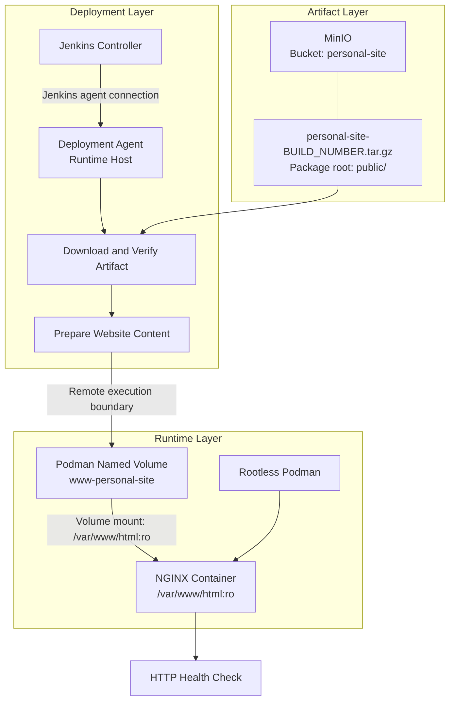
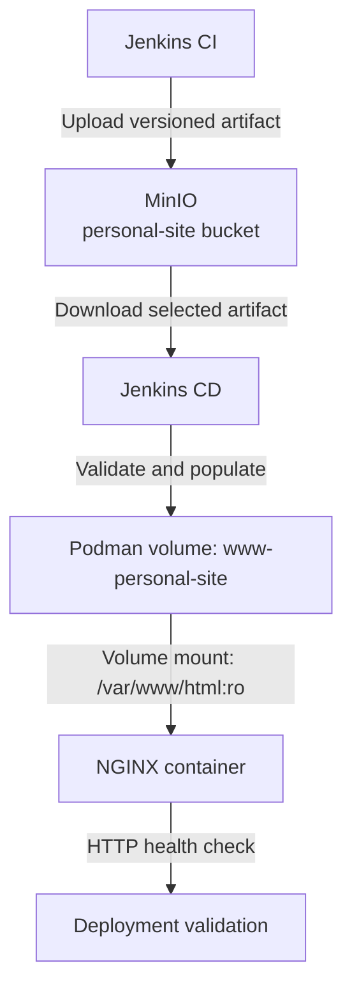

# TN-001 — Design Continuous Deployment Pipeline

## Objective

Menetapkan dan menerapkan baseline **Continuous Deployment (CD)** untuk mengambil artefak hasil CI dari MinIO dan mempublikasikannya ke container NGINX yang dikelola melalui repository `nginx-image`.

## Background

Pipeline CI pada project `personal-site` telah menghasilkan static website Hugo, mengemas direktori `public/` sebagai artefak `personal-site-<BUILD_NUMBER>.tar.gz`, lalu mengunggahnya ke bucket `personal-site` pada MinIO.

Tahap berikutnya adalah membangun pipeline deployment yang menggunakan artefak tersebut sebagai satu-satunya input rilis. Source code Hugo tidak dibangun ulang pada tahap CD agar artefak yang diuji dan artefak yang di-deploy tetap sama.

## Scope

Technical Note ini mencatat baseline yang diterapkan:

- identifikasi input dan target deployment;
- rancangan alur awal pipeline CD;
- kontrak artefak antara pipeline CI dan CD;
- identifikasi perubahan yang diperlukan pada runtime NGINX;
- kriteria kesiapan sebelum implementasi pipeline dimulai.

Implementasi runtime dicatat pada TN-002, sedangkan implementasi
`Jenkinsfile.cd`, rollback pipeline, dan hasil deployment pertama dicatat pada
TN-003.

## Prerequisites

- Artifact contract dari fase CI telah tersedia.
- ADR deployment Personal Site telah diterima.
- Jenkins agent, MinIO, Rootless Podman, dan NGINX runtime tersedia untuk fase
  implementasi berikutnya.

## Current Environment

| Component | Technology | Status | Role / Notes |
| --- | --- | --- | --- |
| Build Pipeline | Jenkins | Ready | Menghasilkan dan mempublikasikan artefak static website. |
| Artifact Storage | MinIO | Ready | Bucket `personal-site` menyimpan `personal-site-<BUILD_NUMBER>.tar.gz`. |
| Container Runtime | Podman | Ready | Menjalankan container NGINX. |
| Web Server Image | NGINX | Ready | Dikelola melalui repository `nginx-image`. |
| Deployment Pipeline | Jenkins | Verified in TN-003 | `Jenkinsfile.cd` telah menjalankan initial deployment. |
| Deployment Execution | Jenkins deployment agent | Verified in TN-003 | Agent `builder-01` berada pada host runtime dan menggunakan rootless Podman user yang sama. |
| Runtime Content Volume | Podman named volume | Verified in TN-003 | Application deployment memasang `www-personal-site` ke generic NGINX image. |
| Deployment Configuration | Application-owned files | Verified in TN-003 | Dikelola pada `personal-site/deployment`, bukan oleh generic runtime contract. |
| Network Boundary | Separate Podman network segments | Verified | Jenkins tidak bergantung pada internal container DNS atau network NGINX. |

## Artifact Contract

Pipeline CD harus menerima identitas artefak secara eksplisit dan tidak memilih artefak hanya berdasarkan waktu modifikasi.

| Item | Value |
| --- | --- |
| Bucket | `personal-site` |
| Artifact name | `personal-site-<BUILD_NUMBER>.tar.gz` |
| Package format | `tar.gz` |
| Package root | `public/` |
| Deployment content | Isi direktori `public/` |
| NGINX document root | `/var/www/html` |

Nomor build atau nama artefak harus diteruskan dari pipeline CI atau diberikan sebagai parameter pipeline CD. Pendekatan ini membuat rilis dapat ditelusuri dan mencegah deployment artefak yang tidak sengaja terpilih.

## Execution Decision

### PS-ADR-0011 — Deploy Immutable CI Artifact

Refer to:

- **[PS-ADR-0011 — Deploy Immutable CI Artifact](../../../../adr/personal-site/adr-records/PS-ADR-0011.md){ target="_blank" rel="noopener" }**

**Decision**

Pipeline CD menggunakan artefak yang sudah dihasilkan oleh pipeline CI tanpa melakukan build Hugo ulang.

**Reason**

- Menjaga konsistensi hasil build dan hasil deployment.
- Memisahkan tanggung jawab pipeline CI dan CD.
- Memungkinkan identifikasi dan rollback berdasarkan versi artefak.

### PS-ADR-0012 — Store Static Content in Podman Named Volume

Refer to:

- **[PS-ADR-0012 — Store Static Content in Podman Named Volume](../../../../adr/personal-site/adr-records/PS-ADR-0012.md){ target="_blank" rel="noopener" }**

**Decision**

Konten static website akan disimpan pada **Podman named volume** bernama `www-personal-site` dan dipasang ke `/var/www/html` pada container NGINX sebagai read-only.

**Reason**

- Artefak baru dapat dipublikasikan tanpa membangun ulang image NGINX.
- Image NGINX tetap berfungsi sebagai runtime, sedangkan artefak `personal-site` menjadi konten aplikasi.
- Pemisahan ini memudahkan pergantian versi dan rollback.

### PS-ADR-0013 — Execute Deployment through Dedicated Jenkins Agent

Refer to:

- **[PS-ADR-0013 — Execute Deployment through Dedicated Jenkins Agent](../../../../adr/personal-site/adr-records/PS-ADR-0013.md){ target="_blank" rel="noopener" }**

**Decision**

Pipeline CD dijalankan pada dedicated Jenkins deployment agent yang berada pada host runtime NGINX. Agent menggunakan user yang sama dengan pemilik rootless Podman runtime.

**Reason**

- Pipeline dapat mengelola container dan volume melalui Podman CLI lokal.
- Tidak perlu mengekspos Podman socket melalui network.
- Rootless Podman storage dan volume tetap berada pada scope user runtime yang benar.

### PS-ADR-0014 — Keep Application Deployment Configuration Outside Generic Runtime Image

Refer to:

- **[PS-ADR-0014 — Keep Application Deployment Configuration Outside Generic Runtime Image](../../../../adr/personal-site/adr-records/PS-ADR-0014.md){ target="_blank" rel="noopener" }**

**Decision**

Nama container, volume, network, port, dan image version dikelola pada `personal-site/deployment`. Pipeline tidak menggunakan konfigurasi repository `nginx-image` sebagai application deployment contract.

**Reason**

- Menjaga image NGINX tetap generic dan dapat digunakan kembali.
- Memisahkan konfigurasi aplikasi dari tanggung jawab runtime image.
- Memungkinkan perubahan deployment Personal Site tanpa mengubah repository
  `nginx-image`.

## Architecture

Arsitektur CD memisahkan tiga area tanggung jawab:

| Architecture Area | Components | Responsibility |
| --- | --- | --- |
| Artifact | MinIO bucket `personal-site` | Menyimpan artefak Hugo hasil CI yang memiliki identitas versi. |
| Deployment | Jenkins CD agent dan MinIO Client | Mengambil, memverifikasi, dan menyiapkan release. |
| Runtime | Podman volume `www-personal-site` dan NGINX container | Menyajikan static content dari volume website. |

### Component Responsibilities

- **MinIO** menjadi sumber artefak resmi bagi pipeline CD.
- **Jenkins Controller** mengorkestrasi pipeline dan mengirimkan pekerjaan CD ke deployment agent.
- **Jenkins Deployment Agent** menjalankan download, persiapan volume, dan perintah Podman secara lokal pada host runtime NGINX.
- **MinIO Client Container** menyediakan akses ke MinIO tanpa memasang client langsung pada Jenkins agent.
- **Podman Named Volume** `www-personal-site` menyimpan static content dari artefak yang dipilih untuk deployment.
- **Podman** menjalankan runtime container secara rootless.
- **NGINX Container** hanya menyediakan web server dan membaca static content melalui mount read-only.
- **Network Boundary** memisahkan segmen Podman Jenkins dan NGINX; koneksi Jenkins agent menjadi control channel, sedangkan validasi website menggunakan published endpoint.

### Deployment Flow

Alur deployment yang direncanakan:

1. Pipeline CD menerima parameter nama artefak atau nomor build CI.
2. Jenkins mengambil artefak yang sesuai dari bucket `personal-site` di MinIO.
3. Pipeline memverifikasi bahwa file tersedia, dapat diekstrak, dan memiliki `public/index.html`.
4. Pipeline memastikan Podman volume `www-personal-site` tersedia.
5. Isi `public/` disalin ke volume `www-personal-site` melalui ephemeral helper container.
6. Container NGINX dijalankan dengan volume `www-personal-site` dipasang secara read-only ke `/var/www/html`.
7. Pipeline menjalankan validasi HTTP terhadap endpoint website.
8. Deployment dinyatakan berhasil hanya jika container sehat dan validasi HTTP berhasil.

## Implementation

Konfigurasi runtime menggunakan generic image dan application-owned deployment files:

- generic `nginx-image` menggunakan `/var/www/html` sebagai document root;
- `deployment/CONFIG` menyimpan parameter instance Personal Site;
- `deployment/deploy.sh` membuat volume `www-personal-site` bila belum tersedia;
- `deployment/deploy.sh` menjalankan generic image dan memasang volume ke `/var/www/html` sebagai read-only.

Implementasi menggunakan Podman named volume agar image NGINX dan artefak website tetap memiliki lifecycle yang terpisah.

### Security and Reliability Requirements

- Credential MinIO harus disimpan di Jenkins Credentials dan tidak ditulis ke repository atau log.
- Volume `www-personal-site` harus dipasang ke container NGINX sebagai read-only.
- Konten baru harus divalidasi di staging sebelum menggantikan isi volume `www-personal-site`.
- Pipeline harus gagal jika artefak kosong, format tidak valid, atau `public/index.html` tidak tersedia.
- Artefak dan release harus dapat ditelusuri ke nomor build CI.
- Identitas artefak sebelumnya harus dicatat agar pipeline dapat mengisi ulang volume `www-personal-site` saat rollback diperlukan.

### Implemented Pipeline Stages

| Stage | Purpose |
| --- | --- |
| Resolve Artifact | Menentukan nama artefak berdasarkan parameter atau metadata build CI. |
| Download Artifact | Mengambil artefak dari MinIO menggunakan MinIO Client. |
| Verify Artifact | Memastikan file tersedia, tidak kosong, dan memiliki struktur yang benar. |
| Prepare Release | Memvalidasi konten dan mengisi Podman volume `www-personal-site`. |
| Deploy NGINX | Menjalankan atau mengganti container dengan release baru. |
| Validate Deployment | Memeriksa status container dan respons HTTP website. |
| Rollback | Mengisi ulang `www-personal-site` menggunakan artefak sebelumnya jika deployment gagal. |

## Verification

| Item | Expected Result | Status |
| --- | --- | --- |
| Artefak CI teridentifikasi secara eksplisit | Nama artefak atau nomor build tersedia sebagai input CD. | ✅ Verified in TN-003 |
| Artefak dapat diambil dari MinIO | File hasil CI tersedia pada workspace deployment. | ✅ Verified in TN-003 |
| Struktur artefak valid | `public/index.html` ditemukan setelah ekstraksi. | ✅ Verified in TN-003 |
| Runtime NGINX menerima external content | Volume `www-personal-site` dipasang read-only ke `/var/www/html`. | ✅ Verified in TN-003 |
| Website dapat diakses | Endpoint HTTP memberikan respons sukses. | ✅ Verified in TN-003 |
| Release dapat ditelusuri | Deployment tercatat dengan nomor build CI. | ✅ Verified in TN-003 |

## Next Steps

Seluruh tindak lanjut desain berikut telah diselesaikan pada TN-002 dan TN-003:

- menentukan `builder-01` sebagai node eksekusi deployment;
- menambahkan konfigurasi Podman named volume pada `personal-site/deployment`;
- menggunakan Jenkins credential `minio-root`;
- membuat `Jenkinsfile.cd`; dan
- menjalankan serta memvalidasi initial deployment.

## Notes

- Endpoint MinIO pada pipeline CI saat ini adalah `http://host.containers.internal:9000`; akses dari node deployment perlu diverifikasi kembali karena konteks jaringan dapat berbeda.
- Jenkins dan NGINX berada pada segmen Podman network yang berbeda sehingga pipeline tidak dapat mengandalkan internal container DNS atau IP NGINX.
- Port runtime pada `personal-site/deployment/CONFIG` adalah `8091` untuk HTTP, `8443` untuk HTTPS, dan `2224` untuk SSH.
- Mekanisme pengisian volume dan rollback menggunakan artefak sebelumnya akan ditetapkan pada TN implementasi berikutnya.

## Related Documentation

- [Continuous Deployment Engineering Journal](index.md)
- [TN-002 — Prepare NGINX Runtime](TN-002-prepare-nginx-runtime-for-podman-volume-deployment.md)
- [Personal Site CI/CD](../../ci-cd/index.md)
