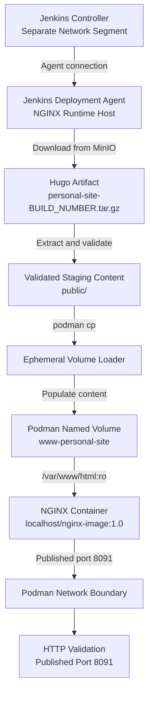

# TN-002 — Prepare NGINX Runtime for Podman Volume Deployment

## Objective

Mengimplementasikan runtime NGINX agar static website hasil build Hugo disajikan dari Podman named volume `www-personal-site`.

## Background

TN-001 menetapkan bahwa pipeline CD menggunakan artefak `personal-site-<BUILD_NUMBER>.tar.gz` dari MinIO tanpa melakukan build Hugo ulang. Isi direktori `public/` dari artefak tersebut akan ditempatkan pada Podman named volume `www-personal-site` dan disajikan oleh NGINX melalui `/var/www/html`.

Repository `nginx-image` menyediakan generic NGINX runtime. Konfigurasi khusus aplikasi seperti nama container, volume, network, dan port dikelola oleh repository `personal-site` agar generic image tidak menjadi deployment contract untuk satu aplikasi.

## Scope

Technical Note ini mencakup:

- definisi konfigurasi volume runtime;
- implementasi `deployment/CONFIG` dan `deployment/deploy.sh` pada repository `personal-site`;
- persyaratan kesiapan dedicated Jenkins deployment agent pada host runtime;
- kriteria verifikasi NGINX menggunakan content volume.

Technical Note ini belum mencakup download otomatis dari MinIO, implementasi Jenkins CD pipeline, maupun deployment otomatis.

## Prerequisites

- TN-001 telah diselesaikan.
- Image `localhost/nginx-image:1.0` tersedia pada target runtime.
- Podman dapat dijalankan oleh user runtime secara rootless.
- Artifact `personal-site-<BUILD_NUMBER>.tar.gz` tersedia untuk pengujian.
- Artifact memiliki package root `public/` dan berisi `public/index.html`.
- Network Podman `web` tersedia.
- Jenkins deployment agent tersedia pada host runtime NGINX dan terhubung ke Jenkins controller.
- Jalur koneksi menuju published port NGINX tersedia; Jenkins dan NGINX berada pada segmen Podman network yang berbeda.

## Execution Decision

### PS-ADR-0004 — Generic Runtime Container

Refer to:

- **[PS-ADR-0004 — Generic Runtime Container](../../../../adr/personal-site/adr-records/PS-ADR-0004.md){ target="_blank" rel="noopener" }**

**Decision**

NGINX image digunakan sebagai generic runtime dan static content disediakan
melalui volume saat deployment.

**Reason**

- Perubahan konten tidak memerlukan rebuild image NGINX.
- Tanggung jawab runtime dan konten aplikasi tetap terpisah.

### PS-ADR-0011 — Deploy Immutable CI Artifact

Refer to:

- **[PS-ADR-0011 — Deploy Immutable CI Artifact](../../../../adr/personal-site/adr-records/PS-ADR-0011.md){ target="_blank" rel="noopener" }**

**Decision**

Runtime menerima artefak immutable yang telah dihasilkan pipeline CI.

**Reason**

- Menjamin konten yang disiapkan sama dengan hasil build yang diverifikasi.
- Mencegah build ulang pada host deployment.

### PS-ADR-0012 — Store Static Content in Podman Named Volume

Refer to:

- **[PS-ADR-0012 — Store Static Content in Podman Named Volume](../../../../adr/personal-site/adr-records/PS-ADR-0012.md){ target="_blank" rel="noopener" }**

**Decision**

Static content disimpan pada volume `www-personal-site` dan dipasang read-only
ke `/var/www/html`.

**Reason**

- Konten dapat diganti tanpa membangun ulang runtime image.
- Read-only mount membatasi perubahan konten dari container NGINX.

### PS-ADR-0013 — Execute Deployment through Dedicated Jenkins Agent

Refer to:

- **[PS-ADR-0013 — Execute Deployment through Dedicated Jenkins Agent](../../../../adr/personal-site/adr-records/PS-ADR-0013.md){ target="_blank" rel="noopener" }**

**Decision**

Persiapan runtime dijalankan pada `builder-01` dengan user pemilik Rootless
Podman runtime.

**Reason**

- Agent dapat mengelola volume dan container melalui Podman CLI lokal.
- Podman storage tetap berada pada scope user yang benar.

### PS-ADR-0014 — Keep Application Deployment Configuration Outside Generic Runtime Image

Refer to:

- **[PS-ADR-0014 — Keep Application Deployment Configuration Outside Generic Runtime Image](../../../../adr/personal-site/adr-records/PS-ADR-0014.md){ target="_blank" rel="noopener" }**

**Decision**

Konfigurasi dan script deployment disimpan pada `personal-site/deployment`.

**Reason**

- Menjaga `nginx-image` tetap generic dan reusable.
- Perubahan deployment aplikasi tidak mengubah repository runtime image.

## Architecture

### Current Runtime Configuration

| Item | Current Value |
| --- | --- |
| Project / container name | `personal-site-web` |
| Image | `localhost/nginx-image:1.0` |
| NGINX document root | `/var/www/html` |
| HTTP host port | `8091` |
| HTTPS host port | `8443` |
| SSH host port | `2224` |
| Podman network | `web` |
| Jenkins network | Segmen Podman network terpisah |
| Content volume | `www-personal-site` configured in `personal-site/deployment` |

### Network Boundary

Jenkins dan container NGINX berjalan pada segmen Podman network yang berbeda. Pipeline CD tidak boleh mengandalkan:

- container DNS name milik network NGINX;
- alamat IP internal container NGINX; atau
- akses langsung ke Podman socket milik runtime tanpa mekanisme eksekusi yang disetujui.

Pemisahan network menghasilkan dua jalur akses yang berbeda:

| Access Purpose | Required Path |
| --- | --- |
| Deployment execution | Dedicated Jenkins deployment agent menjalankan Podman CLI secara lokal pada host runtime. |
| HTTP validation | Jenkins mengakses host address dan published HTTP port `8091`, bukan IP internal container. |

Dedicated Jenkins deployment agent dipilih sebagai metode eksekusi. Agent harus berjalan sebagai user yang sama dengan pemilik rootless Podman agar container, image, network, dan volume berada pada storage context yang sama.

### Target Runtime Architecture



Podman volume menjadi persistent runtime storage untuk static content. Ephemeral volume loader hanya digunakan untuk membersihkan dan mengisi volume, kemudian dihapus setelah proses selesai. NGINX hanya menerima akses read-only terhadap volume tersebut.

## Implementation

Implementasi TN-002 hanya menyiapkan runtime agar dapat menerima static content dari pipeline CD. TN-002 tidak memasang MinIO ke container NGINX dan tidak mengambil artefak secara langsung.

Alur tanggung jawabnya:

```text
TN-002: configure Podman volume and NGINX runtime
TN-003: download artifact, populate volume, run NGINX, and validate
```

<div class="procedure" markdown>

<div class="procedure-step" markdown>

### Add Application Deployment Configuration

File `personal-site/deployment/CONFIG` telah dibuat sebagai sumber konfigurasi instance aplikasi:

```bash
CONTAINER_NAME=personal-site-web
NGINX_IMAGE=localhost/nginx-image:1.0
CONTENT_VOLUME=www-personal-site
PODMAN_NETWORK=web

SSH_HOST_PORT=2224
HTTP_HOST_PORT=8091
HTTPS_HOST_PORT=8443
```

Konfigurasi ini dimiliki oleh project `personal-site` dan tidak mengubah kontrak generic image.

!!! success "Expected Result"

    `deployment/CONFIG` menjadi sumber konfigurasi runtime khusus Personal Site.

</div>

<div class="procedure-step" markdown>

### Add Application Deployment Script

File `personal-site/deployment/deploy.sh` memuat konfigurasi aplikasi dan memastikan volume tersedia:

```bash
if ! podman volume exists "${CONTENT_VOLUME}"; then
    podman volume create "${CONTENT_VOLUME}" >/dev/null
fi
```

Script menjalankan generic image sebagai container instance `personal-site-web`:

```bash
--volume "${CONTENT_VOLUME}:/var/www/html:ro" \
```

Konfigurasi runtime yang diterapkan:

```bash
podman run --detach \
    --name "${CONTAINER_NAME}" \
    --network "${PODMAN_NETWORK}" \
    -p "${SSH_HOST_PORT}:22" \
    -p "${HTTP_HOST_PORT}:80" \
    -p "${HTTPS_HOST_PORT}:443" \
    --volume /etc/localtime:/etc/localtime:ro \
    --volume /etc/timezone:/etc/timezone:ro \
    --volume "${CONTENT_VOLUME}:/var/www/html:ro" \
    "${NGINX_IMAGE}"
```

Mount read-only memastikan proses di dalam container NGINX tidak dapat mengubah static content.

!!! success "Expected Result"

    Script dapat menyiapkan named volume dan menjalankan NGINX dengan konten read-only.

</div>

</div>

### Failure Handling

| Failure | Expected Action |
| --- | --- |
| Artifact tidak dapat diekstrak | Hentikan proses sebelum volume diubah. |
| `public/index.html` tidak tersedia | Hentikan proses sebelum volume diubah. |
| Pembuatan volume gagal | Hentikan deployment dan periksa Podman storage. |
| Pengisian volume gagal | Jangan menjalankan NGINX dengan konten yang belum lengkap. |
| NGINX health check gagal | Hentikan container dan pulihkan isi volume dari artefak sebelumnya. |
| Validasi HTTP gagal | Tandai deployment gagal dan jalankan prosedur rollback. |
| Deployment agent offline | Hentikan pipeline dan verifikasi agent service serta koneksi ke Jenkins controller. |
| Jenkins tidak dapat memvalidasi website | Verifikasi routing, firewall, dan published HTTP port. |

### Rollback Strategy

Karena runtime menggunakan satu volume tetap, `www-personal-site`, rollback dilakukan dengan mengambil artefak sebelumnya yang masih tersedia di MinIO lalu mengisi ulang volume menggunakan prosedur yang sama.

Pipeline berikutnya harus mencatat sedikitnya:

- nama artefak yang sedang aktif;
- nomor build CI artefak aktif;
- nama artefak sebelumnya; dan
- waktu deployment.

## Verification

| Item | Expected Result | Status |
| --- | --- | --- |
| Rootless Podman tersedia | `podman info` mengembalikan `Rootless=true`. | Verified |
| Generic NGINX image tersedia | `localhost/nginx-image:1.0` ditemukan pada local image storage. | Verified |
| Podman network tersedia | Network `web` ditemukan. | Verified |
| Volume tersedia | `podman volume inspect www-personal-site` berhasil. | Verified |
| Static content valid | `/var/www/html/index.html` tersedia di dalam volume. | ✅ Verified in TN-003 |
| Mount menggunakan named volume | Source mount bernama `www-personal-site`. | ✅ Verified in TN-003 |
| NGINX menggunakan read-only content | Mount `/var/www/html` memiliki `RW=false`. | ✅ Verified in TN-003 |
| Container sehat | Health status bernilai `healthy`. | ✅ Verified in TN-003 |
| HTTP dapat diakses | `http://localhost:8091/` memberikan respons sukses. | ✅ Verified in TN-003 |
| Konten berasal dari Hugo artifact | Halaman bukan lagi placeholder bawaan image. | ✅ Verified in TN-003 |

### Execution Result

Implementasi runtime prerequisites dijalankan pada **2026-08-08** menggunakan rootless Podman user pemilik runtime.

```text
Name=www-personal-site
Driver=local
Mountpoint=/home/eddywiyatno/.local/share/containers/storage/volumes/www-personal-site/_data
Container=personal-site-web
Image=localhost/nginx-image:1.0
Network=web
Volume=www-personal-site
VolumeEntries=0
HTTP=8091
```

Container `personal-site-web` belum dijalankan pada TN-002 karena volume belum diisi static content dari artefak MinIO. Menjalankan NGINX dengan volume kosong akan menutupi placeholder `/var/www/html` dari image dan menyebabkan health check gagal. Pengisian volume dan startup container dilakukan oleh `Jenkinsfile.cd` pada TN-003.

## Implemented Repository Changes

Deployment-specific files berikut telah diterapkan pada repository `personal-site`:

| File | Implemented Change |
| --- | --- |
| `deployment/CONFIG` | Menyimpan nama container, image, volume, network, dan port Personal Site. |
| `deployment/deploy.sh` | Membuat volume dan menjalankan generic NGINX image dengan konfigurasi aplikasi. |
| `Jenkinsfile.cd` | Memuat application configuration dan memanggil `deployment/deploy.sh`. |

## Next Steps

Implementasi lanjutan, eksekusi pipeline, dan hasil initial deployment dicatat pada TN-003.

## Notes

- Semua perintah Podman harus dijalankan oleh user rootless yang sama dengan user pemilik runtime NGINX. Podman volume bersifat spesifik terhadap storage user tersebut.
- MinIO tidak dipasang sebagai filesystem pada container NGINX. Artifact dipindahkan dari MinIO ke Jenkins workspace, kemudian static content disalin ke Podman volume.
- File pada repository `nginx-image` tetap dipertahankan, tetapi pipeline Personal Site tidak menggunakannya sebagai sumber konfigurasi deployment.
- Perbedaan segmen Podman network berarti nama container `personal-site-web` tidak digunakan sebagai alamat validasi dari Jenkins.
- Nama container loader tetap dan harus dipastikan tidak tertinggal dari eksekusi sebelumnya.
- Contoh perintah menggunakan image `localhost/nginx-image:1.0` sesuai nilai `PROJECT` dan `VERSION` saat dokumen dibuat.
- Runtime prerequisites dan volume telah diverifikasi pada TN-002. Deployment container dan verifikasi HTTP kemudian berhasil diselesaikan melalui pipeline pada TN-003.

## Related Documentation

- [TN-001 — Design Continuous Deployment Pipeline](TN-001-design-continuous-deployment-pipeline.md)
- [TN-003 — Create Jenkins CD Pipeline](TN-003-create-jenkins-continuous-deployment-pipeline.md)
- [Continuous Deployment Engineering Journal](index.md)
