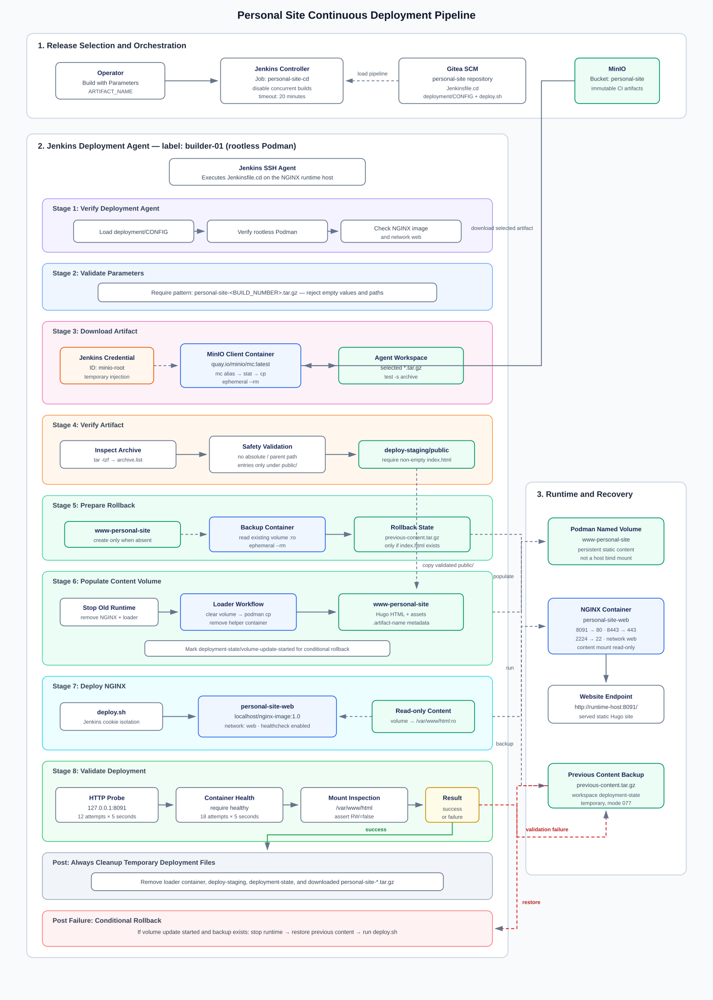

# Continuous Deployment Engineering Journal

## Overview

Bagian ini mencatat perjalanan engineering fase Continuous Deployment (CD)
Personal Site. Pipeline menggunakan artifact Hugo hasil CI dari MinIO,
menempatkan static content ke Podman named volume, menjalankan NGINX, dan
memvalidasi hasil deployment.

Technical Note disusun menurut urutan perancangan dan implementasi. Catatan
masalah serta penyelesaiannya tetap dipertahankan sebagai histori engineering.

## Objective

Membangun pipeline CD yang dapat:

- memilih artifact CI secara eksplisit;
- mengunduh artifact dari MinIO;
- memvalidasi keamanan dan isi archive;
- memperbarui Podman volume `www-personal-site`;
- menjalankan container `personal-site-web`;
- memvalidasi HTTP endpoint, healthcheck, dan read-only mount; serta
- memulihkan konten sebelumnya ketika deployment gagal.

## Final Pipeline Flow



```text
ARTIFACT_NAME
  ↓
MinIO bucket: personal-site
  ↓
Jenkins agent: builder-01
  ↓
Validate archive → deploy-staging/public/
  ↓
Podman volume: www-personal-site
  ↓
NGINX container: personal-site-web
  ↓
HTTP: runtime-host:8091
```

## Implementation Result

| Component | Implementation | Status |
| --- | --- | --- |
| Pipeline definition | `personal-site/Jenkinsfile.cd` | Completed |
| Shared non-secret configuration | `personal-site/deployment/CONFIG` | Completed |
| Runtime deployment script | `personal-site/deployment/deploy.sh` | Completed |
| Deployment node | Jenkins agent label `builder-01` | Completed |
| Artifact source | MinIO bucket `personal-site` | Completed |
| Content storage | Podman volume `www-personal-site` | Completed |
| Web runtime | `personal-site-web` using `localhost/nginx-image:1.0` | Completed |
| Runtime validation | HTTP, container health, and `RW=false` mount | Completed |
| HTTP endpoint | Host port `8091` to container port `80` | Verified |

## Technical Notes

Technical Note sebaiknya dibaca secara berurutan:

1. **[TN-001 — Design Continuous Deployment Pipeline](TN-001-design-continuous-deployment-pipeline.md)**

    Menetapkan arsitektur, artifact contract, tanggung jawab komponen, serta
    strategi deployment dan rollback.

2. **[TN-002 — Prepare NGINX Runtime for Podman Volume Deployment](TN-002-prepare-nginx-runtime-for-podman-volume-deployment.md)**

    Menyiapkan konfigurasi aplikasi, named volume, network, image, dan runtime
    NGINX tanpa mengubah repository generic `nginx-image`.

3. **[TN-003 — Create Jenkins Continuous Deployment Pipeline](TN-003-create-jenkins-continuous-deployment-pipeline.md)**

    Mengimplementasikan dan menguji pipeline download, validation, volume
    population, deployment, healthcheck, cleanup, dan rollback.

## Runtime Result

Deployment awal telah berhasil dengan kondisi berikut:

```text
Container : personal-site-web
Image     : localhost/nginx-image:1.0
Network   : web
Volume    : www-personal-site
Mount     : /var/www/html:ro
HTTP      : runtime-host:8091
Health    : healthy
```

## Lessons Learned

- Nama artifact harus menjadi parameter Jenkins yang stabil dan divalidasi
  sebelum MinIO atau runtime diakses.
- Archive harus diverifikasi sebelum volume aktif diubah agar artifact rusak
  tidak memengaruhi website yang sedang berjalan.
- Operasi terhadap Podman named volume harus idempotent karena volume bertahan
  di antara deployment.
- Healthcheck harus didefinisikan secara eksplisit ketika image tidak membawa
  healthcheck metadata.
- Detached container yang dibuat oleh Jenkins perlu dipisahkan dari process
  tree build agar tidak dihentikan setelah shell step selesai.
- Backup dan rollback harus dipersiapkan sebelum content volume mulai
  diperbarui.

## Related Documentation

- [Continuous Integration Engineering Journal](../continuous-integration/index.md)
- [Personal Site Engineering Journal](../index.md)
- [Personal Site Continuous Deployment Pipeline](../../assets/images/personal-site-cd-pipeline.svg)

Untuk prosedur yang berlaku saat ini, gunakan dokumentasi
[CI/CD](../../ci-cd/index.md) dan [Operations](../../operations/index.md).
Engineering Journal ini digunakan untuk memahami alasan, urutan implementasi,
dan histori troubleshooting.
