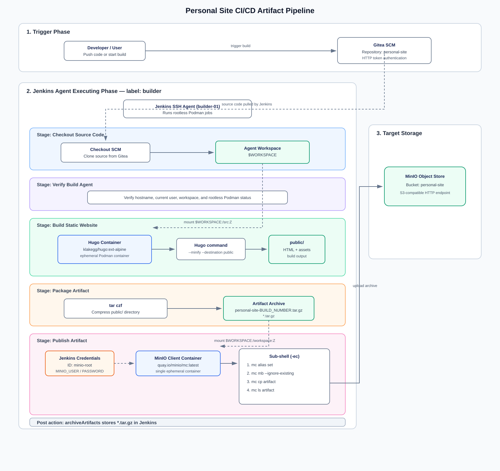

# WK-001 — Build Pipeline

Selamat datang di halaman utama dokumentasi **WK-001: Build Pipeline**. Document ini mencatat seluruh implementasi, arsitektur, dan catatan teknis terkait pembangunan **Continuous Integration (CI) Pipeline** untuk *personal site* menggunakan Jenkins, Podman (rootless), dan MinIO Object Storage.

---

## 🎯 Objective & Scope

* **Objective:** Membangun *Build Stage* terisolasi berbasis container untuk mengompilasi *source code* Hugo menjadi berkas statis, mengemasnya menjadi artefak, dan mengunggahnya ke Object Storage secara otomatis.
* **Scope:** Berfokus murni pada **Fase Build (CI)**. Tahapan *Deployment (CD)* dan *Validation* dicakup pada Worklog terpisah.

---

## 📊 Environment Status

Kondisi komponen lingkungan pada saat fase *Build Pipeline* ini diselesaikan:

| Component | Technology | Status | Role / Notes |
| ----------- | ------------ | -------- | -------------- |
| **SCM** | Gitea | ✅ Ready | Repository source code (`personal-site`) |
| **CI Engine** | Jenkins | ✅ Ready | Controller & SSH Agent (`builder-01`) |
| **Container Runtime** | Podman | ✅ Ready | Rootless execution engine |
| **Build Tool** | Hugo (Ext-Alpine) | ✅ Ready | Ephemeral build container |
| **Artifact Storage** | MinIO | ✅ Ready | S3-compatible storage (Bucket: `personal-site`) |

---

## 🏗️ Architecture & Pipeline Flow

Seluruh eksekusi pipeline berjalan secara otomatis di dalam *ephemeral container* pada Jenkins Agent.

---

## 📚 Technical Notes (TN) Index

Berikut adalah daftar rincian teknis pelaksanaan yang dipecah berdasarkan modul dan perannya dalam *Build Phase*:

### 1. Build Infrastructure & Environment

* **[TN-001: Initialize Jenkins Controller & Environment](TN-001-start-jenkins-container.md)** — Menjalankan container Jenkins, memverifikasi environment Jenkins, dan menginstal plugin yang diperlukan.
* **[TN-002: Deploy & Configure SSH Agent Node](TN-002-deploy-configure-ssh-agent-node.md)** — MMenyiapkan Jenkins SSH Agent (builder-01) sebagai lingkungan eksekusi terpisah untuk menjalankan job build pipeline.

### 2. SCM Integration & Pipeline Definition

* **[TN-003: Configure Gitea Repository Access](TN-003-configure-gitea-repository-access.md)** — Konfigurasi otentikasi SSH Key / Access Token untuk menghubungkan Jenkins dengan Gitea SCM.
* **[TN-004: Create Jenkinsfile](TN-004-create-jenkinsfile.md)** — Penulisan struktur deklaratif `Jenkinsfile` awal berbasis stage.
* **[TN-005: Create Build Pipeline & Execute Initial Test](TN-005-create-build-pipeline.md)** — Pembuatan item pipeline bertipe *Pipeline as Code* pada dashboard Jenkins dan eksekusi awal untuk memverifikasi pipeline.

---

## 🛠️ Troubleshooting & Troubleshooting Index

Pencatatan masalah teknis utama yang ditemukan beserta solusinya selama pengembangan Build Pipeline:

* **[Troubleshooting Log](troubleshooting.md)**
  * *SCM Checkout Failure (`Permission denied publickey`)*
  * *POSIX Shell Compatibility (`Illegal option -o pipefail`)*
  * *Groovy/Shell Variable Interpolation Collision*
  * *Hugo Compiling to Empty Artifact Fix*

---

## 🚀 Next Steps

Setelah fase **Build Pipeline** ini rampung dan artefak tersimpan rapi di MinIO:

1. Melanjutkan ke **WK-002: Deployment Pipeline (CD)** untuk menarik artefak dari MinIO dan men-deploy-nya ke Target Server (Nginx / Web Server).
2. Menambahkan tahapan automated testing / validation pada artefak yang di-deploy.
