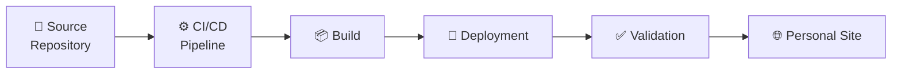

# 🚀 CI/CD Delivery Pipeline

## 🔍 Overview

Halaman ini menjelaskan proses **CI/CD Delivery Pipeline** pada project **Personal Site**.

Tahap ini berfokus pada proses mengubah **source code** yang dihasilkan pada tahap **Development** menjadi **static website** yang siap dipublikasikan. Proses tersebut dilakukan secara terotomasi melalui pipeline sehingga setiap perubahan dapat dibangun, dipublikasikan, dan diverifikasi secara konsisten.

Berbeda dengan tahap **Development** yang menghasilkan source code, tahap **CI/CD Delivery Pipeline** memastikan source code tersebut dapat dikirim (*deliver*) hingga menjadi website yang siap digunakan.

---

## 📌 Pipeline at a Glance

Tahap **CI/CD Delivery Pipeline** terdiri atas beberapa aktivitas berikut.

| Activity | Purpose |
|----------|---------|
| 📦 Build | Menghasilkan static website dari source code. |
| 🚀 Deployment | Mempublikasikan static website ke target environment. |
| ✅ Validation | Memastikan website berhasil dipublikasikan dan siap digunakan. |

---

## 🔄 Pipeline Workflow

Diagram berikut menggambarkan alur delivery mulai dari source code hingga website siap digunakan.

---

## 📦 Build

**Purpose**

Menghasilkan **static website** dari source code project sehingga siap dipublikasikan.

Tahap ini dijelaskan lebih rinci pada halaman **Build**.

---

## 🚀 Deployment

**Purpose**

Mempublikasikan hasil **Build** ke target environment.

Tahap ini dijelaskan lebih rinci pada halaman **Deployment**.

---

## ✅ Validation

**Purpose**

Memastikan hasil deployment berhasil dan website dapat diakses sesuai dengan target implementasi.

Tahap ini dijelaskan lebih rinci pada halaman **Validation**.

---

## 📦 Pipeline Output

Tahap **CI/CD Delivery Pipeline** menghasilkan output berikut.

| Artifact | Description |
|----------|-------------|
| Static Website | Website berhasil dibangun dari source code. |
| Deployed Website | Website berhasil dipublikasikan ke target environment. |
| Validation Result | Hasil verifikasi proses deployment. |

Output tersebut merupakan hasil akhir dari proses delivery project.

---

## ▶️ Next Steps

Setelah proses **CI/CD Delivery Pipeline** selesai, website **Personal Site** siap digunakan.

Setiap perubahan berikutnya akan mengikuti siklus yang sama, dimulai dari tahap **Development**, kemudian diproses kembali melalui **CI/CD Delivery Pipeline**.

---

## 🔗 Related Documentation

| Documentation | Description |
|---------------|-------------|
| Development | Tahap implementasi source code sebelum pipeline dijalankan. |
| Build | Menghasilkan static website dari source code. |
| Deployment | Mempublikasikan website ke target environment. |
| Validation | Memverifikasi hasil deployment. |

---

## 📝 Summary

Pada halaman ini telah dijelaskan:

- Gambaran umum **CI/CD Delivery Pipeline**.
- Tahapan **Build**, **Deployment**, dan **Validation**.
- Alur delivery dari source code hingga website siap digunakan.
- Output yang dihasilkan dari proses delivery.

Detail implementasi setiap tahapan dijelaskan pada dokumentasi **Build**, **Deployment**, dan **Validation**.