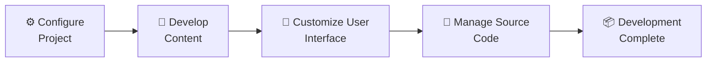

# 💻 Development

## 🔍 Overview

Halaman ini menjelaskan proses **Development** pada project **Personal Site**.

Tahap **Development** berfokus pada implementasi solusi melalui konfigurasi project, pengembangan konten, kustomisasi antarmuka, serta pengelolaan source code. Hasil dari tahap ini adalah **source code** yang siap diproses pada tahap **Build**.

---

## 📌 Development at a Glance

Tahap **Development** terdiri atas beberapa aktivitas berikut.

| Activity | Purpose |
|----------|---------|
| ⚙️ Configure Project | Menyesuaikan konfigurasi project sesuai kebutuhan. |
| 📝 Develop Content | Mengembangkan struktur dan konten website. |
| 🎨 Customize User Interface | Menyesuaikan tampilan dan pengalaman pengguna. |
| 🌿 Manage Source Code | Mengelola perubahan source code menggunakan Git. |

---

## 🔄 Development Workflow

Diagram berikut menggambarkan alur proses **Development** sebelum project memasuki tahap **Build**.



---

## ⚙️ Configure Project

**Purpose**

Menyesuaikan konfigurasi project agar sesuai dengan kebutuhan **Personal Site**.

**Implementation**

Konfigurasi project mencakup penyesuaian berbagai komponen yang menentukan perilaku dan struktur website, antara lain:

- Site Information
- URL Configuration
- Navigation Structure
- Theme Configuration
- Content Organization
- Output Configuration

Seluruh konfigurasi dikelola sebagai bagian dari source code sehingga dapat berkembang mengikuti kebutuhan project.

!!! abstract "References"

    - How-To → Hugo → Configure Hugo

**Verification**

Pastikan:

- Konfigurasi berhasil dimuat.
- Website dapat dijalankan tanpa error.
- Struktur navigasi ditampilkan dengan benar.

!!! note "Engineering Notes"

    Seluruh konfigurasi project disimpan pada Source Repository sehingga setiap perubahan dapat ditelusuri melalui histori Git.

---

## 📝 Develop Content

**Purpose**

Mengembangkan struktur dan konten website sesuai dengan kebutuhan **Personal Site**.

**Implementation**

Project **Personal Site** mengembangkan seluruh konten website menggunakan format **Markdown** yang ditempatkan pada direktori `content/`.

Struktur konten disusun berdasarkan kategori halaman yang akan dipublikasikan, misalnya:

```text
content/
├── about/
├── articles/
├── projects/
└── ...
```

Aktivitas pengembangan konten meliputi:

- Membuat halaman baru.
- Menambahkan artikel.
- Mengelola struktur direktori.
- Menambahkan gambar dan aset pendukung.
- Mengelola hyperlink antar halaman.

Seluruh perubahan dikelola sebagai bagian dari source code project.

!!! abstract "References"

    - How-To → Hugo → Create Home Page
    - How-To → Hugo → Create Content
    - How-To → Hugo → Manage Content

**Verification**

Pastikan:

- Struktur direktori sesuai dengan desain project.
- Seluruh halaman berhasil dibuat.
- Hyperlink antar halaman berfungsi dengan baik.
- Konten berhasil ditampilkan pada website.

!!! note "Engineering Notes"

    Seluruh konten website dikelola di dalam direktori `content/`, sedangkan aset pendukung ditempatkan mengikuti struktur project agar mudah dipelihara dan dikembangkan.

---

## 🎨 Customize User Interface

**Purpose**

Menyesuaikan tampilan website agar sesuai dengan kebutuhan **Personal Site**.

**Implementation**

Kustomisasi antarmuka dilakukan terhadap berbagai komponen visual website, antara lain:

- Theme Override
- CSS
- JavaScript
- Icons
- Fonts
- Mermaid Diagram
- Admonition
- Table Styling
- Responsive Layout

Seluruh penyesuaian dilakukan tanpa mengubah struktur dasar framework sehingga proses pemeliharaan dan upgrade tetap sederhana.

!!! abstract "References"

    - How-To → Hugo → Customize Theme

**Verification**

Pastikan:

- Tampilan website sesuai dengan desain.
- CSS berhasil diterapkan.
- JavaScript berjalan dengan baik.
- Seluruh komponen visual ditampilkan dengan benar.
- Website tetap responsif pada berbagai ukuran layar.

!!! note "Engineering Notes"

    Seluruh kustomisasi antarmuka dikelola sebagai bagian dari source code project sehingga mudah dipelihara dan dikembangkan.

---

## 🌿 Manage Source Code

**Purpose**

Mengelola perubahan source code selama proses pengembangan.

**Implementation**

Seluruh perubahan source code dikelola menggunakan **Git** dan disimpan pada **Gitea Source Repository**.

Aktivitas yang dilakukan meliputi:

- Melakukan commit perubahan.
- Mengelola histori perubahan.
- Melakukan sinkronisasi dengan Source Repository.
- Menjaga konsistensi source code selama proses pengembangan.

!!! abstract "References"

    - How-To → Git → Commit Changes
    - How-To → Git → Push Changes

**Verification**

Pastikan:

- Perubahan berhasil di-commit.
- Perubahan berhasil di-push ke Source Repository.
- Tidak terdapat konflik pada repository.

!!! note "Engineering Notes"

    Commit dilakukan secara bertahap mengikuti perkembangan implementasi sehingga histori perubahan lebih mudah dipahami dan proses penelusuran perubahan menjadi lebih efektif.

---

## 📦 Development Output

Tahap **Development** menghasilkan output berikut.

| Artifact | Description |
|----------|-------------|
| Project Configuration | Konfigurasi project telah diperbarui. |
| Website Content | Konten website telah dikembangkan. |
| User Interface Customization | Tampilan website telah disesuaikan. |
| Source Code | Source code project telah diperbarui. |
| Source Repository | Repository telah diperbarui dengan perubahan terbaru. |

Output tersebut menjadi input pada tahap **Build**.

---

## ▶️ Next Steps

Setelah proses **Development** selesai, project memasuki tahap **Build**.

Pada tahap tersebut source code diproses untuk menghasilkan **static website** yang siap dipublikasikan.

---

## 🔗 Related Documentation

| Documentation | Description |
|---------------|-------------|
| Setup | Persiapan lingkungan pengembangan. |
| Build | Menghasilkan static website dari source code. |
| Architecture | Desain solusi yang menjadi dasar implementasi. |

---

## 📝 Summary

Pada halaman ini telah dijelaskan:

- Konfigurasi project.
- Pengembangan konten website.
- Kustomisasi antarmuka.
- Pengelolaan source code.
- Output yang dihasilkan dari tahap **Development**.

Dengan selesainya tahap **Development**, seluruh implementasi project telah selesai dilakukan dan source code siap diproses pada tahap **Build** untuk menghasilkan static website.