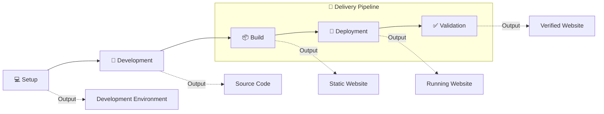

# 🛠️ Implementation

## 🔍 Overview

Halaman ini memberikan gambaran umum proses implementasi **Personal Site**, mulai dari persiapan lingkungan pengembangan hingga menghasilkan website yang telah tervalidasi.

Implementasi dibagi ke dalam beberapa fase yang saling berhubungan. Setiap fase menghasilkan artefak yang menjadi masukan bagi fase berikutnya sehingga proses implementasi dapat dilakukan secara konsisten dan mudah dipelihara.

Berbeda dengan dokumentasi **How-To**, halaman ini menjelaskan bagaimana teknologi diterapkan pada project **Personal Site**.

---

## 📌 Implementation at a Glance

Implementasi **Personal Site** terdiri dari tiga area utama.

| Phase | Purpose |
|--------|---------|
| 💻 Setup | Menyiapkan lingkungan pengembangan dan project. |
| 📝 Development | Mengembangkan source code dan konten website. |
| 🚀 Delivery Pipeline | Mengubah source code menjadi website yang telah tervalidasi melalui proses Build, Deployment, dan Validation. |

!!! info "Implementation Strategy"

    Implementasi dilakukan secara bertahap.

    Setup menyiapkan lingkungan pengembangan, Development menghasilkan source code, sedangkan Delivery Pipeline mengubah source code menjadi website yang siap digunakan melalui proses Build, Deployment, dan Validation.

---

## 🔄 Implementation Workflow

Diagram berikut menggambarkan lifecycle implementasi project **Personal Site** beserta artefak yang dihasilkan pada setiap fase.

---

## 📚 Implementation Phases

### 💻 Setup

Menyiapkan lingkungan pengembangan, repository, software, serta konfigurasi awal project.

**Output**

- Development Environment

---

### 📝 Development

Mengembangkan source code, konten website, dan kustomisasi project.

**Output**

- Source Code

---

### 🚀 Delivery Pipeline

Delivery Pipeline mengubah source code menjadi website yang telah tervalidasi melalui tiga tahapan.

#### 📦 Build

Menghasilkan static website dari source code.

**Output**

- Static Website

#### 🚀 Deployment

Mempublikasikan static website ke runtime environment.

**Output**

- Running Website

#### ✅ Validation

Memastikan website dan runtime berjalan sesuai implementasi.

**Output**

- Verified Website

---

## ▶️ Next Steps

Implementasi dimulai dari tahap **Setup**, yaitu menyiapkan lingkungan pengembangan dan project sebelum memasuki proses **Development**.

---

## 🔗 Related Documentation

| Documentation | Description |
|---------------|-------------|
| **Requirements** | Kebutuhan project dan lingkungan pengembangan. |
| **Technology Stack** | Teknologi yang digunakan pada project. |
| **Architecture** | Desain solusi yang menjadi dasar implementasi. |
| **Setup** | Menyiapkan lingkungan pengembangan dan project. |
| **Development** | Mengembangkan source code dan konten website. |
| **Build** | Menghasilkan static website. |
| **Deployment** | Mempublikasikan website ke runtime environment. |
| **Validation** | Memastikan deployment berjalan sesuai implementasi. |

---

## 📝 Summary

Pada halaman ini telah dijelaskan:

- Gambaran umum implementasi **Personal Site**.
- Fase-fase implementasi beserta artefak yang dihasilkan.
- Struktur **Delivery Pipeline** yang terdiri dari Build, Deployment, dan Validation.

Tahap pertama implementasi adalah **Setup**, yaitu mempersiapkan lingkungan pengembangan sebagai dasar untuk seluruh proses implementasi berikutnya.