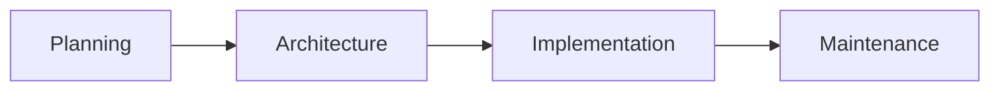

# Personal Site

## 🔍 Overview

**Personal Site** merupakan project yang bertujuan membangun sebuah website publik sebagai media untuk memperkenalkan profil profesional, membagikan artikel teknis, serta menyediakan *Curriculum Vitae* (CV) yang dapat diakses secara online.

!!! info "Pembeda dengan Handbook"
    Berbeda dengan **DevOps Engineering Handbook** yang berfokus pada dokumentasi teknis dan panduan implementasi internal, **Personal Site** ditujukan sebagai situs publik yang menyajikan informasi profesional serta artikel berdasarkan pengalaman di bidang **IT Infrastructure** dan **DevOps Engineering**.

### 📌 Solution Highlights

- **Static Site Generator (Hugo)** — Menghasilkan website statis dengan performa tinggi dan proses *build* yang sangat cepat.
- **Containerized Runtime (NGINX)** — Website dipublikasikan menggunakan NGINX Container sehingga deployment ringan, konsisten, dan *portable*.
- **Version Control (Git)** — Seluruh *source code* dan konfigurasi project dikelola menggunakan Git untuk mendukung *version control* dan pengembangan berkelanjutan.

---

## 📚 Scope

Pada implementasi awal, **Personal Site** difokuskan untuk menyediakan konten berikut:

- 👤 **About Me** — Profil singkat, pengalaman kerja, dan latar belakang profesional.
- 📝 **Articles** — Artikel teknis, opini, serta wawasan seputar IT Infrastructure, DevOps, Linux, Container, Cloud, dan Automation.
- 📄 **Curriculum Vitae (CV)** — Ringkasan keahlian, pengalaman, sertifikasi, dan portofolio profesional.

!!! tip "Implementation Scope"

    Project ini dirancang untuk dikembangkan secara bertahap.

    Dokumentasi ini berfokus pada implementasi project, sedangkan panduan penggunaan masing-masing teknologi dijelaskan secara terpisah pada bagian **How-To**.

---

## 🗂️ Documentation Structure

Dokumentasi project dibagi ke dalam beberapa fase utama berikut.

| Directory | Purpose |
|-----------|---------|
| **Planning** | Mendefinisikan tujuan, kebutuhan, dan teknologi yang digunakan. |
| **Architecture** | Mendeskripsikan desain solusi dan arsitektur sistem. |
| **Implementation** | Menjelaskan proses implementasi hingga deployment. |
| **Maintenance** | Menjelaskan aktivitas operasional dan pemeliharaan. |

Struktur dokumentasi disusun sebagai berikut.

| File / Folder | Description |
| :--- | :--- |
| **`index.md`** | Overview dan pengantar project |
| **`planning/`** | Perencanaan dan spesifikasi project |
| ├── `objectives.md` | Tujuan, ruang lingkup, dan manfaat project |
| ├── `requirements.md` | Kebutuhan fungsional, non-fungsional, software, hardware, dan lingkungan |
| └── `technology-stack.md` | Teknologi yang dipilih beserta alasan pemilihannya |
| **`architecture/`** | Desain solusi dan arsitektur sistem |
| └── `index.md` | Arsitektur logis, komponen, dan prinsip desain |
| **`implementation/`** | Implementasi solusi |
| ├── `index.md` | Overview implementasi dan workflow |
| ├── `setup.md` | Persiapan lingkungan pengembangan dan konfigurasi project |
| ├── `testing.md` | Pengujian manual proses build dan deployment |
| ├── `automation.md` | Otomatisasi build dan deployment menggunakan CI/CD Pipeline |
| └── `deployment.md` | Deployment website ke lingkungan runtime |
| **`maintenance/`** | Operasional dan pemeliharaan |
| └── `backup-and-recovery.md` | Strategi backup dan recovery |
| **`assets/images/`** | Gambar, diagram, dan ilustrasi |
| **`lessons-learned.md`** | Pengalaman, kendala, solusi, dan pembelajaran |
| **`references.md`** | Referensi dan dokumentasi eksternal |

---

## 🔄 Project Lifecycle

Dokumentasi **Personal Site** disusun mengikuti *software delivery lifecycle* sehingga setiap fase memiliki tujuan, aktivitas, dan hasil yang jelas.

| Phase | Goal |
|--------|------|
| **Planning** | Mendefinisikan tujuan project, kebutuhan sistem, serta teknologi yang digunakan sebagai dasar implementasi. |
| **Architecture** | Merancang solusi, komponen, dan hubungan antar komponen untuk memenuhi kebutuhan project. |
| **Implementation** | Mengimplementasikan solusi melalui proses setup, testing, deployment, dan otomatisasi secara bertahap. |
| **Maintenance** | Menjaga website tetap tersedia, aman, dan mudah dipelihara melalui aktivitas operasional dan pemeliharaan. |

Setiap fase menghasilkan artefak yang menjadi masukan bagi fase berikutnya sehingga proses pengembangan dapat dilakukan secara terstruktur, terdokumentasi, dan berkelanjutan.

---

## 👥 Target Audience

Dokumentasi ini ditujukan bagi:

- Infrastructure Engineer
- DevOps Engineer
- System Administrator
- Cloud Engineer
- Mahasiswa atau profesional yang ingin membangun **Personal Site** menggunakan Hugo.
- Siapa pun yang ingin mempelajari implementasi website statis menggunakan pendekatan **DevOps**.

---

## 🔗 Related Documentation

Project ini memanfaatkan beberapa teknologi yang telah didokumentasikan pada bagian **How-To**.

| Technology | Documentation |
|------------|---------------|
| Hugo | How-To → Hugo |
| Git | How-To → Git |
| Podman | How-To → Podman |
| NGINX | How-To → NGINX |

---

## 📝 Summary

Pada halaman ini telah dijelaskan:

- Gambaran umum project.
- Ruang lingkup implementasi.
- Struktur dokumentasi project.
- Software Delivery Lifecycle.
- Target pembaca dokumentasi.
- Hubungan antara project dan dokumentasi **How-To**.

Selanjutnya dokumentasi akan memasuki fase **Planning**, yaitu mendefinisikan tujuan, kebutuhan, dan teknologi yang menjadi dasar implementasi project.